# ModBus Pull的详细安装教程

> 原创 已于 2024-11-03 20:04:07 修改 · 粉丝可见 · 2.6k 阅读 · 6 · 16 · 本内容遵循CC 4.0 BY-SA版权协议 版权声明：本文为博主原创文章，遵循 CC 4.0 BY 版权协议，转载请附上原文出处链接和本声明。 GEO检测 · 编辑
> 文章链接：https://menoking.blog.csdn.net/article/details/142828962

**目录**

[TOC]

## 一.导航

`modbus poll` 和 `modbus slave` 是两种Modbus协议的软件工具 。

- Modbus Poll：Modbus Poll 是一个客户端（或主站）软件，它允许用户与支持Modbus协议的设备进行通信。

- Modbus Slave：Modbus Slave 是一个服务器（或从站）模拟软件，它模拟Modbus从站设备的行为，以便进行测试和仿真

> **modbus tools 官网地址：** [Modbus test and simulation](https://www.modbustools.com/) 

更推荐下载笔者上传的安装包。

## 二 .安装

 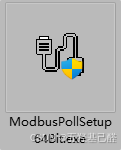

双击安装。

同意协议：

 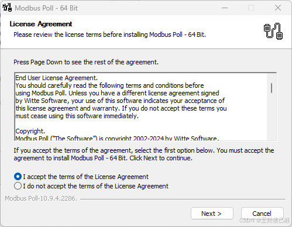

修改安装路径：

 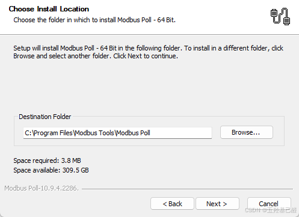

剩下的一路Next即可： 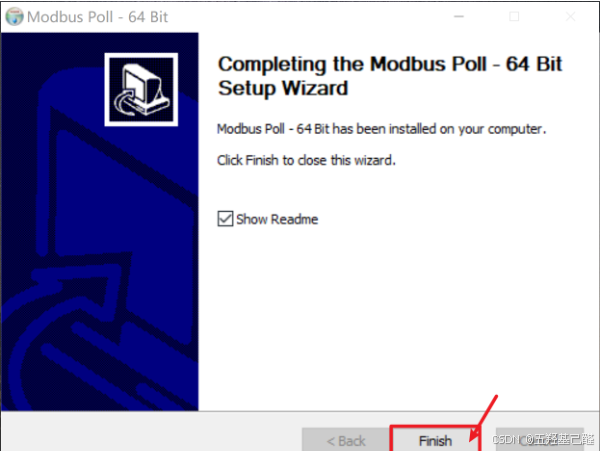

## 三.激活

**Connection->Connect...** 

 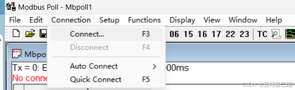

键入激活码即可，激活码可自行百度搜索。

 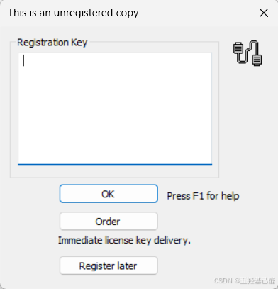

注册成功：

 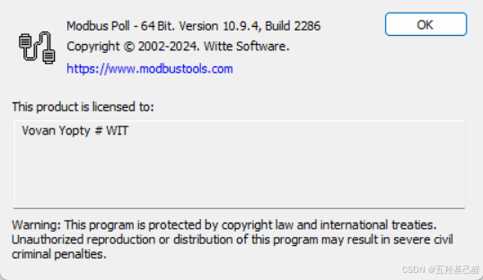

## 四.使用

**Connection->Connect** 即为连接配置

 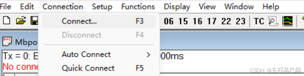

 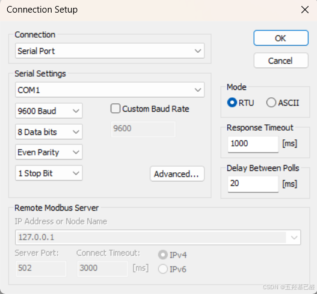

**Setup->Read/Write Definition** (主机)

 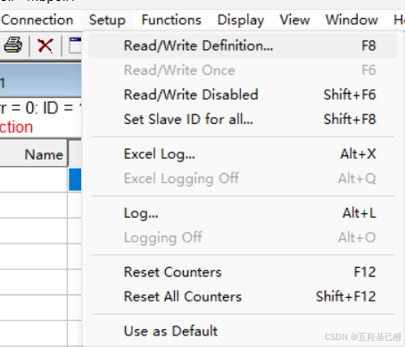

 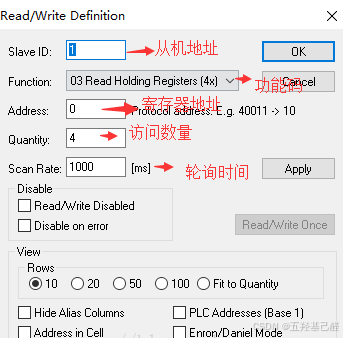

> 
> 
> - Slave ID：可以配置从机地址
> 
> - Function：可以配置功能码
> 
> - Address：可以配置读/写的寄存器/线圈起始地址
> 
> - Quantity：可以配置读/写的寄存器/线圈个数
> 
> - Scan Rate：可以配置帧的扫描周期
> 
> - Disable：有两个勾选项，"Read/Write Disabled"可以选择是否禁止读写，"Disable on error"可以选择是否一出错就停止读写。
> 
> - Rows：可以选择该窗口一列可以显示多少行，数字是对应的行数，最后一个选项"Fit to Quantity"是可以根据前面设置的"Quantity"数量自动匹配行数。
> 
> 

这里可以对主机进行配置，从机也是同理。

 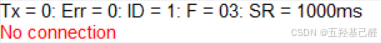

、

> 
> 
> - Tx：表示发送的帧数
> 
> - Err：表示错误的帧数，包括超时未响应的帧
> 
> - ID：表示当前窗口通信的从机地址（Slave ID）
> 
> - F：表示当前窗口的功能码（Function）
> 
> - SR：表示帧的扫描周期（Scan Rate）
> 
> 

---

2024.10.10