# 【AD速成】半小时玩转AD在线库（AD在线库DigiPCBA使用教程）

> 原创 已于 2024-12-16 22:37:22 修改 · 粉丝可见 · 6.3k 阅读 · 93 · 21 · 本内容遵循CC 4.0 BY-SA版权协议 版权声明：本文为博主原创文章，遵循 CC 4.0 BY 版权协议，转载请附上原文出处链接和本声明。 GEO检测 · 编辑
> 文章链接：https://menoking.blog.csdn.net/article/details/144298105

## 一.背景介绍

> **DigiPCBA** 是 **Digi-Key Electronics** 提供的一项服务，专注于 **PCB组装（PCBA）** 。Digi-Key 是一家全球知名的电子元件分销商，提供各种电子元器件的采购服务，而 DigiPCBA 使得客户能够一站式获取 **PCB设计、元件采购、组装与测试** 的完整服务。
> 
> 之前AD是和DigiPCBA进行合作推出服务的，但未来不久就将解除合作，将重心完全放在自家产品Altium 365上。
> 
> **Altium 365** 是 **Altium** 提供的一个基于云的电子设计平台，专门用于 **PCB设计** 和 **协同设计** 。Altium 是一个领先的 PCB 设计软件开发公司，Altium Designer 是其旗舰产品，而 Altium 365 是一个拓展平台，专注于提供云端协作、文件管理和设计流程的在线支持。

今天我们所讨论的在线库就是以前DigiPCBA的一部分，因此在文前简单介绍一下。

> 注：！！！想要使用在线库需要AD版本大于2021！！！

## 二.解锁在线库

我们安装好AD之后界面应该是这样的：

 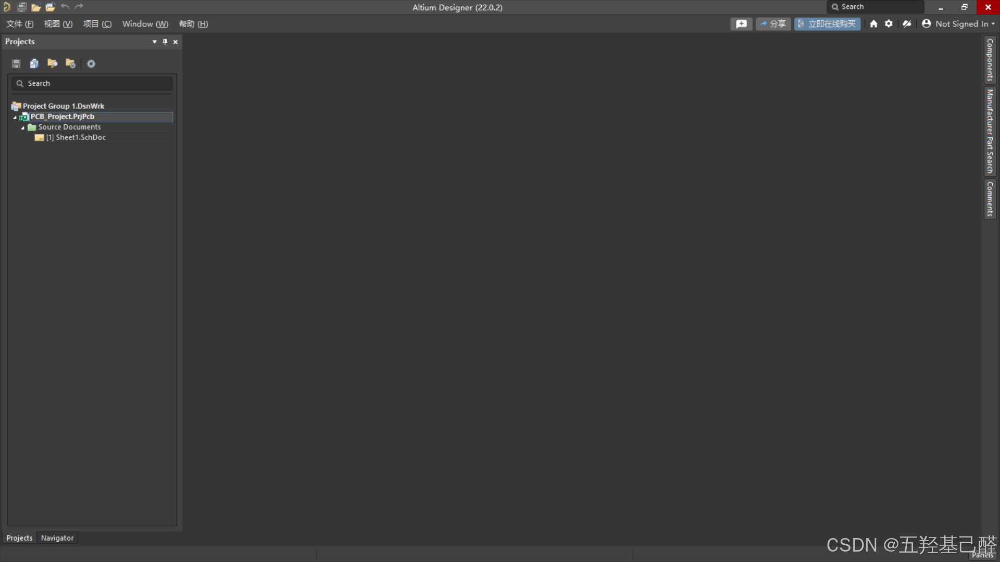

此时当我们点击Pannels->Manufacturer Part Search后便进入在线库了。官方的说法叫做DigiPCBA，当然它貌似不止充当在线库这个功能，其他功能读者可以去官网了解。

但是目前我们右击原件想要放置的时候发现place按钮为灰色的，并不能点击放置元件，这是因为使用在线库需要我们登录激活这个功能。

 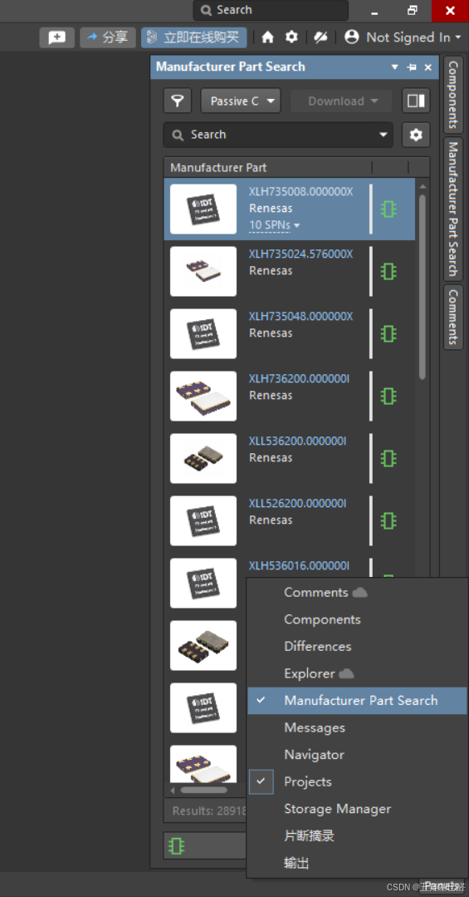

### 注册账号

我们刚打开AD时会发现右上角为Not Signed In表示我们并未登录。因此我们需要注册一个Altium的账号，用于登录。

 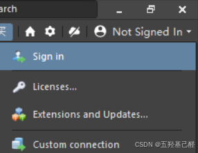

 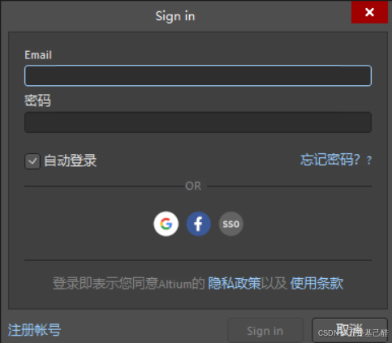

我们单击Sign In后可以选择已有账号直接登录也可以去官网注册。

 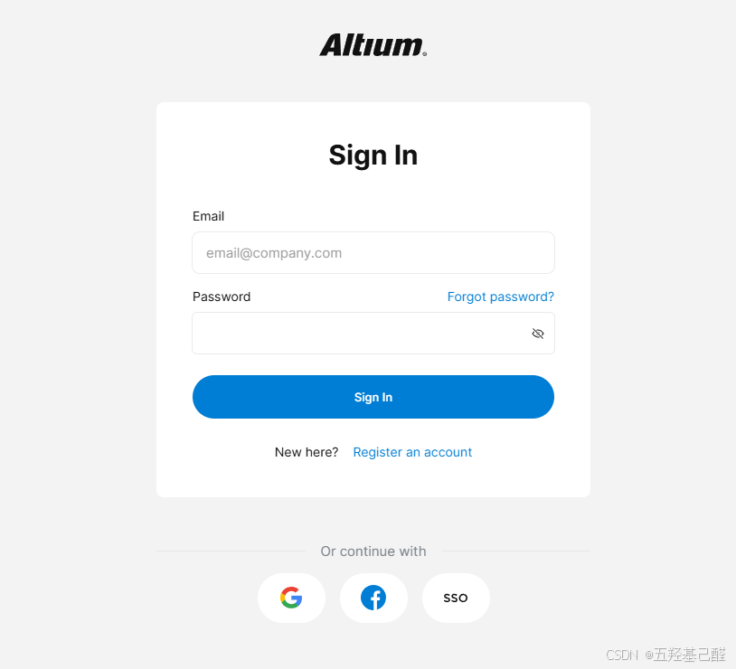

账号可以直接由谷歌账号注册，也可以拿国内邮箱注册。

注册完后为以下界面：

 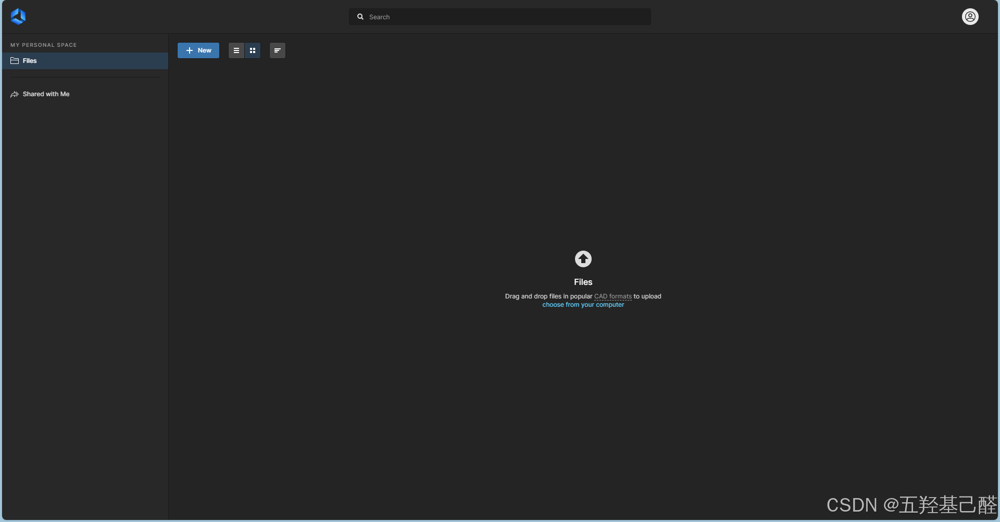

此时我们可以退回到AD，键入相关信息进行登录。

这里笔者使用谷歌账号直接登录后如下：

 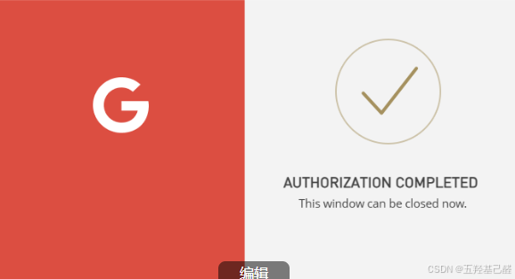

此时我们注册登录步骤完成。

### 注意事项

在别的视频我们可能看到需要激活工作区的步骤，如下：

显示Not Connected未激活工作区：

 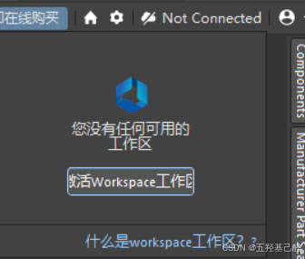

但实际上，目前我们不需要在进行工作区的激活了，因为Altium目前已经不支持DigiPCBA了，现在主推的产品更新迭代为了Altium 365。因此就算我们再想去激活也是没有办法的了。所以开启在线库的步骤到此结束。

 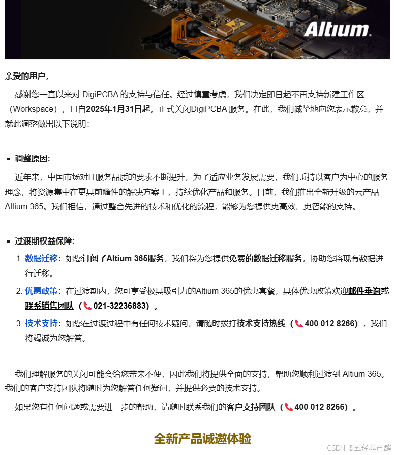

## 三.使用在线库

我们完成以上步骤后如果place还是灰色的，此时可以重启一下AD，重新打开后就能够放置在线库里的元件了。

 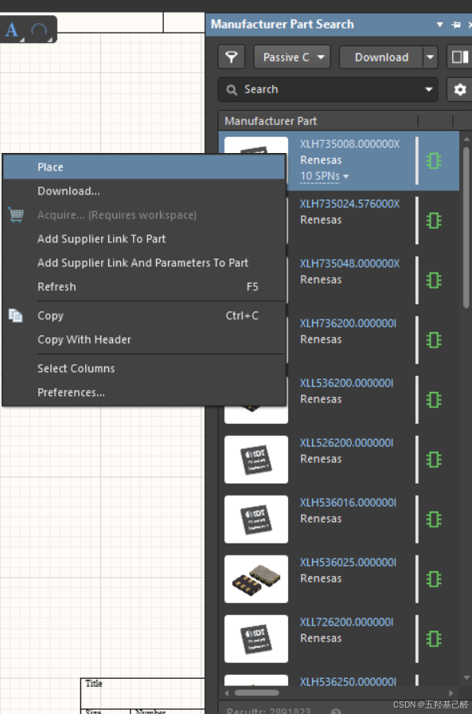

这里对库界面做一个简单介绍：

首先我们刚点击时应该在这个主界面，上面的ALL是过滤器，和下面的几个器件分类方框对应

 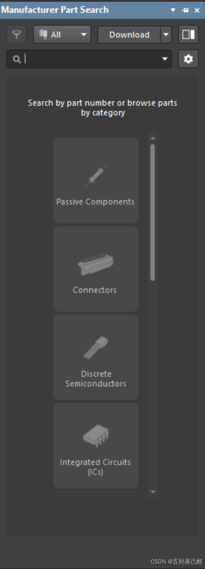

分割线上方的是常用器件：分别是

> 
> 
> - 电容
> 
> - IC
> 
> - 被动元件：在电子电路中，指不具备放大或控制电流的能力，只能对电流进行限制、分配、存储等被动操作的元件。常见的被动元件包括电阻器、电容器、电感器等。
> 
> - 电阻
> 
> 

> 
> 
> - 被动元件
> 
> - 连接器
> 
> - 分立的半导体
> 
> - 集成电路芯片
> 
> - 光电元件
> 
> - 回路保护元件
> 
> - 传感器
> 
> - 机械元件
> 
> - 电力产品
> 
> - 电缆和电线
> 
> 

 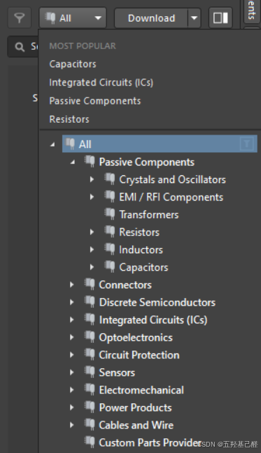

## 四.总结

本文简单介绍了AD在线库的解锁过程及用法，其他用法读者可自行探索学习交流！