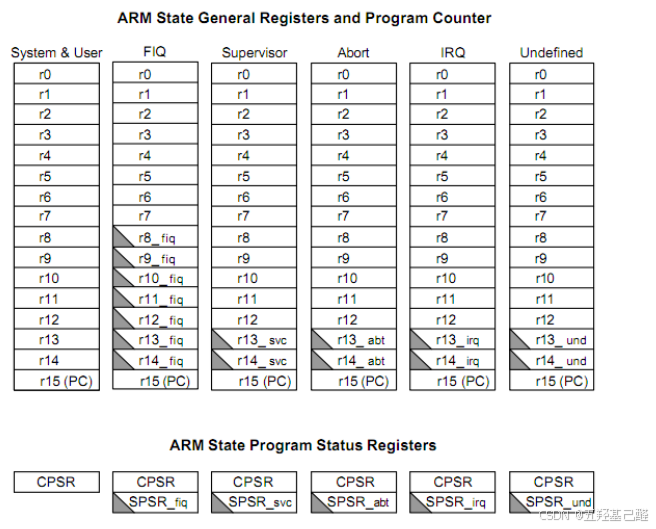

# 【ARM汇编速成】零基础入门汇编语言（ARM架构+汇编的实际应用）

> 原创 已于 2025-05-14 22:08:51 修改 · 粉丝可见 · 4.9k 阅读 · 38 · 79 · 本内容遵循CC 4.0 BY-SA版权协议 版权声明：本文为博主原创文章，遵循 CC 4.0 BY 版权协议，转载请附上原文出处链接和本声明。 GEO检测 · 编辑
> 文章链接：https://menoking.blog.csdn.net/article/details/142753169

**目录**

[TOC]


## 一.汇编的前世今生

> 汇编语言（Assembly Language）是任何一种用于电子 [计算机](https://baike.baidu.com/item/%E8%AE%A1%E7%AE%97%E6%9C%BA/140338?fromModule=lemma_inlink) 、 [微处理器](https://baike.baidu.com/item/%E5%BE%AE%E5%A4%84%E7%90%86%E5%99%A8/104320?fromModule=lemma_inlink) 、 [微控制器](https://baike.baidu.com/item/%E5%BE%AE%E6%8E%A7%E5%88%B6%E5%99%A8/6688343?fromModule=lemma_inlink) 或其他可编程器件的低级语言，亦称为 [符号语言](https://baike.baidu.com/item/%E7%AC%A6%E5%8F%B7%E8%AF%AD%E8%A8%80/15718762?fromModule=lemma_inlink) 。在汇编语言中，用 [助记符](https://baike.baidu.com/item/%E5%8A%A9%E8%AE%B0%E7%AC%A6/489287?fromModule=lemma_inlink) 代替 [机器指令](https://baike.baidu.com/item/%E6%9C%BA%E5%99%A8%E6%8C%87%E4%BB%A4/8553126?fromModule=lemma_inlink) 的 [操作码](https://baike.baidu.com/item/%E6%93%8D%E4%BD%9C%E7%A0%81/3220418?fromModule=lemma_inlink) ，用地址符号或 [标号](https://baike.baidu.com/item/%E6%A0%87%E5%8F%B7/7680733?fromModule=lemma_inlink) 代替指令或 [操作数](https://baike.baidu.com/item/%E6%93%8D%E4%BD%9C%E6%95%B0/7658270?fromModule=lemma_inlink) 的地址。在不同的设备中，汇编语言对应着不同的 [机器语言](https://baike.baidu.com/item/%E6%9C%BA%E5%99%A8%E8%AF%AD%E8%A8%80/2019225?fromModule=lemma_inlink) [指令集](https://baike.baidu.com/item/%E6%8C%87%E4%BB%A4%E9%9B%86/238130?fromModule=lemma_inlink) ，通过汇编过程转换成机器指令。特定的汇编语言和特定的机器语言指令集是 [一一对应](https://baike.baidu.com/item/%E4%B8%80%E4%B8%80%E5%AF%B9%E5%BA%94/18877366?fromModule=lemma_inlink) 的，不同平台之间不可直接移植。

汇编是上世纪五十年代人们为了摆脱机器语言的繁琐而创造的，因此，比起机器语言，汇编语言具有更高的机器 [相关性](https://baike.baidu.com/item/%E7%9B%B8%E5%85%B3%E6%80%A7/10097225?fromModule=lemma_inlink) ，更加便于记忆和书写，但又同时保留了机器语言高速度和高效率的特点。但汇编语言仍是 [面向机器的语言](https://baike.baidu.com/item/%E9%9D%A2%E5%90%91%E6%9C%BA%E5%99%A8%E7%9A%84%E8%AF%AD%E8%A8%80/56037283?fromModule=lemma_inlink) ，很难从其代码上理解程序设计意图，设计出来的程序不易被移植。

故而为了增加程序的效率与可移植性，在同时代，又诞生了第一个高级语言——Fortran。在高级语言下的今天，我们为何还要学习汇编呢？不仅是因为汇编独有的效率与速度，而且能帮助我们更好的理解底层，进行深入学习。

> 了解汇编语言会使人意识到：
> 
> - 程序如何与OS，处理器和BIOS交互；
> 
> - 内存和其他外部设备中数据的表示方式；
> 
> - 处理器如何访问和执行指令；
> 
> - 指令如何访问和处理数据；
> 
> - 程序如何访问外部设备。
> 
> 使用汇编语言的其他优点是：
> 
> - 它需要更少的内存和执行时间；
> 
> - 它可以更轻松地实现特定于硬件的复杂作业。
> 
> - 适用于时间紧迫的工作；
> 
> - 它最适合编写中断服务程序和其他内存驻留程序。
> 
> 

## 二.寄存器

我们对ARM的所有指令操作基本上都是建立在寄存器上的，所以在学习ARM汇编指令前我们必须先了解ARM内部的寄存器。

ARM 总共有 37 个寄存器，分为七个模式，但是每种模式下最多只能看到 18 个寄存器。（其中有些寄存器虽然同名，但在某种特定模式才会发挥特定作用，只有切换到对应模式时才能看到，这种设计叫做影子寄存器（banked register））。

- 37个寄存器都是 32 位长度。

- 37 个寄存器中 30 个为“通用”型，1 个固定用作 PC，一个固定用作 CPSR，5 个固定用作 5 种异常模式下的 SPSR。

- 上述的 30 个为“通用”型，是指这 30 个寄存器区别于后面的寄存器：PC 寄存器固定只能是 r15 寄存器，不能将其他寄存器作为 PC 寄存器使用； CPSR 和 SPSR 寄存器也是固定的，不能将其他寄存器作为 PC 寄存器使用。

 

七种模式：

> (1)USR(10000)：正常用户模式，程序正常执行模式。
> (2)FIQ(10001)：快速中断模式，以处理快速情况，支持高速数据传输或通道处理。
> (3)IRQ(10010)：外部中断模式，普通中断处理
> (4)SVC(10011)：操作系统保护模式(管理模式)，即操作系统使用的特权模式(内核)，处理软件中断swi  reset
> (5)abt(10111)：数据访问中止模式，用于 虚拟存储器 和 存储器 保护
> (6)und(11011)：未定义指令终止模式，用于支持通过软件仿真硬件的协处理器
> (7)sys(11111)：系统模式，用于运行特权级的操作系统任务( armv4 以上版本才具有)

功能：

> **R0-R3** ***用作传入函数参数，传出函数返回值*** 。在子程序调用之间，可以将 r0-r3 用于任何用途。
> 被调用函数在返回之前不必恢复 r0-r3。如果调用函数需要再次使用 r0-r3 的内容，则它必须保留这些内容。
> **R4-R11** **被用来存放函数的局部变量** 。如果被调用函数使用了这些寄存器，它在返回之前必须恢复这些寄存器的值。
> **R12** **是内部调用暂时寄存器 ip** 。它在过程链接胶合代码（例如，交互操作胶合代码）中用于此角色。
> 在过程调用之间，可以将它用于任何用途。被调用函数在返回之前不必恢复 r12。
> **R13** **是栈指针 sp** 。它不能用于任何其它用途。sp 中存放的值在退出被调用函数时必须与进入时的值相同。
> **R14** **是链接寄存器 lr** 。如果您保存了返回地址，则可以在调用之间将 r14 用于其它用途，程序返回时要恢复
> **R15** **是程序计数器 PC** 。它不能用于任何其它用途。
> 注意：在中断程序中，所有的寄存器都必须保护，编译器会自动保护R4～R11

## 三.ARM指令集

### 1.指令格式

ARM采用三地址指令格式：

> <div style="text-align:center;">&lt;opcode&gt;&nbsp; &nbsp;{&lt;cond&gt;}&nbsp; &nbsp;{S}&nbsp; &nbsp;&lt;Rd&gt;,&lt;Rn&gt;{,&lt;operand2&gt;}</div>

其中<>内容为必须的，{}为可选的。

> 
> 
> - `<opcode>` ：操作码，代表指令执行的操作类型，如加法（ADD）、减法（SUB）、移动（MOV）等。
> 
> - `{<cond>}` ：条件码，是可选的，用于指定指令执行的条件，如等于（EQ）、不等于（NE）、无符号大于（HI）等。条件码允许指令在满足特定条件时才执行。
> 
> - `{S}` ：标志位，是可选的，如果存在，表示指令执行后会影响CPSR（当前程序状态寄存器）的条件标志位（如N、Z、C、V）。
> 
> - `<Rd>` ：目标寄存器，指令执行结果的存放位置。
> 
> - `<Rn>` ：第一个操作数寄存器，通常包含源操作数。
> 
> - `{,<operand2>}` ：第二个操作数，是可选的，可以是立即数（一个常数）、寄存器或者寄存器加上一个偏移量。如果存在，它必须用逗号与 `<Rn>` 隔开。
> 
> 

> <div style="text-align:center;"><strong>提示：汇编中的注释符为';'。</strong></div>

### 2.寻址方式

即 **处理器根据指令信息找到操作数的方式：** 

1、立即数寻址( 操作数直接在指令中 mov R1，#3：将3放到R0)

> 立即数被表示为#immed_8，即常数表达式。

2、寄存器寻址

mov R0，R1：将R1的值放到R0中

> 操作数即为寄存器的数值。

3、寄存器间接寻址

mov R0，[R2]：将R2中的值为地址指向内存中的数放到R0中

> 操作数在寄存器值为地址指向的内存中

4、寄存器位移寻址

mov R0，R1，lsl#3：将R1中值左移3位放到R0中

> 当第二个数为位移方式时、将寄存器的值先位移处理得到操作数

5、寄存器基址寻址(也叫基址变址寻址)

LDR R0, [R1,   #4]：先将R1中的值加4 然后以结果为地址 对应的内存操作数放到R0

> 由间接寻址发展而来，先对寄存器中的值进行计算，再以结果为地址，取其指向内存值为操作数。

6、多寄存器寻址

STMIA R0！,{R2-R7,R12}：将 R2 到 R7 和 R12 放到 R0 指向的地址中

> 一条指令传送多个(最多16个)寄存器值

7、相对寻址

BL NEXT：跳转到NEXT标签处

> 以程序计数器 PC 的当前值为基地址，指令中的地址标号作为偏移量，将两者相加之后得到操作数的有效地址

8、拷贝寻址。将连续的寄存器值进行操作。

STMIA R0! ,{R1-R7}：将R1～R7的数据保存到R0指向的地址中

9、堆栈寻址。将栈用于操作数保存或者导出的操作。

STMFD SP!,{R1-R7,LR}：将R1~R7，LR入栈，SP更新。满递减堆栈

### 3.伪指令

汇编器定义了一些特殊的指令助记符，即伪指令（也叫做伪操作），它们就类似于C语言中的预处理命令，是为了方便对汇编程序做各种处理而生的。伪指令用于指导汇编器在汇编过程中执行特定的任务，如数据定义、内存分配、段定义等，它们在汇编程序转换成机器代码的过程中被处理，但在生成的机器代码中并不直接体现。

```cobol
/******************** 基础伪操作 ********************/
ALIGN 		;地址对齐
AREA		;用来定义一个代码段或数据段,常用的段属性为CODE/DATA
ENTRY		;指定汇编程序的执行入口
END			;用来告诉编译器源程序已到了结尾,停止编译
EQU			;赋值伪指令,类似宏,给常量定义一个符号名
 
CODE16/CODE32		;指示编译器后面的指令为THUMB/ARM 指令
EXPORT/GLOBAL		;声明一个全局符号,可以被其他文件引用
IMPORT/EXTERN		;引用其他文件的全局符号前,要先IMPORT
GET/INCLUDE			;包含文件,并将该文件当前位置进行编译,一般包含的是程序文件
INCBIN				;包含文件,但不编译,一般包含的是数据、配置文件等
 
/******************** 变量定义 ********************/
//全局变量定义
GBLA a				;定义一个全局算术变量a,并初始化为0
a SETA 10			;给算术变量a赋值为10
GBLL b				;定义一个全局逻辑变量b,并初始化为false
b SETL 20			;给逻辑变量b赋值为20
GBLS STR			;定义一个全局字符串变量STR,并初始化为0
STR SETS "123"		;给变量STR赋值为"123"
//局部变量定义
LCLA a				;定义一个局部算术变量a,并初始化为0
LCLL b				;定义一个局部逻辑变量b,并初始化为false
LCLS name			;定义一个局部字符串变量name,并初始化为0
name SETS "123"		;给局部字符串变量赋值
 
/******************** 数据定义 ********************/
DATA1 DCB 10,20,30,40	;分配一片连续的字节存储单元名为DATA1，并初始化
STR DCB "123"			;给字符串STR分配一片连续的存储单元并初始化
DATA2 DCD 10,20,30,40	;分配一片连续的字存储单元名为DATA2，并初始化
BUF SPACE 100			;给BUF分配100字节的存储单元并初始化为0
DATA 10,20,30,40		;定义了一个包含四个整数的数据集合
```

举例，下面我们实现了一个汇编子程序SUM_ASM，使用EXPORT伪操作将其声明为一个全局符号（这样其他汇编程序或C程序就可以直接调用它了），SUM_ASM自身又调用了其他子程序sum（这个sum子程序可以是一个汇编子程序，也可以是一个使用C语言定义的函数），在调用之前我们要先使用IMPORT伪操作把sum子程序导入进来，然后就可以直接使用BL指令跳转过去运行了。

```cobol
IMPORT sum
 
AREA SUM_ASM,CODE,READONLY
	EXPORT SUM_ASM
SUM_ASM
	STR LR, [SP, #-4]		;保存调用者的返回地址
	LDR R0, =0X3			;参数传递
	LDR R1, =0X4			;参数传递
	BL sum					;调用其他文件里的子程序
	LDR PC, [SP], #4		;返回主程序,继续运行
	END
```

### 4.基本指令

#### 4.1数据传输指令

> 
> 
> - 将数据从一个寄存器传递到另外一个寄存器。
> 
> - 将数据从一个寄存器传递到特殊寄存器，如 CPSR 和 SPSR 寄存器。
> 
> - 将立即数传递到寄存器。
> 
> 

| 指令 | 目的 | 源 | 描述 |
|:---:|:---:|:---:|:---:|
| MOV | R0 | R1 | 将 R1 里面的数据复制到 R0 中。 |
| MRS | R0 | CPSR | 将特殊寄存器 CPSR 里面的数据复制到 R0 中。 |
| MSR | CPSR | R1 | 将 R1 里面的数据复制到特殊寄存器 CPSR 里中。 |


#### 4.2存储器访问指令

| 指令 | 描述 |
|:---:|:---:|
| LDR Rd, [Rn , #offset] | 从存储器 Rn+offset 的位置读取数据存放到 Rd 中。 |
| STR Rd, [Rn, #offset] | 将 Rd 中的数据写入到存储器中的 Rn+offset 位置。 |


如：

```cobol
LDR   R0, =0X0209C004      ;将寄存器地址 0X0209C004 加载到 R0 中，即 R0=0X0209C004
```

```cobol
LDR     R0, =0X0209C004 	 ;将寄存器地址 0X0209C004 加载到 R0 中，即 R0=0X0209C004
LDR	 R1, =0X20000002 	  ;R1 保存要写入到寄存器的值，即 R1=0X20000002
STR	 R1, [R0] 		      ;将 R1 中的值写入到 R0 中所保存的地址中
```

#### 4.3压栈和出栈指令

| 指令 | 描述 |
|:---:|:---:|
| PUSH | 将寄存器列表存入栈中。 |
| POP | 从栈中恢复寄存器列表。 |


```cobol
PUSH 	{R0~R3, R12} 	;将 R0~R3 和 R12 压栈
 
POP   {LR}          ;先恢复 LR
POP   {R0~R3,R12}   ;再恢复 R0~R3,R12
```

或者可以这样写：

```cobol
 STMFD 	SP!,{R0~R3, R12} 	;R0~R3,R12 入栈
 STMFD 	SP!,{LR} 			;LR 入栈
 
 LDMFD 	SP!, {LR} 			;先恢复 LR
 LDMFD	 SP!, {R0~R3, R12}  ;再恢复 R0~R3, R12
 
```

#### 4.4跳转指令

| 指令 | 描述 |
|:---:|:---:|
| B | 跳转到 label，如果跳转范围超过了+/-2KB，可以指定 B.W使用 32 位版本的跳转指令， 这样可以得到较大范围的跳转 |
| BX | 间接跳转，跳转到存放于 Rm 中的地址处，并且切换指令集 |
| BL | 跳转到标号地址，并将返回地址保存在 LR 中。 |
| BLX | 结合 BX 和 BL 的特点，跳转到 Rm 指定的地址，并将返回地址保存在 LR 中，切换指令集。 |


**1 、B 指令（无条件分支）** 
这是最简单的跳转指令，B 指令会将 PC 寄存器的值设置为跳转目标地址， 一旦执行 B 指令，ARM 处理器就会立即跳转到指定的目标地址。如果要调用的函数不会再返回到原来的执行处，那就可以用 B 指令。

```cobol
    LDR R0, =#10     ; 将10加载到寄存器R0
    B loop           ; 无条件跳转到loop标签
next:
    LDR R1, =#20     ; 将20加载到寄存器R1
    B end            ; 无条件跳转到end标签
loop:
    ADD R0, R0, #1   ; R0 = R0 + 1
    CMP R0, #15      ; 比较 R0 和 15
    BNE loop         ; 如果 R0 不等于 15，跳转到loop标签
end:
    HALT             ; 停止执行
```

**2 、BL 指令（带链接的分支）** 
BL 指令相比 B 指令，在跳转之前会在寄存器 LR(R14)中保存当前 PC 寄存器值，所以可以通过将 LR 寄存器中的值重新加载到 PC 中来继续从跳转之前的代码处运行，这是子程序调用一个基本但常用的手段。比如 Cortex-A 处理器的 irq 中断服务函数都是汇编写的，主要用汇编来实现现场的保护和恢复、获取中断号等。但是具体的中断处理过程都是 C 函数，所以就会存在汇编中调用 C 函数的问题。而且当 C 语言版本的中断处理函数执行完成以后是需要返回到irq 汇编中断服务函数，因为还要处理其他的工作，一般是恢复现场。

```cobol
    LDR R0, =#10     ; 将10加载到寄存器R0
    BL subroutine    ; 跳转到子程序subroutine，并将返回地址保存在LR
    LDR R1, =#20     ; 将20加载到寄存器R1
end:
    HALT             ; 停止执行
subroutine:
    ADD R0, R0, #5   ; R0 = R0 + 5
    MOV PC, LR       ; 返回到调用点
```

#### 4.5算术运算指令

> 
> 
> - ADD Rd, Rn, Rm    Rd = Rn + Rm    加法运算，指令为 ADD
> 
> - ADD Rd, Rn, #immed    Rd = Rn + #immed    加法运算，指令为 ADD
> 
> - ADC Rd, Rn, Rm    Rd = Rn + Rm + 进位    带进位的加法运算，指令为 ADC
> 
> - ADC Rd, Rn, #immed    Rd = Rn + #immed +进位    带进位的加法运算，指令为 ADC
> 
> - SUB Rd, Rn, Rm    Rd = Rn – Rm    减法
> 
> - SUB Rd, #immed    Rd = Rd - #immed    减法
> 
> - SUB Rd, Rn, #immed    Rd = Rn - #immed    减法
> 
> - SBC Rd, Rn, #immed    Rd = Rn - #immed – 借位    带借位的减法
> 
> - SBC Rd, Rn ,Rm    Rd = Rn – Rm – 借位    带借位的减法
> 
> - MUL Rd, Rn, Rm    Rd = Rn * Rm    乘法(32 位)
> 
> - UDIV Rd, Rn, Rm    Rd = Rn / Rm    无符号除法
> 
> - SDIV Rd, Rn, Rm    Rd = Rn / Rm    有符号除法
> 
> 

#### 4.6逻辑运算指令

> 
> 
> 1. **AND（逻辑与）** 
> 
>    - 格式： `AND{<cond>} {S} <Rd>, <Rn>, <operand2>`
> 
>    - 作用：将 `<Rn>` 和 `<operand2>` 的每一位进行逻辑与操作，结果存储在 `<Rd>` 中。
> 
>    - 示例： `AND R1, R2, #0xFF` ；将 `R2` 的值与 `0xFF` 进行逻辑与，结果存储在 `R1` 中。
> 
> 2. **ORR（逻辑或）** 
> 
>    - 格式： `ORR{<cond>} {S} <Rd>, <Rn>, <operand2>`
> 
>    - 作用：将 `<Rn>` 和 `<operand2>` 的每一位进行逻辑或操作，结果存储在 `<Rd>` 中。
> 
>    - 示例： `ORR R1, R2, #0xF0` ；将 `R2` 的值与 `0xF0` 进行逻辑或，结果存储在 `R1` 中。
> 
> 3. **EOR（逻辑异或）** 
> 
>    - 格式： `EOR{<cond>} {S} <Rd>, <Rn>, <operand2>`
> 
>    - 作用：将 `<Rn>` 和 `<operand2>` 的每一位进行逻辑异或操作，结果存储在 `<Rd>` 中。
> 
>    - 示例： `EOR R1, R2, #0xAA` ；将 `R2` 的值与 `0xAA` 进行逻辑异或，结果存储在 `R1` 中。
> 
> 4. **BIC（位清除）** 
> 
>    - 格式： `BIC{<cond>} {S} <Rd>, <Rn>, <operand2>`
> 
>    - 作用：将 `<Rn>` 中与 `<operand2>` 对应的位设置为0，结果存储在 `<Rd>` 中。相当于对 `<operand2>` 取反后与 `<Rn>` 进行逻辑与操作。
> 
>    - 示例： `BIC R1, R2, #0x0F` ；将 `R2` 中低4位清零，结果存储在 `R1` 中。
> 
> 5. **MVN（位取反后移动）** 
> 
>    - 格式： `MVN{<cond>} {S} <Rd>, <operand2>`
> 
>    - 作用：对 `<operand2>` 进行位取反操作，结果存储在 `<Rd>` 中。
> 
>    - 示例： `MVN R1, #0xFF` ；将 `0xFF` 取反后的结果存储在 `R1` 中。
> 
> 

### 四.C语言与汇编混合编程

#### 1.混合编程前置条件

ATPCS规则（ARM-Thumb Procedure Call Standard），即定义了子程序调用的具体规则：

> ARM 程序要使用满递减堆栈， 入栈/出栈操作要使用STMFD/LDMFD指令
> 子程序间要通过寄存器R0～R3（可记作a0～a3）传递参数，当参数个数大于4时，剩余的参数使用堆栈来传递
> 子程序通过R0～R1返回结果
> 子程序中使用R4～R11（可记作v1～v8）来保存局部变量
> R12作为调用过程中的临时寄存器，一般用来保存函数的栈帧基址，记作FP
> R13作为堆栈指针寄存器，记作SP
> R14作为链接寄存器，用来保存函数调用者的返回地址，记作LR
> R15作为程序计数器，总是指向当前正在运行的指令，记作PC

#### 2.混合编程优势

- **性能优化** ：对于某些对性能要求极高的代码部分，使用汇编语言可以手动优化指令序列，提高执行效率。

- **硬件操作** ：某些硬件操作（如设置特定的CPU寄存器）只能通过汇编语言实现。

- **兼容性** ：在C语言标准中未定义的操作或旧硬件的特定功能可能需要汇编语言来实现。

#### 3.混合编程的实现

3.1在C程序中内嵌汇编代码

- 通过ARM编译器在ANSI C标准的基础上扩展的关键字__asm，我们就可以在C程序中内嵌ARM汇编代码。（在内嵌的汇编代码中添加注释，要使用C语言的/**/注释符，而不是汇编语言的分号注释符。）

- 不同的编译器基于ANSI C标准扩展了不同的关键字，使用的汇编格式可能不太一样。如GNU ARM编译器提供了一个__asm__关键字，__asm__的后面还可以选择使用__volatile__关键字修饰，用来告诉编译器不要优化这段代码。

```cobol
__asm
{
	指令  /*注释*/
	...
	[指令]
}
```

```markdown
__asm__ __volatile__
	{
		"汇编语句;"
		...
		"汇编语句;"
	}

```

具体步骤：

> 
> 
> 1. **编写汇编代码** ：首先，你需要编写汇编代码片段，通常这些代码片段是独立的功能模块。
> 
> 2. **声明外部函数** ：在C语言中，使用 `extern` 关键字声明汇编函数，这样C编译器知道这些函数在其他地方定义。
> 
>    ```csharp
>    extern void assembly_function();
>    ```
> 
> 3. **汇编代码中的函数标签** ：在汇编代码中，使用特定的标签来标识可以被C代码调用的函数。
> 
>    ```cobol
>    ; 假设使用的是ARM汇编
>    .global assembly_function
>    assembly_function:
>        ; 汇编指令
>        BX lr
>    ```
> 
> 4. **调用汇编函数** ：在C代码中，像调用普通C函数一样调用汇编函数。
> 
>    ```csharp
>    int main() {
>        assembly_function();
>        return 0;
>    }
>    ```
> 
> 

实例：

```cpp
#include <stdio.h>
 
int main() {
    int a = 10;
    int b = 20;
    int result;
 
    // 使用GCC的内嵌汇编语法
    __asm__ (
        "addl %%ebx, %%eax;" // 将ebx寄存器的值加到eax寄存器上
        : "=a" (result)      // 输出操作，将eax寄存器的值存储到result变量中
        : "a" (a), "b" (b)   // 输入操作，将变量a的值加载到eax寄存器，将变量b的值加载到ebx寄存器
    );
 
    printf("The result is: %d\n", result);
    return 0;
}
```

3.2在汇编中调用C程序

```cpp
//汇编文件
IMPORT sum
AREA SUM_ASM,CODE,READONLY
	EXPORT SUM_ASM
SUM_ASM
	MOV RO, 0X0			;arg1-->R0
	MOV R1, 0X1			;arg2-->R1
	MOV R2, 0X2			;arg3-->R2
	MOV R3, 0X3			;arg4-->R3
	
	MOV R4, 0X5			;arg6-->SP,注意这里不是第五个参数，因为栈的特点是先进后出
	STR R4, [SP, #-4]
	MOV R4, 0X4			;arg5-->SP
	STR R4, [SP, #-4]
	BL sum
	MOV PC,LR
	END
 
//C文件
int sum(intb,intc,int c,int d,int d,int f)
{
	int result=0;
	printf("result=%d\n", result);
	return result;
}
 
int main(void)
{
	SUM_ASM();
	return 0;
}
```

---

如有错误，感谢指正

2024.10.8