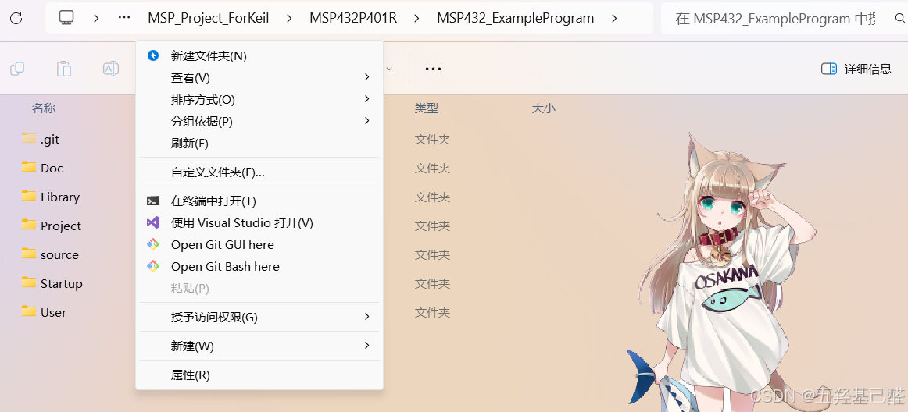
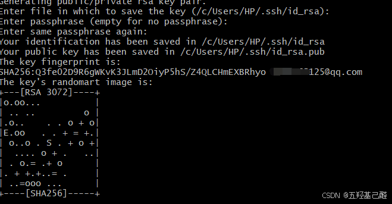
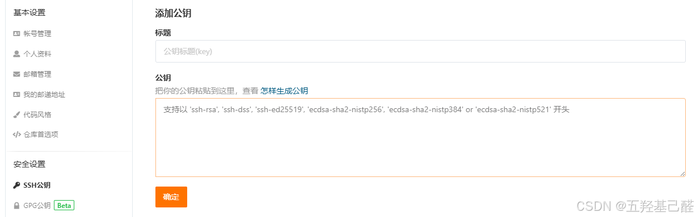
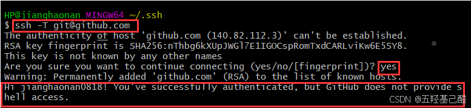
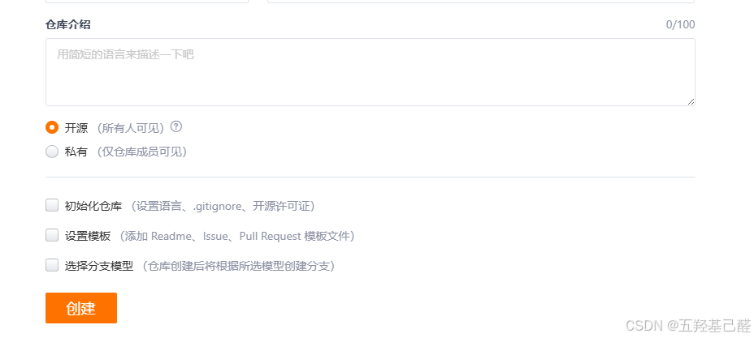
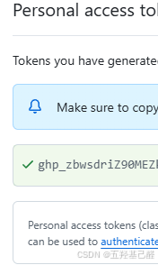

# 【Git快速入门】Git代码管理手册与协同开发（Git教程）

> 原创 已于 2026-01-13 10:49:29 修改 · 粉丝可见 · 1.6k 阅读 · 32 · 25 · 本内容遵循CC 4.0 BY-SA版权协议 版权声明：本文为博主原创文章，遵循 CC 4.0 BY 版权协议，转载请附上原文出处链接和本声明。 GEO检测 · 编辑
> 文章链接：https://menoking.blog.csdn.net/article/details/142713739

**目录**

[TOC]


## 一.简介与环境搭建

专有名词索引：

> 
> 
> - **Git：分布式版本控制系统**
> 
> - **版本库：又名仓库（Repository）。** 
> 
>   - **暂存区:stage（或者叫index）,是在版本库里的一个暂存区域。**
> 
> - **工作区：工程文件夹（Working Directory）**
> 
> - **远程库：remote**
> 
> 

### 1.安装

详细安装步骤建议参考别的文章，这里不过多赘述。

附上几个下载网站：

> 
> 
> - 官网： [https://git-scm.com/](https://git-scm.com/)
> 
> - 阿里镜像站： [CNPM Binaries Mirror](https://registry.npmmirror.com/binary.html?path=git-for-windows/)
> 
> 

### n.注册账户

安装完Git之后，要做的第一件事就是设置你的用户名和邮件地址。这步操作是针对本地Git客户端的配置。

```csharp
git config --global user.name "你的用户名"  
git config --global user.email "你的邮箱地址"  
 
```

用处如下：

> 
> 
> 1. **提交信息** ：每次你进行提交（commit）时，Git都会使用这些信息来记录谁做了这次提交。这些信息将作为提交历史的一部分永久保存在版本库中。
> 
> 2. **标签信息** ：当你创建标签（tag）时，这些信息也会被包含在标签信息中。
> 
> 3. **补丁信息** ：如果你创建了一个补丁（patch），这些信息也会被包含在内
> 
> 

下句可查看是否配置成功，返回的命令最底部会有账户信息:

```lua
git config --list  
```

## 二.基本操作

> 在进行操作前我们必须明白的是：Git管理是以文件夹为单位的，所有的操作都只对该文件夹生效。

### 1.创建和提交

可以任意创建一个文件夹，然后在此文件夹目录下右键打开Git Bash 

之后键入

```csharp
git init
```

就在此工作区内创建完版本库了。

使用下面的命令可以将单个文件添加到暂存区：

```csharp
git add readme.txt
```

或者添加工作区内的全部文件或工程：

```csharp
git add .
```

最后使用：

```sql
git commit -m "1.0"
```

提交暂存区内的所有文件到版本库，其中 **`-m`** 后面输入的是本次提交的说明。

### 2.版本回退

使用下列命令可以查看提交的每个版本：

```perl
git log
```

```cobol
commit 1094adb7b9b3807259d8cb349e7df1d4d6477073 (HEAD -> master)
Author: xxx <xxx.com>
Date:   Fri May 18 21:06:15 2018 +0800
 
    3.0
 
commit e475afc93c209a690c39c13a46716e8fa000c366
Author: xxx <xxx.com>
Date:   Fri May 18 21:03:36 2018 +0800
 
    2.0
 
commit eaadf4e385e865d25c48e7ca9c8395c3f7dfaef0
Author: xxx <xxx.com>
Date:   Fri May 18 20:59:18 2018 +0800
 
    1.0
```

在后面返回的信息中你可以清晰的看到以往版本的版本号,作者，版本日期以及提交说明等。

键入以下命令即可回退到上个版本：

```perl
git reset --hard HEAD^
```

其中，

> 
> 
> - 上一个版本就是 `HEAD^` ，上上一个版本就是 `HEAD^^` ，当然往上100个版本写100个 `^` 比较容易数不过来，所以写成 `HEAD~100` 。
> 
> - `--hard` 会回退到上个版本的已提交状态，而 `--soft` 会回退到上个版本的未提交状态， `--mixed` 会回退到上个版本已添加但未提交的状态。
> 
> 

但是如果我后悔回退到某个版本了，像更新回去的话，就必须知道这个版本的版本号，然后使用

```cobol
git reset --hard 1094a
```

来回溯到之后的某个版本。笔者这里版本号只输入了几位，实际上，这里版本号可以不用打全，只需要能唯一表示某个版本即可。

如果不巧的是你忘记了版本号，那你可以用

```undefined
git reflog
```

去查询你在当前版本库里的所有命令，同时它会返回带有版本号的信息！

### 3.查看工作区状态

这里的操作很简单，键入以下命令后，我们可以看到当前工作区的所有文件状态，包括是否暂存，是否提交等等。

```lua
git status
```

### 4.撤销修改

```sql
git checkout -- readme.txt
```

即让某个文件返回到最近一次 **被提交或被暂存时** 的状态。

### 5.删除文件

首先手动删除工作区内部的文件，然后使用

```bash
git rm test.txt
```

删除版本库中的文件

或直接提交

```sql
git commit -m "remove test.txt"
```

就算彻底删除。

如果在版本库未删除，而工作区中误删了文件的话

```sql
git checkout -- test.txt
```

使用这个命令也可以恢复到版本库里的版本。

## 三.协同开发

### 1.远程仓库

#### 配置公钥：

```perl
ssh-keygen -t rsa -C "xxx@gmail.com"
```

双引号内部可以键入你的邮箱。执行此命令时一直回车保持默认即可。

出现下面的界面即为成功

 

接着打开ssh-agent（密钥管理器）：

```bash
eval "$(ssh-agent -s)"
```

或者

```typescript
eval `ssh-agent`
```

都可以。打开之后执行：

```typescript
ssh-add ~/.ssh/id_rsa
```

即可将SSH密钥添加到 ssh-agent进行管理。

上述命令执行完后会在C盘下的用户->"你的用户名"->.ssh内部生成一个私钥和一个公钥（即.pub结尾的文件）。或者 通过这个命令也可以查看公钥：

```typescript
cat ~/.ssh/id_rsa.pub
```

将公钥内部的内容复制到你的远程仓库的客户端内部，这里以Gitee为例，账号设置内有个SSH公钥，复制到此即可。

 

> SSH是一种端对端的网络协议，我们在使用远程仓库时建立SSH连接可以提高安全性和便携性，感兴趣的读者可以自行搜索。

使用以下命令验证：

```typescript
ssh -T git@github.com
```

若出现

 

即为成功。

#### 新建仓库：

 

新手的话可以先不初始化舱口，默认建立就好。

---

#### 以下方法适用于Gitee：

> 注意以下为 **gitee** 的推送方法，如今GitHub已经改变了规则，仍然使用下列方法极有可能不成功 ！

添加远程仓库：

```sql
git remote add origin git@gitee.com:xxx/xxx.git
```

后面的为你的仓库地址（也叫做SSH克隆地址）。

> 这里是把后面的仓库名字针对本地GIt设置为origin，如果要添加多个远程仓库的话，后面添加的仓库就不能叫这个名字了。

推送到远程仓库：

```perl
git push -u origin master
```

> 这里将本地主分支master提交到远程仓库origin的主分支master， **-u** 是同时对它们进行关联，下次再提交时就不需要加-u了。

即，

先关联仓库

```csharp
git push --set-upstream origin master
```

然后再推送

```perl
git push origin master
```

**强制** 推送（ **覆盖远程仓库** ）：

```perl
git push origin master -f
```

从远程仓库拉取：

```undefined
git pull origin master
```

**强制** 拉取（ **覆盖到本地** ）：

```undefined
git pull -f
```

---

#### 以下方法适用于 **GitHub** ：

添加远程仓库：

在settings->Developer settings->Personal access tokens中任选一个进行个人令牌的创建，推荐Fine-grained tokens简易版，创建完成后复制此Token。

！！！注意：此Token只出现一次，退出界面后就不会再出现！！！

 

然后按照下列格式添加远程仓库：

```cobol
// <your_token>：包括<>在内的全部字符替换成你的token
// <USERNAME>：包括<>在内的全部字符替换成你的username
// <REPO>：包括<>在内的全部字符替换成你要访问的仓库名称
 
git remote set-url origin  https://<your_token>@github.com/<USERNAME>/<REPO>.git
```

如果是新创建的仓库则在输入账号密码处用密钥替换密码即可

```cobol
$ git clone https://github.com/username/repo.git
Username: your_username
Password: your_token
```

推送：

之后照常推送即可：

```less
git push origin main
```

> 如果推送报错fatal: unable to access 'https://github.com/menoking/MPU6050_DMP.git/': Failed to connect to github.com port 443 after 21091 ms: Couldn't connect to server
> 取消代理即可
> 
> ```php
> git config --global --unset http.proxy 
> git config --global --unset https.proxy
> ```

---

删除远程仓库：

```bash
 git remote rm origin
```

origin是你想删除仓库的名字。

#### 从远程库克隆工程：

```scss
git clone git@gitee.com:xxx/xxx.git
```

### 2.分支管理

#### 创建并切换分支：

```css
git checkout -b dev
```

相当于

```undefined
git branch dev
git checkout dev
```

新版命令，创建并切换：

```r
git switch -c dev
```

单独切换：

```csharp
git switch master
```


#### 查看所有分支：

```undefined
git branch
```

#### 指定分支合并到当前分支：

```sql
git merge dev
```

> 该命令为Fast forward模式，进行合并，合并后删除分支会丢失信息。

```perl
git merge --no-ff -m "merge with no-ff" dev
```

> --no-ff，保留合并的历史信息

#### 删除分支：

```undefined
git branch -d dev
```

### 3.多人协同

> 一般来说远程库的默认名称为origin

```undefined
git remote -v
```

可以查看远程仓库的详细信息。

```perl
git push origin master
git push origin dev
```

上面两句命令分别可以推送主支和分支对远程仓库进行推送。

如果你想要推送本地分支到远程仓库的不同分支，可以使用以下命令格式：

```cobol
git push <远程仓库> <本地分支>:<远程分支>
```

例如：

```perl
git push origin dev:feature
```

> 如果没有指定远程分支，Git 会尝试将本地分支推送到远程仓库中同名的分支。如果远程仓库中没有同名的分支，Git 会自动创建一个新的分支。

协同开发时，如果克隆远程仓库到本地，在本地只能看到该工程的 master分支，如果要再dev分支上开发，则需要自己在本地创建。

```bash
git checkout -b dev origin/dev
```

如果团队在对dev分支进行修改后，你也想向这个分支提交你自己的修改，且你们的修改产生了冲突（对同一个文件进行修改了），则你必须先对远程的dev分支进行拉取后再进行你的修改。

创建并关联dev分支：

```vbscript
git branch --set-upstream-to=origin/dev dev
```

然后进行拉取

```undefined
git pull
```

最后手动解决冲突后就可以进行推送了。

## 四.总结

以上内容只是笔者的学习记录，而且只写了一些较为简单的操作，还有一些很复杂的操作笔者也没有弄清楚，所以就没有一一写出来，实际过程中可能还会出现各种各样的问题，但是对出现的错误进行搜索一般都能找到解决的帖子，希望大家能在开源的技术氛围中共同进步！

---

如有错误，感谢指正！

2024.10.5