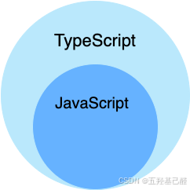
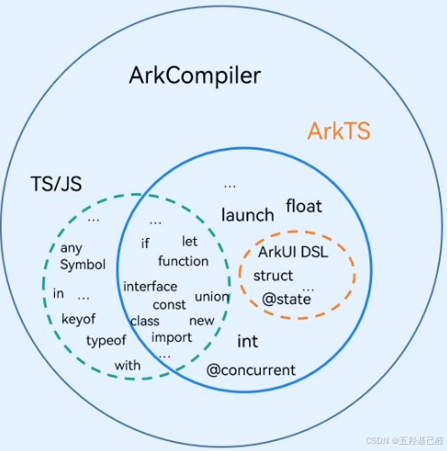
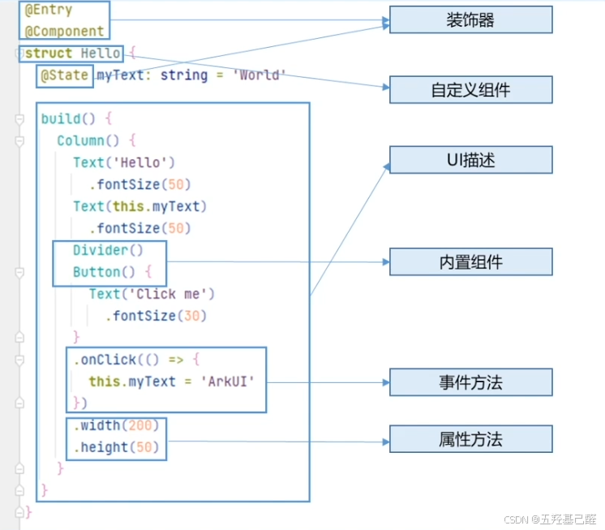
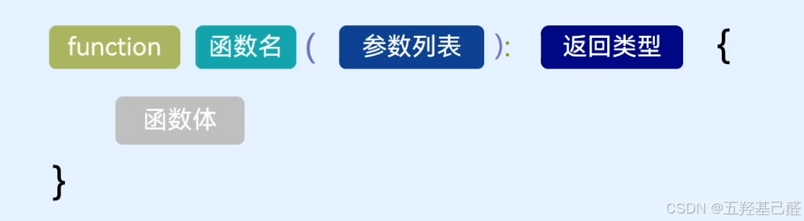
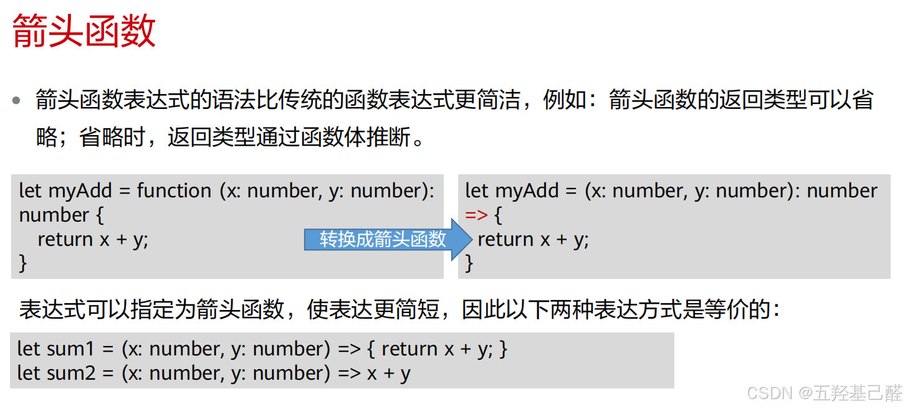
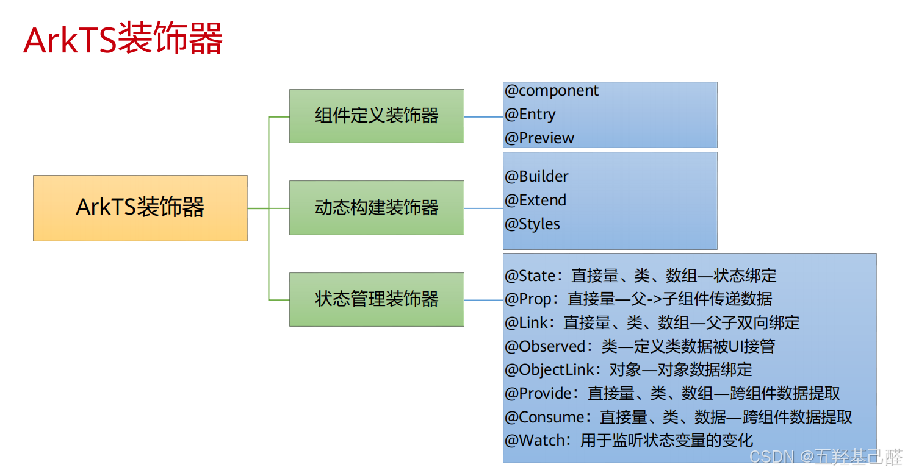
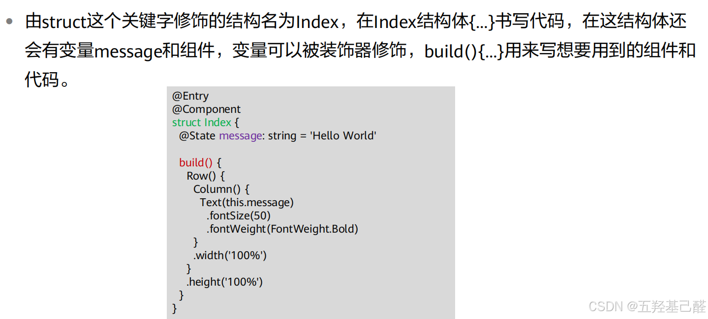
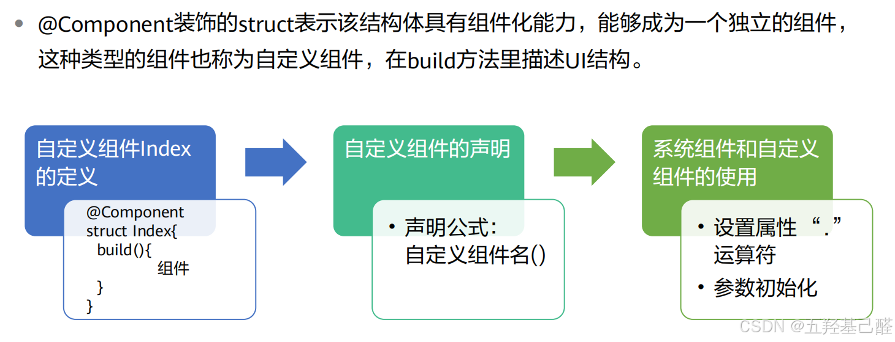
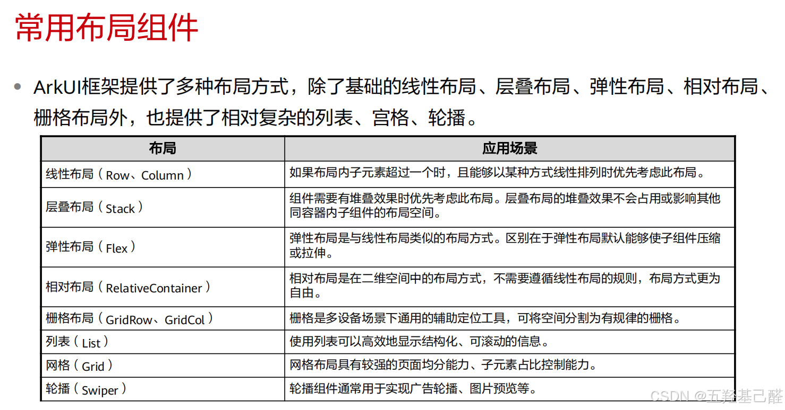

# 【HarmonyOS开发】ArkTS基础语法及使用（鸿蒙开发基础教程）

> 原创 已于 2024-11-12 14:17:55 修改 · 粉丝可见 · 4k 阅读 · 66 · 24 · 本内容遵循CC 4.0 BY-SA版权协议 版权声明：本文为博主原创文章，遵循 CC 4.0 BY 版权协议，转载请附上原文出处链接和本声明。 GEO检测 · 编辑
> 文章链接：https://menoking.blog.csdn.net/article/details/143259080

**目录**

[TOC]


## 一.ArkTS的来世今生

> <div style="text-align:center;"><strong>&nbsp;ArkTS是HarmonyOS生态的应用开发语言。</strong></div>

- ArkTS提供了声明式UI范式、状态管理支持等相应的能力，让开发者可以以更简洁、更自然的方式开发应用。

- 同时，它在保持TypeScript(简称TS，是一种给 JavaScript 添加特性的语言扩展)基本语法风格的基础上，进一步通过规范强化静态检查和分析，使得在程序运行之前的开发期能检测更多错误，提升代码健壮性，并实现更好的运行性能。

  - TypeScript 是 JavaScript 的超集，扩展了 JavaScript 的语法，因此现有的 JavaScript 代码可与 TypeScript 一起工作无需任何修改，TypeScript 通过类型注解提供编译时的静态类型检查。TypeScript 可处理已有的 JavaScript 代码，并只对其中的 TypeScript 代码进行编译。

- 针对JS/TS并发能力支持有限的问题，ArkTS对并发编程API和能力进行了增强。

- ArkTS支持与TS/JS高效互操作，兼容TS/JS生态。

 

 

## 二.结构概览

 

## 三.语法详述

### 1.声明

 

变量（可以改变）：

```TypeScript
let count:number 0;
```

常量（无法修改）：

```TypeScript
const MAX COUNT:number 100;
```

### 2.类型

> 基本类型：string、number、.boolean等
> 引用类型：Object、.Array、自定义类等
> 枚举类型：Enum
> 联合类型：Union
> 类型别名：Aliases

#### 基本类型

```TypeScript
let name:string ='Xiaoming';//字符
let age:number 20;//数字
let isMale:boolean true;//布尔
```

#### 引用类型

```TypeScript
//数组
let students:Array<string>['Xiaoming','Xiaozhang','Xiaowang','Xiaoli'];
let students:string[]=['Xiaoming','Xiaozhang','Xiaowang','Xiaoli'];
 
//类
class User{...}
let user:User = new User();
//或
var obj = {name="xiaoming"};//创建一个对象
obj.name = "xiaomei";//改变属性
obj.age = 20;//增加属性并赋值
```

#### 枚举类型

```TypeScript
//枚举
enum Color{
    Red,
    Blue,
    Green
}
let favouriteColor:Color = Color.Red;
```

#### 联合类型

一个变量拥有多个类型

```TypeScript
//联合
let luckyNum:number|string = 7;
luckyNum = 'seven';
```

#### 类型别名

允许给类型起一个别名，方便理解和使用

```TypeScript
//别名
type Matrix = number[][];
type Nullableobject = object | null;
```

### 3.基本知识

#### 注释

同C/C++一样，注释以"//"双斜杠表示。

#### 空安全

一般来说，有时会存在声明变量时不确定初始值。在这类情况下，通常使用联合类型包含null值

```TypeScript
let name:string null = null
```

**在使用时要先对其进行非空校验** ：

> 有以下三种方法来完成空安全机制
> 1、使用if/else进行判空
> 
> ```TypeScript
> if (name != null){/*do something */}
> ```
> 
> 2、使用空值合并表达式，？左边的值为ul时会返回表达式右边的值
> 
> ```TypeScript
> let name:string | null = null
> const res = name ?? '';
> ```
> 
> 3、使用？可选链，如果是null,运算符会返回undefined
> 
> 
> ```TypeScript
> let name:string | null ='aa';
> let len = name?.length;
> ```

#### 类型安全与类型推断

AkTS是类型安全的语言，编辑器会进行类型检查，实时提示错误信息

```TypeScript
let name:string ='Xiaoming';
name = 20;//错误语句
```

ArkTS支持自动类型推导，没有指定类型时，AkTS支持使用类型推断自动选择合适的类型

```TypeScript
1et meaningOfLife = 42;//meaningOfLife会被推测为number类型
```

#### 语句

条件语句

```TypeScript
let isValid:Boolean = false;
if (Math.random() > 0.5){
isValid = true;
}
else{
isValid = false;
}
```

或

```TypeScript
let isValid = Math.random() > 0.5 ? true : false;
```

循环语句

对于

```TypeScript
let students:string[] = ['Xiaoming','Xiaozhang','Xiaowang','Xiaoli'];
```

引用其元素可以：

> 
> 
> - for循环
> 
>   - ```TypeScript
>     for (let i=0;i<students.length;i++){
>     console.log(students[i]);
>     }
>     ```
> 
> - for...of循环
> 
>   - ```TypeScript
>     for (let student of students){
>     console.log(student);
>     }
>     ```
> 
> - while循环
> 
>   - ```TypeScript
>     let index = 0;
>     while (index < students.length){
>     console.log(students[index]);
>     index++;
>     }
>     ```
> 
> 

### 4.函数

#### 普通函数

 

```TypeScript
function printstudentsInfo(students:string[]):void
{
    for (let student of students)
    {
        console.log(student);
    }
}
 
printstudentInfo(['Xiaoming','Xiaozhang','Xiaowang','Xiaoli'])
printstudentInfo(['Xiaoming','Xiaozhang','Xiaoli'];)
```

#### 箭头函数(lambda表达式)

简化函数声明，通常用于需要一个简单函数的地方

 

箭头函数的返回类型可以省略，省略时，返回类型通过函数体推断

```TypeScript
const printInfo = (name:string):void => {console.log(name)};
```

执行体只有一行的情况下可以省略花括号

```TypeScript
const printInfo = (name:string) => console.log(name);
printInfo('Xiaoming');
```

箭头函数常用于作为回调函数

```TypeScript
let students:string[] = ['Xiaoming','Xiaozhang','Xiaowang','Xiaoli'];
students.forEach((student:string) => console.log(student));
```

 

#### 闭包函数

一个函数可以将另一个函数当做返回值，保留对内部作用域的访问。

```TypeScript
function outerFunc():() => string
{
    let count = 0
    return(): string =>
    {
        count++;
        return count.tostring()
    }
}
 
let invoker = outerFunc()
console.1og(invoker())/输出：1
console.1og(invoker())//输出：2
```

#### 函数类型

将一个函数声明定义为一个类型，函数参数或者返回值

```TypeScript
type returnType = () => string;//使用该类型作为返回类型
 
function outerFunc():returnType//声明一个函数类型
{
    let count =0
    return (): string =>
    {
        count++;
        return count.tostring()
    }
}
 
let invoker = outerFunc()
console.log(invoker())//输出：1
conso1e.1og(invoker())//输出：2
```

### 5.类

AkTS支持基于类的面向对象的编程方式，定义类的关键字为class,后面紧跟类名。
类的声明描述了所创建的对象共同的属性和方法。

#### 类的声明

```TypeScript
class Person{
    name:string ='Xiaoming';
    age:number = 20;
    isMale:boolean = true;
}
```

#### 类的实例化

```TypeScript
const person = new Person();
console.1og(person.name);//输出：Xiaoming
const person:Person = { name:'Xiaozhang',age:29,isMale:true };
console.log(person.name);//输出：Xiaozhang
```

#### 构造器constructor
#### 用于实例化时进行初始化操作

```TypeScript
class Person{
    name:string ='Xiaoming';
    age:number = 20;
    isMale:boolean = true;
    constructor(name:string,age:number,isMale:boolean){
        this.name = name;
        this.age = age;
        this.isMale = isMale;
    }
}
const person = new Person('Xiaozhang',32,false);//传入参数实例化
console.log(person.name);//输出：Xiaozhang
```

#### 方法

```TypeScript
class Person{
    name:string ='Xiaoming';
    age:number = 20;
    isMale:boolean = true;
    constructor(name:string,age:number,isMale:boolean){
        this.name = name;
        this.age = age;
        this.isMale = isMale;
    }
 
printInfo(){
    if (this.isMale){
        console.log(`$this.name}is a boy,and he is ${this.age)years old`);
    }else{
        console.log(`${this.name}is a girl,and she is $this.age}years old`);
        }
    }
}
 
const person:Person = new Person('Xiaozhang',28,true);
person.printInfo();//Xiaozhang is a boy,and he is 28 years old
```

#### 封装

```TypeScript
class Person
{
    //可见性修饰符：private，protected，public
    public name:string = 'xiaoming';
    private _age:number = 20;
    isMale: boolean = true;
 
    ..//省略构造器和方法内容
 
    get age():number
    {
        return this._age;
    }
    set age(age:number)
    {
        this._age = age;
    }
}
const person:Person = new Person('Xiaozhang',28,true);
//console.1og(person._age.toString()//无法直接访问私有属性
console.log(person.age.toString()/实际访问的是get方法
```

#### 继承

子类继承父类的特征和行为，使得子类具有父类相同的行为。AkTS中允许使用继承来扩展现有的类，
对应的关键字为extends。

```TypeScript
class Employee extends Person
{
    department:string;
    constructor(name:string,age:number,isMale:boolean,department:string)
    {
        super(name,age,isMale);//通过super关键字访问父类
        this.department = department;
    }
}
 
const employee:Employee = new Employee('Xiaozhang',28,true,'xxCompany');
employee.printInfo();//输出：Xiaozhang is a boy,and he is28 years old
```

多态
子类继承父类，并可以重写父类方法，使不同的实例对象对同一行为有不同的表现

```TypeScript
class Employee extends Person
{
    department:string;
    constructor(name:string,age:number,isMale:boolean,department:string)
    {
        super(name,age,isMale);
        this.department = department;
    }
 
    public printInfo()
    {
        super.printInfo();
        console.log(`working in ${this.department}`);
    }
}
 
const person:Person = new Person('Xiaozhang',28,true);
person.printInfo();//输出：Xiaozhang is a boy,and he is28 years old
const employee:Employee = new Employee('Xiaozhang',28,true,'xxCompany');
employee.printInfo();//输出：Xiaozhang is a boy,and he is28 years old,working in xxCompany
```

### 6.接口

接口是可以用来约束和规范类的方法，提高开发效率的工具，接口在程序设计中具有非常重要的作用。

#### 接口的声明interface

```TypeScript
interface Areasize
{
    width:number;//属性声明
    height:number;//属性2
}
 
interface Areasize
{
    calculateAreaSize():number;//方法的声明
    someMethod():void;//方法的声明
}
```

#### 接口的使用

```TypeScript
let area:Areasize = {width:100,height:100};
```

#### 接口的实现implements

```TypeScript
interface AreaSize
{
    width:number;/属性1
    height:number;/属性2
    calculateAreaSize():number;//方法的声明
    someMethod():void;//方法的声明
}
 
//接口实现：
class Rectanglesize implements Areasize
{
    width:number =0
    height:number =0
    someMethod():void
    {
        console.log('someMethod called');
    }
    calculateAreasize():number
    {
        this.someMethod();
        return this.width * this.height;
    }
}
```

### 7.模块

> <div style="text-align:center;">ArkTS文件后缀为<strong>.ets</strong></div>

在ArkTS中一个文件就可以是一个模块，拥有独立的作用域，引用其他文件时需要使用export或import关键字。

通过export导出一个文件的变量、函数、类等：
**Person.ets文件** 

```TypeScript
//Person.ets
export class Person//导出需要使用的类
{
    name:string =  'Xiaoming';
    age:number =20;
    isMale:boolean =  true;
 
    ··//省略构造器内容
 
    printInfo(){
        if (this.isMale){
            console.log($this.name}is a boy,and he is $this.age}years old);
        }else{
            console.log($this.name}is a girl,and she is ${this.age]years old');
            }
        }
}
```

通过import导入另一个文件的变量、函数、类等
**Page.ets文件** 

```TypeScript
//Page.ets
import {Person} from './Person'   //导入需要使用的类
const person = new Person('Xiaozhang',20,true);
person.printInfo();//输出：Xiaozhang is a boy,and he is2 a years old
```

## 四.UI

### 1.装饰器

 

2.UI描述

 

 

### 3.布局组件

 

## 五.总结

以上只是最基础的ArkTS的介绍说明，详细的可以参考官方文档以及HarmonyOS官方教学。