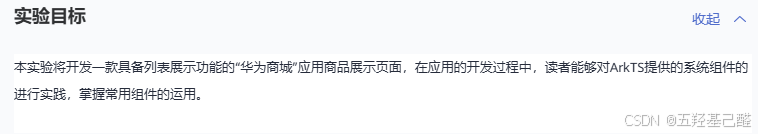
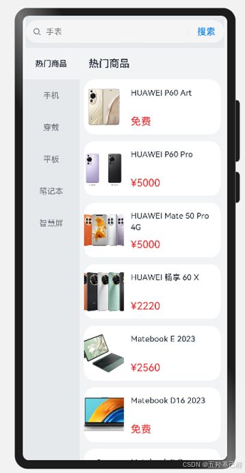
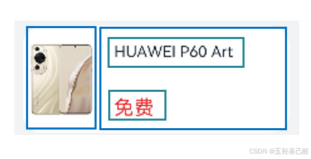

# 【HarmonyOS开发】华为商城应用页面实验示例解析（ArkTS实战解析）

> 原创 于 2024-12-02 12:22:26 发布 · 粉丝可见 · 3.7k 阅读 · 87 · 21 · 本内容遵循CC 4.0 BY-SA版权协议 版权声明：本文为博主原创文章，遵循 CC 4.0 BY 版权协议，转载请附上原文出处链接和本声明。 GEO检测 · 编辑
> 文章链接：https://menoking.blog.csdn.net/article/details/143780036

## 一.实验背景

本次项目为华为云鸿蒙应用入门级开发者认证的实验项目，借此来巩固对ArkTS的学习。

### 实验源地址

> [开发者云实验_云实验KooLabs_在线实验_上云实践_云计算实验_AI实验_华为云官方实验平台-华为云](https://lab.huaweicloud.com/experiment-detail_3424) 

### 实验目标

 

> 本实验一共需要完成以下三个部分的任务：本实验将模拟制作华为商城应用商品展示界，该款应用需要实现如下功能效果。
> 
> - 用户切换左侧导航的商品类别，右侧滚动到对应的内容。
> 
> - 滚动右侧具体商品的内容，左侧会切换对应的商品类别导航。
> 
> 

### 实验效果

 

## 二.实验详细解析

### GoodsModel.ets

```TypeScript
export default class GoodsModel {
  CommodityId: number; // 所属商品类别id
  goodsId: number;     // 商品id
  goodsName: string;   // 商品名称
  imageUrl: Resource;  // 商品展示图片
  price: number;       // 商品价格
 
  // 使用构造函数创建商品数据模型
  constructor(CommodityId: number, goodsId: number, goodsName: string, imageUrl: Resource, price: number) {
    this.CommodityId = CommodityId;
    this.goodsId = goodsId;
    this.goodsName = goodsName;
    this.imageUrl = imageUrl;
    this.price = price;
  }
}
```

这里是使用ArkTS语法创建了一个GoodsModel类，constructor作为其构造器，用来记录商品品类，使用并默认导出这个类。

> 
> 
> - **export：** 用于导出模块中的函数、类、接口或变量。
> 
>   - 一个模块可以有多个 `export` 。
> 
>   - 导出时，你必须指定导出的名称，这些名称在导入时必须一致。
> 
>   - 导入时，需要使用花括号 `{}` 来指定导入的项，并且可以重命名导入的项。
> 
> - **export default：** 用于导出模块中的默认值。这个默认值可以是函数、类、对象等。
> 
>   - 每个模块只能有一个默认导出。
> 
>   - 导出时，不需要指定名称。
> 
>   - 导入时，不需要花括号，并且可以为导入的项指定任何名称。
> 
> 

### NavigationModel.ets

此文件中也是创建了一个NavigationModel的默认导出类。记录商品分类。

### LinkDataModel.ets

创建了一个LinkDataModel联合类。将商品与分类联合起来。

### NavigationViewModel.ets

创建NavigationViewModel类，获取商品分类列表数据，返回商品类别的ID以及对应连接的具体商品信息列表。

```TypeScript
//导入先前创建好的三个数据模型
//TODO
import NavigationModel from './NavigationModel';
import GoodsModel from './GoodsModel';
import LinkDataModel from './LinkDataModel';
class NavigationViewModel {
  /**
   * 获取商品分类列表数据
   *
   * 返回 Array<商品分类模型> 商品类别的ID 以及 对应连接的具体商品信息列表 linkDataList
   */
  getLinkData(): Array<NavigationModel> {
    let linkDataList: Array<NavigationModel> = [];
    let superId: number = 0;
    //TODO
    LINK_DATA.forEach((item: LinkDataModel) => {
      if (superId !== item.superId) {
        // 如果该分类id不存在，则添加此商品分类模型中
        let GoodsItem: NavigationModel = new NavigationModel(item.superId, item.superName, []);
        linkDataList.push(GoodsItem);
      }
      // 添加具体商品信息模型
      let GoodsItem: GoodsModel = new GoodsModel(superId, item.id, item.GoodsName, item.imageUrl, item.price);
      linkDataList[linkDataList.length-1].GoodsList.push(GoodsItem);
      superId = item.superId;
    });
    return linkDataList;
  }
}
 
let navigationViewModel = new NavigationViewModel();
 
export default navigationViewModel as NavigationViewModel;
 
// 创建所链接具体数据
const LINK_DATA: LinkDataModel[] = [
  new LinkDataModel(1, '热门商品', 1, 'HUAWEI P60 Art', $r('app.media.ic_img_1'), 0),
  new LinkDataModel(1, '热门商品', 2, 'HUAWEI P60 Pro', $r('app.media.ic_img_2'), 5000),
  new LinkDataModel(1, '热门商品', 3, 'HUAWEI Mate 50 Pro 4G', $r('app.media.ic_img_3'), 5000),
 ...,
  new LinkDataModel(6, '智慧屏', 36, '华为智慧屏 V98', $r('app.media.ic_img_10'),3000),
  new LinkDataModel(6, '智慧屏', 37, '华为智慧屏  V85', $r('app.media.ic_img_11'), 5000),
]
```

### CommodityItem.ets

创建导航栏组件，显示右侧商品导航栏。

```TypeScript
// 引入先前构建好的常量类别，框架代码中已提供
import Constants from '../common/constants/Constants';
@Component
export default struct CommodityItem {
  CommodityName?: string;
  @Prop isSelected: boolean = false;
  onClickAction = () => {
    // TODO
 
  }
 
  build() {
    Text(this.CommodityName)
      .fontSize($r('app.float.normal_font_size'))
      .fontColor(this.isSelected ? $r('app.color.base_font_color') : $r('app.color.normal_font_color'))
      .fontFamily(this.isSelected ? $r('app.string.hei_ti_medium') : $r('app.string.hei_ti'))
      .fontWeight(this.isSelected ? Constants.TITLE_FONT_WEIGHT : Constants.LABEL_FONT_WEIGHT)
      .textAlign(TextAlign.Center)
      .backgroundColor(this.isSelected ? $r('app.color.base_background') : '')
      .width(Constants.FULL_PERCENT)
      .height($r('app.float.classify_item_height'))
      .onClick(this.onClickAction)
  }
}
```

### GoodsItem.ets

创建商品组件，显示商品。

```TypeScript
// 引入先前构建好的常量类别，框架代码中已提供
import Constants from '../common/constants/Constants';
// 引入之前创建好的具体商品数据模型
//TODO
import GoodsModel from '../viewmodel/GoodsModel';
 
// 构建具体商品信息子项
@Component
export default struct GoodsItem {
  //TODO
  @Prop itemStr:string = '';
  item?:GoodsModel;
  // 在创建自定义组件的新实例后，在执行其build()函数之前执行。
  //TODO
  aboutToAppear() {
    this.item = JSON.parse(this.itemStr);
  }
  build() {
    Row() {
      Row(){
        //TODO
        Image(this.item !== undefined ? this.item?.imageUrl : '')
          .height(Constants.FULL_PERCENT)
          .aspectRatio(1)
      }.height(70)
      .width(70)
      Column() {
        //TODO
        Text(  )
          .fontSize($r('app.float.normal_font_size'))
          .fontColor($r('app.color.base_font_color'))
          .fontFamily($r('app.string.hei_ti_medium'))
          .maxLines(Constants.TITLE_LINE_NUMBER)
          .textOverflow({ overflow: TextOverflow.Clip })
          .lineHeight($r('app.float.title_line_height'))
          .width(Constants.FULL_PERCENT)
        // 当商品的价格等于0时，这显示免费，否则显示具体价格。
        //TODO
        Text(this.item?.price === 0 ? $r('app.string.free_price') : $r('app.string.price_str', this.item?.price))
          .fontSize($r('app.float.header_font_size'))
          .fontColor($r('app.color.price_color'))
          .fontFamily($r('app.string.hei_ti_medium'))
      }
      .padding($r('app.float.course_item_padding'))
      .layoutWeight(1)
      .alignItems(HorizontalAlign.Start)
      .justifyContent(FlexAlign.SpaceBetween)
      .height(Constants.FULL_PERCENT)
    }
    .clip(true)
    .borderRadius($r('app.float.normal_border_radius'))
    .backgroundColor($r('app.color.start_window_background'))
    .width('100%')
    .height($r('app.float.course_item_height'))
  }
}
```

 

### MainPage.ets

此文件为程序入口页面，将上述所有文件调度起来形成页面。

> 
> 
> - aboutToAppear()主要作加载过程，setTimeout()在延Constants.LOADING_DURATION时间后被执行，() => { ... }在这里本质上是一个回调函数。
> 
> - @Builder允许在自定义组件内定义一个或多个自定义构建函数，同时只允许组内调用。
> 
> - build()中还使用了列表List()组件，在其中通过ForEach遍历生成了多个商品项。
> 
> 

```TypeScript
// 导入数据模型以及创建好的自定义组件
import Constants from '../common/constants/Constants';
//TODO
import NavigationModel from '../viewmodel/NavigationModel';
import GoodsModel from '../viewmodel/GoodsModel';
import GoodsItem from '../view/GoodsItem';
import CommodityItem from '../view/CommodityItem';
import NavigationViewModel from '../viewmodel/NavigationViewModel';
@Entry
@Component
struct IndexPage {
    //TODO
  @State currentCommodity: number = 0; // 被选中的左侧商品分类序号
  @State requestSuccess: boolean = false; // 是否加载成功
  private CommodityList: Array<NavigationModel> = []; // 左侧商品分类列表
  private CommodityScroller: Scroller = new Scroller(); // 左侧商品类别导航滚动条
  private scroller: Scroller = new Scroller(); // 右侧商品信息导航条
  // 搜索框
  @State changeValue: string = ''
  @State submitValue: string = ''
  controller: SearchController = new SearchController() // 搜索框控制器
 
  // 生命周期函数
  //TODO
  aboutToAppear() {
    // 在应用加载页面上显示“正在加载中”的文字提示
    setTimeout(() => {
      this.CommodityList = NavigationViewModel.getLinkData();
      this.requestSuccess = true;
    }, Constants.LOADING_DURATION);
 
  }
 
  // @Builder可以在自定义组件内定义一个或多个自定义构建函数，这里创建了左侧导航栏商品分类被选中时的样式。
  // 自定义构建函数可以在所属组件的build方法和其他自定义构建函数中调用，但不允许在组件外调用。
  // TODO
    @Builder   CommodityHeader(CommodityName: string) {
    Row() {
      Text(CommodityName)
        .fontSize($r('app.float.header_font_size'))
        .fontColor($r('app.color.base_font_color'))
        .fontFamily($r('app.string.hei_ti_medium'))
        .fontWeight(Constants.TITLE_FONT_WEIGHT)
    }
    .padding({ left: $r('app.float.item_padding_left') })
    .height($r('app.float.classify_item_height'))
    .width(Constants.FULL_PERCENT)
    .backgroundColor($r('app.color.base_background'))
  }
  // 定义当切换样式改变函数
  //TODO
  CommodityChangeAction(index: number, isCommodity: boolean) {
    if (this.currentCommodity !== index) {
      // 更改商品分类状态
      this.currentCommodity = index;
      if (isCommodity) {
        // 滚动右侧商品滚动条，滚动到选中区域
        this.scroller.scrollToIndex(index);
      } else {
        // 滚动左侧商品导航条，滚动到选中区域
        this.CommodityScroller.scrollToIndex(index);
      }
    }
  }
  build() {
    Column(){
      Row(){
        // 搜索框
        //TODO
        Search({ value: this.changeValue, placeholder: '手表', controller: this.controller })
          .searchButton('搜索')
          .width(350)
          .height(40)
          .backgroundColor('#F5F5F5')
          .placeholderColor(Color.Grey)
          .placeholderFont({ size: 14, weight: 400 })
          .textFont({ size: 14, weight: 400 })
          .onSubmit((value: string) => {
            this.submitValue = value
          })
          .onChange((value: string) => {
            this.changeValue = value
          })
      }.backgroundColor($r('app.color.classify_background'))
      // 界面整体使用Row组件实现横向布局，分为左右两部分。
      // 均使用List组件实现对导航和内容的数据展示，导航部分固定宽度，内容部分自适应屏幕剩余宽度并用ListItemGroup完成每个导航下的内容布局。
      Row() {
        if (this.requestSuccess) {
          List({ scroller: this.CommodityScroller }) {
            // 循环商品分类导航列表
            //TODO
            ForEach(this.CommodityList, (item: NavigationModel, index?: number) => {
              ListItem() {
                CommodityItem({
                  CommodityName: item.goodsName,
                  isSelected: this.currentCommodity === index,
                  onClickAction: () => {
                    if (index !== undefined) {
                      // 调用切换函数
                      this.CommodityChangeAction(index, true);
                    }
                  }
                })
              }
            }, (item: NavigationModel) => item.goodsName + this.currentCommodity)
 
          }
          .height(Constants.FULL_PERCENT)
          .width($r('app.float.classify_item_width'))
          .backgroundColor($r('app.color.classify_background'))
          .scrollBar(BarState.Off)
          // 循环具体商品信息列表
          List({ scroller: this.scroller }) {
            //TODO
            ForEach(this.CommodityList, (CommodityItem: NavigationModel) => {
              ListItemGroup({
                header: this.CommodityHeader(CommodityItem.goodsName),
                space: Constants.GOODS_ITEM_PADDING
              }) {
                ForEach(CommodityItem.GoodsList, (courseItem: GoodsModel) => {
                  ListItem() {
                    GoodsItem({ itemStr: JSON.stringify(courseItem) })
                  }
                }, (courseItem: GoodsModel) => `${courseItem.goodsId}`)
              }
            }, (item: NavigationModel) => `${item.commodityId}`)
 
 
          }
          .padding({ left: $r('app.float.item_padding_left'), right: $r('app.float.course_item_padding') })
          .sticky(StickyStyle.Header)
          .layoutWeight(1)
          .edgeEffect(EdgeEffect.None)
          .onScrollIndex((start: number) => this.CommodityChangeAction(start, false))
        } else {
          Text($r('app.string.loading'))
            .fontFamily($r('app.string.hei_ti_medium'))
            .textAlign(TextAlign.Center)
            .height(Constants.FULL_PERCENT)
            .width(Constants.FULL_PERCENT)
        }
      }
 
    }.backgroundColor($r('app.color.base_background'))
  }
}
```

## 三.总结

笔者在此只是大概对某些地方做了粗略的总结与解释，对于别的有疑问的地方笔者可自行到华为官网搜索查询。