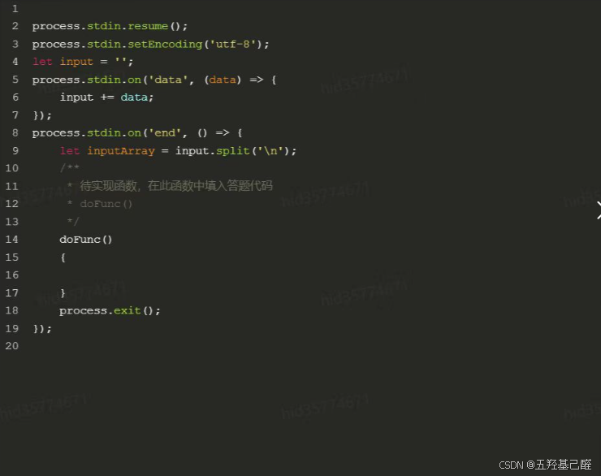
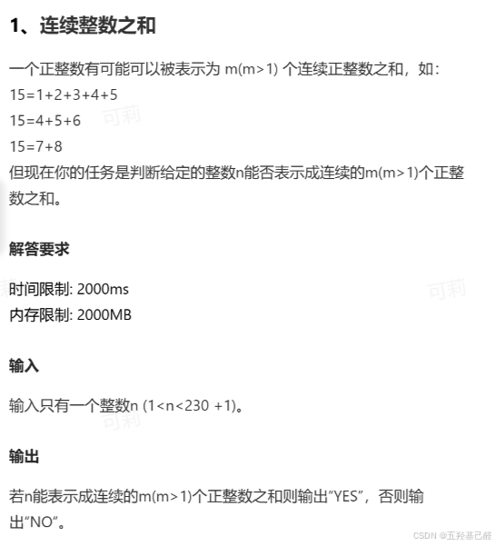
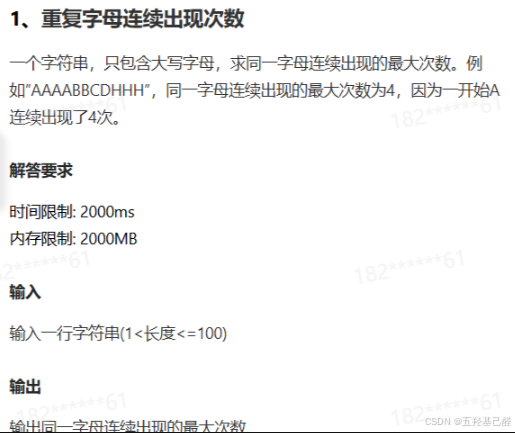
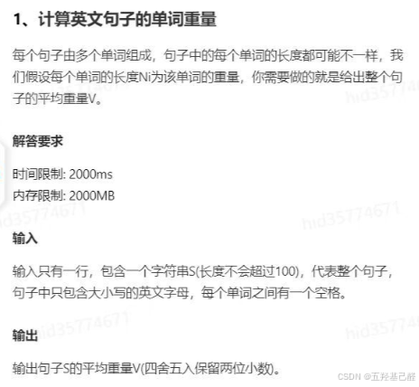

# 【HarmonyOS开发】鸿蒙ArkTS应用题目详解

> 原创 已于 2026-01-17 00:07:22 修改 · 公开 · 236 阅读 · 0 · 1 · 本内容遵循CC 4.0 BY-SA版权协议 版权声明：本文为博主原创文章，遵循 CC 4.0 BY 版权协议，转载请附上原文出处链接和本声明。 GEO检测 · 编辑
> 文章链接：https://menoking.blog.csdn.net/article/details/154320896

**目录**

[TOC]


## 零.环境分析

在高级开发者认证编程测试中使用以下模式来进行测试：

 

> 
> 
> 1. `process.stdin.resume()` ：这行代码告诉 Node.js 恢复 stdin 的流。默认情况下，stdin 是暂停的，所以需要调用 `.resume()` 方法来开始读取数据。
> 
> 2. `process.stdin.setEncoding('utf-8')` ：这行代码设置 stdin 的编码为 UTF-8，这意味着从 stdin 读取的数据将被解码为 UTF-8 编码的字符串。
> 
> 3. `let input = ''` ：这行代码初始化一个变量 `input` ，用于存储从 stdin 读取的数据。
> 
> 4. `process.stdin.on('data', (data) => { input += data })` ：这行代码监听 ‘data’ 事件。当有数据从 stdin 读取时，这个事件会被触发。回调函数将读取到的数据（ `data` ）追加到 `input` 变量中。
> 
> 5. `process.stdin.on('end', () => {` ：这行代码监听 ‘end’ 事件。当 stdin 的输入结束时，这个事件会被触发。
> 
> 6. `let inputArray = input.split('\n')` ：这行代码将 `input` 字符串按换行符（ `\n` ）分割成数组，存储在 `inputArray` 中。
> 
> 7. `// 待实现函数，在此函数中填入答题代码` ：这是一个注释，提示你在这一部分填入你的代码。
> 
> 8. `doFunc(inputArray)` ：这行代码调用一个名为 `doFunc` 的函数，并将 `inputArray` 作为参数传递给它。这个函数应该是你实现的，用于处理输入数据。
> 
> 9. `process.exit()` ：这行代码在 `doFunc` 函数执行完毕后调用，用于结束 Node.js 进程。
> 
> 

## 一.连续整数之和

> **题目详情** 
> 一个正整数有可能可以被表示为(m>1)个连续正整数之和，如：
> 15=1+2+3+4+5
> 15=4+5+6
> 15=7+8
> 但现在你的任务是判断给定的整数n能否表示成连续的m(m>1)个正整数之和。
> **输入** 
> 输入只有一个整数n(1<n<230+1).
> **输出** 
> 若n能表示成连续的m(m>1)个正整数之和则输出"YES”，否则输出NO”。
> 
>  
> 
> 

```TypeScript
function doFunc():void 
{
	let num = parseInt(inputArray[0].trim(),10);//这里inputArray[0]表示字符串数组中的第一个元素，即输入的字符串;".trim()"是将字符串两端空白字符去除的函数。
	let sum:number = 0;//记录每次运算的和
	for(let i = 0;i < num;i++)
	{
		for(let j = i;j < num;j++)
		{
			sum += j;
			if(sum == num)//进行比对
			{
				console.log('YES');
				return ;
			}
		}
		sum = 0;//每次运算完要清0
	}
	console.log( 'NO');
}
doFunc();
```

## 二.重复字母连续出现次数

> **题目详情** 
> 一个字符串，只包含大写字母，求同一字母连续出现的最大次数。例
> 如"AAAABBCDHHH",同一字母连续出现的最大次数为4，因为一开始A
> 连续出现了4次。
> **输入** 
> 输入一行字符串(1<长度<=100)
> **输出** 
> 给出同一字母连续出现的最大次数
> 
>  
> 
> 

```TypeScript
function doFunc():void
{
    let str = inputArray[0].trim();
    let counter:number = 0,temp:number = 0;
    for(let i = 0;i < str.length;i ++)
    {
        if(str[i] == str [i+1])
        {
        	++temp;
        }
        else
        {
            if(temp > counter)
                counter = temp;
            temp = 1;
        }
        //防止结尾有更长的连续字符
        if(temp > counter)
            counter = temp;
    }
    console.log(counter);
}
doFunc();
```

## 三.计算英文句子的单词重量

> **题目详情** 
> 每个句子由多个单词组成，句子中的每个单词的张度都可能不一样，我
> 们假设每个单词的张度N为该单词的重量，你需要做的就是给出整个句
> 子的平均重量V.
> 
> 
> **输入** 
> 输入只有一行，包含一个字符串S(长度不会超过100)，代表整个句子，
> 句子中只包含大小与的英文字母，每个单词之间有一个空格。
> **输出** 
> 输出句子S的平均重量V(四舍五入保留两位小数。
> 
>  
> 
> 

```TypeScript
function doFunc()
{
    let str = inputArray[0].trim();
    //str += ' ';
    let wordLength:number = 0,wordNumber:number = 0,weight:number = 0;
    for(let i = 0;i < str.length;i ++)
    {
		
        if(str[i] == ' ')
        {
            ++wordNumber;//记录单词的数量
            weight += wordLength;//记录单次总重量
            wordLength = 0;
        }else
        {
            ++wordLength;
        }
    }
    if(wordLength > 0)
    {
        ++wordNumber;
        weight += wordLength;
    }
    let averageWeight = weight / wordNumber;
    console.log(averageWeight.toFixed(2));//控制精度在小数点后两位
}
    
doFunc();
 
```

## 四.总结

由于目前鸿蒙开发者认证题库一直在更新，且考试后不会保留答题记录，所以全网解析都不是很多，这里只对搜集到的几个编程题进行解析评估，希望大家都能拿到合格证！