# 【LVGL快速入门(一)】LVGL开源框架入门教程之框架移植

> 原创 已于 2026-01-13 10:42:05 修改 · 粉丝可见 · 9.3k 阅读 · 50 · 149 · 本内容遵循CC 4.0 BY-SA版权协议 版权声明：本文为博主原创文章，遵循 CC 4.0 BY 版权协议，转载请附上原文出处链接和本声明。 GEO检测 · 编辑
> 文章链接：https://menoking.blog.csdn.net/article/details/142684876

**目录**

[TOC]


## 一.学习背景

LVGL是一款开源的嵌入式GUI框架。轻量级和灵活性是其著有的特征。我们在开发如智能手表，仪器表盘时可以采用这个框架。

## 二.移植LVGL

在移植之前我们要确保我们的硬件芯片符合移植的要求，以下表为标准：

| **Name** | **Minimal** | **Recommended** |
|:---:|:---:|:---:|
| **Architecture** | 16, 32 or 64 bit microcontroller or processor |   |
| **Clock** | > 16 MHz | > 48 MHz |
| **Flash/ROM** | > 64 kB | > 180 kB |
| **Static RAM** | > 16 kB | > 48 kB |
| **Draw buffer** | > 1 × *hor. res.* pixels | > 1/10 screen size |
| **Compiler** | C99 or newer |   |


首先，要在官方开源地址下下载LVGL的源文件。

这里给出官方下载链接： [GitHub - lvgl/lvgl: Embedded graphics library to create beautiful UIs for any MCU, MPU and display type.](https://github.com/lvgl/lvgl) 

作为初学者的话我们一般选择V8.3版本的，适用范围广，教程相对多。 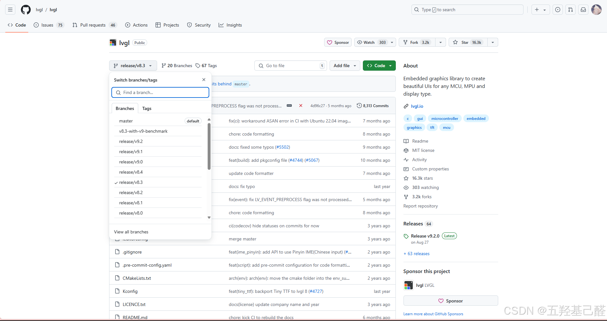

下载解压后我们可以得到：

 

 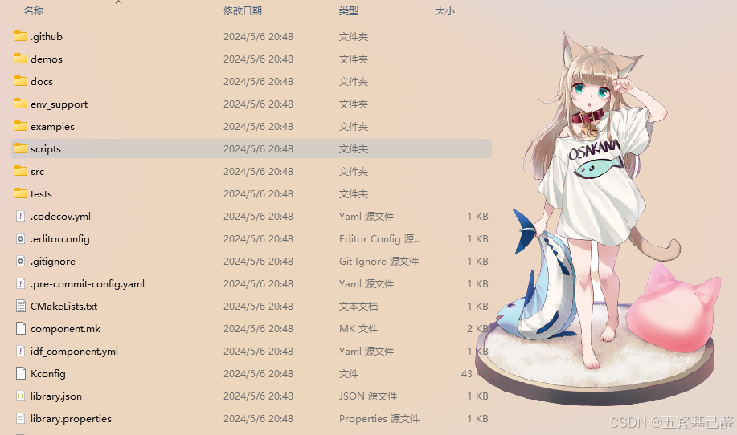

然后我们在另一个目录下新建一个文件夹，在这个文件夹中复制我们需要移植的一些文件，这里我们只需要以下文件夹：

 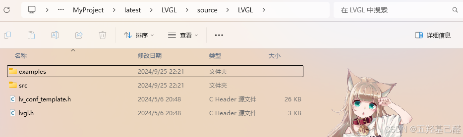

同时我们将“lv_conf_template.h”改为“lv_conf.h”和以下地址中的文件后的“_template”也去掉。 

更改后如下：

 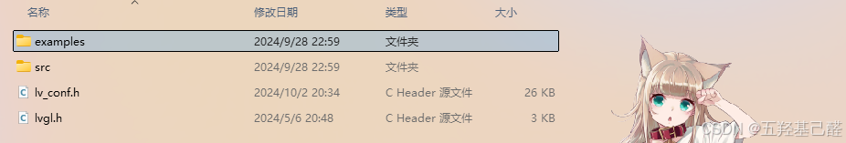

 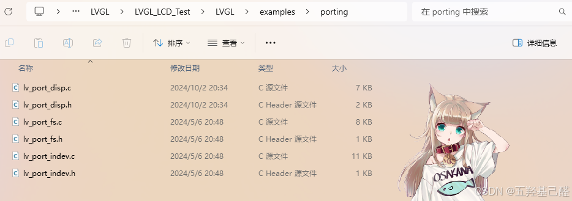

紧接着我们需要创建一个工程并将LVGL库文件移植进去我们的工程。这里以CubeMX创建的STM32F407VET6的工程为例。

我们向空工程的文件夹中添加“lvgl”文件夹（注意这里最好使用小写目录名，下面创建的任何东西都建议小写，只是建议，并无太大影响！！！），并向其中复制我们刚才改好的文件，如下：

 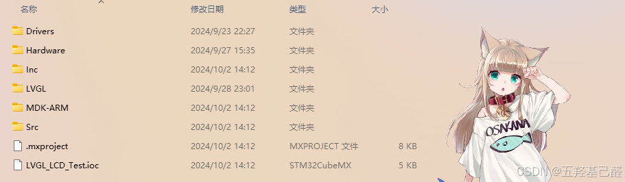

 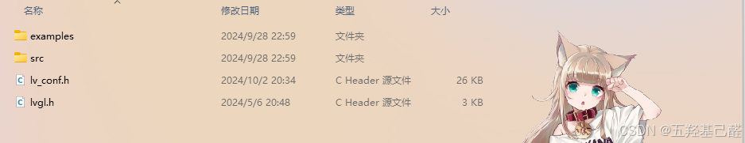

完成以上之后我们就可以开始正式进入Keil配置工程项了，进入工程管理界面，添加以下文件组：

 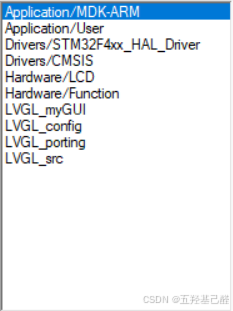

 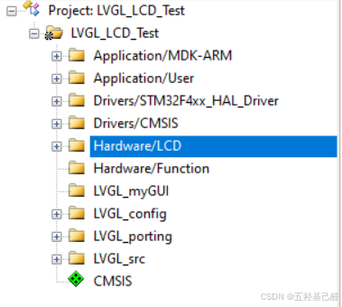

详细解释如下：

| **文件夹名称 (Groups)** | **用于存放什么文件** |
|:---:|:---:|
| LVGL_myGui | 用户自己的界面代码文件、官方demo等 |
| LVGL_conf | LVGL 的两个h文件 |
| LVGL_porting | LVGL 的接口文件, 如显示、触摸屏、键盘等 |
| LVGL_src | LVGL 的所有底层c文件 |


完成后最好编译一下以免有错误。

注意以下为最重要的步骤，向刚才创建的工程组中分别添加文件，具体如下：

| 组 | 文件 |
|:---:|:---:|
| **LVGL_myGUI** | 个人文件，暂不需添加。 |
| **LVGL_conf** | LVGL根目录中的 **lv_conf.h、lvgl.h** |
| **LVGL_porting** | LVGL/ examples / porting中的“ **lv_port_disp.c 、lv_port_disp.h、 lv_port_indev.c、lv_port_indev.h** ” |
| **LVGL_src** | LVGL/ src目录下的所有.c文件（注意：这里是所有.c文件，包括所有子目录下的和src根目录下的）（笔者数了一下，大概是201个，读者可自己数一下） |


添加完以后如下（src未展示完全）：

 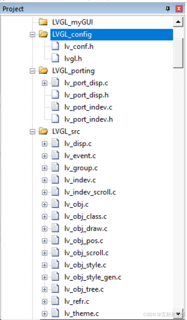

下一步，注意将C99勾选上

 

向头文件中添加这几个文件夹：

 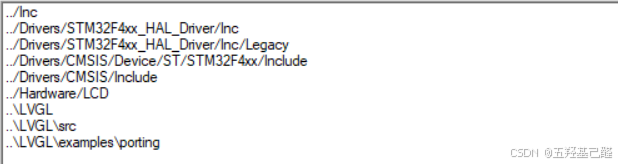

此时可以再编译一次，若没有错误则算成功。

### 一.显示功能开启

接着要完成LVGL显示功能的注册，即开启：

**1、开启 lv_conf.h** 

把“#if 0”改为“#if 1”

 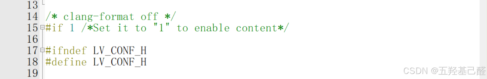

**2、开启 lv_port_disp.h** 

改1

注意这里还要把"lvgl/lvgl.h"改为"lvgl.h"

这里如果搞不懂可以研究一下相对路径和绝对路径，参考 [【学习笔记】关于keil配置项和程序源文件引用的相对路径问题](https://blog.csdn.net/2203_75993546/article/details/139222163) 

 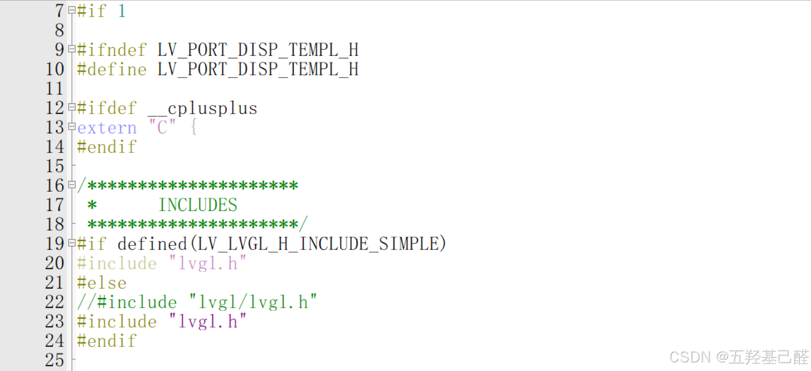

**3、开启 lv_port_disp.c （这个文件很关键，我们的底层函数主要需要在这实现）** 

同样的，这里要删去“_template”

 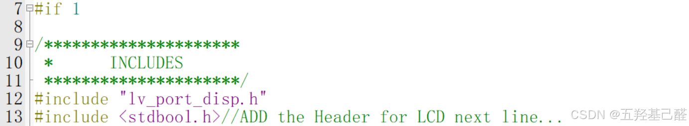

 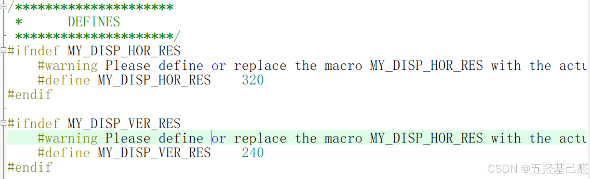

这里可以设置你的显示屏的长宽。

在 **lv_port_disp.c** 这个文件中，还需要选择一个缓冲方式，我们一般选第一种（大概在90到101行），故这里我们注释掉第二和第三种

```cobol
/* Example for 1) */
    static lv_disp_draw_buf_t draw_buf_dsc_1;
    static lv_color_t buf_1[MY_DISP_HOR_RES * 10];                          /*A buffer for 10 rows*/
    lv_disp_draw_buf_init(&draw_buf_dsc_1, buf_1, NULL, MY_DISP_HOR_RES * 10);   /*Initialize the display buffer*/
	//选择第一种缓冲方式，注释掉后两种
//    /* Example for 2) */
//    static lv_disp_draw_buf_t draw_buf_dsc_2;
//    static lv_color_t buf_2_1[MY_DISP_HOR_RES * 10];                        /*A buffer for 10 rows*/
//    static lv_color_t buf_2_2[MY_DISP_HOR_RES * 10];                        /*An other buffer for 10 rows*/
//    lv_disp_draw_buf_init(&draw_buf_dsc_2, buf_2_1, buf_2_2, MY_DISP_HOR_RES * 10);   /*Initialize the display buffer*/
 
//    /* Example for 3) also set disp_drv.full_refresh = 1 below*/
//    static lv_disp_draw_buf_t draw_buf_dsc_3;
//    static lv_color_t buf_3_1[MY_DISP_HOR_RES * MY_DISP_VER_RES];            /*A screen sized buffer*/
//    static lv_color_t buf_3_2[MY_DISP_HOR_RES * MY_DISP_VER_RES];            /*Another screen sized buffer*/
//    lv_disp_draw_buf_init(&draw_buf_dsc_3, buf_3_1, buf_3_2,
//                          MY_DISP_VER_RES * LV_VER_RES_MAX);   /*Initialize the display buffer*/
```

此时当我们完成上述全部步骤后，再次进行编译，应该为 0 Error，如果不是，需要解决所有Error后再进行。但是有一些警告没有关系

 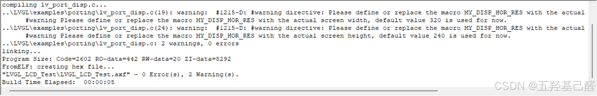

接着我们就要正式开始添加驱动文件了，还是在 **lv_port_disp.c** 这个文件中，添加我们所用的LCD的驱动文件：

首先添加驱动头文件：


 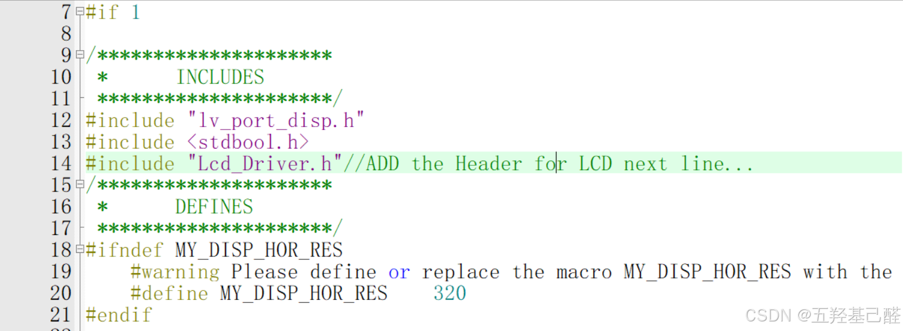

> 对这里的添加作简单说明：
> 
> 首先，LVGL只是一个开源框架，内部是不含任何驱动函数的，所有驱动函数都是我们自己写或者LCD原厂的例程，我们要通过向LVGL中添加驱动函数来将其和我们的屏幕建立连接。

第一个是 **static void disp_init(void)** 这个函数，用于初始化屏幕，在其中添加你的LCD屏幕初始化函数 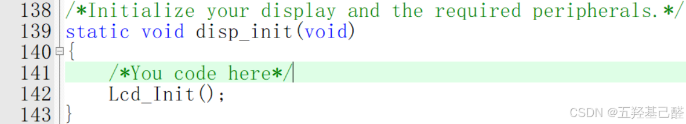

第二个是 **static void disp_flush(lv_disp_drv_t * disp_drv, const lv_area_t * area, lv_color_t * color_p)** ，是最基础的刷新绘制函数。

将LCD驱动里的画点函数放在这个函数里，

这是笔者画点函数的声明：

 

添加完成后：

 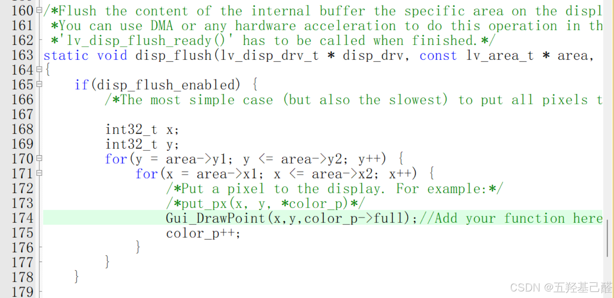

这里对传入的参数作简单解释：x,y表示坐标，这没什么可说的。但是第三个参数，是指向了颜色结构体成员的指针，其中 **full** 字段包含了完整的颜色值， **ch** 只是访问单独的颜色通道值。

> 当你使用这个联合体时，你可以单独设置和获取颜色分量：
> 
> ```cobol
> lv_color32_t my_color;
> my_color.ch.blue = 0xFF;   // 将蓝色分量设置为最大值
> my_color.ch.green = 0x00;  // 将绿色分量设置为最小值
> my_color.ch.red = 0x00;    // 将红色分量设置为最小值
> my_color.ch.alpha = 0x7F;  // 将 alpha 分量设置为 127（50% 透明）
> ```
> 
> 或者你可以将颜色作为一个 32 位的值来操作：
> 
> ```cobol
> lv_color32_t my_color;
> my_color.full = 0xFFFF0000;  // 将颜色设置为红色，完全不透明
> ```
> 
> 这个联合体特别适用于需要颜色操作的系统中，因为它允许有效地使用内存，并且能够快速访问或修改颜色分量，既可以单独操作，也可以作为一个整体。

 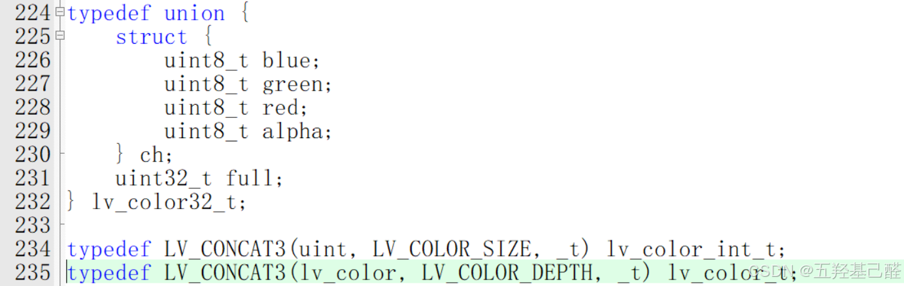

至此，若不需要触摸功能的话，LVGL的基础功能就移植完成了。

### 二.触摸功能开启

这里与显示的开启大差不差，就作简略写。

**1、启用 "lv_port_indev.h"** 

原：#if 0,  修改成：#if 1

原："lvgl / lvgl.h"， 修改成："lvgl.h"

**2、启动 "lv_port_indev.c"** 


原：#if 0, 修改为：#if 1

原：“lv_port_indev_template.h", 修改为："lv_port_indev.h"

原："../../lvgl.h"，修改为："lvgl.h"

**3、添加  触屏 的驱动头文件** 

 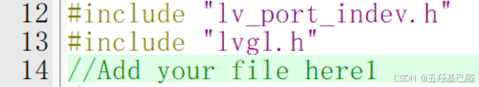

紧接着找到触摸注册函数 **void lv_port_indev_init(void)** 

| **Touchpad（触屏）** |
|:---:|
| **Mouse（鼠标）** |
| **Keypad（键盘）** |
| **Encoder（编码器）** |
| **Button（按钮）** |


选择其中需要的进行注册，其余注释掉。

 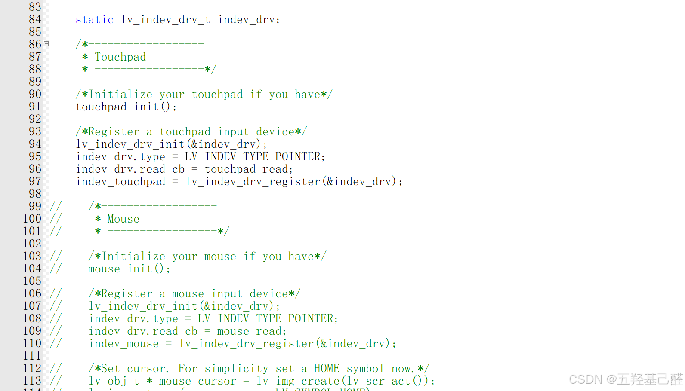

然后向下，在209行左右有一个触摸检测函数 **static bool touchpad_is_pressed(void)** ，返回布尔值

 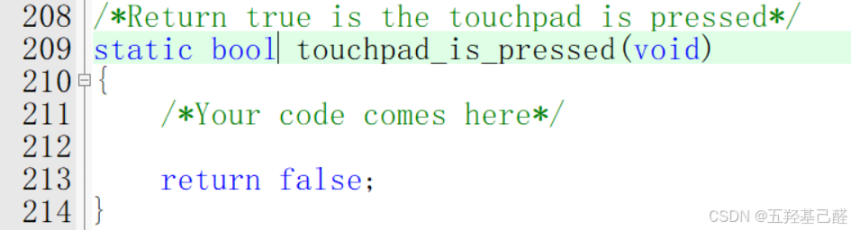

向其中添加LCD触摸检测驱动，返回值要求：0-未按下、1-按下;同时注释掉原先的return false。

往下 **static void touchpad_get_xy(lv_coord_t * x, lv_coord_t * y)** 添加坐标获取函数

 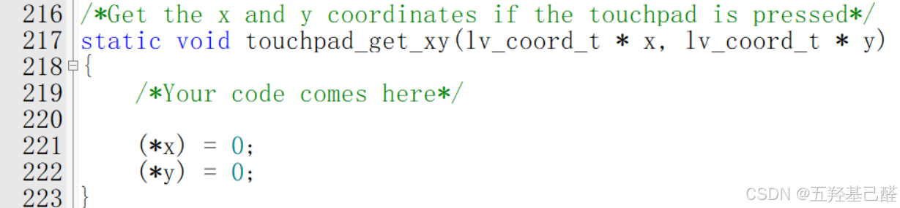

例如：

```cpp
static void touchpad_get_xy(lv_coord_t * x, lv_coord_t * y)
{
    /*Your code comes here*/
 
    (*x) = XPT2046_GetX();
    (*y) = XPT2046_GetY();
}
```

至此，触摸的开启全部完成。​​​​​

### 三.设置心跳

---

在main.c文件中添加头文件：

```cpp
#include "lvgl.h"//LVGL头文件引用
#include "lv_port_disp.h"//LVGL显示支持
#include "lv_port_indev.h"// LVGL的触摸支持
```

然后就可以在主函数中写入初始化代码了：

```cpp
lv_init();                             // LVGL 初始化
lv_port_disp_init();                   // 注册LVGL的显示任务
lv_port_indev_init();                  // 注册LVGL的触屏检测任务
```

---


> **心跳** ： **lv_tick_inc()** ，LVGL内一个时基函数，它的所有任务调度都要依靠这个函数，所以这个函数必须要被间隔精确地调用。
> 
> - 增加LVGL的内部时间戳。
> 
> - 该时间戳用于计算动画的进度、定时器触发、任务调度等。
> 
> **任务处理函数** ： **lv_timer_handler()** 。
> 
> - 执行所有已注册的定时器回调函数。
> 
> - 处理 LVGL 的内部任务，例如动画、定时器重绘等。
> 
> 

#### 1.赋予LVGL心跳

首先我们使用TIM创建一个定时器，以中断来为LVGL赋予心跳。笔者的开发平台是STM32F407，这里选择TIM6基本定时器。

 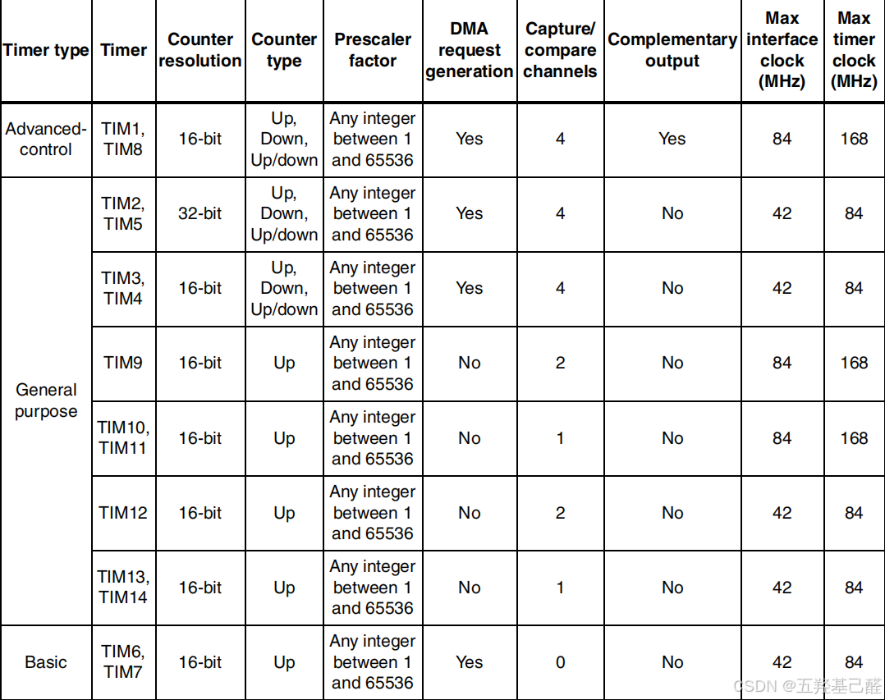

由于TIM6挂载在APB1总线上，所以最高频率为84MHz， 所以PSC设置为84-1，同时ARR设置为1000-1，计算出来定时周期为1ms。

 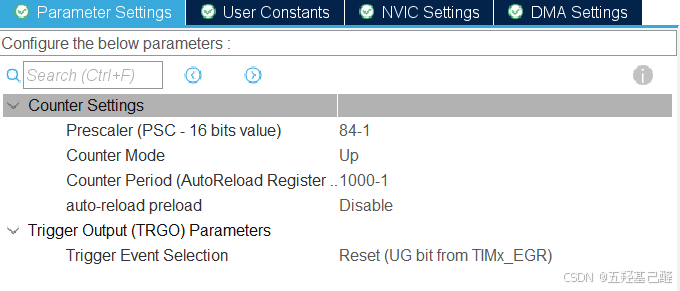

同时使能中断，并设置优先级为0（最高优先级）：

 

 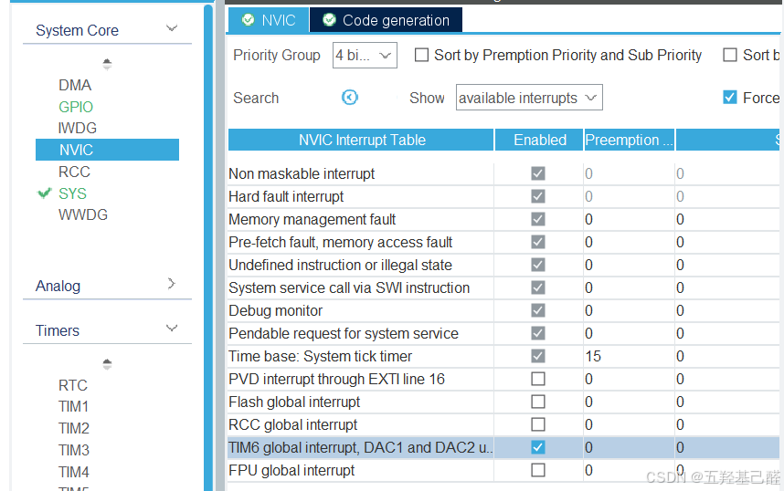

然后生成文件，更新工程。在mian()主函数中，LVGL初始化之后调用定时器启动函数HAL_TIM_Base_Start_IT(&htim6)。 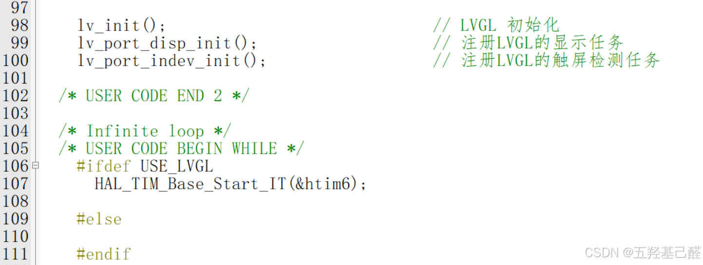

在main.c下面的用户代码区添加中断回调函数：

```cpp
void HAL_TIM_PeriodElapsedCallback(TIM_HandleTypeDef *htim)
{
	if(htim->Instance == TIM6)
	{
		lv_tick_inc(1);//心跳函数
	}
}
```

> 在回调函数中，我们调用lv_tick_inc(1)即设置1ms的心跳。
> 
> 如果设置TIM产生2ms的中断，也可以写lv_tick_inc(2)。

#### 2.开启任务调度

向main()主函数的while循环中添加5ms轮询调用：

```cpp
while (1)
  {
	  #ifdef USE_LVGL
		static uint8_t LVGL_Timer_5ms = 0;//任务调度函数的5ms定时
		
	  
		
		HAL_Delay(1-1);
		if(LVGL_Timer_5ms++ >= 5)
		{
			lv_timer_handler();//任务调度函数
			LVGL_Timer_5ms = 0;
		}
	  #else
	  
	  #endif
	  
    /* USER CODE END WHILE */
	
    /* USER CODE BEGIN 3 */
  }
```

这里为什么在主函数中调用而不在定时器中断里调用呢？主要是因为 lv_timer_handler()这个函数十分消耗资源，若在定时器中调用的话可能会霸占整个中断资源，我们初学时就知道不能在中断中处理过于复杂的任务，所以我们不在中断里去处理LVGL的任务调用。

编译后无错误：

 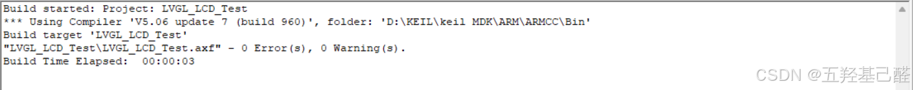

---

至此，我们整个移植过程完全结束，接下来就可以进行功能地编写调试，开启真正的LVGL框架学习。

---

若有错误，感谢指正！