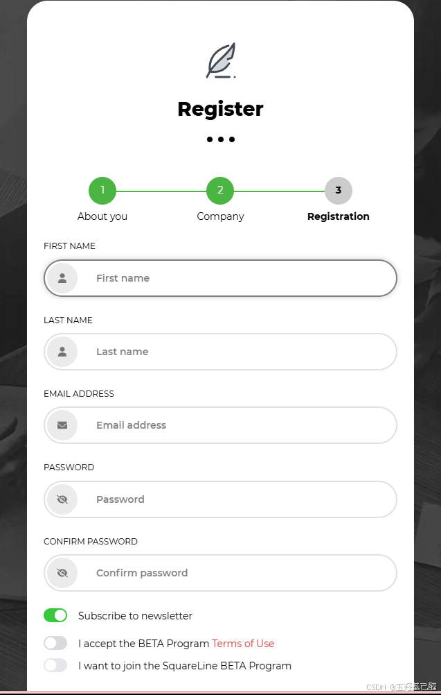
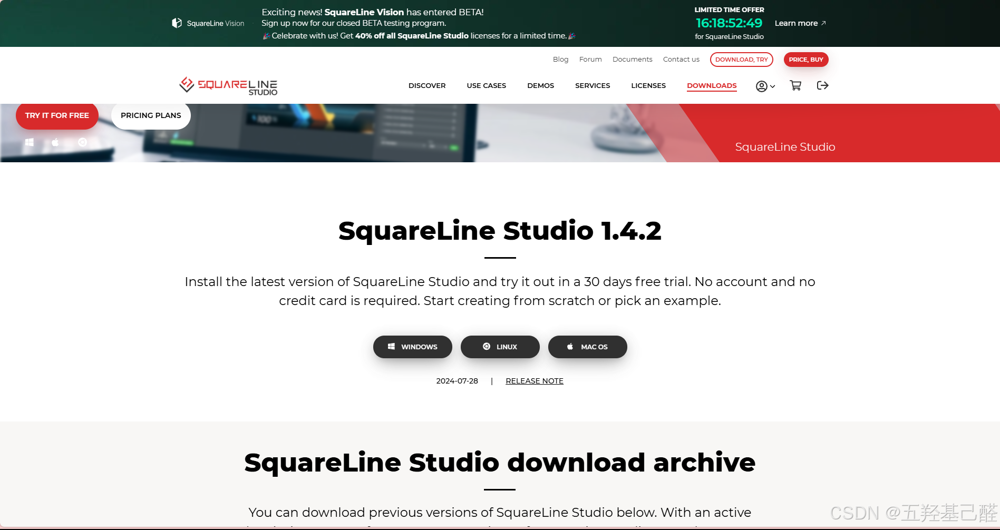
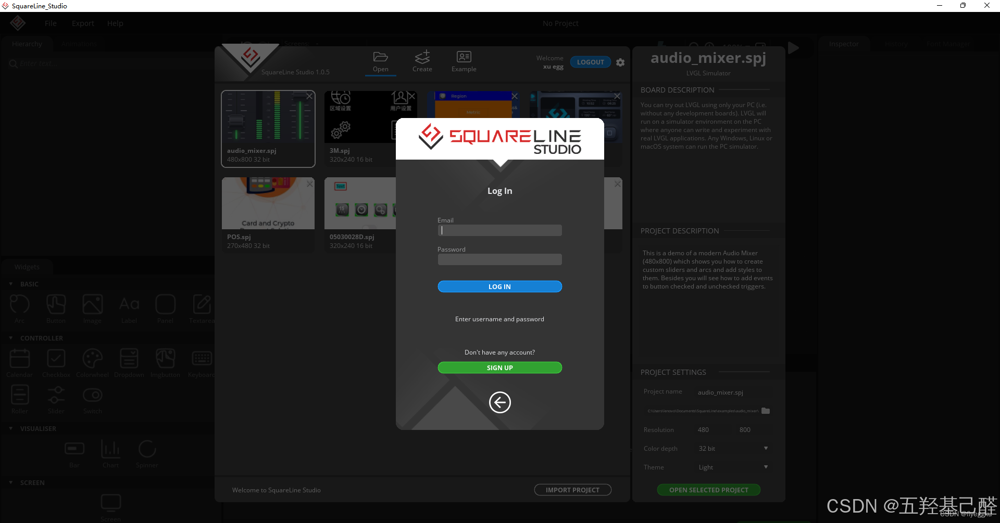
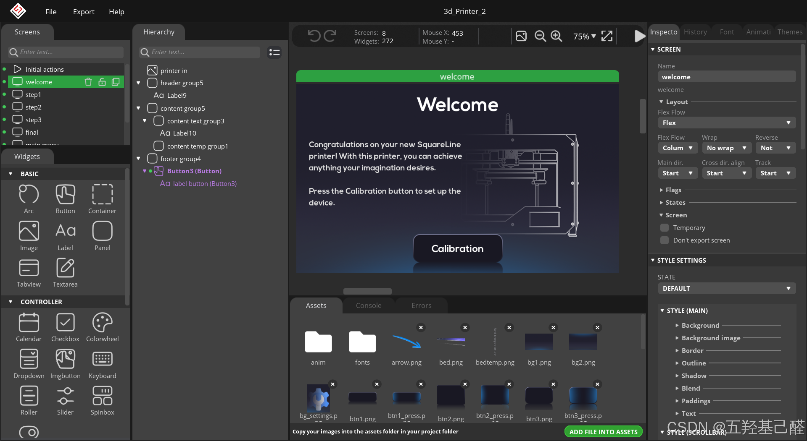
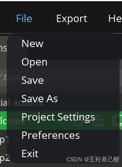
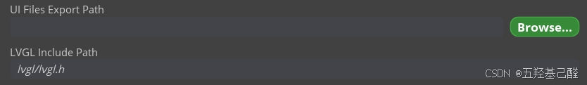
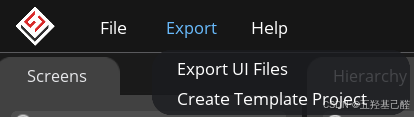
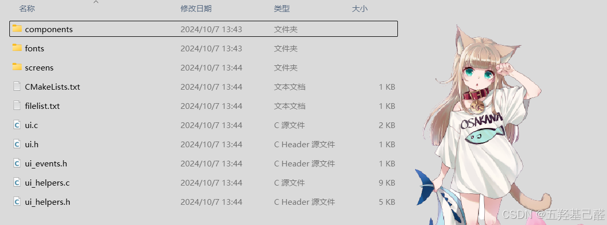
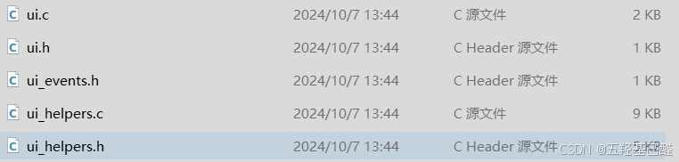

# 【LVGL快速入门】SquareLine Studio安装教程（LVGL官方工具）

> 原创 已于 2024-10-11 11:20:29 修改 · 粉丝可见 · 8.6k 阅读 · 7 · 45 · 本内容遵循CC 4.0 BY-SA版权协议 版权声明：本文为博主原创文章，遵循 CC 4.0 BY 版权协议，转载请附上原文出处链接和本声明。 GEO检测 · 编辑
> 文章链接：https://menoking.blog.csdn.net/article/details/142731854

## 一.简介与导航：

SquareLineStudio是由LVGL官方开发的一款UI设计工具，采用图形化进行界面UI设计，轻易上手。

> 
> 
> - SquareLine Studio官方网址：https://squareline.io/
> 
> - SquareLine Studio官方文档：https://docs.squareline.io/docs/squareline/
> 
> - SquareLine Studio下载地址： [SquareLine Studio - Design and build UIs with ease](https://squareline.io/downloads)
> 
> 

## 二.注册：

找到sign in进行注册：

 

## 三.下载安装：

注册完之后下载程序：

 

下载解压安装后登录：

 

## 四.使用：

 

图形化设计，点击一个模板熟悉亿下很快就能上手。

在ProjectSettings中可以设置导出路径以及导出源文件中的相对路径。

 

 

选择 ExportUIFiles可以导出UI源文件：

 

 

一般我们要导入工程中的是下面的这几个.c和.h文件

 

