# 【LVGL速成】LVGL修改标签文本(GUI Guider生成的字库问题)

> 原创 已于 2024-10-31 15:09:21 修改 · 粉丝可见 · 3.9k 阅读 · 43 · 40 · 本内容遵循CC 4.0 BY-SA版权协议 版权声明：本文为博主原创文章，遵循 CC 4.0 BY 版权协议，转载请附上原文出处链接和本声明。 GEO检测 · 编辑
> 文章链接：https://menoking.blog.csdn.net/article/details/143235795

**目录**

[TOC]


## 前置篇章：

> [【LVGL快速入门(二)】LVGL开源框架入门教程之框架使用(UI界面设计)_lvgl 菜鸟教程-CSDN博客](https://blog.csdn.net/2203_75993546/article/details/142915534?fromshare=blogdetail&sharetype=blogdetail&sharerId=142915534&sharerefer=PC&sharesource=2203_75993546&sharefrom=from_link) 

## 一.问题背景

笔者最近在学习LVGL框架，同时准备使用该框架作为课程设计的一部分，于是需要从静态显示进阶到动态显示以及事件交互。一方面由于笔者是初次接触LVGL，对它并不熟悉，另一方面由于其网络上的针对性具体资料太少，所以学习效率很低。

由于上一篇文章笔者完成了很基础的静态界面设计和移植。于是此次便向原有工程上先进行试验，先将原有文本改成可以动态变化的文本。

 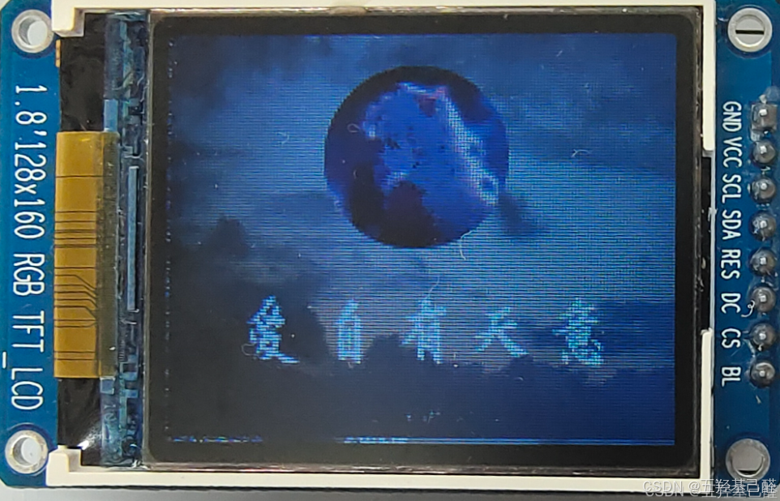

## 二.失败方案

笔者一开始选择使用设置Label属性中的setText函数对文本进行设置，在主函数中加入这个函数以为能够修改文本值：

```cpp
lv_label_set_text(guider_ui.screen_label_1, "6");
```

 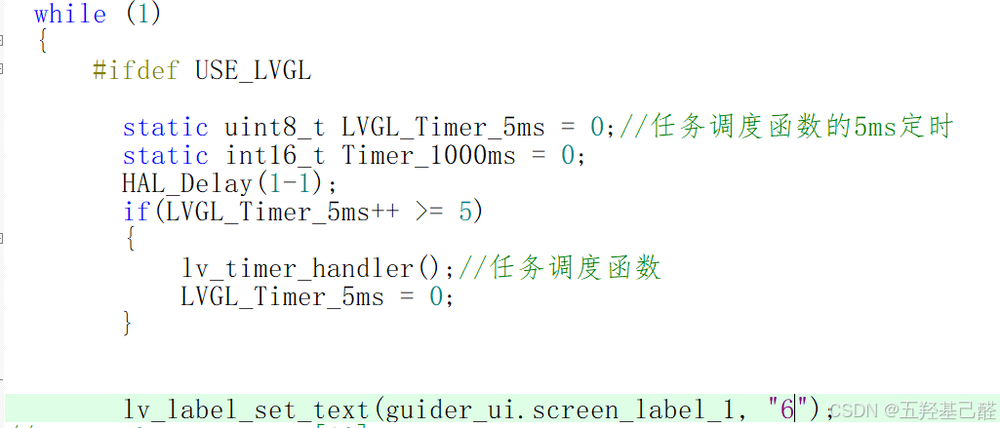

结果：

 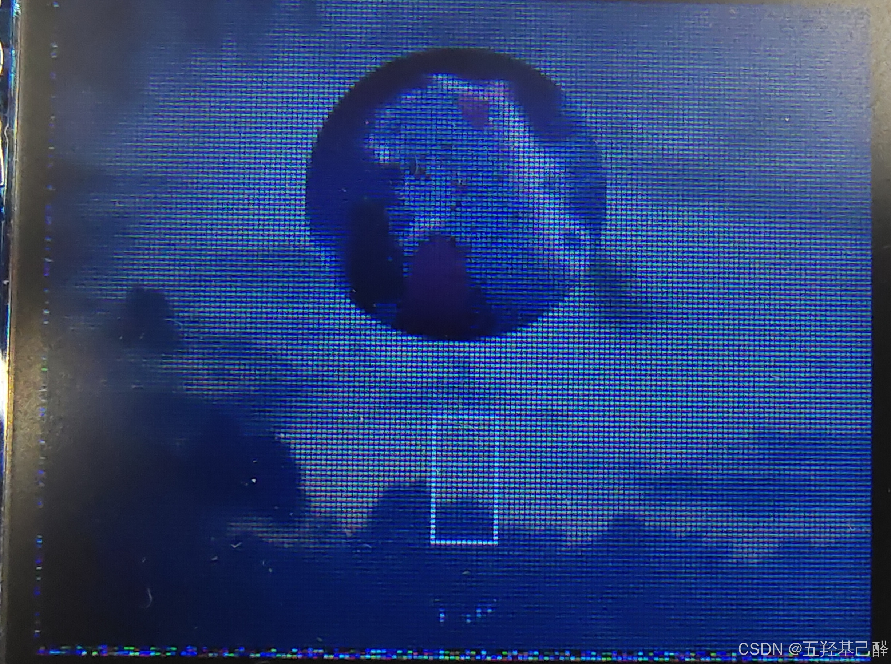

除了屏幕中的一个白框之外，文本全部消失不见。

然后笔者又换了很多不同的位置，无论是将这句放到主函数还是界面ui函数中，显示均不能正常。无关乎位置以及数量，修改之后显示的均为白框。

最后笔者观察发现为字库问题，后验证了成功方案。

## 三.成功方案

### 1.Guiguider的源码结构

首先我们要清楚的是GUI guider这个设计工具生成出来的源码结构构成。其生成的src文件夹下包含两个文件夹：

 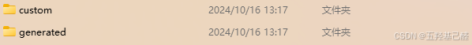

其中：

> 
> 
> - custom文件夹包含由用户进行自由操作的文件，主要完成用户特定的功能实现。 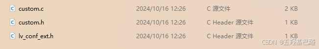
> 
> - generated文件夹包含由Gui guider生成的源文件，其中部分是用户设计的界面数据，部分是字库数据和控件数据，还有一些接入LVGL的接口 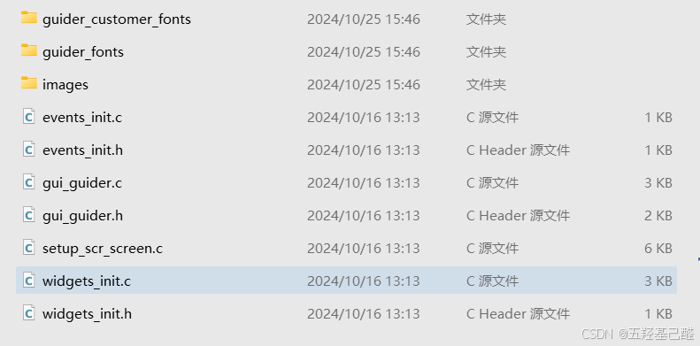
> 
>   **这个文件夹下包含的就是我们设计且使用了的字库文件（即UI界面上的文字数据）**  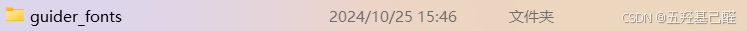
> 
>   **这个文件包含了我们用户生成的字库文件（生成但未使用），也就是说我们再使用某个自定义字体文字时需要先手动生成，这里也是笔者踩坑的地方。**  
> 
>   这里包含的是用户设计的界面函数 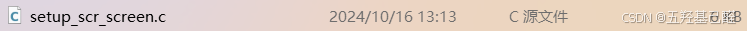
> 
>   这里包含的是Gui guider工具生成所有源码的外部接口，调用这里的函数即可绘制界面。 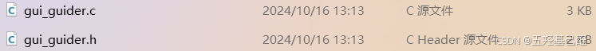
> 
> 

### 2.手动生成字体

前面强调过，在我们使用某个字体时（特别是自己导入的自定义字体）一定一定要先在Gui guider中生成字体。

 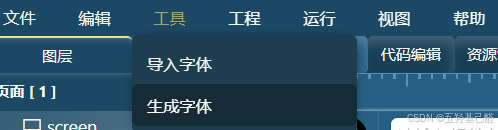

 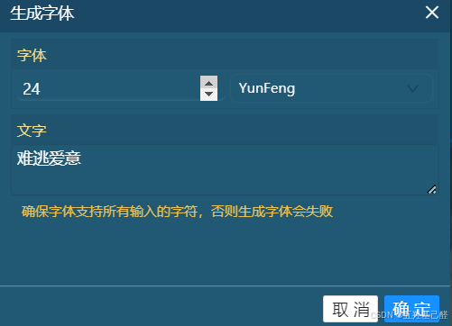

输入想要生成的字体后看到以下提示即为成功：

 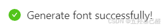

生成的字库文件全部在这个文件夹里：

 

 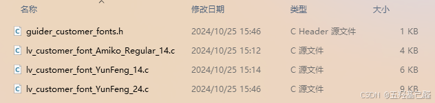

### 3.Keil中配置相关文件

向管理器中添加我们生成的字库文件：

 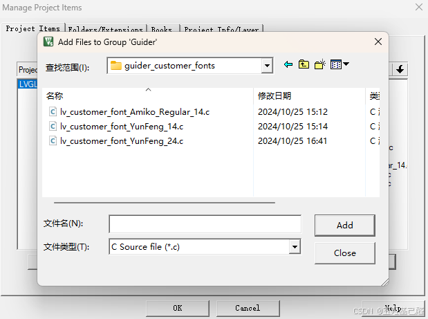

点开文件能很清楚地看到我们自己生成的文字数据：

 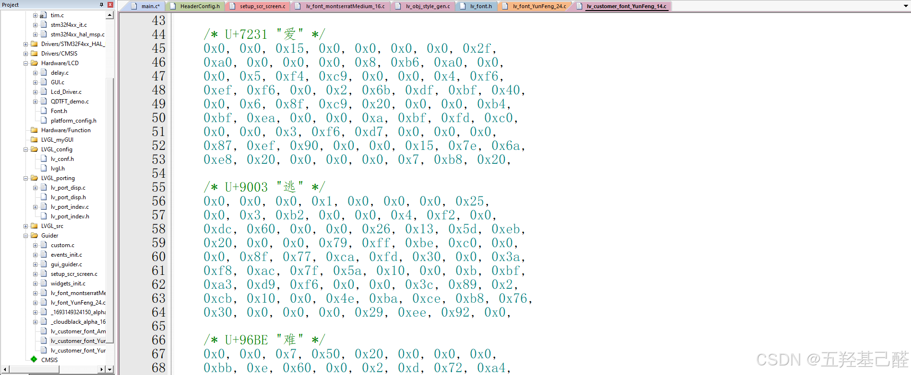

一般来说UI中已经设计使用的字体都会在gui_guider.h中进行声明，如：

```cpp
//声明图片
LV_IMG_DECLARE(_cloudblack_alpha_160x128);
LV_IMG_DECLARE(_1693149324150_alpha_58x57);
 
//声明文字
LV_FONT_DECLARE(lv_font_YunFeng_24)
LV_FONT_DECLARE(lv_font_montserratMedium_16)
```

 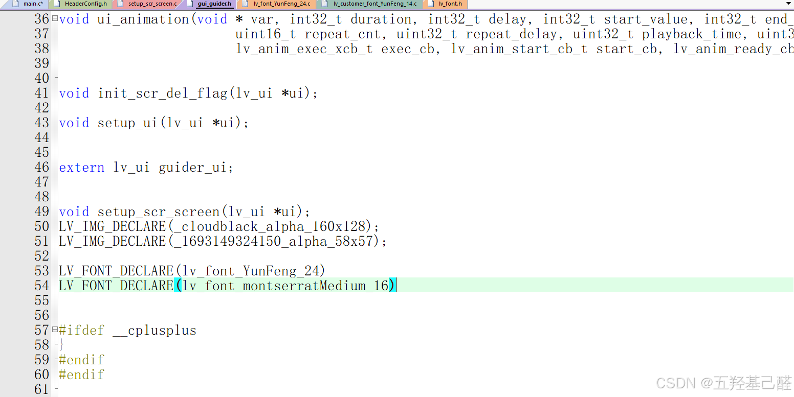

函数原型为：

```cpp
#define LV_FONT_DECLARE(font_name) extern const lv_font_t font_name;
```

如果想要使用刚刚生成的文字的话需要在这里手动声明：

 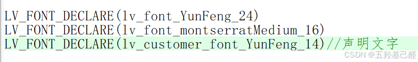

### 4.修改文字

完成以上工作后我们就可以在我们自己的代码里自由修改文字了。

```cpp
lv_label_set_text(ui->screen_label_1, "难逃爱意");
lv_obj_set_style_text_font(ui->screen_label_1, &lv_font_YunFeng_24, LV_PART_MAIN|LV_STATE_DEFAULT);
```

 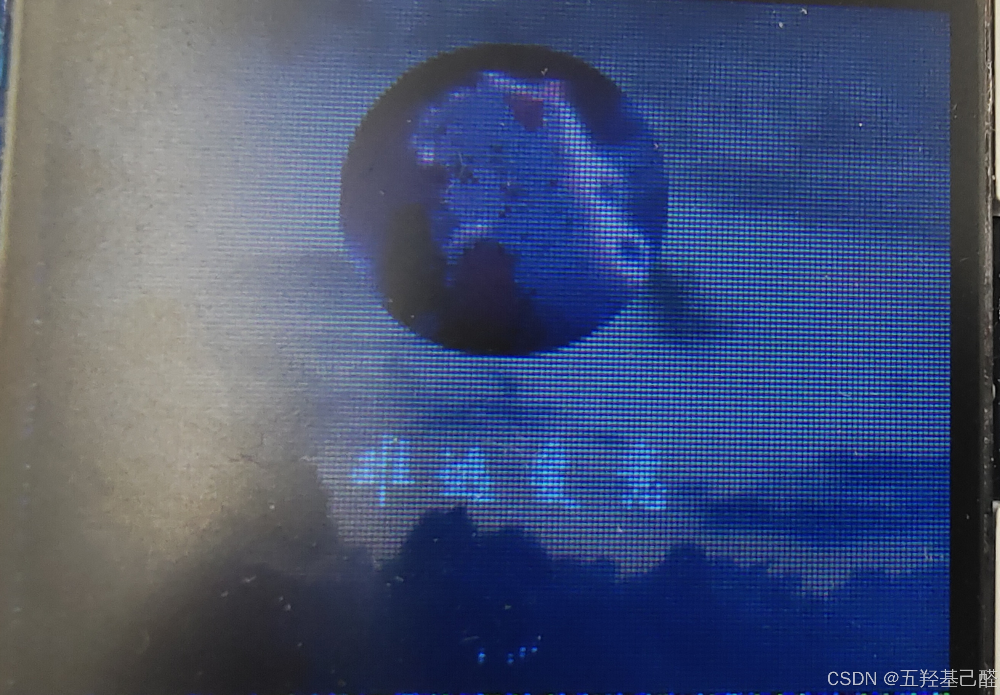

## 四.字体样式函数说明

最后对setup_scr_screen.c中的以下有关文字的函数做一个说明：

 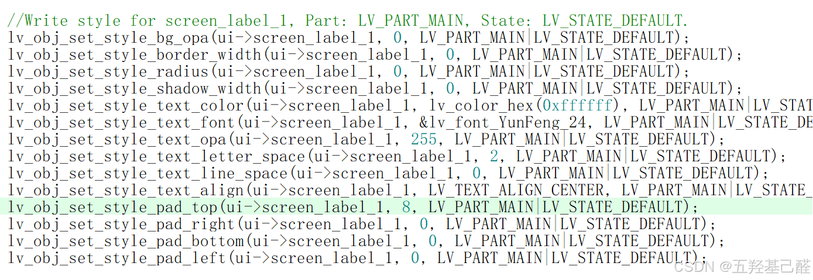

> 
> 
> - `lv_obj_set_style_bg_opa(ui->screen_label_1, 0, LV_PART_MAIN|LV_STATE_DEFAULT);` 
> 
>   - 设置背景的不透明度（opa）为0，即完全透明。 `LV_PART_MAIN` 指定样式应用于整个对象， `LV_STATE_DEFAULT` 指定样式应用于对象的默认状态。
> 
> - `lv_obj_set_style_border_width(ui->screen_label_1, 0, LV_PART_MAIN|LV_STATE_DEFAULT);` 
> 
>   - 设置边框的宽度为0，这意味着对象不会有边框。同样，样式应用于整个对象并在默认状态下生效。
> 
> - `lv_obj_set_style_radius(ui->screen_label_1, 0, LV_PART_MAIN|LV_STATE_DEFAULT);` 
> 
>   - 设置对象的圆角半径为0，这意味着对象不会有圆角。该样式应用于整个对象并在默认状态下生效。
> 
> - `lv_obj_set_style_shadow_width(ui->screen_label_1, 0, LV_PART_MAIN|LV_STATE_DEFAULT);` 
> 
>   - 设置对象阴影的宽度为0，即对象不会有阴影。样式应用于整个对象并在默认状态下生效。
> 
> - `lv_obj_set_style_text_color(ui->screen_label_1, lv_color_hex(0xffffff), LV_PART_MAIN|LV_STATE_DEFAULT);` 
> 
>   - 设置文本颜色为白色（十六进制值为 `0xffffff` ）。该样式应用于整个对象并在默认状态下生效。
> 
> - `lv_obj_set_style_text_font(ui->screen_label_1, &lv_font_YunFeng_24, LV_PART_MAIN|LV_STATE_DEFAULT);` 
> 
>   - 设置文本字体为 `lv_font_YunFeng_24` ，这是LVGL支持的字体之一。样式应用于整个对象并在默认状态下生效。
> 
> - `lv_obj_set_style_text_opa(ui->screen_label_1, 255, LV_PART_MAIN|LV_STATE_DEFAULT);` 
> 
>   - 设置文本的不透明度为255，即文本完全不透明。样式应用于整个对象并在默认状态下生效。
> 
> - `lv_obj_set_style_text_letter_space(ui->screen_label_1, 2, LV_PART_MAIN|LV_STATE_DEFAULT);` 
> 
>   - 设置文本中字母之间的间距为2个像素。样式应用于整个对象并在默认状态下生效。
> 
> - `lv_obj_set_style_text_line_space(ui->screen_label_1, 0, LV_PART_MAIN|LV_STATE_DEFAULT);` 
> 
>   - 设置文本行之间的间距为0个像素。样式应用于整个对象并在默认状态下生效。
> 
> - `lv_obj_set_style_text_align(ui->screen_label_1, LV_TEXT_ALIGN_CENTER, LV_PART_MAIN|LV_STATE_DEFAULT);` 
> 
>   - 设置文本对齐方式为居中对齐。样式应用于整个对象并在默认状态下生效。
> 
> - `lv_obj_set_style_pad_top(ui->screen_label_1, 8, LV_PART_MAIN|LV_STATE_DEFAULT);` 
> 
>   - 设置对象顶部内边距为8个像素。样式应用于整个对象并在默认状态下生效。
> 
> - `lv_obj_set_style_pad_right(ui->screen_label_1, 0, LV_PART_MAIN|LV_STATE_DEFAULT);` 
> 
>   - 设置对象右侧内边距为0个像素。样式应用于整个对象并在默认状态下生效。
> 
> - `lv_obj_set_style_pad_bottom(ui->screen_label_1, 0, LV_PART_MAIN|LV_STATE_DEFAULT);` 
> 
>   - 设置对象底部内边距为0个像素。样式应用于整个对象并在默认状态下生效。
> 
> - `lv_obj_set_style_pad_left(ui->screen_label_1, 0, LV_PART_MAIN|LV_STATE_DEFAULT);` 
> 
>   - 设置对象左侧内边距为0个像素。样式应用于整个对象并在默认状态下生效。
> 
> 

