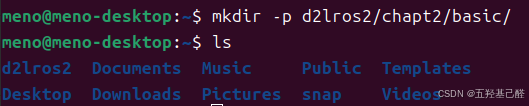
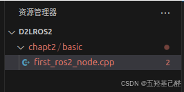
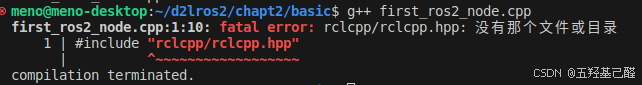
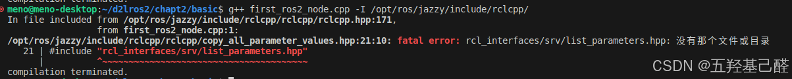
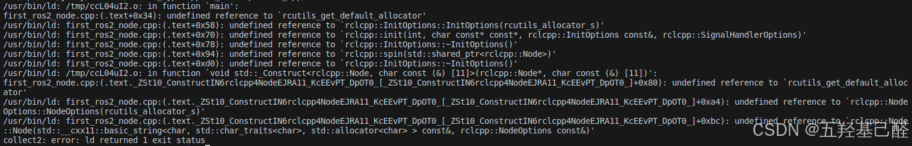
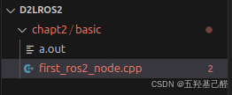
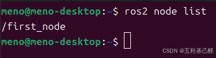

# 【Linux快速入门(一)】Linux与ROS学习之编译基础（gcc编译）

> 原创 已于 2024-10-13 22:20:06 修改 · 粉丝可见 · 1.4k 阅读 · 22 · 16 · 本内容遵循CC 4.0 BY-SA版权协议 版权声明：本文为博主原创文章，遵循 CC 4.0 BY 版权协议，转载请附上原文出处链接和本声明。 GEO检测 · 编辑
> 文章链接：https://menoking.blog.csdn.net/article/details/142733057

**目录** 

[gcc编译基础：](#gcc%E7%BC%96%E8%AF%91%E5%9F%BA%E7%A1%80%EF%BC%9A) 

[1.创建](#1.%E5%88%9B%E5%BB%BA%C2%A0) 

[2.编译](#2.%E7%BC%96%E8%AF%91) 

[3.运行](#3.%E8%BF%90%E8%A1%8C) 

---

## gcc编译

> 
> 
> - 静态链接库（Static Linking Library）：在链接步骤中，链接器将从库文件取得所需的代码，复制到生成的可执行文件中，这种库称为静态（链接）库。 **在Windows上是 `.lib` 文件，在Unix-like系统上是 `.a` 文件。**
> 
> - 动态链接库（Dynamic Linking Library）：程序编译链接阶段，动态链接库不会被整合到可执行文件中，而是会在程序运行时动态加载。 **在Windows上是 `.dll` 文件，在Unix-like系统上是 `.so` 文件。**
> 
> 

### 1.创建

使用以下命令在主文件夹中创建目录：d2lros2/chapt2/basic/

```cobol
mkdir -p d2lros2/chapt2/basic/
```

创建后可以查看到： 

接着键入：

```cobol
code d2lros2
```

这行代码是安装VSCode后，VS Code 提供的一个命令行工具，允许用户从命令行快速打开或创建文件和项目。

然后在VSCode中刚才创建的目录下新建文件first_ros2_node.cpp：

 

向其中键入：

```cobol
#include "rclcpp/rclcpp.hpp"
 
int main(int argc, char **argv)
{
    // 调用rclcpp的初始化函数
    rclcpp::init(argc, argv);
    // 调用rclcpp的循环运行我们创建的first_node节点
    rclcpp::spin(std::make_shared<rclcpp::Node>("first_node"));
    return 0;
}
```

简要说明：

> 
> 
> - 其中 **rclcpp.hpp** 是ROS2中最核心也最基础的头文件，它包含了 ROS 2 节点、执行器、计时器、参数、服务、订阅者和发布者等核心功能的声明。
> 
>   - **`.hpp`** 扩展名清楚地表明这是一个 C++ 头文件。这有助于区分 C 头文件（ `.h` ）和 C++ 头文件。
> 
> - rclcpp::init(argc, argv);用以初始化 ROS 2 系统并解析命令行参数。这是在使用任何其他 ROS 2 功能之前必须调用的函数。
> 
> - `rclcpp::spin` 是一个阻塞调用，它会保持节点运行，直到节点被关闭或者程序被终止。其内部传入使用智能指针 `std::shared_ptr创建的节点。`
> 
> 

总的来说，这段程序仅仅创建了一个空节点。

### 2.编译

我们在终端中键入：

```cobol
g++ first_ros2_node.cpp 
```

使用g++来编译刚写的C++文件。不出意外一定会报错 **No such file or directory** ，这是因为编译器无法定位到我们代码中所包含的头文件。

 

所以我们可以使用下列命令为编译器指定这个头文件的目录：

```cobol
g++ first_ros2_node.cpp -I /opt/ros/jazzy/include/rclcpp/ 
```

> 注意，这里要根据安装的ROS的版本不同选择不同目录下的命令。如果你的ROS代号为Humble，则需要把上述命令中的jazzy换为humble。

但当我们执行完后还是会报错，这是因为还有关联的其他头文件没有包含进来。 

于是：

```cobol
g++ first_ros2_node.cpp \
-I/opt/ros/jazzy/include/rclcpp/ \
-I /opt/ros/jazzy/include/rcl/ \
-I /opt/ros/jazzy/include/rcutils/ \
-I /opt/ros/jazzy/include/rmw \
-I /opt/ros/jazzy/include/rcl_yaml_param_parser/ \
-I /opt/ros/jazzy/include/rosidl_runtime_c \
-I /opt/ros/jazzy/include/rosidl_typesupport_interface \
-I /opt/ros/jazzy/include/rcpputils \
-I /opt/ros/jazzy/include/builtin_interfaces \
-I /opt/ros/jazzy/include/rosidl_runtime_cpp \
-I /opt/ros/jazzy/include/tracetools \
-I /opt/ros/jazzy/include/rcl_interfaces \
-I /opt/ros/jazzy/include/libstatistics_collector \
-I /opt/ros/jazzy/include/statistics_msgs \
-I /opt/ros/jazzy/include/service_msgs/ \
-I /opt/ros/jazzy/include/type_description_interfaces/ \
-I /opt/ros/jazzy/include/rosidl_dynamic_typesupport/ \
-I /opt/ros/jazzy/include/rosidl_typesupport_introspection_cpp/
```

这里的“\”是换行符。

运行完后错误变成了 **`undefined reference to xxxxx`** `，即无法定位到库文件，如下：` 

 

> 
> 
> - ROS2的库文件都在：/opt/ros/jazzy/lib目录下
> 
>   - 我们可以通过通过-L参数指定库目录，-l（小写L）指定库的名字。
> 
> 

于是可以在上面的那串命令下加上:-L /opt/ros/humble/lib/ \ -lrclcpp -lrcutils

```cobol
g++ first_ros2_node.cpp \
-I/opt/ros/jazzy/include/rclcpp/ \
-I /opt/ros/jazzy/include/rcl/ \
-I /opt/ros/jazzy/include/rcutils/ \
-I /opt/ros/jazzy/include/rmw \
-I /opt/ros/jazzy/include/rcl_yaml_param_parser/ \
-I /opt/ros/jazzy/include/rosidl_runtime_c \
-I /opt/ros/jazzy/include/rosidl_typesupport_interface \
-I /opt/ros/jazzy/include/rcpputils \
-I /opt/ros/jazzy/include/builtin_interfaces \
-I /opt/ros/jazzy/include/rosidl_runtime_cpp \
-I /opt/ros/jazzy/include/tracetools \
-I /opt/ros/jazzy/include/rcl_interfaces \
-I /opt/ros/jazzy/include/libstatistics_collector \
-I /opt/ros/jazzy/include/statistics_msgs \
-I /opt/ros/jazzy/include/service_msgs/ \
-I /opt/ros/jazzy/include/type_description_interfaces/ \
-I /opt/ros/jazzy/include/rosidl_dynamic_typesupport/ \
-I /opt/ros/jazzy/include/rosidl_typesupport_introspection_cpp/ \
-L /opt/ros/jazzy/lib/ \
-lrclcpp -lrcutils
```

执行完以上命令后会产生一个目标文件 

此时即为编译成功。

### 3.运行

键入以下命令，在执行当前目录下的a.out文件

```csharp
./a.out
```

在新终端下键入下列命令即可查看运行结果：

```cobol
ros2 node list
```

 

至此，你不仅创建了第一个ROS节点，而且还学会了Linux下gcc的编译方法。