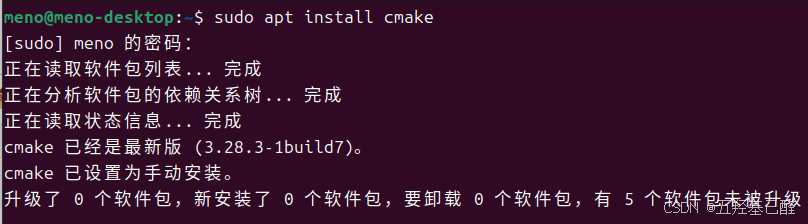
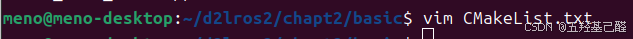
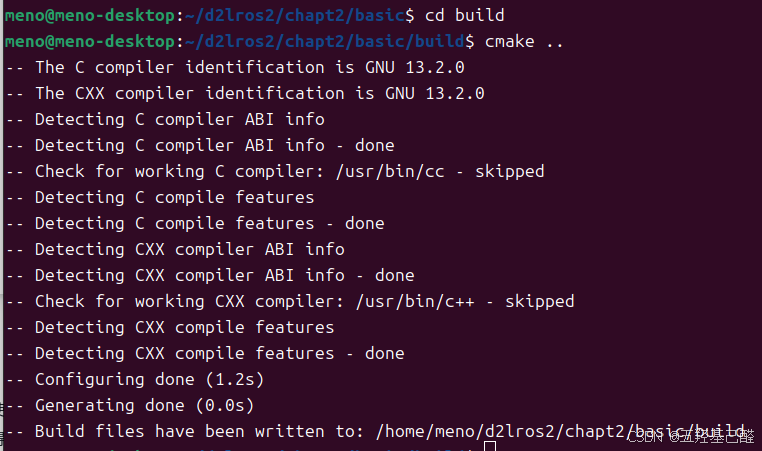
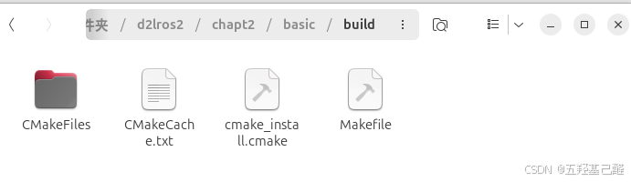
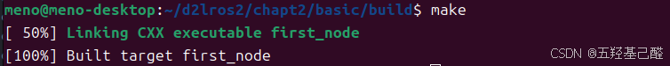
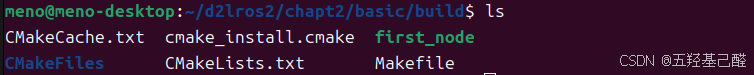
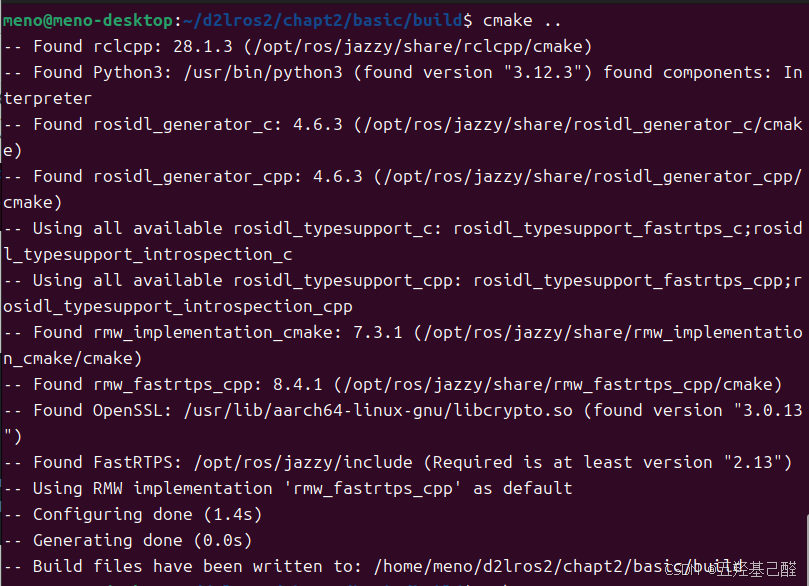
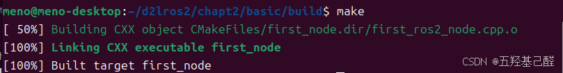

# 【Linux快速入门(三)】Linux与ROS学习之编译基础（Cmake编译）

> 原创 于 2024-10-21 12:30:31 发布 · 粉丝可见 · 1.3k 阅读 · 15 · 18 · 本内容遵循CC 4.0 BY-SA版权协议 版权声明：本文为博主原创文章，遵循 CC 4.0 BY 版权协议，转载请附上原文出处链接和本声明。 GEO检测 · 编辑
> 文章链接：https://menoking.blog.csdn.net/article/details/142906565

**目录**

[TOC]

---

## 零.前置篇章

1. [【Linux快速入门(一)】Linux与ROS学习之编译基础（gcc编译）_ros linux-CSDN博客](https://blog.csdn.net/2203_75993546/article/details/142733057?fromshare=blogdetail&sharetype=blogdetail&sharerId=142733057&sharerefer=PC&sharesource=2203_75993546&sharefrom=from_link)

2. [【Linux快速入门(二)】Linux与ROS学习之编译基础（make编译）_linux和ros-CSDN博客](https://blog.csdn.net/2203_75993546/article/details/142905251?fromshare=blogdetail&sharetype=blogdetail&sharerId=142905251&sharerefer=PC&sharesource=2203_75993546&sharefrom=from_link)

## 一.Cmake的由来

CMake 是一个跨平台的安装（编译）工具，它使用简单的声明性语句描述所有平台的安装（编译过程）。

> **Cmake可以自动生成MakeFile，其通过调用CMakeLists.txt直接生成Makefile。** 

## 二.安装

```cpp
sudo apt install cmake
```

 

## 三.创建并编写CMakeLists.txt

在 `d2lros2/d2lros2/chapt2/basic下使用vim编辑器` 新建CMakeList.txt文件:

 

向其中写入：

```cpp
cmake_minimum_required(VERSION 3.22)
 
project(first_node)
 
include_directories(/opt/ros/jazzy/include/rclcpp/)
include_directories(/opt/ros/jazzy/include/rcl/)
include_directories(/opt/ros/jazzy/include/rcutils/)
include_directories(/opt/ros/jazzy/include/rmw)
include_directories(/opt/ros/jazzy/include/rcl_yaml_param_parser/)
include_directories(/opt/ros/jazzy/include/rosidl_runtime_c)
include_directories(/opt/ros/jazzy/include/rosidl_typesupport_interface)
include_directories(/opt/ros/jazzy/include/rcpputils)
include_directories(/opt/ros/jazzy/include/builtin_interfaces)
include_directories(/opt/ros/jazzy/include/rosidl_runtime_cpp)
include_directories(/opt/ros/jazzy/include/tracetools)
include_directories(/opt/ros/jazzy/include/rcl_interfaces)
include_directories(/opt/ros/jazzy/include/libstatistics_collector)
include_directories(/opt/ros/jazzy/include/statistics_msgs)
include_directories(/opt/ros/jazzy/include/service_msgs/)
include_directories(/opt/ros/jazzy/include/type_description_interfaces/)
include_directories(/opt/ros/jazzy/include/rosidl_dynamic_typesupport/)
include_directories(/opt/ros/jazzy/include/rosidl_typesupport_introspection_cpp/)
 
link_directories(/opt/ros/jazzy/lib/)
 
add_executable(first_node first_ros2_node.cpp)
 
target_link_libraries(first_node rclcpp rcutils)
```

> 
> 
> - **`include_directories`** 是CMake构建系统中用来指定头文件搜索路径的命令。当你使用这个命令时，你告诉CMake在编译项目时要包含哪些目录，以便编译器可以找到所需的头文件（.h文件）。
> 
> - **`link_directories`** 用于指定链接器搜索库文件（例如 `.a` 或 `.so` 文件）的目录。当你需要链接到不在默认搜索路径中的库时，这个命令非常有用。
> 
> - **`add_executable`** 是 CMake 中用于定义可执行文件的命令。当你使用 CMake 来构建一个项目时，你需要告诉 CMake 你想要构建哪些可执行文件，以及这些可执行文件是由哪些源文件编译而成的。
> 
> - **`target_link_libraries`** 用于指定目标（比如可执行文件或库）需要链接的库。当你定义了一个或多个可执行文件或库，并且它们依赖于其他库时，你需要使用 `target_link_libraries` 来告诉 CMake 如何将它们链接起来。
> 
> 

## 四.编译

这里我们先创建一个项目代码下的新目录build：

```cpp
mkdir build
cd build
```

在上级目录下找到CMakeList.txt文件，然后运行：

```cpp
cmake ..
```

由于我们是在build目录下运行的命令，于是运行CMake后生成的makefile就保存在了build下：

 

 

在build目录下运行make编译：

```cpp
make
```

 

然后在build目录下就生成了first_node节点

 

## 五.优化CMakeLists.txt文件

我们需要先了解一下 `find_package命令：` 

> **`find_package`** 是CMake中的一个命令，用于查找并加载外部项目的配置。在CMake中，当你想要使用其他库或项目时， `find_package` 会尝试在系统中找到这些依赖项，并设置必要的变量以便在当前项目中使用它们。

其将通过以下环境变量来指定查找路径：

```cpp
<package>_DIR
CMAKE_PREFIX_PATH
CMAKE_FRAMEWORK_PATH
CMAKE_APPBUNDLE_PATH
PATH
```

于是我们可以把以上CMake文件修改为：

```cpp
cmake_minimum_required(VERSION 3.22)
 
project(first_node)
 
find_package(rclcpp REQUIRED)
add_executable(first_node first_ros2_node.cpp)
target_link_libraries(first_node rclcpp::rclcpp)
 
```

接着也可以编译：

```cpp
cmake ..
make
```

 

 

