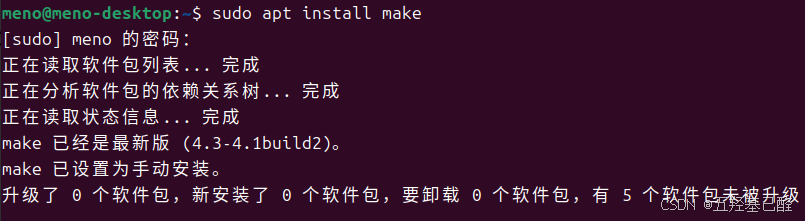
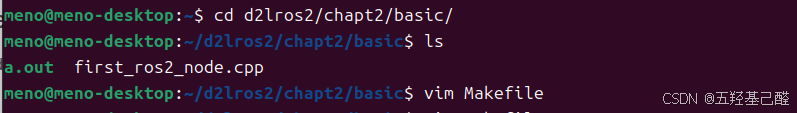
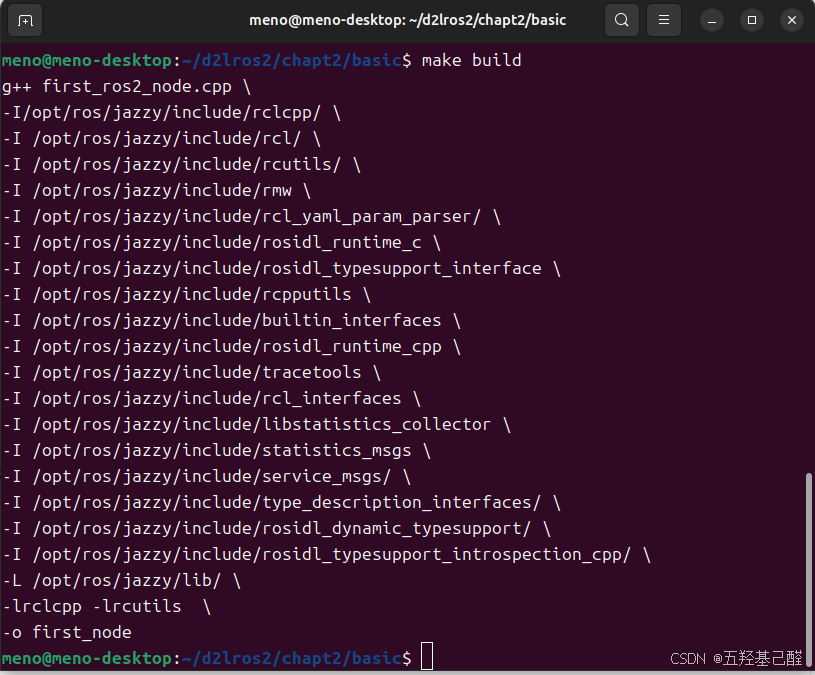
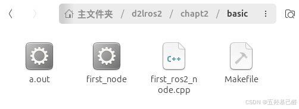
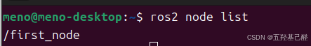
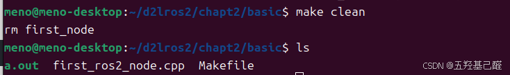

# 【Linux快速入门(二)】Linux与ROS学习之编译基础（make编译）

> 原创 已于 2024-10-20 22:13:40 修改 · 粉丝可见 · 812 阅读 · 12 · 8 · 本内容遵循CC 4.0 BY-SA版权协议 版权声明：本文为博主原创文章，遵循 CC 4.0 BY 版权协议，转载请附上原文出处链接和本声明。 GEO检测 · 编辑
> 文章链接：https://menoking.blog.csdn.net/article/details/142905251

**目录**

[TOC]

---

## 零.前置篇章

1. 第一篇 [【Linux快速入门】Linux与ROS学习之编译基础（gcc编译）_linux+ros-CSDN博客](https://blog.csdn.net/2203_75993546/article/details/142733057?fromshare=blogdetail&sharetype=blogdetail&sharerId=142733057&sharerefer=PC&sharesource=2203_75993546&sharefrom=from_link)

## 一.make的由来

"make"是一个用于自动化构建软件的工具，通常用于编译和构建程序。当你运行make命令时，make工具会查找当前目录下的Makefile文件，该文件包含了编译程序所需的指令和规则。

make起初是人们为了简化g++编译而发明出来的批处理工具，通过其自动调用指令而进行编译。

## 二.安装make

```cpp
sudo apt install make
```

 

## 三.编写Makefile

进入到 `d2lros2/d2lros2/chapt2/basic` 下使用vim新建 `Makefile。` 

 

然后将上一篇中的的g++编译指令用下面的形式写到Makefile里（最好要熟悉或者会使用基础的vim指令）。

```cpp
build:
        g++ first_ros2_node.cpp \
        -I /opt/ros/jazzy/include/rclcpp/ \
        -I /opt/ros/jazzy/include/rcl/ \
        -I /opt/ros/jazzy/include/rcutils/ \
        -I /opt/ros/jazzy/include/rmw \
        -I /opt/ros/jazzy/include/rcl_yaml_param_parser/ \
        -I /opt/ros/jazzy/include/rosidl_runtime_c \
        -I /opt/ros/jazzy/include/rosidl_typesupport_interface \
        -I /opt/ros/jazzy/include/rcpputils \
        -I /opt/ros/jazzy/include/builtin_interfaces \
        -I /opt/ros/jazzy/include/rosidl_runtime_cpp \
        -I /opt/ros/jazzy/include/tracetools \
        -I /opt/ros/jazzy/include/rcl_interfaces \
        -I /opt/ros/jazzy/include/libstatistics_collector \
        -I /opt/ros/jazzy/include/statistics_msgs \
        -I /opt/ros/jazzy/include/service_msgs/ \
        -I /opt/ros/jazzy/include/type_description_interfaces/ \
        -I /opt/ros/jazzy/include/rosidl_dynamic_typesupport/ \
        -I /opt/ros/jazzy/include/rosidl_typesupport_introspection_cpp/ \
        -L /opt/ros/jazzy/lib/ \
        -lrclcpp -lrcutils  \
        -o first_node
 
#编译执行完后立刻删除first_node
clean:
        rm first_node
```

## 四.编译运行

键入以下命令即可编译生成可执行文件：

```cpp
make build
```

 

 

运行该文件：

```cpp
./first_node
```

开启新终端，可查看ros节点列表：

```cpp
ros2 node list
```

 

## 五.删除可执行文件

```cpp
make clean
```

 

