# 【Markdown速成】半小时入门Markdown教程(后缀.md文件详解)

> 原创 已于 2026-05-17 14:15:10 修改 · 粉丝可见 · 6.9k 阅读 · 44 · 43 · 本内容遵循CC 4.0 BY-SA版权协议 版权声明：本文为博主原创文章，遵循 CC 4.0 BY 版权协议，转载请附上原文出处链接和本声明。 GEO检测 · 编辑
> 文章链接：https://menoking.blog.csdn.net/article/details/143011436

**目录**

[TOC]


## 一.认识Markdown

### Markdown

作为程序员我们经常会看到 **README.md** 这种说明文件，以. **md** 为后缀的文件就是我们所说的Markdown的文件。 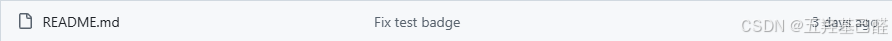

> 实际上，Markdown是一种轻量级标记语言，它允许人们使用易读易写的纯文本格式编写文档，然后转换成结构化的HTML代码。

### Typora

Typora则是一款轻量级的Markdown编辑器，采用的是实时预览的模式，启动速度快，界面简洁，是一款极其优秀的软件。 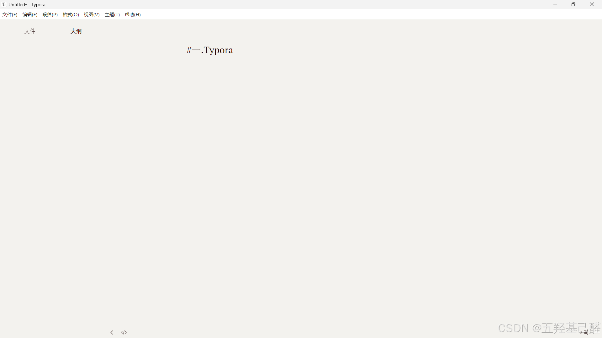

## 二.Typora设置

单击 **文件->偏好设置** 进入到设置界面

这里的Markdown扩展语法最好全部勾选上

 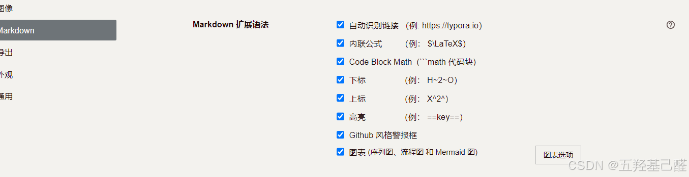

自动保存最好也勾选上

 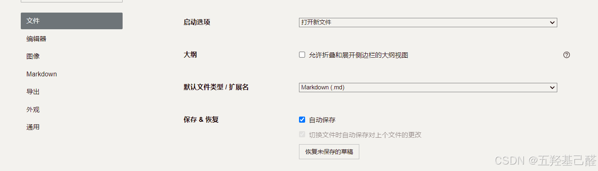

## 三.Markdown语法

### 1.标题

> 标题：使用'#'+' '来表示标题，一级标题用一个 `#` ，二级标题用两个 `##` ，以此类推，最多六级标题。！！！后面要加空格才能正确表示！！！

 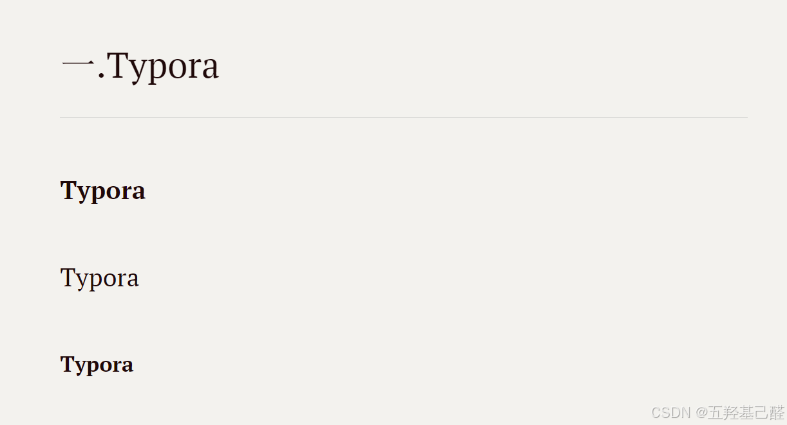

### 2.正文

#### 2.1分割线

> 
> 
> - "+++"/"***"/"---"+回车
> 
> 

 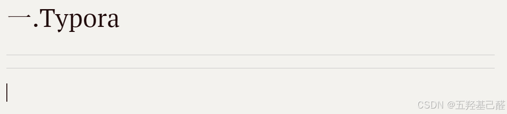

#### 2.2删除线

> "~~"+文本+"~~"

 

#### 2.3下划线

> "<u>"+文本+"</u>"

 

#### 2.4斜体

单个符号：

> 
> 
> - '*'+文本+‘*’
> 
> - ’_‘+文本+‘_’
> 
> 

 

#### 2.5粗体

两个符号：

> 
> 
> - '**'+文本+‘**’
> 
> - ’__‘+文本+‘__’
> 
> 

 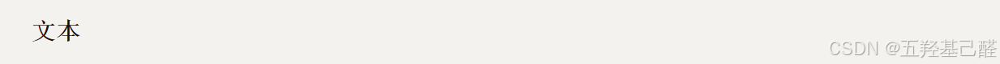

#### 2.6斜粗体

三个符号：

> 
> 
> - '***'+文本+‘***’
> 
> - ’___‘+文本+‘___’
> 
> 

 

#### 2.7高亮

> "=="+文本+"=="

 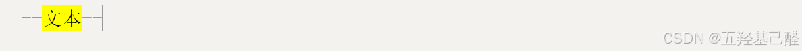

#### 2.8字体属性（大小及颜色）

> <font size=3 color="red">文本</font>

 

#### 2.9对齐方式

> <p align="center">文本</p>

 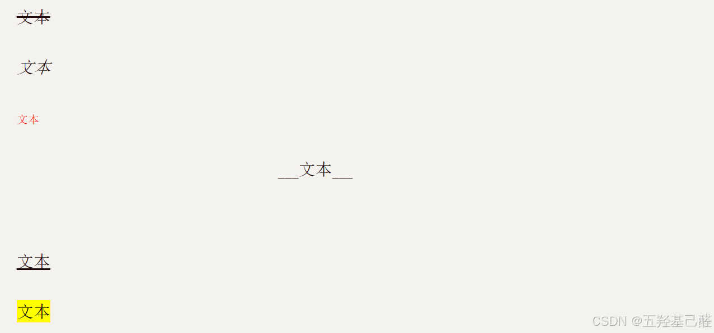

#### 2.10引用

> 
> 
> - '>'一级引用
> 
> - ‘>>’二级引用
> 
> - ... ...
> 
> 

 

### 3.列表

#### 无序列表

> '-'+空格

 

#### 有序列表

> "1."+空格

 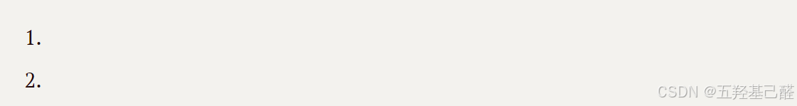

### 4.超链接

> ["文本"]("链接")

 

 

> <"链接">

 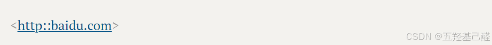

### 5.表格

表格的创建建议自动创建或者快捷键Ctrl+T

 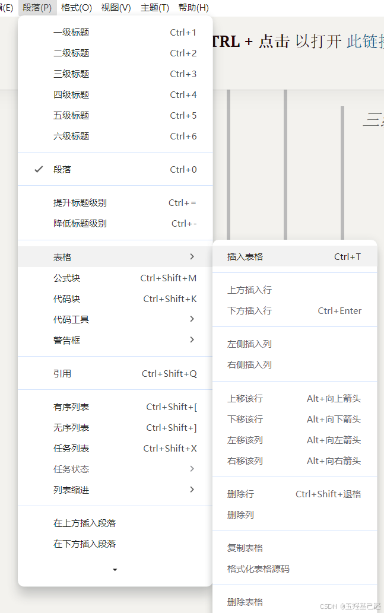

 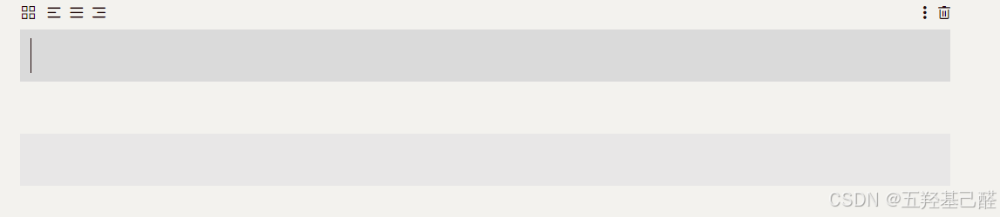

### 6.代码

> "```"+对应语言

 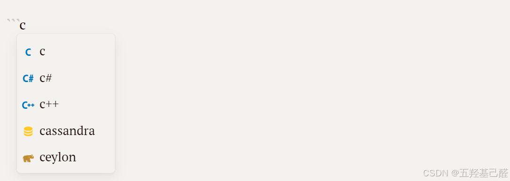

 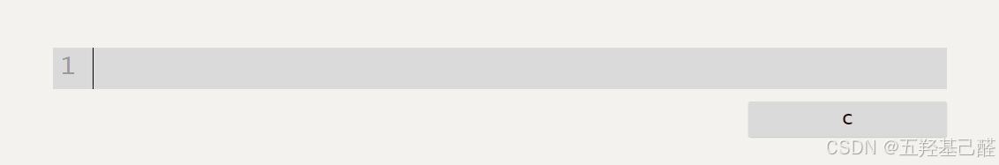

不定语言代码块CTRL+shift+k：

###  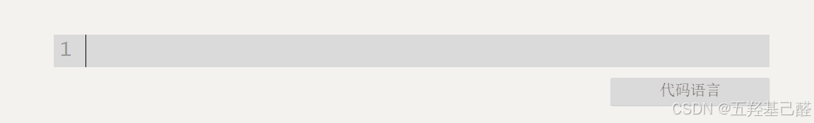

### 7.图片

> 

或html方式写法：

```html
<p align="center">

</p>
```

## 四.总结

至此，markdown的基础大概都讲完了，运用以上样式方法可以写出一篇很不错的文章了，祝大家用Typora都能够”下笔如有神“！