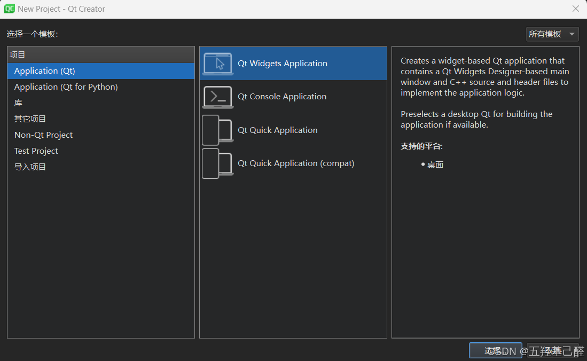
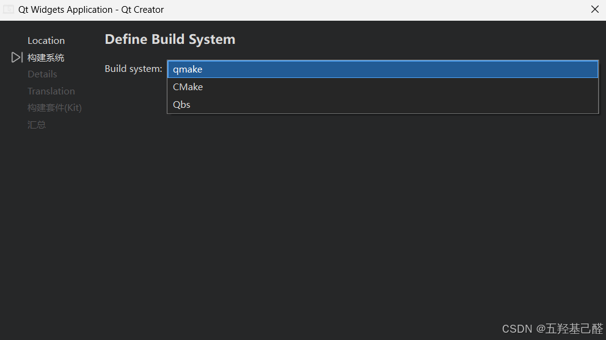
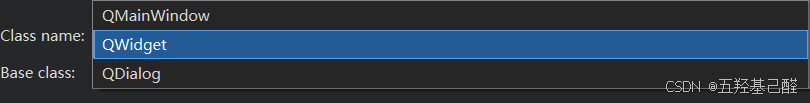
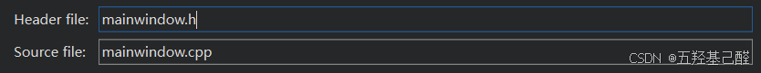
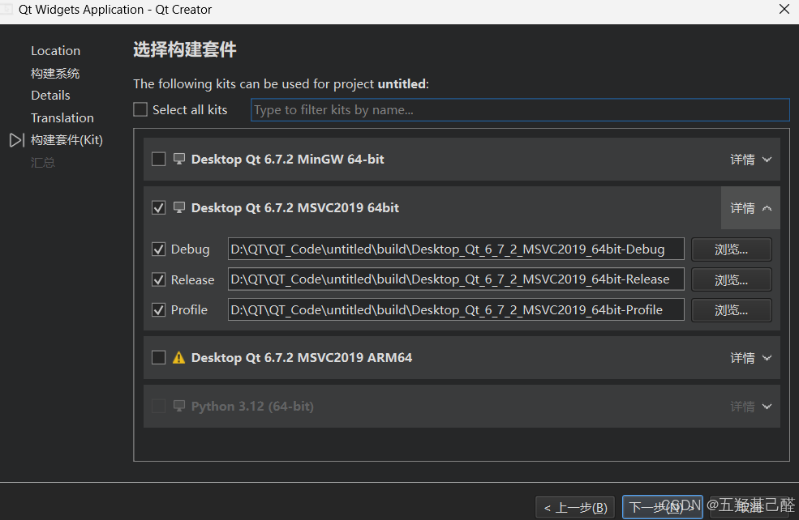
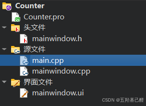

# 【QT速成】半小时入门QT6之QT前置知识扫盲(超详细QT工程解析)

> 原创 已于 2024-11-01 20:55:16 修改 · 粉丝可见 · 2.3k 阅读 · 34 · 18 · 本内容遵循CC 4.0 BY-SA版权协议 版权声明：本文为博主原创文章，遵循 CC 4.0 BY 版权协议，转载请附上原文出处链接和本声明。 GEO检测 · 编辑
> 文章链接：https://menoking.blog.csdn.net/article/details/143060051

**目录**

[TOC]

## 一.QT工程介绍

### 1.创建工程

#### Model

 

QT创建工程时首先会让我们选择项目模板，对应的英文解释很详尽，这里我们也可做一下简单介绍。

> 
> 
> 1. **应用程序 (Application)** 
> 
>    - **Qt Widgets Application** : 用于创建基于Qt Widgets（即Qt GUI库）的传统桌面应用程序。
> 
>    - **Qt Quick Application** : 用于创建使用Qt Quick和QML的现代化、动态用户界面的应用程序。
> 
>    - **Qt Console Application** : 用于创建没有图形用户界面的控制台应用程序。
> 
>    - **Qt Quick Application (compat)** 创建使用 Qt Quick 和 QML 技术的兼容性应用程序。这个模板与其他 Qt Quick 应用程序模板的主要区别在于它提供了对较旧版本的 Qt Quick 的支持，这意味着它可以运行在早期版本的 Qt 上。
> 
> 2. **Application (Qt for Python)** 
> 
>    - **Empty Application** :这个模板创建一个最小的Qt项目，它通常只包含一个空的C++类，没有用户界面。这是当你想要从头开始创建一个应用程序，而不需要任何预定义的UI元素时使用的。
> 
>    - **Empty Window** :这个模板创建一个带有基本窗口的项目，窗口是基于Qt Widgets库的。这个模板适合当你想要创建一个带有传统桌面UI的应用程序时使用。
> 
>    - **Window UI** :这个模板可能是一个特定于Qt Creator版本或自定义模板的名称。通常，这意味着它将创建一个带有预定义窗口用户界面的项目。这可能是Qt Widgets或Qt Quick的窗口，具体取决于模板的定义。
> 
>    - **Qt Quick Application - Empty** :这个模板创建一个使用Qt Quick和QML技术的项目，但不包含任何预定义的UI元素。Qt Quick是Qt框架的一部分，它允许使用QML语言来创建现代的用户界面。这个模板适合当你想要使用Qt Quick来设计应用程序的UI，但希望完全从头开始时使用。
> 
> 3. **库：** 
> 
>    - **C++ Library:** 这个模板用于创建一个C++库项目。库是一段可重用的代码，可以由其他应用程序或库调用。这个模板适合当你需要开发一个可以由多个项目共享的代码库时使用。你可以选择创建静态库或动态库。
> 
>    - **Qt Quick 2 Extension Plugin:** 这个模板用于创建一个Qt Quick 2的扩展插件。Qt Quick 2是Qt框架的一部分，它允许使用QML语言来创建现代的用户界面。扩展插件允许你为Qt Quick 2添加新的类型和功能。这个模板适合当你需要为Qt Quick应用程序创建自定义的UI组件或效果时使用。
> 
>    - **Qt Creator Plugin:** 这个模板用于创建一个Qt Creator的插件。Qt Creator是Qt官方提供的集成开发环境。通过创建插件，你可以扩展Qt Creator的功能，例如添加新的工具、编辑器或集成其他工具链。这个模板适合当你需要定制或扩展Qt Creator的行为时使用。
> 
> 

一般我们使用 **Qt Widgets Application** 即可。

#### DefineBuildSystem

 

> 
> 
> 1. **qmake** :
> 
>    - qmake是Qt框架的一部分，它是一个用于生成Makefile的工具。qmake使用.pro文件来描述项目的构建配置，包括源文件、库依赖关系、编译器选项等。qmake会根据.pro文件生成适用于不同平台的Makefile，然后你可以使用make工具来构建项目。
> 
> 2. **CMake** :
> 
>    - CMake是一个跨平台的安装（编译）工具，它使用CMakeLists.txt文件来描述项目的构建配置。CMake支持复杂的构建逻辑，并且可以生成适用于不同构建系统的构建文件，如Makefile、Visual Studio项目文件等。CMake在开源社区中非常流行，并且支持许多不同的编程语言。
> 
> 3. **Qbs** :
> 
>    - Qbs（Qt Build System）是一个跨平台的构建工具，它使用QML-like语言来描述项目的构建配置。Qbs旨在提供更快的构建速度和更灵活的构建配置。它可以生成适用于不同平台的构建文件，并且可以与Qt Creator无缝集成。
> 
> 

初学者选择qmake即可。

#### Class Information

##### Base class

 

> 
> 
> 1. **QMainWindow** :
> 
>    - QMainWindow是Qt中用于创建主窗口的类。它通常用于应用程序的主窗口，提供了菜单栏、工具栏、状态栏和中心小部件（central widget）的标准布局。
> 
>    - QMainWindow通常用作应用程序的主要用户界面容器，特别是当应用程序需要具有典型的窗口装饰（如标题栏、边框等）时。
> 
> 2. **QWidget** :
> 
>    - QWidget是所有用户界面对象的基类。它提供了基本的应用程序构建块，如按钮、文本框、标签等。
> 
>    - QWidget可以是一个独立的窗口，也可以嵌入到其他窗口中。它是最通用的窗口类，可以用来创建各种类型的用户界面元素。
> 
> 3. **QDialog** :
> 
>    - QDialog是一个用于创建对话框窗口的类。对话框通常用于与应用程序的用户进行交互，如输入数据、修改设置或显示信息。
> 
>    - QDialog通常是一个模态窗口，这意味着在用户与对话框交互时，它可能会阻止用户与主窗口的其他部分交互。
> 
> 

 

> 
> 
> 1. `mainwindow.h` :
> 
>    - 这是一个头文件（header file），通常包含MainWindow类的声明。
> 
>    - 在这个文件中，你会定义MainWindow类，包括它的公共接口（public）、保护成员（protected）和私有成员（private）。
> 
>    - 你还会声明与MainWindow类相关的信号（signals）和槽（slots），以及任何需要的枚举（enums）、类型别名（typedefs）等。
> 
>    - 这个文件通常以 `.h` 或 `.hpp` 结尾，表示它是一个头文件。
> 
> 2. `mainwindow.cpp` :
> 
>    - 这是一个源文件（source file），包含MainWindow类的实现。
> 
>    - 在这个文件中，你会编写MainWindow类成员函数的定义，包括构造函数、析构函数、公共接口函数、槽函数等。
> 
>    - 你还会实现与用户界面相关的逻辑，例如初始化UI组件、处理用户输入、更新UI等。
> 
>    - 这个文件通常以 `.cpp` 结尾，表示它是一个C++源文件。
> 
> 

 

> **`mainwindow.ui`** 是一个用户界面文件，它定义了应用程序主窗口的用户界面布局和组件。这个文件通常由Qt Designer编辑，Qt Designer是一个可视化的工具，允许开发者通过拖放控件来设计用户界面，而不是直接编写代码。

#### Kit

 

> 在Qt开发中，构建套件通常包括Qt库、编译器、调试器和其他工具，它们共同工作来将你的代码转换成可执行的应用程序。
> 
> **影响因素：** 
> 
> 1. **目标平台** ：选择与你的目标平台相匹配的构建套件。例如，如果你正在为Windows开发，那么使用MSVC编译器的套件可能是合适的选择。
> 
> 2. **编译器** ：不同的编译器可能会影响你的应用程序的性能和兼容性。MinGW和MSVC是两种常用的编译器，它们各有优势。
> 
> 3. **架构** ：选择与你的目标系统架构相匹配的套件。例如，如果你的目标是ARM架构，那么选择ARM64的套件。
> 
> 4. **Qt版本** ：确保选择的构建套件与你的Qt代码兼容。不同的Qt版本可能有不兼容的API更改。
> 
> 5. **其他工具** ：考虑是否需要构建套件中包含的其他工具，如调试器或性能分析工具。
> 
> 

我安装的三种套件：

> 
> 
> 1. **Desktop Qt 6.7.2 MinGW 64-bit** :
> 
>    - 这是一个针对桌面应用的Qt开发环境。
> 
>    - 使用MinGW编译器，这是一个适用于Windows平台的GNU编译器集合，支持64位架构。
> 
>    - MinGW通常被认为是一个轻量级的编译器，易于安装和使用。
> 
>    - 它适合于开发不需要特定于Microsoft Visual C++编译器的Windows应用程序。
> 
> 2. **Desktop Qt 6.7.2 MSVC2019 64-bit** :
> 
>    - 这个构建套件同样针对桌面应用，但使用的是Microsoft Visual C++ 2019编译器。
> 
>    - MSVC是微软提供的编译器，通常与Windows操作系统紧密集成，支持最新的Windows API。
> 
>    - 它适合于需要充分利用Windows平台特性的应用程序，或者当你的代码依赖于MSVC编译器特定的功能时。
> 
> 3. **Desktop Qt 6.7.2 MSVC2019 ARM64** :
> 
>    - 这个构建套件也是用于桌面应用，但它是为ARM64架构设计的，这意味着它是用来编译在ARM64处理器上运行的应用程序。
> 
>    - 使用Microsoft Visual C++ 2019编译器，专门针对ARM64架构进行了优化。
> 
>    - ARM64架构通常用于移动设备、嵌入式系统和一些高性能计算场景。
> 
>    - 由于旁边有警告标志，可能表明这个构建套件有一些特殊要求或者限制，使用时需要特别注意。
> 
> 

一般来说如果我们只在Windows上进行开发，则选择 **MSVC2019** 的Kit即可。如果有跨平台的需求，选择 **MinGW** 即可 **。** 

## 二.工程构成

 

> 
> 
> 1. **mainwindow.h** :
> 
>    - 这个文件用于声明MainWindow类，包括类的成员变量和成员函数的声明。
> 
>    - 通常，你会在这个文件中定义用户界面上的控件和信号槽的声明。
> 
>    - 例如，如果你有一个按钮和一个标签，你会在mainwindow.h中声明这些控件的指针和相关的槽函数。
> 
> 2. **main.cpp** :
> 
>    - 这个文件包含了应用程序的入口点，即main函数。
> 
>    - main函数的主要任务是创建一个应用程序实例，并创建和显示主窗口（MainWindow）。
> 
>    - 通常，这个文件中的代码量相对较少，主要关注应用程序的初始化和启动。
> 
> 3. **mainwindow.cpp** :
> 
>    - 这个文件是MainWindow类的实现，包含mainwindow.h中声明的成员函数的定义。
> 
>    - 你会在这个文件中编写用户界面的逻辑，如按钮点击事件的处理函数、数据处理的函数等。
> 
>    - 例如，如果你有一个按钮点击后要更新标签的文本，那么按钮点击事件的槽函数就会在mainwindow.cpp中实现。
> 
> 4. **mainwindow.ui** :
> 
>    - 这个文件是由Qt Designer生成的，它定义了用户界面的布局和控件。
> 
>    - 你可以使用Qt Designer来拖放控件，设置它们的属性，以及定义它们之间的布局关系。
> 
>    - 在运行时，mainwindow.ui文件会被Qt加载并自动生成对应的C++代码，这些代码用于创建和管理用户界面。
> 
> 

一般来说我们只要知道，我们的主函数，主逻辑执行，会在 **main.cpp** 中，并尽量不向其中添加过多的代码；我们的功能函数，以及槽函数会在 **mainwindow.cpp；** 槽函数的声明控件的声明会在 **mainwindow.h** ；使用Qt Designer来拖放控件在 **mainwindow.ui** 。

 

> `.pro` 文件是一个重要的配置文件，它用于定义项目的构建配置和依赖关系。这个文件通常由Qt Creator自动生成，但也可以手动编辑。

这个文件只有选择了qmake时才会存在。

## 三.界面模板

向工程中添加QT文件时会遇到的选项

### Templates

> 
> 
> 1. **Dialog with Buttons Bottom** ：
> 
>    - 一种对话框，其按钮（如“OK”和“Cancel”）位于对话框的底部。
> 
> 2. **Dialog with Buttons Right** ：
> 
>    - 对话框，其按钮位于对话框的右侧。
> 
> 3. **Dialog without Buttons** ：
> 
>    - 简单的对话框，不包含任何按钮。通常用于显示信息。
> 
> 4. **Main Window** ：
> 
>    - 主窗口，通常包含菜单栏、工具栏、状态栏和中心小部件。
> 
> 5. **Widget** ：
> 
>    - 通用窗口容器，可以用来创建各种类型的窗口。
> 
> 

### 窗口部件

> 
> 
> 1. **QDockWidget** ：
> 
>    - 可停靠窗口，可以附着在主窗口的边缘或作为独立的窗口浮动。
> 
> 2. **QFrame** ：
> 
>    - 一个带有边框和标题的容器，用于将界面元素分组。
> 
> 3. **QGroupBox** ：
> 
>    - 用于将相关的小部件组合在一起，通常包含一个标题栏。
> 
> 4. **QScrollArea** ：
> 
>    - 提供滚动条的容器，用于显示内容超过可视区域的部分。
> 
> 5. **QMdiArea** ：
> 
>    - 多文档界面区域，可以包含多个QMdiSubWindow窗口。
> 
> 6. **QTabWidget** ：
> 
>    - 选项卡窗口，每个选项卡可以包含不同的内容。
> 
> 7. **QToolBox** ：
> 
>    - 一个带有标签的分隔面板，每个标签下可以包含一组小部件。
> 
> 8. **QStackedWidget** ：
> 
>    - 一组堆叠的小部件，每次只显示一个小部件。
> 
> 9. **QWizard** ：
> 
>    - 向导窗口，用于创建分步骤的向导界面。
> 
> 10. **QWizardPage** ：
> 
>    - 向导窗口中的一个单独页面。
> 
> 

## 四.类汇总

1. **QApplication** ：

   - 每个Qt GUI应用程序必须创建一个 QApplication 对象。它管理应用程序的控制流和主要设置。

2. **QWidget** ：

   - QWidget 是所有用户界面对象的基类。它提供了基本的应用程序构建块，如按钮、文本框、菜单等。

3. **QMainWindow** ：

   - QMainWindow 提供了一个主应用程序窗口，通常包含菜单栏、工具栏、状态栏等。

4. **QDialog** ：

   - QDialog 是用于对话框的基类，用于创建与用户交互的对话框窗口。

5. **QLabel, QLineEdit, QPushButton, QComboBox** ：

   - 这些是常见的GUI控件类，分别用于显示文本、接收用户输入、创建按钮和下拉列表。

6. **QLayout** ：

   - QLayout 用于管理控件在窗口中的布局，如 QVBoxLayout、QHBoxLayout 等。

7. **QMessageBox** ：

   - QMessageBox 用于显示消息对话框，如错误消息、警告消息等。

8. **QFile, QFileInfo, QDir** ：

   - 这些类用于文件和目录的操作，如打开、读取、写入文件，获取文件信息，以及操作目录结构。

9. **QDataStream, QTextStream** ：

   - 用于读写二进制数据和文本数据，它们提供了方便的数据格式化功能。

10. **QTimer** ：

   - QTimer 用于创建定时器，可以在指定的时间间隔内触发事件。

11. **QThread** ：

   - QThread 用于创建和管理线程，实现多线程编程。

12. **QNetworkAccessManager** ：

   - 用于处理网络请求，如HTTP请求，支持网络编程。

13. **QSqlQuery, QSqlDatabase** ：

   - 这些类用于数据库操作，如执行SQL查询、管理数据库连接等。

14. **QSettings** ：

   - 用于读取和写入应用程序设置，支持多种存储格式，如INI文件、注册表等。

15. **QEvent** ：

   - QEvent 是所有事件对象的基类，Qt中的事件处理机制基于这个类。

16. **QFile** ：

   - QFile 类提供了对文件的读写操作。它可以打开文件，读取文件内容，写入数据到文件，以及关闭文件。QFile 支持多种打开模式，如只读、只写、读写、追加等。

17. **QFileInfo** ：

   - QFileInfo 类提供了与文件有关的信息，如文件名、路径、大小、创建日期、最后修改日期等。它不直接操作文件内容，而是提供关于文件属性的静态信息。

18. **QDir** ：

   - QDir 类提供了对目录的操作，如列出目录中的文件和子目录、创建、删除和重命名目录、遍历目录结构等。

