# 【QT速成】半小时入门QT6简明教程（QT快速入门）

> 原创 已于 2024-11-03 20:08:10 修改 · 粉丝可见 · 3.6k 阅读 · 25 · 21 · 本内容遵循CC 4.0 BY-SA版权协议 版权声明：本文为博主原创文章，遵循 CC 4.0 BY 版权协议，转载请附上原文出处链接和本声明。 GEO检测 · 编辑
> 文章链接：https://menoking.blog.csdn.net/article/details/142070871

**目录**

[TOC]


> ## 关于环境变量配置问题：
> 
>  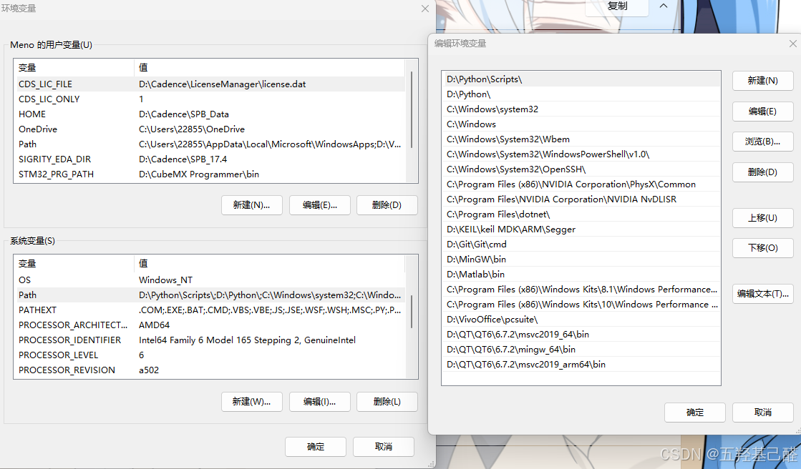
> 
>  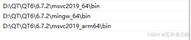
> 
> 这里注意顺序问题！优先使用的编译器，如D:\QT\QT6\6.7.2\msvc2019_64\bin一定要上移到前面！

**目录** 

[关于环境变量配置问题：](#%E5%85%B3%E4%BA%8E%E7%8E%AF%E5%A2%83%E5%8F%98%E9%87%8F%E9%85%8D%E7%BD%AE%E9%97%AE%E9%A2%98%EF%BC%9A) 

[一.创建项目](#%E4%B8%80.%E5%88%9B%E5%BB%BA%E9%A1%B9%E7%9B%AE) 

[二.设置应用图标](#%E4%BA%8C.%E8%AE%BE%E7%BD%AE%E5%BA%94%E7%94%A8%E5%9B%BE%E6%A0%87) 

[三.创建第一个窗口程序](#%E4%B8%89.%E5%88%9B%E5%BB%BA%E7%AC%AC%E4%B8%80%E4%B8%AA%E7%AA%97%E5%8F%A3%E7%A8%8B%E5%BA%8F) 

**目录** 

[关于环境变量配置问题：](#%E5%85%B3%E4%BA%8E%E7%8E%AF%E5%A2%83%E5%8F%98%E9%87%8F%E9%85%8D%E7%BD%AE%E9%97%AE%E9%A2%98%EF%BC%9A) 

[一.创建项目](#%E4%B8%80.%E5%88%9B%E5%BB%BA%E9%A1%B9%E7%9B%AE) 

[二.设置应用图标](#%E4%BA%8C.%E8%AE%BE%E7%BD%AE%E5%BA%94%E7%94%A8%E5%9B%BE%E6%A0%87) 

[三.创建第一个窗口程序](#%E4%B8%89.%E5%88%9B%E5%BB%BA%E7%AC%AC%E4%B8%80%E4%B8%AA%E7%AA%97%E5%8F%A3%E7%A8%8B%E5%BA%8F) 

[四.登录对话框的实现](#%E5%9B%9B.%E7%99%BB%E5%BD%95%E5%AF%B9%E8%AF%9D%E6%A1%86%E7%9A%84%E5%AE%9E%E7%8E%B0) 

[1.设计器实现](#1.%E8%AE%BE%E8%AE%A1%E5%99%A8%E5%AE%9E%E7%8E%B0) 

---

## 一.创建项目

 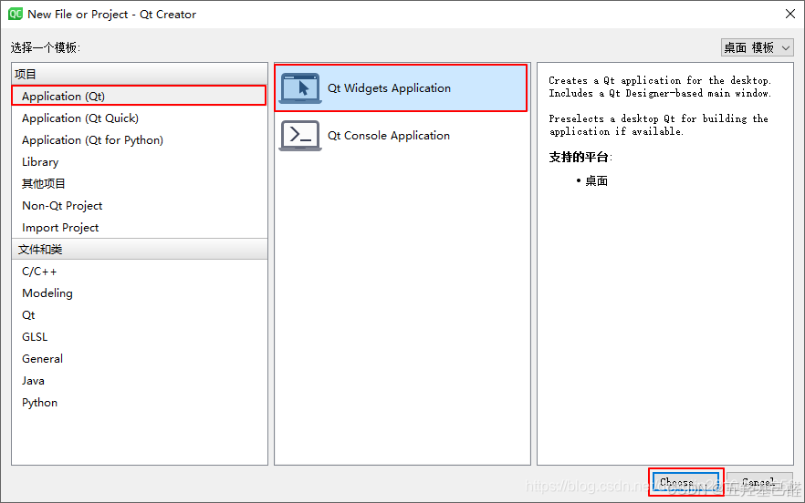

创建项目一般使用Win窗口类型

 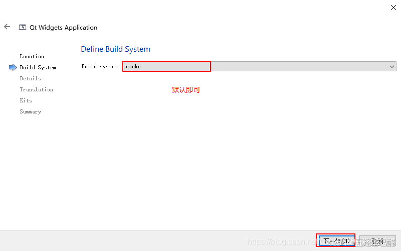

编译使用qmake。

> **qmake** 是Qt官方提供的构建工具，专门用于构建Qt项目。它使用.pro文件来描述项目的结构和依赖关系，然后生成Makefile或Visual Studio项目文件。qmake相对简单易用，特别适合构建小型Qt项目。
> 
> ---
> 
> **cmake** 是一个跨平台的构建工具，可以用于构建任何类型的C++项目，不仅限于Qt。cmake使用CMakeLists.txt文件来描述项目的结构和依赖关系，然后生成适合不同构建系统的项目文件，如Makefile、Visual Studio项目文件、Xcode项目文件等。cmake功能更加强大，支持更复杂的项目结构和定制需求。

**总的来说，qmake更适合构建小型Qt项目，简单易用；而cmake更适合构建复杂、跨平台的C++项目，功能更加强大和灵活。** 

 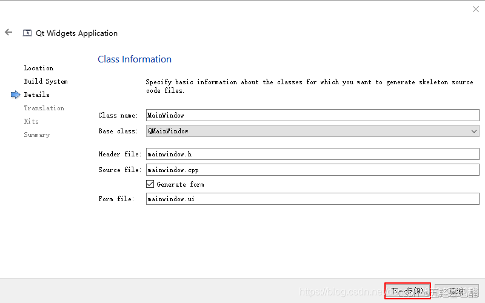

选择基类

## 二.设置应用图标

 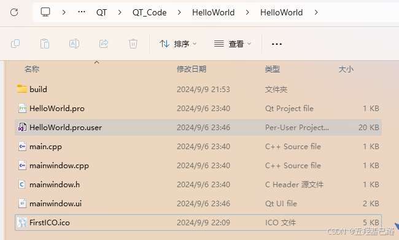

在项目文件夹下粘贴ico文件

 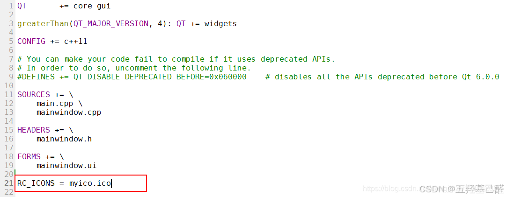

在.pro项目文件下中添加RC_ICONS = FirstICO.ico一句后重新编译运行即可生效

 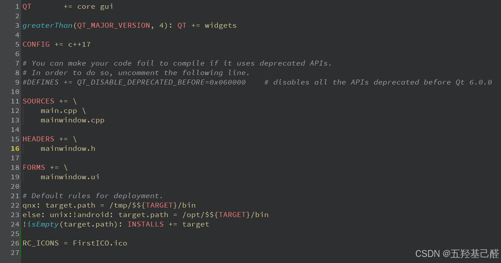

## 三.创建第一个窗口程序

在主程序设计mainwindow.ui中添加按钮后，在项目文件夹中添加新文件，新文件为QT设计师界面类Qt Widgets Designer Form Class，界面模板选择Dialogwithout Buttons，然后键入类名，至此类创建完毕。

 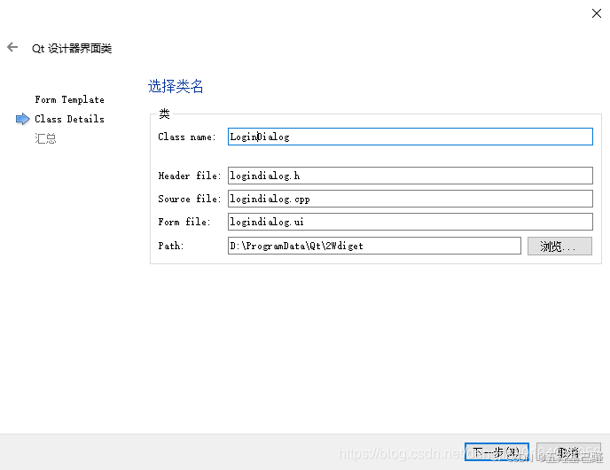

向类中的界面中拖入组件，然后按下F4，便进入了信号和槽编辑模式。按着鼠标左键，从按钮上拖向界面。

当放开鼠标后，会弹出配置连接对话框，这里我们选择pushButton的clicked()信号和LoginDialog的accept()槽并按下确定按钮。

 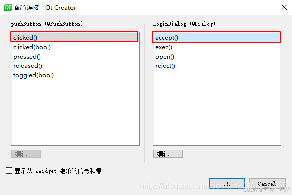

当放开鼠标后，会弹出配置连接对话框，这里我们选择pushButton的clicked()信号和LoginDialog的accept()槽并按下确定按钮。

 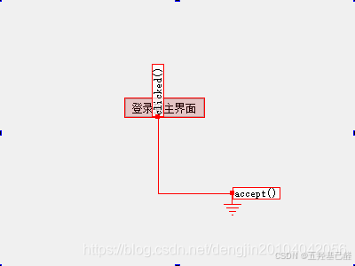

接下来在主函数中键入以下代码

```cpp
int main(int argc, char *argv[])
{
    QApplication a(argc, argv);
    MainWindow w;
    LoginDialog dlg;
 
    if (dlg.exec() == QDialog::Accepted)
    {
           w.show();
           return a.exec();
    }
    else
    {
        return 0;
    }
}
```

运行调试即可完成窗口程序。

如果在在主函数设计类中向以下函数添加代码

```cpp
void MainWindow::on_pushButton_clicked()
{
    QDialog *pDlg = new QDialog(this);
 
    pDlg->show();
}
```

则可实现两类窗口打开的方式：一个是自身消失而后打开另一个窗口，一个是打开另一个窗口而自身不消失。

## 四.登录对话框的实现

### 1.设计师实现

创建好工程和设计师类后编写基本的主函数框架

```cpp
int main(int argc, char *argv[])
{
    QApplication a(argc, argv);
    MainWindow w;
 
    LoginDialog dlg;
    //exec()是一个模态对话框的执行函数,它用于显示一个对话框并进入事件循环，等待对话框关闭后才返回。
    //对于模态对话框来说，这意味着在对话框被关闭之前，用户不能与程序中的其他窗口交互
    //这个方法会阻塞调用线程，并且只有在对话框关闭后才会返回一个值，这个值就是对话框的结果（接受或拒绝）。
    if(dlg.exec() == QDialog :: Accepted)//如果对话框返回结果为QDialog::Accepted
    {
        w.show();
        return a.exec();
    }
    else//如果结果不是 QDialog::Accepted
    {
        return 0;
    }
}
```

并拖入组件在Logindialog.ui的设计师类中

 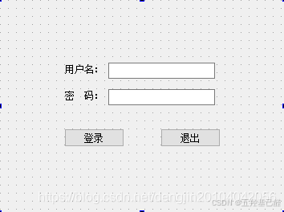

单击元素可在其属性框objectName中键入元素变量名。这里将密码后面的行编辑器为pwdLineEdit，登录按钮为loginBtn，退出按钮为exitBtn。

在设计界面的下半部分选择Signals & Slots Editor窗口，点击“+”添加关联，依次修改发送者，信号，接收者，槽分别为exitBtn，clicked()，LoginDialog，close()。这一步就将exitBtn即退出按钮和LoginDialog窗口类关联在一起。当exitBtn被点击clicked()时就会发出信号到LoginDialog的槽中，同时会执行槽函数close()。

向登录的clicked()槽函数中写入：

```cpp
void LoginDialog::on_loginBtn_clicked()
{
    //accept();//对话框关闭并将结果设置为QDialog::Accepted
    //这里trimmed()是QString类中的固有方法，使用其去除输入的前后的空白字符
    if(ui->usrLineEdit->text().trimmed() == tr("meno")&&
        ui->pwdLineEdit->text() == tr("xl20031027"))
    {
        accept();//返回结果QDialog::Accepted
    }
    else
    {
        QMessageBox :: warning(this,tr("警告"),tr("用户名和密码错误"),QMessageBox::Yes);
 
        //输入错误后对行编辑器中的内容进行清除
        ui->usrLineEdit->clear();//清除用户名编辑器
        ui->pwdLineEdit->clear();//清除密码编辑器
        ui->usrLineEdit->setFocus();//设置光标在用户名输入框
    }
}
```

同时把密码行编辑器的属性中的echoMode属性选择为Password。即将输入的密码呈现为黑点不可见状态。再把密码行编辑器的placeholderText属性更改为“请输入密码”，将用户名行编辑器的更改为“请输入用户名”。

 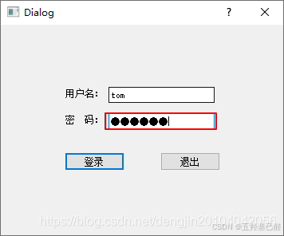

> 总结：以上几个工程里我们建立的设计师类Qt Widgets Designer Form Class， 选择不带任何按钮的Dialogwithout Buttons模板。这个类相当于子窗口，而主窗口则是我们建立工程时自带的mainwindow。我们这样进行创建工程方便对于工程的管理，便于实现不同的功能。
> 
> 业内叫做 **MVC模式：** 
> 
> - 在Model-View-Controller（MVC）模式中，界面（View）通常与业务逻辑（Model）和用户交互（Controller）分开。创建独立的界面类有助于实现这种分离。
> 
> 

### 2.C++代码实现

实现思路如下（笔者亲自绘制）：

 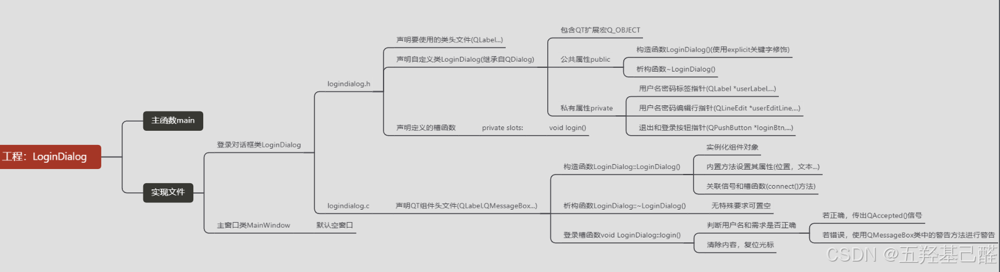

创建工程后还是手动创建一个登录对话框的设计师类。

主函数：

```cpp
int main(int argc, char *argv[])
{
    QApplication a(argc, argv);
    MainWindow w;
 
    LoginDialog dlg;
 
    if(dlg.exec() == QDialog :: Accepted)
    {
        w.show();
        return a.exec();
    }
    else
    {
        return 0;
    }
}
```

登录对话框.cpp代码：

```cpp
#include "logindialog.h"
 
#include <QLabel>
#include <QLineEdit>
#include <QPushButton>
#include <QMessageBox>
 
LoginDialog::LoginDialog(QWidget *parent):QDialog(parent)
{
    userLabel = new QLabel(this);//new动态创建一个QLabel对象分配给userLabel指针
    userLabel ->move(70,80);//设置该对象在父窗口的位置
    userLabel->setText(tr("用户名"));//设置该对象显示的文本
    //注：tr()是Qt的翻译函数，用于支持国际化
 
    userEditLine = new QLineEdit(this);
    userEditLine -> move(140,80);
    userEditLine -> setPlaceholderText(tr("请输入用户名"));
 
    pwdLabel = new QLabel(this);
    pwdLabel -> move(70,130);
    pwdLabel -> setText(tr("密码"));
 
    pwdEditLine = new QLineEdit(this);
    pwdEditLine -> move(140,130);
    pwdEditLine -> setPlaceholderText(tr("请输入密码"));
 
    loginBtn = new QPushButton(this);
    loginBtn -> move(50,200);
    loginBtn -> setText(tr("登录"));
 
    exitBtn = new QPushButton(this);
    exitBtn -> move(210,200);
    exitBtn -> setText(tr("退出"));
 
    //信号与槽关联
    //将loginBtn登录按钮的点击信号与设计师类的登录槽函数关联
    connect(loginBtn,&QPushButton::clicked,this,&LoginDialog::login);
    connect(exitBtn,&QPushButton::clicked,this,&LoginDialog::close);
}
 
//登录槽函数
void LoginDialog::login()
{
    //判断用户名和密码是否正确
    if(userEditLine->text().trimmed() == tr("meno")&&
        pwdEditLine->text() == tr("xl20031027"))
    {
        accept();
    }
    else
    {
        QMessageBox::warning(this,tr("警告"),tr("用户名或者密码错误"),QMessageBox::Yes);
    }
 
    //清除内容，复位光标
    userEditLine->clear();
    pwdEditLine->clear();
    userEditLine->setFocus();
}
 
LoginDialog::~LoginDialog()
{
 
}
```

登录对话框.h代码：

```cpp
#ifndef LOGINDIALOG_H
#define LOGINDIALOG_H
 
#include <QDialog>
 
//前置声明要使用的类
class QLabel;
class QLineEdit;
class QPushButton;
 
class LoginDialog : public QDialog//LoginDialog继承了QDialog的公有属性
{
    Q_OBJECT//QT的扩展宏，在类的私有或被保护部分出现，使得该类扩展了QT的元对象系统（包括信号和槽，元信息，内省，属性系统）
public://公有属性
    //与类同名的为构造函数，用于对象创建时进行初始化
    //explicit关键字表示其不能进行隐式类型转换
    //该构造函数接收一个QWidget类型指针，指定了新建对话框的父窗口
    //QWidget *parent = 0表示 parent 参数是可选的，如果调用者没有提供，则默认为 nullptr。
    explicit LoginDialog(QWidget *parent = 0);
    //在类同名函数前加上~为析构函数，用于在 LoginDialog 对象被销毁时释放其占用的资源。
    ~LoginDialog();
 
//槽函数
private slots:
    void login();
 
private://私有属性
    //用户名和密码标签
    QLabel *userLabel;
    QLabel *pwdLabel;
 
    //用户名和密码编辑行
    QLineEdit *userEditLine;
    QLineEdit *pwdEditLine;
 
    //退出和登录按钮
    QPushButton *loginBtn;
    QPushButton *exitBtn;
};
 
#endif // LOGINDIALOG_H
```

> **对"private slots"这句作解释：** 
> 
> - **槽（Slots）** ：槽是普通的 C++ 成员函数，可以被信号调用。当你定义一个槽时，你实际上是在告诉 Qt，这个函数可以响应一个信号。槽可以有参数，也可以没有参数，并且可以像普通函数一样返回值。
> 
> **对“userLabel = new QLabel(this);”这句作解释：** 
> 
> - userLabel是.h文件中定义的"QLabel *userLabel;",new进行动态开辟内存空间的关键字修饰， **<u>使用组件QLabel的同名构造函数进行创建对象，并向其中传入this指针参数，意味着此句创建的对象的父对象为整个登录对话框对象LoginDialog</u>** 。下面创建的对象也如此，它们的显示、位置和生命周期都由 `LoginDialog` 对象控制。当 `LoginDialog` 对象被销毁时，所有这些子组件也将被自动销毁。
> 
> **对connect()函数作简单解释：** 
> 
> - 主要用于信号和槽的连接
> 
> - 定义为connect(lineEdit, &QLineEdit::textChanged, this, &Widget::do_textChanged);
> 
> 

## 五.菜单栏图标的创建

###  **1.QT设计师设计** 

正常创建完工程后进入mainwindow.ui文件中进行界面设计。

 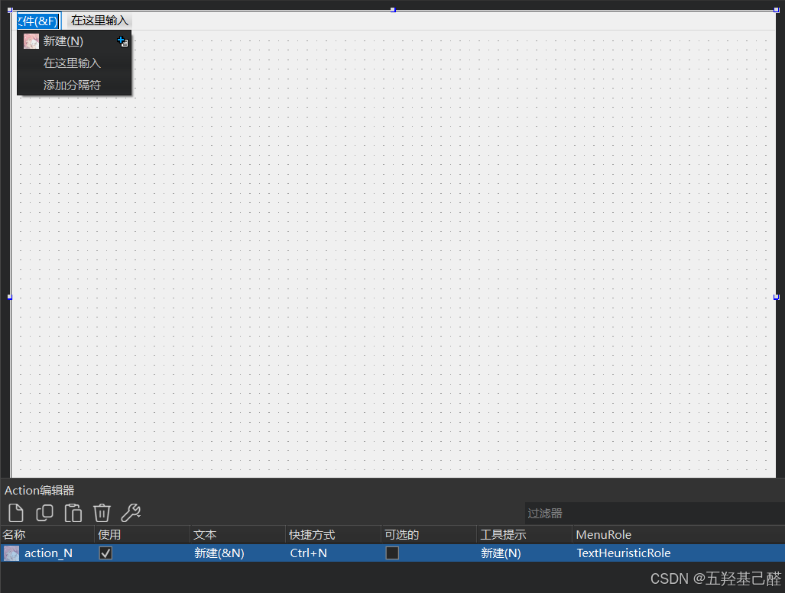

我们双击坐上角可以键入菜单栏显示内容，在旁边加括号，括号里键入‘&’+任意字母可表示快捷键，例如：”文件(&F)“表示文件菜单选项的快捷键为Alt+F。（如过键入中文无效则可在旁边属性栏修改）。

 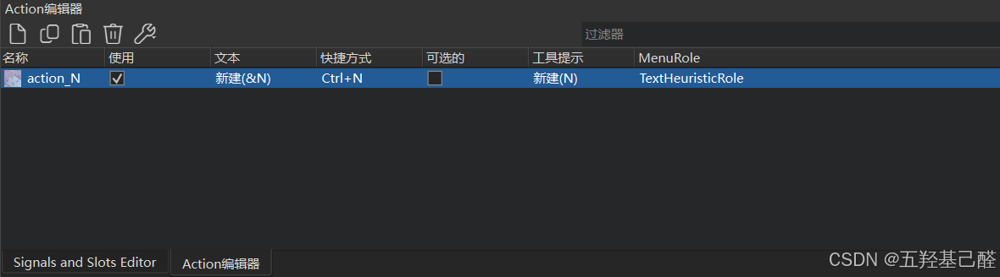

下部Action编辑器中可以看到对应Action（即菜单栏）的设置界面，包括快捷键以及图标。

**图标的导入：** 首先我们需要在文件资源管理器中的项目目录下新建一个文件夹单独存放我们想要设置为图标的图片。方便管理与找路径。

接着就在QT的工程中添加资源文件 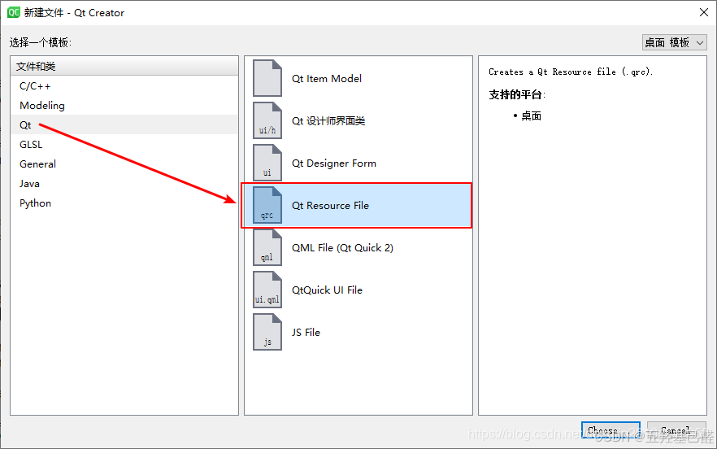

添加好资源文件后就会跳转到相应的资源管理界面，这里可以对前缀和内部文件进行管理。

 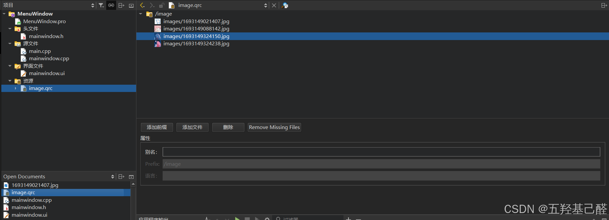

完成以上资源文件的创建后，便可以向相应的Action设置图标

 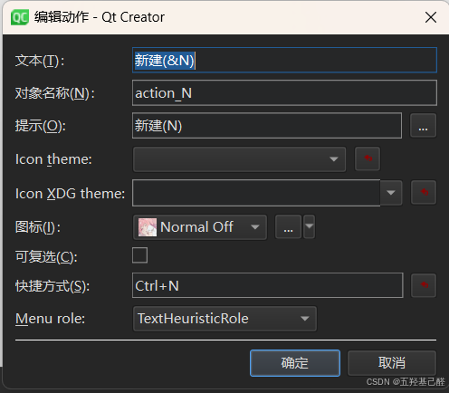

到这设置图标的操作就完成了。

###  **2.纯代码实现** 

我们还可以向mainwindow.cpp的文件中写入我们想要的菜单。

```cpp
MainWindow::MainWindow(QWidget *parent)
    : QMainWindow(parent)//初始化列表，用于调用基类QMainWindow的构造函数，并将parent参数传递给它。这表明MainWindow类是从QMainWindow类派生出来的
    , ui(new Ui::MainWindow)//构造函数初始化列表中继续，用于创建一个名为ui的成员变量，它是一个指向Ui::MainWindow类的实例的指针。Ui::MainWindow通常是由Qt Designer工具生成的用户界面类的名称，这个类包含了所有的UI元素和它们在界面上布局的设置。
{
    ui->setupUi(this);
 
    //添加动作（就是创建相应Action对象）
    QAction *openAction = new QAction(tr("&Open"),this);
    //添加图标（创建图标对象，并调用上一步创建Action对象的方法）
    QIcon icon(":/image/images/1693149021407.jpg");
    openAction->setIcon(icon);
    //设置快捷键（调用Action对象方法）
    openAction->setShortcut(QKeySequence(tr("Ctrl+O")));
    //在文件菜单中设置新的打开动作
    ui -> menu -> addAction(openAction);
 
    //创建新的编辑菜单
    QMenu *menu_E = ui->menubar->addMenu(tr("编辑(&E)"));
    QAction *findAction = new QAction(tr("&Find"),this);
    QIcon icon2(":/image/images/1693149324150.jpg");
 
    findAction -> setIcon(icon2);
    findAction -> setShortcut(QKeySequence("Ctrl+F"));
 
    menu_E -> addAction(findAction);
}
```

## 六. 布局管理

### 1.设计师实现

> **Qt中的布局管理器主要包括QBoxLayout基本布局管理器、QGridLayout栅格布局管理器和QFormLayout窗体布局管理器，而基本布局管理器又分为QHBoxLayout水平布局管理器和QVBoxLayout垂直布局管理器。** 

垂直布局管理器(VerticalLayout)和拆分器/分裂器(QSplitter)可以对元素进行自动排列。

 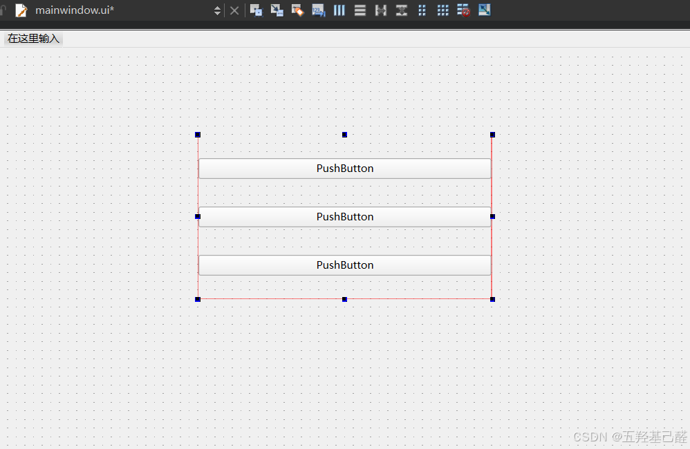

右键界面，选择布局->栅格布局(Ctrl+G)，这是窗口的整个元素部件就会填充整个窗口，运行程序时元素部件也会随着窗口大小的调整动态变化。

###  **2.纯代码实现** 

```cpp
#include <QPushButton>
#include <QLineEdit>
#include <QGridLayout>
 
MainWindow::MainWindow(QWidget *parent)
    : QMainWindow(parent)
    , ui(new Ui::MainWindow)
{
    ui->setupUi(this);
 
    //创建按钮对象，this指当前窗口为其部件的父对象
    QPushButton *btn = new QPushButton(this);
    //创建文本编辑器对象
    QLineEdit *edit = new QLineEdit(this);
    //创建栅格布局对象，这里不传入this指针的原因是QGridLayout实例化时不需要指定关系
    QGridLayout *layout = new QGridLayout;
 
    layout -> addWidget(btn,0,0,1,1);
    layout -> addWidget(edit,0,1,1,2);
    layout -> addWidget(ui->textEdit,1,0,1,3);//这里的textEdit是在设计师界面里手动拖入的元素部件
    
    //调用窗口成员中心部件（中心部件是主窗口中用于放置其他控件和布局的区域）
    //调用其设置方法设置为设置为对应的栅格布局对象
    ui -> centralwidget -> setLayout(layout);
 
}
```

---

未完待续... ...