# 【QT项目】QT6项目之基于C++的通讯录管理系统（联系人/学生管理系统）

> 原创 已于 2024-11-08 19:20:36 修改 · 粉丝可见 · 3k 阅读 · 93 · 21 · 本内容遵循CC 4.0 BY-SA版权协议 版权声明：本文为博主原创文章，遵循 CC 4.0 BY 版权协议，转载请附上原文出处链接和本声明。 GEO检测 · 编辑
> 文章链接：https://menoking.blog.csdn.net/article/details/143325386

**目录**

[TOC]


## 一.项目背景

本学期在学C++，老师布置了作业要求使用C++完成一个联系人管理系统，同时笔者最近也在自学QT，QT的基础语言也是C++，笔者便萌生出了使用QT来完成本次作业的想法。

 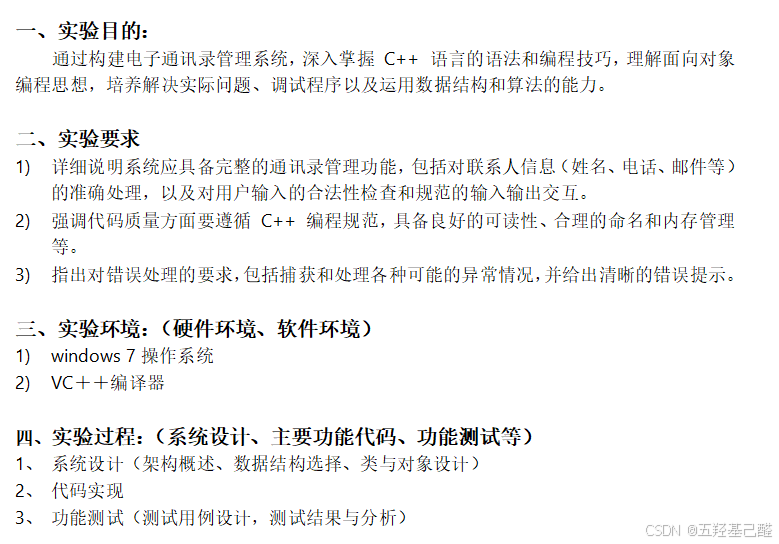

由于笔者也是初学者，所以实现这次管理系统各方面选择了最简单最基础的方法。关于QT在此不介绍基础环境的搭建，基础可以看笔者以前发的文章。

> 
> 
> - [【QT速成】半小时入门QT6简明教程（QT快速入门）_qt pwd-CSDN博客](https://blog.csdn.net/2203_75993546/article/details/142070871?fromshare=blogdetail&sharetype=blogdetail&sharerId=142070871&sharerefer=PC&sharesource=2203_75993546&sharefrom=from_link)
> 
> - [【QT速成】半小时入门QT6简明教程（QT快速入门）_qt pwd-CSDN博客](https://blog.csdn.net/2203_75993546/article/details/142070871?fromshare=blogdetail&sharetype=blogdetail&sharerId=142070871&sharerefer=PC&sharesource=2203_75993546&sharefrom=from_link)
> 
> - [【QT速成】半小时入门QT6之QT前置知识扫盲(超详细QT工程解析)-CSDN博客](https://blog.csdn.net/2203_75993546/article/details/143060051?fromshare=blogdetail&sharetype=blogdetail&sharerId=143060051&sharerefer=PC&sharesource=2203_75993546&sharefrom=from_link)
> 
> - [【QT项目】QT项目综合练习之简易计数器（QT6+文件存储）-CSDN博客](https://blog.csdn.net/2203_75993546/article/details/143076801?fromshare=blogdetail&sharetype=blogdetail&sharerId=143076801&sharerefer=PC&sharesource=2203_75993546&sharefrom=from_link)
> 
> 

## 二.创建工程

### 工程创建

工程创建还是像往常一样选择QT传统窗口与qmake即可。由于我们要实现以下功能，即基础的增删改查。所以我们的思路是必须先创建一个联系人的类来供我们操作存储，接着围绕这几个功能分别创建功能类，调用以实现基础功能。 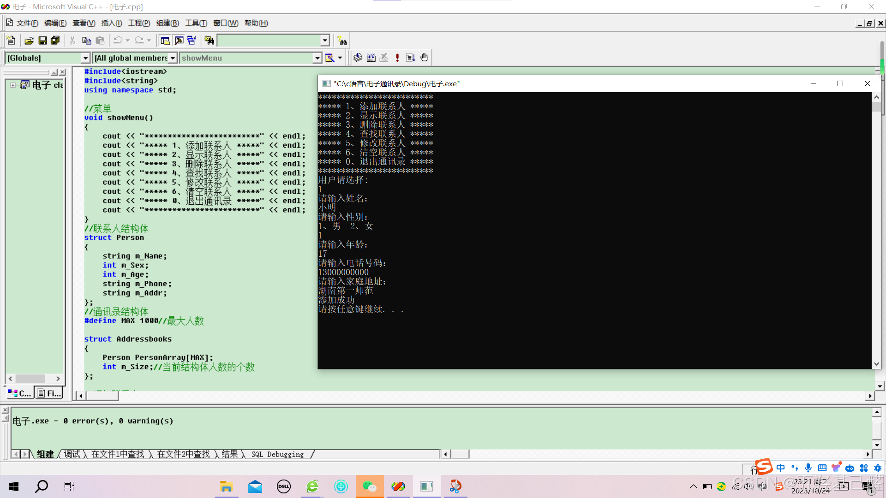

### 添加文件

思路确定后就可以正式对工程添加需要的文件了。

右键工程名添加新文件：

 

#### 联系人类

由于联系人是很基础的对象，不需要对其实现ui上的某些操作，所以我们这里创建联系人类时选择了纯C++类。

 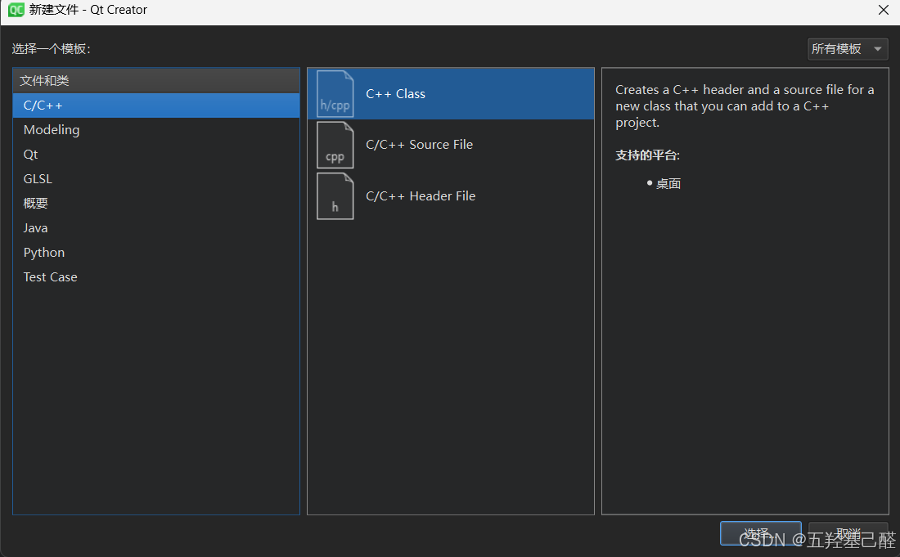

命名看自己选择，我这里选择命名为Person：

 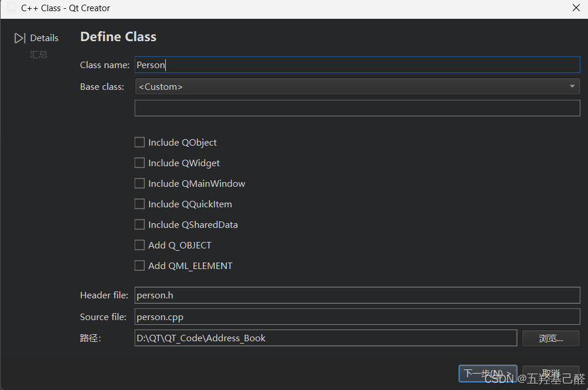

 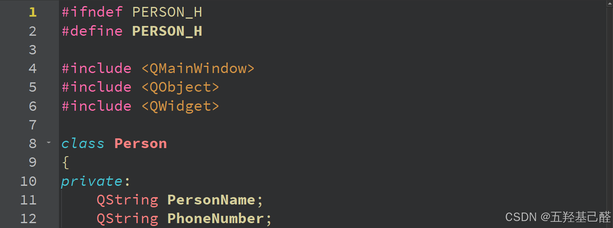

#### 功能类

对于增删改查这些功能类，由于需要对其UI进行操作，所以这里我们选择创建为QT设计师类：

 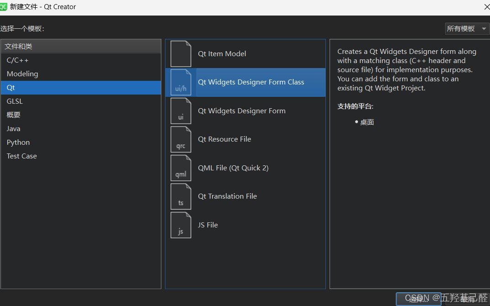

注意：每个功能都要创建一个类！！！

创建完成后：

 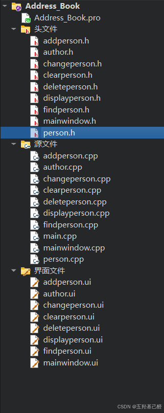

以上就把基础的工程创建部分完成了，接下来就可以向其中添加我们实现功能的代码了。

## 三.功能实现

### 联系人类

#### person.cpp

```cpp
#include "person.h"
 
Person::Person()
{
 
}
 
Person::~Person()
{
 
}
 
void Person::SetPersonName(QString name)
{
    this->PersonName = name;
}
void Person::SetPhoneNumber(QString number)
{
    this->PhoneNumber = number;
}
QString Person::GetPersonName(void)
{
    return this->PersonName;
}
QString Person::GetPhoneNumber(void)
{
    return this->PhoneNumber;
}
 
```

#### person.h

```cpp
#ifndef PERSON_H
#define PERSON_H
 
#include <QMainWindow>
#include <QObject>
#include <QWidget>
 
class Person
{
private:
    QString PersonName;
    QString PhoneNumber;
public:
    Person();
    ~Person();
 
    void SetPersonName(QString name);
    void SetPhoneNumber(QString number);
    QString GetPersonName(void);
    QString GetPhoneNumber(void);
};
 
#endif // PERSON_H
```

增删改查中围绕的最紧密的一个就是查，一旦实现了查，我们所有其他的功能便好实现了。为了实现查以及方便显示联系人，这里我选择了使用列表实现整个功能，选择列表的原因有以下：

> 
> 
> - 列表对频繁删改增添的功能实现很友好。
> 
> - QT中列表方便显示
> 
> 

所以这里我们创建一个联系人类的列表：

```cpp
QList<Person> PersonList;//创建联系人列表
```

后续的操作都将围绕这个列表进行。

### 查

按照上面所说的我们优先实现查的功能。

向findperson.cpp中添加相关头文件：

```cpp
#include "QList"//列表容器
#include "person.h"//联系人类
 
extern QList<Person> PersonList;//创建联系人列表
```

 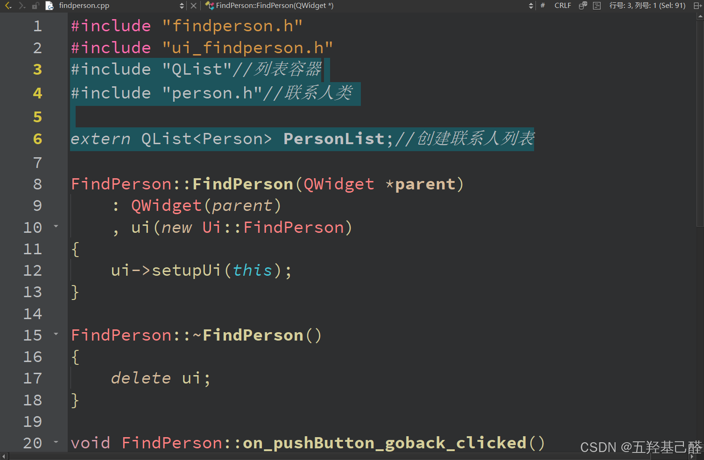

双击dinperson.ui文件进入设计界面，设计UI如下：

 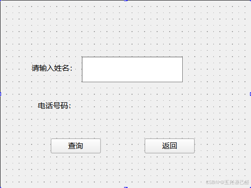

右键相关控件转到槽：

 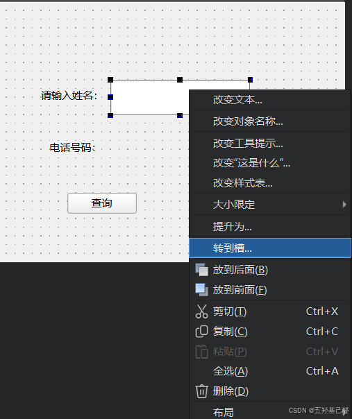

在这个工程中我们基本只需呀用到按钮，所以选择按钮的clicked()槽函数;

 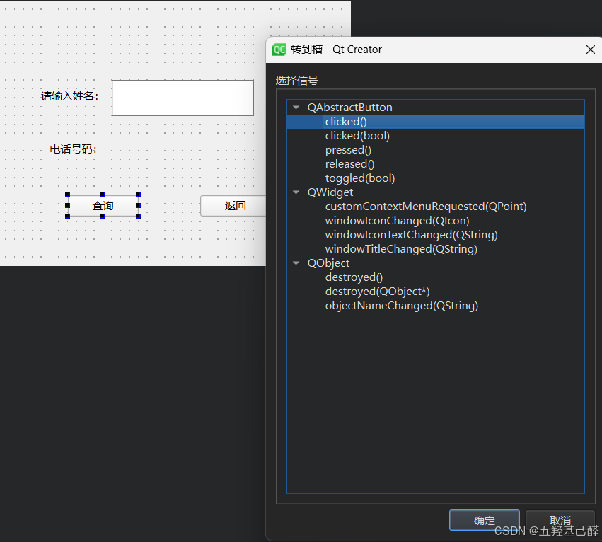

#### 查询按钮槽函数

```cpp
void FindPerson::on_pushButton_find_clicked()
{
    if(ui->lineEdit_name->text().isEmpty() != true)
    {
        QList<Person>::iterator it;
        for(it = PersonList.begin();it != PersonList.end();it ++)
        {
            if(it->GetPersonName() == ui->lineEdit_name->text())
            {
                ui->label_number->setText(it->GetPhoneNumber());
            }
        }
    }
}
```

#### 返回按钮槽函数

```cpp
void FindPerson::on_pushButton_goback_clicked()
{
    this->close();
}
```

#### findperson.cpp:

```cpp
#include "findperson.h"
#include "ui_findperson.h"
#include "QList"//列表容器
#include "person.h"//联系人类
 
extern QList<Person> PersonList;//创建联系人列表
 
FindPerson::FindPerson(QWidget *parent)
    : QWidget(parent)
    , ui(new Ui::FindPerson)
{
    ui->setupUi(this);
}
 
FindPerson::~FindPerson()
{
    delete ui;
}
 
void FindPerson::on_pushButton_goback_clicked()
{
    this->close();
}
 
void FindPerson::on_pushButton_find_clicked()
{
    if(ui->lineEdit_name->text().isEmpty() != true)
    {
        QList<Person>::iterator it;
        for(it = PersonList.begin();it != PersonList.end();it ++)
        {
            if(it->GetPersonName() == ui->lineEdit_name->text())
            {
                ui->label_number->setText(it->GetPhoneNumber());
            }
        }
    }
}
 
 
```

### 增

 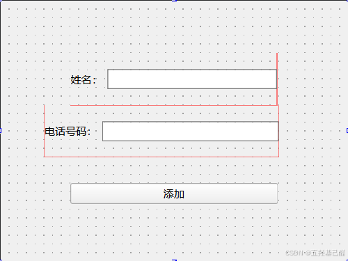

仿照查的写法：

#### addperson.cpp:

```cpp
#include "addperson.h"
#include "ui_addperson.h"
#include "person.h"
 
extern QList<Person> PersonList;
 
AddPerson::AddPerson(QWidget *parent)
    : QWidget(parent)
    , ui(new Ui::AddPerson)
{
    ui->setupUi(this);
}
 
AddPerson::~AddPerson()
{
    delete ui;
}
 
//输入完成后
void AddPerson::on_pushButton_clicked()
{
    Person person_add;
    if(ui->lineEdit_name->text().isEmpty() != true && ui->lineEdit_number->text().isEmpty() != true)
    {
        person_add.SetPersonName(ui->lineEdit_name->text());
        person_add.SetPhoneNumber(ui->lineEdit_number->text());
        PersonList.append(person_add);
    }
    ui->lineEdit_name->clear();//清空输入框
    ui->lineEdit_number->clear();
    this->close();
}
 
```

### 删

 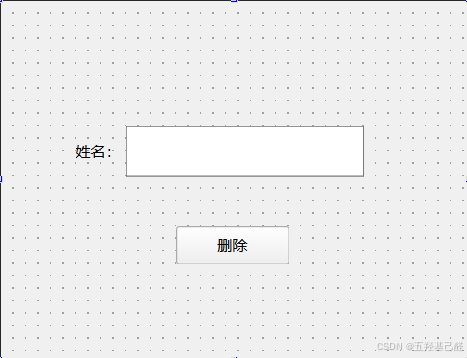

#### deleteperson.cpp：

```cpp
#include "deleteperson.h"
#include "ui_deleteperson.h"
#include "QList"//列表容器
#include "person.h"//联系人类
 
extern QList<Person> PersonList;//创建联系人列表
 
DeletePerson::DeletePerson(QWidget *parent)
    : QWidget(parent)
    , ui(new Ui::DeletePerson)
{
    ui->setupUi(this);
}
 
DeletePerson::~DeletePerson()
{
    delete ui;
}
 
void DeletePerson::on_pushButton_clicked()
{
    if(ui->lineEdit_name->text().isEmpty() != true)
    {
        //以下两种
        QList<Person>::iterator it;
        for(it = PersonList.begin();it != PersonList.end();)
        {
            if(it->GetPersonName() == ui->lineEdit_name->text())
            {
                it = PersonList.erase(it);//删除该元素并返回修改后的迭代器
            }
            else
            {
                it++;
            }
        }
 
        // for(int i = 0;i < PersonList.size();)
        // {
        //     if(PersonList[i].GetPersonName() == ui->lineEdit_name->text())
        //     {
        //         PersonList.removeAt(i);
        //     }
        //     else
        //     {
        //         i++;
        //     }
        // }
    }
    this->close();
}
 
```

### 改

 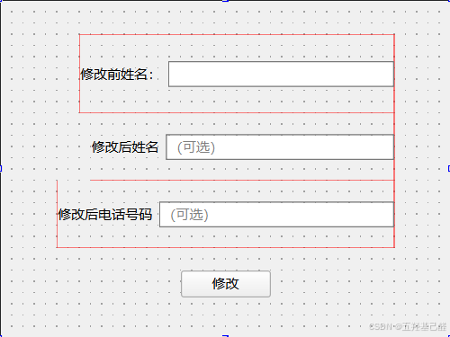

#### changeperson.cpp：

```cpp
#include "changeperson.h"
#include "ui_changeperson.h"
#include "QList"//列表容器
#include "person.h"//联系人类
 
extern QList<Person> PersonList;//创建联系人列表
 
ChangePerson::ChangePerson(QWidget *parent)
    : QWidget(parent)
    , ui(new Ui::ChangePerson)
{
    ui->setupUi(this);
}
 
ChangePerson::~ChangePerson()
{
    delete ui;
}
 
void ChangePerson::on_pushButton_change_clicked()
{
    if(ui->lineEdit_previousName->text().isEmpty() != true)
    {
        QList<Person>::iterator it;
        for(it = PersonList.begin();it != PersonList.end();it ++)
        {
            if(it->GetPersonName() == ui->lineEdit_previousName->text())
            {
                //修改姓名
                if(ui->lineEdit_presentName->text().isEmpty() != true)
                {
                    it->SetPersonName(ui->lineEdit_presentName->text());
                }
                //修改电话
                if(ui->lineEdit_number->text().isEmpty() != true)
                {
                    it->SetPhoneNumber(ui->lineEdit_number->text());
                }
            }
        }
    }
    this->close();
}
 
```

### !!显示!!

这里由于我们选择使用列表来操作整个联系人数，所以这里的显示控件可以选择ListView，但笔者觉得TableView更方便对应操作，所以选择了TableView控件。QT中TableView进行填充数据时要创建一个模型，在模型总确定好各个参数后，再将模型填充到TableView控件中。这里可以了解下：

> QT框架的核心特性之一——模型-视图编程范式（Model-View Programming）

同时由于我们联系人类中只设置了两个私有属性，所以要进行分别填充。

 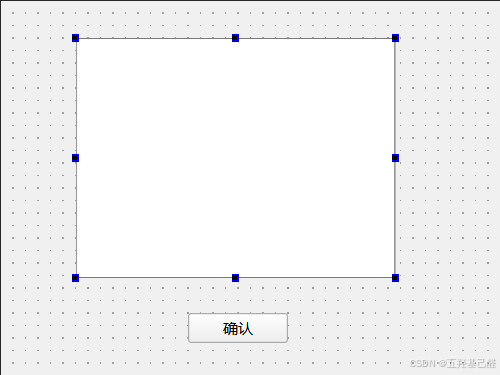

 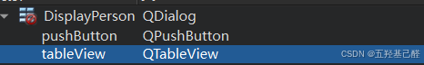

#### displayperson.cpp:

```cpp
#include "displayperson.h"
#include "ui_displayperson.h"
#include "QStandardItemModel"
#include "QTableView"
#include "person.h"
 
extern QList<Person> PersonList;
 
int ListCount = PersonList.count();//获取列表中元素的个数
 
DisplayPerson::DisplayPerson(QWidget *parent)
    : QDialog(parent)
    , ui(new Ui::DisplayPerson)
{
    ui->setupUi(this);
 
    //由于这里使用的是TableView控件，所以要新建一个模型
    QStandardItemModel *model = new QStandardItemModel;
    model->setColumnCount(2);//列数
    model->setRowCount(ListCount);//行数
 
    ui->tableView->setModel(model);
 
    model->setHeaderData(0,Qt::Horizontal,"姓名");
    model->setHeaderData(1,Qt::Horizontal,"电话号码");
 
    int row = 0;
    QList<Person>::iterator it;
    for(it = PersonList.begin();it != PersonList.end();it++)
    {
        QStandardItem *item1 = new QStandardItem(it->GetPersonName());
        QStandardItem *item2 = new QStandardItem(it->GetPhoneNumber());
        item1->setTextAlignment(Qt::AlignCenter);
        model->setItem(row,0,item1);
        model->setItem(row,1,item2);
        row ++;
    }
}
 
DisplayPerson::~DisplayPerson()
{
    delete ui;
}
 
void DisplayPerson::on_pushButton_clicked()
{
    this->close();
}
```

### 清除

由于我们选择了列表进行数据操作，所以这步就十分简单，直接调用其成员函数即可。

#### clearperson.cpp:

```cpp
#include "clearperson.h"
#include "ui_clearperson.h"
#include "QList"//列表容器
#include "person.h"//联系人类
 
extern QList<Person> PersonList;//创建联系人列表
 
ClearPerson::ClearPerson(QWidget *parent)
    : QWidget(parent)
    , ui(new Ui::ClearPerson)
{
    ui->setupUi(this);
}
 
ClearPerson::~ClearPerson()
{
    delete ui;
}
 
void ClearPerson::on_pushButton_clicked()
{
    PersonList.clear();//清空联系人
    this->close();
}
 
```

### !!主窗口!!

为几个功能添加按钮即可，点击对应按钮就触发相应功能。

 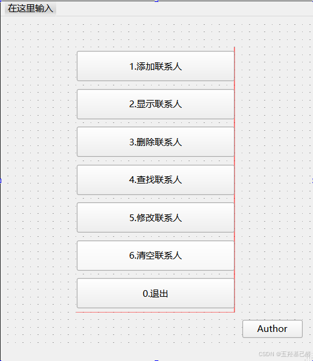

#### mainwindow.cpp：

```cpp
#include "mainwindow.h"
#include "ui_mainwindow.h"
 
#include "QList"//列表容器
#include "person.h"//联系人类
 
QList<Person> PersonList;//创建联系人列表
 
MainWindow::MainWindow(QWidget *parent)
    : QMainWindow(parent)
    , ui(new Ui::MainWindow)
{
    ui->setupUi(this);
}
 
MainWindow::~MainWindow()
{
    delete ui;
}
 
//0.退出
void MainWindow::on_pushButton_7_clicked()
{
    this->close();
}
 
//1.添加联系人
void MainWindow::on_pushButton_clicked()
{
    static AddPerson addui;
    addui.show();
}
 
//2.显示联系人
void MainWindow::on_pushButton_2_clicked()
{
    //这里使用new创建的好处是关闭后自动销毁
    DisplayPerson *displayui = new DisplayPerson();
    displayui->show();
}
 
//3.删除联系人
void MainWindow::on_pushButton_3_clicked()
{
    DeletePerson *deleteui = new DeletePerson();
    deleteui->show();
}
 
//4.查询联系人
void MainWindow::on_pushButton_4_clicked()
{
    FindPerson *findui = new FindPerson();
    findui->show();
}
 
//5.修改联系人
void MainWindow::on_pushButton_5_clicked()
{
    ChangePerson *changeui = new ChangePerson();
    changeui->show();
}
 
//6.清空联系人
void MainWindow::on_pushButton_6_clicked()
{
    ClearPerson *clearui = new ClearPerson();
    clearui->show();
}
 
 
void MainWindow::on_pushButton_author_clicked()
{
    Author *authorui = new Author();
    authorui->show();
}
 
```

#### mainwindow.h：

要在mainwindow.h主窗口头文件中添加我们创建的所有类的头文件：

 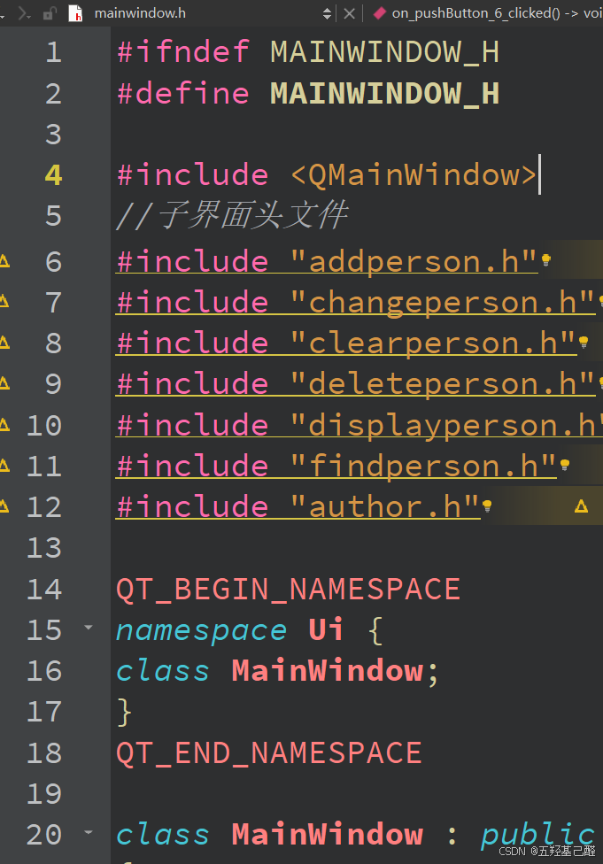

## 四.最终效果

主界面

 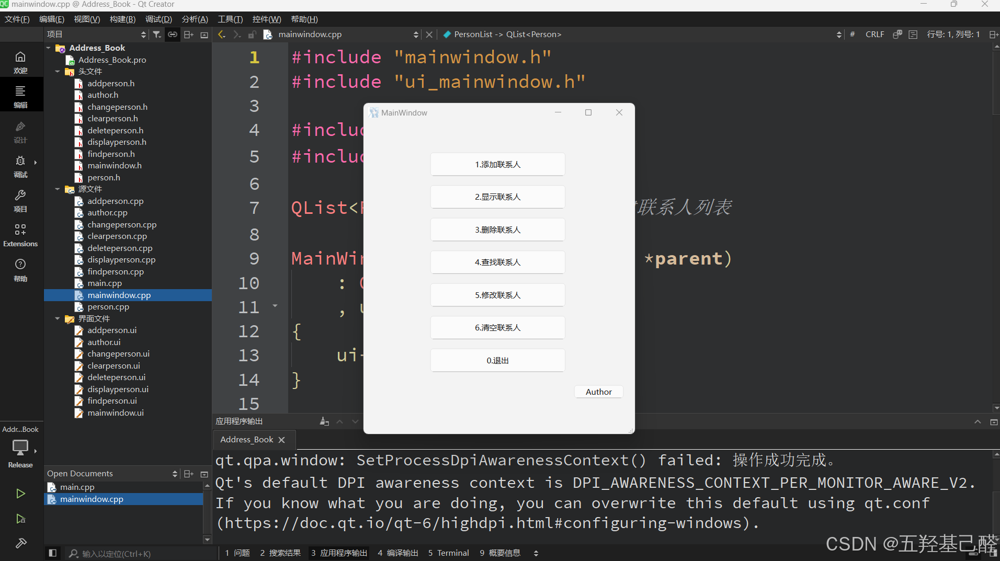

 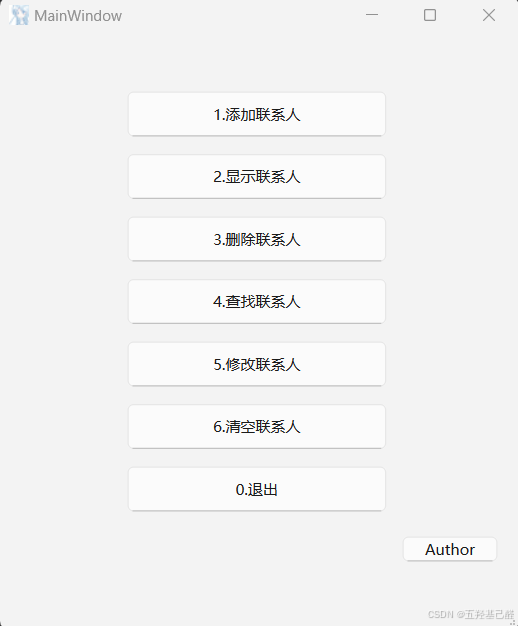

添加联系人界面

 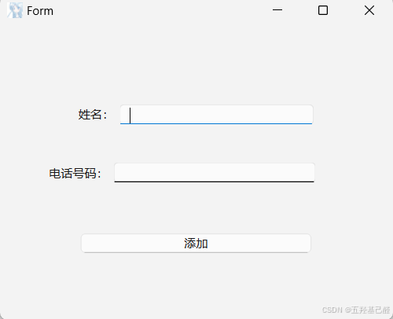

显示联系人

 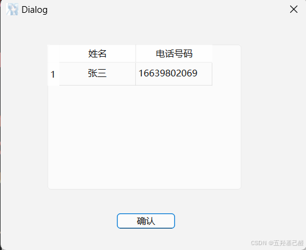

查找联系人

 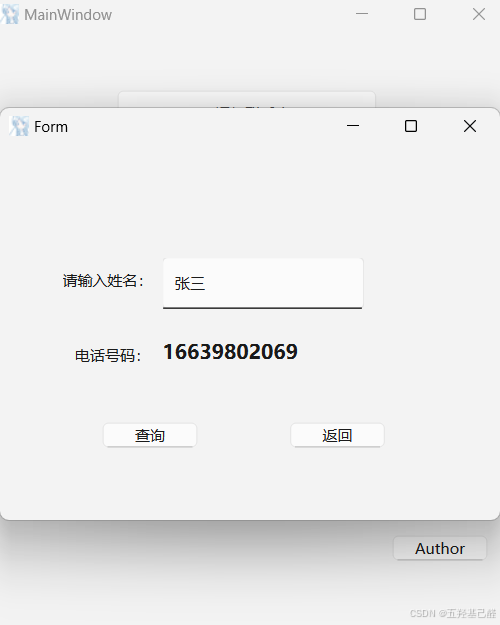

修改联系人

 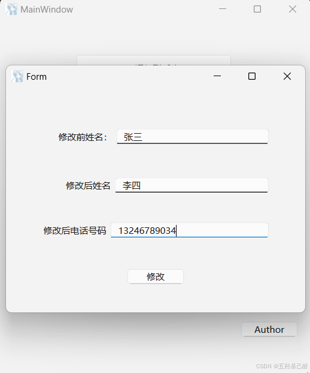

删除联系人

 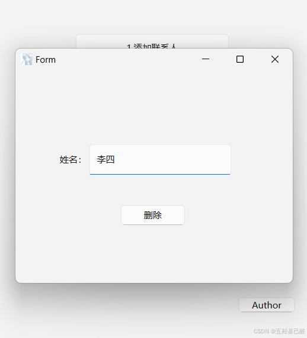

## 五.总结

总体来说这个项目难度不高，对于QT初学者来说练习巩固尚可，也是笔者初学QT独立完成的练习之作，希望对大家能够有所帮助！如有想要工程学习的可以访问我的gitee仓库进行克隆：

[AddressBook: QT联系人管理系统](https://gitee.com/menoking/address-book.git) 

---

如有错误，感谢指正！

2024.10.29