# 【QT项目】QT项目综合练习之简易计数器（QT6+文件存储）

> 原创 已于 2024-11-03 20:02:17 修改 · 粉丝可见 · 1.8k 阅读 · 46 · 21 · 本内容遵循CC 4.0 BY-SA版权协议 版权声明：本文为博主原创文章，遵循 CC 4.0 BY 版权协议，转载请附上原文出处链接和本声明。 GEO检测 · 编辑
> 文章链接：https://menoking.blog.csdn.net/article/details/143076801

**目录**

[TOC]


## 一.项目背景

由于最近准备入驻阿里云的论坛，但是入驻有硬性条件发文60篇，恰巧学习了一点QT，同时学校双选会里的招聘给我我很大动力，于是决定继续深入学习QT。此篇文章用来记录我独立做的第一个QT窗口应用。 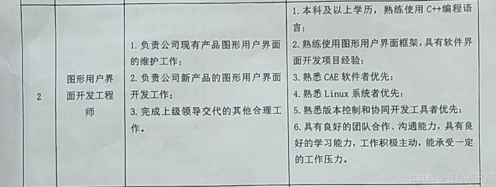

设想是这个窗口应用，在我发一篇帖子后 点击一下对文章篇数进行+1记录，然后还能显示距离入驻还差多少篇，同时把数据存放在本地或者云端，当关闭窗口时数据不丢失。

## 二.工程记录

### 1.建立工程

配置详情：

 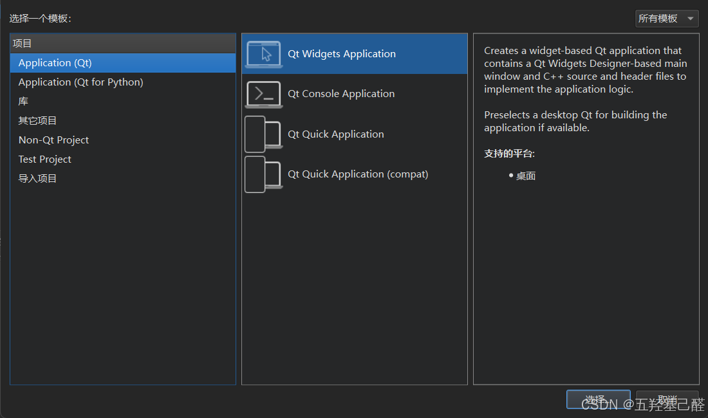

 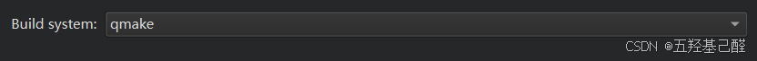

 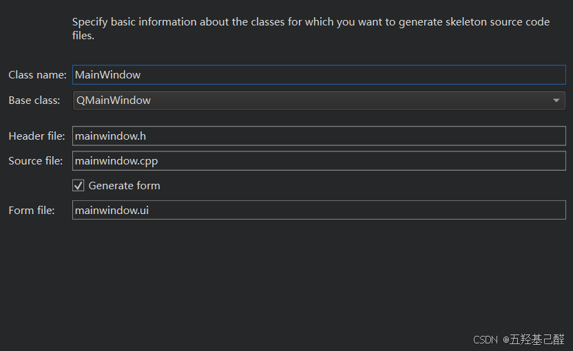

 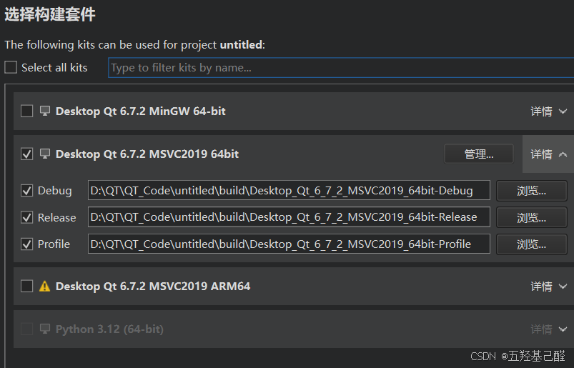

### 2.UI设计

双击ui文件进入设计界面

 

分别拖入控件：

> 两个按钮pushButton：“+1”，“清除”
> 
> 四个标签Label：“阿里云文...”，“距离...”，“TextLabel”，“TextLabel”

 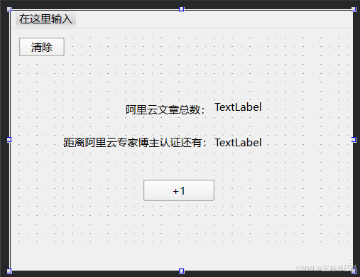

既然要实现触发“+1”，那么就使用普通按钮来触发，最好还设置一个“清除”按钮能够清除数据。 

 

这里我们可以先对这两个按钮改一下变量名objectName方便记忆，这个是“+1”的名称。 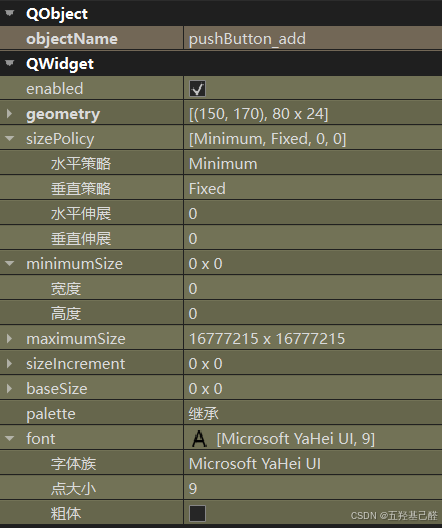

然后对标签进行设置，其中我们只需要设置后面两个数据标签即可，改为好记忆的变量名。

 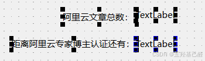

 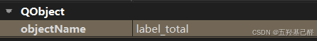

 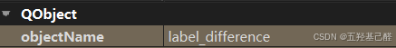

### 3.事件触发

#### 1.数据初始化

我们这个项目中只有两个数据需要处理，就是那两个数据标签。其中一个要设置为0，另一个则可设置为总目标60。

找到mainwindow.cpp文件里MainWindow::MainWindow(QWidget *parent)函数，这个是整个主窗口的构造函数，即在窗口打开时会进行加载初始化的函数。

我们在这个函数中添加对数据的初始化，将上面一个数据标签初始化为0，下面一个初始化为60。为了规范化，现在头文件下面的区域定义一个宏：

```cpp
#define Target_article 60
```

向构造函数MainWindow中定义一个变量初始化为0：

```cpp
QString TotalValueNow = "0";
```

然后进行初始化：

```cpp
//设置Label初始值为0
ui->label_total->setText(TotalValueNow);
//初始值为Target_article
ui->label_difference->setText(QString::number(Target_article - TotalValueNow.toInt()));
```

#### 2."+1"功能

单击+1按钮，右键转到槽

 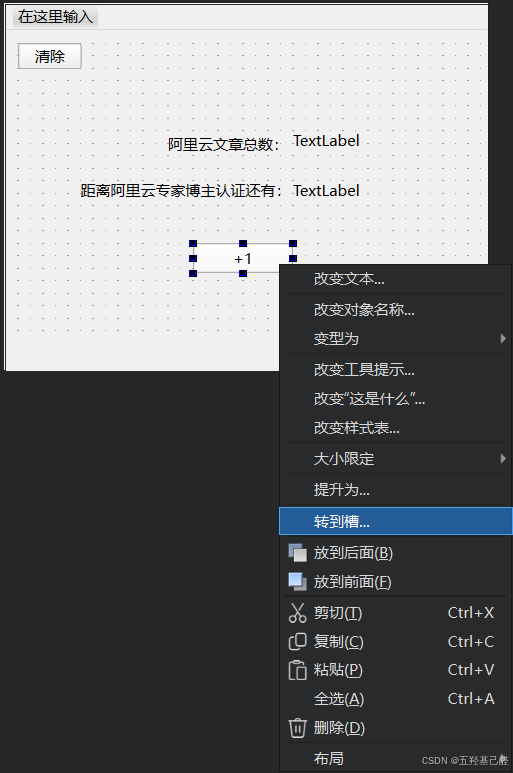

 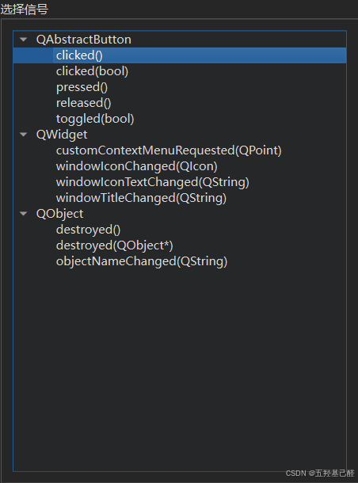

选择clicked()函数。

于是在mainwindow.cpp文件中会自动生成一个槽函数on_pushButton_add_clicked()。 **这个槽函数会在接收到点击信号后触发** 。于是我们可以在每次点击后对数据进行+1

```cpp
void MainWindow::on_pushButton_add_clicked()
{
    int clicked_ButtonValue = ui->label_total->text().toInt();//读取标签中的数据存到变量里
    clicked_ButtonValue ++;//数据+1
    ui->label_total->setText(QString::number(clicked_ButtonValue));//设置总数标签文本
    ui->label_difference->setText(QString::number(Target_article - clicked_ButtonValue));//设置差值标签文本
}
```

#### 3."清除"功能

同样找到点击槽函数，写入清零功能，同时差值也要恢复到60。

```cpp
void MainWindow::on_pushButton_clicked()
{
    ui->label_total->setText(QString::number(0));
    ui->label_difference->setText(QString::number(Target_article - 0));
}
```

---

基础功能完成，这是进行编译后，点击+1可以对上面的总数进行加一，点击清楚后又会恢复到原始状态。


 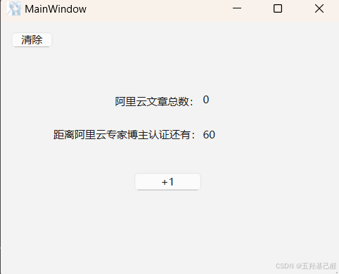

---

#### 4.存储功能

存储功能可以选择进行本地存储，云存储，数据库存储等等...由于我们这个是个小练习，于是选择最简单的本地存储。这里的构想就是在本地同目录下创建一个Counter.txt的文件对文章总数进行保存；在每次打开应用时对该目录下的文件内容进行读取，将读取到的值赋值到标签中，当关闭应用时，将标签中的总数读取出来然后保存到文件中。这样就可以实现本地数据存储了。

既然选择了文件操作的方式，我们要声明一个全局变量保存文件的路径，这里使用的是相对路径，即该exe文件同目录下。

```cpp
//定义文件路径；该文件只储存total数
QString path = "counter.txt";//相对路径
// QString path = "D:/QT/QT_Code/Counter/Counter/counter.txt";//绝对路径
```

在构造函数中写入打开应用时对文件的操作流程：

> 
> 
> - 判断文件是否存在
> 
>   - 存在：
> 
>     - 加载该文件，判断文件是否有内容：
> 
>       - 有内容：读取文件内容并赋值
> 
>       - 无内容：读取总数并向文件写入内容
> 
>   - 不存在：
> 
>     - 创建并加载文件，向文件中写内容
> 
> 

```cpp
//判断文件是否存在
    QFileInfo fileInfo(path);
    if (fileInfo.exists() && fileInfo.isFile()) {
        // 文件存在
        QFile file(path);//加载该文件
        if(file.open(QIODevice::ReadWrite))//可读可写方式打开
        {
            if(file.size() > 0)//文件有内容
            {
                QTextStream in(&file);//创建对象in并以file为其数据源
                TotalValueNow = in.readAll();//读文件内容
            }
            else//文件无内容
            {
                file.write(TotalValueNow.toUtf8());//写入数据
            }
        }
        file.close();
    }
    else
    {
        // 文件不存在
        QFile file(path);//创建并加载文件
        file.write(TotalValueNow.toUtf8());//写文件
        file.close();
    }
```

在析构函数中写入当窗口应用关闭时的操作：

```cpp
QString value = ui->label_total->text();//读取总数数据
QFile file(path);//加载文件
file.open(QIODevice::WriteOnly);//只写方式打开文件
file.write(value.toUtf8());//写入数据
file.close();//关闭文件
```

编译成功！！！

## 三.代码总览

所有代码都在mainwindow.cpp中：

```cpp
#include "mainwindow.h"
#include "ui_mainwindow.h"
#include "QFileInfo"
 
#define Target_article 60
 
//定义文件路径；该文件只储存total数
QString path = "counter.txt";//相对路径
// QString path = "D:/QT/QT_Code/Counter/Counter/counter.txt";//绝对路径
 
MainWindow::MainWindow(QWidget *parent)
    : QMainWindow(parent)
    , ui(new Ui::MainWindow)
{
    ui->setupUi(this);
 
    QString TotalValueNow = "0";
 
    //判断文件是否存在
    QFileInfo fileInfo(path);
    if (fileInfo.exists() && fileInfo.isFile()) {
        // 文件存在
        QFile file(path);//加载该文件
        if(file.open(QIODevice::ReadWrite))//可读可写方式打开
        {
            if(file.size() > 0)//文件有内容
            {
                QTextStream in(&file);//创建对象in并以file为其数据源
                TotalValueNow = in.readAll();//读文件内容
            }
            else//文件无内容
            {
                file.write(TotalValueNow.toUtf8());//写入数据
            }
        }
        file.close();
    }
    else
    {
        // 文件不存在
        QFile file(path);//创建并加载文件
        file.write(TotalValueNow.toUtf8());//写文件
        file.close();
    }
    //设置Label初始值为0
    ui->label_total->setText(TotalValueNow);
    //初始值为Target_article
    ui->label_difference->setText(QString::number(Target_article - TotalValueNow.toInt()));
}
 
MainWindow::~MainWindow()
{
    QString value = ui->label_total->text();//读取总数数据
    QFile file(path);//加载文件
    file.open(QIODevice::WriteOnly);//只写方式打开文件
    file.write(value.toUtf8());//写入数据
    file.close();//关闭文件
 
    delete ui;
}
 
void MainWindow::on_pushButton_add_clicked()
{
    int clicked_ButtonValue = ui->label_total->text().toInt();//读取标签中的数据存到变量里
    clicked_ButtonValue ++;//数据+1
    ui->label_total->setText(QString::number(clicked_ButtonValue));//设置总数标签文本
    ui->label_difference->setText(QString::number(Target_article - clicked_ButtonValue));//设置差值标签文本
}
 
void MainWindow::on_pushButton_clicked()
{
    ui->label_total->setText(QString::number(0));
    ui->label_difference->setText(QString::number(Target_article - 0));
}
 
```

## 四.打包程序

将下方的编译选项调整为Release模式，编译运行：

 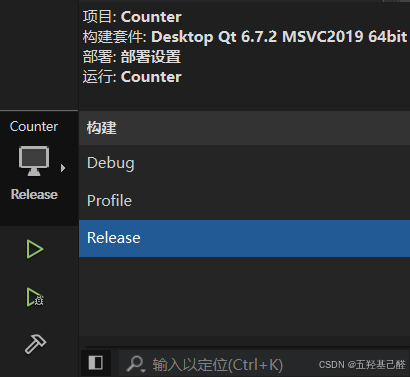

于是在 **<span style="background-color:#c7e6ea;">对应项目文件夹路径->build->Desktop_Qt_6_7_2_MSVC2019_64bit-Release->release</span>** 路径下就会出现一个exe可执行文件，将文件复制出来即可使用。

放到一个空文件夹中，可见空文件夹除了这个可执行文件外没有任何文件了：

 

<div align="center" style="border: 3px solid gray;border-radius: 27px;overflow: hidden;"> <a class="link-info" href="https://live.csdn.net/v/embed/430170?autoplay=0" rel="nofollow" title="QT简易计数器">QT简易计数器</a><iframe id="wYtlbGZD-1729662573859" frameborder="0" src="https://live.csdn.net/v/embed/430170?autoplay=0" allowfullscreen="true" data-mediaembed="csdn" style="width: 100%; aspect-ratio: 2;" allow="fullscreen" loading="lazy"></iframe></div>

## 五.总结

这是笔者第一次独立进行QT窗口开发，比较简陋，望大家海涵。