# 【QT项目】基于C++的数据链路层帧封装实验（CRC校验算法实现）

> 原创 于 2024-11-25 13:04:53 发布 · 粉丝可见 · 3.1k 阅读 · 116 · 26 · 本内容遵循CC 4.0 BY-SA版权协议 版权声明：本文为博主原创文章，遵循 CC 4.0 BY 版权协议，转载请附上原文出处链接和本声明。 GEO检测 · 编辑
> 文章链接：https://menoking.blog.csdn.net/article/details/143822887

**目录**

[TOC]


## 一.项目背景

 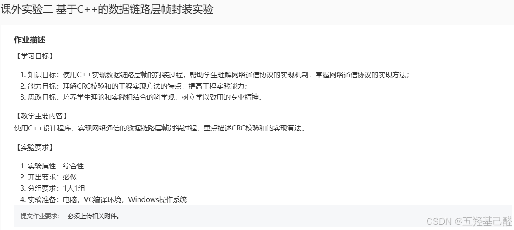

## 二.基础知识及思路讲解

### CRC校验

> 
> 
> - 定义
> 
>   - CRC，即循环冗余校验（Cyclic Redundancy Check），是一种根据网络数据包或 [电脑文件](https://zh.wikipedia.org/wiki/%E9%9B%BB%E8%85%A6%E6%AA%94%E6%A1%88) 等数据产生简短固定位数校验码的一种 [散列函数](https://zh.wikipedia.org/wiki/%E6%95%A3%E5%88%97%E5%87%BD%E6%95%B8) ，主要用来检测或校验数据传输或者保存后可能出现的错误。
> 
> - CRC校验码计算方法
> 
>   - 将要进行校验的数据（即输入的原始数据）进行 **一定处理** （添加生成多项式-1的位数）后作为被除数，同时选择一个合适的除数（生成多项式）作除数。让它们两个做模2除法，最后得到的余数就是校验码。
> 
> - 校验过程
> 
>   - 发送端：将上述计算的校验码加到原始数据后作为发送帧。
> 
>   - 接收端：使用规定好的相同的生成多项式与接收到的数据重新进行计算得出CRC值，若此值为0，则发生误码；若此值不为0，则发生误码。
> 
> 

### 实现思路

依据题意，我们首先需要输入一个原始数据，将其与我们规定的生成多项式进行计算后输出计算后的校验码与发送帧序列显示。接着继续进行输入模拟接收端收到的数据进行计算，比较并输出是否误码。

以下为维基百科中部分生成多项式的取值：

 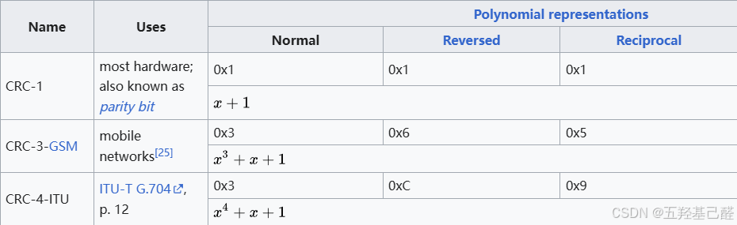

更多可以参考： [Cyclic redundancy check - Wikipedia](https://en.wikipedia.org/wiki/Cyclic_redundancy_check#See_also) 

一般我们选择工程上比较常用的CRC-16：

 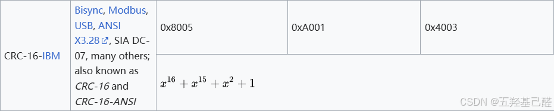

在代码中，除了生成必要的UI界面来完成输入输出之外，还需要自定义最关键的 **CRC类** ，在其中记录下规定的生成多项式，输入数据，校验值，发送帧，接收帧，接收校验值，是否误码等数据。在主任务框架中实例化这个类并进行赋值运算。

在这个实验中我们只做最简单的实现，即输入原始数据，输入多项式，计算出最后的CRC校验值，第二次再输入相应的序列后判断该序列是否误码。

## 三.工程创建

### 创建工程

经典创建项目起手：

 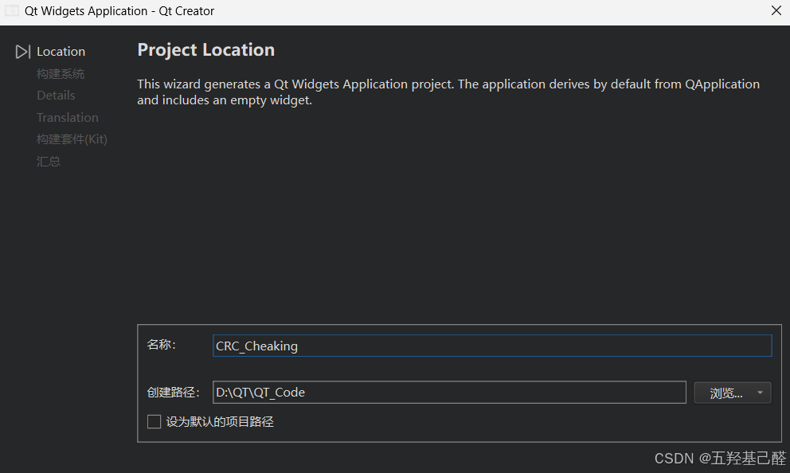

 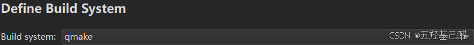

 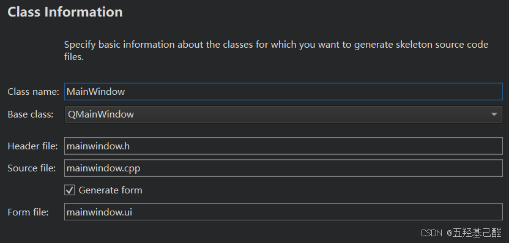

 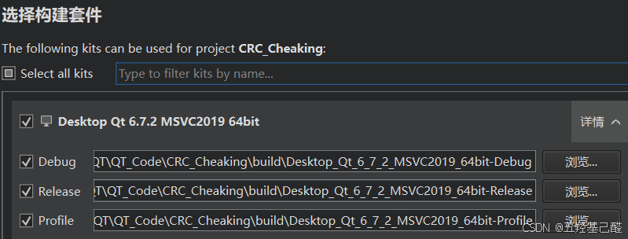

### 添加文件

首先创建一个纯C++类，用以存储CRC数据与计算：

 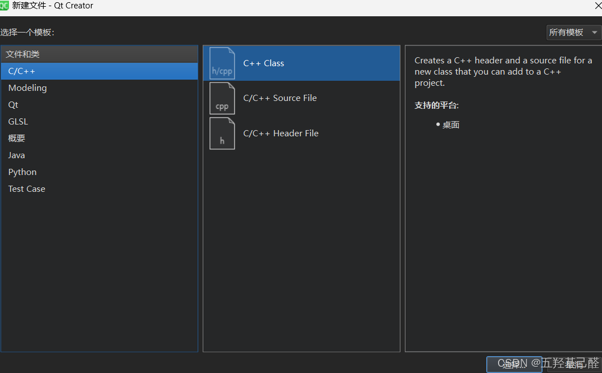

 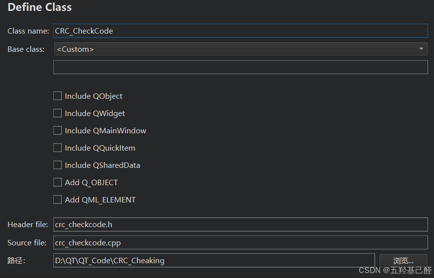

## 四.功能实现

### CRC类

#### crc_checkcode.h

```cpp
#ifndef CRC_CHECKCODE_H
#define CRC_CHECKCODE_H
 
#include <QApplication>
 
class CRC_CheckCode
{
private:
    QString pory;//多项式
 
    QString InputData;//输入原始数据
    QString crcData;//CRC校验值
    QString SendFrame;//发送帧
 
    QString ReceiveData;//接收帧
    bool ifnot;//是否误码
 
    QString xorOperation(QString a,QString b);
public:
    CRC_CheckCode();
    ~CRC_CheckCode();
 
    void SetCalculateCData(QString InputData,QString pory);
    void SetCheckData(QString ReceiveData);
 
    QString CRC16();
    bool Check();
 
    QString GetCRC();
    bool GetIfError();
    QString GetSendFrame();
};
 
#endif // CRC_CHECKCODE_H
```

#### crc_checkcode.cpp

```cpp
#include "crc_checkcode.h"
 
CRC_CheckCode::CRC_CheckCode() {}
CRC_CheckCode::~CRC_CheckCode(){};
 
QString CRC_CheckCode::xorOperation(QString a,QString b)
{
    QString result = "";
 
    for (int i = 0; i < a.length(); i++) {
        if (a[i] == b[i]) {
            result += "0";
        } else {
            result += "1";
        }
    }
 
    return result;
}
 
void CRC_CheckCode::SetCalculateCData(QString InputData,QString pory)
{
    this->InputData = InputData;
    this->pory = pory;
}
 
void CRC_CheckCode::SetCheckData(QString ReceiveData)
{
    this->ReceiveData = ReceiveData;
}
 
QString CRC_CheckCode::CRC16()
{
    QString data = this->InputData;
 
    // 在数据后面添加 `pory` 长度的 '0'
    data += QString(this->pory.length() - 1, '0'); // 添加 `pory.length() - 1` 个零
 
    int pick = this->pory.length();
    QString tmp = data.left(pick); // 直接获取前 `pick` 位
 
    while (pick < data.length())
    {
        // 检查 `tmp` 的首字符
        if (tmp[0] == '1') {
            // 计算并更新 `tmp`，与 `data[pick]` 拼接
            tmp = xorOperation(this->pory, tmp) + data[pick];
        } else {
            // 如果首字符为 '0'，使用相同长度的 '0' 填充
            tmp = xorOperation(QString(this->pory.length(), '0'), tmp) + data[pick];
        }
        pick += 1;
    }
 
    // 最后一次 XOR 操作
    if (tmp[0] == '1') {
        tmp = xorOperation(this->pory, tmp);
    } else {
        tmp = xorOperation(QString(this->pory.length(), '0'), tmp);
    }
 
    // 去掉最高位前的零
    tmp = tmp.mid(tmp.indexOf('1'));  // 从第一个 '1' 开始截取
 
    // 将结果保存到 `crcData`
    this->crcData = tmp;
    return tmp;
}
 
 
 
bool CRC_CheckCode::Check()
{
    QString data = this->ReceiveData;
    int pick = this->pory.length() - 1;
 
    QString str = data.right(pick);
    if(str == this->crcData)
    {
        this->ifnot = true;
        return true;
    }
    this->ifnot = false;
    return false;
}
 
QString CRC_CheckCode::GetCRC()
{
    return this->crcData;
}
 
bool CRC_CheckCode::GetIfError()
{
    return this->ifnot;
}
 
QString CRC_CheckCode::GetSendFrame()
{
    QString SendFrame_tmp;
    SendFrame_tmp = this->InputData + this->crcData;
    this->SendFrame = SendFrame_tmp;
    return SendFrame_tmp;
}
```

### 主窗口

#### mainwindow.h

```cpp
#ifndef MAINWINDOW_H
#define MAINWINDOW_H
 
#include <QMainWindow>
#include "crc_checkcode.h"
 
QT_BEGIN_NAMESPACE
namespace Ui {
class MainWindow;
}
QT_END_NAMESPACE
 
class MainWindow : public QMainWindow
{
    Q_OBJECT
 
public:
    MainWindow(QWidget *parent = nullptr);
    ~MainWindow();
 
private slots:
    void on_pushButton_calculate_clicked();
 
    void on_pushButton_check_clicked();
 
private:
    Ui::MainWindow *ui;
};
#endif // MAINWINDOW_H
```

#### mainwindow.cpp

```cpp
#include "mainwindow.h"
#include "ui_mainwindow.h"
 
MainWindow::MainWindow(QWidget *parent)
    : QMainWindow(parent)
    , ui(new Ui::MainWindow)
{
    ui->setupUi(this);
 
}
 
MainWindow::~MainWindow()
{
    delete ui;
}
 
CRC_CheckCode *crcc = new CRC_CheckCode();
 
void MainWindow::on_pushButton_calculate_clicked()
{
    crcc->SetCalculateCData(ui->lineEdit_origindata->text(),ui->lineEdit_pory->text());
    ui->label_crc->setText(crcc->CRC16());
    ui->label_sendframe->setText(crcc->GetSendFrame());
}
 
 
void MainWindow::on_pushButton_check_clicked()
{
    crcc->SetCheckData(ui->lineEdit_receive->text());
    if(crcc->Check() == true)
        ui->label_ifnot->setText("无误码！");
    else
        ui->label_ifnot->setText("误码！");
 
}
 
```

## 五.最终效果

 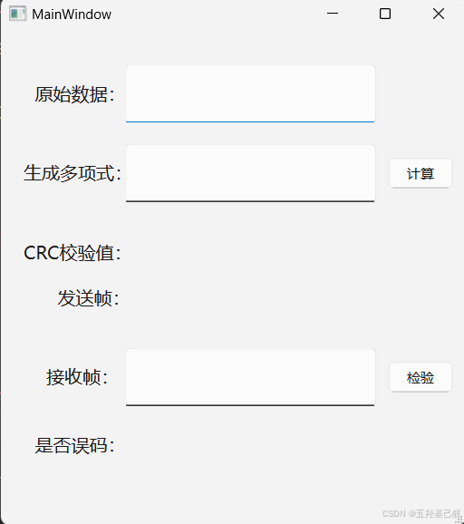

 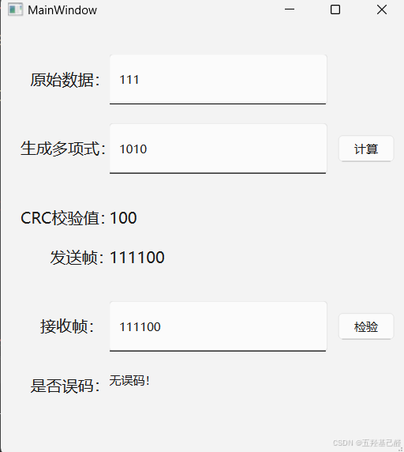

## 六.总结

这个项目作为实验来说难度并不高，只是理解清楚CRC计算的内容还是较为复杂的，只要对计算过程有较为清晰的理解，完成整个设计还是很轻松的。当然读者有能力可以根据需求改编为CRC16-IBM的标准编码。