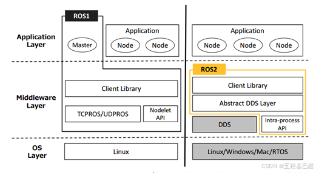
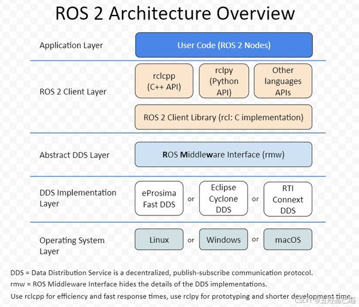
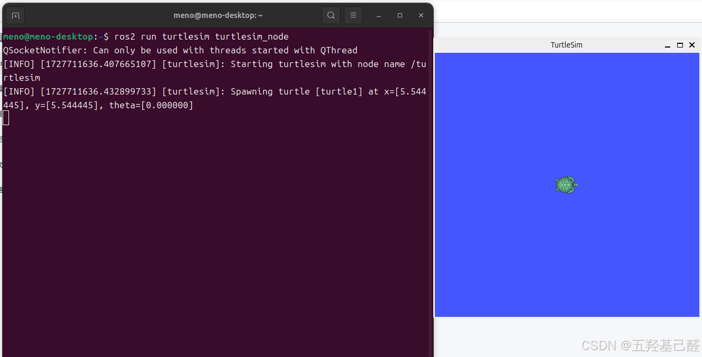
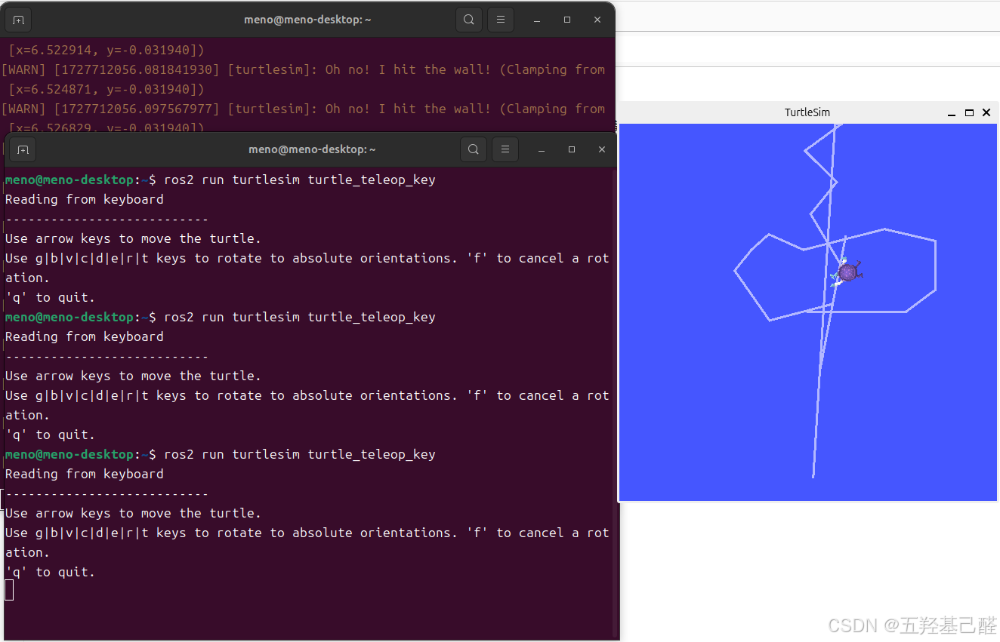
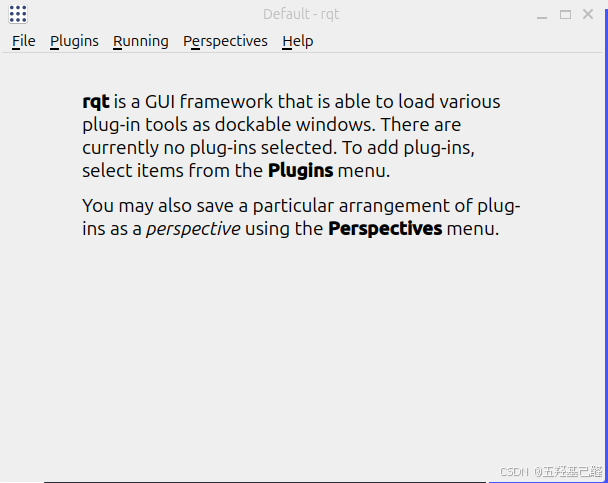
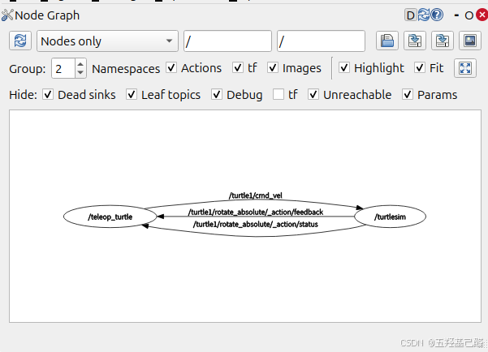
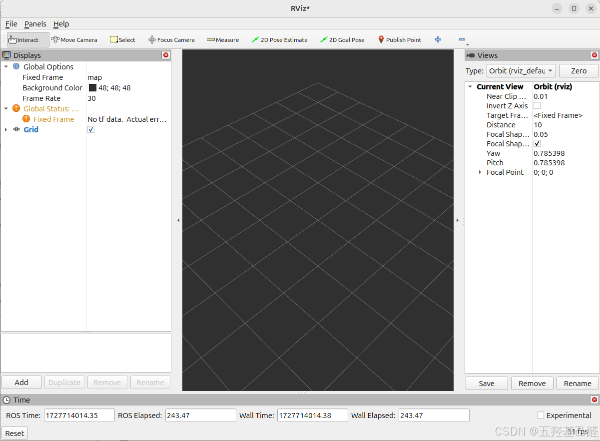
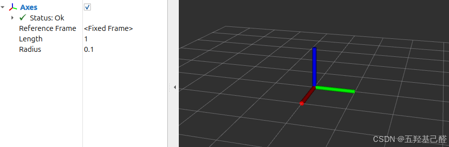

# 【ROS速成】半小时入门机器人ROS系统简明教程（Ubuntu24.04+ROS2）

> 原创 已于 2024-11-03 20:07:13 修改 · 粉丝可见 · 4k 阅读 · 63 · 48 · 本内容遵循CC 4.0 BY-SA版权协议 版权声明：本文为博主原创文章，遵循 CC 4.0 BY 版权协议，转载请附上原文出处链接和本声明。 GEO检测 · 编辑
> 文章链接：https://menoking.blog.csdn.net/article/details/142624129

**目录**

[TOC]


## 一.复杂的机器人系统

依照我们现在的技术来看，机器人系统仍是极其复杂的，往往一个系统就需要数以百计的工程师开发。一个机器人集成了多个领域的多个人的共同智慧，例如：机械工程、电子工程、计算机科学、控制理论等。

我们知道一个系统由通俗地简单地讲是由硬件和软件部分构成的，其中硬件部分包括控制核心，驱动器，执行器，传感器等组成；而软件部分则特定的操作系统，中间件，驱动层，应用层等组成。

## 二.ROS机器人系统

> 要认识并理解ROS，我们必须要对Linux或Ubuntu有一些基础的认识，且要会操作，因此：建议大家先补充前置知识：
> 
> [【学习笔记】ARM64平台下的ubuntu学习总结](https://blog.csdn.net/2203_75993546/article/details/142208962?fromshare=blogdetail&sharetype=blogdetail&sharerId=142208962&sharerefer=PC&sharesource=2203_75993546&sharefrom=from_link) 

### 1.简介

而提到软件部分，我们就不得不提到一个在机器人领域不可避免的系统——ROS系统。ROS就是传说中的机器人操作系统（RobotOperating System），但其本身并不是一个操作系统，而是可以安装在现在已有的操作系统上（Linux、Windows、Mac）上的 **软件库和工具集** 。

实际上，ROS的作用就是提供一个将机器人硬件部件连接起来的简易的软件系统，同时避免了机器人开发中开发者重复造轮子，大大提升了机器人工程的开发效率。

ROS为此设计了一整套通信机制（话题、服务、参数、动作）。通过这些通信机制，ROS实现了将机器人的各个组件给的连接起来。

其中ROS1和ROS2架构分别如下：

 

 

首先我们要了解DDS（DataDistribution Service），这是ROS2中的最重要的协议标准。它通过类似于ROS1中的话题发布和订阅形式来进行通信，同时提供了丰富的服务质量管理来保证可靠性、持久性、传输设置等。

围绕DDS又抽象出两层：

> 
> 
> - DDS实现层：对不同常见的DDS接口进行再次的封装，让其保持统一性，为DDS抽象层提供统一的API。
> 
> - DDS抽象层：这一层将DDS实现层进一步的封装，使得DDS更容易使用。原因在于DDS需要大量的设置和配置（分区，主题名称，发现模式，消息创建,…），这些设置都是在ROS2的抽象层中完成的。
> 
> 

再往上就是RCL（ROSClientLibrary）ROS客户端库，是ROS的一种API，提供了对ROS话题、服务、参数、Action等接口。不同语言（Python，C++等）有着不同的RCL库，对应相同的功能。

---

#### 1.节点

如果要学习ROS，我们一定要先理解Node（节点）的含义，这是ROS最常用的概念。一般来说，一个节点往往是一个可执行程序（c++，python等），负责执行一个特定的单一任务，比如发送图像数据的节点，控制车辆运动的节点。节点之间可以通过话题topic，服务service，参数parameter和动作action相互通信，形成一个网络拓扑，即 ros graph，最终完成一个复杂的任务，比如自动驾驶车辆。

#### 2.话题

两个节点node之间需要通信，最重要的方式就是话题 topic ，其相当于一个公共汽车 bus ，里面装载两个节点间约定好格式的消息 msg。

> 
> 
> 1. **发布/订阅模型** ：话题是基于发布/订阅模型的通信方式。在这种模型中，数据的生产者（发布者）发布数据到特定的话题，而数据的消费者（订阅者）订阅该话题以接收数据。
> 
> 2. **数据流** ：话题可以看作是一个数据流，发布者不断地将数据发送到话题上，而订阅者则从话题上接收这些数据。
> 
> 3. **非持久性** ：话题上的数据是实时传输的，一旦发布者发布了数据，订阅者要么即时接收，要么数据就会丢失（除非使用特定的历史记录功能）。
> 
> 

### 2.安装

这里推荐鱼香大大开发的一键安装脚本

在终端键入：

```cobol
wget http://fishros.com/install -O fishros && . fishros
```

按照提示依次选择即可安装ROS2。

### 3.测试

**第一种测试方法：** 

这里我们启动两个节点（注意要打开两个终端Ctrl+Alt+T分别键入），一个为Listen节点，一个为Speaker节点 ，分别用于收消息和发消息。

```cobol
ros2 run demo_nodes_py listener
```

```cobol
ros2 run demo_nodes_cpp talker
```

现象如下：

<div style="text-align:center;">&nbsp;</div>

**第二种测试方法（小海龟）：** 

打开一个终端键入：

```cobol
ros2 run turtlesim turtlesim_node
```

启动小海龟：

 

再打开一个新的终端，键入：

```cobol
ros2 run turtlesim turtle_teleop_key
```

这时我们就可以使用键盘的方向键控制小海龟了。注：当我们的聚焦在这个命令的终端时才能有效控制！

 

###  **4.可视化** 

ROS系统中有两个极其重要的可视化工具：RQT（Robot Qt Graphics User Interface）和RVIZ（Robot Visualization Tool）。其中RVIZ是一个3D可视化工具，主要用于显示传感器信息，导航地图等信息；RQT则是一个用于创建和管理ROS图形界面的工具，以便开发者实时查看和调试ROS系统。

####  **RQT：** 

这里我们先体验一下RQT，向终端中键入：

```undefined
rqt
```

 

我们选择选项卡中的Plugins->Introspection->Node Graph 之后就可看到节点相关的信息。

 

#### RVIZ：

首先必须要先向终端中键入：

```cobol
source /opt/ros/jazzy/setup.bash
```

> 
> 
> - `setup.bash` ：这是一个Bash脚本，它包含了设置ROS环境变量所需的命令。这个脚本通常做了以下几件事情：
> 
>   - 设置 `ROS_ROOT` 、 `ROS_PACKAGE_PATH` 、 `ROS_MASTER_URI` 、 `ROS_IP` 等环境变量。
> 
>   - 将ROS的bin目录添加到系统的PATH环境变量中，这样就可以直接在终端中运行ROS命令和节点。
> 
>   - 设置其他可能需要的ROS相关的环境变量。
> 
> 执行这条命令后，你就可以在当前终端会话中使用ROS的命令行工具、运行节点、使用ROS的包等。每次打开新的终端会话时，都需要重新执行这条命令（或者将其添加到你的 `.bashrc` 或 `.bash_profile` 文件中，以便在每次打开终端时自动执行）。

然后运行以下命令启动RVIZ：

```cobol
ros2 run rviz2 rviz2
```

 

这里只做简单说明：

> 中间的黑色窗口是 3D 视图。
> 
> 显示器是指在 3D 世界中绘制某些内容的设备，并且可能在显示器列表中有一些可用选项。例如，点云、机器人状态等。
> 
> 点击“ADD”即可添加新的显示器。
> 
> 显示属性：
> 
> 每个显示器都有自己的属性列表。
> 
>  
> 
> 显示状态：
> 
> 每个显示都有自己的状态，以帮助您了解一切是否正常。状态可以是： `OK` 、 `Warning` 、 `Error` 或 `Disabled` 。

RVIZ就简单介绍这些，更多的等日后再学。


---

如有错误，感谢指正！

未完待续。 。 。