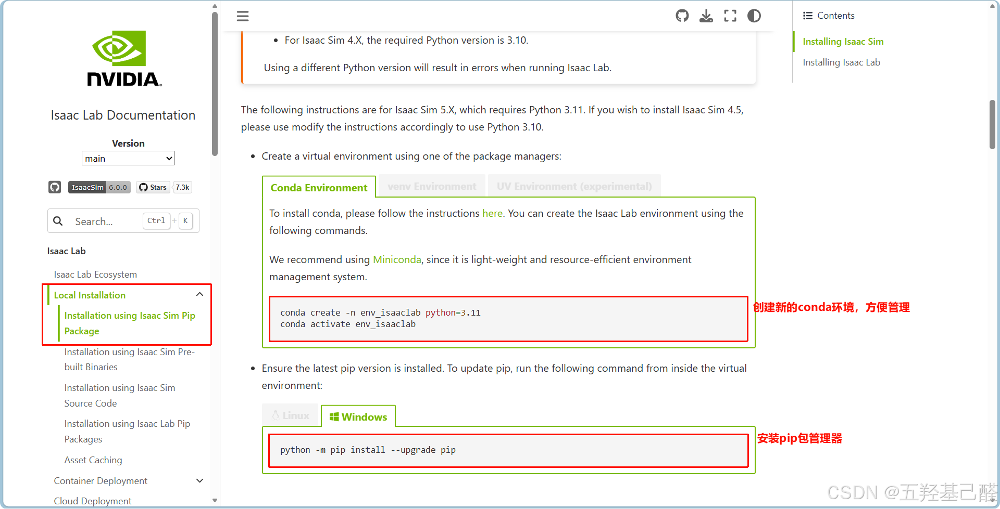
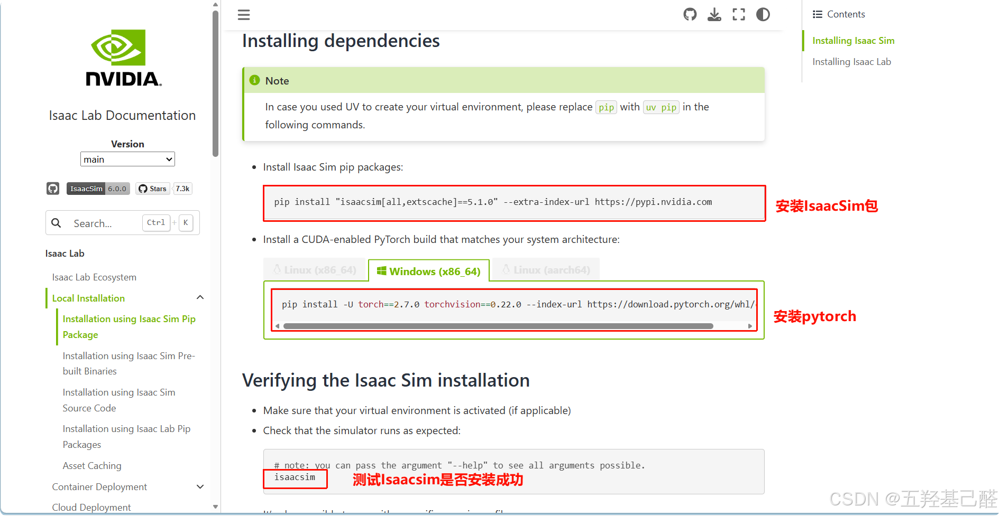
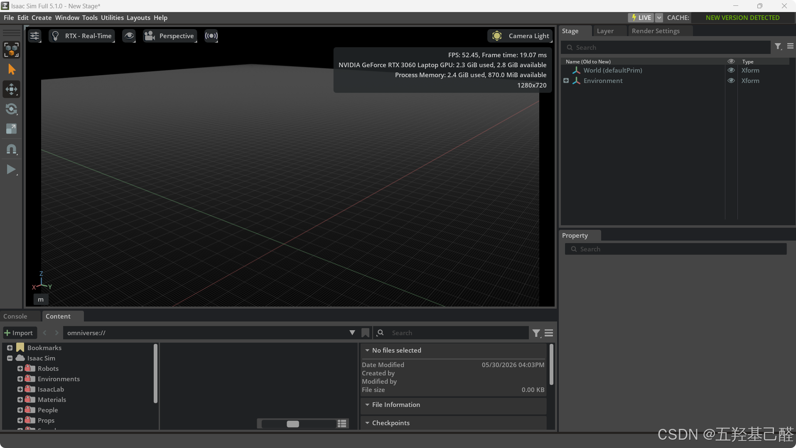
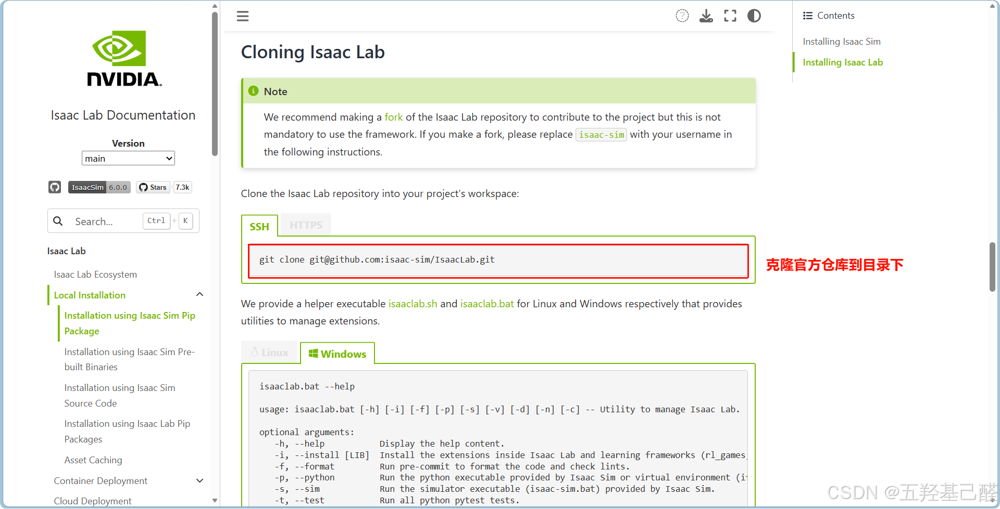
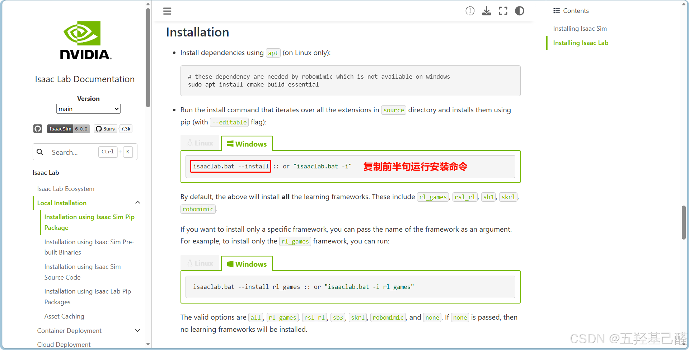
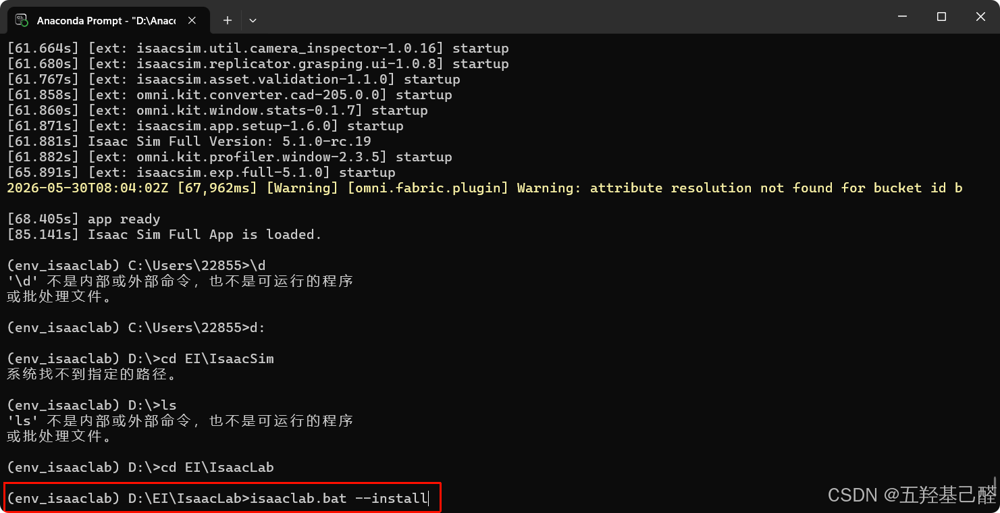
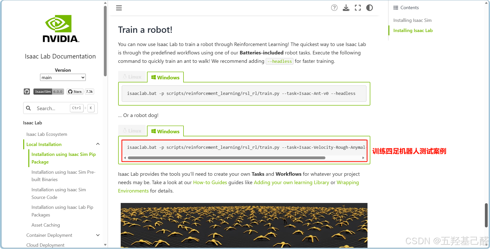
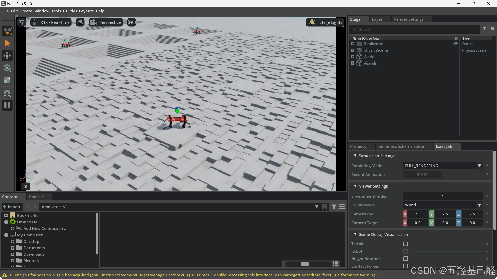
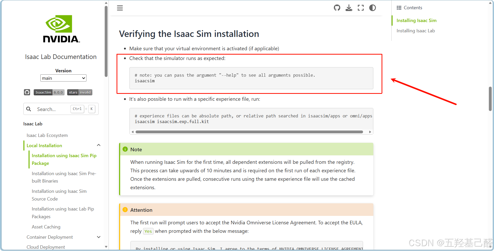
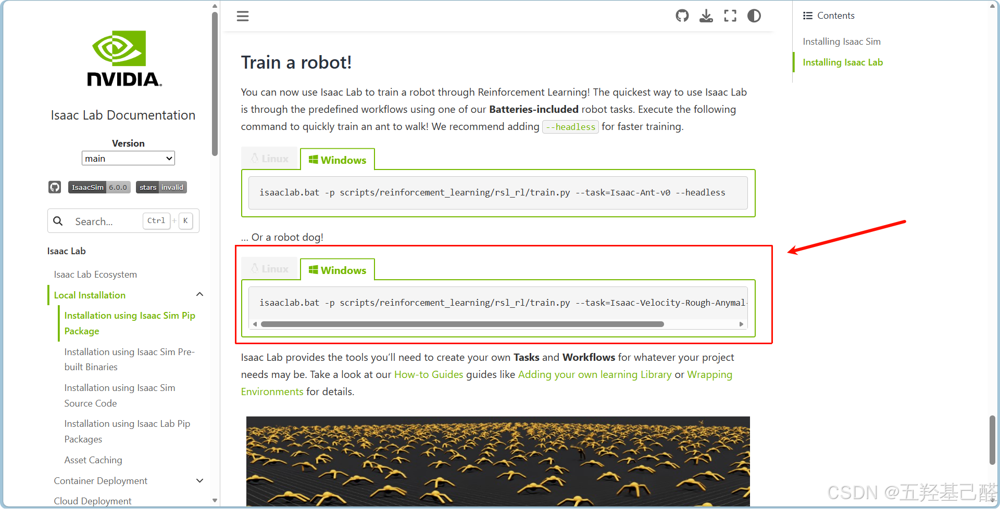

# 【Robotics】半小时入门具身智能之Win11下IsaacSim环境搭建

> 原创 已于 2026-06-02 22:16:09 修改 · 粉丝可见 · 244 阅读 · 6 · 5 · 本内容遵循CC 4.0 BY-SA版权协议 版权声明：本文为博主原创文章，遵循 CC 4.0 BY 版权协议，转载请附上原文出处链接和本声明。 GEO检测 · 编辑
> 文章链接：https://menoking.blog.csdn.net/article/details/161525291

**目录**

[TOC]


## 一.有关Robotics

由于笔者硕士阶段攻读方向为具身智能，因此开此系列新帖作为学习记录。

## 二.安装IsaacSim与IsaacLab

参考官方文档： [Installation using Isaac Sim Pip Package — Isaac Lab Documentation](https://isaac-sim.github.io/IsaacLab/main/source/setup/installation/pip_installation.html) 

参考视频教程： [Lesson1 米雪儿教你在windows下安装Isaaclab_哔哩哔哩_bilibili](https://www.bilibili.com/video/BV1riXNBmEiM/?spm_id_from=333.788.videopod.sections&vd_source=60b7e4846ff8eebbaf6efd46ab66b45a) 

注意搭建环境前建议安装Anaconda/Miniconda进行虚拟空间管理，详情可参考： [最新版最详细Anaconda新手安装+配置+环境创建教程_anaconda配置-CSDN博客](https://blog.csdn.net/qq_44000789/article/details/142214660) 

**！以下简要步骤均在Windows上完成！** 

### 安装IsaacSim

#### 准备python环境

 

#### 安装依赖与测试

 

能成功启动仿真器看到栅格即为成功

 

### 安装IsaacLab

#### 克隆项目

先新建一个目录，并用git命令克隆官方仓库到该目录下

 

终端进入到刚刚克隆的仓库根目录下，并运行批处理文件安装

 

 

#### 运行测例

注意这里稍有不同，官方给的命令后headless是指 **无渲染模式** ，不会显示训练GUI；而我们替换成num_envs 16后则设置了并行环境数量为16，默认进入渲染，显示GUI界面。

> 这里笔者一开始无法成功运行测试案例，具体解决方案见 **第三部分中的运行测试案例不成功** 

```bash
isaaclab.bat -p scripts/reinforcement_learning/rsl_rl/train.py --task=Isaac-Velocity-Rough-Anymal-C-v0 --num_envs 16
```

 

进入仿真器，显示如下即为成功。

 

## 三.问题记录

以下是笔者在搭建环境时所遇到的一些问题，特记录下来。

### 测试IsaacSim闪退

 

笔者如图在这一步进入仿真环境后立刻闪退。

需要回退NVIDIA显卡版本，笔者是回退至版本号519系列。

具体回退过程可参考： [NVIDIA回退驱动解决方法（2025）_n卡驱动怎么回退版本-CSDN博客](https://blog.csdn.net/qq_44319972/article/details/147878751) 

### 运行测试案例不成功

 

如图笔者运行第二个测试案例时仿真器闪退， **解决方案如下，读者可一并复制给Agent自动解决** ：

```cobol
# IsaacSim 5.1 Windows DLL 冲突修复记录
 
## 问题描述
 
在 Windows 11 + Anaconda 环境下运行 Isaac Lab 训练脚本时，遇到多个 DLL 加载失败导致的崩溃问题。根本原因是 **IsaacSim 运行时加载的 DLL 与 conda 环境中安装的包存在版本冲突**。
 
## 问题 1: h5py DLL 加载失败
 
**错误信息:**
 
```
ImportError: DLL load failed while importing _errors: 找不到指定的程序。
```
 
**根因:** IsaacSim 自带 HDF5 DLL（位于 `isaacsim.sensors.rtx` 和 `omni.usd.libs` 扩展中），与 conda 安装的 h5py 所需的 HDF5 DLL 版本不兼容。
 
**修复方法:**
 
1. 通过 conda-forge 安装兼容版本的 h5py：
 
   ```bash
   pip uninstall h5py -y
   conda install -c conda-forge h5py=3.10.0 -y
   ```
 
2. 将 conda 的 HDF5 DLL 复制到 h5py 包目录（使 Python 优先加载正确版本）：
 
   ```bash
   cp D:\Anaconda\envs\env_isaaclab\Library\bin\hdf5.dll D:\Anaconda\envs\env_isaaclab\Lib\site-packages\h5py\
   cp D:\Anaconda\envs\env_isaaclab\Library\bin\hdf5_hl.dll D:\Anaconda\envs\env_isaaclab\Lib\site-packages\h5py\
   ```
 
3. 修改 `source/isaaclab/isaaclab/utils/datasets/hdf5_dataset_file_handler.py`，将 `import h5py` 改为延迟导入，避免在 IsaacSim 扩展启动时触发 DLL 冲突。
 
## 问题 2: tensordict._C 编译扩展崩溃
 
**错误信息:**
 
```
Windows fatal exception: access violation
# 崩溃位于 tensordict/utils.py 第 44 行: from tensordict._C import ...
```
 
**根因:** IsaacSim 捆绑的 PyTorch 2.7.0+cu128 使用 `CXX11 ABI=False` 编译，而 PyPI 上的 tensordict 0.12.4 的 C 扩展 (`_C.pyd`) 使用 `CXX11 ABI=True` 编译。ABI 不匹配导致加载时发生段错误（access violation），这是硬性崩溃，try/except 无法捕获。
 
**修复方法:**
 
1. 重命名 tensordict 的 C 扩展文件，阻止 Python 加载：
 
   ```bash
   mv D:\Anaconda\envs\env_isaaclab\Lib\site-packages\tensordict\_C.pyd D:\Anaconda\envs\env_isaaclab\Lib\site-packages\tensordict\_C.pyd.bak
   ```
 
2. 修改 `D:\Anaconda\envs\env_isaaclab\Lib\site-packages\tensordict\utils.py`，将 C 扩展导入改为 try/except，并修改纯 Python 回退函数，使其在 C 扩展不可用时正确工作：
 
   ```python
   try:
       from tensordict._C import (
           _unravel_key_to_tuple as _unravel_key_to_tuple_cpp,
           unravel_key as unravel_key_cpp,
           unravel_key_list as unravel_key_list_cpp,
           unravel_keys as unravel_keys_cpp,
       )
   except (ImportError, OSError):
       pass
   ```
 
## 问题 3: VC++ 运行时缺失
 
**修复:** 通过 conda 安装 VC++ 运行时库（`vc14_runtime`）：
 
```bash
conda install -c conda-forge tensordict -y
```
 
此操作附带安装了 `vc14_runtime-14.51.36231`，解决了部分编译扩展的 DLL 依赖问题。
 
## 环境信息
 
- OS: Windows 11 Home China (23H2)
- GPU: NVIDIA GeForce RTX 3060 Laptop (6GB VRAM)
- IsaacSim: 5.1.0
- Isaac Lab: 0.54.3
- Python: 3.11 (Anaconda env_isaaclab)
- PyTorch: 2.7.0+cu128 (CXX11 ABI=False)
- h5py: 3.10.0 (conda-forge)
- tensordict: 0.12.4 (C 扩展已禁用)
- numpy: 1.26.4
 
```