# 【Robotics】半小时入门具身智能之复现一篇顶会论文--足式机器人的自适应能量步态控制

> 原创 已于 2026-06-09 15:42:14 修改 · 粉丝可见 · 247 阅读 · 6 · 5 · 本内容遵循CC 4.0 BY-SA版权协议 版权声明：本文为博主原创文章，遵循 CC 4.0 BY 版权协议，转载请附上原文出处链接和本声明。 GEO检测 · 编辑
> 文章链接：https://menoking.blog.csdn.net/article/details/161751164

**目录**

[TOC]


## 零.前置说明

本贴对ICRA 2025的一篇强化学习论文AdaptiveEnergyRegularization for Autonomous Gait Transition and Energy-Efficient Quadruped Locomotion进行复现，进一步加深对IsaacLab的熟悉。

> 本贴参考了猫师傅的教程Lesson3：
> 
> [【Lesson3上】复现ICRA顶会论文：不预设步态，让机器狗学会自适应行走（理论部分）_哔哩哔哩_bilibili](https://www.bilibili.com/video/BV1wQLJ6PEFz?spm_id_from=333.788.videopod.sections&vd_source=60b7e4846ff8eebbaf6efd46ab66b45a) 
> 
> <span style="color:#4f4f4f">以及论文</span> [Efficient Locomotion](https://sites.google.com/berkeley.edu/efficient-locomotion) 

同时代码部分：

> 本篇依照笔者上一篇文章： [【Robotics】半小时入门具身智能之手动创建第一个项目-CSDN博客](https://blog.csdn.net/2203_75993546/article/details/161546327?spm=1001.2014.3001.5501) 中新建的项目（Manager-based，rsl_rl）基础上来进行改进，项目可到Github克隆： [GitHub - menoking/Unitree-Go2-Demo: The first demo project based on Unitree Go2 when author learn Embodied Intelligence. · GitHub](https://github.com/menoking/Go2-Demo) 
> 
> 本贴复现代码： [menoking/Unitree-Go2-AER: The project was established to reproduce the paper titled "Adaptive Energy Regularization for Autonomous Gait Transition and Energy-Efficient Quadruped Locomotion".](https://github.com/menoking/Unitree-Go2-AER) 

## 一.基础理论

### 通读论文

#### 题目

论文题目为" **用于自主步态切换与高能效四足机器人运动的自适应能量正则化方法** "

 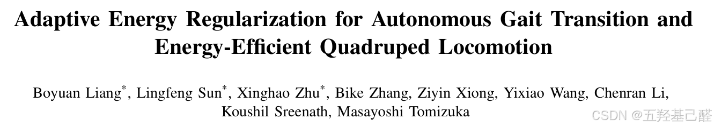

> Quadruped Locomotion -> 面向四足机器人
> 
> Adaptive Energy Regularization -> 正则化方法，即奖励/目标优化
> 
> Energy-Efficient / Gait Transition -> 解决的问题是 提升能效/步态切换

#### 摘要

 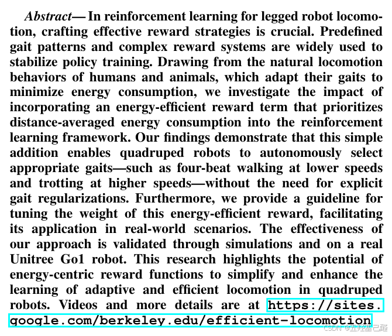

针对足式机器人强化学习中依赖复杂奖励设计和预定义步态约束的问题，作者提出了一种基于能耗优化的简洁奖励机制。仅通过引入能量效率奖励项，机器人即可在不同运动速度下自主涌现出合适的步态切换行为。

#### 正文

##### Related Work

我们直接看Related Work中的Energy Regularization部分，定义了总奖励函数：

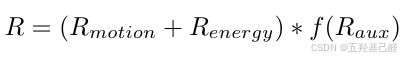

其中 $$
Rmotion
$$是速度追踪的奖励， $$
Renergy
$$是本文提出的能量奖励， $$
Raux
$$是辅助奖励项。

细化上述公式则得到：

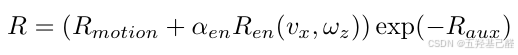

###### Rmotion

$$
Rmotion
$$包含 $$
Rlin
$$表示xy轴的线速度追踪奖励以及 $$
Rang
$$关于z轴的角速度追踪奖励。公式如下：

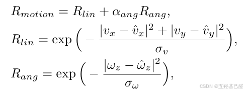

###### Ren

这个能量奖励是本文的核心，主要有关节速度、关节力矩，x轴线速度和z轴角速度以及两个能量缩放常数构成：

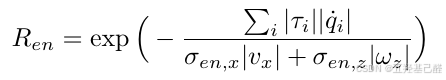

> 猫老师画的这张图可以直观地表示这个能量奖励的作用：
> 
>  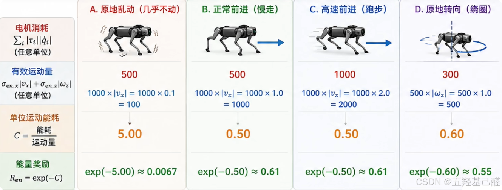
> 
> 

###### Raux

辅助项奖励包含碰撞避免（collision avoidanc），动作速率控制（action rate control）等。在论文官网附录中全部列出来了：

 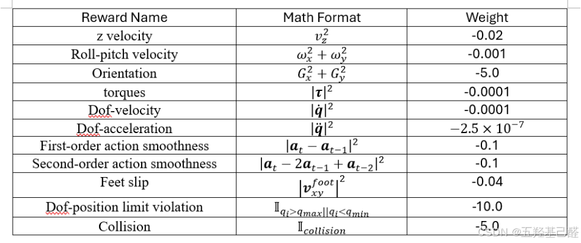

##### Experiments

###### Parameters

实验部分则展示了训练流程及参数，后续我们代码中计算能量奖励时缩放常数就参考了这里的数据：

 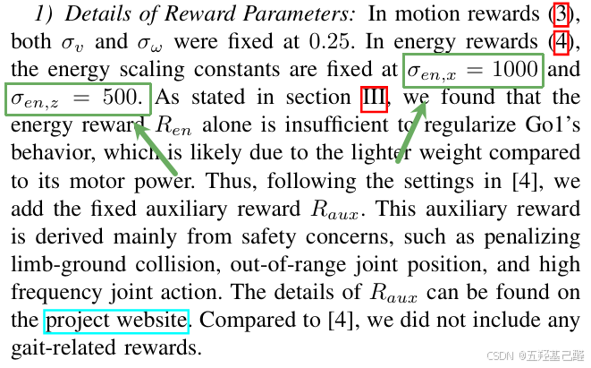

###### Curriculum

尤其是还加入了课程学习部分以提升泛化性：

 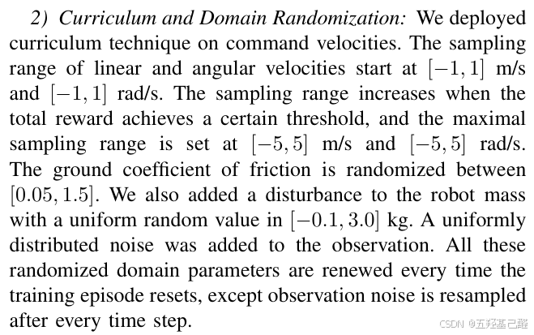

## 二.代码复现

### 能量奖励

> 要实现如下函数：
> 
>  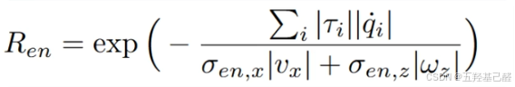
> 
> 该公式以关节扭矩绝对值 ∣τi∣与关节角速度绝对值 ∣q˙i∣的乘积之和为分子，以线速度绝对值 ∣vx∣ 和角速度绝对值 ∣ωz∣分别乘以缩放系数 σen,x、σen,z 之和为分母，取负值后计算指数函数，得到能量奖励ReRen​。

#### mdp\ **rewards.py** 

先找到项目中预留的 **自定义奖励函数接口** 文件source\go2_demo\go2_demo\tasks\manager_based\go2_demo\mdp\ **rewards.py** ：

 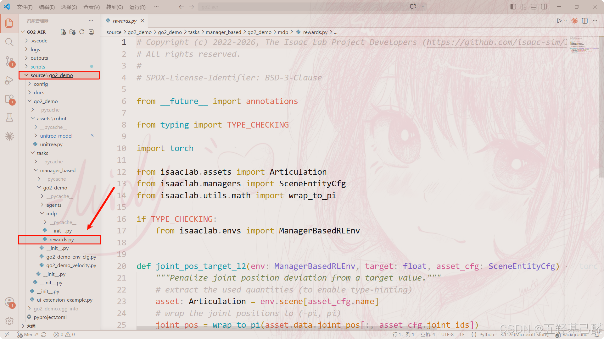

末尾添加奖励函数定义（接收参数为环境对象 `env` ，机器人资产配置 `asset_cfg` （默认指向名为"robot"的实体），以及两个缩放系数 `sigma_lin` 和 `sigma_ang` ，两个裁剪阈值 `clip_lin` 和 `clip_ang` ）：

 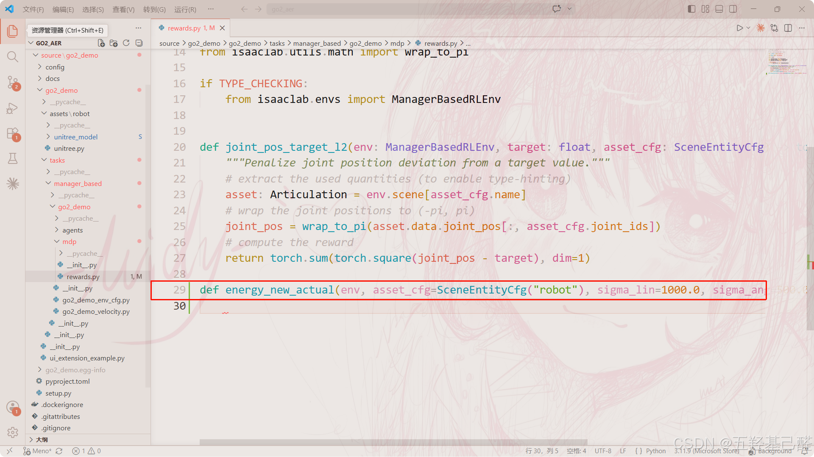

接着实现上述能量奖励公式：

 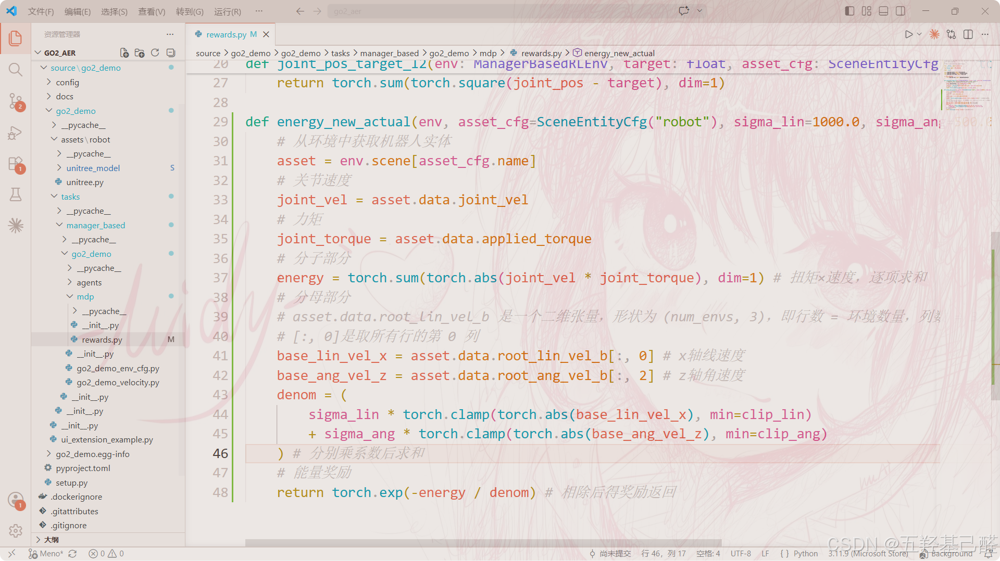

```python
def energy_new_actual(env, asset_cfg=SceneEntityCfg("robot"), sigma_lin=1000.0, sigma_ang=500.0, clip_lin=0.2, clip_ang=0.2):
    # 从环境中获取机器人实体
    asset = env.scene[asset_cfg.name]
    # 关节速度
    joint_vel = asset.data.joint_vel
    # 力矩
    joint_torque = asset.data.applied_torque
    # 分子部分
    energy = torch.sum(torch.abs(joint_vel * joint_torque), dim=1) # 扭矩×速度，逐项求和
    # 分母部分
    # asset.data.root_lin_vel_b 是一个二维张量，形状为 (num_envs, 3)，即行数 = 环境数量，列数 = 3（分别对应 x、y、z 方向的速度）
    # [:, 0]是取所有行的第 0 列
    base_lin_vel_x = asset.data.root_lin_vel_b[:, 0] # x轴线速度
    base_ang_vel_z = asset.data.root_ang_vel_b[:, 2] # z轴角速度
    denom = (
        sigma_lin * torch.clamp(torch.abs(base_lin_vel_x), min=clip_lin)
        + sigma_ang * torch.clamp(torch.abs(base_ang_vel_z), min=clip_ang)
    ) # 分别乘系数后求和
    # 能量奖励
    return torch.exp(-energy / denom) # 相除后得奖励返回
```

> 其中能量尺度常数（energy scaling constants）按照原文中参数分别给的1000和500。
> 
>  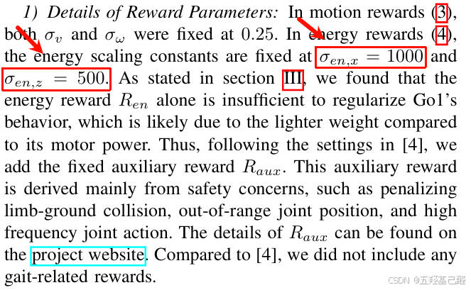
> 
> 

### 辅助项奖励

> 访问论文网址 [Efficient Locomotion - Appendix](https://sites.google.com/berkeley.edu/efficient-locomotion/home/appendix?authuser=0) 可以看见除了原始能量奖励外还有辅助奖励：
> 
>  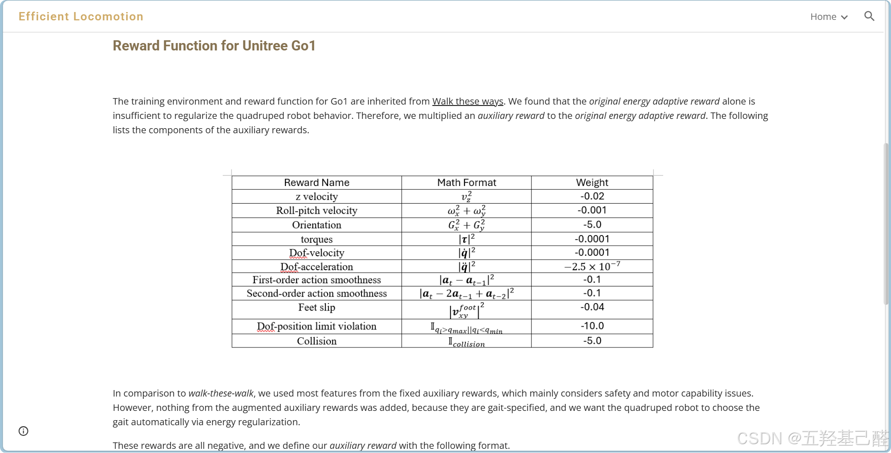
> 
> 这部分来实现其中部分辅助奖励项。

#### mdp\ **rewards.py** 

先在mdp\ **rewards.py** 中完成有关后面脚底打滑的辅助惩罚函数：

 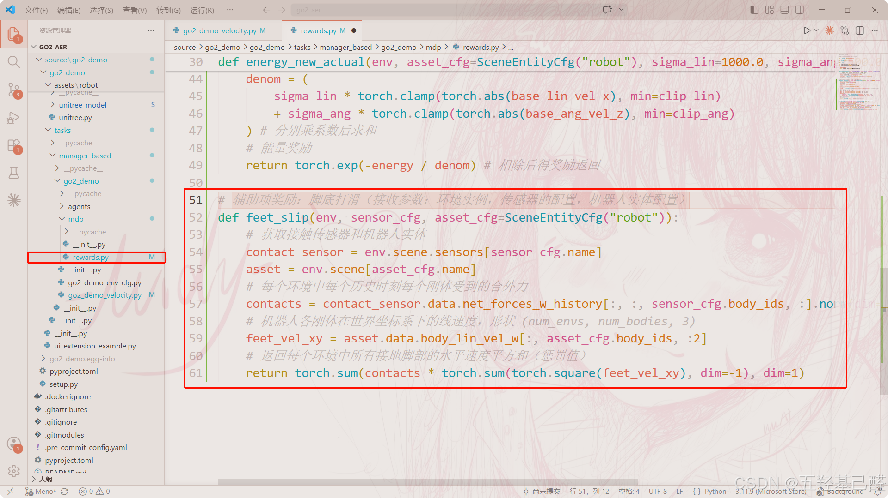

```python
# 辅助项奖励：脚底打滑（接收参数：环境实例，传感器的配置，机器人实体配置）
def feet_slip(env, sensor_cfg, asset_cfg=SceneEntityCfg("robot")):
    # 获取接触传感器和机器人实体
    contact_sensor = env.scene.sensors[sensor_cfg.name]
    asset = env.scene[asset_cfg.name]
    # 每个环境中每个历史时刻每个刚体受到的合外力
    contacts = contact_sensor.data.net_forces_w_history[:, :, sensor_cfg.body_ids, :].norm(dim=-1).max(dim=1)[0] > 1.0
    # 机器人各刚体在世界坐标系下的线速度，形状 (num_envs, num_bodies, 3)
    feet_vel_xy = asset.data.body_lin_vel_w[:, asset_cfg.body_ids, :2]
    # 返回每个环境中所有接地脚部的水平速度平方和（惩罚值）
    return torch.sum(contacts * torch.sum(torch.square(feet_vel_xy), dim=-1), dim=1)
```

#### go2_demo_velocity.py

然后定位到go2_demo_velocity.py，是我们自定义的训练环境的 **配置文件，** 存放了 **奖励配置** （ `RewardsCfg` ），使用 Isaac Lab 内置的奖励项（如速度跟踪、姿态约束等）。

 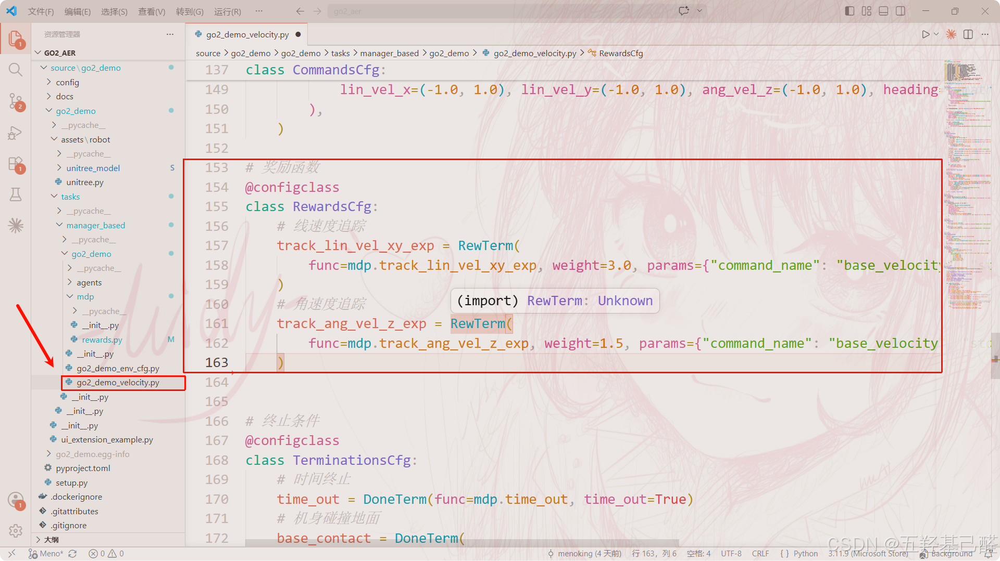

在其中完成辅助项奖励的实例化：

 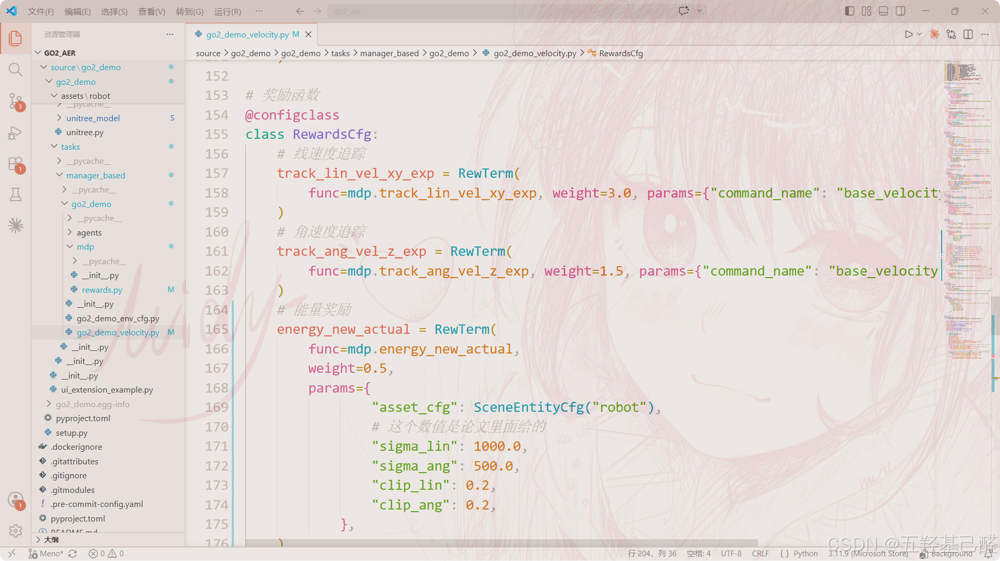

```python
# 奖励函数
@configclass
class RewardsCfg:
    # 线速度追踪
    track_lin_vel_xy_exp = RewTerm(
        func=mdp.track_lin_vel_xy_exp, weight=3.0, params={"command_name": "base_velocity", "std": math.sqrt(0.25)}
    )
    # 角速度追踪
    track_ang_vel_z_exp = RewTerm(
        func=mdp.track_ang_vel_z_exp, weight=1.5, params={"command_name": "base_velocity", "std": math.sqrt(0.25)}
    )
    # 能量奖励
    energy_new_actual = RewTerm(
        func=mdp.energy_new_actual,
        weight=0.5,
        params={
                "asset_cfg": SceneEntityCfg("robot"),
                # 这个数值是论文里面给的
                "sigma_lin": 1000.0,
                "sigma_ang": 500.0,
                "clip_lin": 0.2,
                "clip_ang": 0.2,
            },
    )
    # 辅助项奖励
    # 运动平滑与安全惩罚
    # z轴线速度惩罚（上下颠簸）
    base_linear_velocity = RewTerm(func=mdp.lin_vel_z_l2, weight=-0.05)
    # xy轴角速度惩罚（俯仰翻滚）
    base_angular_velocity = RewTerm(func=mdp.ang_vel_xy_l2, weight=-0.001)
    # 惩罚机身倾斜
    flat_orientation_l2 = RewTerm(func=mdp.flat_orientation_l2, weight=-5.0)
    # 惩罚关节输出力矩过大
    joint_torques = RewTerm(func=mdp.joint_torques_l2, weight=-1e-4)
    # 惩罚关节速度
    joint_vel = RewTerm(func=mdp.joint_vel_l2, weight=-1e-4)
    # 惩罚关节加速度
    joint_acc = RewTerm(func=mdp.joint_acc_l2, weight=-2.5e-7)
    # 惩罚相邻时刻动作变化过大
    action_rate = RewTerm(func=mdp.action_rate_l2, weight=-6.25e-3)
    # 惩罚脚接触地面时的滑动（水平速度）
    feet_slip = RewTerm(
        func=mdp.feet_slip,
        weight=-0.04,
        params={
            "asset_cfg": SceneEntityCfg("robot", body_names=".*_foot"),
            "sensor_cfg": SceneEntityCfg("contact_forces", body_names=".*_foot"),
        },
    )
    # 惩罚关节位置超出限位
    dof_pos_limits = RewTerm(func=mdp.joint_pos_limits, weight=-10.0)
    # 惩罚不该接触地面的部位（如头部、髋部、大腿、小腿）接触地面
    undesired_contacts = RewTerm(
        func=mdp.undesired_contacts,
        weight=-5.0,
        params={
            "threshold": 1,
            "sensor_cfg": SceneEntityCfg("contact_forces", body_names=["Head_.*", ".*_hip", ".*_thigh", ".*_calf"]),
        },
    )
```

### 总奖励

> 这部分我们要将前面定义的几个奖励函数组合起来，根据论文构造成如下奖励：
> 
>  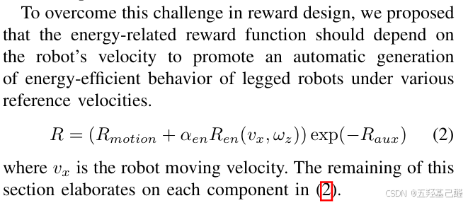
> 
> 

#### aer_env.py

在go2_demo下新建py文件source\go2_demo\go2_demo\tasks\manager_based\go2_demo\aer_env.py：

 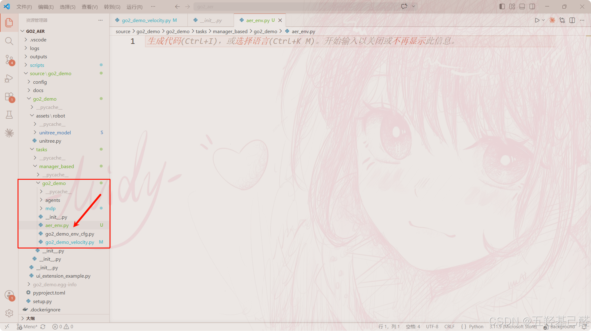

```python
from __future__ import annotations
 
import torch
 
from isaaclab.envs import ManagerBasedRLEnv
from isaaclab.managers import CommandManager, CurriculumManager, RewardManager, TerminationManager
 
# 继承自RewardManager，并重写了奖励组合方法compute
class AERRewardManager(RewardManager):
    positive_terms = {"track_lin_vel_xy", "track_ang_vel_z", "energy_new_actual"}
    sigma_aux = 0.2
 
    def compute(self, dt: float) -> torch.Tensor:
        self._reward_buf[:] = 0.0
        positive_reward = torch.zeros_like(self._reward_buf)
        negative_reward = torch.zeros_like(self._reward_buf)
        for term_idx, (name, term_cfg) in enumerate(zip(self._term_names, self._term_cfgs)):
            if term_cfg.weight == 0.0:
                self._step_reward[:, term_idx] = 0.0
                continue
 
            value = term_cfg.func(self._env, **term_cfg.params) * term_cfg.weight
            self._episode_sums[name] += value * dt
            self._step_reward[:, term_idx] = value
 
            if name in self.positive_terms:
                positive_reward += value
            else:
                negative_reward += value
 
        self._reward_buf[:] = positive_reward * torch.exp(negative_reward / self.sigma_aux) * dt
        return self._reward_buf
 
# 继承自ManagerBasedRLEnv，相比官方示例替换了奖励管理类
class AERManagerBasedRLEnv(ManagerBasedRLEnv):
    def load_managers(self):
        # note: this order is important since observation manager needs to know the command and action managers
        # and the reward manager needs to know the termination manager
        # -- command manager
        self.command_manager: CommandManager = CommandManager(self.cfg.commands, self)
        print("[INFO] Command Manager: ", self.command_manager)
 
        # call the parent class to load the managers for observations and actions.
        super().load_managers()
 
        # prepare the managers
        # -- termination manager
        self.termination_manager = TerminationManager(self.cfg.terminations, self)
        print("[INFO] Termination Manager: ", self.termination_manager)
        # -- reward manager
        # 替换成我们自定义的奖励管理类
        self.reward_manager = AERRewardManager(self.cfg.rewards, self)
        print("[INFO] Reward Manager: ", self.reward_manager)
        # -- curriculum manager
        self.curriculum_manager = CurriculumManager(self.cfg.curriculum, self)
        print("[INFO] Curriculum Manager: ", self.curriculum_manager)
 
        # setup the action and observation spaces for Gym
        self._configure_gym_env_spaces()
 
        # perform events at the start of the simulation
        if "startup" in self.event_manager.available_modes:
            self.event_manager.apply(mode="startup")
```

#### go2_demo\__init__.py

最后定位到与go2_demo_velocity.py同目录下的__init__.py文件中，把其中的entry_point替换成我们写好的环境：

 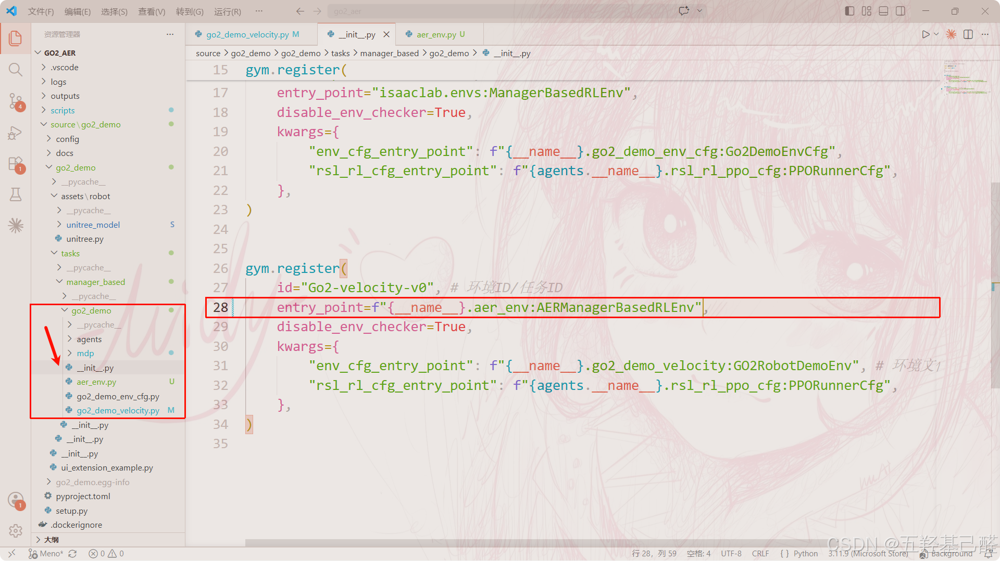

```python
gym.register(
    id="Go2-velocity-v0", # 环境ID/任务ID
    entry_point=f"{__name__}.aer_env:AERManagerBasedRLEnv", # 替换为我们自定义环境
    disable_env_checker=True,
    kwargs={
        "env_cfg_entry_point": f"{__name__}.go2_demo_velocity:GO2RobotDemoEnv", # 环境文件名:环境类名
        "rsl_rl_cfg_entry_point": f"{agents.__name__}.rsl_rl_ppo_cfg:PPORunnerCfg",
    },
)
```

### 课程学习

> **课程学习（Curriculum Learning）** 用于动态调整任务难度，使策略从简单条件逐步过渡到复杂条件。在代码中， **`CurriculumManager`** 负责实现这一机制（例如根据平均奖励阈值扩大速度采样边界）。

#### mdp\commands.py & mdp\curriculums.py

在mdp目录下新建两个py文件curriculums.py以及commands.py：

 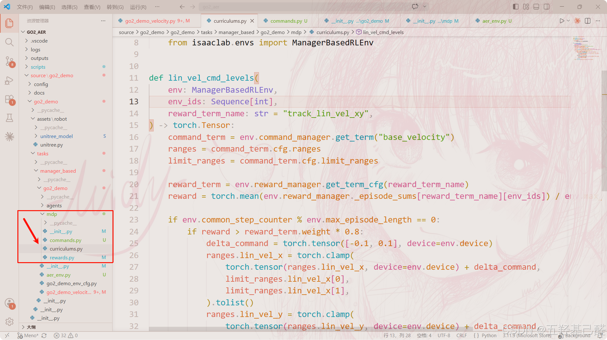

```python
# curriculums.py
from __future__ import annotations
 
import torch
from collections.abc import Sequence
from typing import TYPE_CHECKING
 
if TYPE_CHECKING:
    from isaaclab.envs import ManagerBasedRLEnv
 
 
def lin_vel_cmd_levels(
    env: ManagerBasedRLEnv,
    env_ids: Sequence[int],
    reward_term_name: str = "track_lin_vel_xy",
) -> torch.Tensor:
    command_term = env.command_manager.get_term("base_velocity")
    ranges = command_term.cfg.ranges
    limit_ranges = command_term.cfg.limit_ranges
 
    reward_term = env.reward_manager.get_term_cfg(reward_term_name)
    reward = torch.mean(env.reward_manager._episode_sums[reward_term_name][env_ids]) / env.max_episode_length_s
 
    if env.common_step_counter % env.max_episode_length == 0:
        if reward > reward_term.weight * 0.8:
            delta_command = torch.tensor([-0.1, 0.1], device=env.device)
            ranges.lin_vel_x = torch.clamp(
                torch.tensor(ranges.lin_vel_x, device=env.device) + delta_command,
                limit_ranges.lin_vel_x[0],
                limit_ranges.lin_vel_x[1],
            ).tolist()
            ranges.lin_vel_y = torch.clamp(
                torch.tensor(ranges.lin_vel_y, device=env.device) + delta_command,
                limit_ranges.lin_vel_y[0],
                limit_ranges.lin_vel_y[1],
            ).tolist()
 
    return torch.tensor(ranges.lin_vel_x[1], device=env.device)
```

```python
# commands.py
from __future__ import annotations
 
from dataclasses import MISSING
 
from isaaclab.envs.mdp import UniformVelocityCommandCfg
from isaaclab.utils import configclass
 
 
@configclass
class UniformLevelVelocityCommandCfg(UniformVelocityCommandCfg):
    limit_ranges: UniformVelocityCommandCfg.Ranges = MISSING
```

### 导包收尾

####  **mdp\__init__.py** 

在 **mdp目录下的__init__.py** 中导入包：

 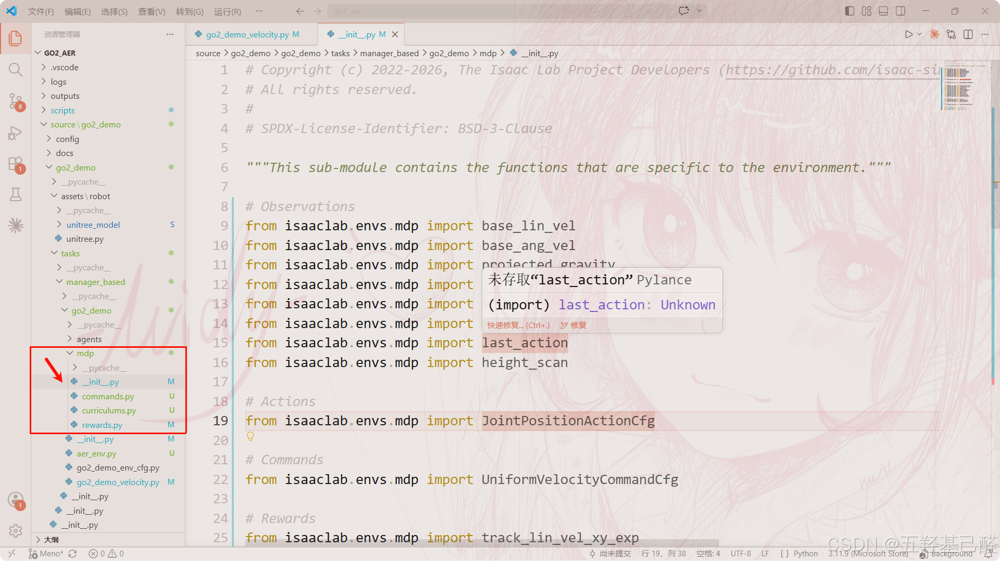

```python
# Copyright (c) 2022-2026, The Isaac Lab Project Developers (https://github.com/isaac-sim/IsaacLab/blob/main/CONTRIBUTORS.md).
# All rights reserved.
#
# SPDX-License-Identifier: BSD-3-Clause
 
"""This sub-module contains the functions that are specific to the environment."""
 
# Observations
from isaaclab.envs.mdp import base_lin_vel
from isaaclab.envs.mdp import base_ang_vel
from isaaclab.envs.mdp import projected_gravity
from isaaclab.envs.mdp import generated_commands
from isaaclab.envs.mdp import joint_pos_rel
from isaaclab.envs.mdp import joint_vel_rel
from isaaclab.envs.mdp import last_action
from isaaclab.envs.mdp import height_scan
 
# Actions
from isaaclab.envs.mdp import JointPositionActionCfg
 
# Commands
from isaaclab.envs.mdp import UniformVelocityCommandCfg
 
# Rewards
from isaaclab.envs.mdp import track_lin_vel_xy_exp
from isaaclab.envs.mdp import track_ang_vel_z_exp
from isaaclab.envs.mdp import lin_vel_z_l2
from isaaclab.envs.mdp import ang_vel_xy_l2
from isaaclab.envs.mdp import flat_orientation_l2
from isaaclab.envs.mdp import joint_torques_l2
from isaaclab.envs.mdp import joint_vel_l2
from isaaclab.envs.mdp import joint_acc_l2
from isaaclab.envs.mdp import action_rate_l2
from isaaclab.envs.mdp import joint_pos_limits
from isaaclab.envs.mdp import undesired_contacts
 
# Terminations
from isaaclab.envs.mdp import time_out
from isaaclab.envs.mdp import illegal_contact
from isaaclab.envs.mdp import bad_orientation
 
# Events
from isaaclab.envs.mdp import reset_root_state_uniform
 
# Custom modules
from .curriculums import *  # noqa: F401
from .commands import *  # noqa: F401, F403
from .rewards import *  # noqa: F401, F403
```

#### go2_demo_velocity.py

在go2_demo_velocity.py中导入包：

 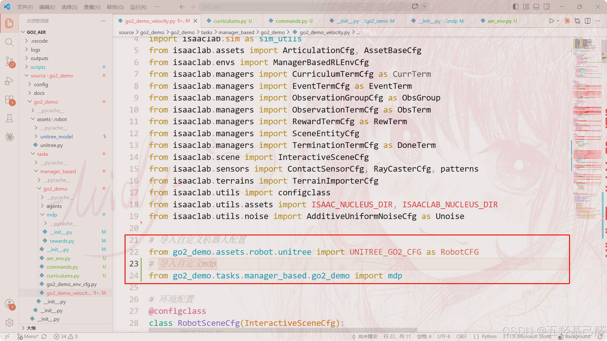

并将课程学习部分添加进去：

 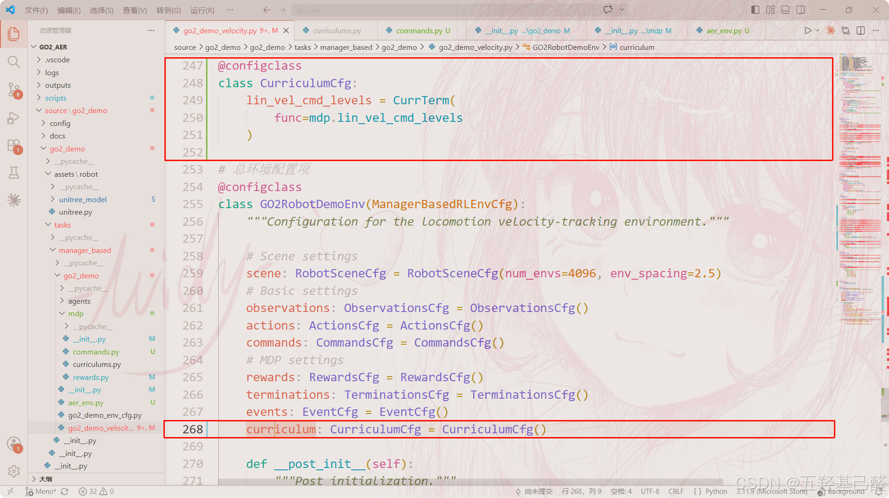

```python
# go2_demo_velocity.py
import math
from dataclasses import MISSING
 
import isaaclab.sim as sim_utils
from isaaclab.assets import ArticulationCfg, AssetBaseCfg
from isaaclab.envs import ManagerBasedRLEnvCfg
from isaaclab.managers import CurriculumTermCfg as CurrTerm
from isaaclab.managers import EventTermCfg as EventTerm
from isaaclab.managers import ObservationGroupCfg as ObsGroup
from isaaclab.managers import ObservationTermCfg as ObsTerm
from isaaclab.managers import RewardTermCfg as RewTerm
from isaaclab.managers import SceneEntityCfg
from isaaclab.managers import TerminationTermCfg as DoneTerm
from isaaclab.scene import InteractiveSceneCfg
from isaaclab.sensors import ContactSensorCfg, RayCasterCfg, patterns
from isaaclab.terrains import TerrainImporterCfg
from isaaclab.utils import configclass
from isaaclab.utils.assets import ISAAC_NUCLEUS_DIR, ISAACLAB_NUCLEUS_DIR
from isaaclab.utils.noise import AdditiveUniformNoiseCfg as Unoise
 
'''
中间代码不变，省略...
'''
 
@configclass
class CurriculumCfg:
    lin_vel_cmd_levels = CurrTerm(
        func=mdp.lin_vel_cmd_levels
    )
 
# 总环境配置项
@configclass
class GO2RobotDemoEnv(ManagerBasedRLEnvCfg):
    """Configuration for the locomotion velocity-tracking environment."""
 
    # Scene settings
    scene: RobotSceneCfg = RobotSceneCfg(num_envs=4096, env_spacing=2.5)
    # Basic settings
    observations: ObservationsCfg = ObservationsCfg()
    actions: ActionsCfg = ActionsCfg()
    commands: CommandsCfg = CommandsCfg()
    # MDP settings
    rewards: RewardsCfg = RewardsCfg()
    terminations: TerminationsCfg = TerminationsCfg()
    events: EventCfg = EventCfg()
    curriculum: CurriculumCfg = CurriculumCfg()
 
    def __post_init__(self):
        """Post initialization."""
        # general settings
        self.decimation = 4
        self.episode_length_s = 20.0
        # simulation settings
        self.sim.dt = 0.005
        self.sim.render_interval = self.decimation
        self.sim.physics_material = self.scene.terrain.physics_material
        self.sim.physx.gpu_max_rigid_patch_count = 10 * 2**15
        # update sensor update periods
        # we tick all the sensors based on the smallest update period (physics update period)
        if self.scene.height_scanner is not None:
            self.scene.height_scanner.update_period = self.decimation * self.sim.dt
        if self.scene.contact_forces is not None:
            self.scene.contact_forces.update_period = self.sim.dt
 
        # check if terrain levels curriculum is enabled - if so, enable curriculum for terrain generator
        # this generates terrains with increasing difficulty and is useful for training
        if getattr(self.curriculum, "terrain_levels", None) is not None:
            if self.scene.terrain.terrain_generator is not None:
                self.scene.terrain.terrain_generator.curriculum = True
        else:
            if self.scene.terrain.terrain_generator is not None:
                self.scene.terrain.terrain_generator.curriculum = False
```

## 三.训练与评估

### 训练

运行训练脚本：

```bash
python scripts\rsl_rl\train.py --task Go2-velocity-v0 --max_iterations 3000 --num_envs 400 --video --headless
```

如下训练成功：

 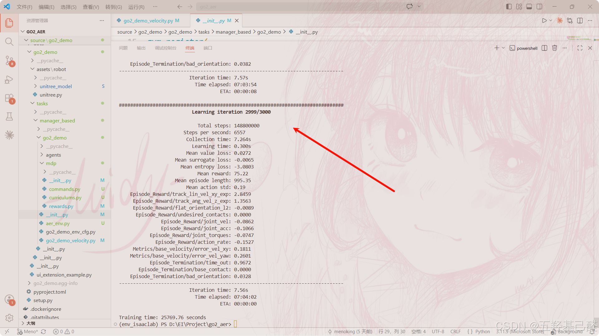

### 评估

```bash
python scripts\rsl_rl\play.py --task Go2-velocity-v0 --num_envs 16
```

可见机器人的步态还是相当稳定的：

 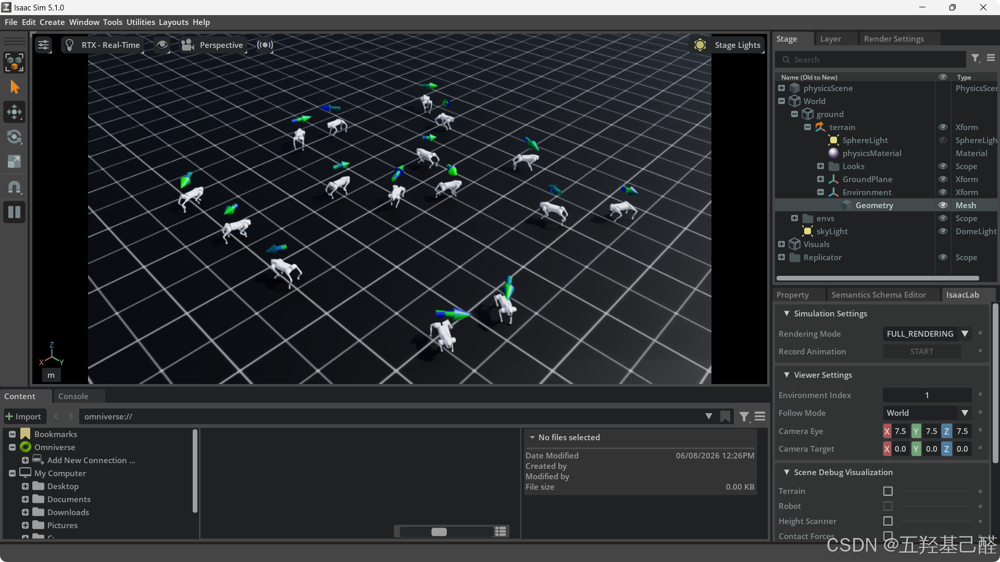

## 四.总结

> 再次感谢哔哩哔哩@ [猫猫烤肉师傅](https://space.bilibili.com/31458263/?spm_id_from=333.788.upinfo.detail.click) 的免费教程： [【Lesson3上】复现ICRA顶会论文：不预设步态，让机器狗学会自适应行走（理论部分）_哔哩哔哩_bilibili](https://www.bilibili.com/video/BV1wQLJ6PEFz?spm_id_from=333.788.videopod.sections&vd_source=60b7e4846ff8eebbaf6efd46ab66b45a) 

笔者按照猫老师的教程复现第一篇顶会，在此记录，并对细节进行补充。

如有错误，欢迎指正。