# 【Robotics】半小时入门具身智能之手动创建第一个项目

> 原创 已于 2026-06-03 00:33:30 修改 · 粉丝可见 · 1k 阅读 · 26 · 6 · 本内容遵循CC 4.0 BY-SA版权协议 版权声明：本文为博主原创文章，遵循 CC 4.0 BY 版权协议，转载请附上原文出处链接和本声明。 GEO检测 · 编辑
> 文章链接：https://menoking.blog.csdn.net/article/details/161546327

**目录**

[TOC]


## 零.前置说明

本贴完成了从如何创建一个新的IsaacSim仿真项目，到完成基本的项目配置（MDP配置、机器人模型配置、Gym接口注册），再到训练、验证及可视化，最后完成策略优化的闭环流程。

为初学者提供了第一篇零基础具身智能入门贴。

帖子所涉及的整个Demo已上传至Github： [menoking/Go2-Demo: The first demo project based on Unitree Go2 when author learn Embodied Intelligence.](https://github.com/menoking/Go2-Demo) 

> 本贴参考了猫师傅的教程： [【Lesson2上】米雪儿教你从零开始编写Isaaclab强化学习环境_哔哩哔哩_bilibili](https://www.bilibili.com/video/BV1LwQ7BiEW9/?spm_id_from=333.788.videopod.sections&vd_source=60b7e4846ff8eebbaf6efd46ab66b45a) 
> 
> 以及官方文档： [Quickstart Guide — Isaac Lab Documentation](https://isaac-sim.github.io/IsaacLab/main/source/setup/quickstart.html) 

## 一.基础知识

### 基础扫盲

> 强化学习RL：通过让智能体(Agent)与环境(Environment)交互，学习出能够最大化累积奖励(Cumulative Reward)的策略(Policy)。
> 
> - 智能体Agent
> 
> - 奖励Award
> 
> - 环境Environment
> 
> - 策略Policy
> 
>  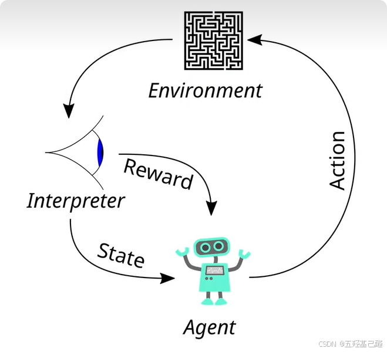
> 
> 

### 领域术语

> 机器人领域的一些文件格式：
> 
> - **USD** ：皮克斯开发的通用场景描述框架，以分层、非破坏式编辑为核心，是 Isaac Sim 的原生格式，支持复杂材质、动画和大规模场景合成。
> 
> - **URDF** ：基于 XML 的机器人描述格式，定义连杆、关节、运动学和动力学属性，是 ROS 生态中机器人的标准表示。
> 
> - **SDF** ：Gazebo 专用的仿真描述格式，能完整描述整个世界（多机器人、地形、传感器、灯光等），比 URDF 更强大。
> 
> - **MJCF** ：MuJoCo 物理引擎的原生 XML 格式，描述紧凑、接触建模高效，广泛用于高频控制和足式机器人仿真。
> 
> - **XACRO** ：URDF 的宏语言扩展，支持参数化、模块化生成 URDF 文件，用于避免重复代码。
> 
> - **STL / OBJ / COLLADA (DAE)** ：仅用于存储 3D 网格几何数据的静态格式，不包含运动学或动力学信息，常被 URDF/USD 作为视觉或碰撞网格引用。
> 
> - **GLTF / GLB** ：面向实时渲染和 Web 传输的 3D 格式，集成了网格、材质、动画和皮肤，在图形交换中越来越普及。
> 
> 

> **MDP：马尔可夫决策过程（Markov Decision Process）** 。它是强化学习问题形式化的数学基础，也是 Isaac Lab 中每个环境（ `Env` ）核心逻辑的设计依据。
> 
> - 在 Manager-based 中，MDP 的各部分被拆解为独立的配置模块：
> 
>   - **Observation Manager** ：定义如何从物理状态映射到观测。
> 
>   - **Action Manager** ：定义动作空间及映射到实际控制量。
> 
>   - **Reward Manager** ：累加多个奖励项。
> 
>   - **Termination Manager** ：判断任务失败/成功条件。
> 
> - 在 Direct 工作流中
> 
>   - 直接覆写 `_get_observations()` , `_get_rewards()` , `_get_done_terminations()` 等方法。
> 
> 

## 二.项目创建与配置

### 创建项目

键入以下命令

```bash
isaaclab.bat -n
```

新建项目，进入配置页面：

> **！这里注意上下箭头移动，空格选中，回车确认！** 

 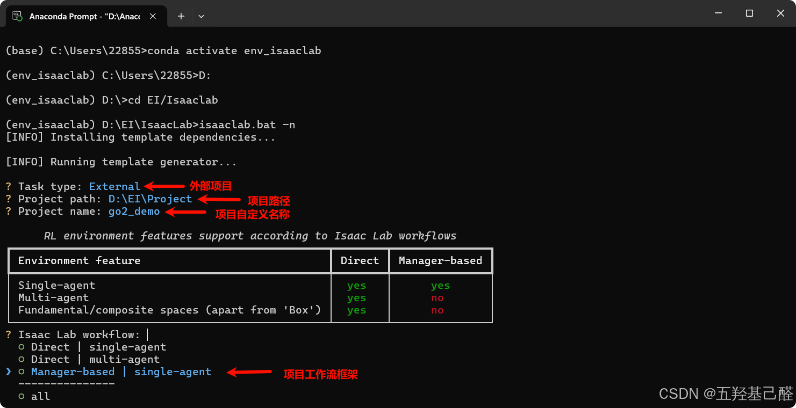

> 工作流框
> 
> - Manager-based： **声明式** 框架，官方推荐主流框架，模块化结构化，适合复杂任务、快速原型开发和团队协作。
> 
> - Direct ： **命令式** 框架，直接灵活自由度高，个性化，适合简单精细任务。
> 
> 

 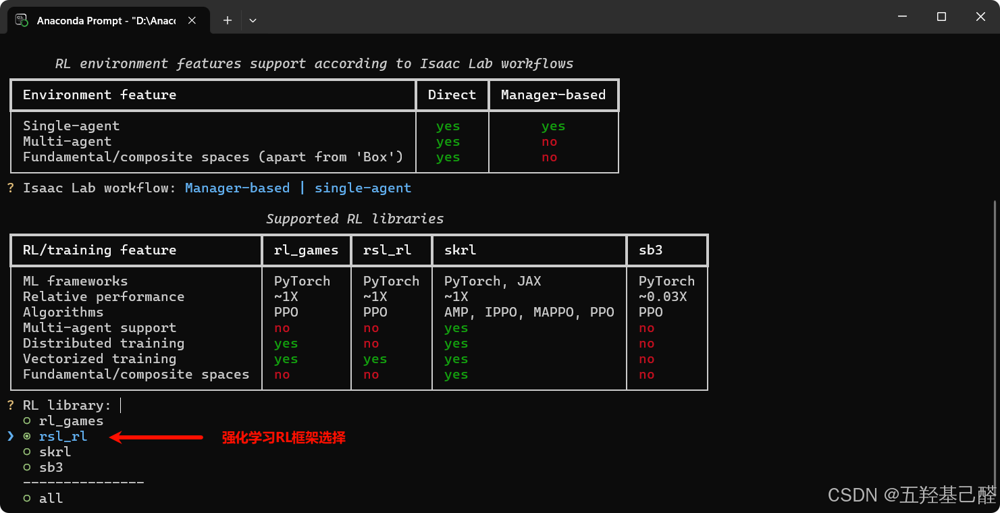

> 强化学习RL框架
> 
> - **rsl-rl** ：简单、专注且高效。追求在机器人（尤其是足式机器人）任务中快速验证并取得好结果的 **首选方案** 。它由ETH Zurich研发，核心理念是"提供紧凑且易于修改的代码库"。
> 
> - **SKRL (Skrl)** ：灵活多样的"瑞士军刀"。提供PPO、SAC等丰富算法库，适合快速横向对比研究。
> 
> - **RL Games** ：工业级"性能猛兽"。训练效率和稳定性极佳，适合超长时间大规模训练任务。
> 
> 

创建成功如图：

 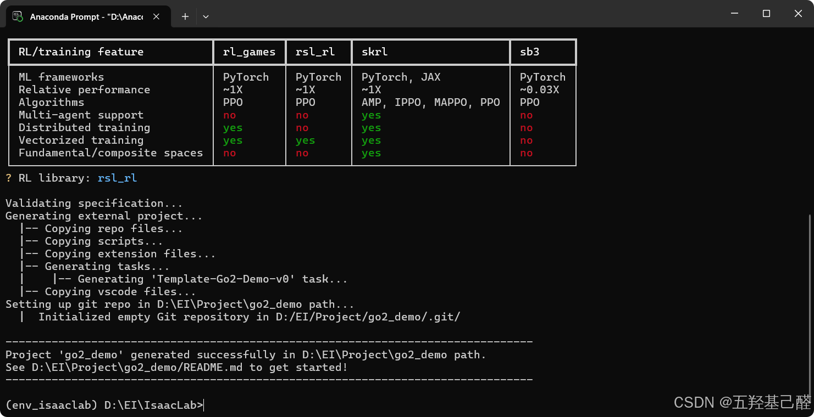

运行以下命令，注意后面的<given-project-name>替换成自己的项目名称：

```bash
python -m pip install -e source/<given-project-name>
```

> 这条命令的作用：
> 
> 1. **安装基础环境** ：它确保你的Python环境能够识别和导入Isaac Lab的核心功能。
> 
> 2. **注册自定义扩展** ： **以“可编辑”模式安装了你指定的项目扩展（例如 `source/your_extension` ）** 。这样一来，你对项目代码的任何修改都能立即生效，无需重新安装，非常便于开发。
> 
> 

如下图，新建任务成功：

 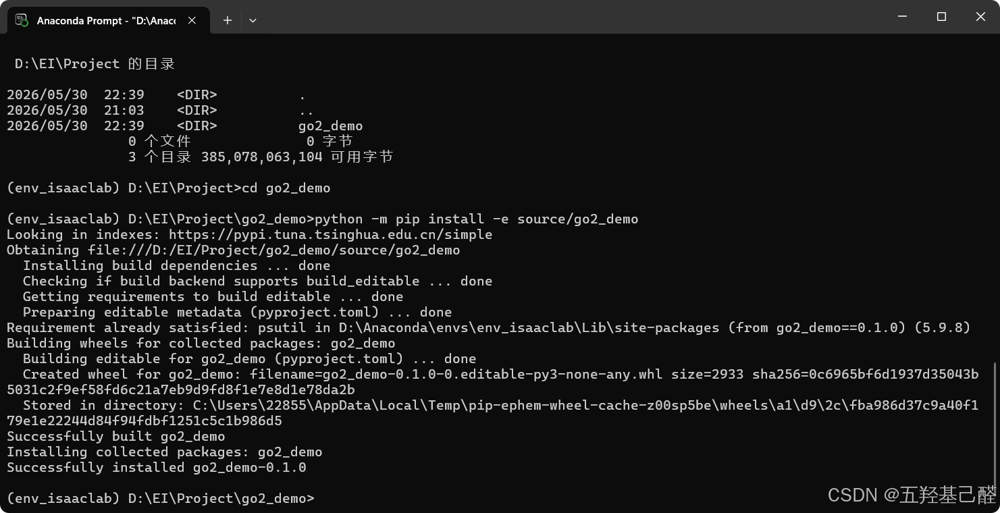

用VS Code打开项目后可观察到项目目录：

 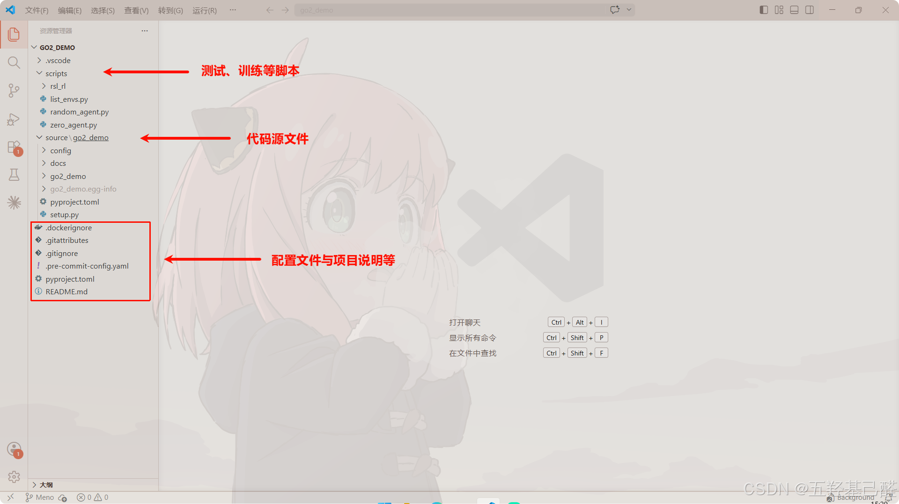

> **本项目所用到的Manager-based架构** 
> 
>  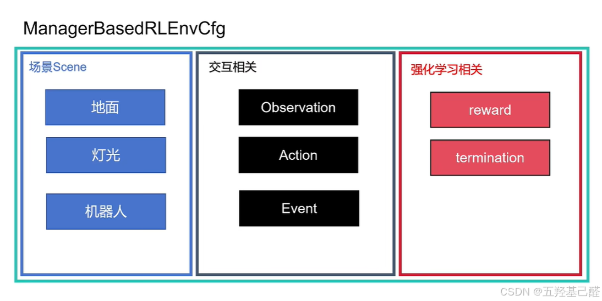
> 
> 

> **官方模板** 
> 
> 一般来说使用官方模板进行修改以完成自己的任务。
> 
> 访问官方模板： [Available Environments — Isaac Lab Documentation](https://isaac-sim.github.io/IsaacLab/main/source/overview/environments.html#) 
> 
>  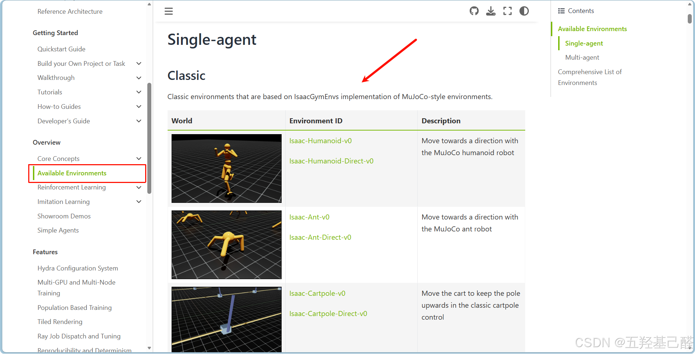
> 
> 

### 手动搭建

#### 官方示例与仓库

以下两个官方源可提前打开，其中使用的机器人文件来源是unitreerobotics/unitree_rl_lab项目，官方模板参考的是IsaacLab中的velocity_env_cfg.py文件，后续配置会用到。

##### IsaacLab官方示例

进入官方示例： [IsaacLab/source/isaaclab_tasks/isaaclab_tasks/manager_based/locomotion/velocity/velocity_env_cfg.py at main · isaac-sim/IsaacLab](https://github.com/isaac-sim/IsaacLab/blob/main/source/isaaclab_tasks/isaaclab_tasks/manager_based/locomotion/velocity/velocity_env_cfg.py) 

接下来我们下列代码（ **一个基于管理器工作流Manager-based的四足机器人速度追踪训练环境的完整配置文件，定义了宇树 Go2 机器人在复杂地形上学习奔跑的强化学习任务** ）作示例进行改写：

 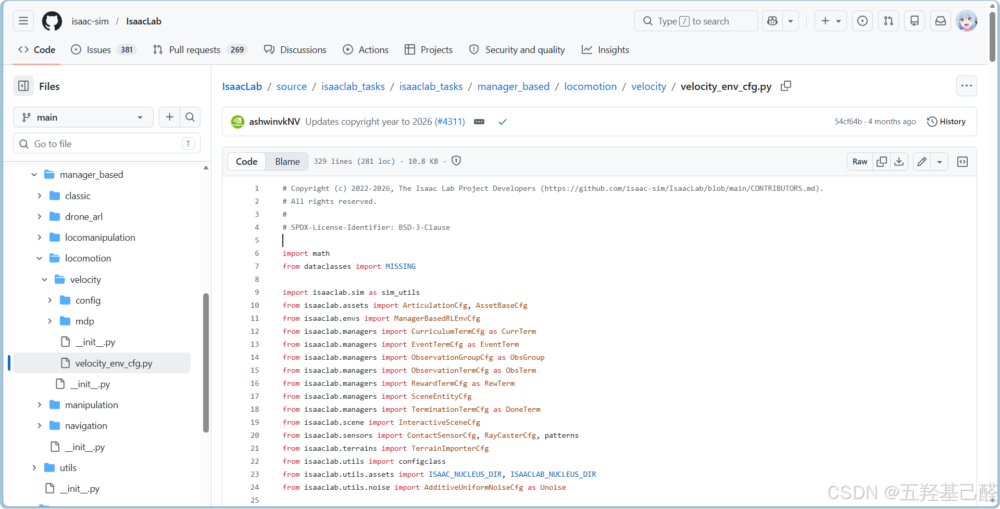

> 上述示例代码的| 代码块 | 对应 MDP 要素 | 具体内容与作用 |
> |:---:|:---:|:---:|
> | `MySceneCfg` | 场景与环境 | 包含带纹理的 **粗糙地形** （ `ROUGH_TERRAINS_CFG` ）、Go2 机器人（引用外部定义）、 **射线高度扫描传感器** （感知地形）、 **接触传感器** （检测脚掌/大腿触地）以及天空光照。 |
> | `CommandsCfg` | 高层指令（任务目标） | 生成 **随机线速度命令** `(vx, vy)` 和 **朝向角速度命令** ( `ang_vel_z` )，机器人需要追踪这个动态变化的指令。这就是“速度追踪任务”的核心。 |
> | `ActionsCfg` | 动作空间 | 输出 **目标关节位置** （ `JointPositionActionCfg` ），范围缩放 0.5，使用默认偏移量（即机器人站立时的关节角度）。 |
> | `ObservationsCfg` | 观测状态 (S) | 定义策略网络 ( `PolicyCfg` ) 的输入数据，共7项： **机体线速度/角速度、投影重力、速度命令、关节相对位置/速度、上一次动作、地形高度扫描** 。并对每项添加了均匀噪声（模拟传感器噪声）。 |
> | `EventCfg` | 域随机化与初始化 | 分为三类：<br/>**startup** （启动时一次）：随机化物理材质、增加机身质量、改变质心位置。<br/>**reset** （每个 episode 重置时）：随机重置机器人根部位姿、关节位置/速度。<br/>**interval** （训练中周期触发）：以随机时间间隔用力推机器人（提高抗干扰能力）。 |
> | `RewardsCfg` | 奖励函数 (R) | 由 **正向奖励** （速度追踪误差的指数奖励，线速度权重1.0，角速度权重0.5）和 **多项惩罚** 组成：<br/>惩罚竖向线速度、横向/俯仰角速度、关节力矩/加速度、动作变化率；<br/>奖励脚掌离地时间（鼓励奔跑步态）；<br/>惩罚大腿非预期接触地面。 |
> | `TerminationsCfg` | 终止条件 | **超时** （ `time_out` ，步数达到 `episode_length_s / dt` ）和 **机身触地** （ `base_contact` ，检测到机身接触即认为失败）。 |
> | `CurriculumCfg` | 课程学习 | 根据机器人追踪速度的表现，自动提升地形难度等级（ `terrain_levels_vel` ）。 |
> | `LocomotionVelocityRoughEnvCfg` | 总配置类 | 将上述所有模块组合，并设置 **仿真参数** ：<br/>`decimation=4` （动作每4个仿真步执行一次，即控制频率50Hz，仿真频率200Hz）；<br/>`episode_length_s=20.0` （每个 episode 最长20秒）。 |

然后在VS Code中打开我们新建的项目，定位到go2_demo_env_cfg.py这个Manager-based项目配置文件，并在同目录下新建一个配置文件，名字可自取，这里新建为go2_demo_velocity.py：

 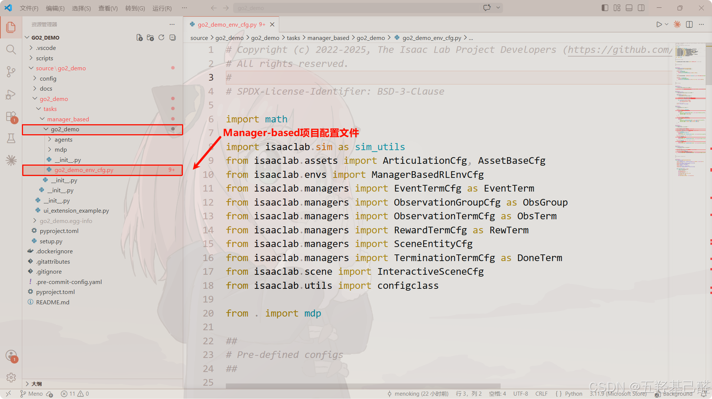

 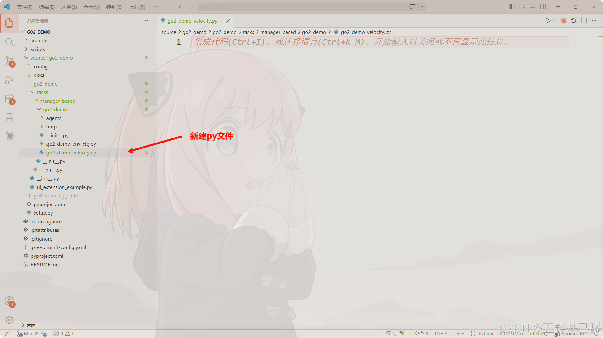

##### Unitree宇树官方仓库

在 [Unitree Robotics](https://github.com/unitreerobotics/) 中可以找到 [unitreerobotics/unitree_rl_lab: This is a repository for reinforcement learning implementation for Unitree robots, based on IsaacLab.](https://github.com/unitreerobotics/unitree_rl_lab) 

为强化学习专用环境仓库：

 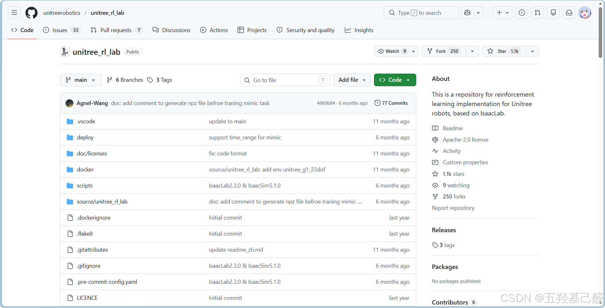

#### 基本配置

现在新建py配置文件中导入下列包：

 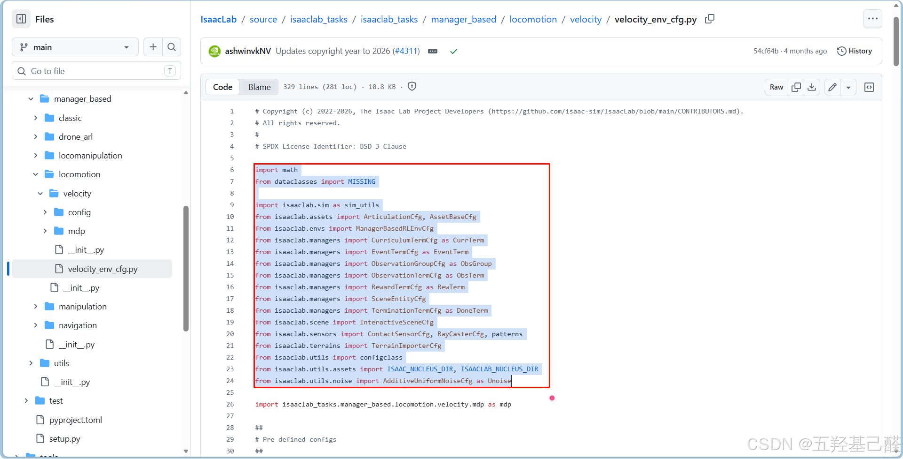

​

 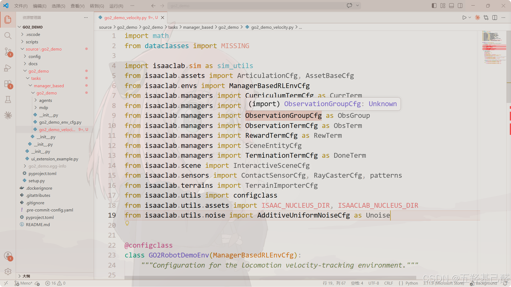

​

再复制 `LocomotionVelocityRoughEnvCfg总配置类到我们自定义的py文件中：` 

 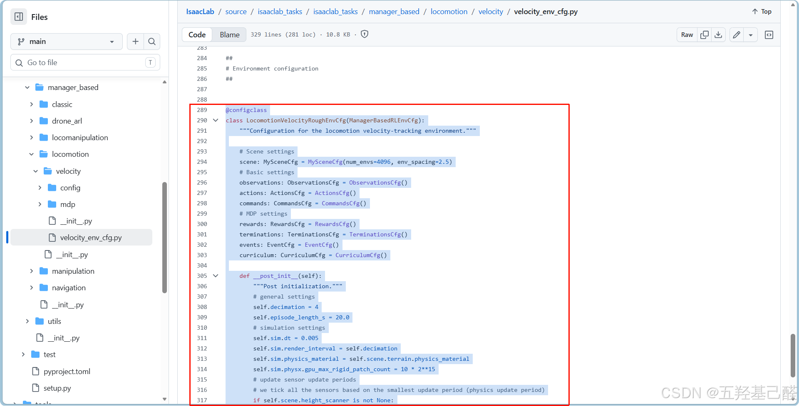

​

把类名修改成自定义名称，这里改为GO2RobotDemoEnv：

 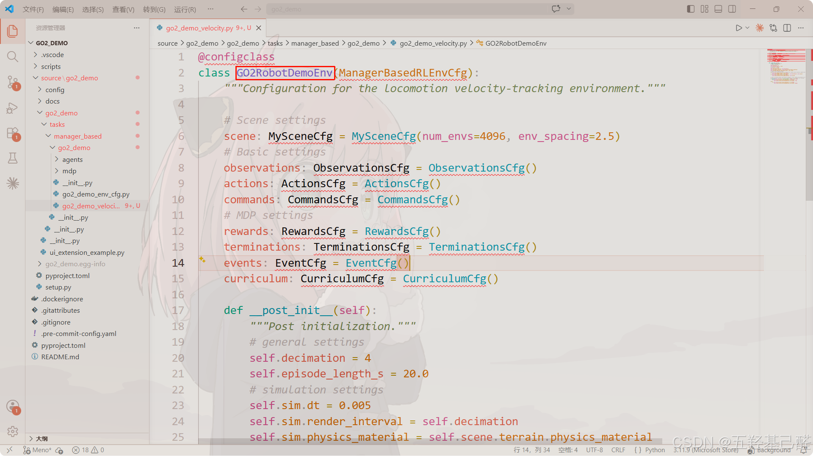

​

#### MDP类配置

> **！注意以下所配置的几个MDP要素的每个参数都能在IsaacLab官方文档中搜索到查看释义与用法！** 

上面我们能观察到总配置类中几个基本MDP要素还没有定义，因此接下来我们要逐项定义场景、观测、奖励等等。

##### 场景配置类scene

构建包含地形、机器人和传感器的虚拟环境。

参照官方例程自定义类，可自定义类名，这里取为RobotSceneCfg：

 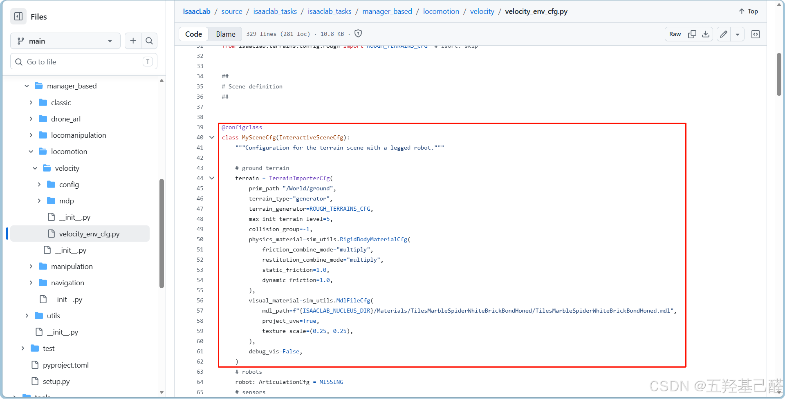

​

这里机器人部分先填缺省值，等后续导入：

 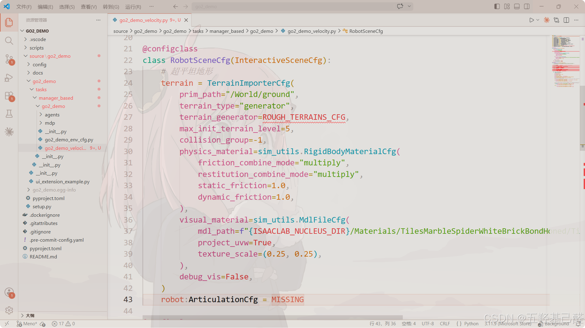

​

```python
# 环境配置
@configclass
class RobotSceneCfg(InteractiveSceneCfg):
    # 超平坦地形
    terrain = TerrainImporterCfg(
        prim_path="/World/ground",
        terrain_type="plane",
        collision_group=-1,
        physics_material=sim_utils.RigidBodyMaterialCfg(
            friction_combine_mode="multiply",
            restitution_combine_mode="multiply",
            static_friction=1.0,
            dynamic_friction=1.0,
        ),
        visual_material=sim_utils.MdlFileCfg(
            mdl_path=f"{ISAACLAB_NUCLEUS_DIR}/Materials/TilesMarbleSpiderWhiteBrickBondHoned/TilesMarbleSpiderWhiteBrickBondHoned.mdl",
            project_uvw=True,
            texture_scale=(0.25, 0.25),
        ),
        debug_vis=False,
    )
 
    robot:ArticulationCfg = RobotCFG.replace(prim_path="{ENV_REGEX_NS}/Robot")
```


###### 克隆 **Go2** 宇树官方USD文件

进入前面提到的宇树强化学习仓库，克隆下来USD文件：

```bash
git clone https://huggingface.co/datasets/unitreerobotics/unitree_model
```

 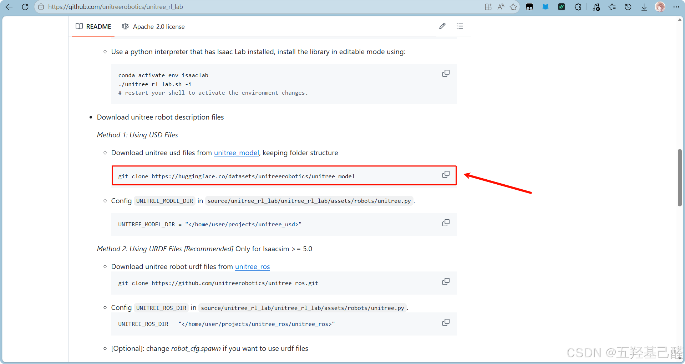

​

新建assets\robot目录（ **注意：assets要和task同根目录** ），在此目录下克隆：

 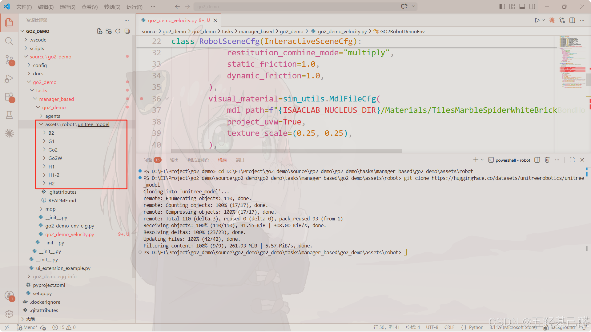

 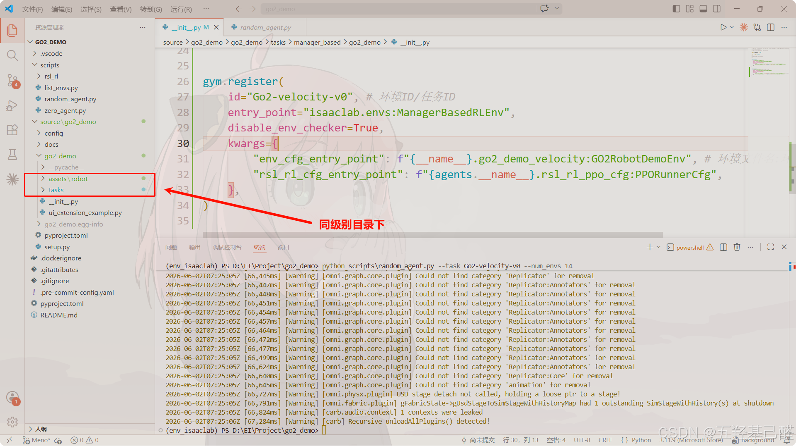

同时在此目录（assets\robot）下新建unitree.py文件对模型进行配置：

 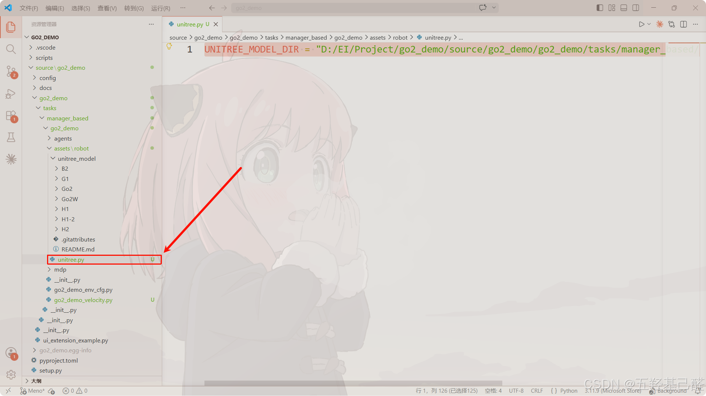

来到宇树强化学习仓库中以官方Unitree.py脚本作为示例，导入所需包以及定义模型路径（注意脚本里路径应用正斜杠"/"）：

```python
UNITREE_MODEL_DIR = "Your Path"
```

 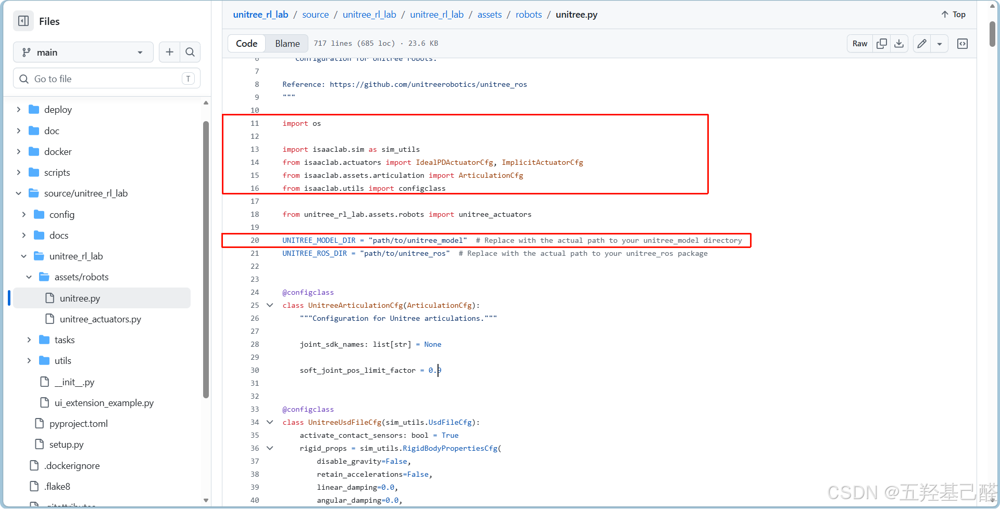

 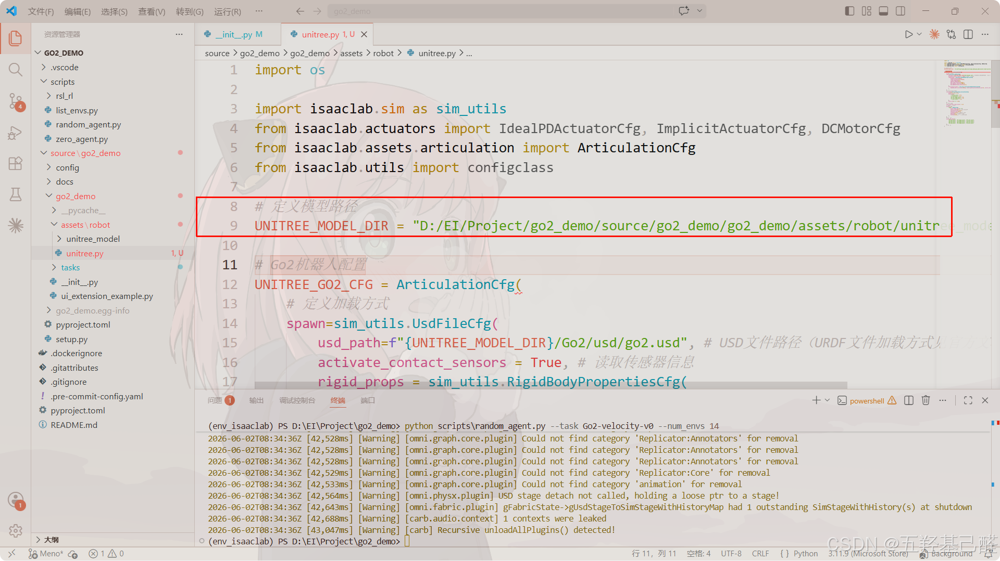

找到GO2的配置代码复制到自己的脚本里，稍作修改：

```python
import os
 
import isaaclab.sim as sim_utils
from isaaclab.actuators import IdealPDActuatorCfg, ImplicitActuatorCfg, DCMotorCfg
from isaaclab.assets.articulation import ArticulationCfg
from isaaclab.utils import configclass
 
# 定义模型路径
UNITREE_MODEL_DIR = "D:/EI/Project/go2_demo/source/go2_demo/go2_demo/assets/robot/unitree_model"
 
# Go2机器人配置
UNITREE_GO2_CFG = ArticulationCfg(
    # 定义加载方式
    spawn=sim_utils.UsdFileCfg(
        usd_path=f"{UNITREE_MODEL_DIR}/Go2/usd/go2.usd", # USD文件路径（URDF文件加载方式见官方文档）
        activate_contact_sensors = True, # 读取传感器信息
        rigid_props = sim_utils.RigidBodyPropertiesCfg(
            disable_gravity=False,
            retain_accelerations=False,
            linear_damping=0.0,
            angular_damping=0.0,
            max_linear_velocity=1000.0,
            max_angular_velocity=1000.0,
            max_depenetration_velocity=1.0,
        ),
        articulation_props = sim_utils.ArticulationRootPropertiesCfg(
            enabled_self_collisions=False, solver_position_iteration_count=4, solver_velocity_iteration_count=0
        ),
    ),
    # 定义机器人初始状态
    init_state=ArticulationCfg.InitialStateCfg(
        pos=(0.0, 0.0, 0.4),
        joint_pos={
            ".*R_hip_joint": -0.1,
            ".*L_hip_joint": 0.1,
            "F[L,R]_thigh_joint": 0.8,
            "R[L,R]_thigh_joint": 1.0,
            ".*_calf_joint": -1.5,
        },
        joint_vel={".*": 0.0},
    ),
    # 软限位系数
    soft_joint_pos_limit_factor = 0.9
    # 核心：执行器模型
    actuators={
        "legs": DCMotorCfg(
            joint_names_expr=[".*"],
            effort_limit=23.5, # 输出力矩上限
            saturation_effort=23.5,
            velocity_limit=30.0,
            stiffness=25.0, # PD控制中的P
            damping=0.5, # PD控制中的D
            friction=0.01, # 执行器摩擦系数
        ),
    },
)
 
```

 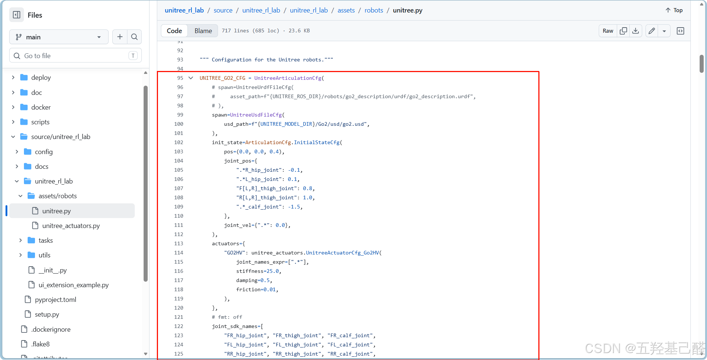

 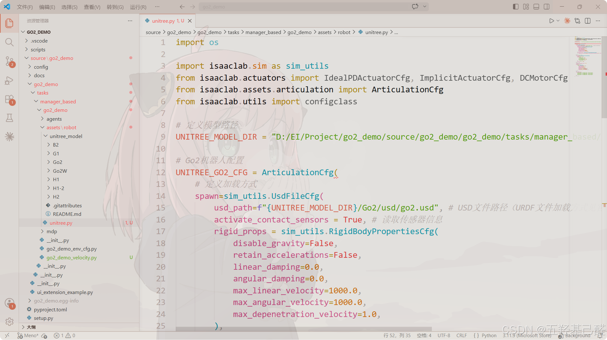

> 
> 
> - 这里把宇树的子类换成对应的父类。 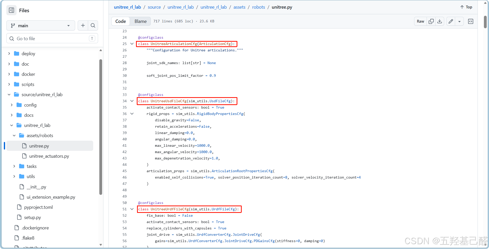
> 
> - 同时可以在IsaacLab中查看对应配置项的参数信息：
> 
>  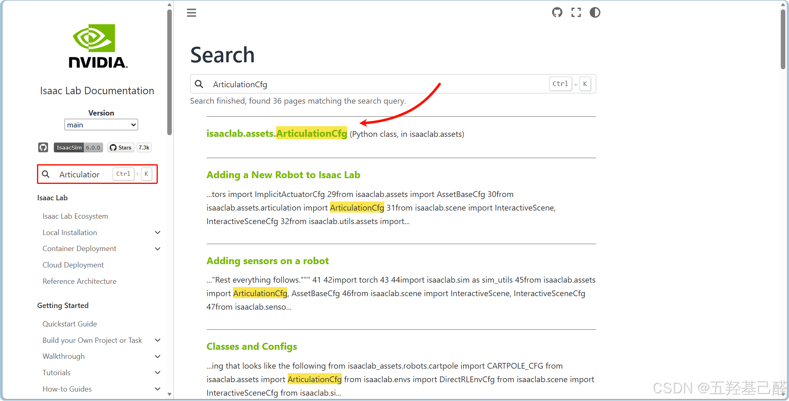
> 
> 

再回到go2_demo_velocity.py导入上述编写好的包：

```python
# 导入自定义机器人配置
from go2_demo.assets.robot.unitree import UNITREE_GO2_CFG as RobotCFG
```

 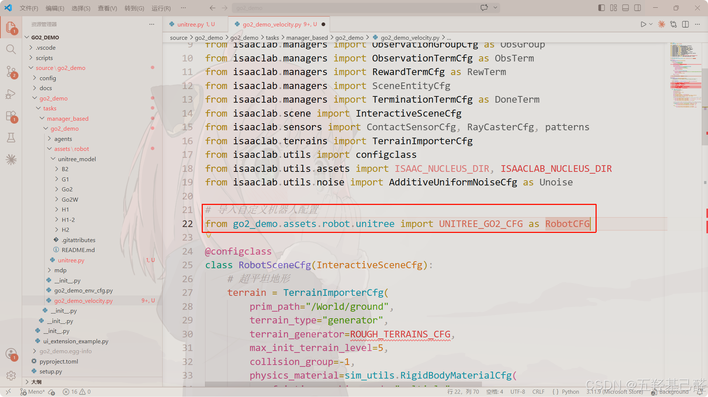

补充机器人信息并按照示例程序添加传感器：

```python
    robot:ArticulationCfg = RobotCFG.replace(prim_path="{ENV_REGEX_NS}/Robot")
 
    # 传感器
    height_scanner = RayCasterCfg(
        prim_path="{ENV_REGEX_NS}/Robot/base",
        offset=RayCasterCfg.OffsetCfg(pos=(0.0, 0.0, 20.0)),
        ray_alignment="yaw",
        pattern_cfg=patterns.GridPatternCfg(resolution=0.1, size=[1.6, 1.0]),
        debug_vis=False,
        mesh_prim_paths=["/World/ground"],
    )
    contact_forces = ContactSensorCfg(prim_path="{ENV_REGEX_NS}/Robot/.*", history_length=3, track_air_time=True)
 
    sky_light = AssetBaseCfg(
        prim_path="/World/skyLight",
        spawn=sim_utils.DomeLightCfg(
            intensity=750.0,
            texture_file=f"{ISAAC_NUCLEUS_DIR}/Materials/Textures/Skies/PolyHaven/kloofendal_43d_clear_puresky_4k.hdr",
        ),
    )
```

 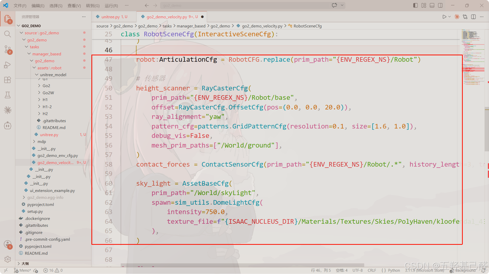

##### 观测配置类observations

定义策略网络可获取的状态信息（如关节角度、速度、地形扫描）。

注意先导入mdp包：
 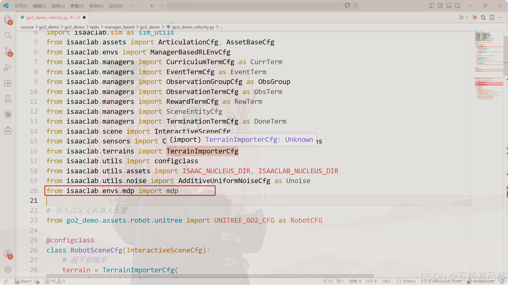

官方示例中的这一部分就是观测项配置：

 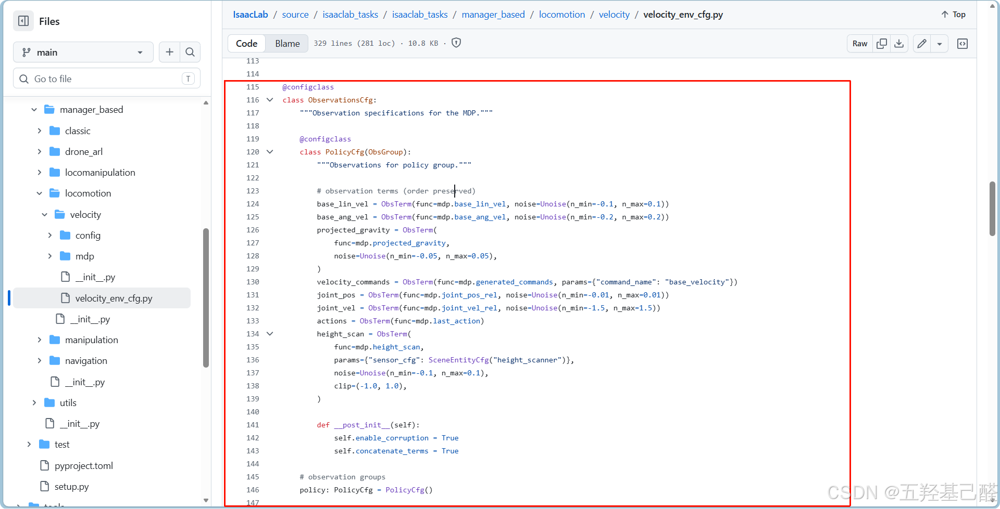

对比官方示例我们先构建出策略网络和评价网络的观测项框架：

 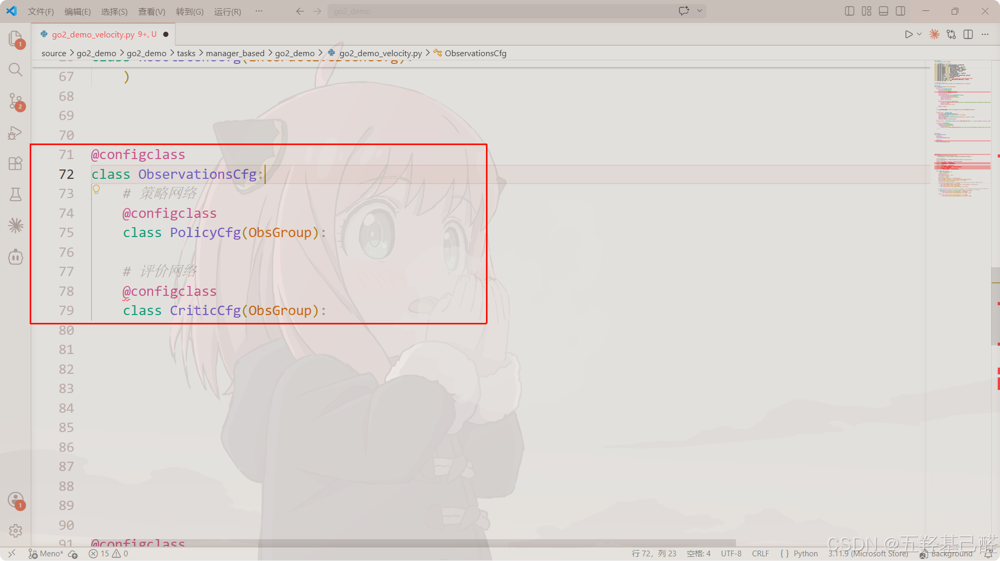

> 官方文档中可以查询已经封装好的观测项：
> 
>  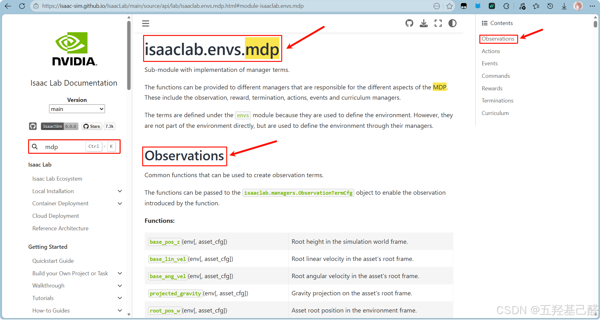
> 
> 

对照示例中的代码：

```python
@configclass
class ObservationsCfg:
    # 策略网络
    @configclass
    class PolicyCfg(ObsGroup):
        """Observations for policy group."""
        # 机体线速度
        base_lin_vel = ObsTerm(func=mdp.base_lin_vel, noise=Unoise(n_min=-0.1, n_max=0.1))
        # 机体角速度
        base_ang_vel = ObsTerm(func=mdp.base_ang_vel, noise=Unoise(n_min=-0.2, n_max=0.2))
        # 投影重力
        projected_gravity = ObsTerm(
            func=mdp.projected_gravity,
            noise=Unoise(n_min=-0.05, n_max=0.05),
        )
        # 速度指令
        velocity_commands = ObsTerm(func=mdp.generated_commands, params={"command_name": "base_velocity"})
        # 关节位置
        joint_pos = ObsTerm(func=mdp.joint_pos_rel, noise=Unoise(n_min=-0.01, n_max=0.01))
        # 关节速度
        joint_vel = ObsTerm(func=mdp.joint_vel_rel, noise=Unoise(n_min=-1.5, n_max=1.5))
        # 上一次动作
        actions = ObsTerm(func=mdp.last_action)
        # 高度扫描
        height_scan = ObsTerm(
            func=mdp.height_scan,
            params={"sensor_cfg": SceneEntityCfg("height_scanner")},
            noise=Unoise(n_min=-0.1, n_max=0.1),
            clip=(-1.0, 1.0),
        )
 
        def __post_init__(self):
            self.enable_corruption = True
            self.concatenate_terms = True
 
    # observation groups
    policy: PolicyCfg = PolicyCfg()
 
    # 评价网络
    @configclass
    class CriticCfg(ObsGroup):
        base_lin_vel = ObsTerm(func=mdp.base_lin_vel, noise=Unoise(n_min=-0.1, n_max=0.1))
        base_ang_vel = ObsTerm(func=mdp.base_ang_vel, noise=Unoise(n_min=-0.2, n_max=0.2))
        projected_gravity = ObsTerm(
            func=mdp.projected_gravity,
            noise=Unoise(n_min=-0.05, n_max=0.05),
        )
        velocity_commands = ObsTerm(func=mdp.generated_commands, params={"command_name": "base_velocity"})
        joint_pos = ObsTerm(func=mdp.joint_pos_rel, noise=Unoise(n_min=-0.01, n_max=0.01))
        joint_vel = ObsTerm(func=mdp.joint_vel_rel, noise=Unoise(n_min=-1.5, n_max=1.5))
        actions = ObsTerm(func=mdp.last_action)
        height_scan = ObsTerm(
            func=mdp.height_scan,
            params={"sensor_cfg": SceneEntityCfg("height_scanner")},
            noise=Unoise(n_min=-0.1, n_max=0.1),
            clip=(-1.0, 1.0),
        )
    critic: CriticCfg = CriticCfg()
```

 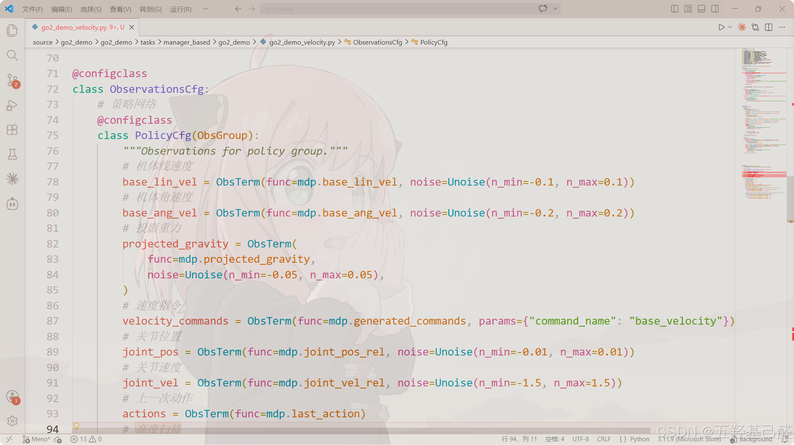

##### 动作配置类actions

指定智能体输出的控制指令类型（如关节位置、速度或力矩）。

复制示例代码：

```python
# 动作配置
@configclass
class ActionsCfg:
    """Action specifications for the MDP."""
 
    joint_pos = mdp.JointPositionActionCfg(asset_name="robot", joint_names=[".*"], scale=0.5, use_default_offset=True)   
```

 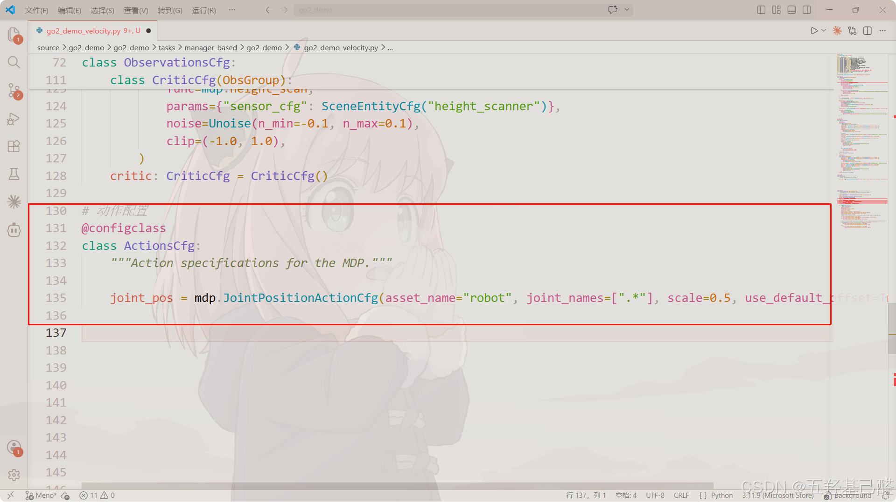

##### 指令配置类commands

生成任务目标（如期望速度或朝向），供策略追踪。

```python
@configclass
class CommandsCfg:
    """Command specifications for the MDP."""
 
    base_velocity = mdp.UniformVelocityCommandCfg(
        asset_name="robot",
        resampling_time_range=(10.0, 10.0),
        rel_standing_envs=0.02,
        rel_heading_envs=1.0,
        heading_command=True,
        heading_control_stiffness=0.5,
        debug_vis=True,
        ranges=mdp.UniformVelocityCommandCfg.Ranges(
            lin_vel_x=(-1.0, 1.0), lin_vel_y=(-1.0, 1.0), ang_vel_z=(-1.0, 1.0), heading=(-math.pi, math.pi)
        ),
    )
```

 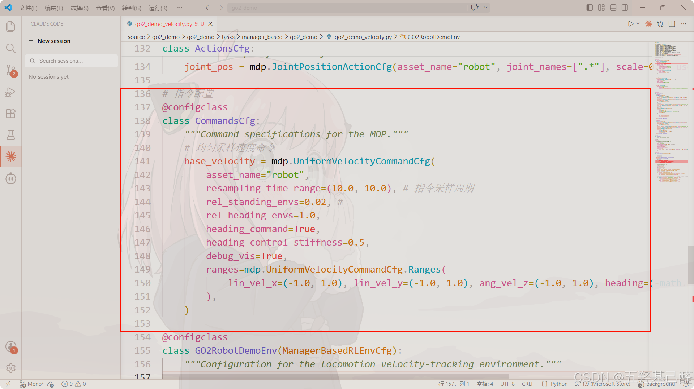

##### 奖励配置类rewards

计算每一步的奖励信号，引导策略学习期望行为。

```python
# 奖励函数
@configclass
class RewardsCfg:
    track_lin_vel_xy_exp = RewTerm(
        func=mdp.track_lin_vel_xy_exp, weight=1.0, params={"command_name": "base_velocity", "std": math.sqrt(0.25)}
    )
    track_ang_vel_z_exp = RewTerm(
        func=mdp.track_ang_vel_z_exp, weight=0.5, params={"command_name": "base_velocity", "std": math.sqrt(0.25)}
    )
```

 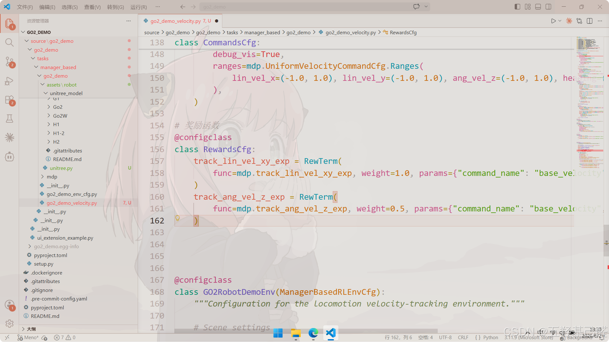

##### 终止条件配置类terminations

设定环境结束条件（如机器人摔倒或超时）。

```python
# 终止条件
@configclass
class TerminationsCfg:
    # 时间终止
    time_out = DoneTerm(func=mdp.time_out, time_out=True)
    # 机身碰撞地面
    base_contact = DoneTerm(
        func=mdp.illegal_contact,
        params={"sensor_cfg": SceneEntityCfg("contact_forces", body_names="base"), "threshold": 1.0},
    )
    # 倾斜角度
    bad_orientation = DoneTerm(func=mdp.bad_orientation, params={"limit_angle": 0.8})
```

 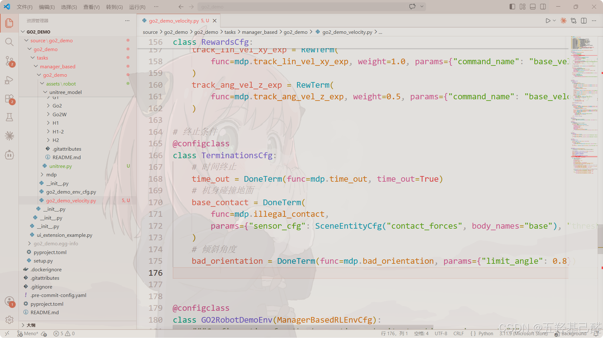

##### 事件配置类events

配置域随机化、初始状态扰动等事件，增强策略鲁棒性。

```python
# 事件配置
@configclass
class EventCfg:
    reset_base = EventTerm(
        func=mdp.reset_root_state_uniform, # 触发函数
        mode="reset", # 触发时机--复位
        params={
            "pose_range": {"x": (-0.5, 0.5), "y": (-0.5, 0.5), "yaw": (-3.14, 3.14)},
            "velocity_range": {
                "x": (-0.0, 0.0),
                "y": (-0.0, 0.0),
                "z": (-0.0, 0.0),
                "roll": (-0.0, 0.0),
                "pitch": (-0.0, 0.0),
                "yaw": (-0.0, 0.0),
            },
        },
    )
```

 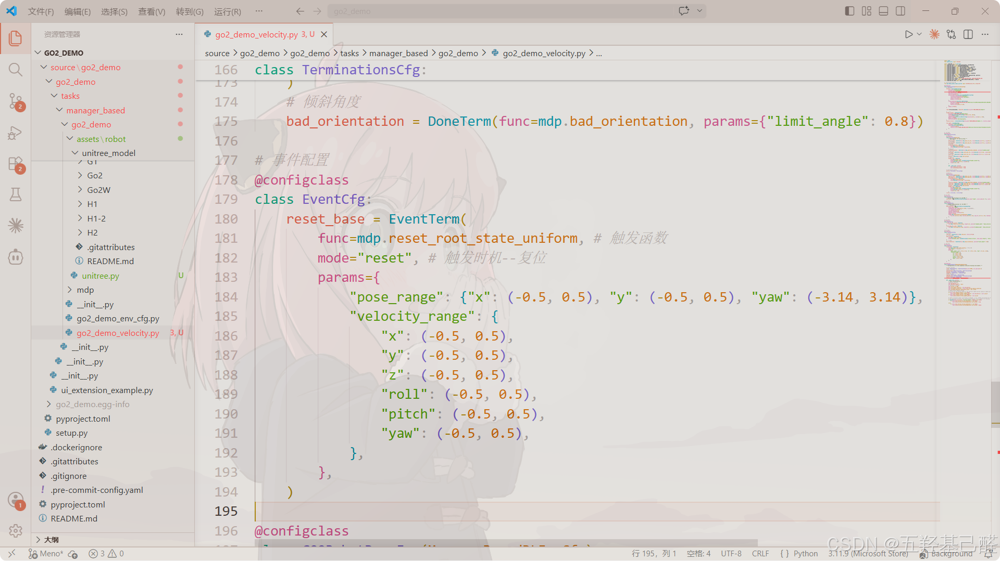

##### 课程学习配置类 `curriculum` 

据智能体当前表现动态调整任务难度（如地形等级），实现渐进式训练以加速策略收敛。

> 本次暂不对其进行配置，因此注释：
> 
>  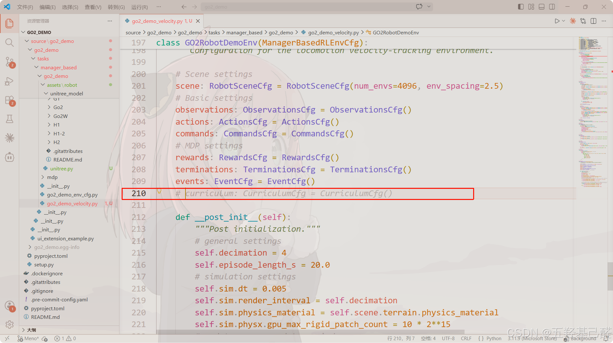
> 
> 

### 注册Gym环境

复制__init__.py文件中的注册部分代码：

 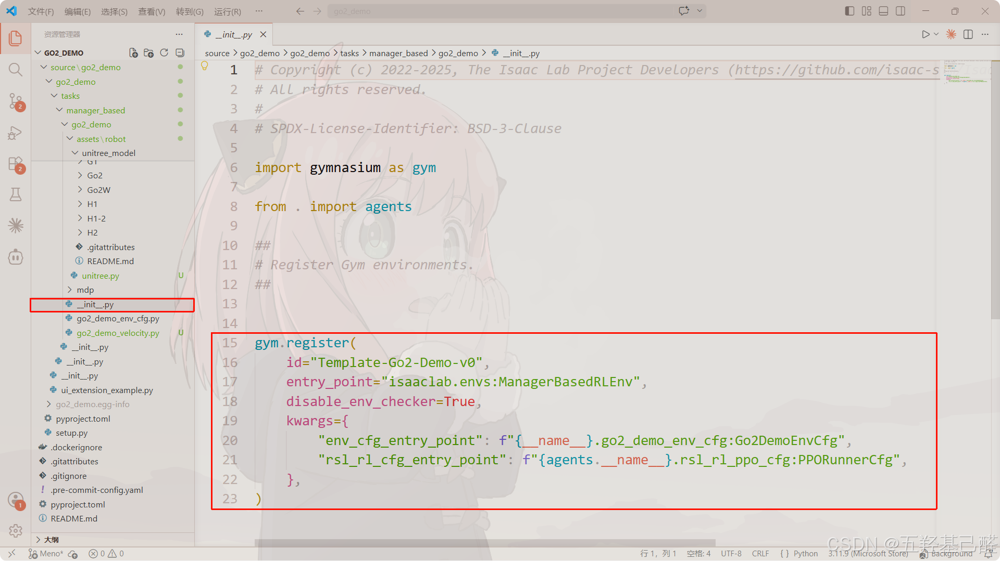

修改如下：

```python
gym.register(
    id="Go2-velocity-v0", # 环境ID
    entry_point="isaaclab.envs:ManagerBasedRLEnv",
    disable_env_checker=True,
    kwargs={
        "env_cfg_entry_point": f"{__name__}.go2_demo_velocity:GO2RobotDemoEnv", # 环境文件名:环境类名
        "rsl_rl_cfg_entry_point": f"{agents.__name__}.rsl_rl_ppo_cfg:PPORunnerCfg",
    },
)
```

 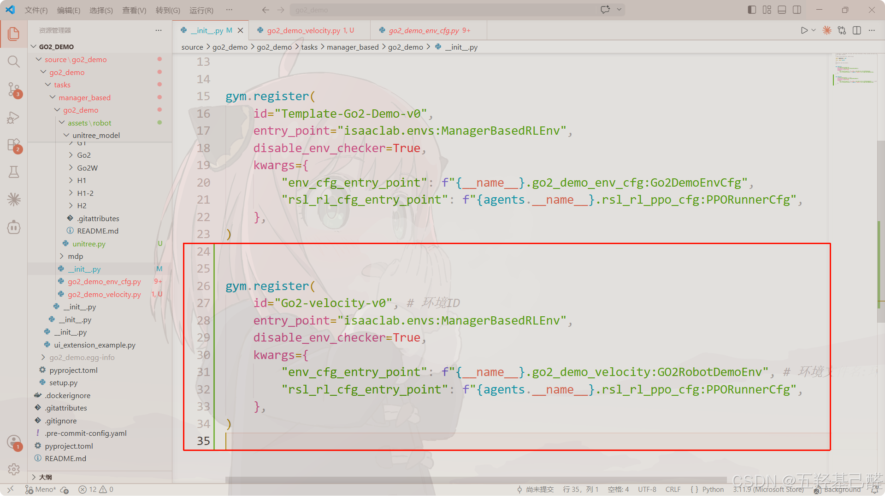

### 调整PPO网络

文件位置在agents/rsl_rl_ppo_cfg.py

 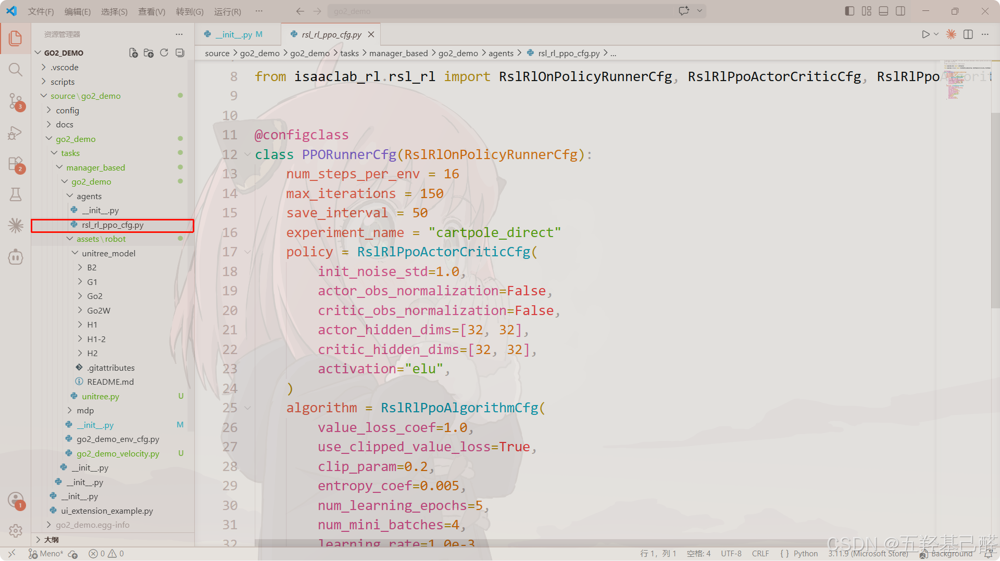

调整至以下：

```python
@configclass
class PPORunnerCfg(RslRlOnPolicyRunnerCfg):
    num_steps_per_env = 124
    max_iterations = 50000
    save_interval = 100
    experiment_name = "go2_demo"
    policy = RslRlPpoActorCriticCfg(
        init_noise_std=1.0,
        actor_hidden_dims=[512, 256, 128],
        critic_hidden_dims=[32, 32],
        activation="elu",
    )
    algorithm = RslRlPpoAlgorithmCfg(
        value_loss_coef=1.0,
        use_clipped_value_loss=True,
        clip_param=0.2,
        entropy_coef=0.005,
        num_learning_epochs=5,
        num_mini_batches=4,
        learning_rate=1.0e-3,
        schedule="adaptive",
        gamma=0.99,
        lam=0.95,
        desired_kl=0.01,
        max_grad_norm=1.0,
    )
```

 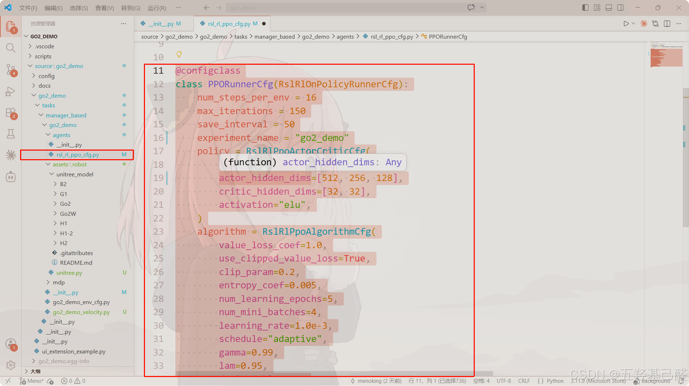

## 三.验证与训练

### 验证环境

#### random_agent.py

在conda环境下运行：

```bash
python scripts\random_agent.py --task Go2-velocity-v0 --num_envs 14
```

 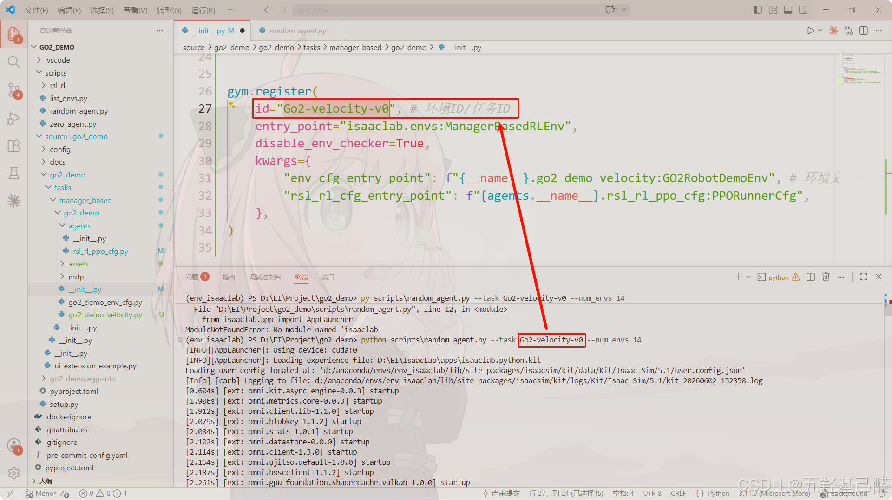

跑通后机器人开始运动，如下：

 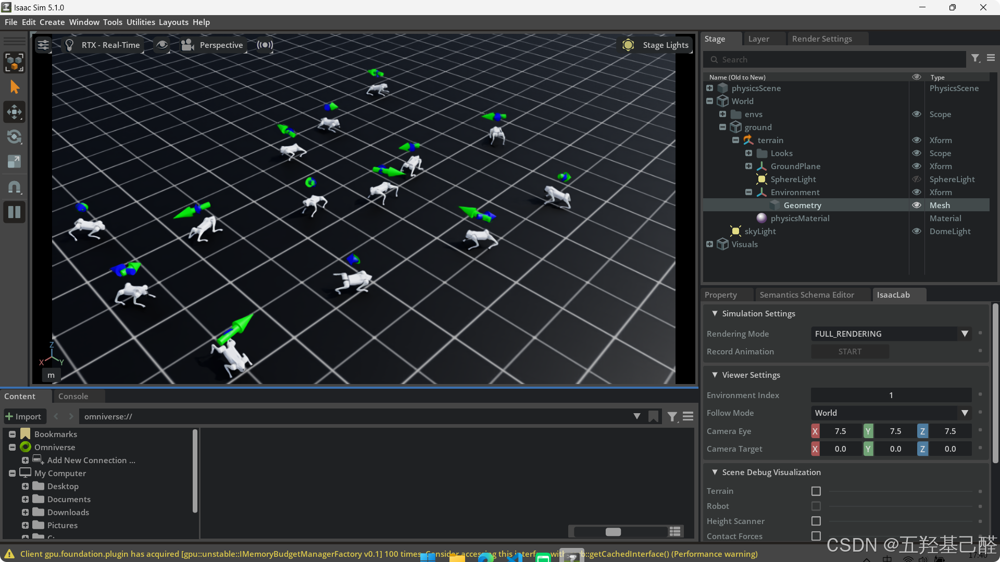

#### zero_agent.py

```python
python scripts\zero_agent.py --task Go2-velocity-v0 --num_envs 14
```

由于跑的是zero_agent.py，是跑通后机器狗是静止状态：

 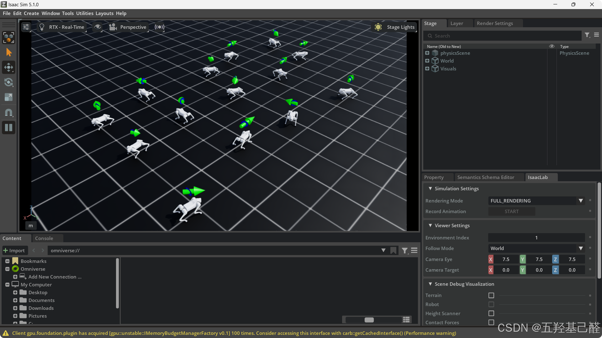

### 正式训练

无窗口渲染训练：

```bash
python scripts\rsl_rl\train.py --task Go2-velocity-v0 --num_envs=400 --max_iterations 1000 --headless
```

耐心等待训练：

 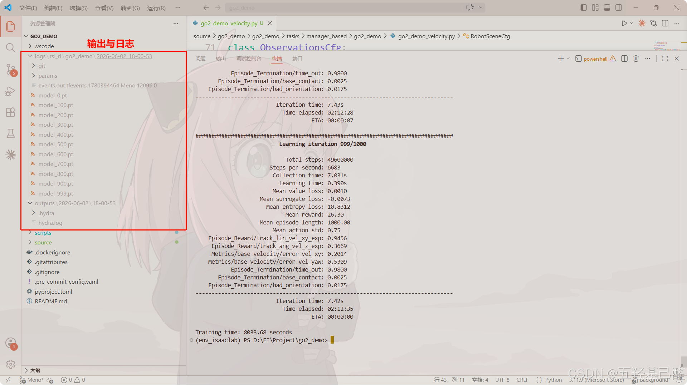

### 参数可视化

TensorBoard查看训练曲线：

```bash
tensorboard --logdir logs
```

 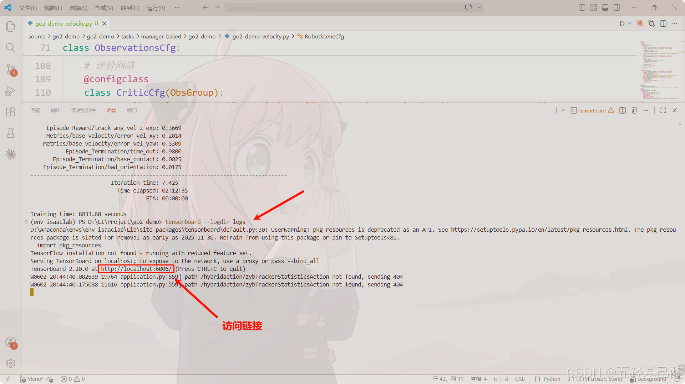

访问链接后可以观察到各种参数曲线：

 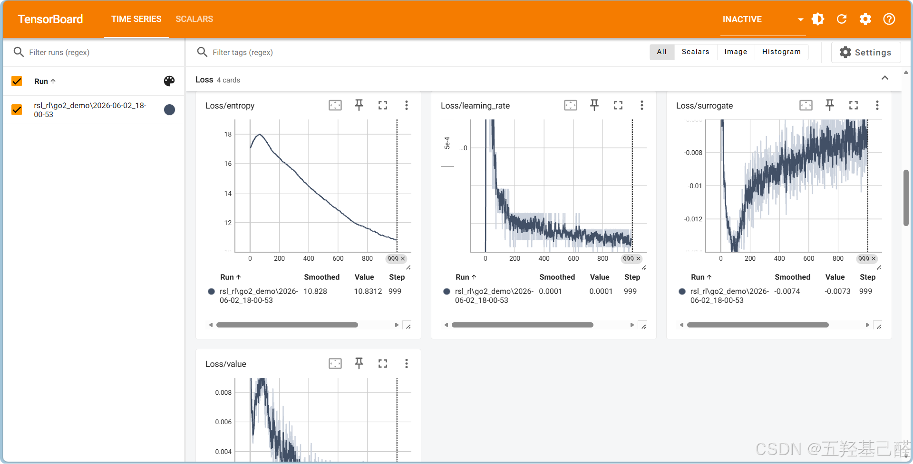

### 评估策略

运行下列命令， 观察训练的最终模型的效果并保存模型权重文件：

```bash
python scripts\rsl_rl\play.py --task Go2-velocity-v0  --num_envs 16
```

 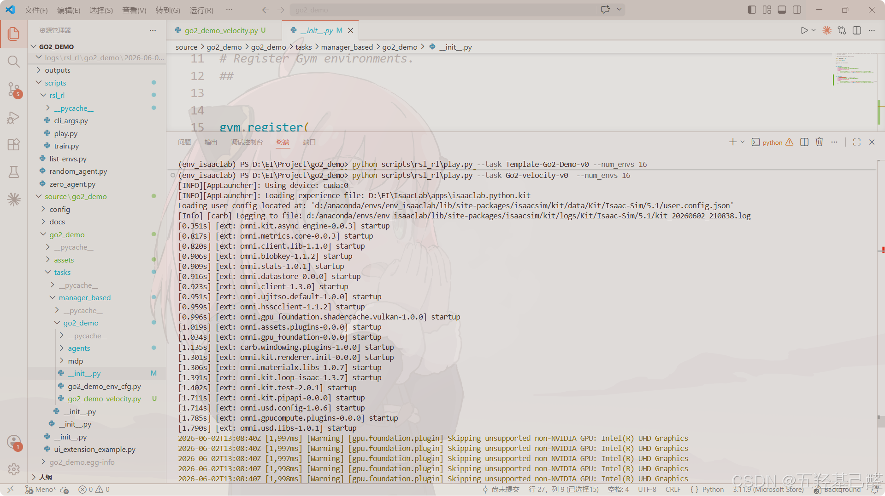

可以在仿真器中观察到四足机器人的行走姿态效果不太好：

 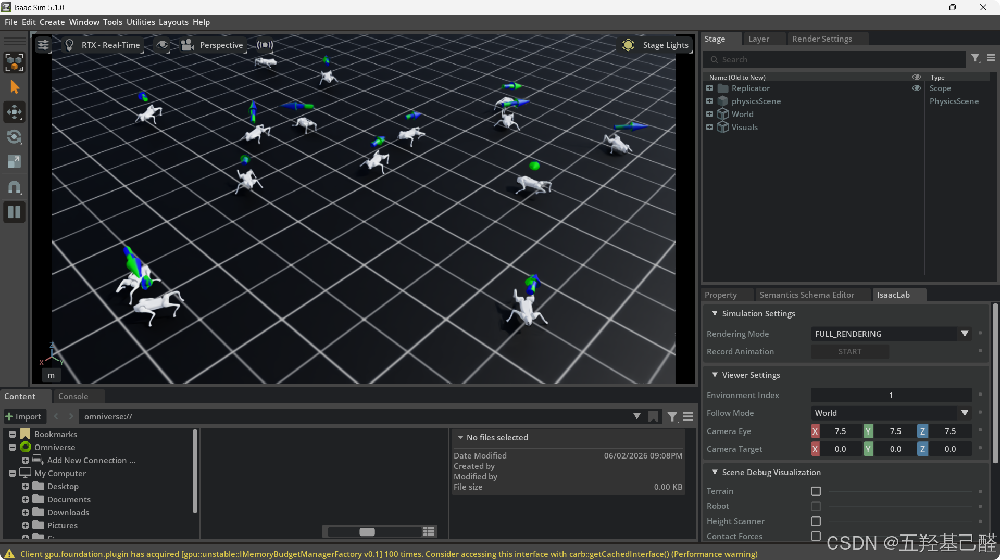

## 四.优化策略

主要针对奖励函数作优化，这里将速度追踪权重调大，并添加了几个约束惩罚项：

```python
# 奖励函数
@configclass
class RewardsCfg:
    # 线速度追踪
    track_lin_vel_xy_exp = RewTerm(
        func=mdp.track_lin_vel_xy_exp, weight=3.0, params={"command_name": "base_velocity", "std": math.sqrt(0.25)}
    )
    # 角速度追踪
    track_ang_vel_z_exp = RewTerm(
        func=mdp.track_ang_vel_z_exp, weight=1.5, params={"command_name": "base_velocity", "std": math.sqrt(0.25)}
    )
    # 约束姿态
    flat_orientation_l2 = RewTerm(func=mdp.flat_orientation_l2, weight=-2.5)
    # 限制某些部位不着地
    undesired_contacts = RewTerm(
        func=mdp.undesired_contacts,
        weight=-1.0,
        params={"sensor_cfg": SceneEntityCfg("contact_forces", body_names=["Head_.*", ".*_hip", ".*thigh", ".*_calf"]), "threshold": 1.0},
    )
    # 惩罚关节速度
    joint_vel = RewTerm(func=mdp.joint_vel_l2, weight=-0.001)
    # 惩罚关节加速度
    joint_acc = RewTerm(func=mdp.joint_acc_l2, weight=-2.5e-7)
    # 惩罚输出力矩过大
    joint_torques = RewTerm(func=mdp.joint_torques_l2, weight=-2e-4)
    # 惩罚相邻时刻动作变化过大
    action_rate = RewTerm(func=mdp.action_rate_l2, weight=-0.1)
```

 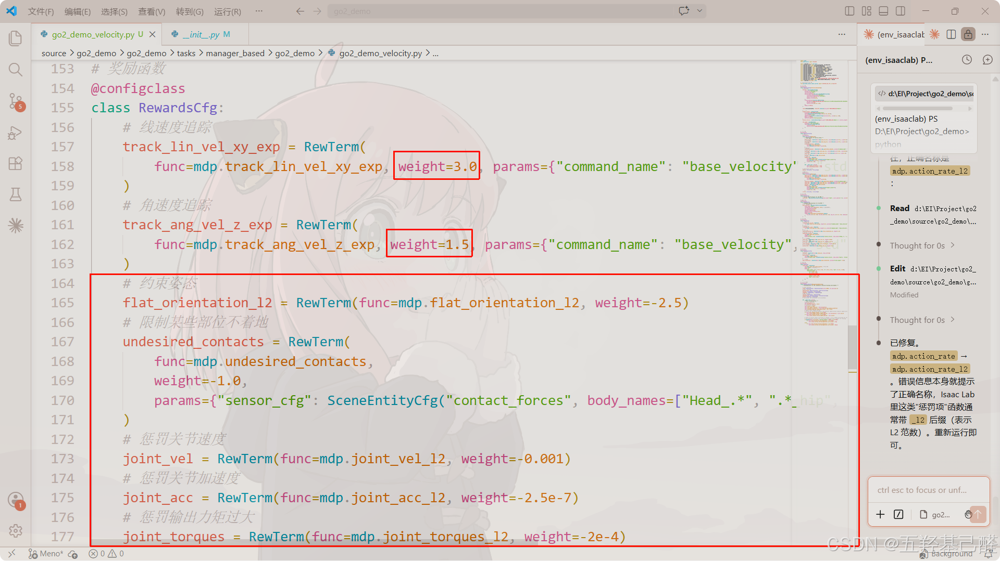

重新训练后再评估，发现四足机器人姿态好了很多：

 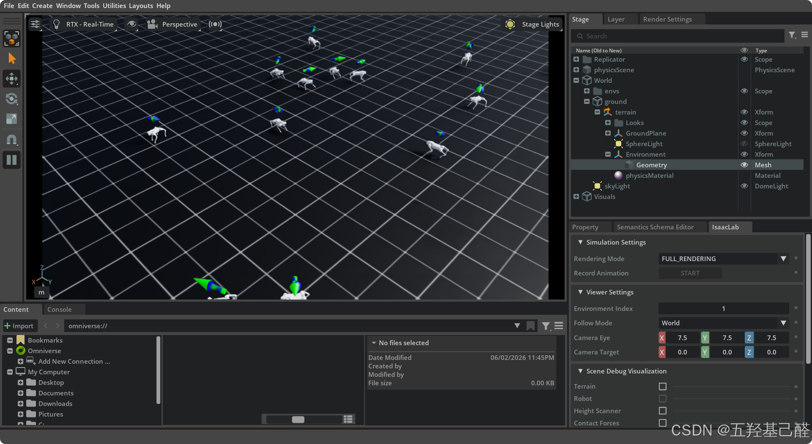

## 五.总结

> 再次感谢哔哩哔哩<span style="color:#4da8ee">@猫猫烤肉师傅</span><span style="color:#0d0016">的免费教程：</span> [【从 Isaac 到 MuJoCo：机器人sim2sim实战】Lesson0 糖猫碎碎念环节_哔哩哔哩_bilibili](https://www.bilibili.com/video/BV1LwQ7BiEW9?vd_source=60b7e4846ff8eebbaf6efd46ab66b45a&spm_id_from=333.788.videopod.sections) 

笔者跟随猫老师的教程走了一遍IsaacLab中的机器人仿真训练流程，并将猫老师未放出的代码、概念等补充在贴中，对视频中的细节做了补充。

如有错误，欢迎指正。