# 【SAR数据集】Mstar数据集使用指南

> 原创 已于 2026-01-13 16:48:14 修改 · 粉丝可见 · 1.6k 阅读 · 24 · 28 · 本内容遵循CC 4.0 BY-SA版权协议 版权声明：本文为博主原创文章，遵循 CC 4.0 BY 版权协议，转载请附上原文出处链接和本声明。 GEO检测 · 编辑
> 文章链接：https://menoking.blog.csdn.net/article/details/153538793

**目录**

[TOC]

---

## 一.Master数据集结构简介

 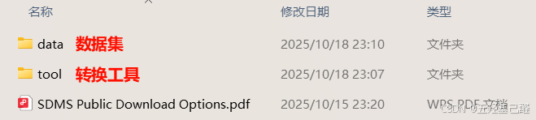

### data

| 文件名 | 内容说明 |
|:---:|:---:|
| ​ **​MSTAR-PredictLiteSoftware.zip​** ​ | 这不是数据，而是官方提供的​ **​评估软件包​** ​。研究人员用它来对自己的识别算法进行标准化测试，并将结果与官方基准进行比较，以确保评估的公平性。 |
| ​ **​MSTAR-PublicClutter-CD1/2.zip​** ​ | 包含“​ **​杂波​** ​”数据。​ **​杂波​** ​指的是场景中除了感兴趣的目标（如坦克）之外的一切背景回波，如草地、农田、道路等。这些数据用于测试算法在​ **​无目标区域​** ​的表现，即衡量算法的​ **​虚警率​** ​。一个好的算法应该在杂波区域不产生或产生很少的错误检测。 |
| ​ **​MSTAR-PublicMixedTargets-CD1/2.zip​** ​ | 包含“​ **​混合目标​** ​”数据。这是数据集中最核心的部分，包含了在不同​ **​方位角​** ​、​ **​俯仰角​** ​和​ **​序列编号​** ​下采集的多种军用车辆目标的SAR图像。最经典的配置包括：​ **​T-72​** ​主战坦克、​ **​BMP-2​** ​步兵战车和​ **​BTR-70​** ​装甲运兵车。该数据集用于训练和测试算法对不同类型目标的分类能力。 |
| ​ **​MSTAR-PublicT72Variants-CD1/2.zip​** ​ | 包含“​ **​T-72变体​** ​”数据。这部分数据非常重要，专门用于研究目标型号​ **​版本变化​** ​或​ **​配置变化​** ​对识别算法的影响。例如，同一辆T-72坦克，加装不同的扫雷犁、油箱或更换炮塔细节后，其SAR图像特征会发生变化。这用于测试算法的​ **​鲁棒性​** ​，即能否识别出同一目标的不同变体。 |
| ​ **​MSTAR-PublicTargetChips-T72-BMP2-BTR70-SLICY.zip​** ​ | 包含“​ **​目标切片​** ​”。这些数据很可能是从完整的SAR场景中​ **​裁剪出来​** ​的、只包含目标本身的一小块图像。文件名中的“SLICY”可能指代一种特定的目标配置或数据集版本。这种形式的数据方便研究人员快速进行目标分类实验，而无需处理整个大场景。 |


### tool

| **mstar_conv_tools.tar​** ​ | ​ **​转换工具​** ​ | 这是​ **​最重要也是最常用​** ​的工具包。它包含了将MSTAR原始数据（通常是特殊的二进制格式，如 `.hta` ）转换为更通用、易于处理的格式（如 `.mat` MATLAB格式或 `.csv` 文本格式）的脚本和程序。​ **​没有这个工具包，研究人员很难直接读取和利用原始的MSTAR数据。​** ​ |
|:---:|:---:|:---:|
| ​ **​mstar_viewer_tools.tar​** ​ | ​ **​查看器工具​** ​ | 这个工具包提供了用于​ **​可视化​** ​和​ **​浏览​** ​MSTAR数据的图形界面软件。SAR图像不同于普通光学照片，直接用普通图片查看器打开效果不佳或根本无法打开。这个查看器可以正确渲染SAR图像的幅度、相位信息，并允许用户调整对比度、缩放等，以便直观地观察目标特征。 |
| ​ **​mstar_misc_tools.tar​** ​ | ​ **​杂项工具​** ​ | 这个工具包包含一些​ **​辅助性的脚本和实用程序​** ​，功能可能比较零散但很有用。例如：<br/>• ​ **​数据预处理工具​** ​：如图像裁剪、滤波、归一化等。<br/>• ​ **​特征提取工具​** ​：帮助从SAR图像中计算某些特定特征。<br/>• ​ **​基准算法脚本​** ​：可能包含一些简单的、用于对比的基础识别算法实现。<br/>• ​ **​文档或示例代码​** ​：帮助用户更快地上手。 |


mstar_conv_tools

官方提供了四种转换工具

 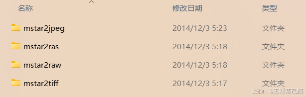

| 格式特性 | JPEG | RAS (Sun Raster) | RAW | TIFF |
|:---:|:---:|:---:|:---:|:---:|
| ​ **​核心特点​** ​ | ​ **​有损压缩​** ​，体积小 | 一种较老的​ **​无损​** ​位图格式 | ​ **​原始数据​** ​，数字底片 | ​ **​灵活​** ​，支持有损/无损压缩 |
| ​ **​图像质量​** ​ | 压缩会损失质量，多次编辑后下降明显 | 无损，但色彩深度通常有限 | ​ **​极高​** ​，保留最丰富的图像信息 | ​ **​极高​** ​，支持无损压缩 |
| ​ **​文件大小​** ​ | 很小 | 较大 | 非常大 | 很大（尤其是未压缩时） |
| ​ **​兼容性​** ​ | ​ **​极佳​** ​，所有设备和应用都支持 | ​ **​很差​** ​，主要用于早期Sun系统 | ​ **​较差​** ​，需专用软件解析 | ​ **​良好​** ​，多数专业软件支持 |
| ​ **​主要用途​** ​ | ​ **​网页图片​** ​、电子邮件、日常分享 | 历史遗留系统，现已很少使用 | ​ **​专业摄影​** ​后期处理 | ​ **​专业印刷​** ​、出版、图像存档 |


## 二.数据集的转换

### WSL安装

WSL（WindowsSubsystem forLinux）是微软开发的一项技术，允许用户在Windows系统中直接运行完整的Linux环境，无需虚拟机。

这里由于官方所给的Tool中只包含C源码，因此我们需要在MSL中对其进行编译使用。

 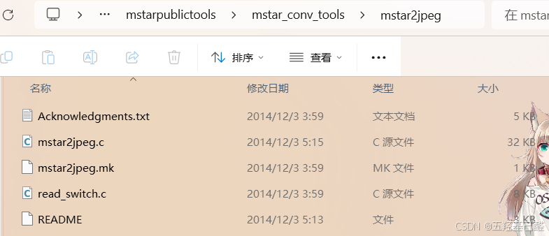

> 可参考以下文章进行安装，这里不在赘述安装过程：
> 
> [windows11 安装WSL2全流程_wsl2安装-CSDN博客](https://blog.csdn.net/u011119817/article/details/130745551) gg

老规矩，先换源，以下为24.04的源，其他版本去清华镜像站找 [ubuntu | 镜像站使用帮助 | 清华大学开源软件镜像站 | Tsinghua Open Source Mirror](https://mirrors.tuna.tsinghua.edu.cn/help/ubuntu/) 

```bash
Types: deb
URIs: https://mirrors.tuna.tsinghua.edu.cn/ubuntu
Suites: noble noble-updates noble-backports
Components: main restricted universe multiverse
Signed-By: /usr/share/keyrings/ubuntu-archive-keyring.gpg
 
# 以下安全更新软件源包含了官方源与镜像站配置，如有需要可自行修改注释切换
Types: deb
URIs: https://mirrors.tuna.tsinghua.edu.cn/ubuntu
Suites: noble-security
Components: main restricted universe multiverse
Signed-By: /usr/share/keyrings/ubuntu-archive-keyring.gpg
```

换源后切记sudo一下：

```bash
sudo apt-get update
sudo apt-get upgrade
```

### mstar2jpeg转换工具的使用

将数据文件复制到WSL的home/user/目录下

 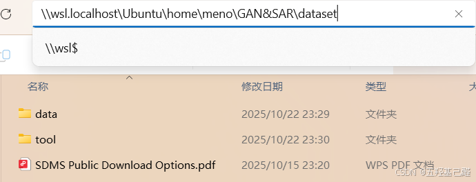

这里以 **JPEG的转换工具** 编译为例，复制以下源码文件到我们WSL的工作目录（及home/user/ABC这里指你自己创建的目录）下：

 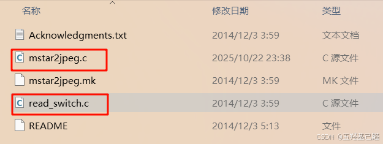

确保安装gcc编译器、make等工具：

[深入了解 Ubuntu 中的 build-essential：开发者的必备工具-CSDN博客](https://blog.csdn.net/scoone/article/details/143633214) 

```bash
sudo apt install build-essential libjpeg-dev
```

在同一目录下运行gcc编译源码产生可执行文件：

```bash
gcc -o mstar2jpeg mstar2jpeg.c read_switch.c -ljpeg -lm
```

> 
> 
> - `-o mstar2jpeg` ：指定输出可执行文件名
> 
> - `mstar2jpeg.c read_switch.c` ：要编译的源文件
> 
> - `-ljpeg` ：链接JPEG库
> 
> - `-lm` ：链接数学库
> 
> 

 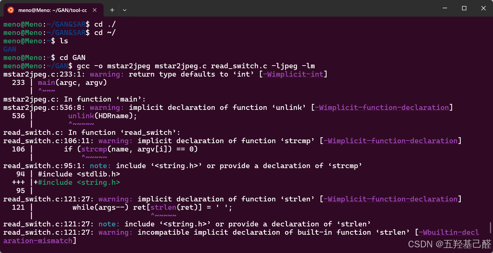

可以发现编译后生成的文件：

 

执行显示命令信息则编译成功：

```bash
./mstar2jpeg
```

 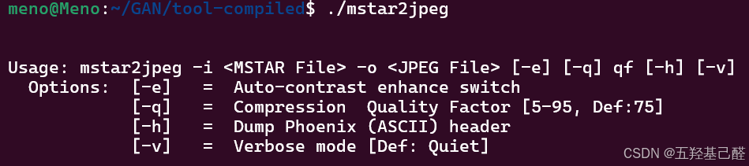

## 三.进行数据集转换

### 单例测试

可以先进行单例测试，先随便取一个原始数据，将它和编译出的转换工具可执行文件放在同一个目录下：

 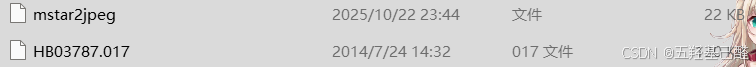

键入上文提到的命令即可进行转换得到我们想要的jpeg格式文件：

 

 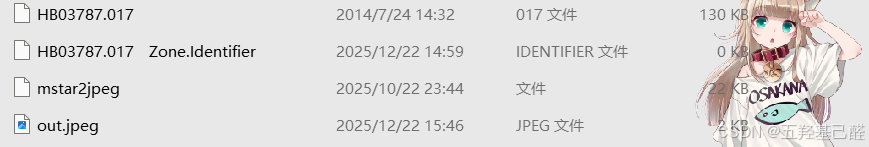

 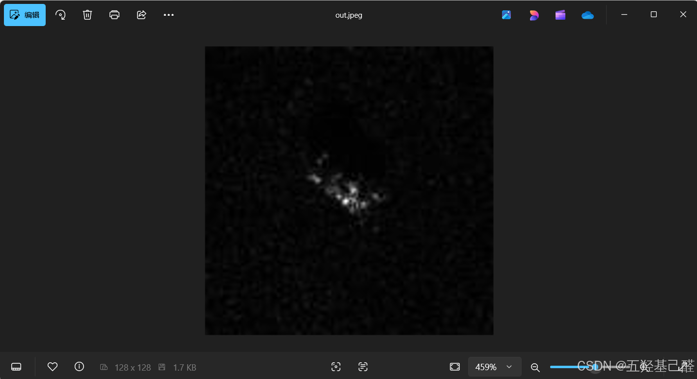

### 批量转换

这里用到简单的Bash命令来编写一段批量转换命令：

```bash
for f in ../SN_9563/*.000; do 
    name=$(basename "$f"); 
    ./mstar2jpeg -i "$f" -o "../out_jpeg/${name%.000}.jpeg" -e -q 85;
done
 
//注释
//for f in ../SN_9563/*.000; do //遍历上级目录下SN_9563文件夹内所有以.000结尾的文件
//    name=$(basename "$f"); //去掉路径，提取文件名
//    ./mstar2jpeg -i "$f" -o "../out_jpeg/${name%.000}.jpeg" -e -q 85;//运行当前文件夹下的转换工具执行转换命令，并以原文件名+.jpeg后缀存到上级目录的out_jpeg文件夹下
//done
```

> 
> 
> - `basename` 命令： `basename` 是一个常见的命令行工具，通常用于从一个完整的文件路径中 **提取文件名** （去掉路径和扩展名）。这个命令非常有用，尤其是在你需要处理文件路径时，只关注文件名部分。
> 
> - `${name%.000}` 是一种 **参数替换** ，表示将变量 `name` 的值中最后的 `.000` 后缀去掉。
> 
> 

执行完以上命令后便可在指定文件夹内看到转换后的文件：

 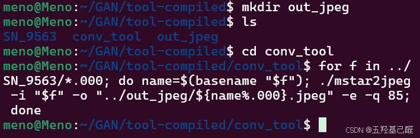

 

 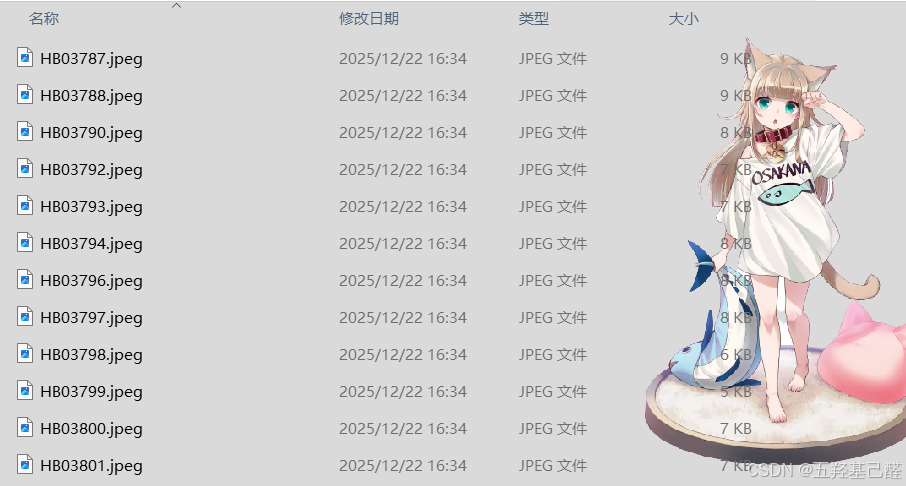

 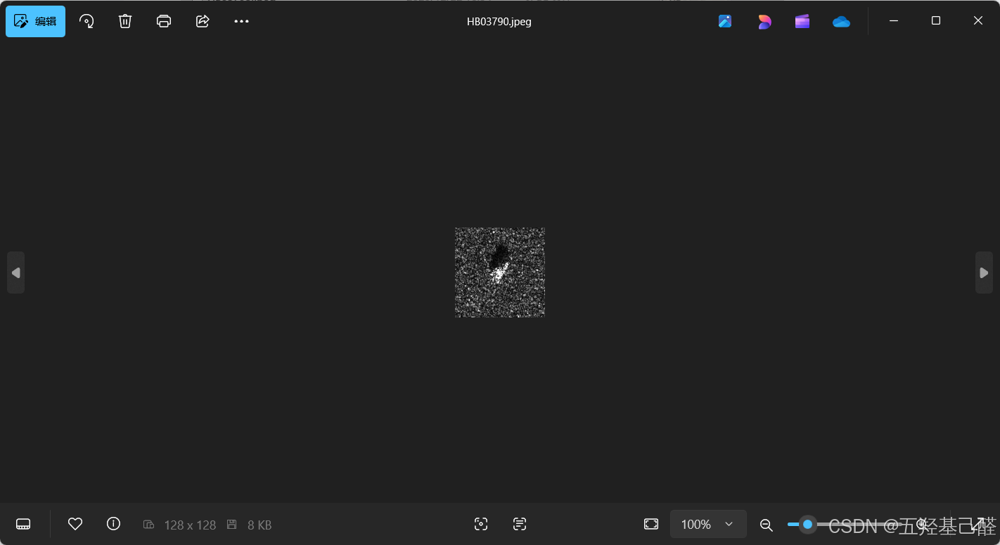

Mstar数据集的使用指南到此结束，其他转换工具的使用也如同上述步骤！