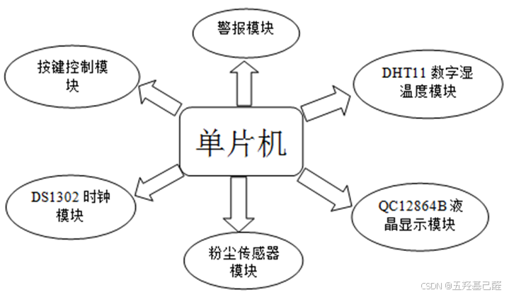
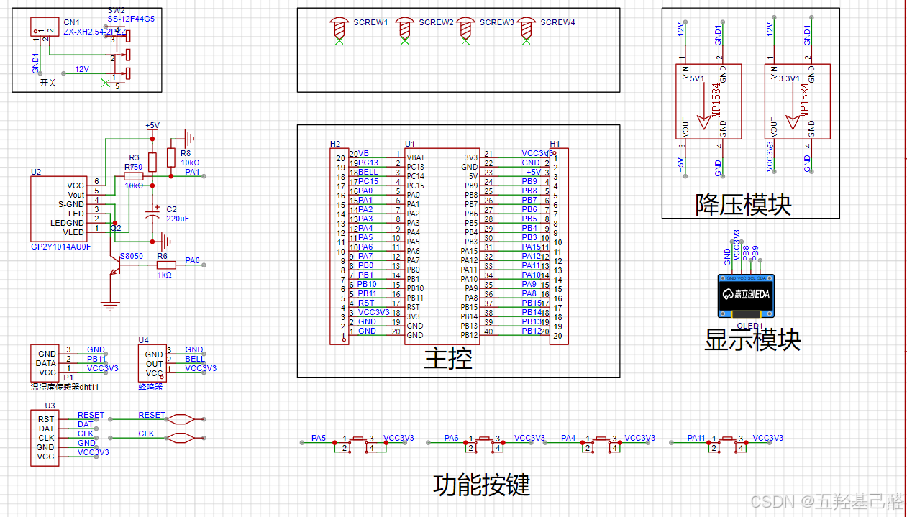
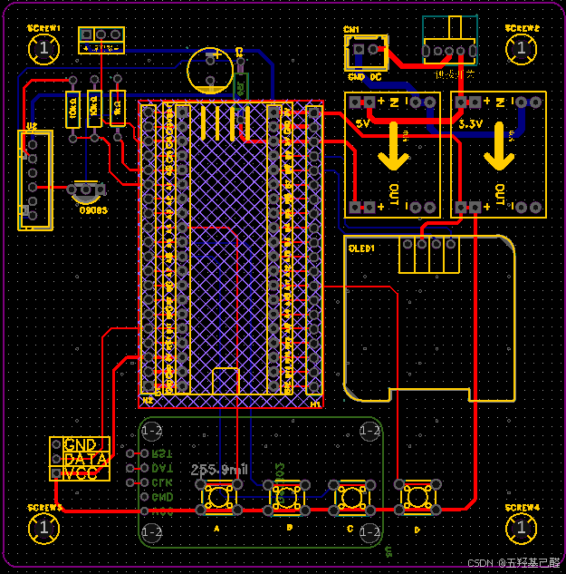
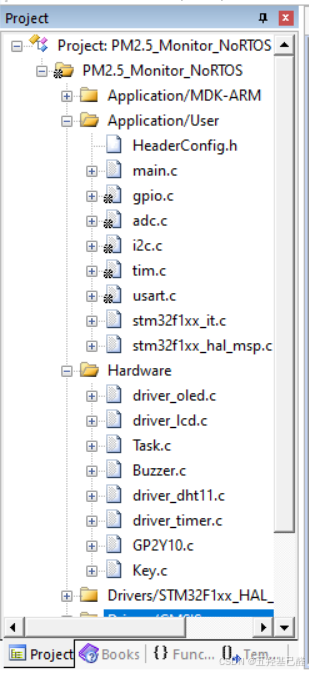
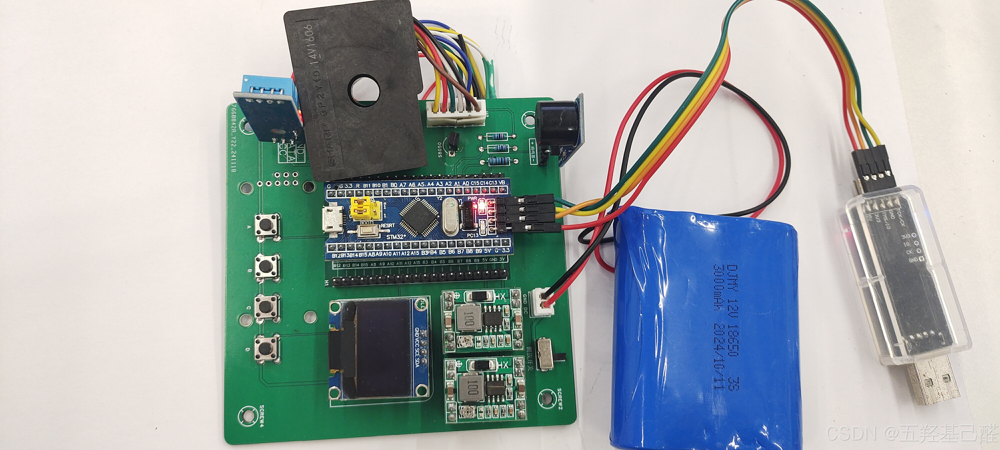

# 【STM32练习】基于STM32的PM2.5环境监测系统

> 原创 于 2024-12-16 12:13:35 发布 · 公开 · 2.9k 阅读 · 66 · 16 · 本内容遵循CC 4.0 BY-SA版权协议 版权声明：本文为博主原创文章，遵循 CC 4.0 BY 版权协议，转载请附上原文出处链接和本声明。 GEO检测 · 编辑
> 文章链接：https://menoking.blog.csdn.net/article/details/144461671

## 一.项目背景

最近为了完成老师交付的任务，遂重制了一下小项目用STM32做一个小型的环境监测系统。

项目整体示意框图如下：

 

## 二.器件选择

> 
> 
> - **单片机（STM32F103）**
> 
> - **数字温湿度模块（DHT11）**
> 
> - **液晶显示模块（0.8寸OLED）**
> 
> - **粉尘传感器模块（GP2Y10）**
> 
> - **报警模块（蜂鸣器）**
> 
> - **按键控制模块（独立按键）**
> 
> 

由于笔者觉得时钟模块没什么必要性，就没再加DS1302上去了。

## 三.PCB绘制

PCB推荐使用嘉立创专业版绘制，对于初学者来说简单易上手，而且这种DIY的小玩意绘制的PCB大小控制在10*10以内还可以免费打样。

嘉立创很方便的一点是可以使用它内部自带的在线库，省去了自己画封装画元件的步骤，非常简单，但是注意要辨别这里的元件封装的正确性，因为有些元件封装是用户贡献的，所以有些地方不一定正确，各位读者如果是小白的话一定要注意辨别是否符合自己的需求！！！

 

这里PCB布线也没什么好说的，很简单的几个模块，而且板子的大小很大空间完全足够布线。

 

## 四.核心代码

以下只对部分核心代码做展示。

### 项目文件目录

 

### GP2Y10粉尘传感器的驱动程序

#### GP2Y10.h

```cpp
#ifndef   __GP2Y10_H__
#define   __GP2Y10_H__
 
#include <stdint.h>
#include <stdio.h>
#include "main.h"
#include "stm32f1xx_hal.h"
#include "driver_timer.h"
#include "driver_lcd.h"
 
extern ADC_HandleTypeDef hadc1;
 
#define LIMIT(x, min, max) 	( (x) < (min)  ? (min) : ( (x) > (max) ? (max) : (x) ) ) // 限幅函数
#define GP2Y10_LED_ON()	 HAL_GPIO_WritePin(GP_LED_GPIO_Port, GP_LED_Pin, GPIO_PIN_RESET) // 传感器LED灯开
#define GP2Y10_LED_OFF() HAL_GPIO_WritePin(GP_LED_GPIO_Port, GP_LED_Pin, GPIO_PIN_SET)// 传感器LED灯关
 
#define PM25_LED_H			HAL_GPIO_WritePin(GP_LED_GPIO_Port, GP_LED_Pin, GPIO_PIN_SET);
#define PM25_LED_L			HAL_GPIO_WritePin(GP_LED_GPIO_Port, GP_LED_Pin, GPIO_PIN_RESET);
 
#define GP2Y10_SAMP_TIME	280 // 传感器采样时间280us
#define GP2Y10_LEDON_TIME	320 // LED灯开持续时间
#define GP2Y10_PULSE_PERIOD	10000 // 传感器测量脉冲一个周期的时间
 
#define PM25_READ_TIMES	20
 
void GP2Y10_Init(void);
float GP2Y10_Value(void);
float Get_PM25_Average_Data(void);
void GP2Y10_Test(void);
 
 
#endif
```

#### GP2Y10.c

```cpp
#include "GP2Y10.h"
 
void GP2Y10_Init(void)
{
	GP2Y10_LED_OFF(); // 初始化传感器LED灯为关
	HAL_ADC_Start(&hadc1);  //开启ADC
	HAL_ADC_PollForConversion(&hadc1, 50);   //等待转换完成，50为最大等待时间，单位为ms
}
 
// 计算粉尘浓度
float GP2Y10_Value(void)
{
	uint16_t ADCVal;
	int dustVal = 0;
	float Voltage;
 
	PM25_LED_H;	//置1  开启内部LED
	udelay(280); 	// 开启LED后的280us的等待时间
	ADCVal = HAL_ADC_GetValue(&hadc1);  //PA1 采样，读取AD值
	udelay(19);			  //延时19us，因为这里AD采样的周期为239.5，所以AD转换一次需耗时21us，19加21再加280刚好是320us
	PM25_LED_L;	//置0  关闭内部LED
	udelay(9680);			//需要脉宽比0.32ms/10ms的PWM信号驱动传感器中的LED
	
	Voltage = 3.3f * ADCVal / 4096.f * 2; //获得AO输出口的电压值
	
	dustVal = (0.17*Voltage-0.1)*1000;  //乘以1000单位换成ug/m3//
 
	if (dustVal < 0)
		dustVal = 0;            //限位//
 
	if (dustVal>500)        
		dustVal=500;
 
	return dustVal;
}
 
float Get_PM25_Average_Data(void)
{
	float temp_val=0;
	uint8_t t;
	for(t=0;t<PM25_READ_TIMES;t++)	//#define PM25_READ_TIMES	20	定义读取次数,读这么多次,然后取平均值
 
	{
		temp_val+=GP2Y10_Value();	//读取ADC值
		mdelay(5);
	}
	temp_val/=PM25_READ_TIMES;//得到平均值
    return temp_val;//返回算出的ADC平均值
}
 
void GP2Y10_Test(void)
{
	GP2Y10_Init();
	float concentration;
	
	while(1)
	{
		LCD_PrintString(0,0,"CON:");
		concentration = GP2Y10_Value();
		LCD_PrintSignedVal(0,2,concentration);
		mdelay(1000);
	}
}
 
```

### 按键读取程序

```cpp
#include "Key.h"
 
void Key_Init(void)
{
	
}
 
uint8_t Key_GetValue(void)
{
	uint8_t value = 0;
	if(HAL_GPIO_ReadPin(GPIOA,KEY_A_Pin) == GPIO_PIN_SET)value = 1;
	if(HAL_GPIO_ReadPin(GPIOA,KEY_B_Pin) == GPIO_PIN_SET)value = 2;
	if(HAL_GPIO_ReadPin(GPIOA,KEY_C_Pin) == GPIO_PIN_SET)value = 3;
	if(HAL_GPIO_ReadPin(GPIOA,KEY_D_Pin) == GPIO_PIN_SET)value = 4;
	return value;
}
 
uint8_t Key_Scan(void)
{
	uint8_t key_number = 0;
	key_number = Key_GetValue();
	if(key_number != 0)
	{
		mdelay(20);
		while( Key_GetValue() != 0);
		mdelay(20);
		return key_number;
	}
	return 0;
}
 
void Key_Test(void)
{
	uint8_t Key_Number = Key_Scan();
	if(Key_Number == 1)
		printf("A\n");
	else if(Key_Number == 2)
		printf("B\n");
	else if(Key_Number == 3)
		printf("C\n");
	else if(Key_Number == 4)
		printf("D\n");
}
```

### 定时程序

这里原本用的是韦东山老师的RTOS里的非阻塞延时，但是由于笔者最终选择使用裸机完成整个功能，于是便把ms延时函数换成了HAL库的官方延时函数。

```cpp
#include "driver_timer.h"
#include "stm32f1xx_hal.h"
#define CPU_FREQUENCY_MHZ    72		// STM32时钟主频
 
void udelay(uint32_t delay)
{
	 int last, curr, val;
    int temp;
 
    while (delay != 0)
    {
        temp = delay > 900 ? 900 : delay;
        last = SysTick->VAL;
        curr = last - CPU_FREQUENCY_MHZ * temp;
        if (curr >= 0)
        {
            do
            {
                val = SysTick->VAL;
            }
            while ((val < last) && (val >= curr));
        }
        else
        {
            curr += CPU_FREQUENCY_MHZ * 1000;
            do
            {
                val = SysTick->VAL;
            }
            while ((val <= last) || (val > curr));
        }
        delay -= temp;
    }
}
 
void mdelay(int ms)
{
//    for (int i = 0; i < ms; i++)
//        udelay(1000);
	HAL_Delay(ms);
}
 
```

### 逻辑功能实现

#### Task.h

```cpp
#ifndef   _TASK_H__
#define   _TASK_H__
 
#include <stdint.h>
#include <stdbool.h>
#include "HeaderConfig.h"
 
#define HUM_MAX      100
#define HUM_MIN      10
#define TEM_MAX      100
#define TEM_MIN      10
#define DUS_MAX      100
#define DUS_MIN      10
 
void Task_Test(void);
void Device_Init(void);
void Task_Prime(void);
 
#endif
```

#### Task.c

```cpp
#include "Task.h"
 
uint8_t Prime_Mode = 0;
uint8_t Start_Mode = 0;
uint8_t Threshold_Mode = 0;//温度调节模式
bool isCollecting = false;
 
int Humidity = 0,Temperature = 0;
float Dust_Concentration = 0;
uint8_t TemperatureMax = 30;
uint8_t TemperatureMin = 10;
 
uint8_t DataRead_Count = 0;//数据采集计次
uint8_t Blink_Count = 0;//闪烁
uint16_t Timer_2000ms = 0;//数据采集间隔
uint16_t Timer_Blink = 0;//
 
void Task_Test(void)
{
	//LCD_Test();
	//Key_Test();
}
 
void Device_Init(void)
{
	LCD_Init();
	Buzzer_Init();
	DHT11_Init();
	GP2Y10_Init();
	Key_Init();
}
 
void Task_Key(void)
{
	uint8_t Key_Number = Key_Scan();
	
	if(Prime_Mode == 2)
	{
		if(Key_Number == 1)
		{
			LCD_Clear();
			Start_Mode = 1;
			Prime_Mode = 0;
			isCollecting = false;
		}
	}
	else
	{
		if(Key_Number == 1)
		{
			LCD_Clear();
			Start_Mode ^= 1;
			Prime_Mode = 0;
			isCollecting = false;
		}
	}
 
	if(Prime_Mode == 2)
	{
		if(Key_Number == 2)
		{
			LCD_Clear();
			Threshold_Mode ^= 1;
		}
		
	}
	else
	{
		if(Key_Number == 2)
		{
			LCD_Clear();
			Prime_Mode = 1;
			isCollecting = false;
		}
	}
		
 
	//设置报警阈值
	if(Key_Number == 3)
	{
		LCD_Clear();
		Prime_Mode = 2;
		isCollecting = false;
		
		if(Threshold_Mode == 0)//高温阈值++
		{
			++TemperatureMax;
		}
		if(Threshold_Mode == 1)//低温阈值++
		{
			++TemperatureMin;
		}
	}
	if(Key_Number == 4)
	{
		LCD_Clear();
		Prime_Mode = 2;
		isCollecting = false;
		
		if(Threshold_Mode == 0)//高温阈值++
		{
			--TemperatureMax;
		}
		if(Threshold_Mode == 1)//低温阈值++
		{
			--TemperatureMin;
		}
	}
}
 
void filter_and_smooth(float *data, int size, float *smoothed_data) {
    // 滤除0
    int count = 0;
    for (int i = 0; i < size; i++) {
        if (data[i] != 0) {
            smoothed_data[count++] = data[i];
        }
    }
    
    // 平滑曲线
    for (int i = 0; i < count - 2; i++) {
        smoothed_data[i] = (smoothed_data[i] + smoothed_data[i + 1] + smoothed_data[i + 2]) / 3.0;
    }
}
 
 
void Task_DataCollect(void)
{
	//DHT11_Read(&Humidity,&Temperature);
	if ( DHT11_Read(&Humidity,&Temperature) !=0 )
	{
		DHT11_Init();
	}
	Dust_Concentration = Get_PM25_Average_Data();//采集粉尘浓度数据
//	printf("Humidity:%d\n",Humidity);
//	printf("Temperature:%d\n",Temperature);
//	printf("PM2.5:%f\n",Dust_Concentration);
	printf("%f\n",Dust_Concentration/10);
}
 
void Task_Alarm(void)
{
	if(Temperature > TemperatureMax || Temperature < TemperatureMin)
	{
		Buzzer_Control(ON);
		mdelay(20);
		Buzzer_Control(OFF);
		mdelay(20);
	}	
}
 
 
void Task_OLED(void)
{
	switch(Prime_Mode)
	{
		case 0:
		{
			//控制启动关机
			if(Start_Mode == 1)//开机
			{
				LCD_PrintString(0,0,"Welcome to:");
				LCD_PrintString(5,2,"System");
			}
			else//关机
				LCD_Clear();
			break;
		}
		case 1://温湿度，PM2.5浓度
		{
			if(Start_Mode == 1)
			{
				if(!isCollecting)
				{
					LCD_PrintString(2,3,"Collecting...");
					mdelay(3000);
					LCD_Clear();
					isCollecting = true;
				}
				LCD_PrintString(0,0,"Data=>");
				LCD_PrintString(0,2,"Humidity:");
				LCD_PrintSignedVal(9, 2, Humidity);
				LCD_PrintString(0,4,"Temperature:");
				LCD_PrintSignedVal(12, 4, Temperature);
				LCD_PrintString(0,6,"PM2.5:");
				LCD_PrintSignedVal(6, 6, (int)Dust_Concentration);
			}
			break;
		}
		case 2://设置报警阈值
		{
			if(Start_Mode == 1)
			{
				LCD_PrintString(0,2,"High:");
				
				LCD_PrintString(0,4,"Low:");
				
				if(Threshold_Mode == 0)
				{
					if(Blink_Count == 0)
						LCD_PrintSignedVal(6, 2, TemperatureMax);
					else
						LCD_PrintString(6,2,"     ");
					LCD_PrintSignedVal(6, 4, TemperatureMin);
				}
				if(Threshold_Mode == 1)
				{
					LCD_PrintSignedVal(6, 2, TemperatureMax);
					if(Blink_Count == 0)
						LCD_PrintSignedVal(6, 4, TemperatureMin);
					else
						LCD_PrintString(6,4,"     ");
				}
			}
			break;
		}
//		case 3://出行建议
//		{
//			if(Start_Mode == 1)
//			{
//				if(Humidity > HUM_MAX)
//					LCD_PrintString(0,0,"The humidity is too high!!!");
//				else if(Humidity < HUM_MIN)
//					LCD_PrintString(0,0,"The humidity is too low!!!");
//			}
//			break;
//		}		
	}
}
 
void Task_Prime(void)
{
	Task_Key();
	if(DataRead_Count == 1)
	{
		Task_DataCollect();
		DataRead_Count = 0;
	}
	Task_Alarm();
	Task_OLED();
}
 
void HAL_TIM_PeriodElapsedCallback(TIM_HandleTypeDef *htim)
{
	if(htim->Instance == TIM2)
	{
		++Timer_2000ms;
		++Timer_Blink;
		if(Timer_2000ms >= 2000)
		{
			DataRead_Count++;
			Timer_2000ms = 0;
		}
		if(Timer_Blink >= 650)
		{
			Blink_Count ^= 1;
			Timer_Blink = 0;
		}
	}
}
 
```

## 五.最终效果

### 实物

 

### 功能演示

<div align="center" style="border: 3px solid gray;border-radius: 27px;overflow: hidden;"> <a class="link-info" href="https://player.bilibili.com/player.html?aid=113656343826615&autoplay=0" rel="nofollow" title="基于STM32的PM2.5监测系统">基于STM32的PM2.5监测系统</a><iframe id="UhDKPurg-1734258697408" frameborder="0" src="https://player.bilibili.com/player.html?aid=113656343826615&amp;autoplay=0" allowfullscreen="true" data-mediaembed="bilibili" style="width: 100%; aspect-ratio: 2;" allow="fullscreen" loading="lazy"></iframe></div>

## 六.总结

通过本项目的实践，不仅实现了基础功能监测，还为未来更复杂的项目打下了坚实的基础。希望读者通过该项目，也能够掌握模块化开发的思路，逐步进阶！