# 【TFT彩屏移植】STM32F4移植1.8寸TFT彩屏简明教程

> 原创 已于 2024-10-31 15:08:29 修改 · 粉丝可见 · 2.3k 阅读 · 32 · 40 · 本内容遵循CC 4.0 BY-SA版权协议 版权声明：本文为博主原创文章，遵循 CC 4.0 BY 版权协议，转载请附上原文出处链接和本声明。 GEO检测 · 编辑
> 文章链接：https://menoking.blog.csdn.net/article/details/142887928

**目录**

[TOC]


## 一.移植说明

笔者最近为了学习LVGL需要一块显示屏，由于选择了STM32F407VET6这款芯片来作为搭建框架的主要平台，于是需要移植一块显示屏到F4上。正好笔者手上有一块1.8寸TFT彩屏，便进行移植。

笔者的这块屏幕是1.8寸 128*160 RGB，驱动为ST7735的TFT屏，如下：

 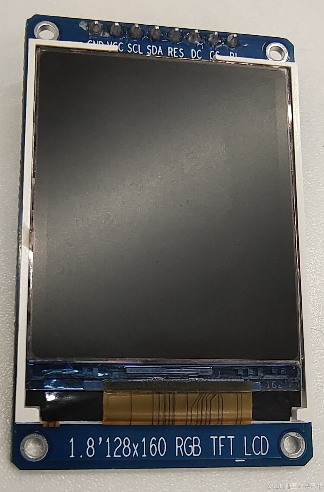

## 二.移植

### 1.例程

首先找厂家要了例程，例程里是F1的驱动程序：

#### 物理接口：

 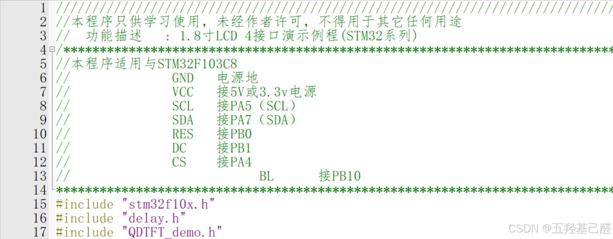

可见例程为软件SPI驱动。

#### 延时函数：

```cobol
#include "stm32f10x.h"
#include "delay.h" 
static u8  fac_us=0;//us延时倍乘数
static u16 fac_ms=0;//ms延时倍乘数
//初始化延迟函数
//SYSTICK的时钟固定为HCLK时钟的1/8
//SYSCLK:系统时钟
void delay_init(u8 SYSCLK)
{
	SysTick->CTRL&=0xfffffffb;//bit2清空,选择外部时钟
	fac_us=SYSCLK/8;//HCLK/8		    
	fac_ms=(u16)fac_us*1000;
}
//延时nms
//注意nms的范围
//SysTick->LOAD为24位寄存器,所以,最大延时为:
//nms<=0xffffff*8*1000/SYSCLK
//SYSCLK单位为Hz,nms单位为ms
//对72M条件下,nms<=1864 
void delay_ms(u16 nms)
{	 		  	  
	u32 temp;		   
	SysTick->LOAD=(u32)nms*fac_ms;//时间加载(SysTick->LOAD为24bit)
	SysTick->VAL =0x00;           //清空计数器
	SysTick->CTRL=0x01 ;          //开始倒数  
	do
	{
		temp=SysTick->CTRL;
	}
	while(temp&0x01&&!(temp&(1<<16)));//等待时间到达   
	SysTick->CTRL=0x00;       //关闭计数器
	SysTick->VAL =0X00;       //清空计数器	  	    
}   
//延时nus
//nus为要延时的us数.		    								   
void delay_us(u32 nus)
{		
	u32 temp;	    	 
	SysTick->LOAD=nus*fac_us; //时间加载	  		 
	SysTick->VAL=0x00;        //清空计数器
	SysTick->CTRL=0x01 ;      //开始倒数 	 
	do
	{
		temp=SysTick->CTRL;
	}
	while(temp&0x01&&!(temp&(1<<16)));//等待时间到达   
	SysTick->CTRL=0x00;       //关闭计数器
	SysTick->VAL =0X00;       //清空计数器	 
}
```

这个延时函数是很经典的写法，详解可见： [【总结】单片机重点知识总结记录（存储管理+STM32滴答定时器）-CSDN博客](https://blog.csdn.net/2203_75993546/article/details/142642729?fromshare=blogdetail&sharetype=blogdetail&sharerId=142642729&sharerefer=PC&sharesource=2203_75993546&sharefrom=from_link) 

#### 底层驱动文件：

 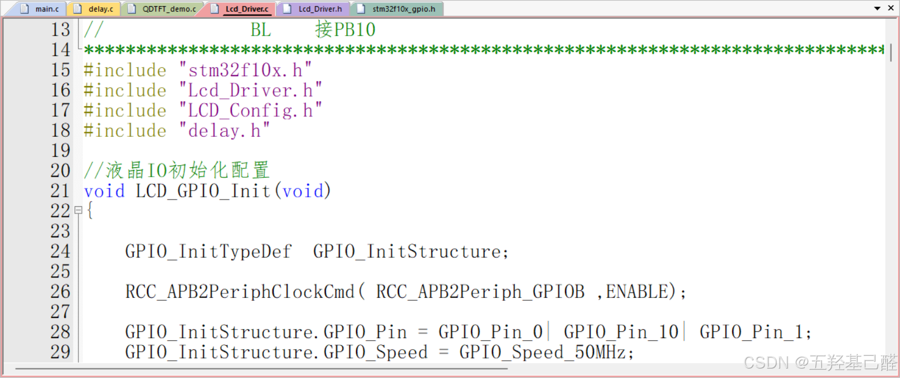

这个文件包含GPIO初始化以及软件SPI时序的实现。

#### GUI界面文件：

 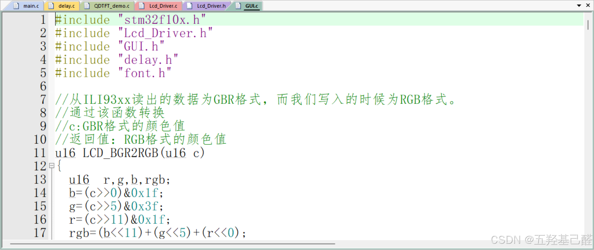

主要是实现UI界面的功能函数。

#### 测试demo：

 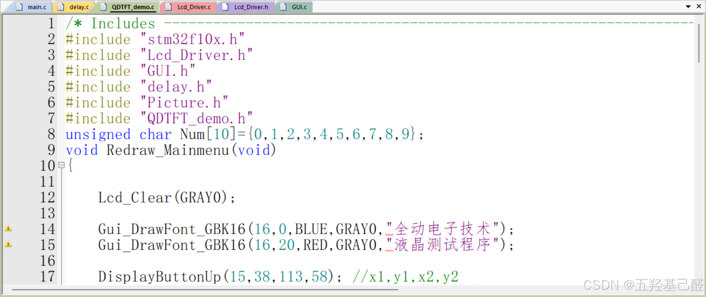

### 2.移植至F4

#### 创建工程：

笔者选择使用CubeMX创建工程，Hal库开发：

 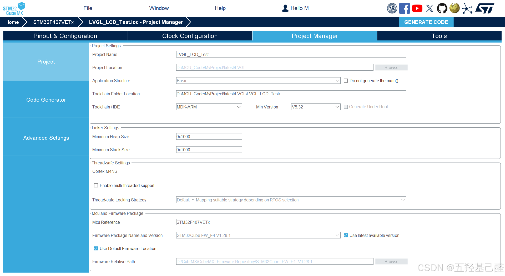

##### 调试接口选择SW：

 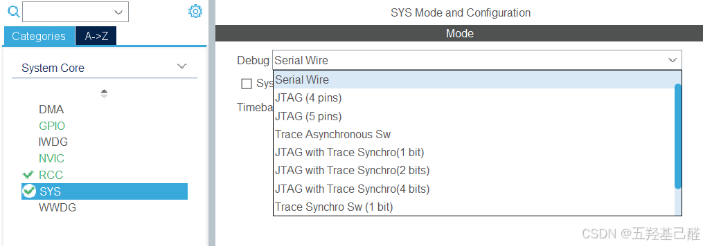

##### RCC中HSE选择外部晶振：

 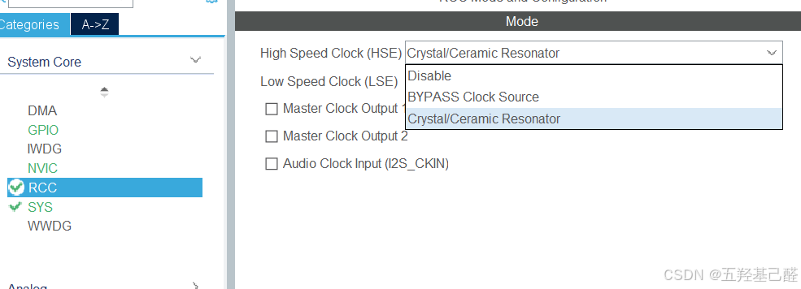

##### GPIO配置不变：

 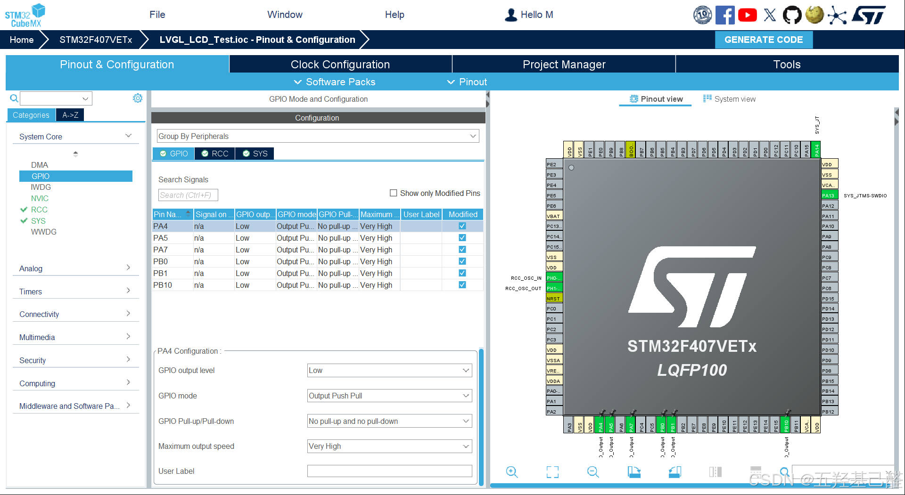

##### 时钟树暂时仍固定72MHz：

 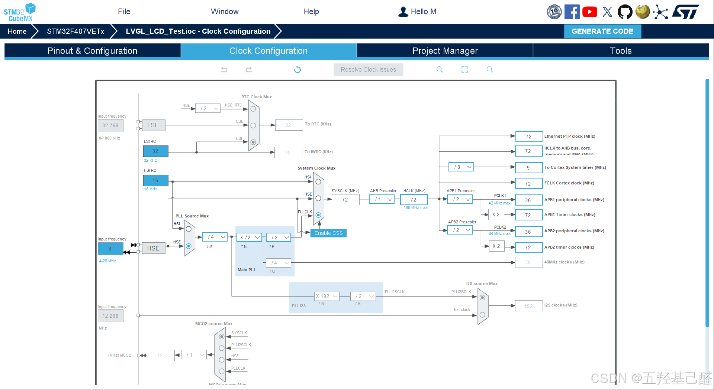

然后生成工程即可。

#### 导入文件：

在工程文件夹中创建一个LCD文件夹复制例程文件至此：

 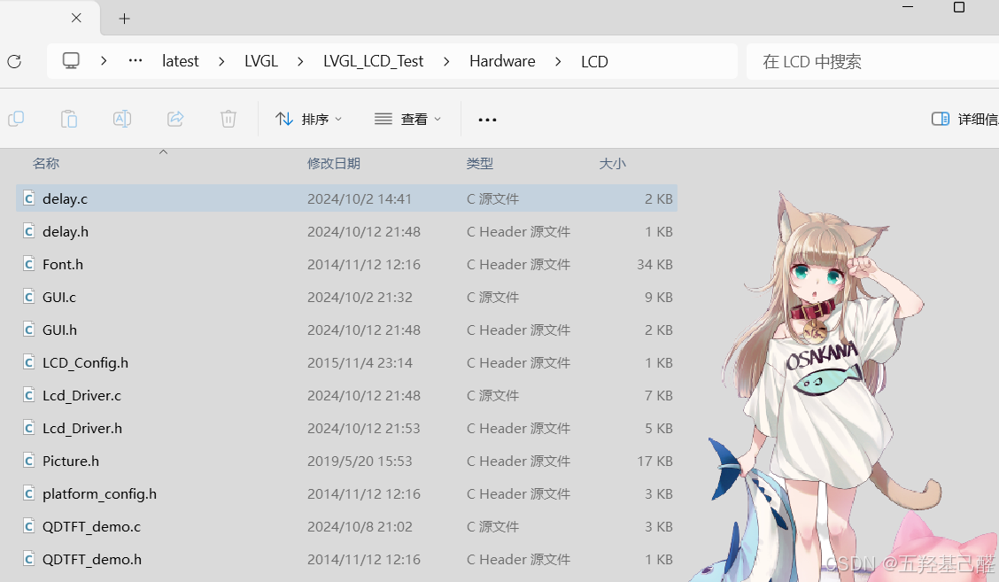

头文件路径添加LCD文件夹： 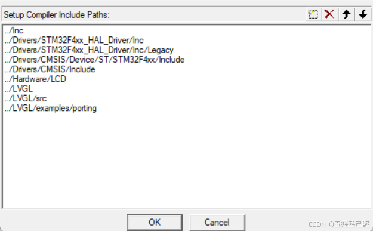

#### 修改文件：

##### 前置：

向所有.h文件(用了u8,u16,u32的)中添加以下定义：

```cpp
#ifndef u8
#define u8 uint8_t
#endif
 
#ifndef u16
#define u16 uint16_t
#endif
 
#ifndef u32
#define u32 uint32_t
#endif
```

##### ！Lcd_Driver.h文件！

这个文件很重要。

添加#include "stdint.h"头文件，并

 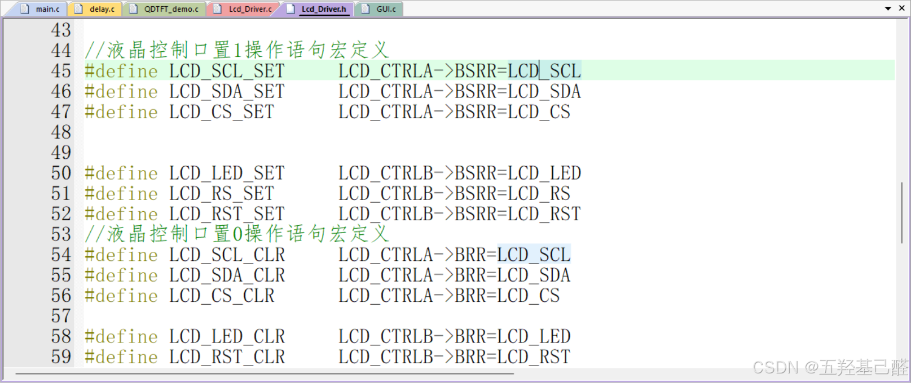

将以上宏定义都改为：

```cpp
//液晶控制口置1操作语句宏定义
 
#define	LCD_SCL_SET  	LCD_CTRLA->BSRR=LCD_SCL     
#define	LCD_SDA_SET  	LCD_CTRLA->BSRR=LCD_SDA    
#define	LCD_CS_SET  	LCD_CTRLA->BSRR=LCD_CS 
    
#define	LCD_LED_SET  	LCD_CTRLB->BSRR=LCD_LED   
#define	LCD_RS_SET  	LCD_CTRLB->BSRR=LCD_RS 
#define	LCD_RST_SET  	LCD_CTRLB->BSRR=LCD_RST
//液晶控制口置0操作语句宏定义
 
#define	LCD_SCL_CLR  	LCD_CTRLA->BSRR = (uint32_t)LCD_SCL << 16U  
#define	LCD_SDA_CLR  	LCD_CTRLA->BSRR = (uint32_t)LCD_SDA << 16U   
#define	LCD_CS_CLR  	LCD_CTRLA->BSRR = (uint32_t)LCD_CS << 16U  
                        
#define	LCD_LED_CLR  	LCD_CTRLB->BSRR = (uint32_t)LCD_LED << 16U    
#define	LCD_RST_CLR  	LCD_CTRLB->BSRR = (uint32_t)LCD_RST << 16U    
#define	LCD_RS_CLR  	LCD_CTRLB->BSRR = (uint32_t)LCD_RS << 16U
```

至于原因在这里不过多赘述，详情参考： [【总结】单片机重点知识总结记录（存储管理+STM32滴答定时器）-CSDN博客](https://blog.csdn.net/2203_75993546/article/details/142642729?fromshare=blogdetail&sharetype=blogdetail&sharerId=142642729&sharerefer=PC&sharesource=2203_75993546&sharefrom=from_link) 

##### Lcd_Driver.c文件

中添加F4的头文件，去掉delay.h；初始化函数可以全部注释掉（因为我们已经在CubeMX中配置过相应的GPIO了）；同时把文件中所有delay_ms()改成相应的HAL_Delay()：

 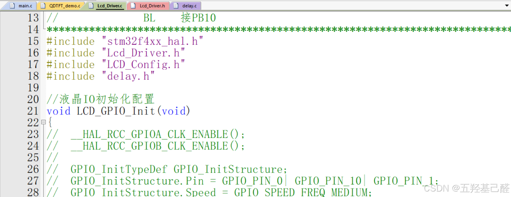

##### GUI.h文件

添加#include "stdint.h"

##### GUI.c文件

添加F4头文件，并替换延时函数为HAL_Delay()：

 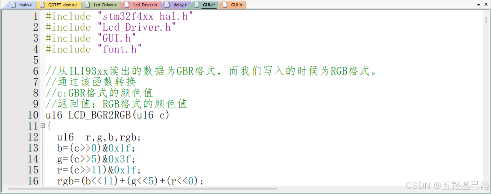

##### GUITFT_demo.c文件

添加头文件，并修改延时函数，同时所有的测试字符串使用强制转换为指针类型，如下：

 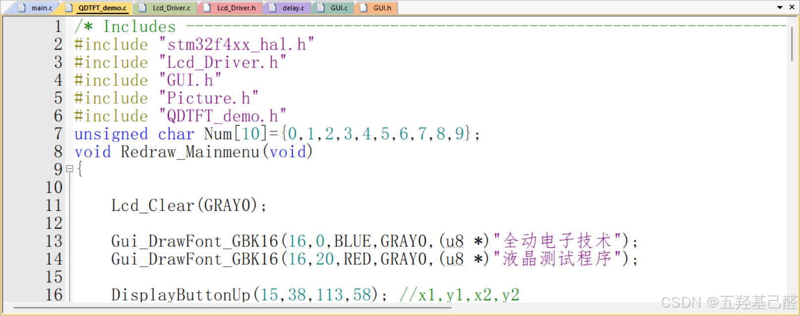

##### 向主函数中添加驱动文件

 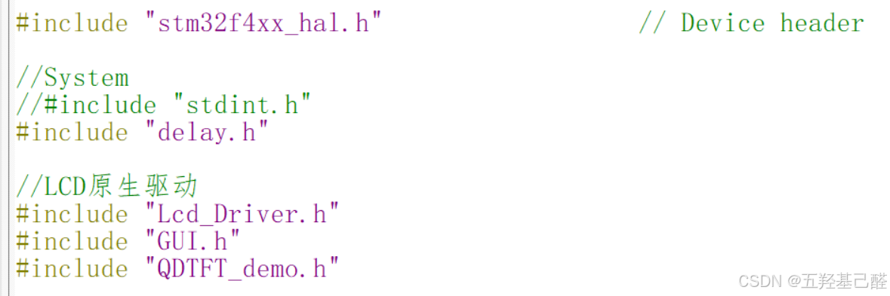

### 三.测试

在主函数中添加demo函数测试：

```cpp
while (1)
  {
		QDTFT_Test_Demo();
	  
    /* USER CODE END WHILE */
 
    /* USER CODE BEGIN 3 */
  }
```

编译下载：

 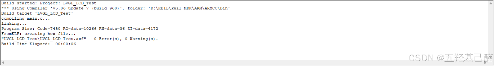

！！！成功！！！

 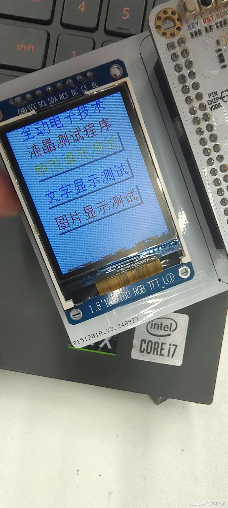

 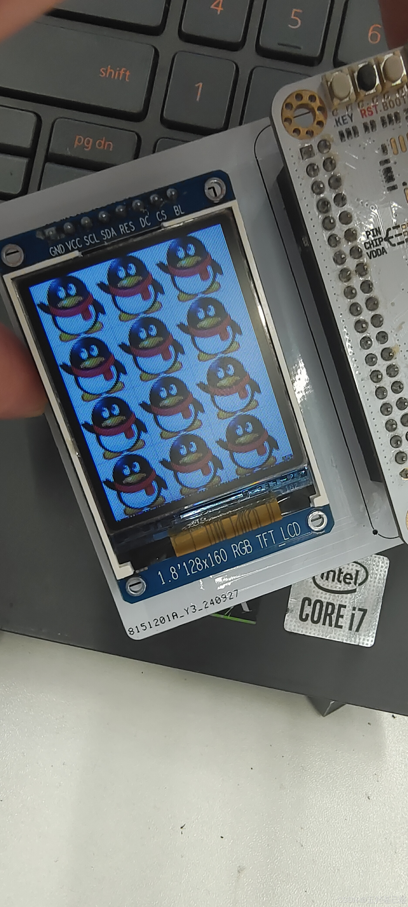

