# 【TI速成】半小时入门MSPM0G3507简明教程(电赛官方板卡快速上手)

> 原创 已于 2025-04-27 13:23:36 修改 · 粉丝可见 · 1.5w 阅读 · 153 · 486 · 本内容遵循CC 4.0 BY-SA版权协议 版权声明：本文为博主原创文章，遵循 CC 4.0 BY 版权协议，转载请附上原文出处链接和本声明。 GEO检测 · 编辑
> 文章链接：https://menoking.blog.csdn.net/article/details/140253430

**目录**

[TOC]


## 前言

笔者github链接如下： [menoking (Meno)](https://github.com/menoking) 

MSPM0系列库文件/PID小车开发模板工程链接： [menoking/PIDCarTemplate_TI_MSPM0G3507: Learning](https://github.com/menoking/PIDCarTemplate_TI_MSPM0G3507) 

还望各位点个star。

## 0.某些概念补充：

---

> **！！！所有Sysconfig中的配置都更新在ti_msp_dl_config.h中，每次配置完必须重新保存文件！！！** 

---

***MCLK:主系统时钟，为PD1外设提供总线时钟（BUSCLK）；*** 

***ULPCLK：低功耗时钟，为PD0外设提供总线时钟，系统初始化为32MHz；*** 

*****LFCLK：**低频时钟，就是低频振荡器输出的32.768KHz；*** 

***CPUCLK：CPU运行时钟；*** 

***MFCLK：中频时钟，固定4MHz不变，使用的是SYSOC振荡器分频来，系统初始化默认关闭，需要软件打开；*** 

***MFPCLK：中频精准时钟，这个是作为时钟输出用的4MHz时钟，在SLEEP，STOP等低功耗模式下也可以持续输出；*** 

---

## 1.点灯

首先是传统点灯，在sysconfig中配置完GPIO后写一段控制语句即可

```scss
DL_GPIO_clearPins(PORTB_PORT, PORTB_LED_RED_PIN);   // 红色LED亮
DL_GPIO_setPins(PORTB_PORT, PORTB_LED_RED_PIN);     // 红色LED灭
DL_GPIO_togglePins(PORTB_PORT, PORTB_LED_RED_PIN);  // 红色LED翻转
```

使用sysconfig配置时要注意将配置文件覆盖保存，否则配置不会生效

 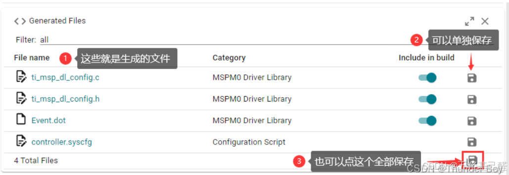

## 2.时钟配置

在SYSCTL选项卡中勾选Use Clock Tree即可使用时钟树

 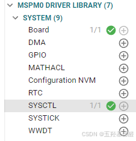

 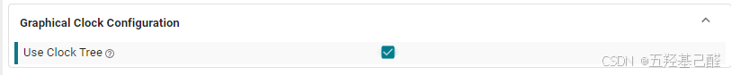

在时钟树中使能外部时钟，主频拉满 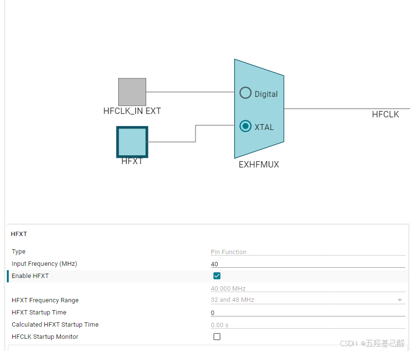

 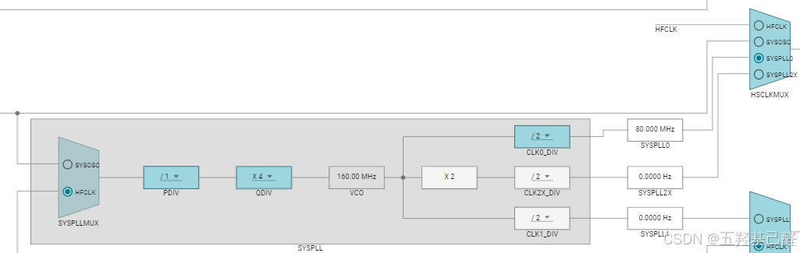

 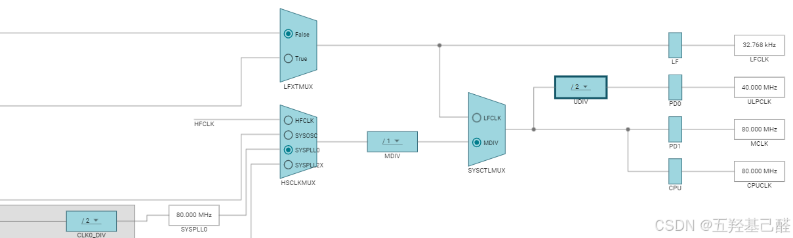

## 3.按键

GPIO读取函数为

```scss
DL_GPIO_readPins(PORTA_PORT,PORTA_KEY1_PIN);
```

注意这个函数的返回值为GPIO的地址，如DL_GPIO_PIN_18对应0x00040000，DL_GPIO_PIN_19对应0x00080000等。

故对引脚电平的读取应为

```cobol
/*----------------------------读取方式1------------------------------*/
/* 高电平的判断方式 */
if (DL_GPIO_readPins(KEY2_PORT, KEY2_PIN2_PIN) > 0) // 若引脚为高电平
{
	/* 用户代码 */
}
/*----------------------------读取方式2------------------------------*/
/* 低电平的判断方式 */
if (DL_GPIO_readPins(KEY2_PORT, KEY2_PIN2_PIN) == 0) // 若引脚为低电平
{
	/* 用户代码 */
}
/*----------------------------读取方式3------------------------------*/
/* 高、低电平的判断方式 */
if (DL_GPIO_readPins(KEY2_PORT, KEY2_PIN2_PIN)) // 若引脚为高电平
{
	/* 用户代码 */
}
else // 不是高电平，那就是低电平
{
	/* 用户代码 */
}
/*-------------------------------------------------------------------*/
```

## 4.定时器

 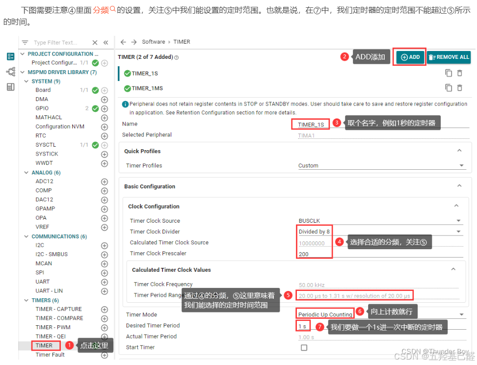

 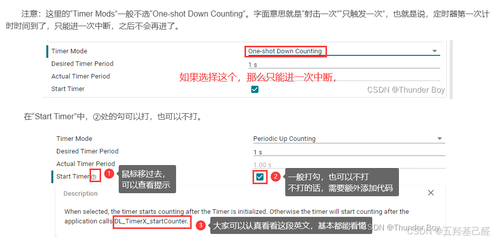

 

！！！注：这里的中断使能触发事件一定要选择，否则不会进入中断

 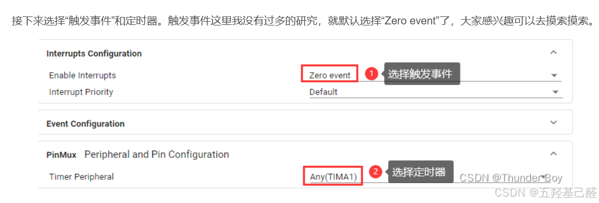

中断服务例程的命名：

```cobol
/* Defines for TIMER_1S */
#define TIMER_1S_INST                                                    (TIMA1)
#define TIMER_1S_INST_IRQHandler                                TIMA1_IRQHandler
#define TIMER_1S_INST_INT_IRQN                                  (TIMA1_INT_IRQn)
#define TIMER_1S_INST_LOAD_VALUE                                        (49999U)
/* Defines for TIMER_1MS */
#define TIMER_1MS_INST                                                   (TIMA0)
#define TIMER_1MS_INST_IRQHandler                               TIMA0_IRQHandler
#define TIMER_1MS_INST_INT_IRQN                                 (TIMA0_INT_IRQn)
#define TIMER_1MS_INST_LOAD_VALUE                                          (99U)
```

例如：

```java
void TIMER_1S_INST_IRQHandler(void)
void TIMER_1MS_INST_IRQHandler(void)
```

匹配中断：

```cobol
typedef enum {
    /*! Timer interrupt index for zero interrupt */
    DL_TIMER_IIDX_ZERO = GPTIMER_CPU_INT_IIDX_STAT_Z,
    /*! Timer interrupt index for load interrupt */
    DL_TIMER_IIDX_LOAD = GPTIMER_CPU_INT_IIDX_STAT_L,
    /*! Timer interrupt index for compare 0 down interrupt */
    DL_TIMER_IIDX_CC0_DN = GPTIMER_CPU_INT_IIDX_STAT_CCD0,
    /*! Timer interrupt index for compare 1 down interrupt */
    DL_TIMER_IIDX_CC1_DN = GPTIMER_CPU_INT_IIDX_STAT_CCD1,
    /*! Timer interrupt index for compare 2 down interrupt */
    DL_TIMER_IIDX_CC2_DN = GPTIMER_CPU_INT_IIDX_STAT_CCD2,
    /*! Timer interrupt index for compare 3 down interrupt */
    DL_TIMER_IIDX_CC3_DN = GPTIMER_CPU_INT_IIDX_STAT_CCD3,
    /*! Timer interrupt index for compare 0 up interrupt */
    DL_TIMER_IIDX_CC0_UP = GPTIMER_CPU_INT_IIDX_STAT_CCU0,
    /*! Timer interrupt index for compare 1 up interrupt */
    DL_TIMER_IIDX_CC1_UP = GPTIMER_CPU_INT_IIDX_STAT_CCU1,
    /*! Timer interrupt index for compare 2 up interrupt */
    DL_TIMER_IIDX_CC2_UP = GPTIMER_CPU_INT_IIDX_STAT_CCU2,
    /*! Timer interrupt index for compare 3 up interrupt */
    DL_TIMER_IIDX_CC3_UP = GPTIMER_CPU_INT_IIDX_STAT_CCU3,
 
    /*! Timer interrupt index for compare 4 down interrupt */
    DL_TIMER_IIDX_CC4_DN = GPTIMER_CPU_INT_IIDX_STAT_CCD4,
    /*! Timer interrupt index for compare 5 down interrupt */
    DL_TIMER_IIDX_CC5_DN = GPTIMER_CPU_INT_IIDX_STAT_CCD5,
    /*! Timer interrupt index for compare 4 up interrupt */
    DL_TIMER_IIDX_CC4_UP = GPTIMER_CPU_INT_IIDX_STAT_CCU4,
    /*! Timer interrupt index for compare 5 up interrupt */
    DL_TIMER_IIDX_CC5_UP = GPTIMER_CPU_INT_IIDX_STAT_CCU5,
 
    /*! Timer interrupt index for fault interrupt */
    DL_TIMER_IIDX_FAULT = GPTIMER_CPU_INT_IIDX_STAT_F,
    /*! Timer interrupt index for timer overflow interrupt */
    DL_TIMER_IIDX_OVERFLOW = GPTIMER_CPU_INT_IIDX_STAT_TOV,
    /*! Timer interrupt index for repeat counter
     * @note <b> This is a Timer A specific interrupt. </b>
     */
    DL_TIMER_IIDX_REPEAT_COUNT = GPTIMER_CPU_INT_IIDX_STAT_REPC,
    /*! Timer interrupt index for direction change interrupt
     * @note <b> Please refer the Timer TRM to determine TIMG instances which
     * support this feature. </b> */
    DL_TIMER_IIDX_DIR_CHANGE = GPTIMER_CPU_INT_IIDX_STAT_DC,
} DL_TIMER_IIDX;
```

示例程序：

```cobol
#include "ti_msp_dl_config.h"
 
#define DELAY (16000000)
int i = 0;
 
int main(void)
{
	SYSCFG_DL_init();//芯片资源初始化，由sysconfig配置
	NVIC_EnableIRQ(TIMER_0_INST_INT_IRQN);//开启中断管理
	DL_TimerA_startCounter(TIMER_0_INST);//开启定时器
	DL_GPIO_setPins(LED_PORT,LED_LED0_PIN);//LED初始状态
	
	while(1)
	{
		
	}
}
//TIMER_0中断服务例程
void TIMER_0_INST_IRQHandler(void)
{
    switch (DL_TimerA_getPendingInterrupt(TIMER_0_INST)) 
	{
        case DL_TIMER_IIDX_ZERO:
            DL_GPIO_togglePins(LED_PORT,LED_LED0_PIN);
	        i++;
        break;
    }
    //在只开启单个定时器的情况下，不使用switch也可以
    //DL_GPIO_togglePins(LED_PORT,LED_LED0_PIN);
	//i++;
}
```

## 4.PWM

取名 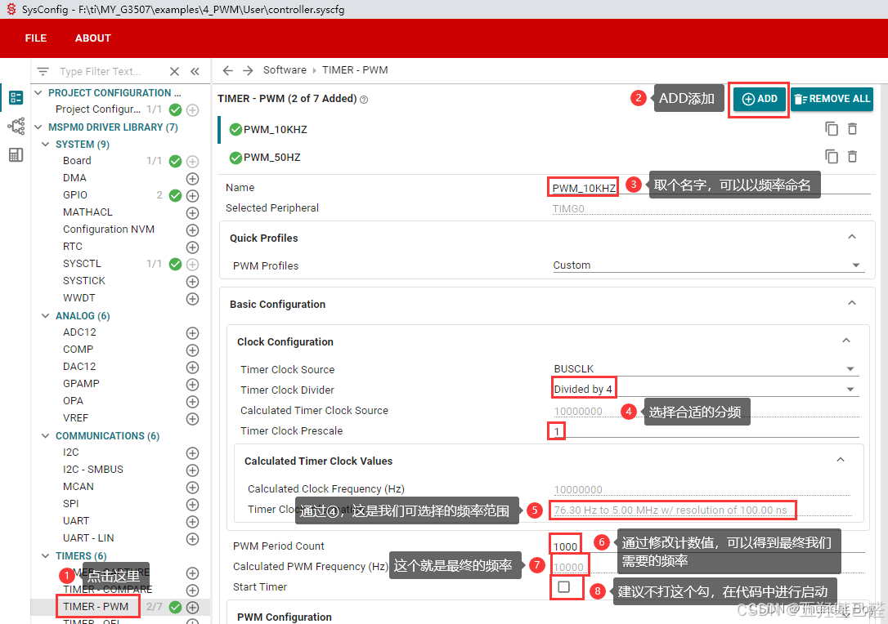

 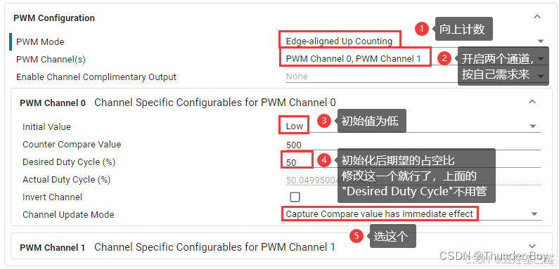

对于配置文件中的一些宏定义：

```cobol
/* GPIO defines for channel 0 */
#define GPIO_PWM_Test_C0_PORT                                              GPIOA
#define GPIO_PWM_Test_C0_PIN                                      DL_GPIO_PIN_12
#define GPIO_PWM_Test_C0_IOMUX                                   (IOMUX_PINCM34)
#define GPIO_PWM_Test_C0_IOMUX_FUNC                  IOMUX_PINCM34_PF_TIMG0_CCP0
#define GPIO_PWM_Test_C0_IDX                                 DL_TIMER_CC_0_INDEX
```

> 
> 
> 1. **`GPIO_PWM_Test_C0_PORT` : 定义了用于PWM测试的通道0所使用的GPIO端口，这里是 `GPIOA` 。**
> 
> 2. **`GPIO_PWM_Test_C0_PIN` : 指定了GPIO端口上的具体引脚，这里是 `DL_GPIO_PIN_12` ，意味着使用的是GPIOA端口上的第12号引脚。**
> 
> 3. **`GPIO_PWM_Test_C0_IOMUX` : IOMUX（Input/Output Multiplexer）是指引脚复用功能，它允许同一个物理引脚实现多种不同的功能。这里 `IOMUX_PINCM34` 是与GPIOA_12引脚对应的IOMUX编号。**
> 
> 4. **`GPIO_PWM_Test_C0_IOMUX_FUNC` : 指明了GPIOA_12引脚在IOMUX配置中的具体功能，这里是 `IOMUX_PINCM34_PF_TIMG0_CCP0` ，表示该引脚被配置为定时器组0（TIMG0）的捕获比较单元0（CCP0）的输入，用于PWM输出。**
> 
> 5. **`GPIO_PWM_Test_C0_IDX` : 这个宏定义了定时器的捕获/比较单元的索引，在本例中是 `DL_TIMER_CC_0_INDEX` ，意味着这是定时器0的第0个捕获/比较单元。**
> 
> 

为了调节PWM的占空比，我们需要用到 **DL_TimerA_setCaptureCompareValue()** 这个函数。它有三个入口参数，第一个为选择哪个定时器，第二个为占空比，第三个为PWM通道索引。

```cobol
DL_TimerA_setCaptureCompareValue(PWM_10KHZ_INST, 10, DL_TIMER_CC_0_INDEX);
```

主函数中开启定时器

```scss
#include "ti_msp_dl_config.h"
 
 
int main(void)
{
	SYSCFG_DL_init(); // 芯片资源初始化,由SysConfig配置软件自动生成
	DL_TimerA_startCounter(PWM_10KHZ_INST);//开始计数
	DL_TimerA_startCounter(PWM_50HZ_INST);//开始计数
	while(1)
	{
		Motor(20,40); // 左电机25的速度，右电机50的速度，简洁明了
		Servo_Motor(60,80); // 舵机PWM控制
	}
}
```

修改占空比使用

```cobol
void Motor(uint16_t motor_left_speed, uint16_t motor_right_speed)
{
    if ((motor_left_speed > 95) || (motor_right_speed > 95)) // 一定要限制！！！
        return; // PWM占空比不允许大于95%，否则就直接退出
    DL_TimerA_setCaptureCompareValue(PWM_10KHZ_INST, motor_left_speed  * 10, DL_TIMER_CC_0_INDEX);
    DL_TimerA_setCaptureCompareValue(PWM_10KHZ_INST, motor_right_speed * 10, DL_TIMER_CC_1_INDEX);
}
```

## 5.串口UART

### 特殊概念：

> ####  <u>UART (Universal Asynchronous Receiver/Transmitter)</u> 
> 
> <u>UART是一种标准的串行通信协议，用于在两个设备之间传输数据。</u> 
> 
> ####  <u>UART-LIN (Local Interconnect Network over UART)</u> 
> 
> <u>UART-LIN则是在UART基础上增加了一套LIN（Local Interconnect Network）协议的支持。LIN是一种轻量级的串行通信协议，主要用于汽车行业的辅助网络中，连接汽车内部的各种传感器、执行器和其他ECU（Electronic Control Unit）</u> 

对于配置文件生成的串口相关的宏：

```cobol
#define UART_0_INST                                                        UART0
#define UART_0_INST_IRQHandler                                  UART0_IRQHandler
#define UART_0_INST_INT_IRQN                                      UART0_INT_IRQn
#define GPIO_UART_0_RX_PORT                                                GPIOA
#define GPIO_UART_0_TX_PORT                                                GPIOA
#define GPIO_UART_0_RX_PIN                                        DL_GPIO_PIN_11
#define GPIO_UART_0_TX_PIN                                        DL_GPIO_PIN_10
#define GPIO_UART_0_IOMUX_RX                                     (IOMUX_PINCM22)
#define GPIO_UART_0_IOMUX_TX                                     (IOMUX_PINCM21)
#define GPIO_UART_0_IOMUX_RX_FUNC                      IOMUX_PINCM22_PF_UART0_RX
#define GPIO_UART_0_IOMUX_TX_FUNC                      IOMUX_PINCM21_PF_UART0_TX
#define UART_0_BAUD_RATE                                                  (9600)
#define UART_0_IBRD_40_MHZ_9600_BAUD                                       (260)
#define UART_0_FBRD_40_MHZ_9600_BAUD                                        (27)
```

> 
> 
> - `UART_0_INST` : 定义了UART_0模块的实例，这里是 `UART0` ，这是微控制器上UART模块的硬件标识符。
> 
> - `UART_0_INST_IRQHandler` : UART_0的中断服务函数名，当UART_0有中断请求时，处理器将跳转到 `UART0_IRQHandler` 这个函数。
> 
> - `UART_0_INST_INT_IRQN` : UART_0中断的IRQ（Interrupt Request）编号，这是在中断向量表中的位置，对应于 `UART0_INT_IRQn`
> 
> - `GPIO_UART_0_RX_PORT` 和 `GPIO_UART_0_TX_PORT` : UART_0的接收和发送引脚所在的GPIO端口，都是 `GPIOA` 。
> 
> - `GPIO_UART_0_RX_PIN` 和 `GPIO_UART_0_TX_PIN` : 分别定义了接收和发送数据的GPIO引脚编号，分别是 `DL_GPIO_PIN_11` 和 `DL_GPIO_PIN_10` 。
> 
> - `GPIO_UART_0_IOMUX_RX` 和 `GPIO_UART_0_IOMUX_TX` : 定义了接收和发送引脚的IOMUX（Input/Output Multiplexer，输入/输出多路复用器）设置，用于指定引脚的复用功能。 `IOMUX_PINCM22_PF_UART0_RX` 和 `IOMUX_PINCM21_PF_UART0_TX` 表示GPIOA_11和GPIOA_10引脚被配置为UART0的RX和TX功能。
> 
> - `UART_0_BAUD_RATE` : 设置UART_0的波特率，这里是9600bps。
> 
> - `UART_0_IBRD_40_MHZ_9600_BAUD` 和 `UART_0_FBRD_40_MHZ_9600_BAUD` : 这些宏定义了用于计算波特率的整数部分和分数部分的值。在MSPM0系列微控制器中，UART模块使用IBRD（Integer Baud Rate Divisor，整数波特率除数）和FBRD（Fractional Baud Rate Divisor，小数波特率除数）寄存器来设置波特率。这些值是根据微控制器的时钟频率（这里是40MHz）和期望的波特率（9600bps）计算出来的。
> 
> 

```cobol
#include "ti_msp_dl_config.h"
 
char receivedChar;
 
int main(void)
{
	SYSCFG_DL_init();
	NVIC_EnableIRQ(UART_0_INST_INT_IRQN); //使能中断
	//DL_SYSCTL_enableSleepOnExit();//空闲或任务结束时进入睡眠模式
	while(1)
	{
		
	}
}
 
void UART_0_INST_IRQHandler(void)//串口中断处理例程
{
	if (DL_UART_Main_getPendingInterrupt(UART_0_INST) == DL_UART_MAIN_IIDX_RX)
    {
        // 处理接收的字符
        receivedChar = DL_UART_Main_receiveData(UART_0_INST);
        // 进一步处理接收到的数据
		DL_UART_Main_transmitData(UART_0_INST, receivedChar); 
    }
}
```

！！！NVIC_ClearPendingIRQ(UART_0_INST_INT_IRQN);这句一定不能加！！！