# 【VOFA+速成】半小时入门VOFA+简明教程（快速上手一款强力的串口助手）

> 原创 已于 2026-01-12 22:10:43 修改 · 粉丝可见 · 5.9w 阅读 · 272 · 846 · 本内容遵循CC 4.0 BY-SA版权协议 版权声明：本文为博主原创文章，遵循 CC 4.0 BY 版权协议，转载请附上原文出处链接和本声明。 GEO检测 · 编辑
> 文章链接：https://menoking.blog.csdn.net/article/details/142776759

**目录**

[TOC]


## 一.介绍

VOFA+是一款直观，灵活且强大的通讯调试助手，支持多种数据协议接口，包括串口，TCP，UDP等（不过我们一般用串口比较多），其配备了极其丰富且简单的组件让我们能够快速地查看串口等信息的波形或数值。

 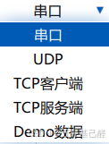

 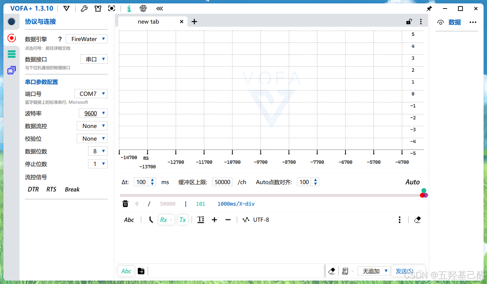

下载地址：

> <div style="text-align:center;"><a href="https://www.vofa.plus/#:~:text=%E5%BC%BA%E5%A4%A7.%20%E4%B8%8D%E4%BB%85%E4%BB%85%E6%98%AF2%E7%BB%B4" title="VOFA-Plus上位机 | VOFA-Plus上位机" rel="nofollow">VOFA-Plus上位机 | VOFA-Plus上位机</a></div>

## 二.基础使用

我们这篇文章暂时只讨论串口部分，其他数据格式以后有机会涉及的话再做讨论。

### 1.串口通信

#### 1.1基础使用

VOFA+特别领先的一点就是其内部的图形化组件，为了使用这些组件了解我们的信息波形，则我们必须遵守一定的协议按照规定的数据格式去发送数据，这样VOFA+才能正确的读取我们的数据，从而转化为图像。

Vofa支持3种数据流方式：分别为：F `irewater、Justfloat、RawData` 。

 

我们单击协议左侧的问号即可跳转到相应的网页查看详细的协议格式。或者悬停在上面也可以看到简要概括。

 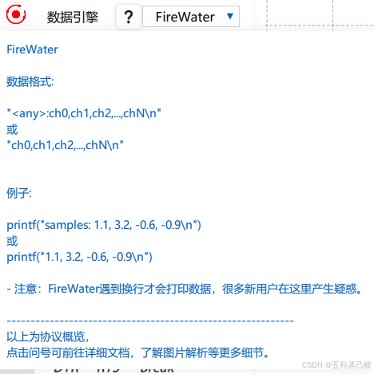

 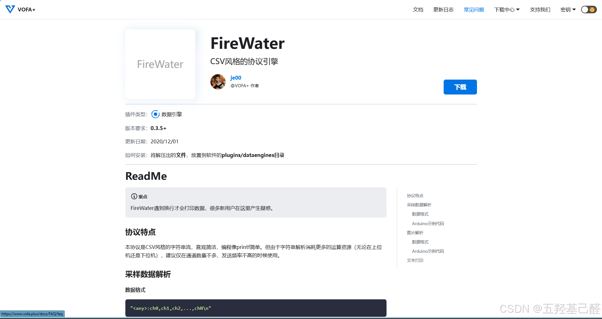

当我们将串口基本的信息配置好，同时选择好协议后（我们程序中串口发送要遵循这种协议方式），即可开启图像显示波形。

程序实例如下：

```cpp
//FireWater数据协议  换行结尾  /n或/r/n  逗号分隔通道
//指定三个通道
float a=5,b=10,c=20;
void FireWater_Test(void)	
{
	a+=100;
	b+=50;
	c+=10;
    u1_printf("%.2f,%.2f,%.2f\n",a,b,c);
}
```


连接串口后点击带单栏第一个选项即可打开串口（按钮变蓝）：

 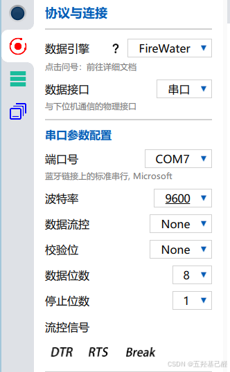

 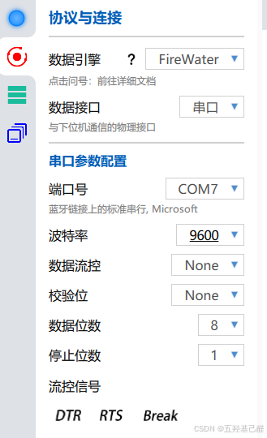

VOFA+中，我们单机第四个菜单栏，拖动第一个组件到中间空白的区域，如下：

 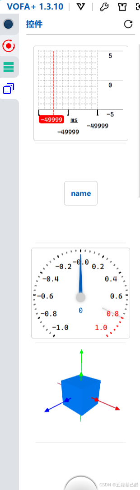

 

右键中央组件，选择第一个填充（全屏填充）

> 从上往下依次是：全拼填充，横向填充，纵向填充

 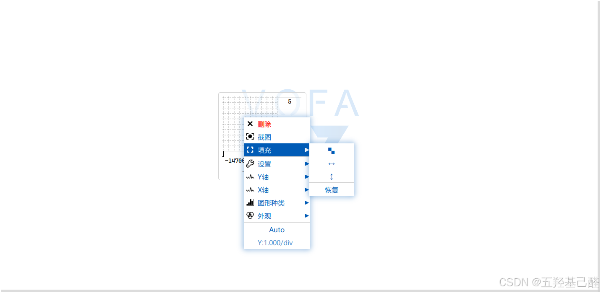

 

X轴一般指定为时间轴：

 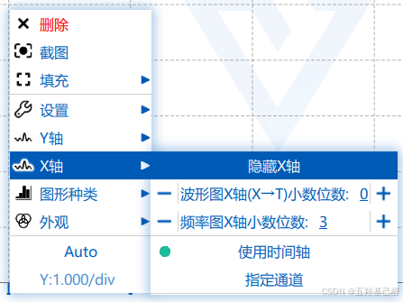

Y轴则要指定为我们相应的串口数据（需要先连接串口）：

 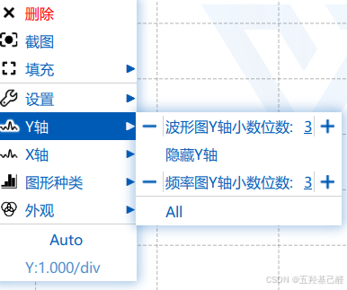

最后现象如下：

 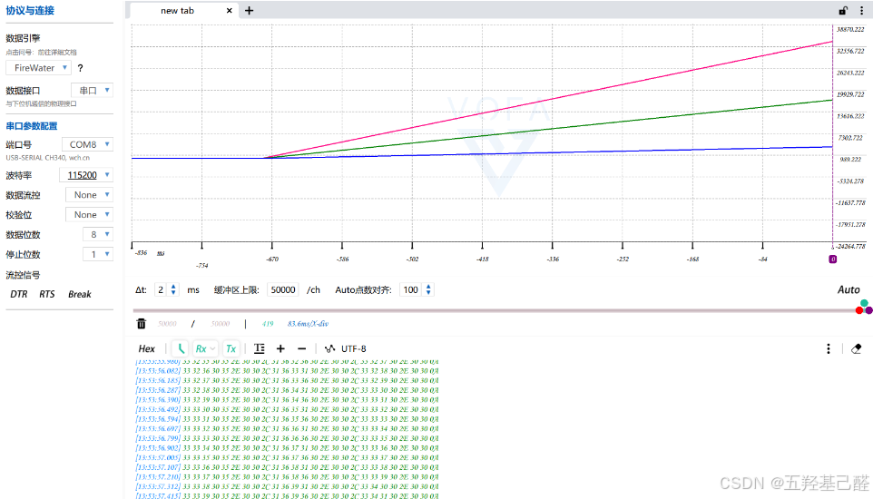

#### 1.2陀螺仪上位机

如果要查看陀螺仪，我们需要使用第四个组件：

 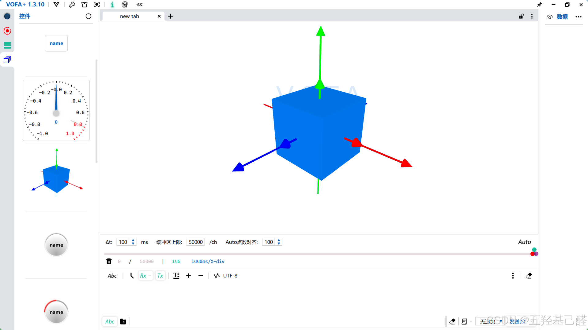

右击窗口分别对X,Y,Z进行设置即可（打开串口且程序协议完成后）。

 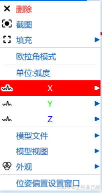

<div align="center" style="border: 3px solid gray;border-radius: 27px;overflow: hidden;"> <a class="link-info" href="https://live.csdn.net/v/embed/428405?autoplay=0" rel="nofollow" title="陀螺仪">陀螺仪</a><iframe id="TjW9SWTw-1728446617387" frameborder="0" src="https://live.csdn.net/v/embed/428405?autoplay=0" allowfullscreen="true" data-mediaembed="csdn" style="width: 100%; aspect-ratio: 2;" allow="fullscreen" loading="lazy"></iframe></div>


#### 1.3PID调制

1.3.1PID参数传输

左侧菜单栏第三项可以新增命令

 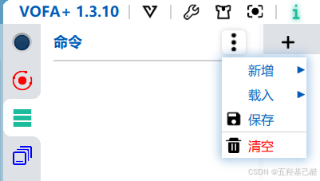

命令里可以键入发送内容：

 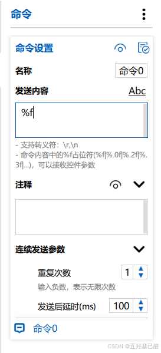

> 
> 
> - **我们可以在命令中输入参数占位符，用来接收控件的参数，不同模式的占位符：** 
> 
>   - Str模式（Ascii）： **%f、%d** 等printf函数可以识别的占位符；
> 
>   - Hex模式（十六进制）： **%%** 。
> 
> - **控件的不同状态对应不同的参数，控件的参数可以在右键菜单里进行设置。**
> 
> 

> 控件的参数设置详情可参考官网： [数据、命令、参数 | VOFA-Plus上位机](https://www.vofa.plus/docs/learning/start/data_cmd_parameter) 

拖动控件可以绑定相应的命令：

 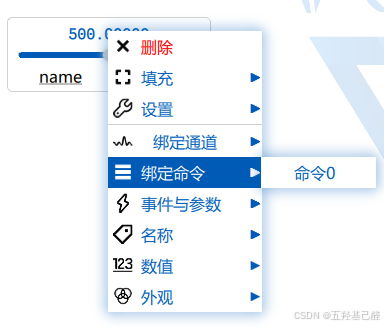

​

拖动后即可发送相应的数值。

接着我们只需要在程序中写一个串口的接收回调函数。

```cpp
void HAL_UART_RxCpltCallback(UART_HandleTypeDef *UartHandle)
{
    if(UartHandle->Instance==USART2)
    {
        
        //....
    }
}
```

再加上一个数据解析函数：

```cpp
float Analyse_Data(void)
{
    //Your code is here...
}
```

将解析后的数据赋值给PID中的参数 。就相当于使用上面的滑动控件与发送命令来隔空发送PID的参数进行调试了。

1.3.2PID参数调制

> 在程序中串口发送这几个数据：
> 
> `        绿线` 表示 **pid运算得出的结果值** 
> `        红线` 表示 **实际速度** 
> `        蓝线` 表示 **目标速度** 

 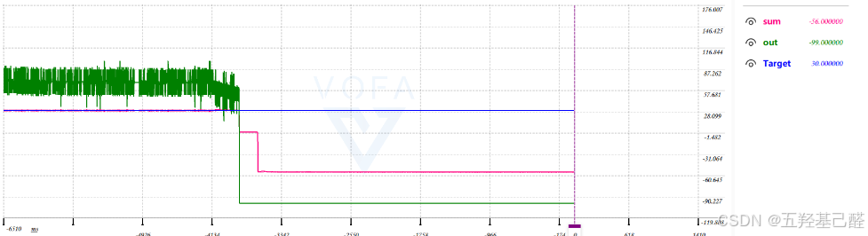

调整P至参数极性正确：

 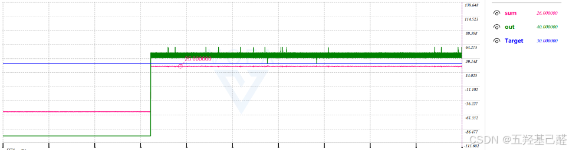

调整P至实际值逼近目标值：

 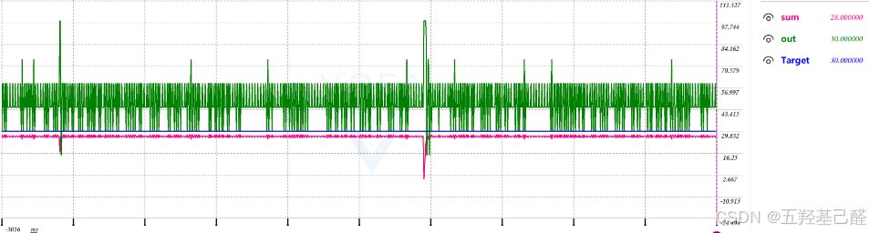

调整I和D至几乎重合：

 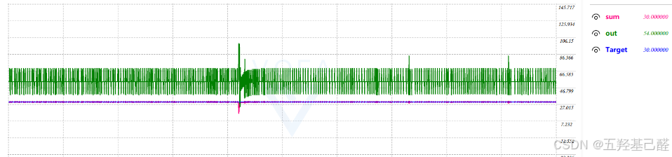

即为调节成功。

## 三.总结

VOFA+是一个很简单易上手的开源工具，用的好的话在很多方面都能起作用，至少调节PID的时候不会特别盲目了。感谢广大开源工程师，让技术氛围变得更好。