# 【半小时入门深度学习】从零开始的Pytorch入门指南

> 原创 已于 2026-06-23 16:50:32 修改 · 公开 · 1.8k 阅读 · 48 · 47 · 本内容遵循CC 4.0 BY-SA版权协议 版权声明：本文为博主原创文章，遵循 CC 4.0 BY 版权协议，转载请附上原文出处链接和本声明。 GEO检测 · 编辑
> 文章链接：https://menoking.blog.csdn.net/article/details/147724527

**目录**

[TOC]

## 一.背景

本文将会从零开始为各位读者构建一个零基础开始的深度学习认知框架。

内容对 [DataLoader的使用_哔哩哔哩_bilibili](https://www.bilibili.com/video/BV1hE411t7RN/?spm_id_from=333.788.videopod.episodes&vd_source=60b7e4846ff8eebbaf6efd46ab66b45a&p=15) 进行分类编撰，仅作为学习笔记交流使用。

### 软件安装与环境配置

本文主要用到的工具有Anaconda，Cuda，Pytorch，Pycharm等工具。以下对这些工具作简单介绍：

> **Anaconda** ：用于创建和管理Python虚拟环境，简化包依赖安装。
> **CUDA** ：NVIDIA推出的GPU并行计算平台，提供深度学习等高性能运算的硬件加速。
> **PyTorch** ：基于动态计算图的深度学习框架，支持GPU加速的张量计算与神经网络构建。
> 
> **Pycharm :** 一款专为Python开发的集成开发环境（IDE）。

环境配置方面本文不再过多赘述，详情参考以下视频：

[【2025年最新版】手把手教你安装PyTorch，用最简单的方式教你安装PyTorch_哔哩哔哩_bilibili](https://www.bilibili.com/video/BV1Kdr8YGE2X/?spm_id_from=333.788.comment.all.click&vd_source=a49266c265b8a8dde07326621277498d) 

#### Anaconda镜像源地址

[Index of /anaconda/archive/ | 清华大学开源软件镜像站 | Tsinghua Open Source Mirror](https://mirrors.tuna.tsinghua.edu.cn/anaconda/archive/) 

#### Cuda官方下载地址

终端键入：

```bash
nvidia-smi
```

可查看设备适配的cuda版本号：

 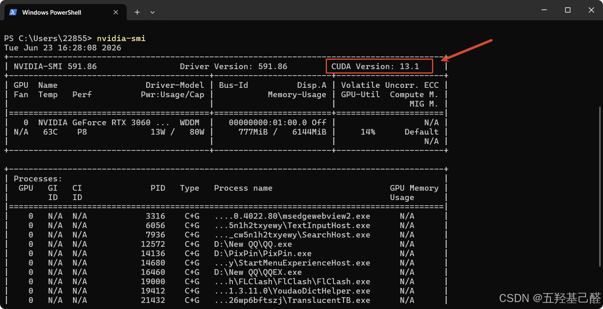

[CUDA Toolkit Archive | NVIDIA Developer](https://developer.nvidia.com/cuda-toolkit-archive) 

#### Pytorch官网

> 注：pytorch仅为框架，只在需要运行的那个环境/虚拟环境安装即可。

[PyTorch](https://pytorch.org/)  

复制相应命令运行即可安装：

 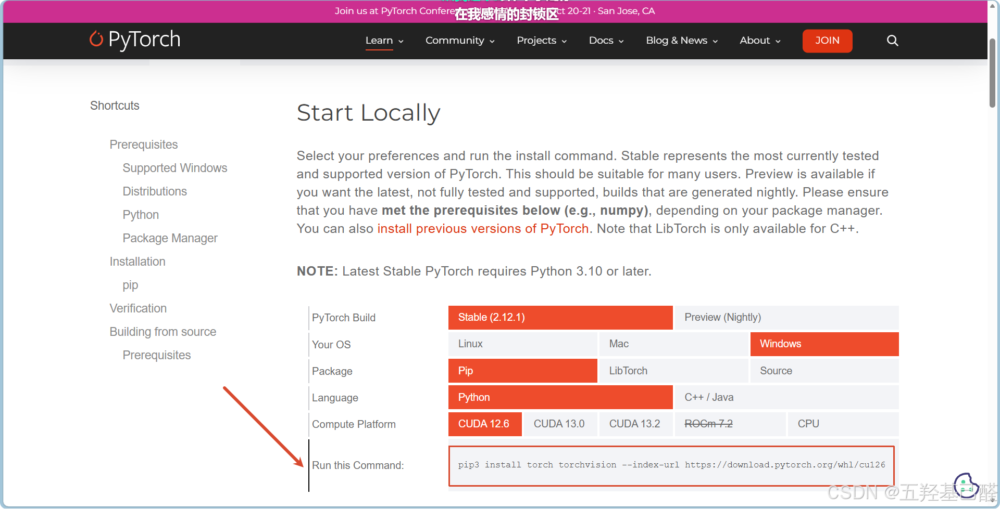

#### Pycharm官网

[下载 PyCharm：JetBrains 出品的用于数据科学和 Web 开发的 Python IDE](https://www.jetbrains.com/zh-cn/pycharm/download/?section=windows)  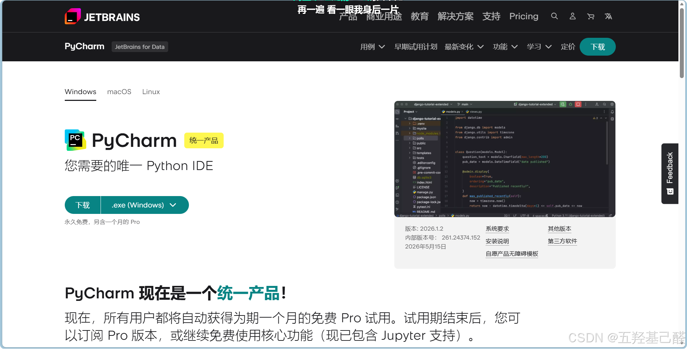

### 食用方法建议

> 建议先熟悉（二）概念大观，对神经网络的专有名词有初步概念；然后可以到（四）进行正式学习，学习熟悉完所讲述的所有方法函数及概念后，可以对照（三）用法速览进行回顾，最后按照（五）标准范式整体熟悉简单网络的构建。

## 二.概念大观

> 
> 
> - **张量Tenso** r：类比向量或矩阵，张量是描述更高维度物体的量。
> 
> - 梯度：函数变化最快的方向。
> 
> - 卷积层：使用滤波器在输入上滑动，提取局部特征。
> 
> - 池化层：缩小特征图尺寸，减少参数、提取主要信息、防止过拟合。
> 
> - 激活层：引入非线性，使网络能学习复杂模式。
> 
> - 全连接层：每个输入神经元连接到所有输出神经元，用于最终分类或回归。
> 
> - Dropout层：正则化，训练时随机“丢弃”部分神经元，防止过拟合，提高泛化能力。
> 
> - 损失层：计算预测与真实标签的差异，指导模型优化。
> 
>   - 损失函数：衡量模型预测值与真实值之差。
> 
>   - 反向传播：模型通过反向传播减少错误，类比反馈。
> 
> - 学习率：控制参数更新步长，太大易震荡、太小收敛慢。
> 
> - 优化器：算法更新模型参数（如Adam、SGD），基于梯度最小化损失。
> 
> - **模型module组成：特征提取(卷积+激活+池化)-->展平(Flatten)-->分类器-(全连接层+ 激活函数)  --> 激活函数(可选)**
> 
> - **一般完整训练代码组成：模型 --> 损失函数 --> 优化器**
> 
> 

## 三.用法速览

### TensorBoard用法速览

**可视化** 

```python
# 创建 
writer = SummaryWriter("logs")
# 添加标量：
writer.add_scalar("y=2x", value, step)
# 添加图像：
writer.add_images("tag", imgs, step)
writer.add_image("tag", img_array, step, dataformats='HWC')
# 添加模型结构图：
writer.add_graph(model, input_tensor)
# 关闭：
writer.close()
```

**终端运行** 

```python
tensorboard --logdir=logs --port=6007
```

### DataLoader用法速览

**数据集加载** 

```python
# 内置数据集
torchvision.datasets.CIFAR10(root, train=True/False, transform=ToTensor(), download=True)
# 本地数据集
dataset = DataLoader(dataset, batch_size=64, shuffle=True, num_workers=0, drop_last=True)
# 支持数据集相加
dataset = ants_dataset + bees_dataset
```

### Transforms用法速览

**数据预处理** 

```python
ToTensor()：PIL → Tensor，归一化到 [0,1]
Resize(size)
Compose([...])：组合多个 transform
```

### nn.Module用法速览

神经网络模块

> 
> 
> - 自定义网络类继承 nn.Module
> 
> - __init__ 中定义层，forward 中实现前向传播
> 
> - 使用 nn.Sequential 快速搭建顺序网络
> 
> 

```python
nn.Sequential(
    Conv2d(3,32,5,padding=2), MaxPool2d(2),
    Conv2d(32,32,5,padding=2), MaxPool2d(2),
    Conv2d(32,64,5,padding=2), MaxPool2d(2),
    Flatten(),
    Linear(64*4*4, 64),
    Linear(64, 10)
)
```

常用层速览

- **卷积** ：nn.Conv2d(in_channels, out_channels, kernel_size, stride=1, padding=0)

- **最大池化** ：nn.MaxPool2d(kernel_size, stride=None, padding=0, ceil_mode=False)

- **展平** ：nn.Flatten()

- **全连接** ：nn.Linear(in_features, out_features)

- **激活函数** ：

  - nn.ReLU(inplace=False)

  - nn.Sigmoid()

- 手动实现卷积：F.conv2d(input, kernel, stride=, padding=)

### 损失函数用法速览

- L1Loss：nn.L1Loss(reduction='sum'/'mean')

- MSELoss：nn.MSELoss()

- 交叉熵（分类常用）：nn.CrossEntropyLoss()（输入为未 softmax 的 logits）

```python
loss = loss_fn(outputs, targets)
```

### 优化器用法速览

- SGD：torch.optim.SGD(model.parameters(), lr=1e-2)

```python
optimizer.zero_grad()
loss.backward()
optimizer.step()
```

### 模型保存与加载

```python
# 整个模型，包含结构+参数
torch.save(model, "model.pth")
# 仅参数
torch.save(model.state_dict(), "model.pth")
# 完整
model = torch.load("model.pth")
# 仅参数
model.load_state_dict(torch.load("model.pth"))
```

### 完整训练与测试流程

- 训练循环（epoch）：

  - model.train()

  - 前向 → 计算 loss → zero_grad → backward → step

  - 记录 train_loss

- 测试循环：

  - model.eval()

  - with torch.no_grad():

  - 计算 total_test_loss 和 accuracy（outputs.argmax(1)）

- 每轮保存模型：torch.save(model, f"tudui_{epoch}.pth")

### 模型推理

- 加载图像 → transform → 增加 batch 维度：torch.reshape(image, (1,3,32,32))

- model.eval() + with torch.no_grad():

- 预测类别：output.argmax(1)

## 四.正式学习

### Anaconda创建虚拟空间

为了方便控制工具版本，对包和环境进行统一管理我们少不了使用Anaconda来创建虚拟环境。以下是一些常用命令：

```cobol
conda.bat activate #从终端powershell进入conda环境
 
conda info #查看当前环境的信息
 
conda info -e #查看已经创建的所有虚拟环境
 
conda activate xx #切换到xx虚拟环境
 
set CONDA_FORCE_32BIT=1  #切换到32位
set CONDA_FORCE_32BIT=0  #切换到64位
 
conda create -n xxx python=3.6 #创建一个python3.6下名为xxx的虚拟环境
 
conda create -n notebook_cp --clone notebook   # 以notebook为样本克隆一个notebook_cp
 
conda remove -n env_name --all #移除环境
 
```

安装完Anaconda后我们在里面创建一个名为pyhorch的虚拟环境，当然你想命其他名称也是可以的。

 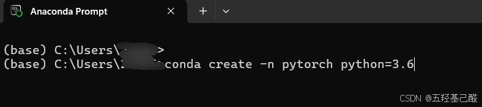

遇到选项键入y即可。

接着进入该环境

 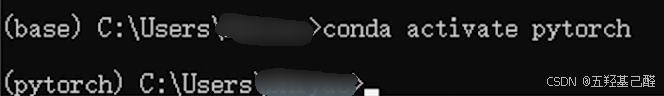

然后跟着环境配置视频向环境中安装pytorch以及各种工具即可。

最后要安装一下可视化代码编辑工具jupyter

```bash
pip install jupyter notebook
```

### 创建工程

打开pycharm右击new project创建新工程

 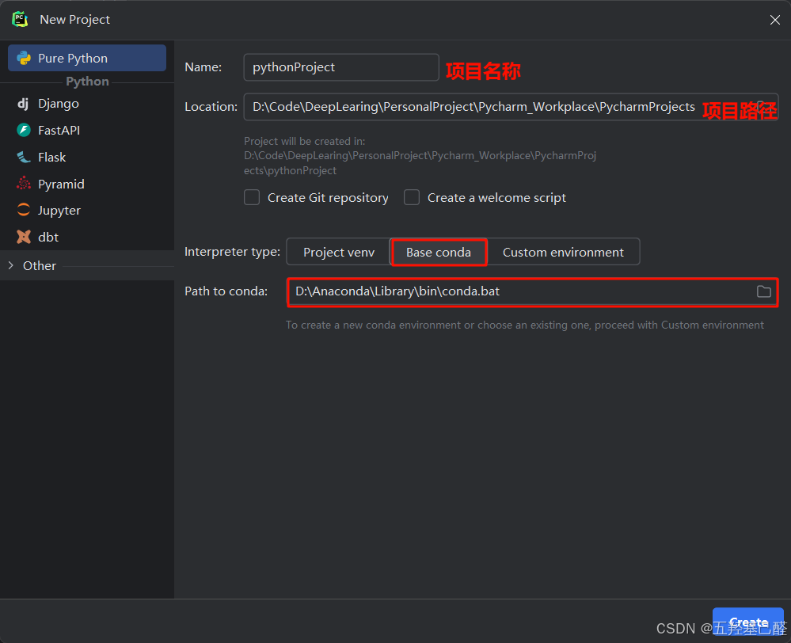

> **注意：** 这里的Path to conda中一定要选择自己Anaconda安装目录下的conda.bat文件（其他帖子或视频也有选择anaconda中自己创建的虚拟环境下的python.exe文件的，这里不过多赘述）

创建后观察项目环境是否被正常配置载入，即右下角是否出现载入进度条

 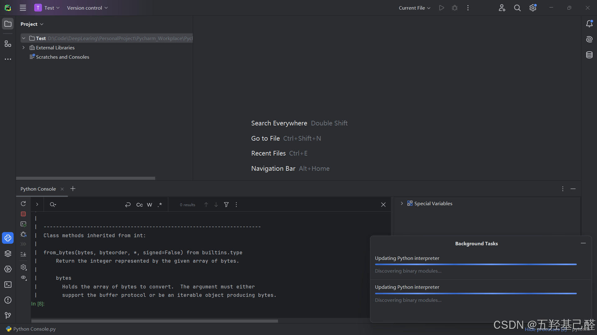

如没有则单击右下角手动添加解释器：

 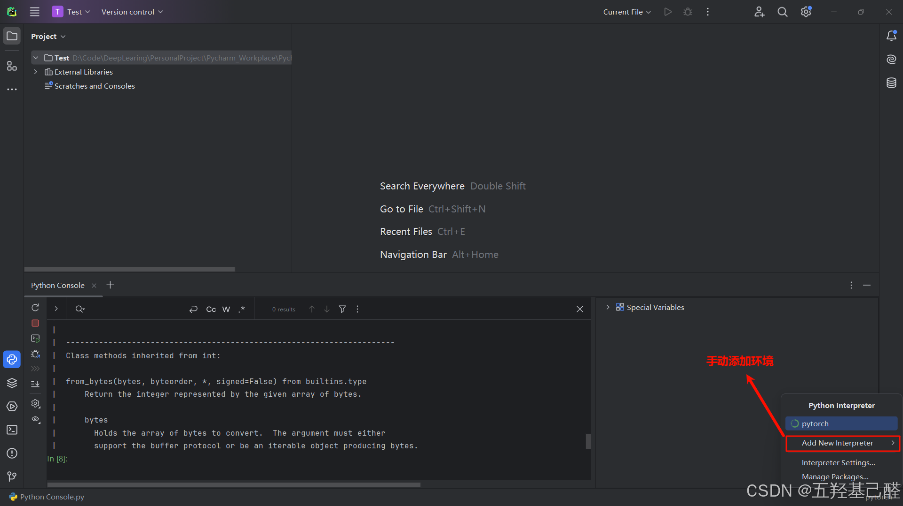

 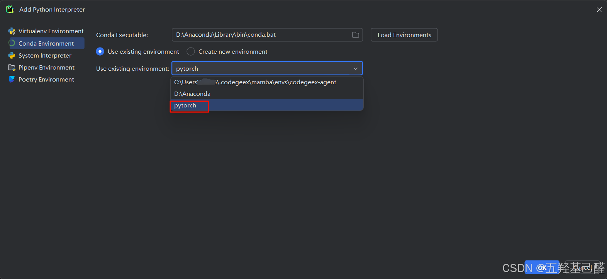

这里选择自己在anaconda中创建的虚拟环境即可

**1.检查环境** 

在控制台中分别键入

```python
import torch
```

```python
torch.cuda.is_available()
```

检查环境

 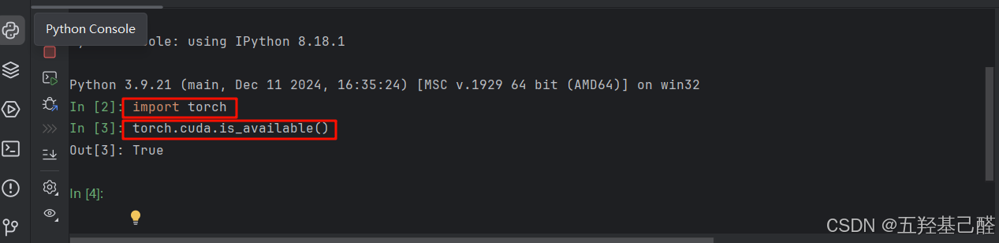

**2.探索 `torch模块`** 

> `torch` 是 **PyTorch 的核心模块** ，提供了张量计算（Tensor）和深度学习的基本工具。
> 
> 其涵盖 **张量计算** → **自动微分** → **神经网络构建** → **训练优化** → **部署支持。** 

**dir()的使用** 

> dir()是python内置的一个方法，可以显示某个模块下的所有子模块，类以及方法。

`键入dir()函数查看torch模块中的库函数` 

```python
dir(torch)
```

 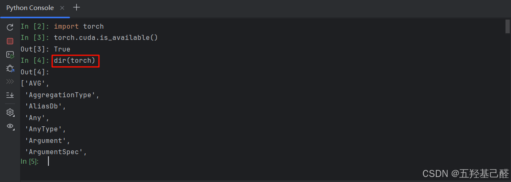

Ctrl+F检索到cuda方法及类

 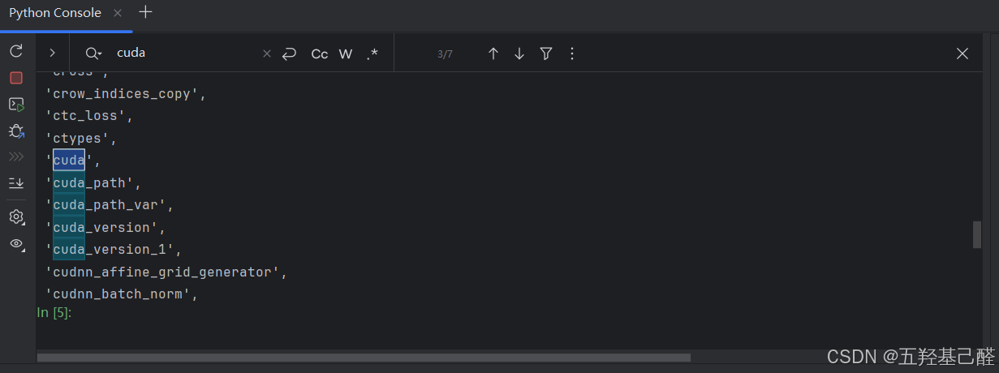

继续键入

```python
dir(torch.cuda)
```

可查看cuda子模块的所有类和方法

 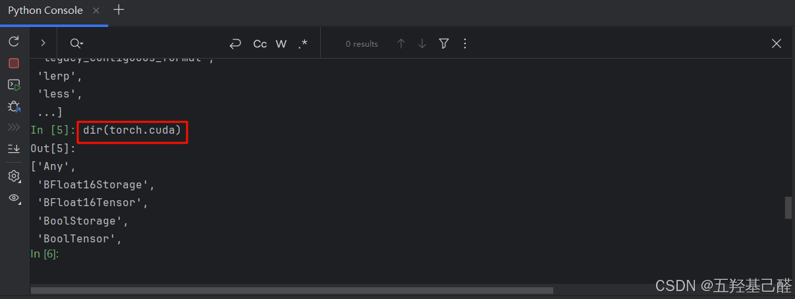

**help()的使用** 

这里以torch.cuda.is_available()函数为例，我们在键入

```python
help(torch.cuda.is_available)
```

以后控制台便会返回这个方法的基本使用方法：

 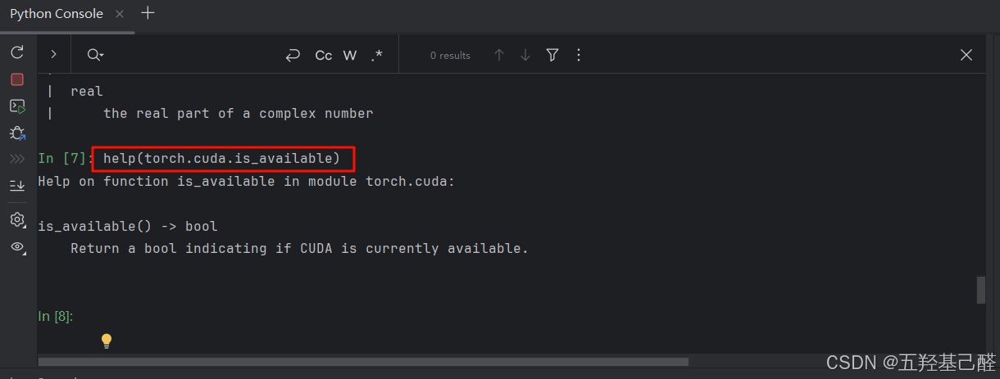

**3.添加Python文件** 

如图右键项目文件夹后新加python文件即可

 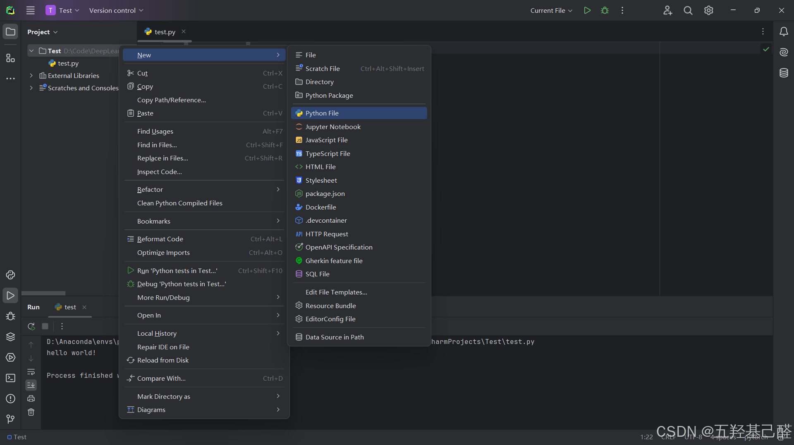

### ###Jupyter初体验###

> **Jupyter Notebook** 是交互式编程工具，特点：
> 
> 1. **分块运行** ：写一段代码立刻出结果
> 
> 2. **图文混排** ：代码、文字、图表、公式全放在一个文件里
> 
> 3. **适合场景** ：数据分析、机器学习调试、教学演示
> 
> 优势：比传统IDE更直观，比脚本更方便调试。
> 
> 是 **数据科学的实验笔记本** 。

进入这里的"d:"是根据你项目创建所在的盘符来的。

```bash
jupyter notebook d:
```

新建python文件

 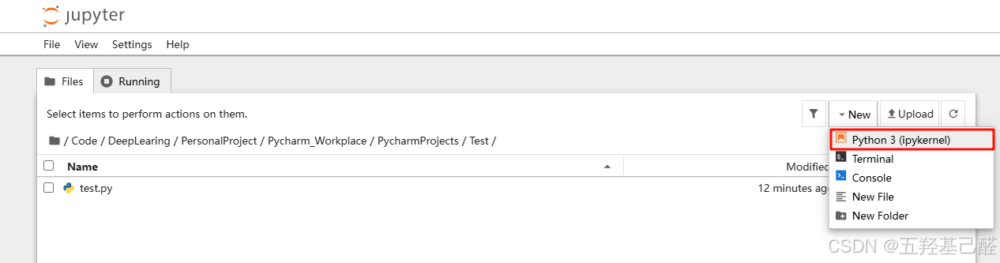

键入代码后单击运行或"Shift+Enter"即可运行代码

 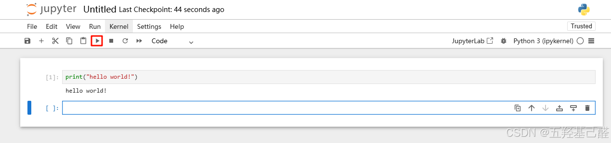

当然使用jupyter的好处是我们可以一步一步执行，很清楚的能看到每块代码执行是否成功，方便我们查找错误以及修改错误。

在终端中连续输入两次"Ctrl + c"即可退出jupyter notebook

 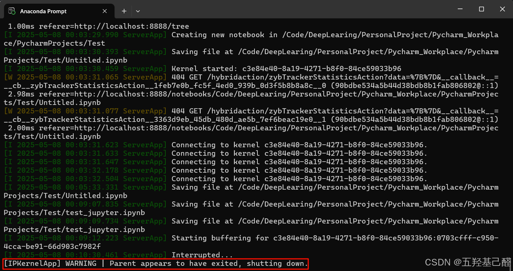

### 数据操作

众所周知，我们的模型是由数据集训练出来的，我们必须清楚数据集的结构组成以及使用方法等。

总体分为三大类：

> 
> 
> - **训练集** ：模型学习（占60-80%）。
> 
> - **验证集** ：调参/早停（占10-20%）。
> 
> - **测试集** ：最终评估（占10-20%， **不参与训练** ）。
> 
> 

 

每个数据集下都包含蚂蚁和蜜蜂文件夹，这里的文件夹名称就充当了标签的作用。

 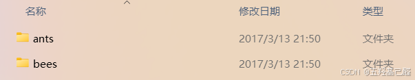

 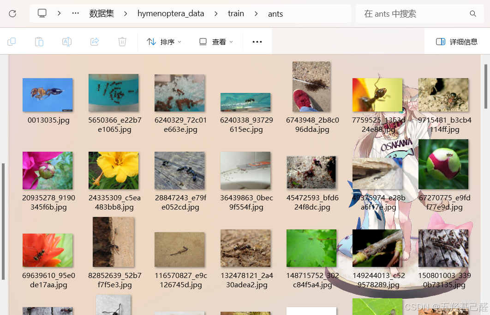

我们还可能见到其他形式标注的数据集，如图片和文本文件分别放在两个文件夹里，文本文件描述了对应图片的信息。

 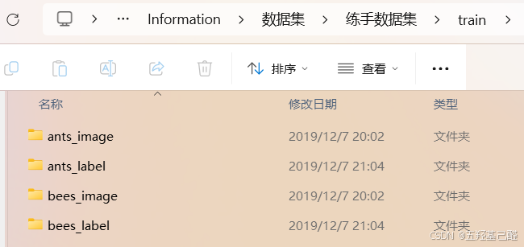

 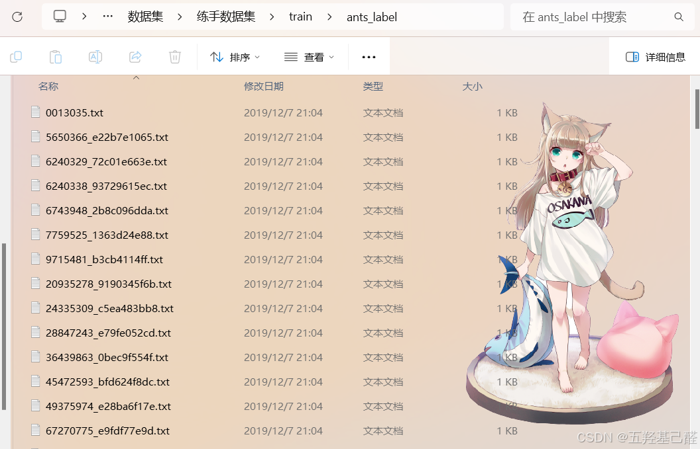

这里以第一种数据集为例。我们要进行数据处理需要先导入Dataset包，可以在jupyter中查看其描述。

```python
from torch.utils.data import Dataset
```

 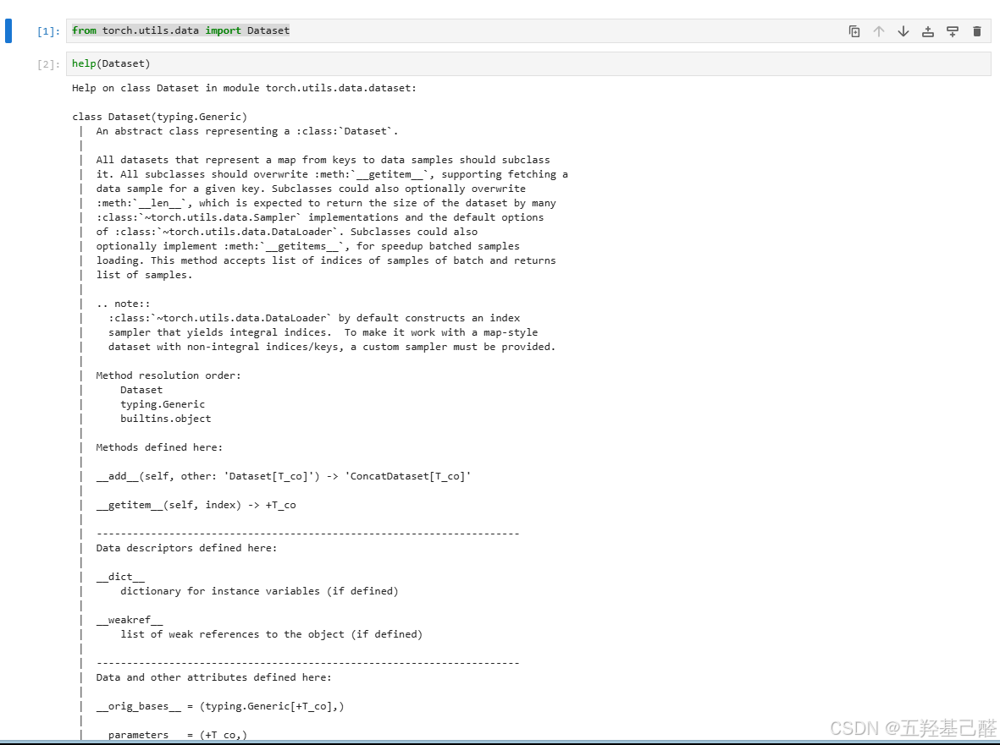

下面我们写一个自定义数据集来初步尝试对数据的操作：

```python
from torch.utils.data import Dataset  # 数据集模块
from PIL import Image  # PIL图像处理库
 
import os  # 标准库OS模块
 
# 自定义数据集类，继承自Dataset
class MyData(Dataset):
 
    def __init__(self, root_dir, label_dir):  # 构造函数，实例化时传入根目录和标签目录
        self.root_dir = root_dir  # 根目录存入成员变量
        self.label_dir = label_dir  # 标签目录存入成员变量
        self.path = os.path.join(self.root_dir, self.label_dir)  # 拼接目录存入成员变量
        self.img_path = os.listdir(self.path)  # 返回一个目录中存在的所有文件名的列表
 
    def __getitem__(self, idx):  # 获取目标文件信息
        img_name = self.img_path[idx]  # 获取文件名称
        img_item_path = os.path.join(self.path, img_name)  # 拼接图片完整路径
        img = Image.open(img_item_path)  # 读取图片
 
        label = self.label_dir  # 目标文件标签直接使用对应标签目录名
        return img, label  # 返回图片和标签
 
    def __len__(self):
        return len(self.img_path)  # 返回目录下文件列表的长度，即文件个数
 
 
root_dir = "dataset/train"
ants_label_dir = "ants"
bees_label_dir = "bees"
ants_dataset = MyData(root_dir, ants_label_dir)  # 蚂蚁数据集
bees_dataset = MyData(root_dir, bees_label_dir)  # 蜜蜂数据集
 
train_dataset = ants_dataset + bees_dataset  # 训练集合集
```

### 可视化工具

#### Visdom

实时性强但总体功能不如TensorBoard，因此此处不作过多介绍。

```bash
//安装：
pip install visdom
//启动服务
python -m visdom.server
```

```python
import visdom
import numpy as np
vis = visdom.Visdom（）
vis.text("Hello, world!')
vis.image(np.ones((3, 10, 10)))
```

#### TensorBoard

> TensorBoard 是 **TensorFlow/PyTorch 的可视化工具** ，主要用来：
> 
> 1. **跟踪训练过程** （损失、准确率等指标曲线）
> 
> 2. **可视化模型结构** （计算图、层结构）
> 
> 3. **分析超参数效果** （如学习率对比）
> 
> 4. **查看数据样本** （如图片、文本输入）
> 
> 5. **监控硬件资源** （GPU/CPU 利用率）
> 
> 能够 **帮助开发者直观理解和调试深度学习模型** 。

##### 写入标量数据样本

完成一个简单的数据样本可视化 ：

```python
from torch.utils.tensorboard import SummaryWriter  # 从torch的utils常用工具箱里的tensorboard中导入SummaryWriter类
 
writer = SummaryWriter("logs")  # 实例化类, 参数为数据存放文件夹名称
 
for i in range(1000):  # 从0到1000
    writer.add_scalar("y=x",i,i)  # 添加标量数据到logs中，表头为y=x，横纵坐标均为i
 
writer.close()
```

运行后会自动生成相应数据文件

 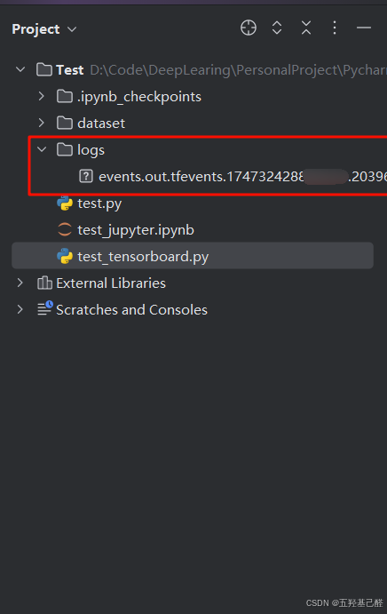

接下来再终端中键入以下命令，分别指定打开的数据样本存放的文件夹以及指定的端口：

```python
tensorboard --logdir=logs --port=6007
```

 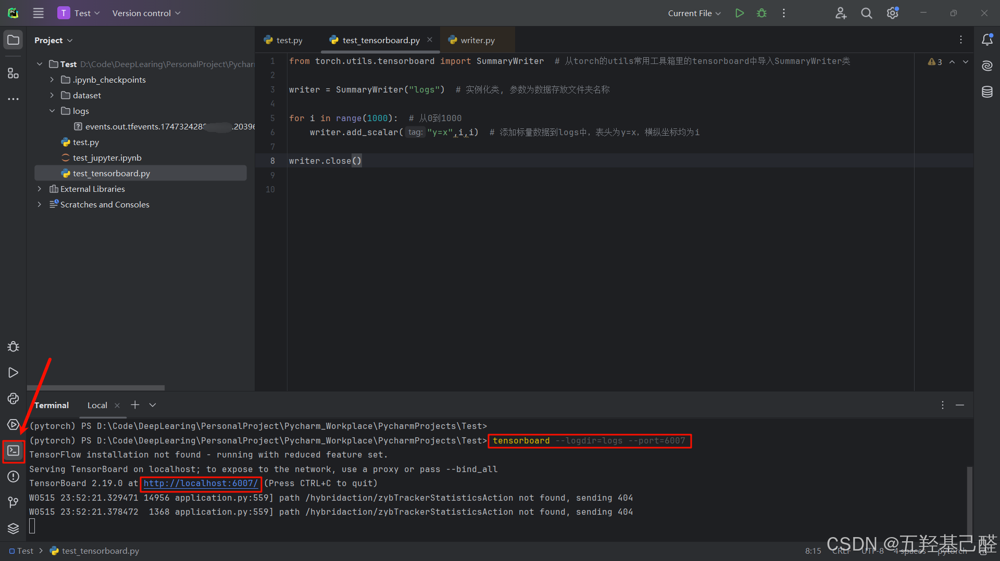

单击本地访问入口后即可跳转到可视化界面：

 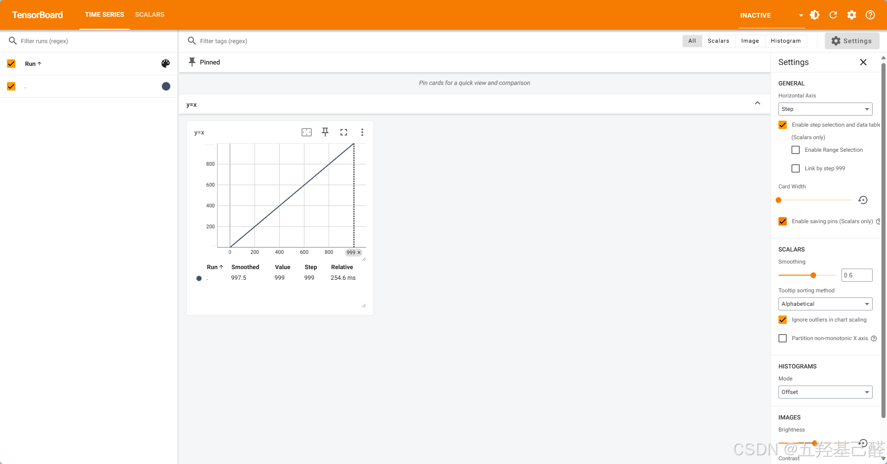

##### 写入图像数据

> 
> 
> - **`numpy`** 
> 
>   - 一个强大的 Python 科学计算库，提供多维数组（ `ndarray` ）、矩阵运算、数学函数、随机数生成等功能。
> 
> 

以下为add_image方法的官方注释，在Pycharm中可以按Ctrl+鼠标左键单击该方法跳转到相应声明文件中查看：

```python
    def add_image(
        self, tag, img_tensor, global_step=None, walltime=None, dataformats="CHW"
    ):
        """Add image data to summary.

        Note that this requires the ``pillow`` package.

        Args:
            tag (str): Data identifier
            img_tensor (torch.Tensor, numpy.ndarray, or string/blobname): Image data
            global_step (int): Global step value to record
            walltime (float): Optional override default walltime (time.time())
              seconds after epoch of event
            dataformats (str): Image data format specification of the form
              CHW, HWC, HW, WH, etc.
        Shape:
            img_tensor: Default is :math:`(3, H, W)`. You can use ``torchvision.utils.make_grid()`` to
            convert a batch of tensor into 3xHxW format or call ``add_images`` and let us do the job.
            Tensor with :math:`(1, H, W)`, :math:`(H, W)`, :math:`(H, W, 3)` is also suitable as long as
            corresponding ``dataformats`` argument is passed, e.g. ``CHW``, ``HWC``, ``HW``.
```

整体代码如下：

```python
from torch.utils.tensorboard import SummaryWriter  # 从torch的utils常用工具箱里的tensorboard中导入SummaryWriter类
from PIL import Image  #导入图像处理模块
import numpy as np  #导入科学计算库numpy
 
writer = SummaryWriter("logs")  # 实例化类, 参数为数据存放文件夹名称
 
img_path = "data/train/ants_image/0013035.jpg"  # 图像相对地址
img = Image.open(img_path)  # 利用Image里的open方法打开图像,将返回的图像数据储存起来
img_array = np.array(img)  # 将图像格式转换为numpy的多维数组格式因为后续add_image方法中要求数据格式
 
 
writer.add_image("test",img_array,1,dataformats='HWC')  # 写入图像数据:标题为“test”，数据为img_array，步长为1，数据格式指定为'HWC'
 
writer.close()
```

再次进入tensorboard就可以查看到刚刚添加的数据 ：

 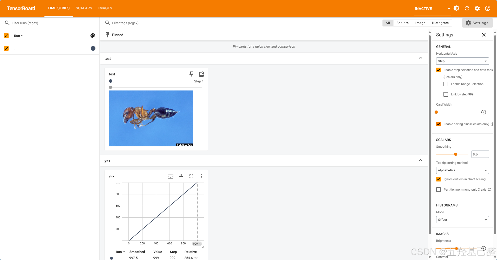

```python
#更改相对地址换张图片
img_path = "data/train/ants_image/20935278_9190345f6b.jpg"
 
...
...
 
#并且加大步长可以显示多个数据
writer.add_image("test",img_array,4,dataformats='HWC')
```

换张图片加大步长可以显示多个数据。

> 以上操作可以使我们训练过程可视化，看到每步训练的结果，进而进行调整。

### 视觉模块TorchVision

`torchvision` 是 PyTorch 生态系统中专门用于计算机视觉任务的库。包含模块如下：

| 模块名称 | 核心功能简介 |
|:---:|:---:|
| ​ **​ `models` ​** ​ | 提供各种经典的预训练模型（如 ResNet, VGG, AlexNet 等），用于图像分类、目标检测、语义分割等任务。 |
| ​ **​ `datasets` ​** ​ | 包含许多常用的公共数据集（如 MNIST, CIFAR-10, ImageNet, COCO 等），可以方便地下载和加载。 |
| ​ **​ `transforms` ​** ​ | 提供了一系列用于图像预处理的工具，如尺寸调整、裁剪、归一化、数据增强等，可以轻松组合成处理 pipeline。 |
| ​ **​ `io` ​** ​ | 提供了高效的图像和视频读写功能，支持直接读取为 PyTorch 张量。 |
| ​ **​ `ops` ​** ​ | 包含专为计算机视觉任务设计的底层操作，如非极大值抑制 (NMS)、感兴趣区域 (ROI) 对齐等。 |
| ​ **​ `utils` ​** ​ | 提供一些实用工具，例如将多个图像合并到一个网格中以便可视化，或绘制边界框等。 |


导入库：

```haskell
import torchvision
```

#### Transforms初体验

Torchvision 中的 transforms 是 PyTorch 的图像处理工具包，主要用于​ **​图像预处理和数据增强​** ​。

> **核心功能：** 
> 
> 1. **数据预处理​** ​ - 将图像转为模型需要的格式
> 
>    - `ToTensor()` ：把图像转为张量格式
> 
>    - `Normalize()` ：标准化像素值
> 
> 2. ​ **​数据增强​** ​ - 训练时随机变换图像，增加数据多样性
> 
>    - `RandomHorizontalFlip()` ：随机水平翻转
> 
>    - `RandomCrop()` ：随机裁剪
> 
>    - `ColorJitter()` ：调整颜色
> 
> 

导入包：

```typescript
from torchvision import transforms
```

组合类：可以将库中的其他类组合起来一次性完成功能。

 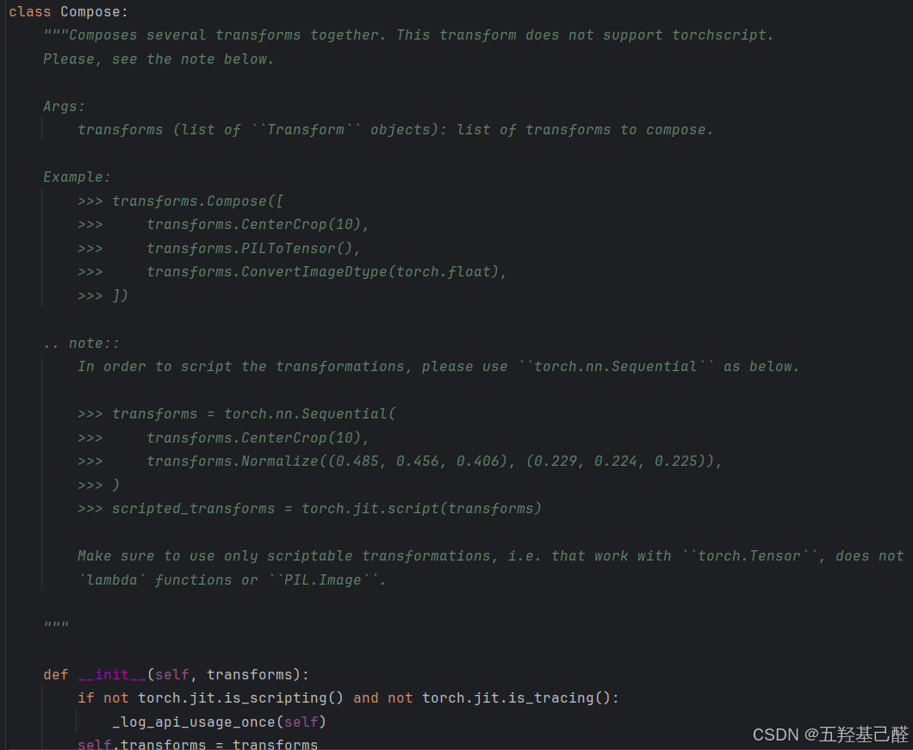

其中__call__这个方法是用来将实例化后的对象​ **​像函数一样被调用。** 

 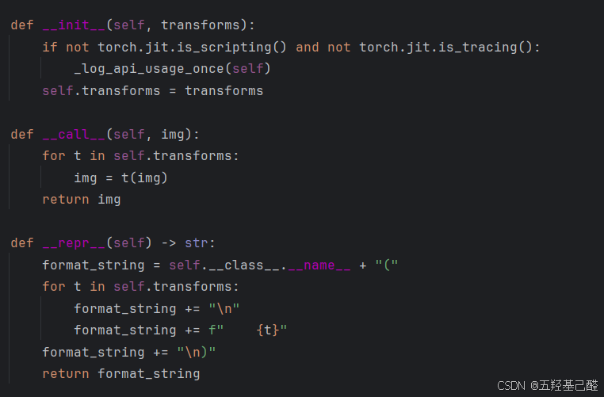

组合变换：

```cobol
# 组合多个变换
transform = transforms.Compose([
    transforms.Resize(256),          # 调整大小
    transforms.RandomCrop(224),      # 随机裁剪
    transforms.ToTensor(),           # 转为张量
    transforms.Normalize(mean=[0.5], std=[0.5])  # 标准化
])
```

调用并传入数据：

```php
#调用__call__
transform_img = transform(img)
#打印观察数据变化
print(transform_img )
```

#### Datasets的使用

以下我们以CIFAR10为例来对数据集进行操作：

 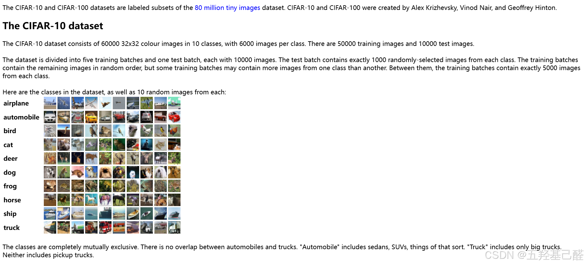

参数：

 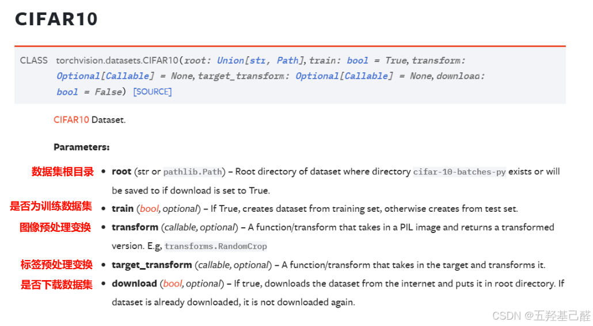

```cobol
# 训练数据集：根目录--dataset，训练数据集，在线下载
train_set = torchvision.datasets.CIFAR10(root='./dataset', train=True, download=True)
# 测试数据集：根目录--dataset，测试数据集，在线下载
test_set = torchvision.datasets.CIFAR10(root='./dataset', train=False, download=True)
```

键入以上代码并运行python文件后即可开始下载数据集，左侧项目文件夹根目录中也会出现下载好的数据集文件：

 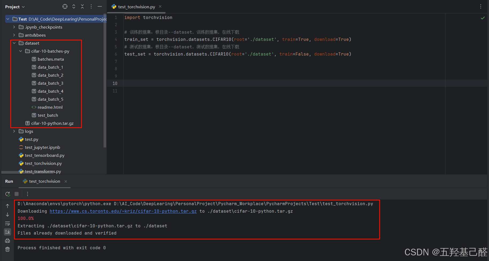

键入以下代码可以查看数据集详细内容：

```cobol
# 打印测试数据集中第一个数据
print(test_set[0])
# 打印数据集中classes属性（一个列表，包含了数据集中所有类别的可读名称）
print(test_set.classes)
# 解包赋值(元组 (image_data, label)依次赋值)
img, target = test_set[0]
print(img)
print(target)
print(test_set.classes[target])
img.show()
```

现在我们定义一个变换，可以在导入数据集之前对数据集载入改变换：

```cobol
import torchvision
from torch.utils.tensorboard import SummaryWriter
 
# 组合变换：张量转换
dataset_transform = (torchvision.transforms.Compose([torchvision.transforms.ToTensor(),]))
 
# 训练数据集：根目录--dataset，训练数据集，在线下载
train_set = torchvision.datasets.CIFAR10(root='./dataset', train=True, transform=dataset_transform, download=True)
# 测试数据集：根目录--dataset，测试数据集，在线下载
test_set = torchvision.datasets.CIFAR10(root='./dataset', train=False, transform=dataset_transform, download=True)
# 日志
writer = SummaryWriter('./logs')
# 写入日志
for i in range(10):
    img,target = train_set[i]
    writer.add_image('test_set', img, i)
writer.close()
```

在命令行终端键入：

```cobol
tensorboard --logdir='logs' 
```

 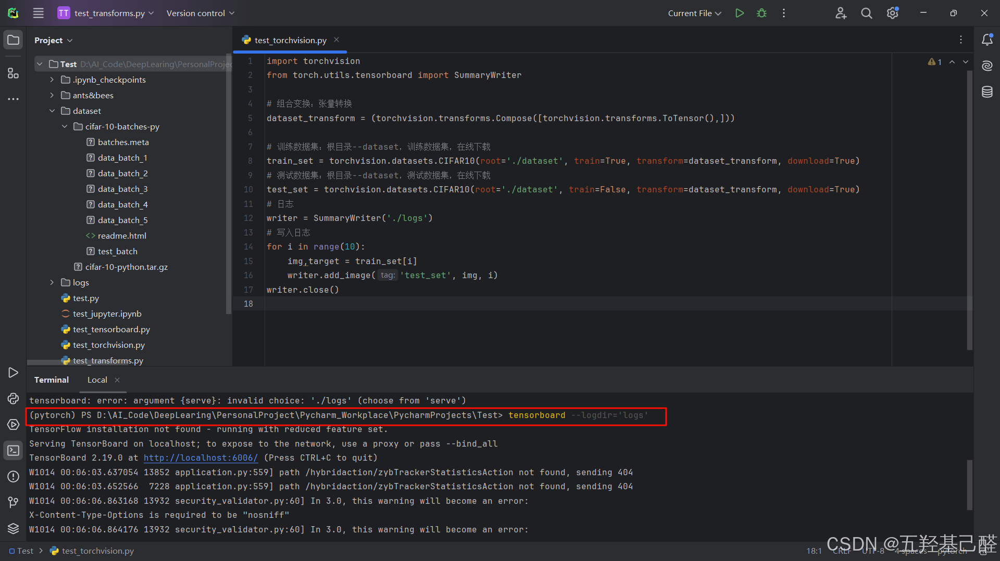

可以在tensorboard中观察到日志信息：

 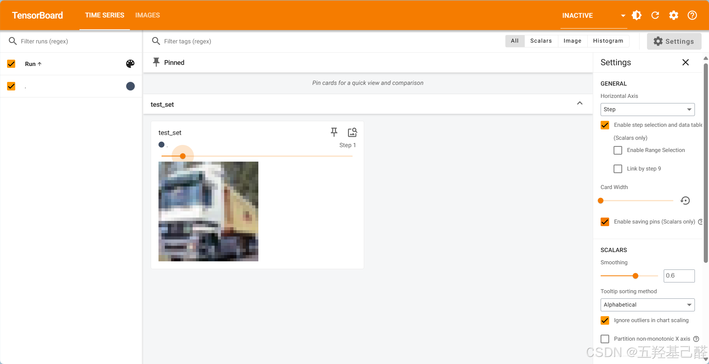

### 数据加载DataLoader

```python
import torchvision
# 准备的测试数据集
from torch.utils.data import DataLoader
from torch.utils.tensorboard import SummaryWriter
test_data = torchvision.datasets.CIFAR10("../dataset", train=False, transform=torchvision.transforms.ToTensor())
test_loader = DataLoader(dataset=test_data, batch_size=64, shuffle=True, num_workers=0,drop_last=True)
 
writer = SummaryWriter("dataloader")
step = 0
for data in test_loader:
    imgs,targets = data
    # print(imgs.shape)
    # print(targets)
    writer.add_images("test_data_drop_last", imgs, step)
    step = step + 1
writer.close()
```

> 
> 
> - dataset指加载的数据集
> 
> - batch_size指每批加载的样本数量
> 
> - shuffle指是否打乱数据集样本
> 
> - num_workers指使用多少子进程加载数据
> 
> - drop_last指是否将不足一个batch_size的剩余样本舍去
> 
> 

### 搭建神经网络

> torch.nn是pytorch中神经网络的接口模块

#### 神经网络的骨干nn.module

**nn.Module 是 PyTorch 中构建神经网络的核心基类** 

```python
import torch
import torch.nn as nn
 
class MyModel(nn.Module):
    def __init__(self):
        super(MyModel, self).__init__()  # 必须调用父类初始化
        self.conv = nn.Conv2d(3, 64, 3)
        self.fc   = nn.Linear(64, 10)
 
    def forward(self, x):
        x = self.conv(x)
        x = x.view(x.size(0), -1)
        x = self.fc(x)
        return x
 
model = MyModel()
print(model.parameters())  # 打印所有参数
```

#### 卷积层

提取局部特征。

函数：

```python
nn.Conv2d(in_channels, out_channels, kernel_size, stride=1, padding=0)
'''
in_channels：输入通道数
RGB 图像 = 3，灰度图 = 1
out_channels：输出通道数（也就是要提取多少种特征）
代码里常见 32、64，表示用 32 或 64 个不同的卷积核
kernel_size：卷积核大小
常用 3 或 5（即 3×3 或 5×5）
stride：步长，卷积核每次移动几格，默认 1
padding：在图像边缘补 0 的圈数
常用 padding=2（配合 kernel_size=5）能保持输出尺寸不变
'''
```

示例：

```python
import torch
import torchvision
from torch import nn
from torch.nn import Conv2d
from torch.utils.data import DataLoader
from torch.utils.tensorboard import SummaryWriter
 
dataset = torchvision.datasets.CIFAR10("../data", train=False, transform=torchvision.transforms.ToTensor(),
                                       download=True)
dataloader = DataLoader(dataset, batch_size=64)
 
class Tudui(nn.Module):
    def __init__(self):
        super(Tudui, self).__init__()
        self.conv1 = Conv2d(in_channels=3, out_channels=6, kernel_size=3, stride=1, padding=0)
 
    def forward(self, x):
        x = self.conv1(x)
        return x
 
tudui = Tudui()
 
writer = SummaryWriter("../logs")
 
step = 0
for data in dataloader:
    imgs, targets = data
    output = tudui(imgs)
    print(imgs.shape)
    print(output.shape)
    # torch.Size([64, 3, 32, 32])
    writer.add_images("input", imgs, step)
    # torch.Size([64, 6, 30, 30])  -> [xxx, 3, 30, 30]
 
    output = torch.reshape(output, (-1, 3, 30, 30))
    writer.add_images("output", output, step)
 
    step = step + 1
 
writer.close()
```

现象：

 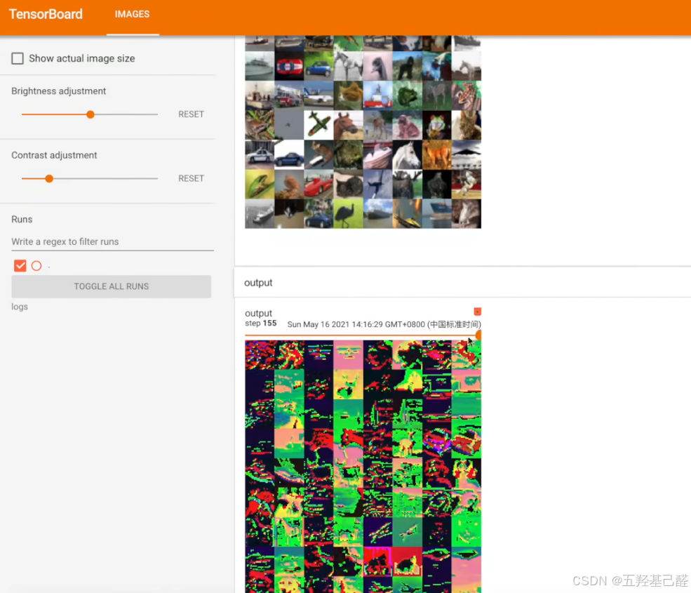

#### 池化层

缩小特征图尺寸（如最大/平均池化），减少参数、提取主要信息。

```python
nn.MaxPool2d(kernel_size, stride=None, padding=0, ceil_mode=False)
'''
kernel_size：池化窗口大小，通常是 2（即 2×2）
stride：默认等于 kernel_size，所以 2×2 池化通常 stride=2，输出尺寸直接除以 2
'''
```

```python
import torch
import torchvision
from torch import nn
from torch.nn import MaxPool2d
from torch.utils.data import DataLoader
from torch.utils.tensorboard import SummaryWriter
 
dataset = torchvision.datasets.CIFAR10("../data", train=False, download=True,
                                       transform=torchvision.transforms.ToTensor())
 
dataloader = DataLoader(dataset, batch_size=64)
 
class Tudui(nn.Module):
    def __init__(self):
        super(Tudui, self).__init__()
        self.maxpool1 = MaxPool2d(kernel_size=3, ceil_mode=False)
 
    def forward(self, input):
        output = self.maxpool1(input)
        return output
 
tudui = Tudui()
 
writer = SummaryWriter("../logs_maxpool")
step = 0
 
for data in dataloader:
    imgs, targets = data
    writer.add_images("input", imgs, step)
    output = tudui(imgs)
    writer.add_images("output", output, step)
    step = step + 1
 
writer.close()
```

如图是原始数据与最大池化后数据对比，即将数据特征提取，减少训练数据量，加速收敛。

 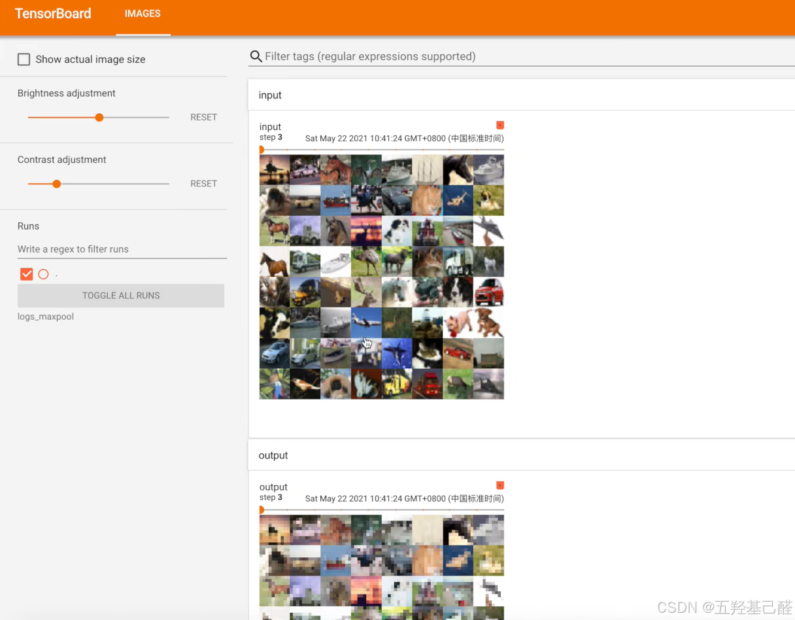

#### 展平层

nn.Flatten

把多维特征图拉平成一维向量，好喂给后面的全连接层。卷积输出是 [batch, channels, height, width]，全连接层（Linear）只接受一维向量，必须展平。

```python
nn.Flatten()   # 默认从第1维开始展平，保留 batch 维度
# 例：把 [64, 64, 4, 4] → [64, 1024]
```

#### 全连接层

nn.Linear

把每个输入神经元都连到每个输出神经元。

```python
nn.Linear(in_features, out_features)
'''
in_features：输入神经元数量（展平后的总元素数）
out_features：输出神经元数量（分类任务中最后是类别数 10）
'''
```

```python
nn.Linear(64*4*4, 64)   # 64*4*4=1024 → 64
nn.Linear(64, 10)      # 最后输出 10 个类别分数
```

#### 非线性激活层

引入非线性，使网络能学习复杂模式。

```python
import torch
import torchvision
from torch import nn
from torch.nn import ReLU, Sigmoid
from torch.utils.data import DataLoader
from torch.utils.tensorboard import SummaryWriter
 
input = torch.tensor([[1, -0.5],
                      [-1, 3]])
 
input = torch.reshape(input, (-1, 1, 2, 2))
print(input.shape)
 
dataset = torchvision.datasets.CIFAR10("../data", train=False, download=True,
                                       transform=torchvision.transforms.ToTensor())
 
dataloader = DataLoader(dataset, batch_size=64)
 
class Tudui(nn.Module):
    def __init__(self):
        super(Tudui, self).__init__()
        self.relu1 = ReLU()
        self.sigmoid1 = Sigmoid()
 
    def forward(self, input):
        output = self.sigmoid1(input)
        return output
 
tudui = Tudui()
 
writer = SummaryWriter("../logs_relu")
step = 0
for data in dataloader:
    imgs, targets = data
    writer.add_images("input", imgs, global_step=step)
    output = tudui(imgs)
    writer.add_images("output", output, step)
    step += 1
 
writer.close()
```

 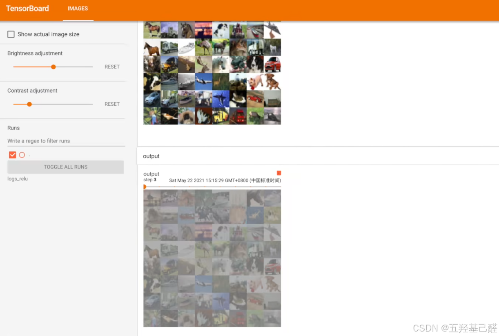

#### 简单顺序网络

nn.Sequential 用于快速将多个网络层按顺序串联起来，形成一个顺序执行的模块。

```python
import torch.nn as nn
 
class MyModel(nn.Module):
    def __init__(self):
        super().__init__()
        self.features = nn.Sequential(          # 打包成一个模块
            nn.Conv2d(3, 64, 3),                # 第1层：卷积
            nn.ReLU(),                          # 第2层：激活
            nn.MaxPool2d(2),                    # 第3层：池化
            nn.Conv2d(64, 128, 3),              # 第4层：卷积
            nn.ReLU(),
        )
        self.classifier = nn.Sequential(        # 另一个顺序模块
            nn.Linear(128 * 6 * 6, 512),
            nn.ReLU(),
            nn.Linear(512, 10),
        )
 
    def forward(self, x):
        x = self.features(x)        # 自动顺序执行所有层
        x = x.view(x.size(0), -1)    # 展平
        x = self.classifier(x)
        return x
```

#### 损失函数

> 
> 
> - 回归任务（预测连续值）nn.L1Loss(reduction='sum')
> 
> - 回归任务nn.MSELoss()
> 
> - 分类任务nn.CrossEntropyLoss()
> 
> 

```python
loss_fn = nn.CrossEntropyLoss()      # 创建
loss = loss_fn(outputs, targets)     # 计算一个 batch 的平均 loss
```

#### 优化器

优化器根据 loss 的梯度，决定如何更新模型参数。 **最常用：SGD（随机梯度下降）** 

```python
optimizer = torch.optim.SGD(model.parameters(), lr=1e-2)  # lr=0.01
'''
model.parameters()：告诉优化器要更新哪些参数
lr：学习率，步子多大。1e-2 = 0.01 是常见起点
'''
```

```python
optimizer.zero_grad()   # 第一步：梯度清零（否则会累加）
loss.backward()         # 第二步：反向传播，计算梯度
optimizer.step()        # 第三步：根据梯度更新参数
```

#### 训练标准代码构成

> 
> 
> - **前向传播** ：把图片喂给模型，得到预测分数（logits）
> 
> - **计算损失** ：用损失函数对比预测和真实标签，得到一个标量 loss
> 
> - **梯度清零** ：把上一次残留的梯度清掉（非常重要！不然梯度会累加）
> 
> - **反向传播** ：根据 loss 自动计算每个参数的梯度（怎么改能让 loss 变小）
> 
> - **参数更新** ：优化器根据梯度真正修改模型的参数，让模型变得更聪明一点
> 
> 

```python
# 前向传播
outputs = model(imgs)                    # 得到预测分数
 
# 计算损失
loss = loss_fn(outputs, targets)          # 交叉熵
 
# 反向传播 + 参数更新
optimizer.zero_grad()
loss.backward()
optimizer.step()
```

### 模型及数据的保存

```python
# 保存整个模型：
torch.save(model, "model.pth")
# 只保存参数：
torch.save(model.state_dict(), "model.pth")
```

### GPU加速训练

使用CPU训练太慢，改为使用GPU需要进行部分代码改动。

```python
# 必须添加
device = torch.device("cuda" if torch.cuda.is_available() else "cpu")
print("使用设备：", device)
# 修改模型部分model = Tudui()
model = Tudui().to(device)
# 修改数据处理部分
imgs = imgs.to(device)
targets = targets.to(device)
# 修改损失函数部分loss_fn = nn.CrossEntropyLoss()
loss_fn = nn.CrossEntropyLoss().to(device)
 
 
```


## 五.神经网络范式示例

```python
import torch
import torchvision
from torch.utils.tensorboard import SummaryWriter
from torch import nn
from torch.utils.data import DataLoader
from PIL import Image
import torchvision.transforms as transforms
 
# =====================================
# 第1步：定义神经网络模型
# =====================================
# 这个类就是你的神经网络“大脑”。
# 继承 nn.Module 是 PyTorch 的规定，所有模型都要这样写。
# __init__：定义网络都有哪些层（就像搭积木）
# forward：定义数据如何从输入一层一层流到输出（前向传播）
class Tudui(nn.Module):
    def __init__(self):
        super(Tudui, self).__init__()  # 调用父类的初始化函数，必写！
        
        # 使用 nn.Sequential 把所有层按顺序叠在一起，代码更简洁
        self.model = nn.Sequential(
            # ========== 特征提取部分（卷积 + 池化）==========
            # 输入：3通道（RGB图像），输出：32个特征图，卷积核5x5，padding=2保持尺寸不变
            nn.Conv2d(3, 32, 5, padding=2),
            nn.MaxPool2d(2),                  # 最大池化：宽高各减半，保留主要特征
            nn.Conv2d(32, 32, 5, padding=2),
            nn.MaxPool2d(2),
            nn.Conv2d(32, 64, 5, padding=2),
            nn.MaxPool2d(2),
            
            # ========== 展平部分 ==========
            nn.Flatten(),                     # 把 [batch, 64, 4, 4] 变成 [batch, 1024] 的一维向量
            
            # ========== 分类器部分（全连接层）==========
            nn.Linear(64 * 4 * 4, 64),        # 第一层全连接：1024个输入 → 64个输出
            nn.Linear(64, 10)                 # 最后一层：64个输入 → 10个类别（CIFAR-10有10类）
        )
 
    def forward(self, x):
        x = self.model(x)                     # 数据按顺序通过上面所有层
        return x                              # 返回的是10个类别的原始分数（logits）
 
# =====================================
# 第2步：准备数据集（CIFAR-10）
# =====================================
# CIFAR-10 是经典的图像分类数据集，包含10个类别，每张图32x32像素
# transform=ToTensor()：把图片转换成 PyTorch 能处理的张量，并归一化到[0,1]
train_data = torchvision.datasets.CIFAR10(
    root="./data",           # 数据保存路径
    train=True,              # True=训练集（50000张），False=测试集（10000张）
    transform=torchvision.transforms.ToTensor(),
    download=True            # 第一次运行会自动下载
)
 
test_data = torchvision.datasets.CIFAR10(
    root="./data",
    train=False,
    transform=torchvision.transforms.ToTensor(),
    download=True
)
 
# 打印数据集大小，确认加载成功
print(f"训练集数量：{len(train_data)}")   # 应该输出 50000
print(f"测试集数量：{len(test_data)}")     # 应该输出 10000
 
# =====================================
# 第3步：创建 DataLoader（数据加载器）
# =====================================
# DataLoader 负责把数据集分成一个个小批次（batch）喂给模型
# batch_size=64：每次训练处理64张图片
# shuffle=True：每个epoch打乱顺序，防止模型记住顺序
train_dataloader = DataLoader(train_data, batch_size=64, shuffle=True)
test_dataloader = DataLoader(test_data, batch_size=64, shuffle=False)  # 测试时不需要打乱
 
# =====================================
# 第4步：实例化模型、损失函数、优化器
# =====================================
model = Tudui()                                   # 创建模型实例
 
# 损失函数：衡量预测和真实标签的差距
# CrossEntropyLoss 是分类任务最常用的损失（内部包含 softmax）
loss_fn = nn.CrossEntropyLoss()
 
# 优化器：根据损失自动调整模型参数（学习过程的核心）
# SGD = 随机梯度下降，lr=0.01 是学习率（步子大小）
optimizer = torch.optim.SGD(model.parameters(), lr=0.01)
 
# =====================================
# 第5步：训练循环（最核心的训练过程）
# =====================================
total_train_step = 0      # 记录总共训练了多少个batch
epoch = 1                 # 这里只训练1轮，实际项目建议10~30轮以上
 
# TensorBoard 可视化工具（可选，但强烈推荐）
writer = SummaryWriter("logs_train")  # 训练日志会保存在 logs_train 文件夹
 
for i in range(epoch):
    print(f"------- 第 {i+1} 轮训练开始 -------")
    
    # 设置模型为训练模式（如果有Dropout或BatchNorm会生效）
    model.train()
    
    # 遍历训练集的所有batch
    for imgs, targets in train_dataloader:
        # 1. 前向传播：模型预测
        outputs = model(imgs)
        
        # 2. 计算损失
        loss = loss_fn(outputs, targets)
        
        # 3. 优化器三步舞（必须按这个顺序！）
        optimizer.zero_grad()   # 清空上一步的梯度
        loss.backward()         # 反向传播，计算当前梯度
        optimizer.step()        # 根据梯度更新模型参数
        
        total_train_step += 1
        if total_train_step % 100 == 0:  # 每100个batch打印一次
            print(f"训练步数：{total_train_step}，当前Loss：{loss.item():.4f}")
            writer.add_scalar("train_loss", loss.item(), total_train_step)
 
# =====================================
# 第6步：测试/验证循环（检查模型效果）
# =====================================
    print("------- 开始在测试集上验证 -------")
    model.eval()                       # 设置为评估模式
    total_test_loss = 0
    total_accuracy = 0
    
    # 测试时不需要计算梯度，节省内存和时间
    with torch.no_grad():
        for imgs, targets in test_dataloader:
            outputs = model(imgs)
            loss = loss_fn(outputs, targets)
            total_test_loss += loss.item()
            
            # 计算准确率：预测类别和真实类别相同的数量
            accuracy = (outputs.argmax(1) == targets).sum()
            total_accuracy += accuracy.item()
    
    print(f"测试集上的总Loss：{total_test_loss:.4f}")
    print(f"测试集准确率：{total_accuracy / len(test_data):.4f}")
    
    # 记录到 TensorBoard
    writer.add_scalar("test_loss", total_test_loss, i)
    writer.add_scalar("test_accuracy", total_accuracy / len(test_data), i)
 
# =====================================
# 第7步：保存训练好的模型
# =====================================
torch.save(model, f"tudui_epoch{epoch}.pth")
print("模型已保存！文件名为：tudui_epoch1.pth")
 
writer.close()  # 关闭 TensorBoard 写入
 
# =====================================
# 第8步：加载模型并对单张图片进行预测（推理）
# =====================================
# 加载刚才保存的模型（即使在没有GPU的电脑上也能加载）
loaded_model = torch.load("tudui_epoch1.pth", map_location=torch.device('cpu'))
loaded_model.eval()  # 预测时一定要用 eval 模式
 
# 准备一张新图片进行预测（路径改成你自己的图片）
image_path = "../imgs/airplane.png"  # 请确保这张图片存在，或者换成你电脑上的图片路径
image = Image.open(image_path).convert('RGB')  # 打开图片并转为RGB格式
 
# 和训练时相同的预处理
transform = transforms.Compose([
    transforms.Resize((32, 32)),   # 调整大小到32x32
    transforms.ToTensor()          # 转为Tensor
])
image = transform(image)
image = image.unsqueeze(0)         # 增加batch维度：从 [3,32,32] → [1,3,32,32]
 
# 预测
with torch.no_grad():
    output = loaded_model(image)
    predicted_class = output.argmax(1).item()  # 取出得分最高的类别索引
 
# CIFAR-10 的10个类别名称
classes = ['飞机', '汽车', '鸟', '猫', '鹿', '狗', '青蛙', '马', '船', '卡车']
print(f"预测结果索引：{predicted_class}")
print(f"预测类别：{classes[predicted_class]}")
 
# =====================================
# 完整流程结束
# 打开终端运行：tensorboard --logdir=logs_train
# 浏览器访问 http://localhost:6006 查看训练曲线
# =====================================
```

## 六.总结

本贴仅作为个人学习笔记交流使用，如有错误感谢批评指正。