# 【寄存器开发速成】半小时入门寄存器开发（基于STM32的寄存器开发简明教程）

> 原创 已于 2025-12-18 09:40:29 修改 · 粉丝可见 · 3.3k 阅读 · 36 · 57 · 本内容遵循CC 4.0 BY-SA版权协议 版权声明：本文为博主原创文章，遵循 CC 4.0 BY 版权协议，转载请附上原文出处链接和本声明。 GEO检测 · 编辑
> 文章链接：https://menoking.blog.csdn.net/article/details/142831873

**目录**

[TOC]


## 一.认识寄存器

寄存器（register）是CPU（中央处理器）的组成部分，是一种直接整合到cpu中的有限的高速访问速度的存储器，它是有一些与非门组合组成的，分为通用寄存器和特殊寄存器。

寄存器是CPU的最基本组成部分，是学习芯片最基础最底层的东西。我们都知道单片机是内部集成CPU，RAM，ROM以及IO口和其他外围电路的集成电路芯片。我们想操作单片机，就得了解内部的寄存器，通过寄存器间接控制整个芯片。

> **`单片机的本质其实就是在操作寄存器，单片机的库函数实质上也是把寄存器操作封装好。`** 

## 二 .寄存器映射

对于STM32F103，或者Cortex_M3内核来说，其内部可寻址的最大空间为2^32B，即4GB。

**注意：这里的4GB不是指它的存储空间，指的是其能够有效访问的内存单元（地址总线）的数量。** 

在这4GB空间中，ARM分为了八个块，每个块都有不同的用途

 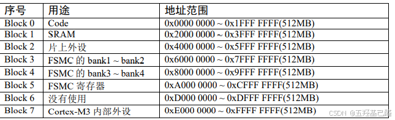

 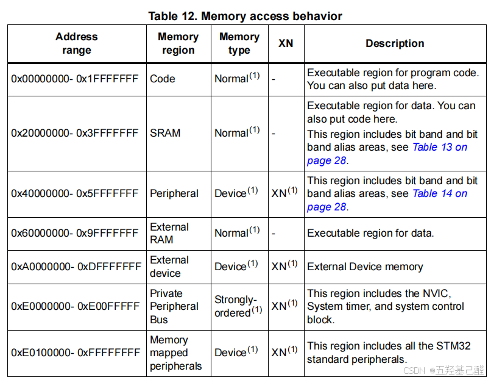

> **其中我们要特别关注Block2这块区域，这块区域被设计为外设总线的映射区域，以 `四个字节为一个单元，共32bit，每一个单元对应不同的功能，` <span style="background-color:#79c6cd">我们通过操作这些单元就可以驱动相应的外设</span>，这就是寄存器的操作方式。** 

 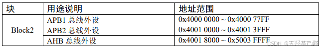

**于是ST公司就为这些特定的功能单元取了一个别名，封装进了文件stm32f10x.h，这个过程就叫做<span style="background-color:#79c6cd">寄存器映射</span>。** 

## 三.使用寄存器

```cpp
*(unsigned int*)(0x4001 0C0C) = OxFFFF;
```

上面这句代码表示将0x4001 0C0C这个十六进制数转换为(unsigned int*)类型的地址，然后解引赋值。

但是上面的操作太繁琐了，于是改进为宏定义：

```cpp
#define  GPIOB_ODR  *(unsigned int*)(0x4001 0C0C)
```

于是就可以：

```cpp
GPIOB_ODR =0XFFFF:
```

## 四.查找寄存器

### 1.参考手册

如果想查看某个寄存器的话，我们可以到 **<span style="background-color:#79c6cd">STM32F10xxx参考手册（中文）</span>** 中查找。

 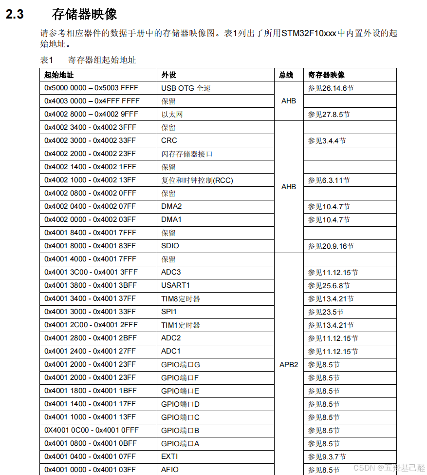

 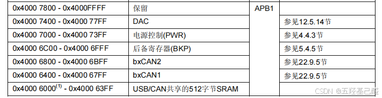

 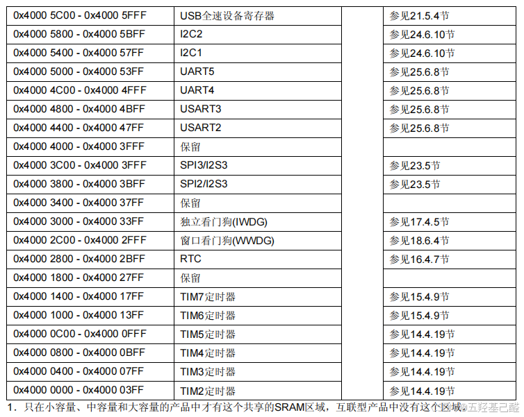

可以看到，以上所有的寄存器基本上都是以地址偏移来表示的，即 **<span style="background-color:#79c6cd">基地址+偏移量</span>** 。

> 例如GPIOB就是在APB2总线的基地址0x4001 0000上偏移了0x0C00后得到的0x4001 0C00。
> 
>  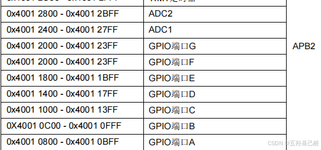
> 
> 

我们还可以在上述手册中看到对应寄存器各个位的详细解释。

### 2.示例

例如APB2总线的一个寄存器RCC_APB2ENR: 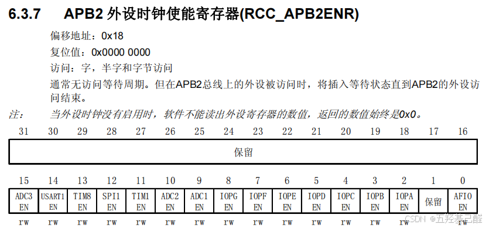

 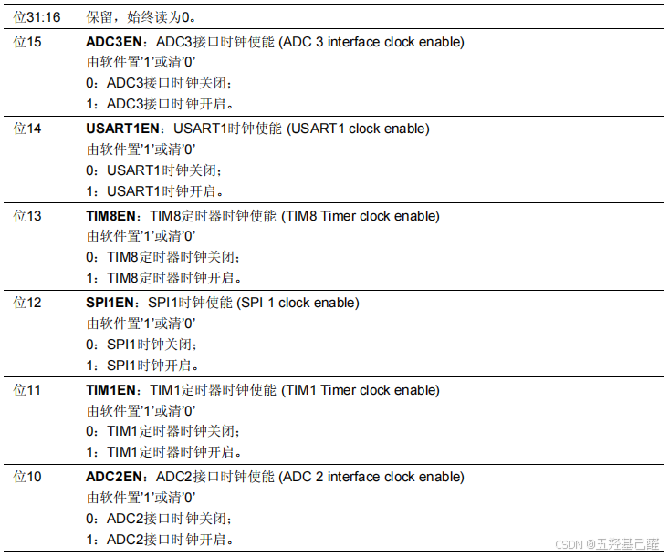

 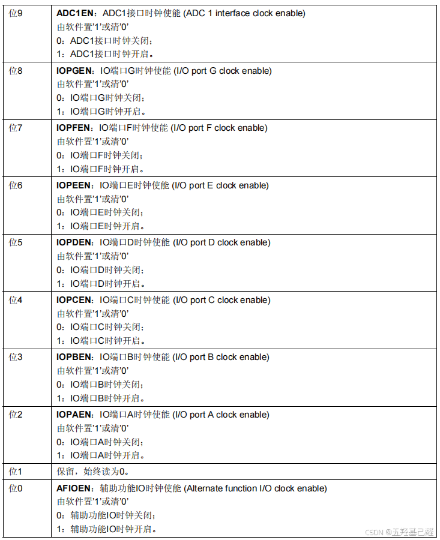

如果我们想开启TIM8的时钟使能，就可以这么写：

```cpp
RCC_APB2ENR |= 0x2000;
```

或者

```cpp
unsigned int *pRCC_APB2ENR = (unsigned int *)0x40021018;
*pRCC_APB2ENR |= 0x00002000;
```


有些寄存器是几个外设通用的，比如GPIO的寄存器：

 

后面的（x=A..E）就代表这个寄存器是几个GPIO端口(A..E)通用的。

头文件里也很明确定义了结构体类型：

 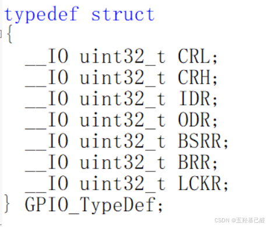

对于这种我们调用时就可以这么调用了：

```cpp
GPIOB->LCKR = xxxxxxxxx;
```

## 五.总结

由于寄存器更接近底层，所以寄存器操作更快，效率也更高，虽然记忆起来比库函数麻烦，但是仍有可取之处，两者各有优劣，当然我们可以使用两者混合编程，把优势发挥到最大。

---

如有错误，感谢指正

2024.10.12