# 【嵌入式入门】STM32之封装自己的静态链接库（.lib文件）

> 原创 于 2026-01-15 14:58:57 发布 · 公开 · 1.4k 阅读 · 28 · 30 · 本内容遵循CC 4.0 BY-SA版权协议 版权声明：本文为博主原创文章，遵循 CC 4.0 BY 版权协议，转载请附上原文出处链接和本声明。 GEO检测 · 编辑
> 文章链接：https://menoking.blog.csdn.net/article/details/145765293

**目录**

[TOC]


## 一.定义

> 
> 
> - **动态链接库** （Dynamic Link Library 或者 Dynamic-link Library，缩写为 DLL）：是微软公司在微软Windows操作系统中，实现共享函数库概念的一种方式。程序 **运行时** 由系统 **动态加载** 动态库到内存，供程序调用，系统只加载一次，多个程序共用，节省内存。这些库函数的扩展名是 ”.dll"、“.ocx”（包含ActiveX控制的库）或者 “.drv”（旧式的系统驱动程序）。
> 
> - **静态链接库** ： 在程序 **编译时** 被连接到目标代码中参与编译； **链接时** 将 **库** 完整地 **拷贝** 至可执行文件中，被多次使用就有多份冗余拷贝；生成可执行程序之后，静态链接库不需要（因已将函数拷贝到可执行文件中）。通常为.lib文件，格式如：#pragma comment(lib,“XXX.lib”)。
> 
> 

本贴的目标是将自己写的库封装为以".lib"结尾的静态链接库文件，并调用实现功能。

## 二. 创建库

### 1.创建标准工程

这里以STM32F103HAL库为例演示。首先创建一个标准HAL库工程：

 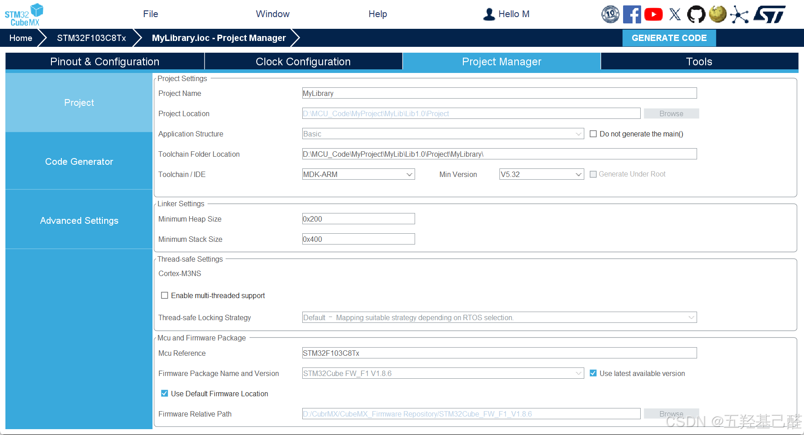

创建完要确保工程编译无错误：

 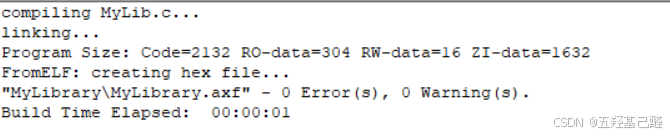

### 2.添加文件

添加个人库文件，楼主这里取名MyLib

 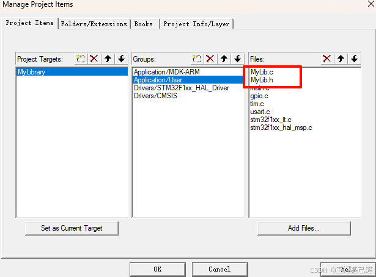

搭建好环境并添加相应头文件

 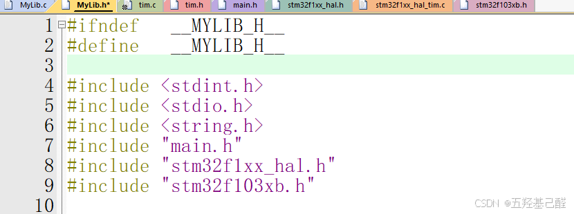

### 3.编写库函数

由于我们最后会封装为一个.lib结尾的高度集成的库函数文件，因此我们必须将能隐藏的变量隐藏，同时要对留出的外部API尽可能地增强其自由度，即尽可能地让用户能够通过包，暴露地接口进行更加灵活地配置调用。

- #### 封装PID函数

首先我们先以封装PID函数为例，在.h文件中封装结构体

```cpp
/**
 * @description: 1.先定义AmplitudeLimiter类型的限幅器
				 2.再定义PID_Parameter的PID参数结构体（P、I、D及限幅器）
				 3.调用函数计算
 */
typedef struct 
{
	uint16_t Integration_Max;//积分限幅
	uint16_t Output_Max;//输出限幅
}AmplitudeLimiter;
 
typedef struct
{
	AmplitudeLimiter Limter;//限幅器
	float Kp;
	float Ki;
	float Kd;
	
	float Error;//误差
	float Error_Last;//上次误差
	float Error_Last_Last;//上上次误差
	float Error_Integration;//误差积分
	
	float Output;//输出
}PID_Parameter;
 
void PID_SetParameter(float Kp,float Ki,float Kd,AmplitudeLimiter Limtiter,PID_Parameter *PIDPr);
float PID_Position(float ActualValue,float TargetValue,PID_Parameter *PIDPr);//位置式
float PID_Incremental(float ActualValue, float TargetValue, PID_Parameter *PIDPr);//增量式
```

在.c文件中添加位置式PID以及增量式PID计算函数，初始化函数传入P,I,D参数及限幅器即可。

```cpp
void PID_SetParameter(float Kp,float Ki,float Kd,AmplitudeLimiter Limtiter,PID_Parameter *PIDPr)
{
	PIDPr->Kp = Kp;
	PIDPr->Ki = Ki;
	PIDPr->Kd = Kd;
	PIDPr->Limter = Limtiter;
}
 
float PID_Position(float ActualValue,float TargetValue,PID_Parameter *PIDPr)
{
	PIDPr->Error_Last = PIDPr->Error;
	PIDPr->Error = TargetValue - ActualValue;
	
	PIDPr->Error_Integration += PIDPr->Error;
	
	if(PIDPr->Error_Integration > PIDPr->Limter.Integration_Max)PIDPr->Error_Integration = PIDPr->Limter.Integration_Max;
	if(PIDPr->Error_Integration < -PIDPr->Limter.Integration_Max)PIDPr->Error_Integration = -PIDPr->Limter.Integration_Max;
 
	
	PIDPr->Output = PIDPr->Kp * PIDPr->Error +PIDPr->Kd * (PIDPr->Error - PIDPr->Error_Last)+PIDPr->Ki * PIDPr->Error_Integration;
	
	if(PIDPr->Output > PIDPr->Limter.Output_Max)PIDPr->Output = PIDPr->Limter.Output_Max;
	if(PIDPr->Output < -PIDPr->Limter.Output_Max)PIDPr->Output = -PIDPr->Limter.Output_Max;
	
	return PIDPr->Output;
}
 
float PID_Incremental(float ActualValue, float TargetValue, PID_Parameter *PIDPr)
{
    PIDPr->Error = TargetValue - ActualValue;
    
    // 计算比例项
    float P_Output = PIDPr->Kp * (PIDPr->Error - PIDPr->Error_Last);
    
    // 计算微分项，注意防止微分kick（可选）
    float D_Output = PIDPr->Kd * (PIDPr->Error - 2*PIDPr->Error_Last + PIDPr->Error_Last_Last); 
	
	//积分项
	float I_Output = PIDPr->Ki * PIDPr->Error;
    
    // 总输出为各部分之和
    float Output_Increment = P_Output + D_Output + I_Output;
    
    // 输出限幅
    PIDPr->Output += Output_Increment; // 这里是增量累加到输出上
	
    if(PIDPr->Output > PIDPr->Limter.Output_Max) PIDPr->Output = PIDPr->Limter.Output_Max;
    if(PIDPr->Output < -PIDPr->Limter.Output_Max) PIDPr->Output = -PIDPr->Limter.Output_Max;
	
	// 更新上次误差值
	PIDPr->Error_Last_Last = PIDPr->Error_Last;
    PIDPr->Error_Last = PIDPr->Error;
	
	
    return PIDPr->Output;
}
```

- #### 封装PWM电机驱动

这里要满足足够自由及个性化的配置，就必须连带着官方类型，比如定时器类型和定时器通道类型进行封装。笔者这里将定时器通道重新封装为一个枚举，用来在功能函数中选择通道；然后将左右轮定时器号，各自通道，电机驱动端口，驱动GPIO引脚全部打包为一个结构体WheelType。

```cpp
/**
 * @description: 1.先定义WheelType类型的轮子
				 2.调用函数驱动轮电机
 */
/*****************************Motor*****************************/
 
typedef enum TIMCHANNEL
{
	Channel1 = 1,
	Channel2,
	Channel3,
	Channel4
}TIMChannel;
 
typedef struct WHEELTYPE
{
	TIM_TypeDef* LeftWheel_TIM,*RightWheel_TIM;
	TIMChannel LeftWheel_Channel,RightWheel_Channel;
	GPIO_TypeDef *LeftWheel_Port,*RightWheel_Port;
	uint16_t LeftWheel_A_Pin,LeftWheel_B_Pin;
	uint16_t RightWheel_A_Pin,RightWheel_B_Pin;
}WheelType;
 
void Motor_SetSpeed(WheelType Wheel,int32_t LeftSpeed,int32_t RightSpeed);
 
/*************************************************************/
```

.c文件函数定义如下

```cpp
/*****************************Motor*****************************/
 
void Motor_SetSpeed(WheelType Wheel,int32_t LeftSpeed,int32_t RightSpeed)
{
	if(LeftSpeed > 0)
	{
		HAL_GPIO_WritePin(Wheel.LeftWheel_Port,Wheel.LeftWheel_A_Pin,GPIO_PIN_SET);
		HAL_GPIO_WritePin(Wheel.LeftWheel_Port,Wheel.LeftWheel_B_Pin,GPIO_PIN_RESET);
		switch(Wheel.LeftWheel_Channel)
		{
			case Channel1:
				Wheel.LeftWheel_TIM->CCR1 = LeftSpeed;
			break;
			case Channel2:
				Wheel.LeftWheel_TIM->CCR2 = LeftSpeed;
			break;
			case Channel3:
				Wheel.LeftWheel_TIM->CCR3 = LeftSpeed;
			break;
			case Channel4:
				Wheel.LeftWheel_TIM->CCR4 = LeftSpeed;
			break;
			default:
			break;
		}
		
	}
	else if(LeftSpeed < 0)
	{
		HAL_GPIO_WritePin(Wheel.LeftWheel_Port,Wheel.LeftWheel_A_Pin,GPIO_PIN_RESET);
		HAL_GPIO_WritePin(Wheel.LeftWheel_Port,Wheel.LeftWheel_B_Pin,GPIO_PIN_SET);
		switch(Wheel.LeftWheel_Channel)
		{
			case Channel1:
				Wheel.LeftWheel_TIM->CCR1 = -LeftSpeed;
			break;
			case Channel2:
				Wheel.LeftWheel_TIM->CCR2 = -LeftSpeed;
			break;
			case Channel3:
				Wheel.LeftWheel_TIM->CCR3 = -LeftSpeed;
			break;
			case Channel4:
				Wheel.LeftWheel_TIM->CCR4 = -LeftSpeed;
			break;
			default:
			break;
		}
	}
	else
	{
		HAL_GPIO_WritePin(Wheel.LeftWheel_Port,Wheel.LeftWheel_A_Pin,GPIO_PIN_SET);
		HAL_GPIO_WritePin(Wheel.LeftWheel_Port,Wheel.LeftWheel_B_Pin,GPIO_PIN_SET);
	}
	
	
	if(RightSpeed > 0)
	{
		HAL_GPIO_WritePin(Wheel.RightWheel_Port,Wheel.RightWheel_A_Pin,GPIO_PIN_SET);
		HAL_GPIO_WritePin(Wheel.RightWheel_Port,Wheel.RightWheel_B_Pin,GPIO_PIN_RESET);
		switch(Wheel.RightWheel_Channel)
		{
			case Channel1:
				Wheel.RightWheel_TIM->CCR1 = RightSpeed;
			break;
			case Channel2:
				Wheel.RightWheel_TIM->CCR2 = RightSpeed;
			break;
			case Channel3:
				Wheel.RightWheel_TIM->CCR3 = RightSpeed;
			break;
			case Channel4:
				Wheel.RightWheel_TIM->CCR4 = RightSpeed;
			break;
			default:
			break;
		}
	}
	else if(RightSpeed < 0)
	{
		HAL_GPIO_WritePin(Wheel.RightWheel_Port,Wheel.RightWheel_A_Pin,GPIO_PIN_RESET);
		HAL_GPIO_WritePin(Wheel.RightWheel_Port,Wheel.RightWheel_B_Pin,GPIO_PIN_SET);
		switch(Wheel.RightWheel_Channel)
		{
			case Channel1:
				Wheel.RightWheel_TIM->CCR1 = -RightSpeed;
			break;
			case Channel2:
				Wheel.RightWheel_TIM->CCR2 = -RightSpeed;
			break;
			case Channel3:
				Wheel.RightWheel_TIM->CCR3 = -RightSpeed;
			break;
			case Channel4:
				Wheel.RightWheel_TIM->CCR4 = -RightSpeed;
			break;
			default:
			break;
		}
	}
	else
	{
		HAL_GPIO_WritePin(Wheel.RightWheel_Port,Wheel.RightWheel_A_Pin,GPIO_PIN_SET);
		HAL_GPIO_WritePin(Wheel.RightWheel_Port,Wheel.RightWheel_B_Pin,GPIO_PIN_SET);
	}
}
 
 
/*************************************************************/
```

- 封装OLED显示驱动

.h文件声明如下

```cpp
/**
 * @description: 1.先调用OLED_Init函数初始化
				 2.调用功能函数显示
 */
/*****************************OLED_EN*****************************/
 
void OLED_WR_CMD(uint8_t cmd);
void OLED_WR_DATA(uint8_t data);
void OLED_Init(I2C_HandleTypeDef* hi2cx);
void OLED_Clear(void);
void OLED_Display_On(void);
void OLED_Display_Off(void);
void OLED_Set_Pos(uint8_t x, uint8_t y);
void OLED_On(void);
void OLED_ShowNum(uint8_t x,uint8_t y,unsigned int num,uint8_t len,uint8_t size2,uint8_t Color_Turn);
void OLED_Showdecimal(uint8_t x,uint8_t y,float num,uint8_t z_len,uint8_t f_len,uint8_t size2, uint8_t Color_Turn);
void OLED_ShowChar(uint8_t x,uint8_t y,uint8_t chr,uint8_t Char_Size,uint8_t Color_Turn);
void OLED_ShowString(uint8_t x,uint8_t y,char*chr,uint8_t Char_Size,uint8_t Color_Turn);
void OLED_ShowCHinese(uint8_t x,uint8_t y,uint8_t no,uint8_t Color_Turn);
void OLED_DrawBMP(uint8_t x0, uint8_t y0, uint8_t x1, uint8_t y1, uint8_t *  BMP,uint8_t Color_Turn);
void OLED_HorizontalShift(uint8_t direction);
void OLED_Some_HorizontalShift(uint8_t direction,uint8_t start,uint8_t end);
void OLED_VerticalAndHorizontalShift(uint8_t direction);
void OLED_DisplayMode(uint8_t mode);
void OLED_IntensityControl(uint8_t intensity);
 
/*************************************************************/
```

.c文件部分代码如下，与江科大OLED代码一致，剩余部分可以复制江科大的代码

```cpp
/*****************************OLED_EN*****************************/
 
I2C_HandleTypeDef* hi2c;
 
uint8_t CMD_Data[]={
0xAE, 0xD5, 0x80, 0xA8, 0x3F, 0xD3, 0x00, 0x40,0xA1, 0xC8, 0xDA,
 
0x12, 0x81, 0xCF, 0xD9, 0xF1, 0xDB, 0x40, 0xA4, 0xA6,0x8D, 0x14,
 
0xAF};
 
/**
 * @function: void OLED_Init(void)
 * @description: OLED初始化
 * @return {*}
 */
void OLED_Init(I2C_HandleTypeDef* hi2cx)
{
	HAL_Delay(200);
	
	hi2c = hi2cx;
	
	uint8_t i = 0;
	for(i=0; i<23; i++)
	{
		OLED_WR_CMD(CMD_Data[i]);
	}
	
}
 
/**
 * @function: void OLED_WR_CMD(uint8_t cmd)
 * @description: 向设备写控制命令
 * @param {uint8_t} cmd 芯片手册规定的命令
 * @return {*}
 */
void OLED_WR_CMD(uint8_t cmd)
{
	HAL_I2C_Mem_Write(hi2c ,0x78,0x00,I2C_MEMADD_SIZE_8BIT,&cmd,1,0x100);
}
 
/**
 * @function: void OLED_WR_DATA(uint8_t data)
 * @description: 向设备写控制数据
 * @param {uint8_t} data 数据
 * @return {*}
 */
void OLED_WR_DATA(uint8_t data)
{
	HAL_I2C_Mem_Write(hi2c ,0x78,0x40,I2C_MEMADD_SIZE_8BIT,&data,1,0x100);
}
```

### 4.编译生成库文件

首先我们需要确保源代码0error，0warning

 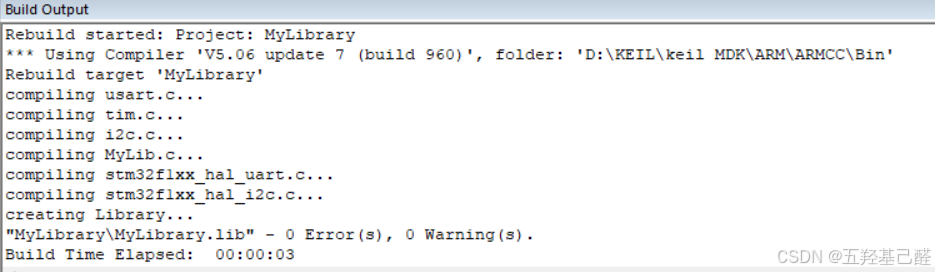

接着把库文件单独放在一个组内，其他文件夹屏蔽不编译以节省空间

 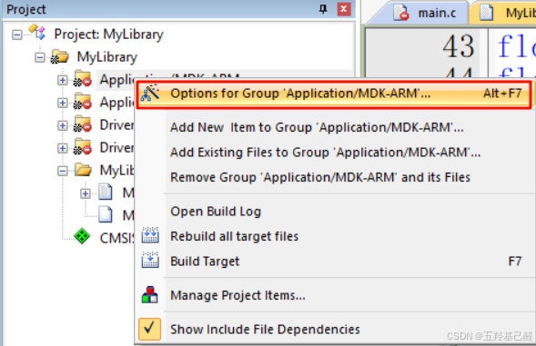

 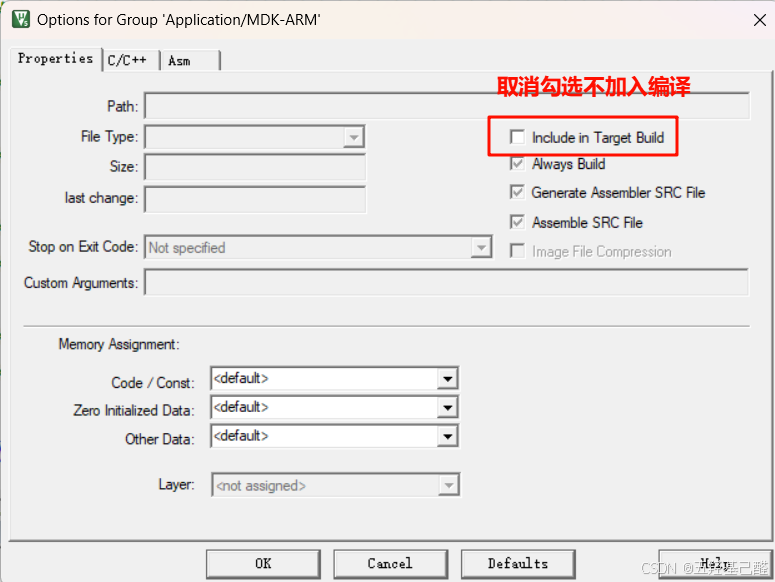

 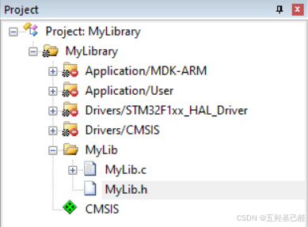

打开魔术棒，勾选生成.lib文件

 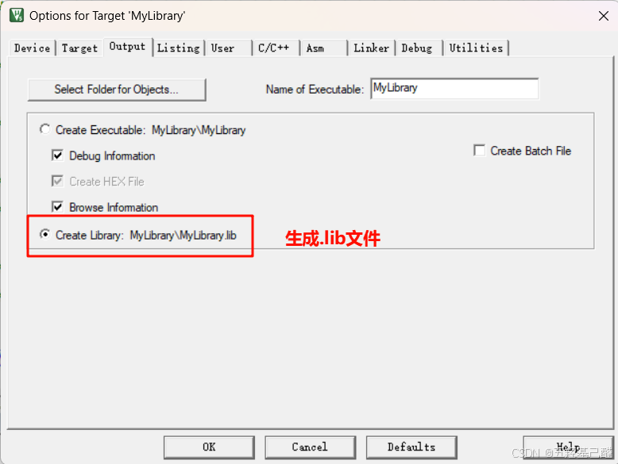

重新编译

 

在目标文件夹找到生成的.lib文件即可

 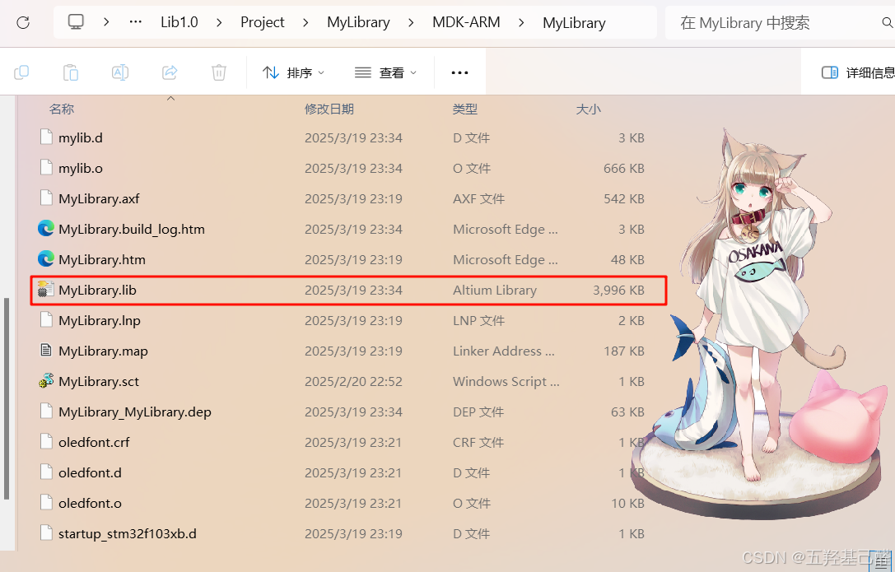

## 三.将库导入其他工程

将上述.lib文件夹复制出来添加到其他需要用到的工程中

 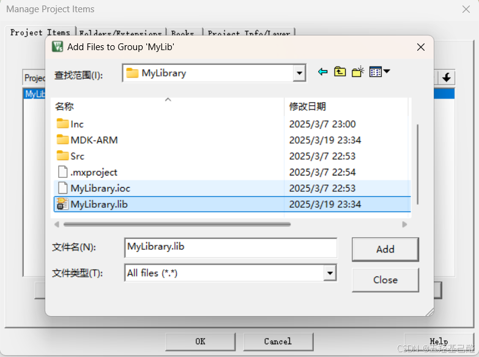

 

接着调用其中封装好的函数即可。

**注意：引入此文件后不需要#include任何文件，每次调用函数之前需要额外声明一遍。** 

## 四.测试

以上代码均未经过验证，仅存在于笔者理论阶段，待时间宽裕，笔者会对其正确性进行验证，读者若有时间可自己先做验证。

----2025.3.7