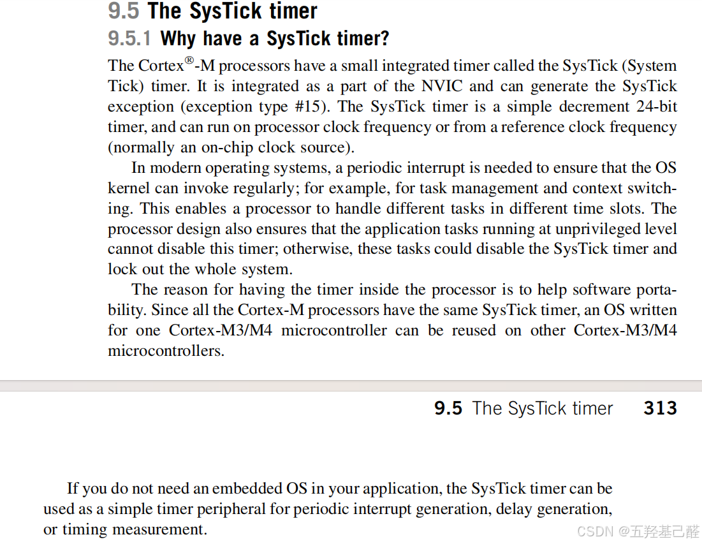
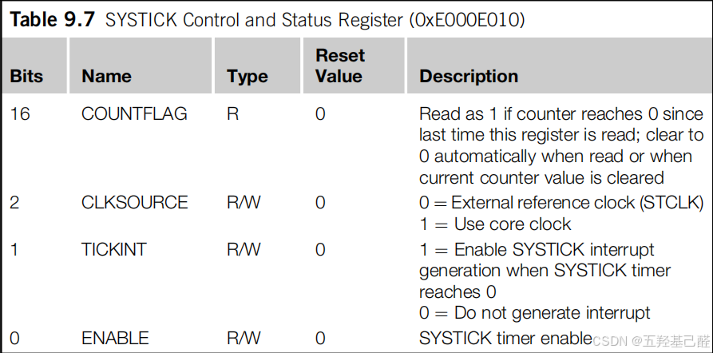
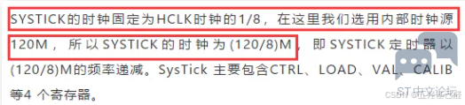
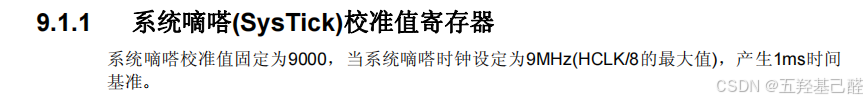

# 【总结(一)】单片机重点知识总结记录（MCU存储管理+STM32滴答定时器+BRR与BSRR寄存器讲解）

> 原创 已于 2024-10-13 12:59:09 修改 · 粉丝可见 · 917 阅读 · 12 · 4 · 本内容遵循CC 4.0 BY-SA版权协议 版权声明：本文为博主原创文章，遵循 CC 4.0 BY 版权协议，转载请附上原文出处链接和本声明。 GEO检测 · 编辑
> 文章链接：https://menoking.blog.csdn.net/article/details/142642729

**目录**

[TOC]


## 一.关于单片机存储管理

单片机内部存储器按功能主要可以分为ROM只读和RAM随机读写。其中ROM是指Flash，EEPROM一类，RAM则指SRAM和DRAM。我们最耳熟能详的就是SRAM了（DRAM在单片机或嵌入式系统中不常见），其全名为静态随机存储器，即只要保持通电则内部数据会一直保存，一般来说单片机中的SRAM会存储堆栈，中间结果，全局变量，局部变量，以及负责现场保护的临界资源。而其次就是Flash了，它主要负责存储固件程序，用户代码，常量数据，以及BootLoader（启动引导程序）等。

 

## 二.SysTick

最近在移植某LCD屏的驱动时，对源码产生了一些疑问，索性一次性查找齐全资料写一篇笔记备忘。

代码大致如下：

```cpp
#include "stm32f4xx_hal.h"
#include "delay.h" 
static u8  fac_us=0;//us延时倍乘数
static u16 fac_ms=0;//ms延时倍乘数
//初始化延迟函数
//SYSTICK的时钟固定为HCLK时钟的1/8
//SYSCLK:系统时钟
void delay_init(u8 SYSCLK)
{
	SysTick->CTRL&=0xfffffffb;//bit2清空,选择外部时钟  HCLK/8
	fac_us=SYSCLK/8;	
	fac_ms=(u16)fac_us*1000;
	/*
	对上面的内容进行解释：
		0xfffffffb换算为二进制得11111111111111111111111111111011
		即把SysTick->CTRL的第2位置0
		查看Cortex-M手册为以下内容：
		----------------------------------------------------------------------------------------
			Bits 	Name 		Type	Reset/Value 	Description
			2 		CLKSOURCE 	R/W 	0  				0=External reference clock (STCLK)
														1=Use core clock
		----------------------------------------------------------------------------------------
		即此位置0，使用外部参考时钟，即使用外部晶振作为时钟参考
	*/
	
}								    
//延时nms
//注意nms的范围
//SysTick->LOAD为24位寄存器,所以,最大延时为:
//nms<=0xffffff*8*1000/SYSCLK
//SYSCLK单位为Hz,nms单位为ms
//对72M条件下,nms<=1864 
void delay_ms(u16 nms)
{	 		  	  
	u32 temp;		   
	SysTick->LOAD=(u32)nms*fac_ms;//时间加载(SysTick->LOAD为24bit)
	SysTick->VAL =0x00;           //清空计数器
	SysTick->CTRL=0x01 ;          //开始倒数  
	do
	{
		temp=SysTick->CTRL;
	}
	while(temp&0x01&&!(temp&(1<<16)));//等待时间到达   
	SysTick->CTRL=0x00;       //关闭计数器
	SysTick->VAL =0X00;       //清空计数器	  	    
}   
//延时nus
//nus为要延时的us数.		    								   
void delay_us(u32 nus)
{		
	u32 temp;	    	 
	SysTick->LOAD=nus*fac_us; //时间加载	  		 
	SysTick->VAL=0x00;        //清空计数器
	SysTick->CTRL=0x01 ;      //开始倒数 	 
	do
	{
		temp=SysTick->CTRL;
	}
	while(temp&0x01&&!(temp&(1<<16)));//等待时间到达   
	SysTick->CTRL=0x00;       //关闭计数器
	SysTick->VAL =0X00;       //清空计数器	 
}
```

这里我对delay_init()中的fac_us=SYSCLK/8;这一句产生了疑问。例程主函数中调用初始化传入的是delay_init(72);明显为72MHz，这里的除8是为什么呢？

带着这个疑问，我查了Cortex-M内核手册以及参考了网上的一些帖子，算是大致弄明白了。

首先，SysTick是内核中的一个系统定时器，又名系统嘀嗒定时器，是一个24位的倒数计数器。

 

其中几个位的功能如下：

 

最值得注意的是，Systick 的信号来源于系统时钟，可选不分频与八分频。以STM32F103举例，不分频时为72MHz，八分频为9MHz。

这里以其他帖子看到的其他芯片为例：

 

在《STM32F10xxx参考手册（中文）》中有以下这一句话：

 

看到这里我们大概就明白了 ，fac_us=SYSCLK/8;这一句将72传入得72/8=9，9*（1/9 000 000） = 1us。总之，SysTick的实际频率应该就为72MHz的八分之一，即9MHz，我们对其进行处理之后得到一个fac_us可以精确进行1us计时的SysTick->LOAD寄存器的系数，当想延时n us时可以SysTick->LOAD=nus*fac_us;进行精确延时。

补充：这里可以将fac_ms理解为手册里提到的校准值，乘上这个系数之后得到我们想要的规定的时间，具体到这个例子里就是1ms和1us的定时。——2024. 10. 1补充

## 三.关于STM32F4找不到BRR或BSRR的问题

在移植LCD驱动时发现了个问题：编译器找不到BSRR和BRR寄存器，如下：

```cpp
#define SCL_H GPIOB->BSRR = GPIO_Pin_6
#define SCL_L GPIOB->BRR  = GPIO_Pin_6
```

### 1.库函数替代

这里要注意的是F4系列已经没有这BRR寄存器了，但其实对这两个寄存器的操作就相当于拉低或拉高相应GPIO的电平，我们完全可以以库函数来代替:

```cpp
void GPIO_SetBits(GPIO_Typedef* GPIOx， uint16_t GPIO_Pin)
void GPIO_ResetBits(GPIO_Typedef* GPIOx, uint16_t GPIO_Pin)  
```

### 2.寄存器

或者我们还可以用BSRRH和BSRRL代替，如下：

```cpp
#define SCL_H GPIOB->BSRRH = GPIO_Pin_6 
#define SCL_L GPIOB->BSRRL = GPIO_Pin_6
```

原因如下：

> BSRR 和 BRR 都是 STM32 系列 MCU 中 GPIO 的寄存器。 BSRR 称为端口位设置/清楚寄存器，BRR称为端口位清除寄存器。
> 
> BSRR 低 16 位用于设置 GPIO 口对应位输出高电平，高 16 位用于设置 GPIO 口对应位输出低电平。
> 
> BRR 低 16 位用于设置 GPIO 口对应位输出低电平。高 16 位为保留地址，读写无效。

我们详细观察库函数：


```cpp
void HAL_GPIO_WritePin(GPIO_TypeDef* GPIOx, uint16_t GPIO_Pin, GPIO_PinState PinState)
{
  /* Check the parameters */
  assert_param(IS_GPIO_PIN(GPIO_Pin));
  assert_param(IS_GPIO_PIN_ACTION(PinState));
 
  if(PinState != GPIO_PIN_RESET)
  {
    GPIOx->BSRR = GPIO_Pin;
  }
  else
  {
    GPIOx->BSRR = (uint32_t)GPIO_Pin << 16U;
  }
}
```

### 3.寄存器偏移

于是我们又可以总结出一种方法

```cpp
#define SCL_H GPIOx->BSRR = (uint32_t)GPIO_Pin << 16U; 
#define SCL_L GPIOx->BSRR = GPIO_Pin;
```