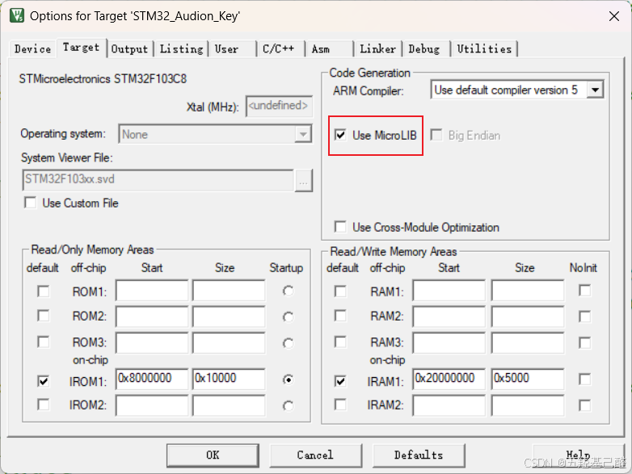

# 【总结(三)】单片机重点知识总结记录（串口重定向+按键消抖+延时）

> 原创 已于 2024-12-26 15:31:12 修改 · 公开 · 2.3k 阅读 · 61 · 7 · 本内容遵循CC 4.0 BY-SA版权协议 版权声明：本文为博主原创文章，遵循 CC 4.0 BY 版权协议，转载请附上原文出处链接和本声明。 GEO检测 · 编辑
> 文章链接：https://menoking.blog.csdn.net/article/details/143157930

## 一.串口重定向

串口重定向代码如下

注意：

> 
> 
> - 要添加头文件include "stdio.h"
> 
> - 要勾选微库，即Use MicroLIB
> 
> 

 

```cpp
/**********重定向************/
//串口1
int fputc(int ch, FILE *f)
{
  HAL_UART_Transmit(&huart1, (uint8_t *)&ch, 1, 0xffff);
  return ch;
}
 
int fgetc(FILE * f)
{
  uint8_t ch = 0;
  HAL_UART_Receive(&huart1,&ch, 1, 0xffff);
  return ch;
}
/**********************************/
```

## 二.按键消抖算法

### 延时消抖

```cpp
uint8_t Key_GetValue(void)
{
	uint8_t value = 0;
	if(HAL_GPIO_ReadPin(GPIOA,KEY_A_Pin) == GPIO_PIN_SET)value = 1;
	if(HAL_GPIO_ReadPin(GPIOA,KEY_B_Pin) == GPIO_PIN_SET)value = 2;
	if(HAL_GPIO_ReadPin(GPIOA,KEY_C_Pin) == GPIO_PIN_SET)value = 3;
	if(HAL_GPIO_ReadPin(GPIOA,KEY_D_Pin) == GPIO_PIN_SET)value = 4;
	return value;
}
 
uint8_t Key_Scan(void)
{
	uint8_t key_number = 0;
	key_number = Key_GetValue();
	if(key_number != 0)
	{
		mdelay(20);
		while( Key_GetValue() != 0);
		mdelay(20);
		return key_number;
	}
	return 0;
}
```

### 三行消抖

主要消抖算法如下：

```cpp
void Key_RemoveShake(void)
{
	Key_Value = Key_GetValue();//获取按下键值
	Key_Down = Key_Value & (Key_Value ^ Key_Last);//获取下降沿
	Key_Up = ~Key_Value & (Key_Value ^ Key_Last);//获取上升沿
	Key_Last = Key_Value;//键值覆盖
}
```

若按键共阴（公共端为地），则按下时为下降沿，只需判断下降沿是否存在即可判断是否有按键按下：

```cpp
uint8_t Key_Press(void)
{
	return Key_Down ? Key_Value : 0;
}
```

完整代码如下：

```cpp
//              KEY1   PD8
//              KEY2   PD9
//              KEY3   PD10
//              KEY4   PD11
//              KEY5   PD12
//              KEY6   PD13
 
#include "Key.h"
 
uint8_t Key_Value,Key_Down,Key_Up,Key_Last;
 
uint8_t Key_GetValue(void)
{
	if(HAL_GPIO_ReadPin(GPIOD,KEY1_Pin) == 0)
		return 1;
	if(HAL_GPIO_ReadPin(GPIOD,KEY2_Pin) == 0)
		return 2;
	if(HAL_GPIO_ReadPin(GPIOD,KEY3_Pin) == 0)
		return 3;
	if(HAL_GPIO_ReadPin(GPIOD,KEY4_Pin) == 0)
		return 4;
	if(HAL_GPIO_ReadPin(GPIOD,KEY5_Pin) == 0)
		return 5;
	if(HAL_GPIO_ReadPin(GPIOD,KEY6_Pin) == 0)
		return 6;
	return 0;
}
 
//以下函数需要在中断中使用，推荐10ms定时器中断
void Key_RemoveShake(void)
{
	Key_Value = Key_GetValue();//获取按下键值
	Key_Down = Key_Value & (Key_Value ^ Key_Last);//获取下降沿
	Key_Up = ~Key_Value & (Key_Value ^ Key_Last);//获取上升沿
	Key_Last = Key_Value;//键值覆盖
}
 
uint8_t Key_Press(void)
{
	return Key_Down ? Key_Value : 0;
}
 
```

## 三.非阻塞延时

### 阻塞式延时

#### 直接循环解决

```cpp
void delay(u16 num)
{
  u16 i,j;
  for(i=0;i<num;i++)
    for(j=0;j<10000;j++);
}
```

#### 定时器中断实现

```cpp
void udelay(int us)
{
    extern TIM_HandleTypeDef        htim1;
    TIM_HandleTypeDef *hHalTim = &htim1;
 
    uint32_t ticks;
    uint32_t told, tnow, tcnt = 0;
    uint32_t reload = __HAL_TIM_GET_AUTORELOAD(hHalTim);
 
    ticks = us * reload / (1000);  /* 假设reload对应1ms */
    told = __HAL_TIM_GET_COUNTER(hHalTim);
    while (1)
    {
        tnow = __HAL_TIM_GET_COUNTER(hHalTim);
        if (tnow != told)
        {
            if (tnow > told)
            {
                tcnt += tnow - told;
            }
            else
            {
                tcnt += reload - told + tnow;
            }
            told = tnow;
            if (tcnt >= ticks)
            {
                break;
            }
        }
    }
 
}
```

> 特别注意：HAL_Delay()也算是阻塞式延时，虽然它使用的是滴答定时器中断来进行读数，但是其延时过程仍为忙等待过程，因此仍是阻塞式延时。

### 非阻塞延时

实际上裸机应该是不能实现真正意义上的非阻塞延时的，即处理器在延时过程中去完成别的任务，但是一般来说换个名字我们可能更熟悉——时间片轮询。

当我们配置一个毫秒级的定时器中断时，在其中定义一个时间标志，进行自增或自减后判断是否到达对应时间然后在函数外执行相应功能。

```cpp
uint16_t Timer_1000ms = 0,Timer_1000ms_Flag = 0;
 
void HAL_TIM_PeriodElapsedCallback(TIM_HandleTypeDef *htim)
{
    if (htim == (&htim2))
    {
        ++Timer_1000ms;
        if(Timer_1000ms >= 1000)
        {
            Timer_1000ms_Flag = 1;
            Timer_1000ms = 0;
        }
    }
}
 
void Task1()
{
    //...
}
 
int main(void)
{
    while(1)
    {
        if(Timer_1000ms_Flag == 1)
        {
            Task1();
            Timer_1000ms_Flag = 0;
        }
        
    }
}
```