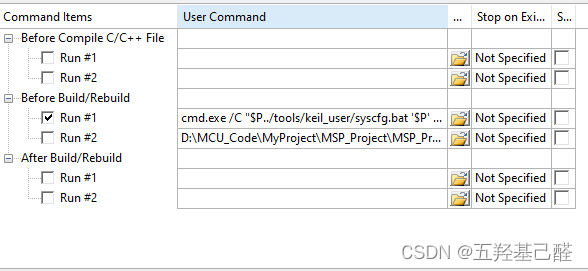
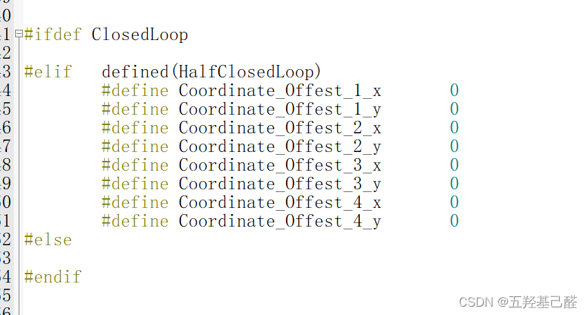
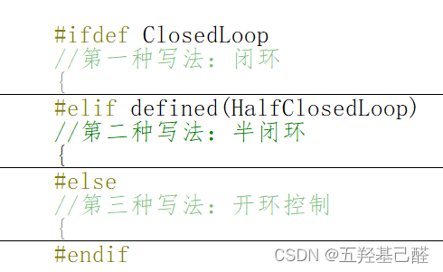
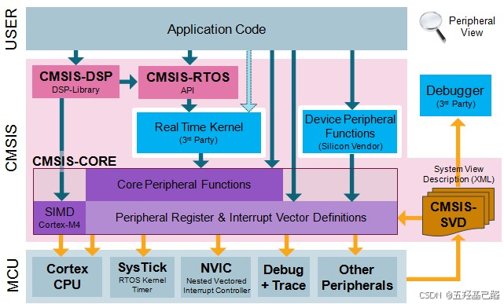
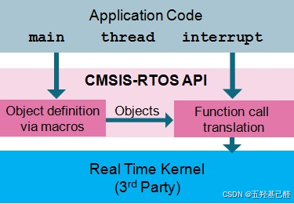
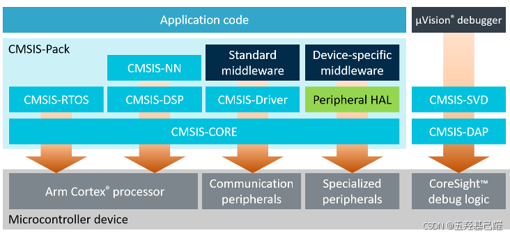
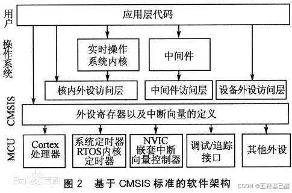

# 【总结(二)】单片机重点知识总结记录（Keil相对路径+条件编译+CMSIS）

> 原创 已于 2024-11-03 20:02:53 修改 · 粉丝可见 · 2.2k 阅读 · 51 · 32 · 本内容遵循CC 4.0 BY-SA版权协议 版权声明：本文为博主原创文章，遵循 CC 4.0 BY 版权协议，转载请附上原文出处链接和本声明。 GEO检测 · 编辑
> 文章链接：https://menoking.blog.csdn.net/article/details/142897061

**目录**

[TOC]


## 一.关于keil配置项和程序源文件引用的相对路径问题

在学习MSP系列单片机的时候，碰上最多的问题就是路径的问题。于是找了一些资料，现在写下来备忘。

其实keil用户图形配置项中的相对路径和程序中头文件引用的相对路径是不同的，由于基准文件不一样，所以这两个的相对路径理解起来就完全不一样。

对于keil的图形配置项来说，里面的相对路径都是基于keil的工程文件，也就是后缀为.uvprojx的工程文件来说的。 

如图，这里的“../”是.uvprojx的上一级目录里找。

对于程序的头文件引用来说，这个基准则变成了当前程序源文件。 

对于这个头文件，则是对当前.c文件同一目录下的ti/文件夹下的文件的引用。

---

2024.5.26

## 二.C语言中多条件编译的灵活使用

在调试23年电赛E题时为了灵活的变动代码，于是使用了以下条件编译，发现条件编译对于调试来说是极其灵活多变而且很方便的，故写下此文章一备忘。

最开始的是普通的条件编译，如下：

 

 

这里通过定义不同宏来编译不同代码，使得整个系统调试起来更加地灵活。

但是由于我下面写了三种方法去调试，每个方法代码有将近一两百行，每次都要注释其他两个再去调试另一个太麻烦了，于是我选择了多条件编译，如下：

 

 

大概写法类似于：

```cpp
#ifdef MACRO_A
    // 编译针对 MACRO_A 的代码
    printf("MACRO_A is defined.\n");
#elif defined(MACRO_B)
    // 编译针对 MACRO_B 的代码
    printf("MACRO_B is defined.\n");
#else
    // 如果两者都没有定义，就不编译任何代码
    // 或者可以在这里编译默认情况下的代码
#endif
```

下面同时保留其条件编译的写法，供以后使用：

```cpp
#if 常量表达式1
// ... some codes
#elif 常量表达式2
// ... other codes
#elif 常量表达式3
// ...
...
#else
// ... statement
#endif
```

```cpp
#if constant a
　　  ...code1...
#else
        #if constant b
　　        ...code 2...
        #else
　　        ...code 3...
　　    #endif
#endif
```

由于需要使用逻辑条件编译，于是学习了一下：

实现如果A和B均未被定义，则执行C：

```cpp
#if !defined(A) && defined(B)
//C代码
#endif
```

```cpp
#ifndef A
#ifndef B
    //C代码
#endif
#endif
```

## 三.个人对于CMSIS的理解

我们在进行开发ARM的Cortex-M系芯片开发时经常看见CMSIS这一个名词，但是这个到底是什么呢？

CMSIS（Cortex Microcontroller Software Interface Standard），顾名思义，是Cortex-M系处理器的标准软件接口。它是由ARM提供的一组硬件抽象层接口API，以便软件开发者能够更容易地编写可移植的、高效的和可重用的代码。

CMSIS的主要结构：

> 
> 
> 1. **设备访问层（CMSIS-DAP）** ：提供了一套标准的API来访问微控制器的内部外设，如GPIO、中断控制器、定时器等。
> 
>    1. **<u>​​ `DAP.h` 和 `DAP.c` ：用于调试访问端口的文件。</u>**
> 
> 2. **内核访问层（CMSIS-CORE）** ：定义了访问Cortex-M处理器内核的接口，包括寄存器映射、中断处理和内核服务的API。
> 
>    1. core_cm*.h：这是针对特定Cortex-M系列处理器的核心头文件，例如core_cm3.h是针对Cortex-M3处理器的。
> 
>    2. core_sc*.h：针对Cortex-M0和Cortex-M0+处理器的核心头文，cmsis_version.h：包含CMSIS版本信息的头文件。
> 
>    3. irq_ctrl.h：中断控制相关的头文件。
> 
>    4. mpu_armv*.h：内存保护单元（MPU）相关的头文件，针对不同的ARM版本。
> 
> 3. **中间件访问层（CMSIS-Middleware）** ：为中间件组件（如实时操作系统、网络协议栈、电机控制算法等）提供标准化的接口。
> 
>    1. <u>**这些文件包含了中间件组件，如RTOS、网络协议栈、图形库等的接口定义。**</u>
> 
> 4. **CMSIS-Driver** ：
> 
>    1. 提供硬件抽象层，用于与微控制器的外设进行通信。
> 
>    2. 包括各种外设的驱动模型和接口定义，例如SPI、I2C、USB等。
> 
> 5. **CMSIS-RTOS** ：
> 
>    1. 为实时操作系统提供标准的API。
> 
>    2. 使得不同的RTOS可以在CMSIS层上进行抽象，从而实现软件的可移植性。
> 
> 

架构如下： 

 

 

 

