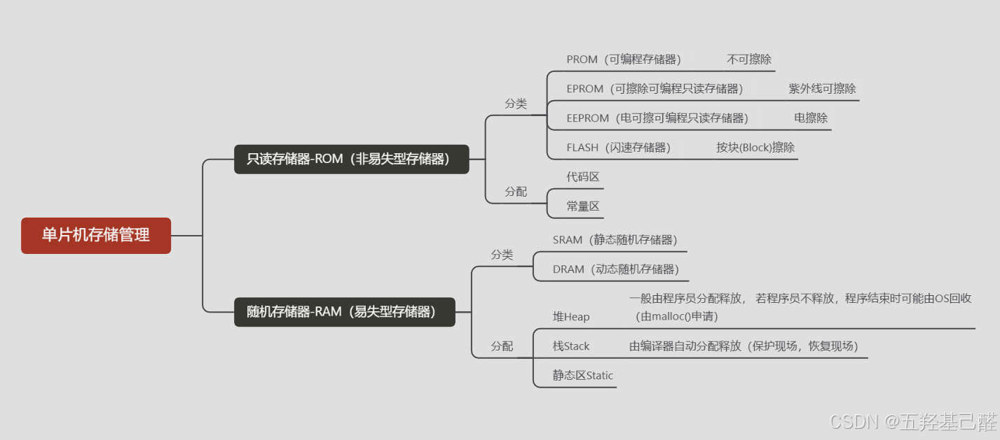
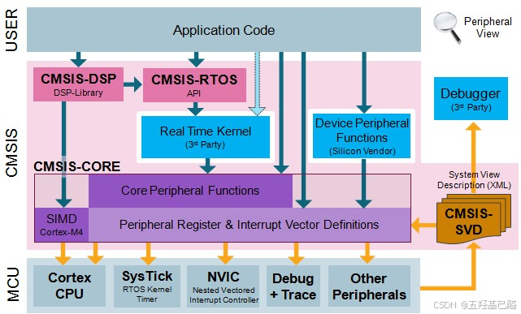
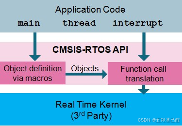
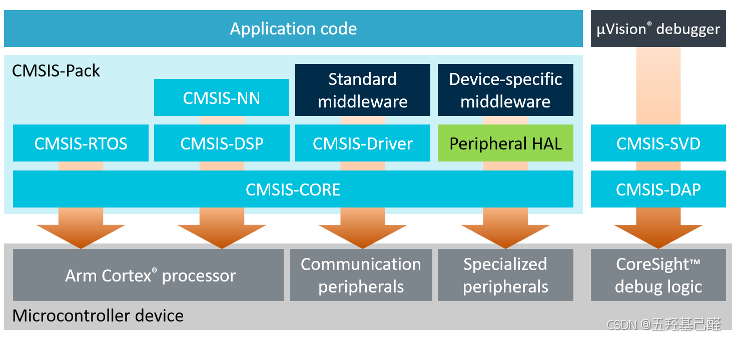
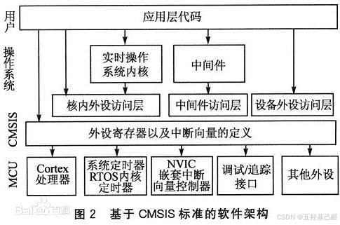
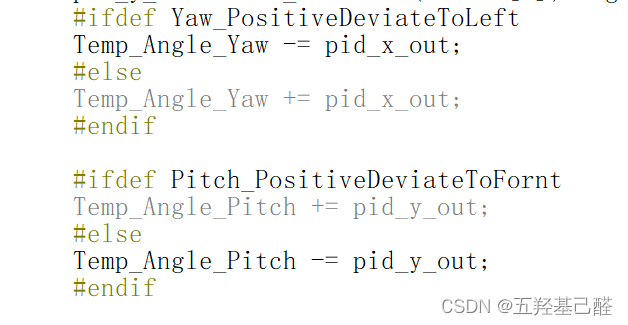

# 【杂项】有关单片机杂项记录（存储管理，CMSIS，BRR/BSRR，相对路径，多条件编译）【完成】

> 原创 于 2025-12-28 23:14:42 发布 · 公开 · 804 阅读 · 31 · 27 · 本内容遵循CC 4.0 BY-SA版权协议 版权声明：本文为博主原创文章，遵循 CC 4.0 BY 版权协议，转载请附上原文出处链接和本声明。 GEO检测 · 编辑
> 文章链接：https://menoking.blog.csdn.net/article/details/156368043

## 一.关于单片机的存储管理

单片机内部存储器按功能主要可以分为ROM只读和RAM随机读写。其中ROM是指Flash，EEPROM一类，RAM则指SRAM和DRAM。我们最耳熟能详的就是SRAM了（DRAM在单片机或嵌入式系统中不常见），其全名为静态随机存储器，即只要保持通电则内部数据会一直保存，一般来说单片机中的SRAM会存储堆栈，中间结果，全局变量，局部变量，以及负责现场保护的临界资源。而其次就是Flash了，它主要负责存储固件程序，用户代码，常量数据，以及BootLoader（启动引导程序）等。

 

## 二.个人对于CMSIS的理解

我们在进行开发ARM的Cortex-M系芯片开发时经常看见CMSIS这一个名词，但是这个到底是什么呢？

**CMSIS（Cortex Microcontroller Software Interface Standard）** ，顾名思义，是Cortex-M系处理器的标准软件接口。它是由ARM提供的一组硬件抽象层接口API，以便软件开发者能够更容易地编写可移植的、高效的和可重用的代码。

CMSIS的主要结构：

> 
> 
> 1. **设备访问层（CMSIS-DAP）** ：提供了一套标准的API来访问微控制器的内部外设，如GPIO、中断控制器、定时器等。
> 
>    1. **<u>​​ `DAP.h` 和 `DAP.c` ：用于调试访问端口的文件。</u>**
> 
> 2. **内核访问层（CMSIS-CORE）** ：定义了访问Cortex-M处理器内核的接口，包括寄存器映射、中断处理和内核服务的API。
> 
>    1. <u>**`core_cm*.h` ：这是针对特定Cortex-M系列处理器的核心头文件，例如 `core_cm3.h` 是针对Cortex-M3处理器的。**</u>
> 
>    2. <u>**`core_sc*.h` ：针对Cortex-M0和Cortex-M0+处理器的核心头文件。 `cmsis_version.h` ：包含CMSIS版本信息的头文件。**</u>
> 
>    3. <u>**`irq_ctrl.h` ：中断控制相关的头文件。**</u>
> 
>    4. <u>**`mpu_armv*.h` ：内存保护单元（MPU）相关的头文件，针对不同的ARM版本。**</u>
> 
> 3. **中间件访问层（CMSIS-Middleware）** ：为中间件组件（如实时操作系统、网络协议栈、电机控制算法等）提供标准化的接口。
> 
>    1. <u>**这些文件包含了中间件组件，如RTOS、网络协议栈、图形库等的接口定义。**</u>
> 
> 4. **CMSIS-Driver** ：
> 
>    - 提供硬件抽象层，用于与微控制器的外设进行通信。
> 
>    - 包括各种外设的驱动模型和接口定义，例如SPI、I2C、USB等。
> 
> 5. **CMSIS-RTOS** ：
> 
>    - 为实时操作系统提供标准的API。
> 
>    - 使得不同的RTOS可以在CMSIS层上进行抽象，从而实现软件的可移植性。
> 
> 

架构如下：

 

 

 

 

## 三.BRR/BSRR寄存器

在移植LCD驱动时发现了个问题：编译器找不到BSRR和BRR寄存器，如下：

```cobol
#define SCL_H GPIOB->BSRR = GPIO_Pin_6
#define SCL_L GPIOB->BRR  = GPIO_Pin_6
```

这里要注意的是F4系列已经没有这BRR寄存器了，但其实对这两个寄存器的操作就相当于拉低或拉高相应GPIO的电平，我们完全可以以库函数来代替:

```cobol
void GPIO_SetBits(GPIO_Typedef* GPIOx， uint16_t GPIO_Pin)
void GPIO_ResetBits(GPIO_Typedef* GPIOx, uint16_t GPIO_Pin)  
```

或者我们还可以用BSRRH和BSRRL代替，如下：

```cobol
#define SCL_H GPIOB->BSRRH = GPIO_Pin_6 
#define SCL_L GPIOB->BSRRL = GPIO_Pin_6
```

原因如下：

> BSRR 和 BRR 都是 STM32 系列 MCU 中 GPIO 的寄存器。 BSRR 称为端口位设置/清楚寄存器，BRR称为端口位清除寄存器。
> 
> BSRR 低 16 位用于设置 GPIO 口对应位输出高电平，高 16 位用于设置 GPIO 口对应位输出低电平。
> 
> BRR 低 16 位用于设置 GPIO 口对应位输出低电平。高 16 位为保留地址，读写无效。

我们详细观察库函数

```cobol
void HAL_GPIO_WritePin(GPIO_TypeDef* GPIOx, uint16_t GPIO_Pin, GPIO_PinState PinState)
{
  /* Check the parameters */
  assert_param(IS_GPIO_PIN(GPIO_Pin));
  assert_param(IS_GPIO_PIN_ACTION(PinState));
 
  if(PinState != GPIO_PIN_RESET)
  {
    GPIOx->BSRR = GPIO_Pin;
  }
  else
  {
    GPIOx->BSRR = (uint32_t)GPIO_Pin << 16U;
  }
}
```

于是我们又可以总结出一种方法

```cobol
#define SCL_H GPIOx->BSRR = (uint32_t)GPIO_Pin << 16U; 
#define SCL_L GPIOx->BSRR = GPIO_Pin;
```

## 四.相对路径问题

**相对路径与绝对路径** 

在学习MSP系列单片机的时候，碰上最多的问题就是路径的问题。于是找了一些资料，现在写下来备忘。

其实keil用户图形配置项中的相对路径和程序中头文件引用的相对路径是不同的，由于基准文件不一样，所以这两个的相对路径理解起来就完全不一样。

对于keil的图形配置项来说，里面的相对路径都是基于keil的工程文件，也就是后缀为.uvprojx的工程文件来说的。

 

如图，这里的“../”是.uvprojx的上一级目录里找。

对于程序的头文件引用来说，这个基准则变成了当前程序源文件。

 

对于这个头文件，则是对当前.c文件同一目录下的ti/文件夹下的文件的引用。

## 五.多条件编译

**条件编译** 

在调试23年电赛E题时为了灵活的变动代码，于是使用了以下条件编译，发现条件编译对于调试来说是极其灵活多变而且很方便的，故写下此文章一备忘。

最开始的是普通的条件编译，如下： 

 

这里通过定义不同宏来编译不同代码，使得整个系统调试起来更加地灵活。

但是由于我下面写了三种方法去调试，每个方法代码有将近一两百行，每次都要注释其他两个再去调试另一个太麻烦了，于是我选择了多条件编译，如下：

 

 

大概写法类似于：

```cpp
#ifdef MACRO_A
    // 编译针对 MACRO_A 的代码
    printf("MACRO_A is defined.\n");
#elif defined(MACRO_B)
    // 编译针对 MACRO_B 的代码
    printf("MACRO_B is defined.\n");
#else
    // 如果两者都没有定义，就不编译任何代码
    // 或者可以在这里编译默认情况下的代码
#endif
```

下面同时保留其条件编译的写法，供以后使用：

```cpp
#if 常量表达式1
// ... some codes
#elif 常量表达式2
// ... other codes
#elif 常量表达式3
// ...
...
#else
// ... statement
#endif
```

```cpp
#if constant a
　　  ...code1...
#else
        #if constant b
　　        ...code 2...
        #else
　　        ...code 3...
　　    #endif
#endif
```

由于需要使用逻辑条件编译，于是学习了一下：

实现如果A和B均未被定义，则执行C：

```scss
#if !defined(A) && defined(B)
//C代码
#endif
```

```cpp
#ifndef A
#ifndef B
    //C代码
#endif
#endif
```