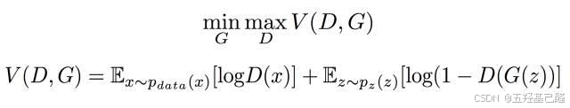
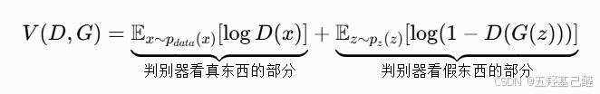
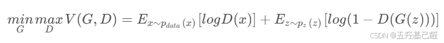
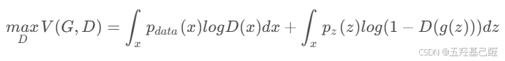
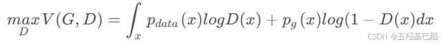
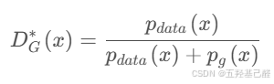
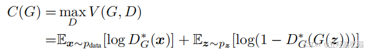
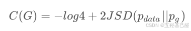
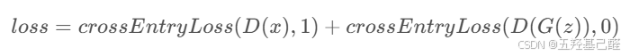
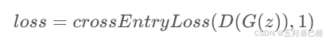

# 【深度学习速成】半小时从零开始搭建一个GAN网络

> 原创 已于 2026-02-02 11:55:57 修改 · 公开 · 1.1k 阅读 · 30 · 20 · 本内容遵循CC 4.0 BY-SA版权协议 版权声明：本文为博主原创文章，遵循 CC 4.0 BY 版权协议，转载请附上原文出处链接和本声明。 GEO检测 · 编辑
> 文章链接：https://menoking.blog.csdn.net/article/details/154409842

## 一.初识GAN

###  **理解：** 

生成对抗网络（GAN）是一种深度学习模型，它通过让两个神经网络相互“博弈”来学习数据分布，从而生成新的数据。

> GAN由两个核心部分组成，它们就像伪造者（生成器）和侦探（判别器）之间的关系：
> 
> - **生成器（Generator）** ：接收一个随机噪声向量作为输入，然后将其"转换"成一张模拟图像。它的目标是生成足够逼真的图像来"欺骗"判别器。
> 
> - **判别器（Discriminator）** ：接收一张图像（可以是真实图像或生成器生成的假图像），然后判断其真伪。它的目标是尽可能准确地区分真实图像和生成器产生的假图像。
> 
> 

###  **公式推演：** 

**原文公式：** 

 

这个是GAN的基本公式。看上去蛮复杂，实际上我们只要知道这里的V代表D（判别器）和G（生成器）共同作用得到的分数即可；G让V尽可能小，D让V尽可能大，他们相互对抗； **理论上** V最大为0，最小为负无穷。

 

> 对其中符号做出解释：
> 
> - E代表平均期望
> 
> - x ~ p_data(x)表示真实数据分布中的一个随机样本x
> 
> - z ~ p_z(z)则表示噪声分布中的一个随机噪声z
> 
> - log D(x)是对输入真实样本到判别器判别后的分数
> 
> - log(1 - D(G(z)))则是输入生成样本，即假样本后的分数
> 
> - **D输出一个0~1的数字，1表示真，0表示假**
> 
> 

当D对真样本判断越准确时，前半部分越接近0；当D对假样本判断越准确时，后半部分越接近0。因此D的理想情况是使V无限接近0。

而生成器则需要欺骗过判别器，即与判别器目标相反，也即理想极端情况下：D(x)=0，D(G(z))=1。G的理想情况是使V无限接近-∞。

但是由于生成器G与判别器D互相对抗，我们是永远无法接近理想情况的，我们应该尽可能地找到同时满足G和D的最优解，这也就是我们优化GAN网络的关键所在，同时也是原始GAN的缺陷所在。

### 最优解：

于是我们分别记固定G时D使得V最大时的V值，以及固定D时G使得V最小时的V值为如下式子：

$$
D_{G}^{*}=max_{D}V(G,D)
$$， $$
G_{D}^{*}=min_{G}V(G,D^{*})
$$

> 特别注意：以上定义是有先后顺序的，D*是在G固定情况下定义，而G*则是在D*取得最优解下定义的。也就是我们看到的原文中的等式左侧其实是min（maxV）。

 

#### D判别器最优解

> 概率论连续期望的计算：
> 
> **当随机变量是连续的时候，期望值（平均值）要用积分形式来表达：∫ (函数值) × (概率密度) dx** 

通过概率论期望的计算我们可以将原始式变形成如下式子：

 

并且由于生成器固定，记 $$
b = p_{g}
$$；同时真实样本分布也不变，即 $$
a= p_{data}
$$；记D(x)为自变量，于是我们对下式进行求极值：



可得当 $$
D(x)=\frac{a}{a+b}
$$时取得极值为：



又G最终优解时G生成的虚假样本分布应与真实样本分布一致，即 $$
a=b
$$，故有最终 $$
D=0.5
$$。

**于是D的最优解即为0.5。** 

#### G生成器最优解

上述D最优解是在G的最优解 $$
p_{data}=p_{g}
$$下取得的，虽然G的这个优解可以定性理解得出，但也可以由严格的数学证明得到。其中记 $$
C(G)
$$如下：



使得原始优化公式变成 $$
minC(G)
$$

即C(G) 表示在判别器达到最优条件下，对抗目标函数关于生成器的等价形式，其最小化等价于最小化生成分布与真实分布之间的 Jensen–Shannon 散度。

通过一系列复杂数学推导可得与JS散度的关系：



由于JSD的散度取值为（0，log2），当JSD取0时可以取得 $$
C(G)
$$的最小值即 $$
minC(G)=-log4
$$，当且仅当 $$
p_{data}=p_{g}
$$时JSD才能取得0。因此可得G的最优解。

### *损失函数*

#### 判别器

以上仅为理论推导，实际训练过程中我们用损失函数来量化上面的优化目标函数 $$
V(D,G)
$$。

判别器损失函数，即判别真实样本时与1的差，判别虚假样本时与0的差，这里记为 $$
L_{D}
$$：

 

即 $$
L_{D}=-V(D,G)
$$，判别器的损失函数与目标函数是相反数的关系，又由于我们前面推导出优化目标函数最小值为 $$
-log4
$$，因此实际训练过程中 $$
L_{D}
$$一般也会收敛于 $$
-log4
$$，即 $$
1.386
$$左右。

#### 生成器

生成器损失函数，忽略前半部分不含G的式子：



即 $$
L_{G}=-E_{Z}[logD(G(Z))]
$$，其中取判别器最优即 $$
D(G(Z)=0.5
$$，

故有 $$
L_{G}=-log(0.5)\approx 0.693
$$，于是实际训练过程中生成器的损失函数在 $$
0.693
$$左右。

## 二.环境搭建

本次学习我们在Anaconda的编译环境下，使用PyCharm作IDE，在Pytorch框架中进行学习和构建GAN网络。环境搭建的详细步骤可以移步另一篇文章参考：

## 三.网络构建

**GPU加速** 训练部分（固定写法，加在代码头部）

```python
device = torch.device("cuda" if torch.cuda.is_available() else "cpu")
```

训练用 **常量** 

```python
latent_dim = 100  # 输入随机噪声维度
image_size = 28 * 28
batch_size = 64  # 批次样本数
lr = 2e-4  # 学习率
epochs = 20  # 学习轮次
save_path = "../Test_Gan_Results"  # 保存路径
os.makedirs(save_path, exist_ok=True)  # 创建保存生成结果的文件夹
```

数据集数据 **预处理** 

```python
transform = transforms.Compose([transforms.ToTensor(), transforms.Normalize((0.5,), (0.5,))])
```

以MNIST数据集为例定义 **数据集对象和加载器对象** 

```python
# MNIST公开数据集
train_dataset = torchvision.datasets.MNIST(root="../DataSet_MNIST", train=True, transform=transform, download=True)
# 定义加载器
train_loader = DataLoader(train_dataset, batch_size=batch_size, shuffle=True)
```

###  **生成器模型** 

包含初始化及前向传播函数。

其中初始化包含使用super方法调用父类（nn.Module）的初始化函数__init__()。

接着定义了一个Sequential顺序容器对象作为该类的一个属性并命名为model。

容器内输入噪声每个的维度代表一个"潜在特征"，每层函数逐渐扩展这个噪声维度，即扩展其表达能力，并在最后一层压缩匹配输出尺寸。

- ReLU： **ReLU(x)=max(0,x)。** 当输入 x > 0  时，输出等于输入；当输入 x ≤ 0  时，输出为 0。极易导致梯度消失，神经元"死亡"。

- LeakyReLU：ReLU改进，当x<0时，也有极小梯度，因此能有效避免梯度消失。

- Tanh：tan函数，对称输出。

在后面可以直接通过调用同类名函数来调用前向传播函数。

```python
# 生成器
class Generator(nn.Module):
    def __init__(self):
        super(Generator, self).__init__()
        self.model = nn.Sequential(
            nn.Linear(latent_dim, 256),  # 全连接层
            nn.LeakyReLU(0.2),  # 激活函数
            nn.Linear(256, 512),
            nn.LeakyReLU(0.2),
            nn.Linear(512, 1024),
            nn.LeakyReLU(0.2),
            nn.Linear(1024, image_size),
            nn.Tanh()  # tan函数激活
        )
 
    def forward(self, z):
        img = self.model(z)
        return img.view(img.size(0), 1, 28, 28)
```

###  **判别器模型** 

包含初始化及前向传播。

判别器结构与生成器结构对称相反，逐层提取特征，最总归一化后决策。但与生成器有所不同的是，这里每层都加了Dropout随机失活，目的是削弱判别器的能力，避免过拟合，且这里的Drop只在训练时起作用，验证时失效。

最终的SIgmoid归一化映射到概率区间[0,1]进行决策判断。

前向传播中img.view()用来改变张量形状保持数据不变，取img.size(0)图像的第一维数值，即64，'-1'表示自动计算维度大小，即将其他维度展平成一个维度，最终实现4维张量向2维张量的转换，得以输入到全连接层（只接收二维张量）。

```python
class Discriminator(nn.Module):
    def __init__(self):
        super(Discriminator, self).__init__()
        self.model = nn.Sequential(
            nn.Linear(image_size, 1024),
            nn.LeakyReLU(0.2),
            nn.Dropout(0.3),  # 正则化，防止过拟合
            nn.Linear(1024, 512),
            nn.LeakyReLU(0.2),
            nn.Dropout(0.3),
            nn.Linear(512, 256),
            nn.LeakyReLU(0.2),
            nn.Dropout(0.3),
            nn.Linear(256, 1),
            nn.Sigmoid()  # 最终激活函数输出[0,1]概率
        )
 
    def forward(self, img):
        img_flat = img.view(img.size(0), -1)  # 展平图片  img.size(0)获取第一个维度的大小
        # 写法二：img_flat = img.reshape(img.size(0), -1)
        # 写法三：img_flat = img.flatten(1)
        validity = self.model(img_flat)  # 输入展平后的数据，输出概率
        return validity
```

> 有关模型的调用过程
> 
> 小白可能不太理解内部的调用过程，实际上当你调用Discriminator()类同名函数时调用的是Discriminator.__call__()，此时顺序调用父类nn.Module.__call__()，父类的__call__()定义了前向传播的hook函数，调用子类中的forward()函数，因此子 **类模型中必须实现forward()方法。** 故调用Discriminator()即调用了forward()。

**实例化模型** 

实例化生成器和判别器以及损失函数。

这里的优化器选择Adam优化器，传入对应模型的所有参数，设置学习率lr，其中betas是动量参数，一阶矩衰减率0.5控制动量，二阶矩衰减率0.999控制自适应学习率。

```python
generator = Generator().to(device)  # 创建生成器
discriminator = Discriminator().to(device)  # 创建判别器
 
criterion = nn.BCELoss()  # 损失函数：二元交叉熵函数
 
# 优化器
optimizer_G = optim.Adam(generator.parameters(), lr=lr, betas=(0.5, 0.999))
optimizer_D = optim.Adam(discriminator.parameters(), lr=lr, betas=(0.5, 0.999))
```

###  **训练过程** 

外层循环控制训练轮数，内层取索引及对应数据。

> 注：detach() 的作用是生成一个与当前计算图分离的张量，用于阻止梯度传播。

```python
# 训练循环
for epoch in range(epochs):
    # enumerate() 用来获取索引和元素
    # (real_imgs, _)作元组解包；DataLoader返回的是元组: (images, labels)，以real_imgs接受图片，_忽略接受标签
    for i, (real_imgs, _) in enumerate(train_loader):
 
        # 当前取出数据的维度
        batch_size_current = real_imgs.size(0)
        # 真实数据
        real_imgs = real_imgs.to(device)
 
        # 判别优化器梯度清零
        optimizer_D.zero_grad()
 
        # 真图片标签为1；假图片标签0
        real_label = torch.ones(batch_size_current, 1).to(device)
        fake_label = torch.zeros(batch_size_current, 1).to(device)
 
        # 判别真图
        real_output = discriminator(real_imgs)
        # 损失函数计算与全1标签的差距
        loss_D_real = criterion(real_output, real_label)
 
        # 生成器生成
        # 定义噪声：批次*维度
        z = torch.randn(batch_size_current, latent_dim).to(device)
        # 输入噪声
        fake_imgs = generator(z)
 
        # 判别假图
        # 注意：这里detach()用来生成分离生成器的张量，防止梯度传播影响生成器
        fake_output = discriminator(fake_imgs.detach())
        loss_D_fake = criterion(fake_output, fake_label)
 
        # 判别器损失
        loss_D = loss_D_real + loss_D_fake
        # 反向传播
        loss_D.backward()
        optimizer_D.step()
 
        # 生成优化器梯度清零
        optimizer_G.zero_grad()
 
        # 判别器判别假图片
        tricked_output = discriminator(fake_imgs)
        # 假图片与真图片损失差
        loss_G = criterion(tricked_output, real_label)
 
        # 生成器反向传播及优化
        # 损失差反向传播
        loss_G.backward()
        optimizer_G.step()
        if i % 200 == 0:
            print(f"[Epoch {epoch}/{epochs}][Batch {i}/{len(train_loader)}]"
                  f"Loss_D: {loss_D.item():.4f} Loss_G: {loss_G.item():.4f}")
    with torch.no_grad():  # 临时禁用梯度计算
        # 生成固定噪声
        fixed_noise = torch.randn(64, latent_dim).to(device)
        # 生成图片
        fake_samples = generator(fixed_noise)
        # 保存图片
        save_image(fake_samples, f"{save_path}/epoch_{epoch + 1}.png", nrow=8, normalize=True)
```

**测试验证** 

```python
# 切换到评估模式，不记录计算图
generator.eval()
# 禁止计算梯度
with torch.no_grad():
    # 测试噪声及样本生成
    test_noise = torch.randn(16, latent_dim).to(device)
    test_imgs = generator(test_noise)
    save_image(test_imgs, f"{save_path}/final_samples.png")
```

## 四.完整代码示例

```python
import os
import torch
from torch import nn, optim
from torch.utils.data import DataLoader, Dataset
from torchvision import transforms
from torchvision.datasets import ImageFolder
from torchvision.utils import save_image
 
device = torch.device("cuda" if torch.cuda.is_available() else "cpu")
print(f"使用设备:{device}")
 
latent_dim = 100  # 输入随机噪声维度
image_size = 28 * 28
batch_size = 64  # 批次样本数
lr = 2e-4  # 学习率
epochs = 20  # 学习轮次
save_path = "../Test_Gan_Results"
os.makedirs(save_path, exist_ok=True)  # 创建保存生成结果的文件夹
 
# 只有1个通道; 所以参数是元组：(0.5,)或列表：[0.5]; 逗号是必须的，表示这是一个单元素元组
transform = transforms.Compose([transforms.ToTensor(), transforms.Normalize((0.5,), (0.5,))])  # 归一化到 [-1,1]
 
# MNIST公开数据集
train_dataset = torchvision.datasets.MNIST(root="../DataSet_MNIST", train=True, transform=transform, download=True)
# 定义加载器
train_loader = DataLoader(train_dataset, batch_size=batch_size, shuffle=True)
 
 
# 生成器
class Generator(nn.Module):
    def __init__(self):
        super(Generator, self).__init__()
        self.model = nn.Sequential(
            nn.Linear(latent_dim, 256),  # 全连接层
            nn.LeakyReLU(0.2),  # 激活函数
            nn.Linear(256, 512),
            nn.LeakyReLU(0.2),
            nn.Linear(512, 1024),
            nn.LeakyReLU(0.2),
            nn.Linear(1024, image_size),
            nn.Tanh()  # tan函数激活
        )
 
    def forward(self, z):
        img = self.model(z)
        return img.view(img.size(0), 1, 28, 28)
 
 
# 判别器，与生成器对称相反
class Discriminator(nn.Module):
    def __init__(self):
        super(Discriminator, self).__init__()
        self.model = nn.Sequential(
            nn.Linear(image_size, 1024),
            nn.LeakyReLU(0.2),
            nn.Dropout(0.3),  # 正则化，防止过拟合
            nn.Linear(1024, 512),
            nn.LeakyReLU(0.2),
            nn.Dropout(0.3),
            nn.Linear(512, 256),
            nn.LeakyReLU(0.2),
            nn.Dropout(0.3),
            nn.Linear(256, 1),
            nn.Sigmoid()  # 最终激活函数输出[0,1]概率
        )
 
    def forward(self, img):
        img_flat = img.view(img.size(0), -1)  # 展平图片  img.size(0)获取第一个维度的大小
        # 写法二：img_flat = img.reshape(img.size(0), -1)
        # 写法三：img_flat = img.flatten(1)
        validity = self.model(img_flat)  # 输入展平后的数据，输出概率
        return validity
 
 
generator = Generator().to(device)  # 创建生成器
discriminator = Discriminator().to(device)  # 创建判别器
 
criterion = nn.BCELoss()  # 损失函数：二元交叉熵函数
 
# 优化器
optimizer_G = optim.Adam(generator.parameters(), lr=lr, betas=(0.5, 0.999))
optimizer_D = optim.Adam(discriminator.parameters(), lr=lr, betas=(0.5, 0.999))
 
print("开始训练 GAN...")
 
# 训练循环
for epoch in range(epochs):
    # enumerate() 用来获取索引和元素
    # (real_imgs, _)作元组解包；DataLoader返回的是元组: (images, labels)，以real_imgs接受图片，_忽略接受标签
    for i, (real_imgs, _) in enumerate(train_loader):
 
        batch_size_current = real_imgs.size(0)
        real_imgs = real_imgs.to(device)
 
        # 判别器梯度清零
        optimizer_D.zero_grad()
 
        # 真图片标签为1；假图片标签0
        real_label = torch.ones(batch_size_current, 1).to(device)
        fake_label = torch.zeros(batch_size_current, 1).to(device)
 
        # 判别真图
        real_output = discriminator(real_imgs)
        loss_D_real = criterion(real_output, real_label)
 
        # 生成器生成
        z = torch.randn(batch_size_current, latent_dim).to(device)
        fake_imgs = generator(z)
 
        # 判别假图
        fake_output = discriminator(fake_imgs.detach())
        loss_D_fake = criterion(fake_output, fake_label)
 
        # 判别器损失
        loss_D = loss_D_real + loss_D_fake
        loss_D.backward()
        optimizer_D.step()
 
        # 生成器梯度清零
        optimizer_G.zero_grad()
 
        # 欺骗判别器
        tricked_output = discriminator(fake_imgs)
        loss_G = criterion(tricked_output, real_label)
 
        # 生成器反向传播及优化
        loss_G.backward()
        optimizer_G.step()
        if i % 200 == 0:
            print(f"[Epoch {epoch}/{epochs}][Batch {i}/{len(train_loader)}]"
                  f"Loss_D: {loss_D.item():.4f} Loss_G: {loss_G.item():.4f}")
    with torch.no_grad():  # 临时禁用梯度计算
        # 生成固定噪声
        fixed_noise = torch.randn(64, latent_dim).to(device)
        # 生成图片
        fake_samples = generator(fixed_noise)
        # 保存图片
        save_image(fake_samples, f"{save_path}/epoch_{epoch + 1}.png", nrow=8, normalize=True)
print("训练完成！")
 
generator.eval()
with torch.no_grad():
    test_noise = torch.randn(16, latent_dim).to(device)
    test_imgs = generator(test_noise)
    save_image(test_imgs, f"{save_path}/final_samples.png")
```

## 五.总结

以上我们便搭建了一个最基础的GAN网络。