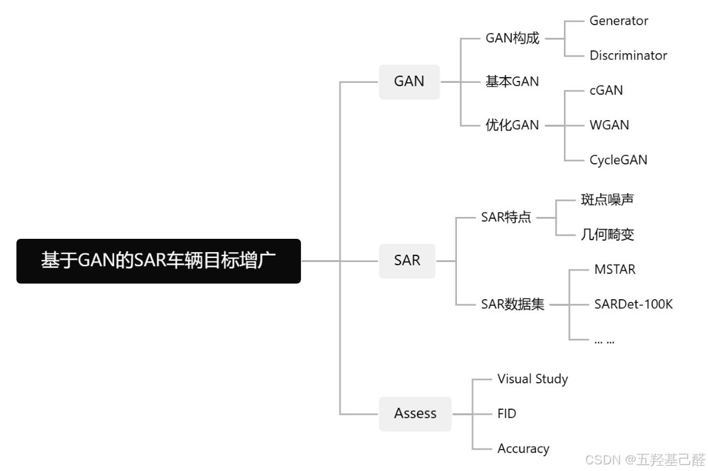
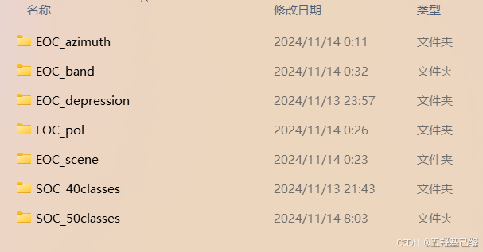
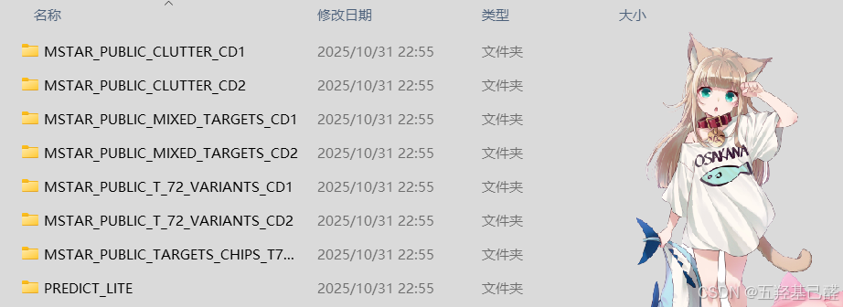
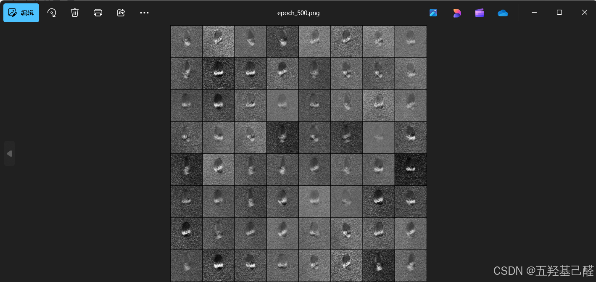
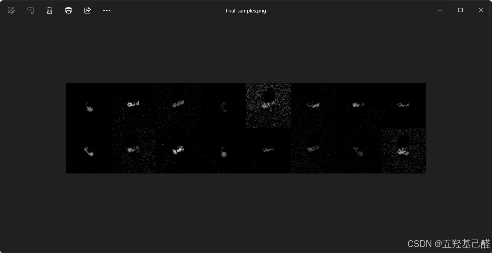
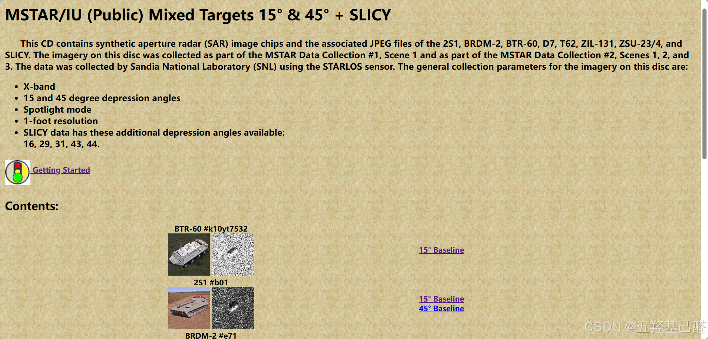
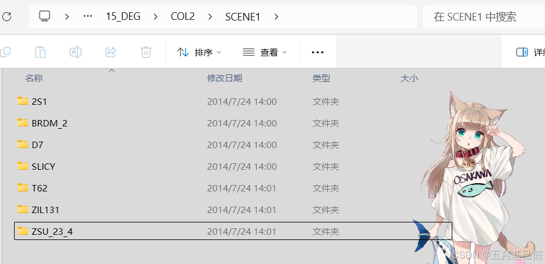

# 【深度学习项目】Gan网络下的SAR目标增广

> 原创 已于 2026-02-09 17:46:30 修改 · 公开 · 906 阅读 · 24 · 28 · 本内容遵循CC 4.0 BY-SA版权协议 版权声明：本文为博主原创文章，遵循 CC 4.0 BY 版权协议，转载请附上原文出处链接和本声明。 GEO检测 · 编辑
> 文章链接：https://menoking.blog.csdn.net/article/details/153351952

## 零.项目构想

### GAN

GAN，全称Generative Adversarial Networks（ **生成对抗网络** ），是一种强大的生成式机器学习模型，由Ian Goodfellow及其团队于2014年提出。其通过两个神经网络——生成器（Generator）和判别器（Discriminator）——的对抗训练，来生成逼真的新数据样本。

> **GAN历史演进** 
> 
> GAN ---> DCGAN(Deep Convolutional GAN), WGAN(Wasserstein GAN), CycleGAN， StyleGAN ---> Stable Diffusion
> 
> - **初代GAN/MLP GAN:** Multi-Layer Perceptron GAN，基于全连接层的原始风格GAN。不稳定，容易出现“模式崩溃”（mode collapse）
> 
> - **DCGAN** ：使用卷积层，适合图像生成。
> 
> - **cGAN（Conditional GAN）** ：添加条件标签（如类别），控制生成（如生成特定车辆的SAR图像）。
> 
> - **CycleGAN** ：无监督图像到图像转换（如光学转SAR）。
> 
> - **StyleGAN** ：高分辨率生成，支持风格混合。
> 
> - **BigGAN** ：大规模训练，生成多样化样本。
> 
> - **SAGAN：** 自注意力 self-attention。
> 
> - **ACGAN** (Auxiliary Classifier GAN)：辅助分类器GAN，在CGAN基础上的进一步拓展，采用辅助分类器（Auxiliary Classifier）使得GAN获取的图像分类的功能。
> 
> 

> **GAN与Diffusion** 
> 
> 在图像生成领域里另一个大火的模型便是Diffusion，这里简单介绍一下他俩的区别。
> 
> - GAN：上文我们介绍了GAN是通过对抗训练来生成新的样本的。但正是由于这种对抗范式的底层原理，导致了GAN无法生成全新的图像样本，而是只能对原始数据进行模仿并无限逼近，也就是说GAN永远无法真正学会 “创作” 。
> 
> - Diffusion ：Diffusion Model是基于非平衡热力学的扩散原理而产生的模型。
> 
>   - 前向过程（Forward Diffusion Process）在图片中添加噪声，犹如墨滴逐渐扩散开来。这个过程用于训练阶段；
> 
>   - 反向过程（Reverse Diffusion Process）去除图片中的噪声，犹如一片浑浊的水逐渐逆转，时间倒流回到一滴墨汁的状态。这个过程用于图像生成阶段。
> 
> 

### SAR

**合成孔径雷达** （SAR，Synthetic Aperture Radar）数据是一种主动微波遥感成像技术产生的图像数据，与传统光学图像有显著区别。

> 
> 
> - **全天候、全天时成像能力** 
> 
>   SAR使用微波（波长通常几厘米到米级）主动发射信号并接收地表回波，不依赖太阳光照，也不受云雾、雨雪等天气影响。可以白天黑夜、任何气象条件下工作，这是光学遥感无法比拟的优势。在车辆目标监测中，这意味着SAR数据可在夜间或恶劣天气下持续获取图像。
> 
> - **高分辨率与合成孔径原理** 
> 
>   SAR通过平台（飞机、卫星）运动，利用信号处理“合成”一个虚拟的大孔径天线，实现高方位向分辨率（可达米级甚至亚米级）。分辨率不依赖平台高度，与距离无关。
> 
> - **斑点噪声（Speckle Noise）显著** 
> 
>   SAR图像最突出的问题是乘性斑点噪声（multiplicative noise），表现为颗粒状“盐椒噪声”，源于相干成像的干扰（多个散射体回波随机干涉）。噪声服从Rayleigh分布或Gamma分布，严重降低图像可解释性，尤其在均匀区域（如道路、水面）表现明显。这也是为什么需要样本增广——GAN常用于去噪或生成无噪/低噪样本。
> 
> - **侧视成像与几何畸变** 
> 
>   SAR是侧视（非垂直）成像，存在透视收缩、叠掩、阴影等几何畸变。图像坐标系为斜距（slant range），需地理编码（geocoding）转为地面坐标。
> 
> 

SAR数据的斑点噪声和样本稀缺是车辆目标识别的主要痛点，GAN增广正是针对这些：生成多样化、低噪样本，提升下游检测模型。

由于 SAR 图像中存在显著的乘性斑点噪声，因此预计在数据预处理阶段引入 **Lee / Enhanced Lee 滤波** 对原始 SAR 图像进行去噪处理，以抑制 speckle 干扰，同时尽可能保持目标的散射结构特征。

> 
> 
> - Lee 滤波通过局部统计自适应抑制 SAR 斑点噪声，而 Enhanced Lee 在此基础上引入方向性和边缘保护机制，更有利于保持目标结构特征。核心思想是：在局部窗口内，根据像素的方差大小，自适应地在“原始像素”和“局部均值”之间进行加权。
> 
> - 噪声：
> 
>   - 加性噪声：一般指热噪声、散弹噪声等，它们与信号的关系是相加。一般通信中把加性随机性看成是系统的背景噪声。
> 
>   - 乘性噪声：一般由信道不理想引起，它们与信号的关系是相乘。一般通信中把加性随机性看成是系统的背景噪声。
> 
> 

### Assessing Method

目前对于生成式网络样本生成质量的评估方法大致有以下几种：

- 肉眼观察，定性评价

- 量化评估

  - Full-Reference（有Target指标--像素级）

    - SSIM (Structural Similarity Index)：评估结构相似性（亮度、对比、结构）。计算两张图的结构相似性。

    - PSNR (Peak Signal-to-Noise Ratio)：测量像素级噪声。评估图像噪声大小，计算两张图的像素级差别。

    - LPIPS (Learned Perceptual Image Patch Similarity) 也称为“感知损失”(perceptual loss)，用于度量两张图像之间的差别。

    - 直方图距离：按照某种距离度量的标准对两幅图像的直方图进行相似度的测量。图像直方图丰富的图像细节信息，反映了图像像素点的概率分布情况，统计每一个像素点强度值具有的像素个数。

  - No-Reference（无Target指标--盲图质量评估，只基于图像本身或整体分布）

    - **FID** (Fréchet Inception Distance)： **最常用GAN指标** ，测量生成分布与真实分布的距离。

    - KID (Kernel Inception Distance)：FID的内核版本，更鲁棒于小样本。

    - IS 指标：用分类模型评测样本集的“类别确定性”和“类别多样性” 。

- 应用评估

  - 下游任务验证：用YOLO、Faster R-CNN或简单CNN训练车辆检测/分类。

    - 准确率（Accuracy）、mAP (mean Average Precision)、F1分数、召回率。目标：提升5-15%（视数据集而定）等指标的 **提升** 。

      - CAS：Classification Accuracy Score（基于分类器的生成样本评估）

    - 移除生成样本，观察性能下降，以证明其贡献。

> **本次设计初步设想先采用定性分析 --> FID --> 分类任务的Accuracy / Recognition Rate。** 

注：本次项目侧重于识别任务的增强（SAR自动目标识别ATR即Automatic targetrecognition），而非检测，即为单纯的分类任务做出显著增强。

### MAP

 

## 一.数据集选择

### <span style="color:#000000">ATRNet-STAR</span>

国防科技大学的<span style="color:#000000">ATRNet-STAR</span>

 

**SOC（标准操作条件）​** ​

这类实验用于测试模型在“理想”或标准条件下的性能。

| 文件夹名称 | 全称与含义 | 实验目的 |
|:---:|:---:|:---:|
| ​ **​ `SOC_40classes` ​** ​ | ​ **​Standard Operating Conditions - 40类​** ​ | ​ **​核心基准测试​** ​。在统一的成像条件下，评估模型对40类车辆目标的识别能力。这是最基础的分类任务。 |
| ​ **​ `SOC_50classes` ​** ​ | ​ **​Standard Operating Conditions - 50类​** ​ | ​ **​扩展基准测试​** ​。在40类基础上融合了经典的MSTAR数据集，共50个类别，测试模型在更大规模类别下的性能。 |


**EOC（扩展操作条件）​** ​

这类实验用于测试模型的​ **​鲁棒性​** ​和​ **​泛化能力​** ​，即模型在遇到前所未见的新情况时是否依然有效。这是SAR识别领域研究的核心难点。

| 文件夹名称 | 全称与含义 | 实验目的与挑战 |
|:---:|:---:|:---:|
| ​ **​ `EOC_azimuth` ​** ​ | ​ **​方位角泛化​** ​ | 训练集和测试集的雷达视线角度不同。挑战在于模型必须学习到与角度无关的目标本质特征。 |
| ​ **​ `EOC_band` ​** ​ | ​ **​跨波段泛化​** ​ | 训练集和测试集使用不同的雷达频段（如X波段 vs Ku波段）。不同波段电磁波特性不同，图像表现差异大。 |
| ​ **​ `EOC_depression` ​** ​ | ​ **​俯仰角泛化​** ​ | 训练集和测试集的雷达俯仰角（雷达波照射的倾斜角度）不同。目标在不同俯仰角下的散射特性会变化。 |
| ​ **​ `EOC_pol` ​** ​ | ​ **​跨极化泛化​** ​ | 训练集和测试集使用不同的雷达极化方式（如HH vs HV）。极化信息反映了目标不同的散射机制。 |
| ​ **​ `EOC_scene` ​** ​ | ​ **​跨场景泛化​** ​ | 训练集和测试集的目标所处的背景环境不同（如简单场景 vs 复杂城市场景）。模型需要排除背景干扰。 |


### MSTAR

MSTAR (The Moving and Stationary Target Acquisition and Recognition) 数据集由美国 **桑迪亚国家实验室** (Sandia national laboratory) 在二十世纪90年代收集并发布。

MSTAR文件夹命名依次为俯仰角（DEG）、采集条件（COL1/2, Hb）、场景（SCENE, Hb）、目标（2S1）、目标变体型号。目标数据包括三个不同的地点（新墨西哥州、佛罗里达州北部和阿拉巴马州北部），其中一个地点（佛罗里达北部）在一年的不同时间（5月和11月）有两个收集。 `MSTAR_PUBLIC_CLUTTER_CD1` 和 `MSTAR_PUBLIC_CLUTTER_CD2` 所有的目标地点都是草覆盖和平坦的。

 

> 
> 
> - `MSTAR_PUBLIC_CLUTTER_CD1` 和 `MSTAR_PUBLIC_CLUTTER_CD2：` 包含“杂波”（Clutter）数据，常用于训练模型区分真实目标和背景杂波，提升鲁棒性。
> 
> - `MSTAR_PUBLIC_MIXED_TARGETS_CD1` 和 `MSTAR_PUBLIC_MIXED_TARGETS_CD2：` 混合目标数据（Mixed Targets）
> 
>   - 包含多种不同类型的军事目标，如2S1, BRDM-2, BTR-60, D7, T62, ZIL131, ZSU-23-4,SLICY。
> 
>   - CD1 和 CD2 同样表示两个不同的采集时间。
> 
>   - COL1 和 COL2 代表在同一俯视角下（如 15°）的不同采集。
> 
> - `MSTAR_PUBLIC_T_72_VARIANTS_CD1` 和 `MSTAR_PUBLIC_T_72_VARIANTS_CD2：` T-72 坦克的不同变体（Variants）。
> 
> - `MSTAR_PUBLIC_TARGETS_CHIPS_T72_BMP2_BTR70_SLICY：` 特定目标的裁剪图像芯片（Chips）集合。
> 
>   - “CHIPS” 表示从原始 SAR 图像中裁剪出的以目标为中心的小图像块（通常是单个目标的局部区域）。
> 
>   - 列出的 `T72` , `BMP2` , `BTR70` , `SLICY` 是几种具体的目标类型：
> 
>     - **T72** ：T-72 主战坦克
> 
>     - **BMP2** ：BMP-2 步兵战车
> 
>     - **BTR70** ：BTR-70 装甲运兵车
> 
>   - 这些数据通常是经过预处理后提取的，便于直接用于深度学习模型训练。
> 
> - **MSTAR-PredictLiteSoftware** 可以模拟背景杂波和噪声中的浮点灰度 SAR 目标特征。 该软件允许以下四个 PUBLIC 目标的俯角和旋转角变化：T-72、BMP-2、BTR-70 和 SLICY（参考目标，可 **用于测试虚警率[4]）。**
> 
> 

**本次将使用MSTAR数据集来训练网络。选用MSTAR\MSTAR_PUBLIC_MIXED_TARGETS_CD1\15_DEG\COL2\SCENE1来作为训练集进行训练。** 

> MSTAR的具体使用详见另一篇帖子： [【SAR数据集】Mstar数据集使用指南-CSDN博客](https://blog.csdn.net/2203_75993546/article/details/153538793?spm=1011.2415.3001.5331) 

## 二.MLP_GAN网络的构建

### Baseline

BaseLine为原始GAN即MLP_GAN，同另一篇帖子几乎一致，详细讲解可前往：

[【深度学习速成】半小时从零开始搭建一个GAN网络_discriminator function in gan-CSDN博客](https://blog.csdn.net/2203_75993546/article/details/154409842?spm=1011.2415.3001.5331) 

```python
import os
import torch
from torch import nn, optim
from torch.utils.data import DataLoader
from torchvision import transforms
from torchvision.datasets import ImageFolder
from torchvision.utils import save_image
 
device = torch.device("cuda" if torch.cuda.is_available() else "cpu")
print(f"使用设备:{device}")
 
latent_dim = 100  # 输入随机噪声维度
img_size = 128    # SAR图像尺寸（假设128x128）
img_channels = 1  # 单通道灰度图
image_size = img_channels * img_size * img_size  # 展平后维度：1*128*128=16384
batch_size = 64   # 批次样本数
lr = 2e-4         # 学习率
epochs = 500       # 学习轮次
save_path = "../Test_Gan_Results"
os.makedirs(save_path, exist_ok=True)  # 创建保存生成结果的文件夹
 
# 单通道归一化
transform = transforms.Compose([
    transforms.Grayscale(num_output_channels=1),  # 确保单通道灰度
    transforms.Resize((img_size, img_size)),
    transforms.ToTensor(),
    transforms.Normalize((0.5,), (0.5,))  # 归一化到 [-1,1]
])
 
# MSTAR数据集（假设结构正确：root下有类别子文件夹）
train_dataset = ImageFolder(root="../MSTAR/MSTAR_PUBLIC_MIXED_TARGETS_CD1/15_DEG/COL1/SCENE1", transform=transform)
# 定义加载器
train_loader = DataLoader(train_dataset, batch_size=batch_size, shuffle=True)
 
 
# 生成器（输出单通道128x128图像）
class Generator(nn.Module):
    def __init__(self):
        super(Generator, self).__init__()
        self.model = nn.Sequential(
            nn.Linear(latent_dim, 256),  # 全连接层
            nn.LeakyReLU(0.2),  # 激活函数
            nn.Linear(256, 512),
            nn.LeakyReLU(0.2),
            nn.Linear(512, 1024),
            nn.LeakyReLU(0.2),
            nn.Linear(1024, image_size),  # 输出展平的图像维度：16384
            nn.Tanh()  # 输出范围 [-1,1]，和数据归一化匹配
        )
 
    def forward(self, z):
        img = self.model(z)
        return img.view(img.size(0), img_channels, img_size, img_size)  # 变成 [batch, 1, 128, 128]
 
 
# 判别器（输入单通道128x128图像）
class Discriminator(nn.Module):
    def __init__(self):
        super(Discriminator, self).__init__()
        self.model = nn.Sequential(
            nn.Linear(image_size, 1024),  # 输入展平的图像维度：16384
            nn.LeakyReLU(0.2),
            nn.Dropout(0.3),
            nn.Linear(1024, 512),
            nn.LeakyReLU(0.2),
            nn.Dropout(0.3),
            nn.Linear(512, 256),
            nn.LeakyReLU(0.2),
            nn.Dropout(0.3),
            nn.Linear(256, 1),
            nn.Sigmoid()  # 输出 0~1 之间的概率（真/假）
        )
 
    def forward(self, img):
        img_flat = img.view(img.size(0), -1)  # 展平图片
        validity = self.model(img_flat)
        return validity
 
 
# 创建模型
generator = Generator().to(device)
discriminator = Discriminator().to(device)
 
# 损失函数
criterion = nn.BCELoss()
 
# 优化器
optimizer_G = optim.Adam(generator.parameters(), lr=lr, betas=(0.5, 0.999))
optimizer_D = optim.Adam(discriminator.parameters(), lr=lr, betas=(0.5, 0.999))
 
# 开始训练
print("开始训练 GAN...")
for epoch in range(epochs):
    for i, (real_imgs, _) in enumerate(train_loader):  # 忽略标签
 
        batch_size_current = real_imgs.size(0)
        real_imgs = real_imgs.to(device)
 
        # 判别器梯度清零
        optimizer_D.zero_grad()
 
        # 真实图片标签为1
        real_label = torch.ones(batch_size_current, 1).to(device)
        fake_label = torch.zeros(batch_size_current, 1).to(device)
 
        # 判别真实图片
        real_output = discriminator(real_imgs)
        loss_D_real = criterion(real_output, real_label)
 
        # 生成假图片
        z = torch.randn(batch_size_current, latent_dim).to(device)
        fake_imgs = generator(z)
 
        # 判别假图片
        fake_output = discriminator(fake_imgs.detach())
        loss_D_fake = criterion(fake_output, fake_label)
 
        # 判别器损失
        loss_D = loss_D_real + loss_D_fake
        loss_D.backward()
        optimizer_D.step()
 
        # 生成器梯度清零
        optimizer_G.zero_grad()
 
        # 欺骗判别器
        tricked_output = discriminator(fake_imgs)
        loss_G = criterion(tricked_output, real_label)
 
        # 生成器反向传播及优化
        loss_G.backward()
        optimizer_G.step()
        if i % 200 == 0:
            print(f"[Epoch {epoch}/{epochs}][Batch {i}/{len(train_loader)}]"
                  f"Loss_D: {loss_D.item():.4f} Loss_G: {loss_G.item():.4f}")
    with torch.no_grad():  # 临时禁用梯度计算
        # 生成固定噪声
        fixed_noise = torch.randn(64, latent_dim).to(device)
        # 生成图片
        fake_samples = generator(fixed_noise)
        # 保存图片
        save_image(fake_samples, f"{save_path}/epoch_{epoch + 1}.png", nrow=8, normalize=True)
print("训练完成！")
 
generator.eval()
with torch.no_grad():
    test_noise = torch.randn(16, latent_dim).to(device)
    test_imgs = generator(test_noise)
    save_image(test_imgs, f"{save_path}/final_samples.png")
```

运行以上代码进行训练可以观察到保存的样本：

 

 

## 三.cGAN网络的构建

增加标签进行分类训练，即条件GAN。

> 尽可能控制变量，采用以下目录中的数据进行条件训练：
> 
> D:\***\MSTAR\MSTAR_PUBLIC_MIXED_TARGETS_CD1\15_DEG\COL2\SCENE1

 

 

```python
import os
import random
import shutil
import numpy as np
from typing import Tuple
 
import torch
from torch import nn, optim
from torch.utils.data import DataLoader
from torchvision import transforms
from torchvision.datasets import ImageFolder
from torchvision.utils import save_image
 
from pytorch_fid.fid_score import calculate_fid_given_paths
 
# ============================================================
# Global Hyperparameters
# ============================================================
LATENT_DIM = 100
IMG_SIZE = 64
IMG_CHANNELS = 1
IMAGE_FLAT_SIZE = IMG_CHANNELS * IMG_SIZE * IMG_SIZE
BATCH_SIZE = 64
LEARNING_RATE = 2e-4
EPOCHS = 100  # Standardized to match others usually
SAVE_PATH = "../Test_Results/Test_cGAN_Results"
 
# Reproducibility
SEED = 42
 
# FID settings
FID_EVERY_N_EPOCHS = 10  # 10epoch进行一次FID计算；且保存一次图片
FID_NUM_SAMPLES = 500
 
 
# 设置随机种子函数
def set_seed(seed: int) -> None:
    random.seed(seed)
    torch.manual_seed(seed)
    torch.cuda.manual_seed_all(seed)  # 设置GPU 上的随机数生成器
    torch.backends.cudnn.deterministic = True  # cuDNN使用确定性算法，放弃随机优化算法
    torch.backends.cudnn.benchmark = False  # 固定benchmark优化，使用固定卷积结构
 
 
# 创建文件夹：存在则清空，不存在则创建
def ensure_empty_dir(path: str) -> None:
    if os.path.isdir(path):
        shutil.rmtree(path, ignore_errors=True)
    os.makedirs(path, exist_ok=True)
 
 
# 图片保存：张量->png
def save_images_to_dir(images: torch.Tensor, directory: str, start_index: int = 0) -> None:
    for idx, img in enumerate(images):  # enumerate内置函数，同时获取索引与键值
        save_image(
            img.detach().cpu(),  # detach()用来分离计算图
            os.path.join(directory, f"{start_index + idx}.png"),
            normalize=True,  # 归一化
        )
 
 
# Generator (Conditional MLP)
class Generator(nn.Module):
    def __init__(self, n_classes):
        super(Generator, self).__init__()
        self.label_emb = nn.Embedding(n_classes, n_classes)
 
        self.model = nn.Sequential(
            nn.Linear(LATENT_DIM + n_classes, 256),
            nn.LeakyReLU(0.2),
            nn.Linear(256, 512),
            nn.LeakyReLU(0.2),
            nn.Linear(512, 1024),
            nn.LeakyReLU(0.2),
            nn.Linear(1024, IMAGE_FLAT_SIZE),
            nn.Tanh()
        )
 
    def forward(self, z, labels):
        c = self.label_emb(labels)
        # Concatenate noise and label embedding
        x = torch.cat([z, c], dim=1)
        img = self.model(x)
        return img.view(img.size(0), IMG_CHANNELS, IMG_SIZE, IMG_SIZE)
 
 
# Discriminator (Conditional MLP)
class Discriminator(nn.Module):
    def __init__(self, n_classes):
        super(Discriminator, self).__init__()
        self.label_emb = nn.Embedding(n_classes, n_classes)
 
        self.model = nn.Sequential(
            # Input is (Image + Label Embedding)
            nn.Linear(IMAGE_FLAT_SIZE + n_classes, 1024),
            nn.LeakyReLU(0.2),
            # Standard cGAN usually has dropout in D.
            nn.Dropout(0.3),
 
            nn.Linear(1024, 512),
            nn.LeakyReLU(0.2),
            nn.Dropout(0.3),
 
            nn.Linear(512, 256),
            nn.LeakyReLU(0.2),
            nn.Dropout(0.3),
 
            nn.Linear(256, 1),
            nn.Sigmoid()
        )
 
    def forward(self, img, labels):
        img_flat = img.view(img.size(0), -1)
        c = self.label_emb(labels)
        # Concatenate image and label embedding
        x = torch.cat([img_flat, c], dim=1)
        validity = self.model(x)
        return validity
 
 
# FID Calculation
def calculate_fid_score(
        gen_model: nn.Module,
        train_loader: DataLoader,
        epoch_index: int,
        run_device: torch.device,
        num_classes_global: int,  # 条件标签类别数
        num_samples: int = FID_NUM_SAMPLES,  # 样本个数
) -> float:
    print(f"\n[FID] Evaluating Epoch {epoch_index}")
    real_dir = "./fid_real"
    fake_dir = "./fid_fake"
    ensure_empty_dir(real_dir)
    ensure_empty_dir(fake_dir)
    gen_model.eval()  # 评估模式
    saved_count = 0
    try:
        with torch.no_grad():  # 不追踪计算图
            for real_imgs, _ in train_loader:
                if saved_count >= num_samples: break  # 逐batch取真实样本直到num_samples
                save_count = min(real_imgs.size(0), num_samples - saved_count)
                save_images_to_dir(real_imgs[:save_count], real_imgs, dir, saved_count)
 
                noise_vec = torch.randn(save_count, LATENT_DIM, device=run_device)
                random_labels = torch.randint(0, num_classes_global, (save_count,), device=run_device)
                fake_imgs = gen_model(noise_vec, random_labels)
                save_images_to_dir(fake_imgs, fake_dir, saved_count)
                saved_count += save_count
 
        fid_score = calculate_fid_given_paths([real_dir, fake_dir], batch_size=50, device=run_device, dims=2048,
                                              num_workers=0)
        print(f">>> Epoch {epoch_index} | FID = {fid_score:.4f}\n")
        return float(fid_score)
    except Exception as e:
        print(f"FID Error: {e}")
        return 999.0
    finally:
        # 清除临时文件夹
        shutil.rmtree(real_dir, ignore_errors=True)
        shutil.rmtree(fake_dir, ignore_errors=True)
        gen_model.train()  # 返回训练模式
 
 
# Check whether the device is cuda
def check_cuda_availability():
    if torch.cuda.is_available():
        print(f"CUDA is available! Device: {torch.cuda.get_device_name(0)}")
        return torch.device("cuda")
    else:
        print("CUDA is NOT available. Using CPU. Warning: Training will be extremely slow.")
        return torch.device("cpu")
 
 
# Training Loop
def train() -> None:
    # 检查随机数种子
    if SEED is not None:
        set_seed(SEED)
 
    # 检查设备以及存储路径
    run_device = check_cuda_availability()
    os.makedirs(SAVE_PATH, exist_ok=True)
 
    # 数据预处理：
    transform = transforms.Compose([
        transforms.Grayscale(num_output_channels=1),  # 转化为单通道
        transforms.Resize((IMG_SIZE, IMG_SIZE)),  # 缩放到IMG_SIZE*IMG_SIZE
        transforms.ToTensor(),  # 张量化
        transforms.Normalize((0.5,), (0.5,))  # 输入参数是序列，因此用单元素元组；(0,1)->(-1,1)
    ])
 
    # 数据集加载
    dataset_root = "../MSTAR/PERSONAL_MSTAR/15_DEG"
    train_dataset = ImageFolder(root=dataset_root, transform=transform)
    train_loader = DataLoader(train_dataset, batch_size=BATCH_SIZE, shuffle=True, num_workers=0,
                              pin_memory=(run_device.type == "cuda"))
 
    num_classes_global = len(train_dataset.classes)
    print(f"Number of classes: {num_classes_global}")
 
    # Models
    generator = Generator(num_classes_global).to(run_device)
    discriminator = Discriminator(num_classes_global).to(run_device)
 
    # Loss & Optimizers
    criterion = nn.BCELoss()
    optimizer_G = optim.Adam(generator.parameters(), lr=LEARNING_RATE, betas=(0.5, 0.999))
    optimizer_D = optim.Adam(discriminator.parameters(), lr=LEARNING_RATE, betas=(0.5, 0.999))
 
    print("Beginning Training (Conditional GAN)...")
 
    for epoch in range(EPOCHS):
        for i, (real_imgs, labels) in enumerate(train_loader):
            curr_batch_size = real_imgs.size(0)
            real_imgs = real_imgs.to(run_device)
            labels = labels.to(run_device)
 
            real_label = torch.ones(curr_batch_size, 1).to(run_device)
            fake_label = torch.zeros(curr_batch_size, 1).to(run_device)
 
            # ---------------------
            # Train Discriminator
            # ---------------------
            optimizer_D.zero_grad()
 
            real_output = discriminator(real_imgs, labels)
            loss_d_real = criterion(real_output, real_label)
 
            z = torch.randn(curr_batch_size, LATENT_DIM).to(run_device)
            fake_imgs = generator(z, labels)
            fake_output = discriminator(fake_imgs.detach(), labels)
            loss_d_fake = criterion(fake_output, fake_label)
 
            loss_d = loss_d_real + loss_d_fake
            loss_d.backward()
            optimizer_D.step()
 
            # ---------------------
            # Train Generator
            # ---------------------
            optimizer_G.zero_grad()
 
            tricked_output = discriminator(fake_imgs, labels)
            loss_g = criterion(tricked_output, real_label)
 
            loss_g.backward()
            optimizer_G.step()
 
        # Logging
        if (epoch + 1) % 10 == 0:
            print(f"[Epoch {epoch + 1}/{EPOCHS}] D_Loss: {loss_d.item():.4f} | G_Loss: {loss_g.item():.4f}")
 
        # Save & Eval
        if (epoch + 1) % FID_EVERY_N_EPOCHS == 0:
            with torch.no_grad():
                fixed_noise = torch.randn(64, LATENT_DIM).to(run_device)
                fixed_labels = torch.zeros(64, dtype=torch.long, device=run_device)  # 对应个数的整形类型标签
                fake_samples = generator(fixed_noise, fixed_labels)
                save_image(fake_samples, f"{SAVE_PATH}/epoch_{epoch + 1}.png", nrow=8, normalize=True)
 
            calculate_fid_score(generator, train_loader, epoch + 1, run_device, num_classes_global)
 
    print("Training completed.")
    torch.save(generator.state_dict(), os.path.join(SAVE_PATH, "generator_final.pth"))
    torch.save(discriminator.state_dict(), os.path.join(SAVE_PATH, "discriminator_final.pth"))
 
    # Final samples
    generator.eval()
    with torch.no_grad():
        test_noise = torch.randn(16, LATENT_DIM).to(run_device)
        test_labels = torch.randint(0, num_classes_global, (16,), device=run_device)
        test_imgs = generator(test_noise, test_labels)
        save_image(test_imgs, f"{SAVE_PATH}/final_samples.png", normalize=True)
 
 
if __name__ == "__main__":
    train()
```

## 四.cDCGAN网络的构建

全连接层学习效果不尽人意，因此将模型转变为卷积层堆叠，即形成条件-深度卷积GAN网络。

```python
# ============================================================
# Generator (cDCGAN)
# ============================================================
class Generator(nn.Module):
    def __init__(self, class_count: int):
        super(Generator, self).__init__()
        self.label_embedding = nn.Embedding(class_count, class_count)
 
        self.net = nn.Sequential(
            # Input: LATENT_DIM + class_count
            # 逆卷积膨胀
            nn.ConvTranspose2d(LATENT_DIM + class_count, 512, 4, 1, 0, bias=False),
            # 二维批量归一化
            nn.BatchNorm2d(512),
            nn.ReLU(True),
 
            nn.ConvTranspose2d(512, 256, 4, 2, 1, bias=False),
            nn.BatchNorm2d(256),
            nn.ReLU(True),
 
            nn.ConvTranspose2d(256, 128, 4, 2, 1, bias=False),
            nn.BatchNorm2d(128),
            nn.ReLU(True),
 
            nn.ConvTranspose2d(128, 64, 4, 2, 1, bias=False),
            nn.BatchNorm2d(64),
            nn.ReLU(True),
 
            nn.ConvTranspose2d(64, IMG_CHANNELS, 4, 2, 1, bias=False),
            nn.Tanh(),
        )
 
    def forward(self, noise_vec: torch.Tensor, cond_labels: torch.Tensor) -> torch.Tensor:
        label_embed = self.label_embedding(cond_labels)
        combined = torch.cat([noise_vec, label_embed], dim=1)
        # 由于模型中输入为四维张量，因此unsqueeze在原本张量的第2和3位插入大小为1的新维度
        combined = combined.unsqueeze(2).unsqueeze(3)  # (N, dim, 1, 1)
        return self.net(combined)
 
 
# ============================================================
# Discriminator (cDCGAN)
# ============================================================
class Discriminator(nn.Module):
    def __init__(self, class_count: int):
        super(Discriminator, self).__init__()
        # Unlike MLP cGAN, convolutional D usually appends label as a channel or similar.
        # Here we use the approach of embedding labels into an image channel.
        
        self.label_embedding = nn.Embedding(class_count, IMG_SIZE * IMG_SIZE)
        
        self.net = nn.Sequential(
            # 卷积提取特征
            nn.Conv2d(IMG_CHANNELS + 1, 64, 4, 2, 1, bias=False),
            nn.LeakyReLU(0.2, inplace=True),
 
            nn.Conv2d(64, 128, 4, 2, 1, bias=False),
            nn.BatchNorm2d(128),
            nn.LeakyReLU(0.2, inplace=True),
 
            nn.Conv2d(128, 256, 4, 2, 1, bias=False),
            nn.BatchNorm2d(256),
            nn.LeakyReLU(0.2, inplace=True),
 
            nn.Conv2d(256, 512, 4, 2, 1, bias=False),
            nn.BatchNorm2d(512),
            nn.LeakyReLU(0.2, inplace=True),
            
            nn.Conv2d(512, 1, 4, 1, 0, bias=False),
            nn.Sigmoid()
        )
 
    def forward(self, image_tensor: torch.Tensor, cond_labels: torch.Tensor) -> torch.Tensor:
        # 这里不要搞混了，其在构造函数中已定义，因此只需要传入参数cond_labels后即可输出IMG_SIZE * IMG_SIZE的张量
        label_embed = self.label_embedding(cond_labels)
        # -1自动推断batch size，其余参数依次为CHW
        label_img = label_embed.view(-1, 1, IMG_SIZE, IMG_SIZE)
 
        # Concatenate image and label channel
        combined = torch.cat([image_tensor, label_img], dim=1)
 
        return self.net(combined).view(-1, 1)
```

## 五.ACGAN网络的构建

主要区别就在Discriminator判别器中将样本和噪声解耦，分别独立判断。

```python
# ============================================================
# Generator (ACGAN)
# ============================================================
# Conceptually similar to cDCGAN generator: takes Noise + Class -> Image
# We keep using the specific label embedding strategy.
class Generator(nn.Module):
    def __init__(self, class_count: int):
        super().__init__()
        # One-hot-like embedding: num_classes -> num_classes
        self.label_embedding = nn.Embedding(class_count, class_count)
 
        self.net = nn.Sequential(
            nn.ConvTranspose2d(LATENT_DIM + class_count, 512, 4, 1, 0, bias=False),
            nn.BatchNorm2d(512),
            nn.ReLU(True),
 
            nn.ConvTranspose2d(512, 256, 4, 2, 1, bias=False),
            nn.BatchNorm2d(256),
            nn.ReLU(True),
 
            nn.ConvTranspose2d(256, 128, 4, 2, 1, bias=False),
            nn.BatchNorm2d(128),
            nn.ReLU(True),
 
            nn.ConvTranspose2d(128, 64, 4, 2, 1, bias=False),
            nn.BatchNorm2d(64),
            nn.ReLU(True),
 
            nn.ConvTranspose2d(64, IMG_CHANNELS, 4, 2, 1, bias=False),
            nn.Tanh(),
        )
 
    def forward(self, noise_vec: torch.Tensor, cond_labels: torch.Tensor) -> torch.Tensor:
        label_embed = self.label_embedding(cond_labels)
        combined = torch.cat([noise_vec, label_embed], dim=1)  # (N, LATENT_DIM + C)
        combined = combined.unsqueeze(2).unsqueeze(3)          # (N, LATENT_DIM + C, 1, 1)
        return self.net(combined)
 
 
# ============================================================
# Discriminator (ACGAN)
# ============================================================
class Discriminator(nn.Module):
    def __init__(self, class_count: int):
        super().__init__()
        
        self.features = nn.Sequential(
            # Input: (1, 64, 64)
            nn.Conv2d(IMG_CHANNELS, 64, 4, 2, 1, bias=False),
            nn.LeakyReLU(0.2, inplace=True),
 
            nn.Conv2d(64, 128, 4, 2, 1, bias=False),
            nn.BatchNorm2d(128),
            nn.LeakyReLU(0.2, inplace=True),
 
            nn.Conv2d(128, 256, 4, 2, 1, bias=False),
            nn.BatchNorm2d(256),
            nn.LeakyReLU(0.2, inplace=True),
 
            nn.Conv2d(256, 512, 4, 2, 1, bias=False),
            nn.BatchNorm2d(512),
            nn.LeakyReLU(0.2, inplace=True),
        )
 
        # Output layers (The feature map size here is 512 x 4 x 4)
        # ACGAN Head 1: Validity (Real/Fake)
        # 真假判别层
        self.adv_layer = nn.Sequential(
            nn.Conv2d(512, 1, 4, 1, 0, bias=False),
            # Output: (1, 1, 1, 1) -> squeeze to (1)
        )
 
        # ACGAN Head 2: Classification (Class probs)
        # 类别判别层
        self.aux_layer = nn.Sequential(
            nn.Conv2d(512, class_count, 4, 1, 0, bias=False),
            # Output: (1, class_count, 1, 1) -> squeeze to (class_count)
        )
 
    def forward(self, image_tensor: torch.Tensor) -> Tuple[torch.Tensor, torch.Tensor]:
        features = self.features(image_tensor)
        #  真假概率和类别预测分别输出
        validity = self.adv_layer(features).view(-1, 1)      # (N, 1)
        label_logits = self.aux_layer(features).view(features.size(0), -1)  # (N, Class_Count)
        
        return validity, label_logits
```

## 六.评估体系

### FID

终端（Anaconda环境）中安装：

```bash
 pip install pytorch-fid
```

```python
FID_EVERY_N_EPOCHS = 10  # 间隔采样轮次
FID_NUM_SAMPLES = 500  # 取500真实样本，500生成样本进行计算
 
def calculate_fid_score(
        gen_model: nn.Module,
        train_loader: DataLoader,
        epoch_index: int,
        run_device: torch.device,
        num_classes_global: int,  # 条件标签类别数
        num_samples: int = FID_NUM_SAMPLES,  # 样本个数
) -> float:
    print(f"\n[FID] Evaluating Epoch {epoch_index}")
    real_dir = "./fid_real"
    fake_dir = "./fid_fake"
    ensure_empty_dir(real_dir)
    ensure_empty_dir(fake_dir)
    gen_model.eval()  # 评估模式
    saved_count = 0
    try:
        with torch.no_grad():  # 不追踪计算图
            for real_imgs, _ in train_loader:
                if saved_count >= num_samples: break  # 逐batch取真实样本直到num_samples
                save_count = min(real_imgs.size(0), num_samples - saved_count)
                save_images_to_dir(real_imgs[:save_count], real_imgs, dir, saved_count)
 
                noise_vec = torch.randn(save_count, LATENT_DIM, device=run_device)
                random_labels = torch.randint(0, num_classes_global, (save_count,), device=run_device)
                fake_imgs = gen_model(noise_vec, random_labels)
                save_images_to_dir(fake_imgs, fake_dir, saved_count)
                saved_count += save_count
 
        fid_score = calculate_fid_given_paths([real_dir, fake_dir], batch_size=50, device=run_device, dims=2048,
                                              num_workers=0)
        print(f">>> Epoch {epoch_index} | FID = {fid_score:.4f}\n")
        return float(fid_score)
    except Exception as e:
        print(f"FID Error: {e}")
        return 999.0
    finally:
        # 清除临时文件夹
        shutil.rmtree(real_dir, ignore_errors=True)
        shutil.rmtree(fake_dir, ignore_errors=True)
        gen_model.train()  # 返回训练模式
```

### CAS

Classification Accuracy Score，即基于独立分类器的生成样本评估。

#### 训练独立分类器

以真实样本训练一个独立分类器，后通过这个独立分类器判别真实样本与生成样本，以量化生成质量。

```python
import os
import torch
import torch.nn as nn
import torch.optim as optim
from torch.utils.data import DataLoader, random_split
from torchvision import transforms, datasets, models
import copy
 
# Configuration
DATA_DIR = r"..\MSTAR\PERSONAL_MSTAR\15_DEG"
SAVE_PATH = "checkpoints/classifier_resnet18_best.pth"
IMG_SIZE = 64
BATCH_SIZE = 64
EPOCHS = 20  # Sufficient for MSTAR
LEARNING_RATE = 0.001
DEVICE = torch.device("cuda" if torch.cuda.is_available() else "cpu")
 
 
def main():
    print(f"Using device: {DEVICE}")
    os.makedirs("checkpoints", exist_ok=True)
 
    data_transforms = transforms.Compose([
        transforms.Grayscale(num_output_channels=1),
        transforms.Resize((IMG_SIZE, IMG_SIZE)),
        transforms.ToTensor(),
        transforms.Normalize([0.5], [0.5])
    ])
 
 
    if not os.path.exists(DATA_DIR):
        print(f"Error: Dataset not found at {DATA_DIR}")
        return
 
    full_dataset = datasets.ImageFolder(DATA_DIR, transform=data_transforms)
    class_names = full_dataset.classes
    num_classes = len(class_names)
    print(f"Classes found: {class_names}")
 
    # Split Train/Val (80/20)
    train_size = int(0.8 * len(full_dataset))
    val_size = len(full_dataset) - train_size
    train_dataset, val_dataset = random_split(full_dataset, [train_size, val_size])
 
    dataloaders = {
        'train': DataLoader(train_dataset, batch_size=BATCH_SIZE, shuffle=True, num_workers=0),
        'val': DataLoader(val_dataset, batch_size=BATCH_SIZE, shuffle=False, num_workers=0)
    }
    dataset_sizes = {'train': train_size, 'val': val_size}
 
    # Model Setup (ResNet18)
    # We modify the first conv layer to accept 1 channel instead of 3
    model = models.resnet18(pretrained=False)  # Train from scratch is usually better for SAR than ImageNet
    model.conv1 = nn.Conv2d(1, 64, kernel_size=7, stride=2, padding=3, bias=False)
    model.fc = nn.Linear(model.fc.in_features, num_classes)
 
    model = model.to(DEVICE)
 
    criterion = nn.CrossEntropyLoss()
    optimizer = optim.Adam(model.parameters(), lr=LEARNING_RATE)
 
    # Training Loop
    best_model_wts = copy.deepcopy(model.state_dict())
    best_acc = 0.0
 
    print("Starting training...")
    for epoch in range(EPOCHS):
        print(f"Epoch {epoch + 1}/{EPOCHS}")
        print("-" * 10)
 
        for phase in ['train', 'val']:
            if phase == 'train':
                model.train()
            else:
                model.eval()
 
            running_loss = 0.0
            running_corrects = 0
 
            for inputs, labels in dataloaders[phase]:
                inputs = inputs.to(DEVICE)
                labels = labels.to(DEVICE)
 
                optimizer.zero_grad()
 
                with torch.set_grad_enabled(phase == 'train'):
                    outputs = model(inputs)
                    _, preds = torch.max(outputs, 1)
                    loss = criterion(outputs, labels)
 
                    if phase == 'train':
                        loss.backward()
                        optimizer.step()
 
                running_loss += loss.item() * inputs.size(0)
                running_corrects += torch.sum(preds == labels.data)
 
            epoch_loss = running_loss / dataset_sizes[phase]
            epoch_acc = running_corrects.double() / dataset_sizes[phase]
 
            print(f"{phase} Loss: {epoch_loss:.4f} Acc: {epoch_acc:.4f}")
 
            if phase == 'val' and epoch_acc > best_acc:
                best_acc = epoch_acc
                best_model_wts = copy.deepcopy(model.state_dict())
                torch.save(best_model_wts, SAVE_PATH)
                print(f"New best model saved! Acc: {best_acc:.4f}")
 
    print(f"Training complete. Best Val Acc: {best_acc:.4f}")
 
 
if __name__ == "__main__":
    main()
```

#### CAS评估

这里采用上面训练的独立分类器 **classifier_resnet18_best.pth** 进行判别。

```python
import os
import sys
import torch
import torch.nn as nn
from torchvision import models, transforms
 
# Add cDCGAN directory to path for importing Generator
sys.path.append(os.path.join(os.path.dirname(__file__), "..", "cDCGAN"))
 
try:
    from ACGAN import Generator, LATENT_DIM, IMG_SIZE
except ImportError:
    # Fallback or error handling
    print("Error: Could not import Generator from ACGAN.py. Make sure the file exists.")
    sys.exit(1)
 
# Configuration
CLASSIFIER_PATH = "checkpoints/classifier_resnet18_best.pth"
GENERATOR_PATH = "TODO_provide_generator_checkpoint_path.pth"  # Placeholder
NUM_CLASSES = 6  # Set to 6 to match MSTAR/PERSONAL_MSTAR/15_DEG
SAMPLES_PER_CLASS = 100
DEVICE = torch.device("cuda" if torch.cuda.is_available() else "cpu")
 
 
def load_classifier(path, num_classes):
    model = models.resnet18(pretrained=False)
    model.conv1 = nn.Conv2d(1, 64, kernel_size=7, stride=2, padding=3, bias=False)
    model.fc = nn.Linear(model.fc.in_features, num_classes)
 
    if os.path.exists(path):
        model.load_state_dict(torch.load(path, map_location=DEVICE))
        print(f"Loaded classifier from {path}")
    else:
        print(f"Warning: Classifier checkpoint not found at {path}")
 
    model.to(DEVICE)
    model.eval()
    return model
 
 
def load_generator(path, num_classes):
    gen = Generator(num_classes)
    if os.path.exists(path):
        # Handle potential key prefixes if saved differently
        state_dict = torch.load(path, map_location=DEVICE)
        gen.load_state_dict(state_dict, strict=False)
        print(f"Loaded generator from {path}")
    else:
        print(f"Warning: Generator checkpoint not found at {path}. Using random weights.")
 
    gen.to(DEVICE)
    gen.eval()
    return gen
 
 
def main():
    if len(sys.argv) > 1:
        gen_path = sys.argv[1]
    else:
        gen_path = GENERATOR_PATH
 
    print(f"Evaluating Generator: {gen_path}")
 
    # Load Models
    classifier = load_classifier(CLASSIFIER_PATH, NUM_CLASSES)
    generator = load_generator(gen_path, NUM_CLASSES)
 
    total_correct = 0
    total_samples = 0
 
    class_accuracies = {}
 
    with torch.no_grad():
        for class_idx in range(NUM_CLASSES):
            # Generate fake samples for this class
            noise = torch.randn(SAMPLES_PER_CLASS, LATENT_DIM, device=DEVICE)
            labels = torch.full((SAMPLES_PER_CLASS,), class_idx, dtype=torch.long, device=DEVICE)
 
            fake_imgs = generator(noise, labels)
 
            # Normalize for classifier?
            # Classifier expects [-1, 1] (norm 0.5, 0.5)
            # Generator output is Tanh -> [-1, 1]. Perfect.
 
            # Classify
            outputs = classifier(fake_imgs)
            _, preds = torch.max(outputs, 1)
 
            correct = (preds == labels).sum().item()
            acc = correct / SAMPLES_PER_CLASS
            class_accuracies[class_idx] = acc
 
            total_correct += correct
            total_samples += SAMPLES_PER_CLASS
 
            print(f"Class {class_idx}: Acc = {acc:.2f}")
 
    overall_acc = total_correct / total_samples
    print("-" * 20)
    print(f"Overall CAS (Classification Accuracy Score): {overall_acc:.4f}")
    print("-" * 20)
 
 
if __name__ == "__main__":
    main()
```