# 【硬件工程】电路设计入门笔记基础篇

> 原创 已于 2026-01-17 00:07:38 修改 · 粉丝可见 · 1.6k 阅读 · 14 · 34 · 本内容遵循CC 4.0 BY-SA版权协议 版权声明：本文为博主原创文章，遵循 CC 4.0 BY 版权协议，转载请附上原文出处链接和本声明。 GEO检测 · 编辑
> 文章链接：https://menoking.blog.csdn.net/article/details/143454695

## 一.概念梳理

### 常见电路概念

> 
> 
> - **整流** ：将交流电转换为直流电。常用的整流电路有半波整流（一只二极管），全波整流（两只二极管）以及桥式整流电路（四只二极管）。
> 
> - **逆变** ：将直流电转换为交流电。逆变电路有两种类型：有源逆变（将直流电变成和电网同频率的交流电反送到电网中）和无源逆变（将直流电变成为某一频率或可变频率的交流电直接供负载使用）。
> 
> - **DC/DC** ：直流转直流； **AC/DC** ：交流转直流。
> 
> - 钳位：将某点的电位限制在规定电位的措施，是一种过压保护技术。
> 
> - **BUCK** 电路：以降压为目的DCDC电源电路称为BUCK电路。
> 
> - **BOOST** 电路：以升压为目的的DCDC电源电路称为BOOST电路。
> 
> 

### 常见元件的用途

> 
> 
> - 电感的作用：自感，互感，储能，滤波，谐振
> 
> - 电容的作用：储能，滤波，自举，倍压，旁路，去偶
> 
> - 电阻的作用：限流，分压，上拉，下拉，取样，滤波
> 
> - 三极管和长效应管的作用：开关，放大
> 
> - 二极管的作用：整流，过压保护，钳位，电平转换，隔离，防反接，续流，限幅，稳压，检波，
> 
> - IGBT（ **绝缘栅双极型晶体管** ）：就是个开关。可以把 **IGBT** 看作 **BJT** 和 **MOS** 管的融合体，IGBT具有 **MOS** 的输入特性和 **BJT** 管的输出特性。与 BJT 或 MOS管相比， **绝缘栅双极型晶体管 IGBT 的优势在于它提供了比标准双极型晶体管更大的功率增益，以及更高的工作电压和更低的 MOS 管输入损耗** 。
> 
> 

## 二.认识常用器件

### 1.电容

**简介** 

以下是维基百科中对电容的阐述：

> 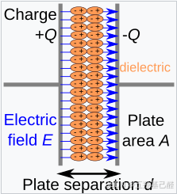
> 
> A capacitor consists of two [conductors](https://en.wikipedia.org/wiki/Electrical_conductor) separated by a non-conductive region.The non-conductive region can either be a [vacuum](https://en.wikipedia.org/wiki/Vacuum) or an electrical insulator material known as a [dielectric](https://en.wikipedia.org/wiki/Dielectric) . Examples of dielectric media are glass, air, paper, plastic, ceramic, and even a [semiconductor](https://en.wikipedia.org/wiki/Semiconductor) [depletion region](https://en.wikipedia.org/wiki/Depletion_region) chemically identical to the conductors.

总之，电容就是由两块中间隔着绝缘区域的导体组成的电路器件。 它们设计用来在电路中存储电荷，通过在电路中不停地充放电来发挥其特性。由于其内部绝缘，所以电容通常会阻碍DC直流电，通过AC交流电。

**一般应用** 

> The most common use for capacitors is energy storage, power conditioning, electronic noise filtering, remote sensing and signal coupling/decoupling.

最常用的就以下几个方面：

> 
> 
> - 储存电能：对于一些特殊电路，需要电容本身能存储电荷充放电的特性来完成。
> 
> - 滤波：滤除信号中的杂波。一般大电容滤除低频噪声，小电容滤除高频噪声。
> 
> - 去耦（旁路）电容：电路中由于耦合导致的不稳定的电源纹波，我们不希望这种波动产生，于是在往往在电源线路中加入去耦电容来消除这种影响。
> 
>   - 耦合：电路中的两个器件因为寄生电感或寄生电阻等因素互相影响。
> 
> 

### 2.电感

**简介** 

> 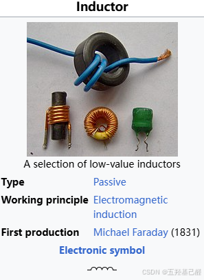
> 
> An **inductor** , also called a **coil** , **choke** , or **reactor** , is a [passive](https://en.wikipedia.org/wiki/Incremental_passivity) two-terminal [electrical component](https://en.wikipedia.org/wiki/Electronic_component) that stores energy in a [magnetic field](https://en.wikipedia.org/wiki/Magnetic_field) when [electric current](https://en.wikipedia.org/wiki/Electric_current) flows through it. [[1]](https://en.wikipedia.org/wiki/Inductor#cite_note-1) An inductor typically consists of an insulated wire wound into a [coil](https://en.wikipedia.org/wiki/Electromagnetic_coil) .

电感也是在电路中储存能量的器件 ，当电流通过他时，其内部会产生磁场将能量以磁的形式储存起来。根据楞次定律我们很容易知道电感会产生感应电动势阻碍电流的变化，因此通常电感阻碍AC，通过DC。

**一般应用** 

> 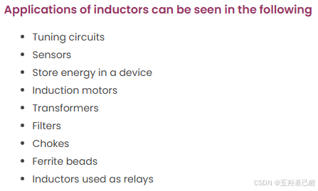
> 
> 

对于电感一般有以下用途：

> 
> 
> - 射频电路：
> 
>   - 匹配网络：与其他器件一起构成匹配网络，消除反射及损耗。
> 
>   - 滤波：组成滤波回路，滤除噪声。
> 
>   - 谐振：构成谐振回路，作为震荡源。
> 
> - 去耦电感：根据去除共模干扰或差模干扰。
> 
> - 功率电感：在很多DC-DC电路中都会用到电感，进行储能升压转换。
> 
> 

### 3.二极管

**简介** 

> 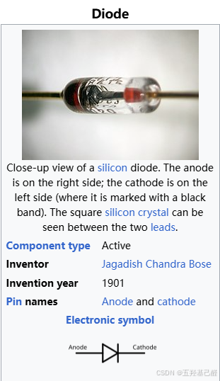
> 
> A **diode** is a two- [terminal](https://en.wikipedia.org/wiki/Terminal_%28electronics%29) [electronic component](https://en.wikipedia.org/wiki/Electronic_component) that conducts [electric current](https://en.wikipedia.org/wiki/Electric_current) primarily in [one direction](https://en.wikipedia.org/wiki/One-way_traffic) (asymmetric [conductance](https://en.wikipedia.org/wiki/Electrical_conductance) ). It has low (ideally zero) [resistance](https://en.wikipedia.org/wiki/Electrical_resistance_and_conductance) in one direction and high (ideally infinite) resistance in the other.

维基百科中这样介绍二极管：一种具有单向导电性的双端元件，其正方向理想电阻为零，反方向理想电阻为无穷大。

其伏安特性曲线（加载在其上的电压与电流之间的关系）如下所示，根据其构成材料不同有不同的特性曲线：

 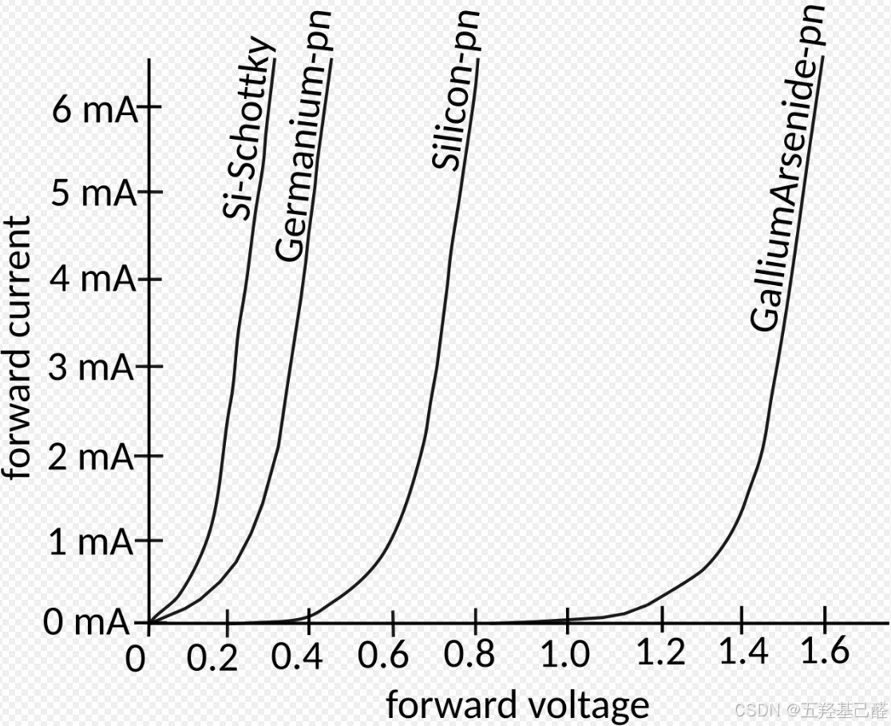

**一般应用** 

> 
> 
> - 保护电路
> 
> - 整流
> 
> - 稳压（稳压管即是工作在反向击穿状态的二极管）
> 
> - 限幅
> 
> - 钳位
> 
> - ... ...
> 
> 

### 4.三极管

**简介** 

> 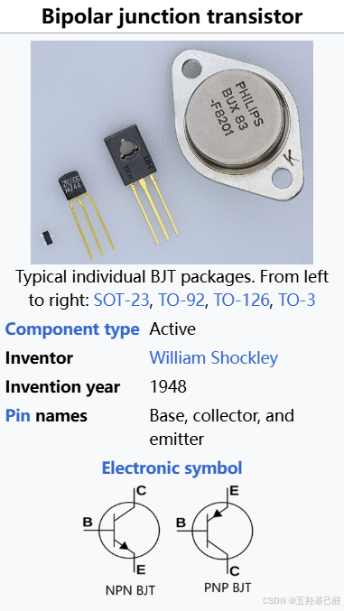
> 
> A **bipolar junction transistor** ( **BJT** ) is a type of [transistor](https://en.wikipedia.org/wiki/Transistor) that uses both [electrons](https://en.wikipedia.org/wiki/Electron) and [electron holes](https://en.wikipedia.org/wiki/Electron_hole) as [charge carriers](https://en.wikipedia.org/wiki/Charge_carrier) . In contrast, a unipolar transistor, such as a [field-effect transistor](https://en.wikipedia.org/wiki/Field-effect_transistor) (FET), uses only one kind of charge carrier. A bipolar transistor allows a small [current](https://en.wikipedia.org/wiki/Electric_current) injected at one of its [terminals](https://en.wikipedia.org/wiki/Terminal_%28electronics%29) to control a much larger current between the remaining two terminals, making the device capable of [amplification](https://en.wikipedia.org/wiki/Amplifier) or [switching](https://en.wikipedia.org/wiki/Electronic_switch) .

也称双极性晶体管，俗称 **三极管** ，是一种具有三个终端的电子器件。几乎是最常用的分立器件。

**实际经验总结** 

一般我们设计电路或者理解电路时，要先分清三极管 工作时的状态，然后根据不同工作状态时的特性来进行电路分析。

> 
> 
> - 截止区：三极管工作在截至状态，当发射结电压Ube小于0.6-0.7V的导通电压，发射结没有导通，集电结处于方向偏执，没有放大作用。
> 
>   - 此时集电极与发射极没有导通，可以想象成开关断开
> 
> - 放大区：三极管的发射极加正向电压，集电极加方向电压导通后，基极电流控制集电极电流，它们近似于线性关系；在基极加上一个小信号电流，将引起集电极大的信号电流输出。
> 
>   - 一般此状态用于驱动电路，实现小电流带动大电流大功率负载
> 
>   - 此状态基极与发射极之间的压降一般为0.5～0.7V
> 
> - 饱和区：当三极管的集电结电流增大到一定程度时，再增大基极电流，集电结电流也不会增大，超出了放大区，进入了饱和区。此时三极管没有放大作用，集电极和发射极相当于短路，常与截止配合与开关电路。
> 
>   - 此时集电极与发射极完全导通，它们之间的压降极小，通常只有0.2~0.3V；可以想象成开关闭合。
> 
>   - 此状态基极与发射极之间的压降一般为0.7V
> 
> 

**一般应用** 

> 
> 
> - 电流放大（驱动电路）
> 
> - 偏置电路
> 
> - 开关作用
> 
> 

### 5.MOS管

**种类** 

 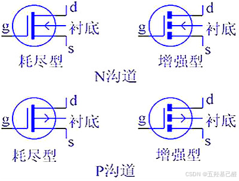

**参数** 

> 
> 
> - **VGS(th)(开启电压)**
> 
> - **VGS(最大栅源电压)**
> 
> - **RDS(on)(漏源电阻)**
> 
> - **ID(导通电流)**
> 
> - **VDSS(漏源击穿电压)**
> 
> - **gfs(跨导)**
> 
> - **Cgs(栅极与源极间寄生电容)**
> 
> 

**导通条件** 

> 
<strong>以下Vg为栅极电压，Vs为源极电压，Vgs为栅极与源极间电压差</strong>

N沟道：导通时 Vg>Vs,Vgs> Vgs(th)时导通；

P沟道：导通时 Vg< Vs,Vgs< Vgs(th)时导通。

即，MOS管导通条件：|Vgs| > |Vgs(th)|

**一般应用** 

> 
> 
> - 开关电路
> 
> - 电压隔离（防反接）
> 
> 

## 三.常见电路

### 1.桥式整流

 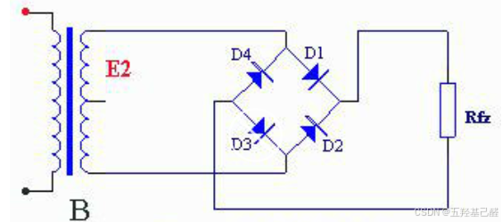

### 2.RC震荡

 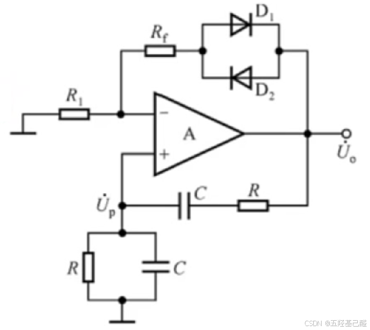

### 3.基本放大

 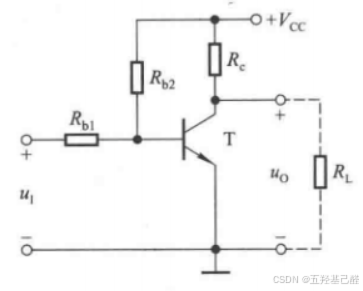

### 4.微分积分

 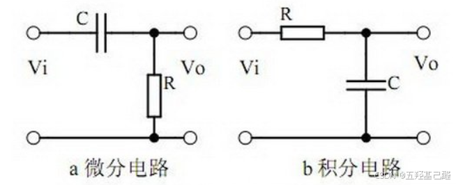

### 5.滤波电路

 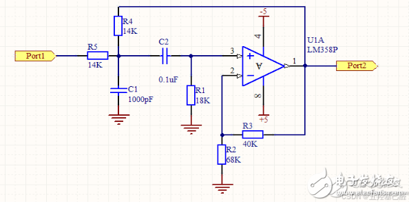

