# 【科研小白向】如何读一篇论文？——以一篇世界模型综述为例解读

> 原创 已于 2026-06-28 23:11:55 修改 · 粉丝可见 · 121 阅读 · 4 · 0 · 本内容遵循CC 4.0 BY-SA版权协议 版权声明：本文为博主原创文章，遵循 CC 4.0 BY 版权协议，转载请附上原文出处链接和本声明。 GEO检测 · 编辑
> 文章链接：https://menoking.blog.csdn.net/article/details/161935897

**目录**

[TOC]

## 零.前情提要

本贴为笔者硕士入学前由自身经验总结，面向CS/EE方向的友友们，从找文献，读文献，到总结文献的方法记录。

第一部分介绍一些检索文献以及文献处理相关的网站和工具。

第二部分则以综述论文 <u>***A Comprehensive Survey on World Models for Embodied AI***</u> 对读论文的步骤进行梳理。

## 一.找文献

人工智能领域内最看重的无非就是CCF类的顶级会议，如ICLR，ICML，CVPR等等...机器人领域有ICRA、IROS、RSS...

### 检索文献网站

#### 一个更新顶会论文的仓库

该仓库聚合了各个顶会的最新论文，方便查阅检索：

[hongsong-wang/CV_Paper_Portal: Paper Portal for Top Conferences in the Field of Computer Vision and Artificial intelligence](https://github.com/hongsong-wang/CV_Paper_Portal) 

> 用法指南：
> 
> [【科研播报】ICLR 2026 收录论文集汇总](https://mp.weixin.qq.com/s/TaV_7JzgM1eXYvrOtpzwmw) 

 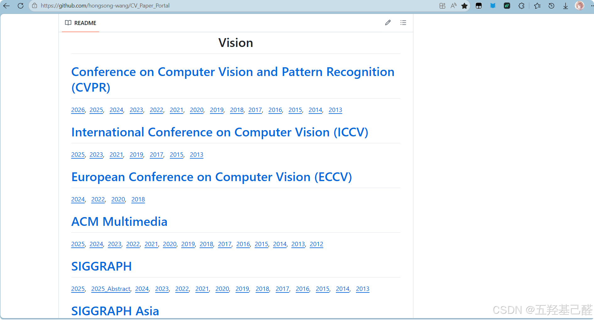

 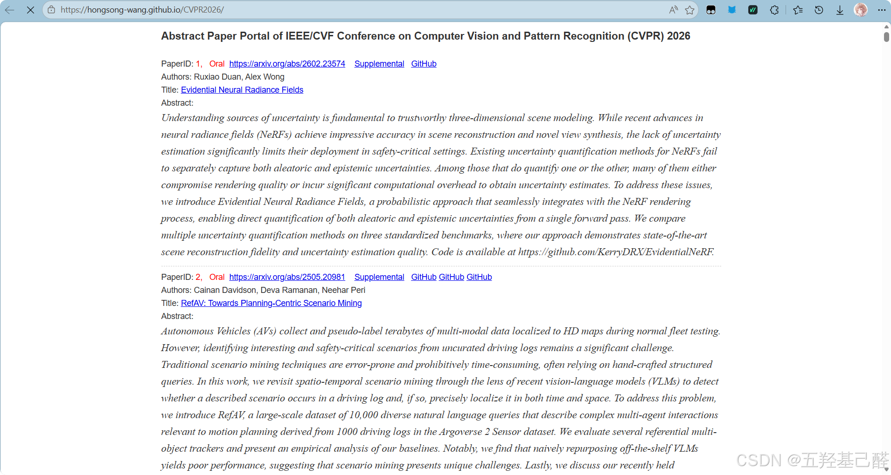

#### 顶会库

灵研AI收录的各顶会论文库：

 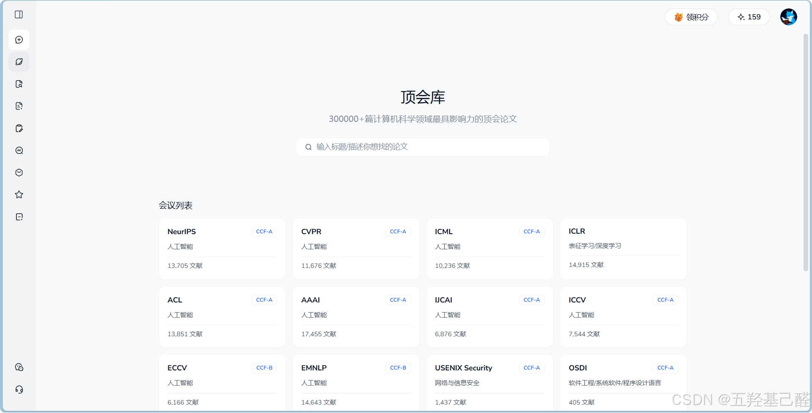

#### 文献引用网络

以下两个网站都能将一篇论文的引用图绘制出来，可以帮助研究者快速了解发展进程以及相关研究复现。

- Connected Papers

  - [Connected Papers | Find and explore academic papers](https://www.connectedpapers.com/)

  - 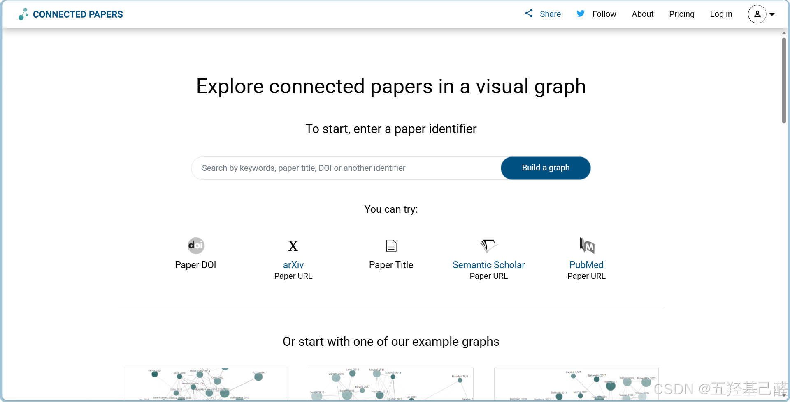

  - 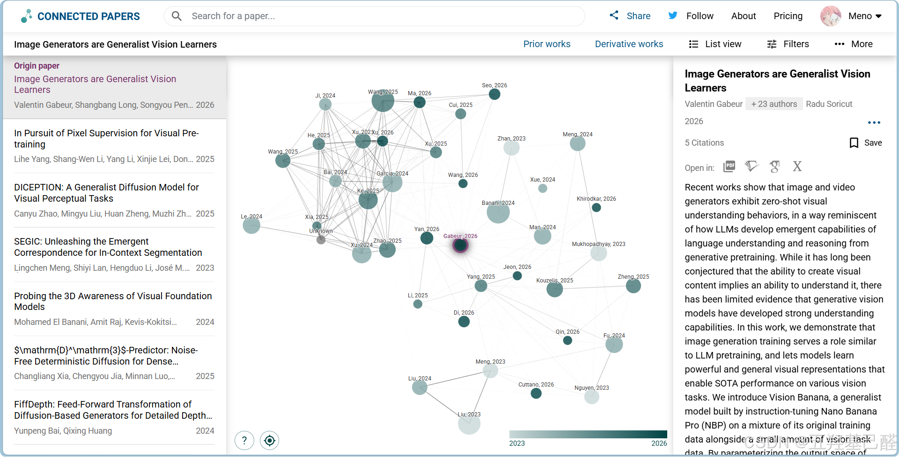

- Litmaps

  - [Litmaps | Your Literature Review Assistant](https://www.litmaps.com/)

  - 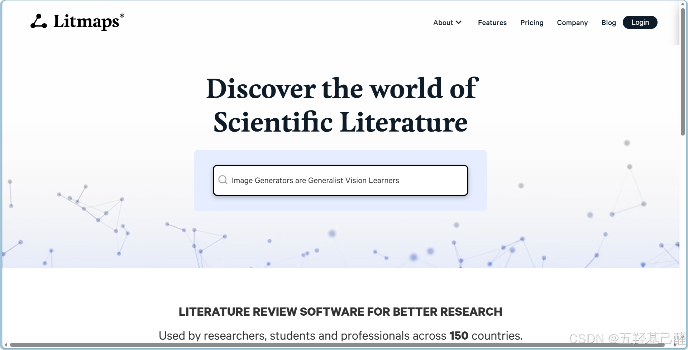

  - 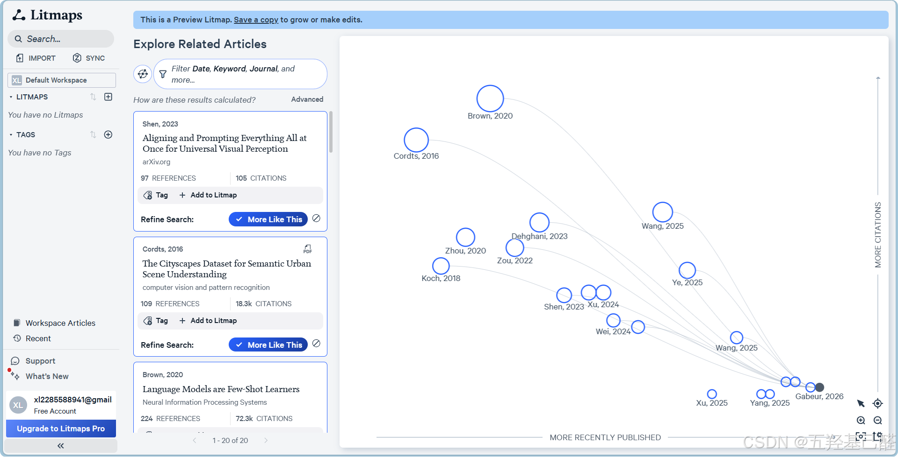

#### 会议数据可视化

Paper Copilot这个网站对所有主流会议进行了数据可视化：

[Paper Copilot - Paper Copilot](https://papercopilot.com/) 

 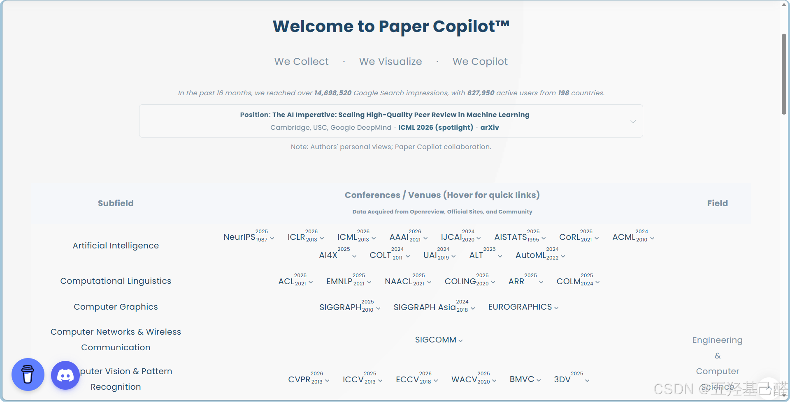

 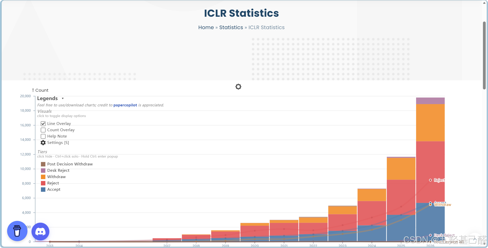

 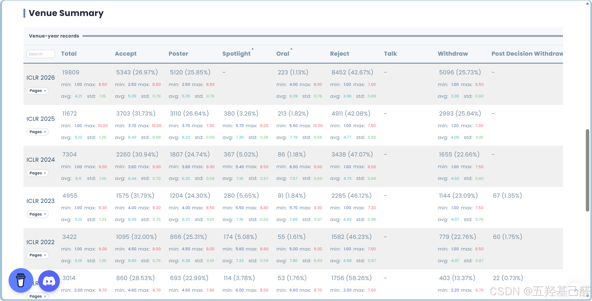

#### 语义检索相关论文

论文检索、翻译、对话、收藏工具：

[DeerLit](https://deerlit.com/) 

 

类似类型的语义检索论文网站（这个网站显示相关关键词与简要总结，这点很方便）：

[arXivSub](https://arxivsub.comfyai.app/arxiv#) 

 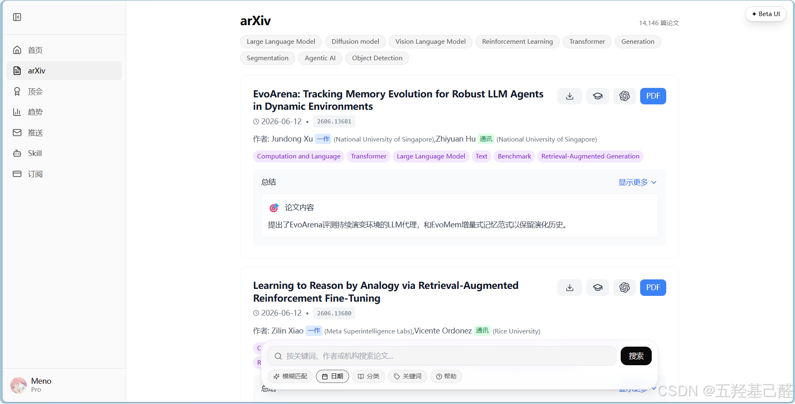

### 论文处理工具

#### RetainPDF

PDF 保留排版翻译工具。

Github仓库： [wxyhgk/retain-pdf: 在保留版面、公式与结构的前提下进行 PDF 翻译，适用于科研与技术文档](https://github.com/wxyhgk/retain-pdf) 

 

## 二.读文献

以下是笔者初入科研探索期的读文献方法，仅供参考。

接下来以一篇CVPR 2025的具身智能领域的综述来做示例精读：

[[2510.16732v2] A Comprehensive Survey on World Models for Embodied AI](https://arxiv.org/abs/2510.16732v2) 

 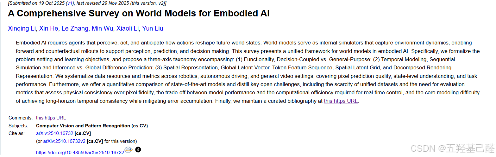

### 标题

 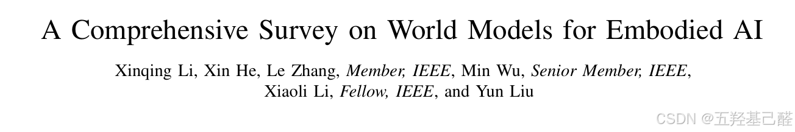

可以看出是具身领域对世界模型发展的一篇综述文章。

### 摘要

摘要阐述了本文对目前具身领域世界模型的发展研究进行了梳理，从几个维度轨道来分类；并收集了常见的数据资源和评估指标；最后对不同模型做了评测比较。

 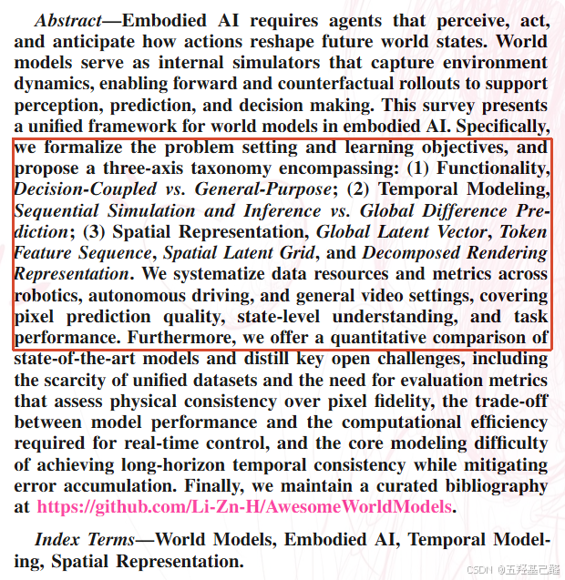

### 正文

#### 分类体系

三维度技术分类体系：

> 
> 
> - 从功能层面看：
> 
>   - 决策耦合Decision-Coupled：任务特定，动态优化。
> 
>   - 通用目标General-Purpose：任务无关，广泛预测。
> 
>   - 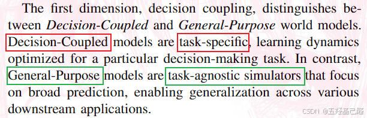
> 
> - 从时间建模维度看：
> 
>   - 顺序仿真与推理Sequential Simulation andInference：自回归顺序建模
> 
>   - 全局差异预测GlobalDifference Prediction：全局并行计算
> 
>   - 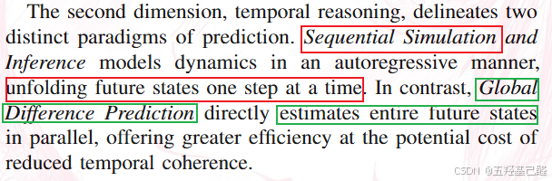
> 
> - 从空间表示维度看：
> 
>   - **Global Latent Vector (GLV)：** 将复杂世界状态编码为紧凑向量。
> 
>     - RSSM, RNN
> 
>   - **Token Feature Sequence (TFS)：** 将世界状态建模为token序列。
> 
>     - Transformer, LLM
> 
>   - **Spatial Latent Grid (SLG)：** 利用几何先验（BEV、体素网格）。
> 
>     - BEV, Voxel
> 
>   - **Decomposed Rendering Representation (DRR)：** 将3D场景分解为可学习基元。
> 
>     - 3DGS, NeRF
> 
>   - 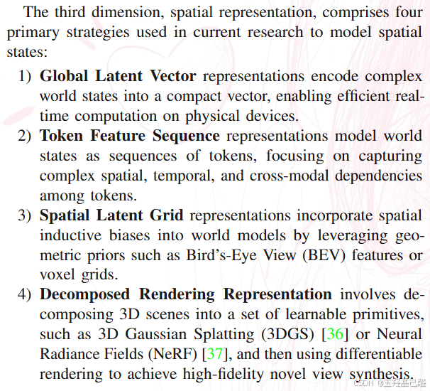
> 
> 

#### 代表性技术路线

> ##### 决策耦合 × 序列模型
> 
> - **RSSM（Recurrent State-Space Model）家族** （影响力最大）：PlaNet → Dreamer → DreamerV2 → DreamerV3（Nature 2025）
> 
>   - 变体包括：Dreaming（对比学习 Contrastive Learning）、DreamerPro（原型替代解码器）、HRSSM（双分支架构 Dual-branch）、DisWM（解耦语义 Disentangled Semantics）
> 
>   - 可迁移性（Transferability）扩展：PreLAR（动作抽象 Action Abstraction）、SENSEI（VLM奖励）、ReDRAW（残差适应 Residual Adaptation）、FOUNDER/LUMOS
> 
> - **TSSM（Transformer State-Space Model）** ：TransDreamer、OSVI-WM
> 
> - **IDM（Inverse Dynamics Model，逆动力学模型）** ：GLAMOR、Iso-Dream、VidMan
> 
> - **SSM（State Space Model）/Mamba** ：GLAM（Mamba 并行框架）
> 
> - **Token 序列** ：MWM、TWM、EgoAgent、WorldVLA、DCWM
> 
> - **CoT（Chain-of-Thought，思维链）/LLM（Large Language Model，大语言模型）注入** ：NavCoT、ECoT、MineDreamer（∞CoI）、Dyna-Think、Statler
> 
> - **空间网格（Spatial Grid）** ：OccWorld、DriveWorld、RoboOccWorld、EnerVerse
> 
> - **分解式渲染（Decomposed Rendering）** ：GAF、ManiGaussian、DreMa、PIN-WM
> 
> ##### 决策耦合 × 全局预测
> 
> - **扩散方法（Diffusion-based Methods）** ：TOKEN、FLARE、EmbodiedDreamer、Drive-WM、COMBO
> 
> - **视频生成 + 规划** ：GeoDrive、LaDi-WM
> 
> ##### 通用 × 序列模型
> 
> - **Token 序列** ：iVideoGPT、Genie、RoboScape、PACT、Owl-1
> 
> - **扩散适应（Diffusion Adaptation）** ：AdaWorld、Vid2World、GenAD、Pandora
> 
> - **几何保真（Geometric Fidelity）** ：Geometry Forcing、DeepVerse、DriVerse
> 
> - **空间网格（Spatial Grid）** ：PhyDNet、ViDAR、FOLIAGE、MindJourney
> 
> - **分解式渲染（Decomposed Rendering）** ：GaussianWorld、InfiniCube
> 
> ##### 通用 × 全局预测
> 
> - **JEPA（Joint-Embedding Predictive Architecture，联合嵌入预测架构）** ：V-JEPA、V-JEPA 2、AD-L-JEPA
> 
> - **掩码视觉模型（Masked Visual Model）** ：WorldDreamer、MaskGWM
> 
> - **扩散 + DiT（Diffusion Transformer）** ：Sora、ForeDiff、AirScape、MarsGen
> 
> - **4D Token 化（4D Tokenized）** ：OccSora、DynamicCity、DrivePhysica、COME、AETHER
> 
> - **3D/4DGS（Gaussian Splatting）渲染** ：DriveDreamer4D、ReconDreamer、MagicDrive3D
> 
> 

#### 数据资源

接着文中总结了具身领域主流的仿真平台、评估基准、数据集以及机器人体：

| 类别 | 代表 | 说明 |
|:---:|:---:|:---:|
| **仿真平台（Simulation Platforms）** | MuJoCo、NVIDIA Isaac、CARLA、Habitat | 可控可扩展的虚拟环境 |
| **交互式基准（Interactive Benchmarks）** | DMC、Atari、Meta-World、RLBench、LIBERO、nuPlan | 标准化闭环评估（Closed-loop Evaluation）任务套件 |
| **离线数据集（Offline Datasets）** | nuScenes、Waymo、Occ3D、RT-1、OXE、OpenDV、SSv2、VideoMix22M | 大规模预收集轨迹 |
| **真实机器人平台（Real-world Robot Platforms）** | Franka Emika（7-DoF 机械臂）、Unitree Go1（四足）、Unitree G1（人形） | 物理实物验证 |

 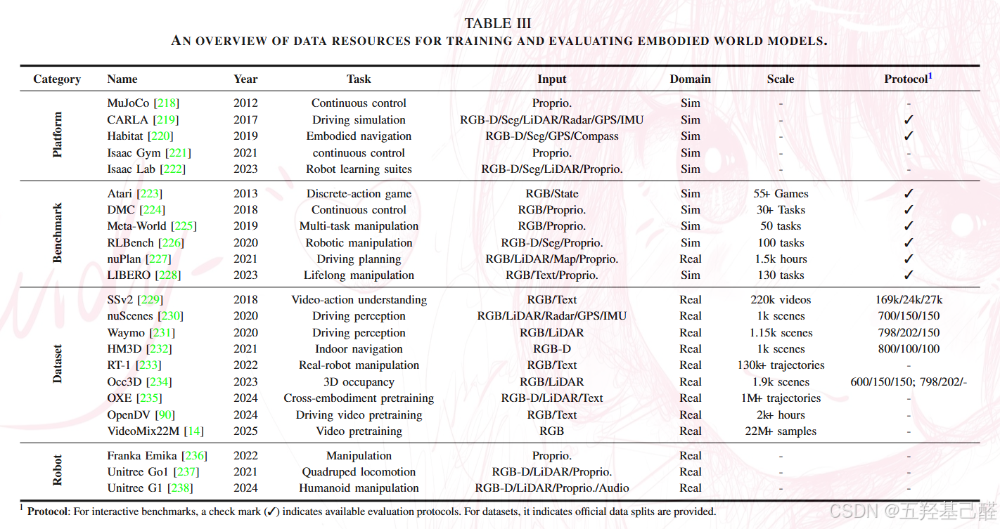

#### 评估指标

| 层级 | 指标 | 说明 |
|:---:|:---:|:---:|
| **像素生成质量（Pixel Generation Quality）** | FID、FVD、SSIM、PSNR、LPIPS、VBench | 图像/视频保真度和感知相似度 |
| **状态级理解（State-level Understanding）** | mIoU、mAP、ADE/FDE、Chamfer Distance | 语义分割（Semantic Segmentation）、检测（Detection）、轨迹预测、几何相似度 |
| **任务性能（Task Performance）** | 成功率（SR: Success Rate）、样本效率（SE: Sample Efficiency）、奖励（Reward）、碰撞率（Collision Rate） | 最终决策目标达成 |

#####  **像素级** 

描述生成样本的质量和保真度。

 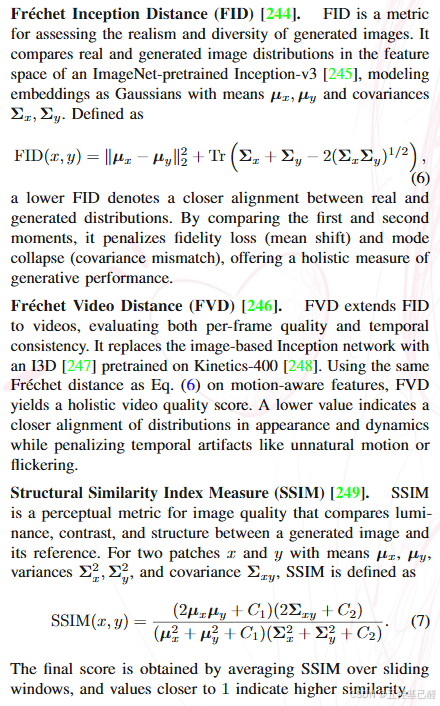

 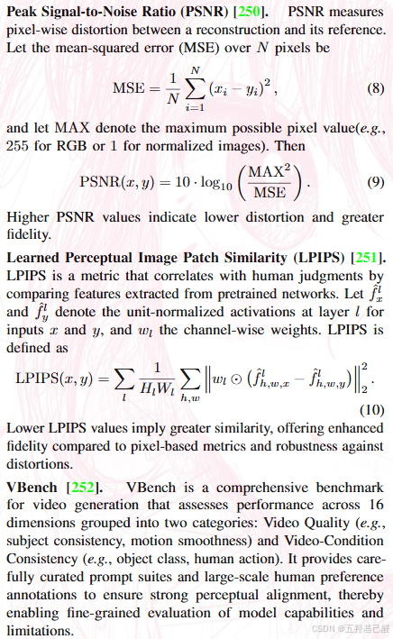

##### 状态级

描述模型的语义分割或检测识别等理解能力。

 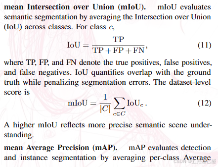

 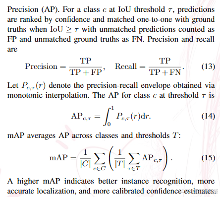

 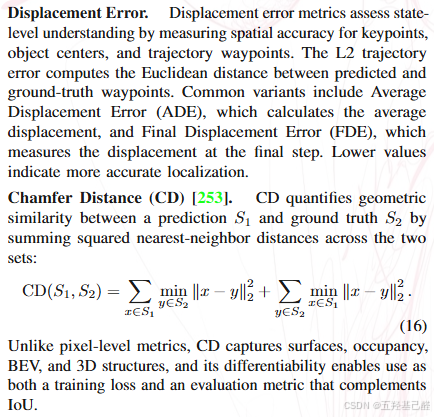

##### 任务级

这个很好理解，就是评价完成一整个任务的准确率、成功率等。

 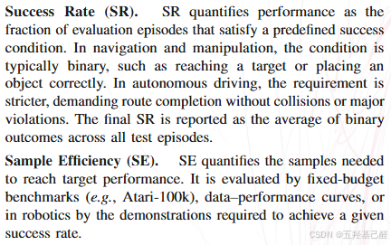

 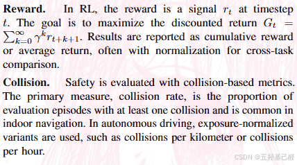

#### 模型性能比较

自动驾驶数据集nuScenes数据集下视频生成质量对比：

 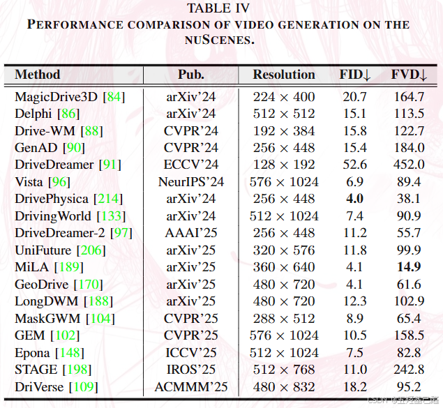

Occ3D-nuScenes（ nuScenes 数据集的 3D 占用预测版本）数据集下的Occ3D 4D 占用预测性能：

 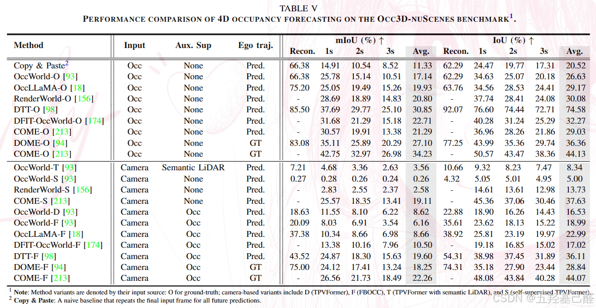

DMC （DeepMind Control Suite）控制测试：

> 环境：MuJoCo 物理引擎
> 典型任务：机械臂推球、四足行走、倒立摆平衡、鱼形机器人游泳
> 输入：64×64 像素图像（纯视觉）
> 评估：Episode Return — 1,000 步累计奖励，满分 1,000
> 领域：机器人控制 + 强化学习

 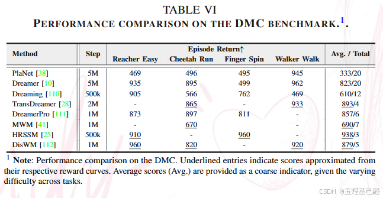

RLBench 操作测试：

> 环境：MuJoCo + Franka Emika 仿真机械臂
> 任务数：100 个桌面操作任务
> 特点：每步给一个小奖励（稀疏奖励），大部分步骤奖励为 0，只有最后成功才给大分
> 评估：成功率 (SR) — 多轮试错中成功的比例
> 领域：精密操作 + 灵巧操控

 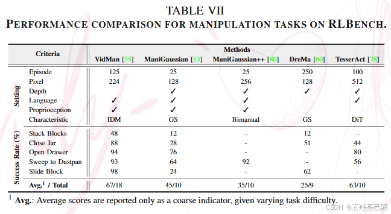

nuScenes 开环规划测试：

> 环境：nuScenes 真实路采数据（不是仿真器）
> 输入：过去 2 秒的传感器历史（相机/LiDAR/轨迹）
> 输出：未来 3 秒的 2D BEV 路径点序列
> 评估指标：L2 误差（预测路径偏离真实路径的平均米数）+ 碰撞率（预测路径撞上障碍物的比例）
> 关键限制：开环 ≠ 真实驾驶——模型不会因为预测错了而主动纠偏，所以开环好 ≠ 路上开得好

 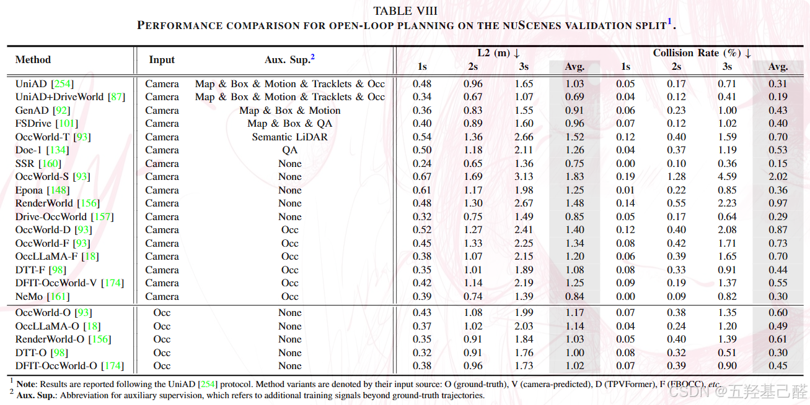

### 问题与挑战

#### 数据与评估

> 
> 
> - **碎片化（Fragmentation）** ：缺乏统一大规模跨领域数据集，严重制约泛化（Generalization）
> 
> - **物理一致性缺失** ：现有指标偏向像素保真度，忽略因果性（Causality）和物理合理性
> 
> - **未来方向** ：构建统一多模态跨领域数据集（如 OpenDV-2K、VideoMix22M）；推进可评估物理一致性和因果推理（Causal Reasoning）的评估框架
> 
> 

#### 计算效率

> 
> 
> - **瓶颈** ：Transformer 和扩散模型（Diffusion Model）推理成本高，与实时控制（Real-time Control）需求冲突
> 
> - **现状** ：RNN 和全局隐向量因其高效率仍被广泛使用
> 
> - **未来方向** ：量化（Quantization）、剪枝（Pruning）、稀疏计算（Sparse Computation）；SSM/Mamba 等线性复杂度模型
> 
> 

#### 建模策略

> 
> 
> - **核心张力（Core Tension）** ：自回归（Autoregressive，紧凑但误差累积 Error Accumulation）vs. 全局预测（Global Prediction，连贯但计算重）
> 
> - **空间瓶颈** ：四种表示的效率-表达力权衡；分解式渲染（NeRF/3DGS）在动态场景中扩展性差
> 
> - **未来方向** ：
> 
>   - **SSM/Mamba** ：线性复杂度 + 长时域推理潜力
> 
>   - **JEPA 掩码方法** ：改善表示学习（Representation Learning），但与闭环控制的集成仍具挑战
> 
>   - **混合架构（Hybrid Architecture）** ：整合自回归和全局预测优势
> 
>   - **分层规划（Hierarchical Planning）+ CoT 任务分解** ：通过中间目标设置改善时间一致性
> 
> 

