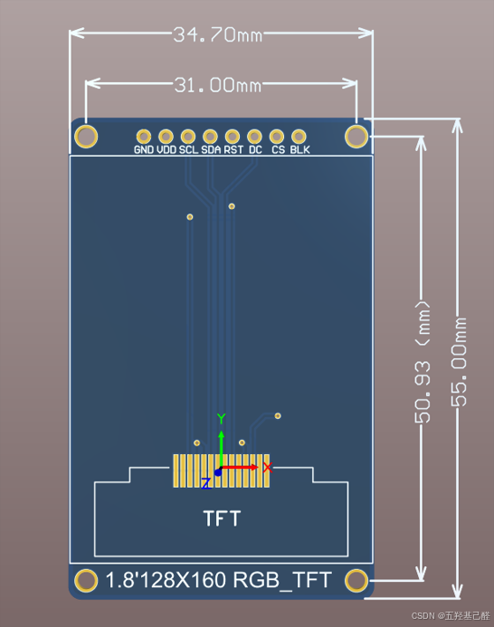
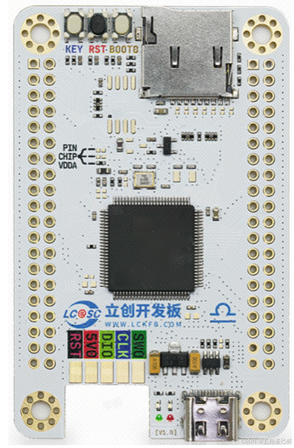
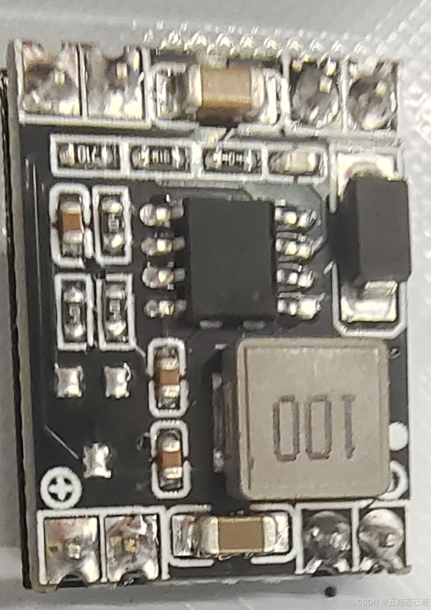
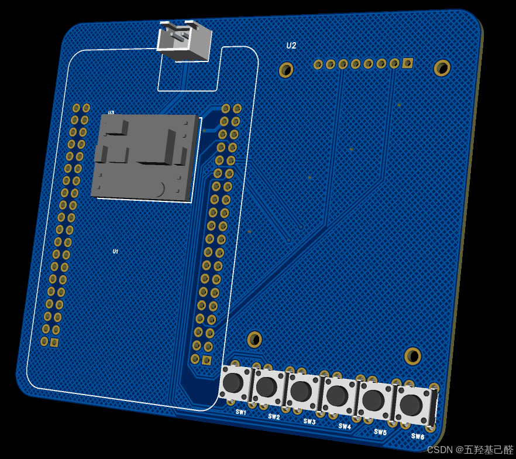
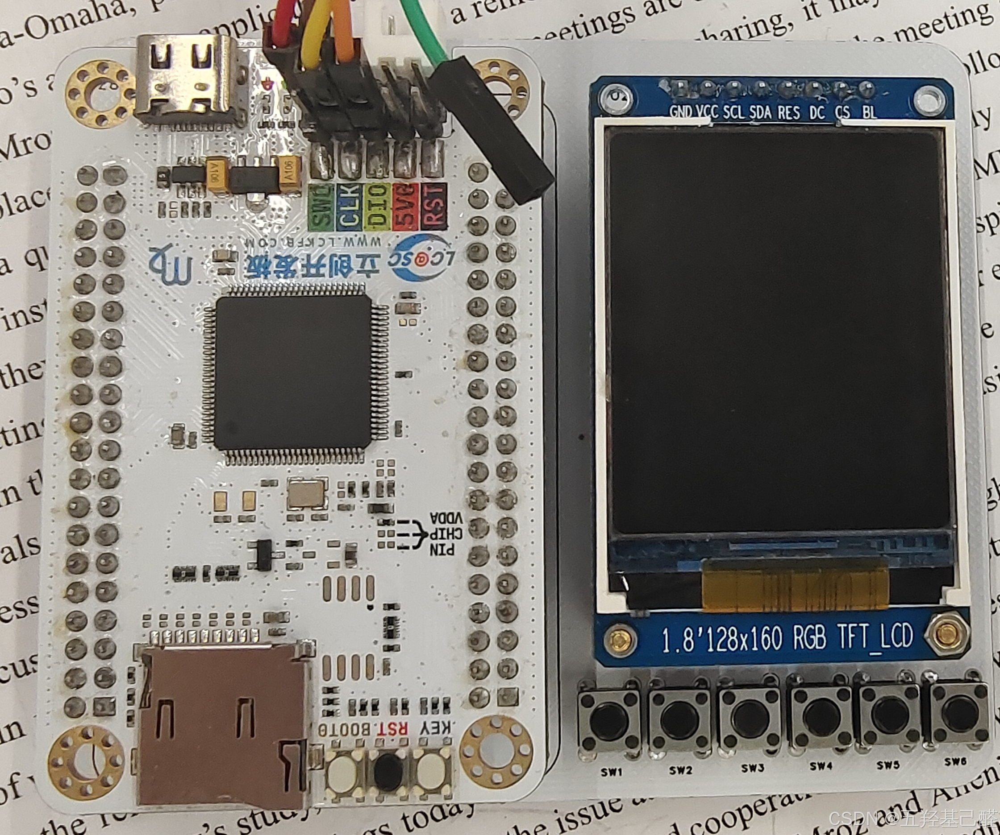

# 【课程设计】单片机课程设计之基于STM32的LCD电子钟的设计（LVGL+TFT彩屏）

> 原创 已于 2025-04-21 00:06:34 修改 · 粉丝可见 · 2.5k 阅读 · 47 · 20 · 本内容遵循CC 4.0 BY-SA版权协议 版权声明：本文为博主原创文章，遵循 CC 4.0 BY 版权协议，转载请附上原文出处链接和本声明。 GEO检测 · 编辑
> 文章链接：https://menoking.blog.csdn.net/article/details/143399513

## 零.前置说明

> 由于本项目使用了LVGL开源框架，建议至少了解一点LVGL，可看前置文章：
> 
> [【LVGL快速入门(一)】LVGL开源框架入门教程之框架移植_lvgl教程-CSDN博客](https://blog.csdn.net/2203_75993546/article/details/142684876?fromshare=blogdetail&sharetype=blogdetail&sharerId=142684876&sharerefer=PC&sharesource=2203_75993546&sharefrom=from_link) 
> [【LVGL快速入门(二)】LVGL开源框架入门教程之框架使用(UI界面设计)_lvgl框架详解-CSDN博客](https://blog.csdn.net/2203_75993546/article/details/142915534?fromshare=blogdetail&sharetype=blogdetail&sharerId=142915534&sharerefer=PC&sharesource=2203_75993546&sharefrom=from_link) 
> 
> 
> [【LVGL速成】LVGL修改标签文本(GUI Guider生成的字库问题)-CSDN博客](https://blog.csdn.net/2203_75993546/article/details/143235795?fromshare=blogdetail&sharetype=blogdetail&sharerId=143235795&sharerefer=PC&sharesource=2203_75993546&sharefrom=from_link) 
> 
> 屏幕驱动移植：
> 
> [【TFT彩屏移植】STM32F4移植1.8寸TFT彩屏简明教程_stm32 tft彩屏-CSDN博客](https://blog.csdn.net/2203_75993546/article/details/142887928?fromshare=blogdetail&sharetype=blogdetail&sharerId=142887928&sharerefer=PC&sharesource=2203_75993546&sharefrom=from_link) 

**完整工程已经上传到Gitee个人仓库：** [Meno/LcdClock_LVGL](https://gitee.com/menoking/lcd-clock_-lvgl) 

## 一.项目背景

最近学校开始了单片机课程设计，笔者深知自己学疏才浅，思索再三，选择了相对比较容易完成的LCD电子钟的制作。

要求如下：

<div style="text-align:center;"></div>


也是因为笔者最近浅浅学习了下LVGL，所以便想利用手里的一块 **TFT彩屏** 和 **STM32F407** 来完成这次的课程设计。

## 二.材料介绍

笔者手里的这块屏幕是1.8寸128*160的SPI屏幕：

 

主控为嘉立创天空星（STM32F407VET6）：

 

还有一块不知是什么芯片的降压12V-5V，大小大概是16mm*22mm:

 

底板是笔者自己绘制的PCB：

 

实物如下：

 

## 三.代码编写

由于整体功能还是比较简单的，软件部分只涉及到按键扫描以及时钟屏幕刷新，所以我们直接建立好Clock和Key的文件： 

### 按键

按键就完全是正常按键扫描代码的写法，注意这里消抖选用的三行按键消抖，主要是考虑到延时按键消抖可能会破坏掉LVGL整个框架的时基，所以使用的这种方式。

**Key.c** 

```cpp
//              KEY1   PD8
//              KEY2   PD9
//              KEY3   PD10
//              KEY4   PD11
//              KEY5   PD12
//              KEY6   PD13
 
#include "Key.h"
 
uint8_t Key_Value,Key_Down,Key_Up,Key_Last;
 
uint8_t Key_GetValue(void)
{
	if(HAL_GPIO_ReadPin(GPIOD,KEY1_Pin) == 0)
		return 1;
	if(HAL_GPIO_ReadPin(GPIOD,KEY2_Pin) == 0)
		return 2;
	if(HAL_GPIO_ReadPin(GPIOD,KEY3_Pin) == 0)
		return 3;
	if(HAL_GPIO_ReadPin(GPIOD,KEY4_Pin) == 0)
		return 4;
	if(HAL_GPIO_ReadPin(GPIOD,KEY5_Pin) == 0)
		return 5;
	if(HAL_GPIO_ReadPin(GPIOD,KEY6_Pin) == 0)
		return 6;
	return 0;
}
 
void Key_RemoveShake(void)
{
	Key_Value = Key_GetValue();//获取按下键值
	Key_Down = Key_Value & (Key_Value ^ Key_Last);//获取下降沿
	Key_Up = ~Key_Value & (Key_Value ^ Key_Last);//获取上升沿
	Key_Last = Key_Value;//键值覆盖
}
 
Key_Type Key_Press(void)
{
	return Key_Down ? (Key_Type)Key_Value : 0;
}
 
```

**Key.h** 

```cpp
#ifndef   __KEY_H__
#define   __KEY_H__
 
#include <stdint.h>
#include "stm32f4xx.h"                  // Device header
#include "main.h"
 
typedef enum Key_Type
{
	KEY1 = 1,
	KEY2 = 2,
	KEY3 = 3,
	KEY4 = 4,
	KEY5 = 5,
	KEY6 = 6
}Key_Type;
 
void Key_RemoveShake(void);
Key_Type Key_Press(void);
 
#endif
```

### 时钟

时钟要实现正常显示以及修改界面显示，所以最好定义一个模式变量来进行分辨，然后根据模式不同显示不同的数据。

**Clock.c** 

```cpp
#include "Clock.h"
#include <stdio.h>
#include "Key.h"
 
extern lv_ui guider_ui;
 
uint8_t ClockNow[3] = {23,59,55},ClockChange[3] = {0,0,0};
uint8_t ClockString_hour[2],ClockString_minute[2],ClockString_second[2];
 
Clock_DisMode Clock_Mode = NormalMode;
 
//时钟初始化
void Clock_Init(void)
{
	
}
 
void Clock_NumToString(void)
{
	if(Clock_Mode == NormalMode)
	{
		ClockString_hour[0] = ClockNow[0] / 10 + '0'; // 十位数字
		ClockString_hour[1] = ClockNow[0] % 10 + '0'; // 个位数字
		
		ClockString_minute[0] = ClockNow[1] / 10 + '0'; // 十位数字
		ClockString_minute[1] = ClockNow[1] % 10 + '0'; // 个位数字
		
		ClockString_second[0] = ClockNow[2] / 10 + '0'; // 十位数字
		ClockString_second[1] = ClockNow[2] % 10 + '0'; // 个位数字
	}
	else
	{
		ClockString_hour[0] = ClockChange[0] / 10 + '0'; // 十位数字
		ClockString_hour[1] = ClockChange[0] % 10 + '0'; // 个位数字
		
		ClockString_minute[0] = ClockChange[1] / 10 + '0'; // 十位数字
		ClockString_minute[1] = ClockChange[1] % 10 + '0'; // 个位数字
		
		ClockString_second[0] = ClockChange[2] / 10 + '0'; // 十位数字
		ClockString_second[1] = ClockChange[2] % 10 + '0'; // 个位数字
	}
}
 
//时钟正常调度
void Clock_Handler(void)
{
	static uint16_t Timer_1000ms;
	if(++Timer_1000ms > 20)
	{
		Timer_1000ms = 0;
		if(++ClockNow[2] >= 60)
		{
			ClockNow[2] = 0;
			if(++ClockNow[1] >= 60)
			{
				ClockNow[1] = 0;
				if(++ClockNow[0] >= 24)
				{
					ClockNow[0] = 0;
				}
			}
		}
	}
}
 
void Clock_RefreshToPage(void)
{
	Clock_NumToString();
	lv_label_set_text(guider_ui.screen_label_hour,(const char*)ClockString_hour);
	lv_label_set_text(guider_ui.screen_label_minute,(const char*)ClockString_minute);
	lv_label_set_text(guider_ui.screen_label_second, (const char*)ClockString_second);
}
 
//设置时钟完成
void Clock_SetValueFinish(void)
{
	uint8_t i;
	for(i = 0;i < 3;i ++)
	{
		ClockNow[i] = ClockChange[i];
	}
}
 
//设置时间任务
void Clock_SetValueTask(void)
{
	Key_RemoveShake();
	switch(Key_Press())
	{
		case KEY1:
		{
			uint8_t i;
			for(i = 0;i < 3;i ++)//更新设置时间
			{
				ClockChange[i] = ClockNow[i];
			}
			Clock_Mode = SetMode;//转换模式
			break;
		}
		case KEY2://小时++
		{
			ClockChange[0] = ClockChange[0] >= 23 ? 0 : ClockChange[0] + 1;
			break;
		}
		case KEY3://分钟++
		{
			ClockChange[1] = ClockChange[1] >= 59 ? 0 : ClockChange[1] + 1;
			break;
		}
		case KEY4:
		{
			Clock_SetValueFinish();
			Clock_Mode = NormalMode;//转换模式
			break;
		}
		default:
			break;
	}
}
 
//按键测试案例
void Clock_Demo(void)
{
	Key_RemoveShake();
	if(Key_Press() == KEY1)
		ClockNow[0]++;
}
 
 
 
 
 
```

**Clock.h** 

```cpp
#ifndef   __CLOCK_H__
#define   __CLOCK_H__
 
#include <stdint.h>
#include "stm32f4xx.h"                  // Device header
#include "Lcd_Driver.h"
#include "GUI.h"
#include "lvgl.h"//LVGL头文件引用
#include "lv_port_disp.h"//LVGL显示支持
#include "lv_port_indev.h"// LVGL的触摸支持
#include "../generated/gui_guider.h"
#include "../generated/events_init.h"
 
typedef enum Clock_DisMode
{
	NormalMode = 0,
	SetMode = 1
}Clock_DisMode;
 
void Clock_Init(void);
void Clock_Handler(void);//时钟调度
void Clock_RefreshToPage(void);//刷新屏幕
void Clock_SetValueTask(void);//设置时间
void Clock_Demo(void);//按键测试
 
#endif
```

### 主函数

主函数中只需要在while里调用CLock的文件即可（整个工程要在移植好的LVGL环境下）：

```cpp
 
  while (1)
  {
		static uint8_t LVGL_Timer_5ms = 0;//任务调度函数的5ms定时
		HAL_Delay(1-1);
		if(LVGL_Timer_5ms++ >= 5)
		{
			lv_timer_handler();//任务调度函数
			LVGL_Timer_5ms = 0;
		}
		Clock_Init();
		Clock_Handler();
		Clock_SetValueTask();
		Clock_RefreshToPage();
    /* USER CODE END WHILE */
 
    /* USER CODE BEGIN 3 */
}
```

## 四.视频演示

<div align="center" style="border: 3px solid gray;border-radius: 27px;overflow: hidden;"> <a class="link-info" href="https://live.csdn.net/v/embed/433626?autoplay=0" rel="nofollow" title="LCD电子钟">LCD电子钟</a><iframe id="GOUyFjuv-1731330424604" frameborder="0" src="https://live.csdn.net/v/embed/433626?autoplay=0" allowfullscreen="true" data-mediaembed="csdn" style="width: 100%; aspect-ratio: 2;" allow="fullscreen" loading="lazy"></iframe></div>

## 五.总结

本次只是做了个简单的界面实现了LCD电子钟，后续更复杂的功能待读者们自行开发！