# 【通义灵码】AI编码新时代

> 原创 已于 2024-11-11 21:41:08 修改 · 粉丝可见 · 1.9k 阅读 · 43 · 15 · 本内容遵循CC 4.0 BY-SA版权协议 版权声明：本文为博主原创文章，遵循 CC 4.0 BY 版权协议，转载请附上原文出处链接和本声明。 GEO检测 · 编辑
> 文章链接：https://menoking.blog.csdn.net/article/details/143632239

**目录**

[TOC]


## 一.初识灵码，开启新篇

笔者入驻阿里云已有段时间，同时亦是通义灵码的忠实用户，自从AI Coding助手刚问世时便一直在默默关注着国产AI的变化与升级，而通义灵码是为数不多面向个人用户免费且高效的AI编码助手。其背后是庞大的阿里集团，其中蕴藏的庞大技术力可想而知。

对于我们个人程序员而言，无论是学生、打工人，亦或是教授、科研人员，有这样一个国产良心的AI助手是不可多得的事情。


### 安装

以VS Code为例，我们找到插件市场，搜索tongyi即可找到通义灵码助手，点击安装静待安装成功即可。

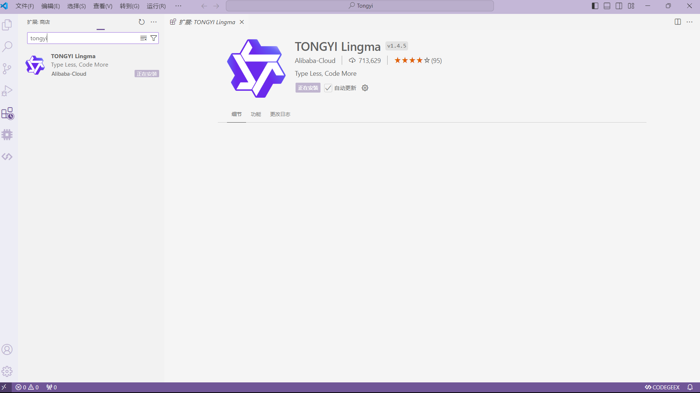

### 登录

安装成功后我们会发现左侧边栏会出现通义灵码的图标，点击会呼出相应的操作界面：


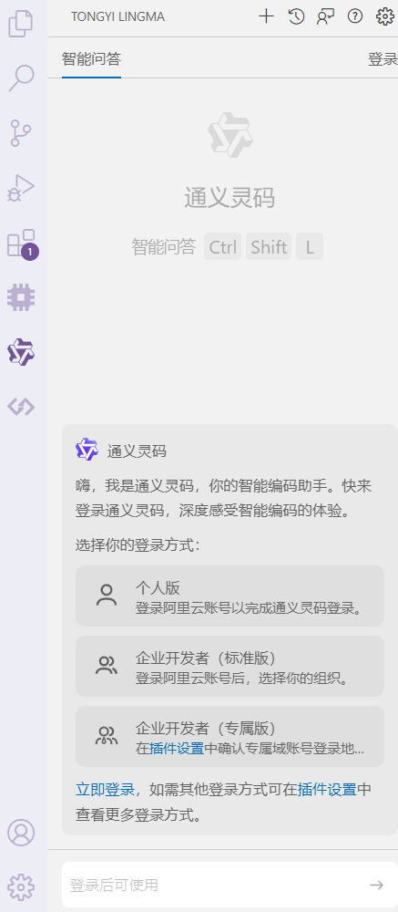

点击右上角登陆后即可使用。


## 二.灵码相伴，探索新境

> ### 主要功能
> 
> 1. **代码生成** ：用户可以通过简单的描述或命令，让通义灵码自动生成相应的代码片段，支持多种编程语言。
> 
> 2. **代码补全** ：在编写代码的过程中，能够智能预测并提供代码补全建议，加速开发过程。
> 
> 3. **代码优化** ：对已有的代码进行分析，并提出优化建议，帮助提高代码质量和执行效率。
> 
> 4. **错误检测与修正** ：自动检测代码中的错误，并提供可能的修正方案。
> 
> 5. **文档生成** ：根据代码自动生成相应的文档，减少手动编写文档的工作量。
> 
> ### 优势
> 
> 1. **高效便捷** ：通过智能化的功能，大大提高了开发者的编码速度和效率，减少了重复劳动。
> 
> 2. **易于上手** ：对于初学者来说，通义灵码提供的辅助功能可以降低学习曲线，更容易掌握编程技能。
> 
> 3. **多语言支持** ：支持广泛的编程语言，满足不同开发者的需求。
> 
> 4. **高质量输出** ：基于大量的训练数据，生成的代码质量高，符合行业标准。
> 
> 5. **持续更新** ：随着技术的发展和用户反馈，通义灵码会不断迭代升级，保持其先进性和实用性。
> 
> 

### 实时续写

根据当前语法和跨文件的代码上下文，实时生成代码，用户可自由选择是否采纳

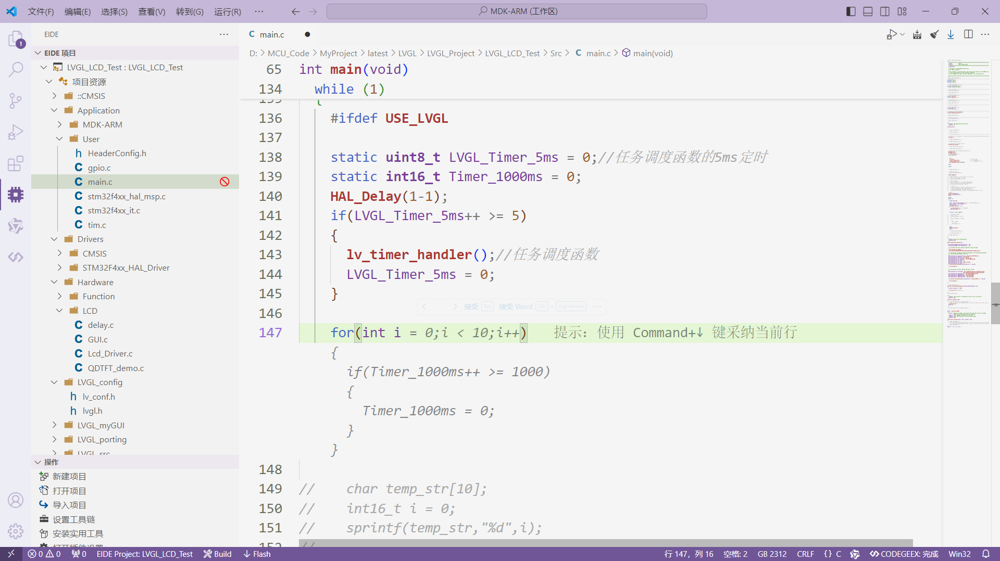

### 自然生成

使用自然语言描述问题后可自动生成代码一件插入

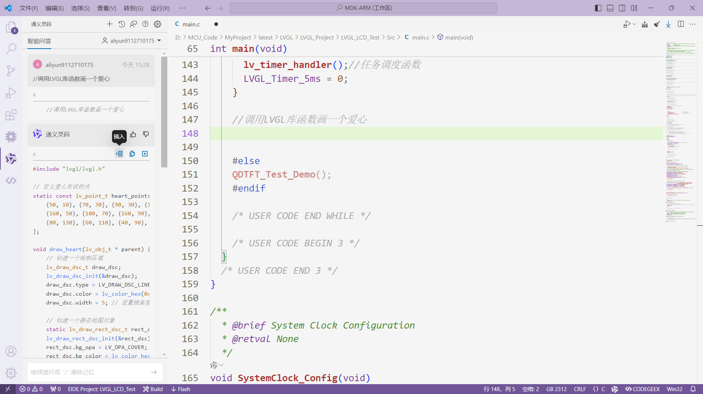

### 单元测试生成

支持根据 JUnit、Mockito、SpringTest、unit test、pytest 等框架生成单元测试。

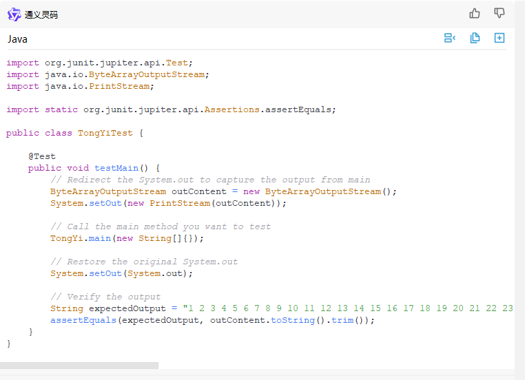

### 解释代码

可以对工程中的任意代码文件进行解释说明，有灵码在身，以后再也没有读不懂的代码了

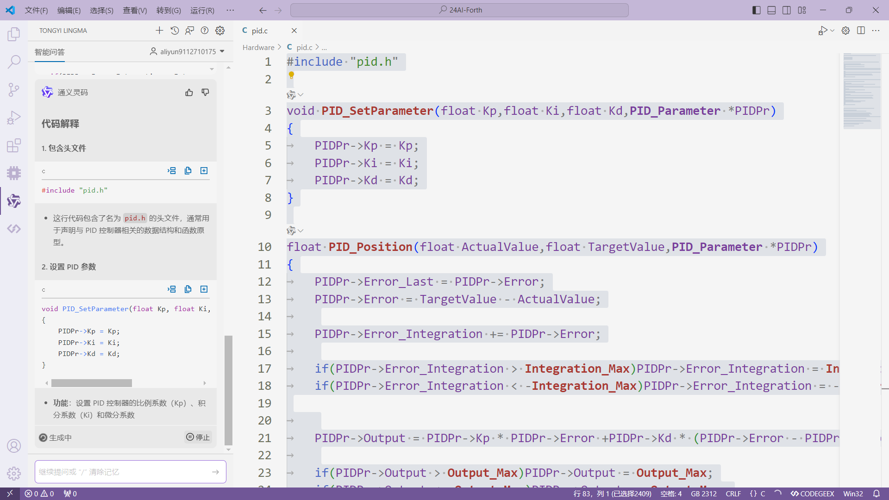

### 优化建议

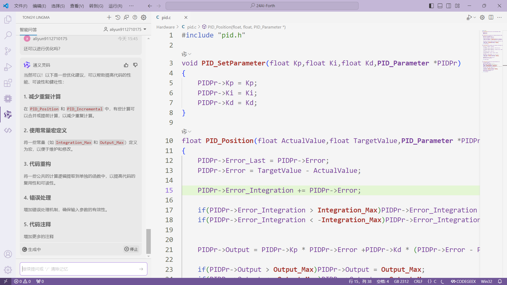

灵码太多功能在此不过多赘述，望君亲自体验... ...

### 快捷键


## 三.智慧流转，高效开发

目前笔者在负责调试一个LVGL框架下的TFT彩屏，但是由于此前并未接触过LVGL，而且要将彩屏驱动从STM32F1系列移植到F4系列，时间紧迫，所以就通过通义灵码来辅助开发。但是由于笔者初次使用LVGL框架，对于框架的结构、API使用方法等可能不够熟悉，会导致开发过程中遇到障碍；而且从STM32F1系列移植到STM32F4系列，两个平台之间存在硬件差异（如外设、时钟配置等），需要调整原有的驱动代码以适应新的硬件环境，因而原有的TFT彩屏驱动可能依赖于特定的硬件特性或库函数，在新平台上这些特性或库函数可能不存在或者有所不同，需要重新编写或调整部分代码；同时项目时间紧张，需要快速完成移植工作，这对开发者的效率提出了较高要求；在调试方面由于对新平台和新框架的不熟悉，调试过程中可能出现难以定位的问题，会影响开发进度。于是笔者在本次项目中大量使用了通义灵码的辅助与提示，来尽量帮助自己调节把控整个项目开发过程。

### 驱动移植

将示例驱动交给通义灵码进行学习生成移植到stm32f4平台上

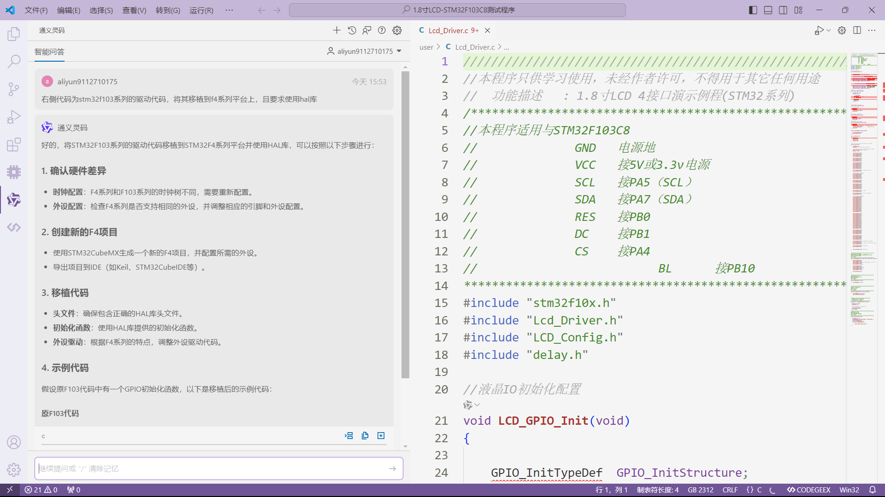

其中修改的驱动很详细

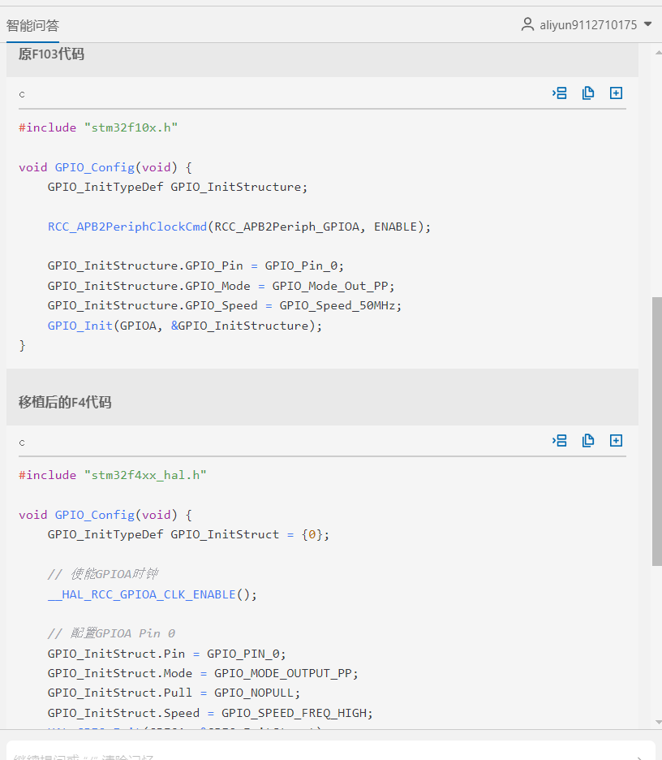

笔者经过灵码辅助后修改代码如下：

```
//////////////////////////////////////////////////////////////////////////////////   
//本程序只供学习使用，未经作者许可，不得用于其它任何用途
//  功能描述   : 1.8寸LCD 4接口演示例程(STM32系列)
/******************************************************************************
//本程序适用与STM32F103C8
//              GND   电源地
//              VCC   接5V或3.3v电源
//              SCL   接PA5（SCL）
//              SDA   接PA7（SDA）
//              RES   接PB0
//              DC    接PB1
//              CS    接PA4 
//                          BL      接PB10
*******************************************************************************/
#ifndef __LCD_DRIVER_H__
#define __LCD_DRIVER_H__

//#include "core_cm4.h"
#include "stdint.h"


/*!< STM32F10x Standard Peripheral Library old types (maintained for legacy purpose) */
#ifndef u8
#define u8 uint8_t
#endif

#ifndef u16
#define u16 uint16_t
#endif

#ifndef u32
#define u32 uint32_t
#endif

#define RED     0xf800
#define GREEN   0x07e0
#define BLUE    0x001f
#define WHITE   0xffff
#define BLACK   0x0000
#define YELLOW  0xFFE0
#define GRAY0   0xEF7D      //灰色0 3165 00110 001011 00101
#define GRAY1   0x8410          //灰色1      00000 000000 00000
#define GRAY2   0x4208          //灰色2  1111111111011111


#define LCD_CTRLA           GPIOA       //定义TFT数据端口
#define LCD_CTRLB           GPIOB       //定义TFT数据端口


#define LCD_SCL         GPIO_PIN_5  //PB13--->>TFT --SCL/SCK
#define LCD_SDA         GPIO_PIN_7  //PB15 MOSI--->>TFT --SDA/DIN
#define LCD_CS          GPIO_PIN_4  //MCU_PB11--->>TFT --CS/CE
                              
#define LCD_LED         GPIO_PIN_10  //MCU_PB9--->>TFT --BL
#define LCD_RS          GPIO_PIN_1  //PB11--->>TFT --RS/DC
#define LCD_RST         GPIO_PIN_0  //PB10--->>TFT --RST

//#define LCD_CS_SET(x) LCD_CTRL->ODR=(LCD_CTRL->ODR&~LCD_CS)|(x ? LCD_CS:0)

//液晶控制口置1操作语句宏定义
#define LCD_SCL_SET     LCD_CTRLA->BSRR=LCD_SCL     
#define LCD_SDA_SET     LCD_CTRLA->BSRR=LCD_SDA    
#define LCD_CS_SET      LCD_CTRLA->BSRR=LCD_CS 
    
#define LCD_LED_SET     LCD_CTRLB->BSRR=LCD_LED   
#define LCD_RS_SET      LCD_CTRLB->BSRR=LCD_RS 
#define LCD_RST_SET     LCD_CTRLB->BSRR=LCD_RST
//液晶控制口置0操作语句宏定义 
#define LCD_SCL_CLR     LCD_CTRLA->BSRR = (uint32_t)LCD_SCL << 16U  
#define LCD_SDA_CLR     LCD_CTRLA->BSRR = (uint32_t)LCD_SDA << 16U   
#define LCD_CS_CLR      LCD_CTRLA->BSRR = (uint32_t)LCD_CS << 16U  
                        
#define LCD_LED_CLR     LCD_CTRLB->BSRR = (uint32_t)LCD_LED << 16U    
#define LCD_RST_CLR     LCD_CTRLB->BSRR = (uint32_t)LCD_RST << 16U    
#define LCD_RS_CLR      LCD_CTRLB->BSRR = (uint32_t)LCD_RS << 16U  


#define LCD_DATAOUT(x) LCD_DATA->ODR=x; //数据输出
#define LCD_DATAIN     LCD_DATA->IDR;   //数据输入

#define LCD_WR_DATA(data){\
LCD_RS_SET;\
LCD_CS_CLR;\
LCD_DATAOUT(data);\
LCD_WR_CLR;\
LCD_WR_SET;\
LCD_CS_SET;\
} 


void LCD_GPIO_Init(void);// 初始化与LCD屏幕连接的GPIO引脚
void Lcd_WriteIndex(u8 Index);// 向LCD写入一个索引值，用于选择LCD的一个寄存器
void Lcd_WriteData(u8 Data);// 向LCD写入一个数据字节
void Lcd_WriteReg(u8 Index,u8 Data);// 向LCD的特定寄存器写入一个数据字节
u16 Lcd_ReadReg(u8 LCD_Reg);// 从LCD的特定寄存器读取一个16位数据
void Lcd_Reset(void);// 复位LCD屏幕，用于初始化LCD之前
void Lcd_Init(void);// 初始化LCD屏幕，设置其工作模式等
void Lcd_Clear(u16 Color);// 用指定颜色清除LCD屏幕
void Lcd_SetXY(u16 x,u16 y);// 设置LCD的当前绘制位置
void Gui_DrawPoint(u16 x,u16 y,u16 Data);// 在LCD屏幕上绘制一个点
unsigned int Lcd_ReadPoint(u16 x,u16 y);// 读取LCD屏幕上指定坐标的颜色值
void Lcd_SetRegion(u16 x_start,u16 y_start,u16 x_end,u16 y_end);// 设置LCD的绘制区域
void LCD_WriteData_16Bit(u16 Data);// 向LCD写入一个16位数据


#endif
```

```
//////////////////////////////////////////////////////////////////////////////////   
//本程序只供学习使用，未经作者许可，不得用于其它任何用途
//  功能描述   : 1.8寸LCD 4接口演示例程(STM32系列)
/******************************************************************************
//本程序适用与STM32F103C8
//              GND   电源地
//              VCC   接5V或3.3v电源
//              SCL   接PA5（SCL）
//              SDA   接PA7（SDA）
//              RES   接PB0
//              DC    接PB1
//              CS    接PA4 
//              BL    接PB10
*******************************************************************************/
#include "stm32f4xx_hal.h"
#include "Lcd_Driver.h"
#include "LCD_Config.h"

//液晶IO初始化配置
void LCD_GPIO_Init(void)
{
//  __HAL_RCC_GPIOA_CLK_ENABLE();
//  __HAL_RCC_GPIOB_CLK_ENABLE();
//  
//  GPIO_InitTypeDef GPIO_InitStructure;
//  GPIO_InitStructure.Pin = GPIO_PIN_0| GPIO_PIN_10| GPIO_PIN_1;
//  GPIO_InitStructure.Speed = GPIO_SPEED_FREQ_MEDIUM;
//  GPIO_InitStructure.Mode = GPIO_MODE_OUTPUT_PP;
//  HAL_GPIO_Init(GPIOB,&GPIO_InitStructure);
//  
//  
//  GPIO_InitStructure.Pin = GPIO_PIN_4| GPIO_PIN_5| GPIO_PIN_7;
//  GPIO_InitStructure.Speed = GPIO_SPEED_FREQ_HIGH;
//  GPIO_InitStructure.Mode = GPIO_MODE_OUTPUT_PP;
//  HAL_GPIO_Init(GPIOA,&GPIO_InitStructure);
}
//向SPI总线传输一个8位数据
void  SPI_WriteData(u8 Data)
{
    unsigned char i=0;
    for(i=8;i>0;i--)
    {
        if(Data&0x80)   
      LCD_SDA_SET; //输出数据
      else LCD_SDA_CLR;
       
      LCD_SCL_CLR;       
      LCD_SCL_SET;
      Data<<=1; 
    }
}

//向液晶屏写一个8位指令
void Lcd_WriteIndex(u8 Index)
{
   //SPI 写命令时序开始
   LCD_CS_CLR;
   LCD_RS_CLR;
     SPI_WriteData(Index);
   LCD_CS_SET;
}

//向液晶屏写一个8位数据
void Lcd_WriteData(u8 Data)
{
   LCD_CS_CLR;
   LCD_RS_SET;
   SPI_WriteData(Data);
   LCD_CS_SET; 
}
//向液晶屏写一个16位数据
void LCD_WriteData_16Bit(u16 Data)
{
   LCD_CS_CLR;
   LCD_RS_SET;
     SPI_WriteData(Data>>8);    //写入高8位数据
     SPI_WriteData(Data);           //写入低8位数据
   LCD_CS_SET; 
}

void Lcd_WriteReg(u8 Index,u8 Data)
{
    Lcd_WriteIndex(Index);
  Lcd_WriteData(Data);
}

void Lcd_Reset(void)
{
    LCD_RST_CLR;
    //delay_ms(100);
    HAL_Delay(100);
    LCD_RST_SET;
    //delay_ms(50);
    HAL_Delay(50);
}

//LCD Init For 1.44Inch LCD Panel with ST7735R.
void Lcd_Init(void)
{   
    LCD_GPIO_Init();
    Lcd_Reset(); //Reset before LCD Init.

    //LCD Init For 1.44Inch LCD Panel with ST7735R.
    Lcd_WriteIndex(0x11);//Sleep exit 
    //delay_ms (120);
    HAL_Delay(120);
        
    //ST7735R Frame Rate
    Lcd_WriteIndex(0xB1); 
    Lcd_WriteData(0x01); 
    Lcd_WriteData(0x2C); 
    Lcd_WriteData(0x2D); 

    Lcd_WriteIndex(0xB2); 
    Lcd_WriteData(0x01); 
    Lcd_WriteData(0x2C); 
    Lcd_WriteData(0x2D); 

    Lcd_WriteIndex(0xB3); 
    Lcd_WriteData(0x01); 
    Lcd_WriteData(0x2C); 
    Lcd_WriteData(0x2D); 
    Lcd_WriteData(0x01); 
    Lcd_WriteData(0x2C); 
    Lcd_WriteData(0x2D); 
    
    Lcd_WriteIndex(0xB4); //Column inversion 
    Lcd_WriteData(0x07); 
    
    //ST7735R Power Sequence
    Lcd_WriteIndex(0xC0); 
    Lcd_WriteData(0xA2); 
    Lcd_WriteData(0x02); 
    Lcd_WriteData(0x84); 
    Lcd_WriteIndex(0xC1); 
    Lcd_WriteData(0xC5); 

    Lcd_WriteIndex(0xC2); 
    Lcd_WriteData(0x0A); 
    Lcd_WriteData(0x00); 

    Lcd_WriteIndex(0xC3); 
    Lcd_WriteData(0x8A); 
    Lcd_WriteData(0x2A); 
    Lcd_WriteIndex(0xC4); 
    Lcd_WriteData(0x8A); 
    Lcd_WriteData(0xEE); 
    
    Lcd_WriteIndex(0xC5); //VCOM 
    Lcd_WriteData(0x0E); 
    
    Lcd_WriteIndex(0x36); //MX, MY, RGB mode 
    Lcd_WriteData(0xC0); 
    
    //ST7735R Gamma Sequence
    Lcd_WriteIndex(0xe0); 
    Lcd_WriteData(0x0f); 
    Lcd_WriteData(0x1a); 
    Lcd_WriteData(0x0f); 
    Lcd_WriteData(0x18); 
    Lcd_WriteData(0x2f); 
    Lcd_WriteData(0x28); 
    Lcd_WriteData(0x20); 
    Lcd_WriteData(0x22); 
    Lcd_WriteData(0x1f); 
    Lcd_WriteData(0x1b); 
    Lcd_WriteData(0x23); 
    Lcd_WriteData(0x37); 
    Lcd_WriteData(0x00);    
    Lcd_WriteData(0x07); 
    Lcd_WriteData(0x02); 
    Lcd_WriteData(0x10); 

    Lcd_WriteIndex(0xe1); 
    Lcd_WriteData(0x0f); 
    Lcd_WriteData(0x1b); 
    Lcd_WriteData(0x0f); 
    Lcd_WriteData(0x17); 
    Lcd_WriteData(0x33); 
    Lcd_WriteData(0x2c); 
    Lcd_WriteData(0x29); 
    Lcd_WriteData(0x2e); 
    Lcd_WriteData(0x30); 
    Lcd_WriteData(0x30); 
    Lcd_WriteData(0x39); 
    Lcd_WriteData(0x3f); 
    Lcd_WriteData(0x00); 
    Lcd_WriteData(0x07); 
    Lcd_WriteData(0x03); 
    Lcd_WriteData(0x10);  
    
    Lcd_WriteIndex(0x2a);
    Lcd_WriteData(0x00);
    Lcd_WriteData(0x00);
    Lcd_WriteData(0x00);
    Lcd_WriteData(0x7f);

    Lcd_WriteIndex(0x2b);
    Lcd_WriteData(0x00);
    Lcd_WriteData(0x00);
    Lcd_WriteData(0x00);
    Lcd_WriteData(0x9f);
    
    Lcd_WriteIndex(0xF0); //Enable test command  
    Lcd_WriteData(0x01); 
    Lcd_WriteIndex(0xF6); //Disable ram power save mode 
    Lcd_WriteData(0x00); 
    
    Lcd_WriteIndex(0x3A); //65k mode 
    Lcd_WriteData(0x05); 
    
    
    Lcd_WriteIndex(0x29);//Display on    
}


/*************************************************
函数名：LCD_Set_Region
功能：设置lcd显示区域，在此区域写点数据自动换行
入口参数：xy起点和终点
返回值：无
*************************************************/
void Lcd_SetRegion(u16 x_start,u16 y_start,u16 x_end,u16 y_end)
{       
    Lcd_WriteIndex(0x2a);
    Lcd_WriteData(0x00);
    Lcd_WriteData(x_start);//Lcd_WriteData(x_start+2);
    Lcd_WriteData(0x00);
    Lcd_WriteData(x_end+2);

    Lcd_WriteIndex(0x2b);
    Lcd_WriteData(0x00);
    Lcd_WriteData(y_start+0);
    Lcd_WriteData(0x00);
    Lcd_WriteData(y_end+1);
    
    Lcd_WriteIndex(0x2c);

}

/*************************************************
函数名：LCD_Set_XY
功能：设置lcd显示起始点
入口参数：xy坐标
返回值：无
*************************************************/
void Lcd_SetXY(u16 x,u16 y)
{
    Lcd_SetRegion(x,y,x,y);
}

    
/*************************************************
函数名：LCD_DrawPoint
功能：画一个点
入口参数：无
返回值：无
*************************************************/
void Gui_DrawPoint(u16 x,u16 y,u16 Data)
{
    Lcd_SetRegion(x,y,x+1,y+1);
    LCD_WriteData_16Bit(Data);

}    

/*****************************************
 函数功能：读TFT某一点的颜色                          
 出口参数：color  点颜色值                                 
******************************************/
unsigned int Lcd_ReadPoint(u16 x,u16 y)
{
  unsigned int Data;
  Lcd_SetXY(x,y);

  //Lcd_ReadData();//丢掉无用字节
  //Data=Lcd_ReadData();
  Lcd_WriteData(Data);
  return Data;
}
/*************************************************
函数名：Lcd_Clear
功能：全屏清屏函数
入口参数：填充颜色COLOR
返回值：无
*************************************************/
void Lcd_Clear(u16 Color)               
{   
   unsigned int i,m;
   Lcd_SetRegion(0,0,X_MAX_PIXEL-1,Y_MAX_PIXEL-1);
   Lcd_WriteIndex(0x2C);
   for(i=0;i<X_MAX_PIXEL;i++)
    for(m=0;m<Y_MAX_PIXEL;m++)
    {   
        LCD_WriteData_16Bit(Color);
    }   
}
```

测试后顺利跑通例程！

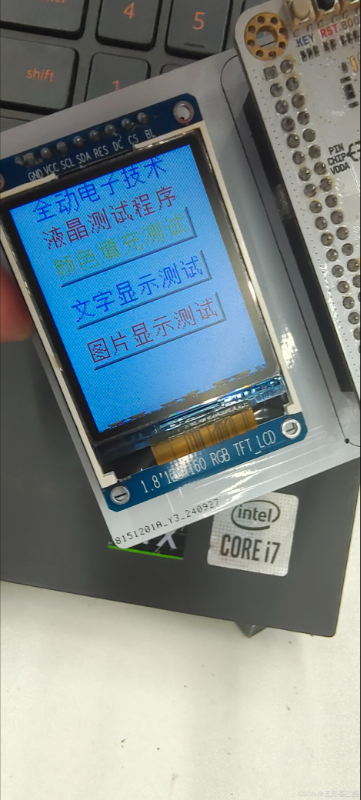

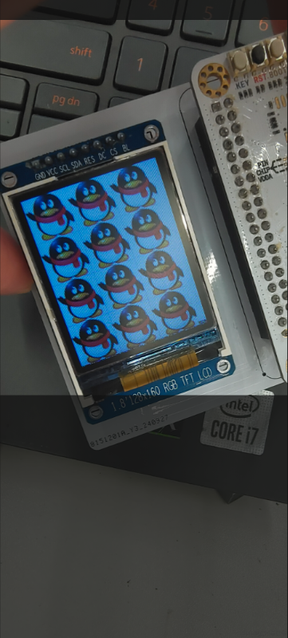

### LVGL框架

通过通义灵码进行框架移植

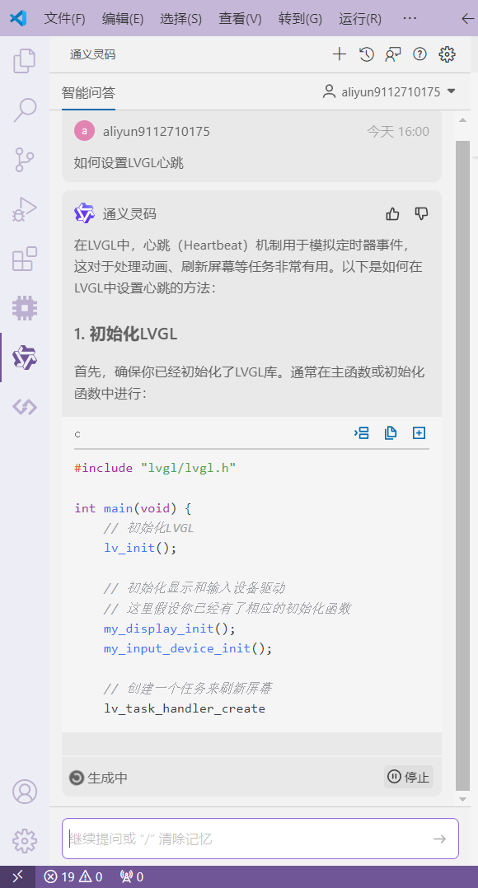

经过两天的奋战后终于不报错了：

```
/* USER CODE END Header */
/* Includes ------------------------------------------------------------------*/
#include "main.h"
#include "tim.h"
#include "gpio.h"

/* Private includes ----------------------------------------------------------*/
/* USER CODE BEGIN Includes */
#include "HeaderConfig.h"
/* USER CODE END Includes */

/* Private typedef -----------------------------------------------------------*/
/* USER CODE BEGIN PTD */

/* USER CODE END PTD */

/* Private define ------------------------------------------------------------*/
/* USER CODE BEGIN PD */
#define USE_LVGL
/* USER CODE END PD */

/* Private macro -------------------------------------------------------------*/
/* USER CODE BEGIN PM */

/* USER CODE END PM */

/* Private variables ---------------------------------------------------------*/

/* USER CODE BEGIN PV */
lv_ui guider_ui;
/* USER CODE END PV */

/* Private function prototypes -----------------------------------------------*/
void SystemClock_Config(void);
/* USER CODE BEGIN PFP */

/* USER CODE END PFP */

/* Private user code ---------------------------------------------------------*/
/* USER CODE BEGIN 0 */

/* USER CODE END 0 */

/**
  * @brief  The application entry point.
  * @retval int
  */
int main(void)
{

  /* USER CODE BEGIN 1 */
    
  /* USER CODE END 1 */

  /* MCU Configuration--------------------------------------------------------*/

  /* Reset of all peripherals, Initializes the Flash interface and the Systick. */
  HAL_Init();

  /* USER CODE BEGIN Init */

  /* USER CODE END Init */

  /* Configure the system clock */
  SystemClock_Config();

  /* USER CODE BEGIN SysInit */

  /* USER CODE END SysInit */

  /* Initialize all configured peripherals */
  MX_GPIO_Init();
  MX_TIM6_Init();
  /* USER CODE BEGIN 2 */
    #ifdef USE_LVGL
    
    
    //lvgl
      lv_init();                             // LVGL 初始化
      lv_port_disp_init();                   // 注册LVGL的显示任务
      lv_port_indev_init();                  // 注册LVGL的触屏检测任务
      HAL_TIM_Base_Start_IT(&htim6);
      
    #else

    #endif
    
    
  /* USER CODE END 2 */

  /* Infinite loop */
  /* USER CODE BEGIN WHILE */
    
    #ifdef USE_LVGL
    //添加Button
//  lv_obj_t *myBtn = lv_btn_create(lv_scr_act());
//  lv_obj_set_pos(myBtn, 10, 10);   
//  lv_obj_set_size(myBtn, 120, 50); 
//  
//  //Button上的文本
//  lv_obj_t *label_btn = lv_label_create(myBtn);
//  lv_obj_align(label_btn,LV_ALIGN_CENTER,0,0);
//  lv_label_set_text(label_btn,"Test");
//  
//  // 独立的标签
//    lv_obj_t *myLabel = lv_label_create(lv_scr_act());             
//    lv_label_set_text(myLabel, "Hello world!");                    
//    lv_obj_align(myLabel, LV_ALIGN_CENTER, 0, 0);                  
//    lv_obj_align_to(myBtn, myLabel, LV_ALIGN_OUT_TOP_MID, 0, -20); 

    //guider
    setup_ui(&guider_ui);
    events_init(&guider_ui);
    #else

    #endif
  while (1)
  {
      #ifdef USE_LVGL
      
        static uint8_t LVGL_Timer_5ms = 0;//任务调度函数的5ms定时
        static int16_t Timer_1000ms = 0;
        HAL_Delay(1-1);
        if(LVGL_Timer_5ms++ >= 5)
        {
            lv_timer_handler();//任务调度函数
            LVGL_Timer_5ms = 0;
        }
            
      #else
        QDTFT_Test_Demo();
      #endif
      
    /* USER CODE END WHILE */

    /* USER CODE BEGIN 3 */
  }
  /* USER CODE END 3 */
}
```

成功点亮个人UI界面

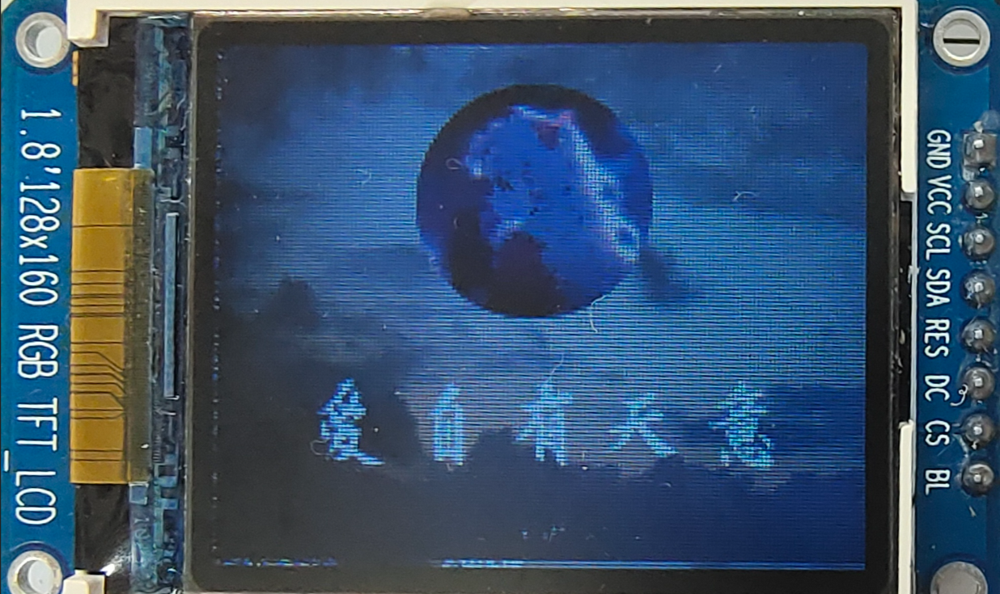

### 项目总结

事实证明，通义灵码可以通过学习现有的示例驱动代码，理解其逻辑和结构，进而生成适用于STM32F4平台的新驱动代码，大大减少了我手动重写代码的时间。在编写LVGL相关代码时，通义灵码可以给我提供实时的代码补全和语法提示，帮助我快速熟悉LVGL框架的API和。而且在移植过程中，通义灵码可以帮助检测代码中的潜在错误，并提供修改建议，避免因硬件平台差异导致的兼容性问题。对于生成的代码，通义灵码可以进一步提供性能优化的建议，确保移植后的代码不仅能够正常运行，还能高效执行。针对LVGL框架和STM32F4平台，通义灵码还推荐了相关的技术文档、教程和社区资源，帮助我尽可能快地解决遇到的技术难题。

对于这个项目，我个人认为通义灵码在某些方面帮助还是非常大的，比如说在错误的修改检查上、在代码思路的提供总结上以及在基础概念的引申阐述上，都是做的非常好，也带给我了很多帮助。足够简洁的界面，足够详细肯定的答案，我相信这已经足够留下更多用户了。同时希望通义灵码能越做越好，在我未来十年乃至三十年内都能够成为辅助我开发的强力工具。

## 四.融合创新，携手同行

目前来说，通义灵码已经支持编程界主流的大部分编程语言（ Java、Python、Go、C#、C/C++、JavaScript、TypeScript、PHP、Ruby、Rust、Scala、Kotlin 等），支持主流的各大IDE（IntelliJ IDEA、PyCharm、GoLand、WebStorm，VSCode等），同时我们也期望日后通义灵码适配性更强，兼容性更广，智能性更高，带领国产AI助手走向全面AI时代，成为开发者手中一把真正的利剑，攻坚克难，向今天所喊出的口号一样，助力开发者“超级个体”的崛起，引领科技走向新征程。

十年问剑两茫茫，君子砥砺前行路！


