# 【通信协议讲解】单片机基础重点通信协议解析与总结（IIC,CAN,MODBUS...）

> 原创 已于 2024-11-03 20:03:48 修改 · 粉丝可见 · 1.6k 阅读 · 31 · 26 · 本内容遵循CC 4.0 BY-SA版权协议 版权声明：本文为博主原创文章，遵循 CC 4.0 BY 版权协议，转载请附上原文出处链接和本声明。 GEO检测 · 编辑
> 文章链接：https://menoking.blog.csdn.net/article/details/142745967

**目录**

[TOC]

## 一.IIC总线

### 基础特性：

> 
> 
> - 两根通信线：SCL、SDA
> 
> - 同步，半双工
> 
> - 总线挂载多设备（一主多从，多主多从）
> 
> 

### 配置特性：

> 
> 
> - SCL、SDA配置为开漏输出
> 
> - SCL、SDA带上拉电阻（一般4.7K）
> 
> 

### 时序特性：

> 
> 
> - 起始条件：SCL:High，SDA:High->Low
> 
> - 终止条件：SCL:High，SDA:Low->High
> 
> - 发送：Master->SCL:Low->SDA高位先行->SCL:High->Slave
> 
> - 接收：Slave->SCL:Low->SDA高位先行->SCL:High->Master
> 
> 

 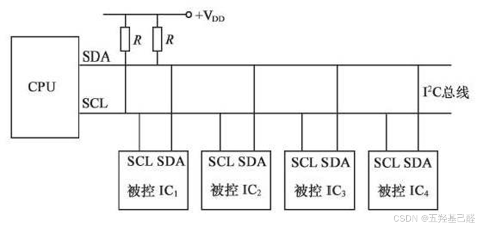

## 二.SPI总线

### 基础特性：

> 
> 
> - 四根通信线：SCK，MOSI，MISO，SS
> 
> - 同步，全双工
> 
> - 支持总线挂载多设备（一主多从）
> 
> 

### 配置特性：

> 
> 
> - 主机引出多条SS控制线，分别接到各从机的SS引脚
> 
> - 输出引脚->推挽输出，输入引脚->浮空或上拉输入
> 
> 

### 时序特性：

> 
> 
> - 起始条件：SS从高电平切换到低电平
> 
> - 终止条件：SS从低电平切换到高电平
> 
> - 三种模式：1.CPOL=0,CPHA=1；2.CPOL=1,CPHA=0；3.CPOL=1,CPHA=1
> 
> 

 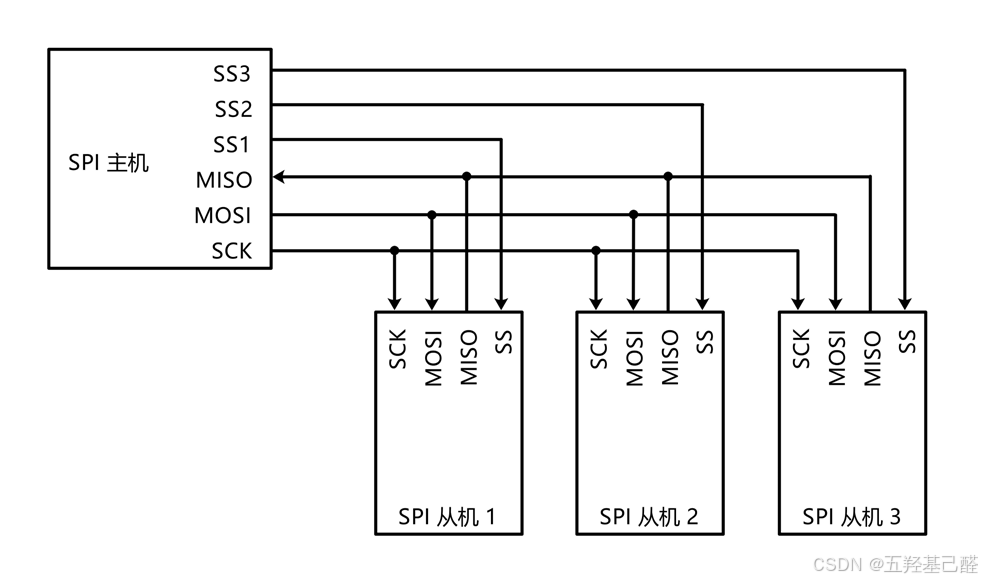

## 三.串口通信

### 基础特性：

> 
> 
> - 两根通信线：TX，RX；一根参考线：GND
> 
> - 同步或异步，全双工
> 
> - 点对点
> 
> 

### 配置特性：

> 
> 
> - 交叉连接
> 
> - 电平标准一致（TTL电平，RS232电平，RS485电平等）
> 
> - 波特率，起始位，数据位，校验位，停止位
> 
> 

### 时序特性：

**正逻辑时：** 

> 
> 
> - 起始位：一位时间的低电平
> 
> - 停止位：一位或多位的高电平
> 
> - 低位先行
> 
> 

**负逻辑时** 起始位和停止位电平相反。

 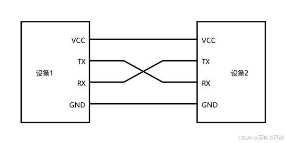

## 四.CAN总线

### 基础特性：

> 
> 
> - 两根通信线：CAN_H、CAN_L
> 
> - 异步，半双工
> 
> - 差分电平
> 
> - 可挂载多设备，多设备同时发送数据时通过仲裁判断先后顺序
> 
> 

### 配置特性：

> 
> 
> - CAN控制器引出的TX和RX与CAN收发器相连，CAN收发器引出的CAN_H和CAN_L分别与总线的CAN_H和CAN_L相连
> 
> - 高速CAN使用闭环网络，CAN_H和CAN_L两端添加120Ω的终端电阻
> 
> - 低速CAN使用开环网络，CAN_H和CAN_L其中一端添加2.2kΩ的终端电阻
> 
> 

 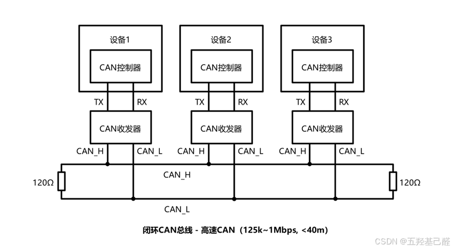

 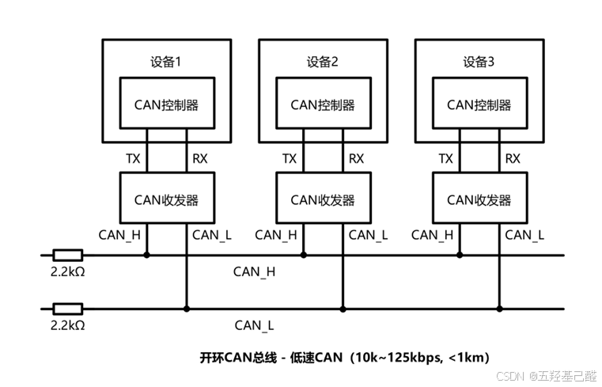

### 时序特性：

> 
> 
> - 11位/29位报文ID
> 
> - 差分信号（VCAN_H-VCAN_L）：
> 
>   - 高速CAN规定：
> 
>     - 电压差为0V时表示逻辑1（隐性电平）
> 
>     - 电压差为2V时表示逻辑0（显性电平）
> 
>   - 低速CAN规定：
> 
>     - 电压差为-1.5V时表示逻辑1（隐性电平）
> 
>     - 电压差为3V时表示逻辑0（显性电平）
> 
> - 帧类型：
> 
>   - 数据帧
> 
>   - 遥控帧
> 
>   - 错误帧
> 
>   - 过载帧
> 
>   - 帧间隔
> 
> - 位填充：
> 
>   - 发送方每发送5个相同电平后，自动追加一个相反电平的填充位，接收方检测到填充位时，会自动移除填充位，恢复原始数据
> 
> 

> 
> 
> - 数据帧：
> 
>   - SOF（Start of Frame）：帧起始，表示后面一段波形为传输的数据位
> 
>   - ID（Identify）：标识符，区分功能，同时决定优先级
> 
>   - RTR（Remote Transmission Request）：远程请求位，区分数据帧和遥控帧
> 
>   - IDE（Identifier Extension）：扩展标志位，区分标准格式和扩展格式
> 
>   - SRR（Substitute Remote Request）：替代RTR，协议升级时留下的无意义位
> 
>   - r0/r1（Reserve）：保留位，为后续协议升级留下空间
> 
>   - DLC（Data Length Code）：数据长度，指示数据段有几个字节
> 
>   - Data：数据段的1~8个字节有效数据
> 
>   - CRC（Cyclic Redundancy Check）：循环冗余校验，校验数据是否正确
> 
>   - ACK（Acknowledgement）：应答位，判断数据有没有被接收方接收
> 
>   - CRC/ACK界定符：为应答位前后发送方和接收方释放总线留下时间
> 
>   - EOF（End of Frame）：帧结束，表示数据位已经传输完毕
> 
>   - 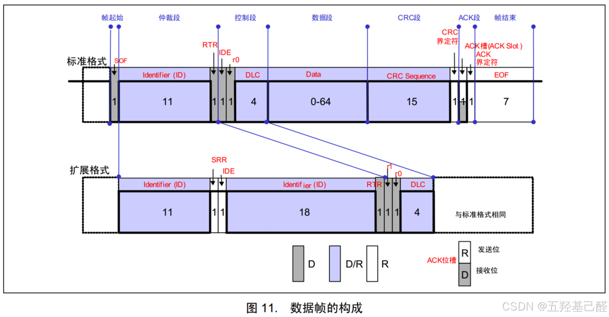
> 
> - 遥控帧：
> 
>   - 无数据段，其他部分与数据帧相同
> 
>   - 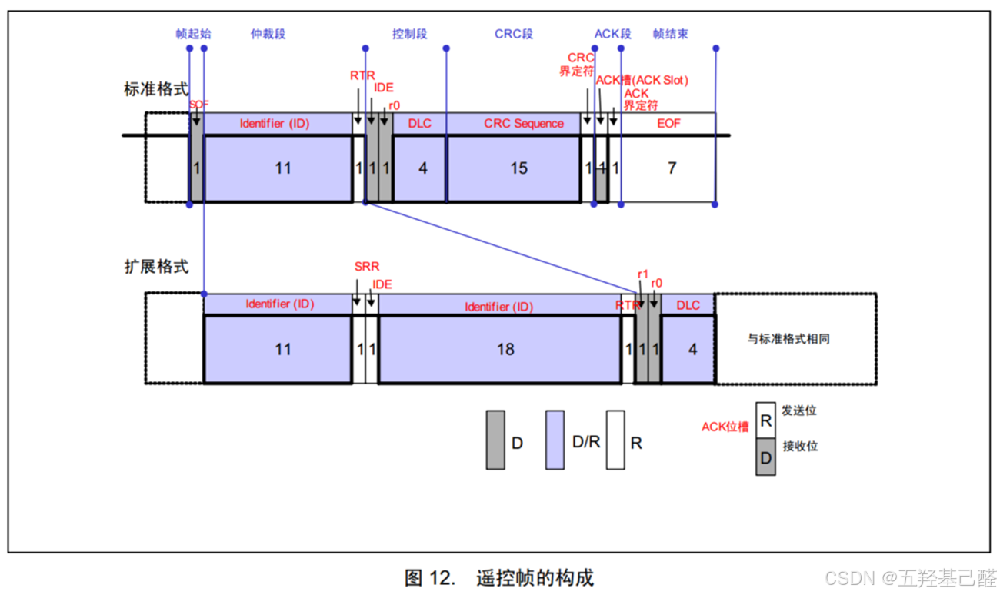
> 
> - 错误帧：
> 
>   - 总线上所有设备都会监督总线的数据，一旦发现“位错误”或“填充错误”或“CRC错误”或“格式错误”或“应答错误” ，这些设备便会发出错误帧来破坏数据，同时终止当前的发送设备
> 
>   - 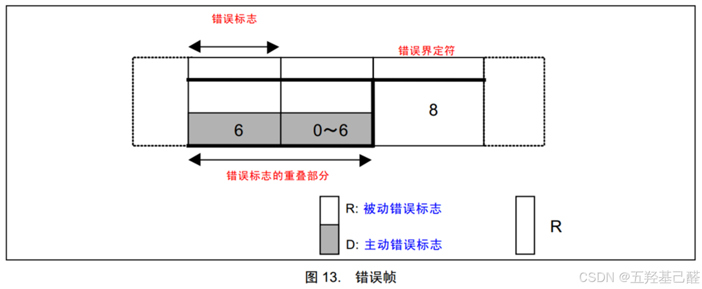
> 
> - 过载帧：
> 
>   - 当接收方收到大量数据而无法处理时，其可以发出过载帧，延缓发送方的数据发送，以平衡总线负载，避免数据丢失
> 
>   - 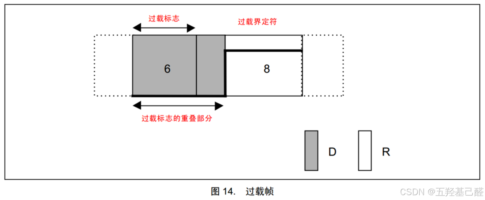
> 
> - 帧间隔：
> 
>   - 将数据帧和远程帧与前面的帧分离开
> 
>   - 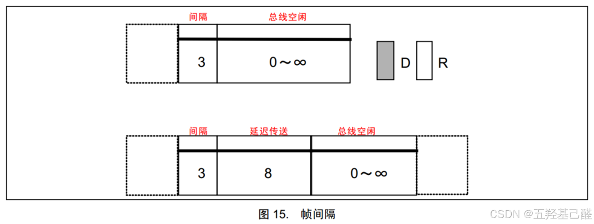
> 
> 

## 五.ModBus总线

### 基础特性：

> 
> 
> - 分类：
> 
>   - `Modbus ASCII：` 基于串行通信的文本协议。
> 
>   - `Modbus RTU` ：基于串行通信的二进制协议。
> 
>   - `Modbus TCP/IP：` 基于以太网的协议。（TCP/IP 协议栈）
> 
>   - Modbus-PLUS：高速现场总线网络。
> 
> - 一主多从，可以有多达247个从设备
> 
> 

### 配置特性：

> 
> 
> - 功能码：公共功能码、用户定义功能码和保留功能码。
> 
>   - 0 类功能码：最常用功能码
> 
>     - | 3 | 读取多寄存器 |
>       |:---:|:---:|
>       | 16 | 写入多寄存器 |
> 
>   - 1 类功能码：
> 
>     - | 1 | 读取线圈 |
>       |:---:|:---:|
>       | 2 | 读取离散量输入 |
>       | 4 | 读取输入寄存器 |
>       | 5 | 写入单个线圈 |
>       | 6 | 写入单个寄存器 |
>       | 7 | 读取异常状态（仅限串行） |
> 
>   - 2 类功能码：
> 
>     - | 15 | 写入多个线圈 |
>       |:---:|:---:|
>       | 20 | 读取文件记录 |
>       | 21 | 写入文件记录 |
>       | 22 | 屏蔽写入寄存器 |
>       | 23 | 读取/写入多个寄存器 |
>       | 24 | 读取 |
> 
> 

### 时序特性：

> 
> 
> - 数据格式：固定长度，由地址、功能码、数据和一个错误校验字段组成。
> 
>   - **帧结构 = 地址 + 功能码+ 数据 + 校验** 
> 
>     - **​​​** **地址域** ：1 字节，即从机设备地址，通常 1-247 为有效地址，0 为广播地址
> 
>     - **功能码** ：1 字节，表明主机请求数据的类型。
> 
>     - **数据** ：N 字节，包含寄存器地址和寄存器数据等。
> 
>     - **差错校验** ：对数据进行冗余校验的结果，CRC 或 LRC。
> 
> 

 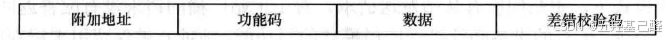

---

如有错误，感谢指正

2024.10.11