# 【通信软件项目】基于QT6的ESP32波形发生器（GUI显示+串口通信）

> 原创 已于 2025-06-05 23:01:18 修改 · 粉丝可见 · 1.4k 阅读 · 34 · 9 · 本内容遵循CC 4.0 BY-SA版权协议 版权声明：本文为博主原创文章，遵循 CC 4.0 BY 版权协议，转载请附上原文出处链接和本声明。 GEO检测 · 编辑
> 文章链接：https://menoking.blog.csdn.net/article/details/148197519

## 一.项目背景

本项目为笔者通信软件课程设计作品，使用QT开发GUI界面对ESP32进行输出波形控制，使用串口通信进行数据传输，在上位机显示输出波形。最终效果如图：

 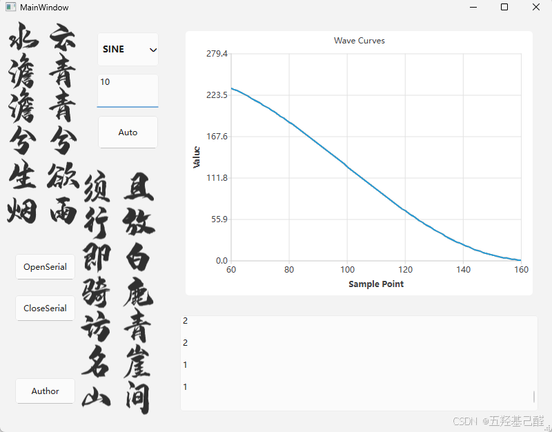

 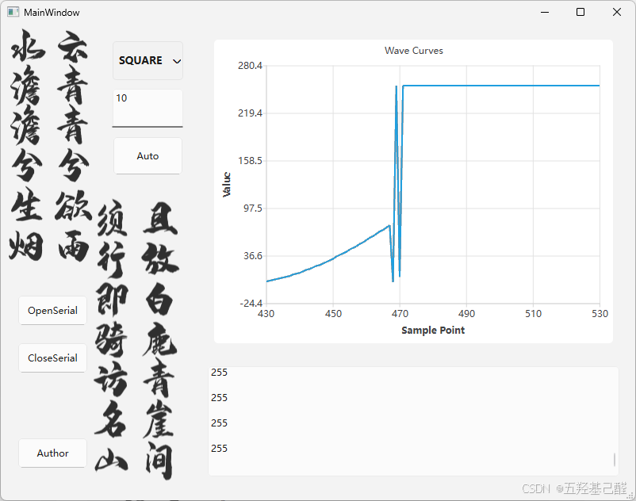

 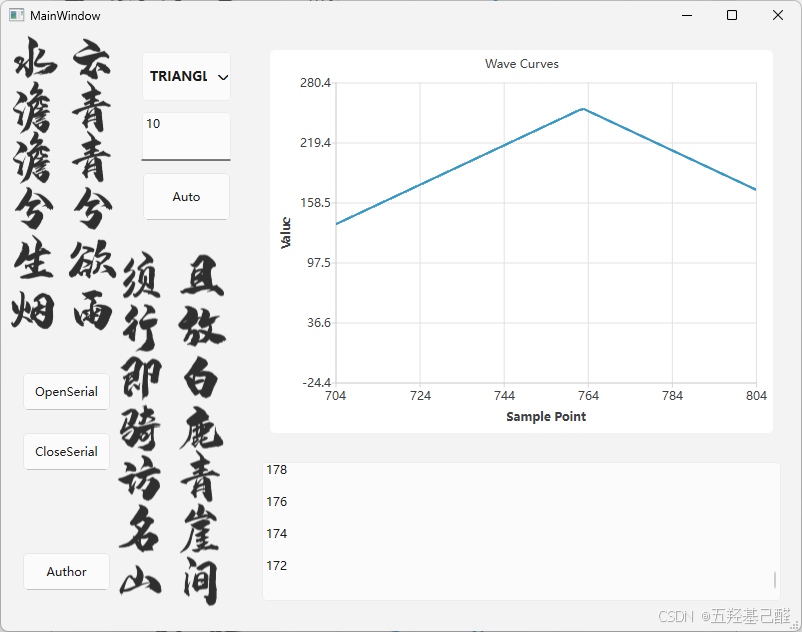

> ### Github项目地址
> 
> 有需要点点Star自取：
> 
> [menoking/WaveformGeneratorBasedOnESP32: The WaveformGenerator based on QT6 and ESP32](https://github.com/menoking/WaveformGeneratorBasedOnESP32) 

## 二.项目总览

本次工程总体目录构建如下：

 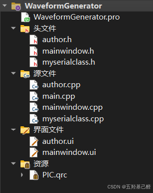

GUI界面设计：

 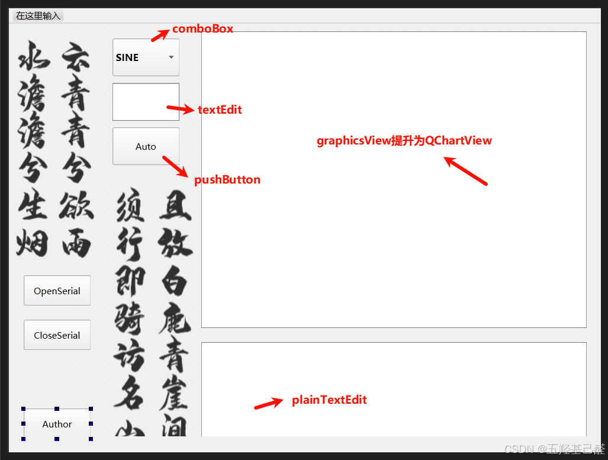

其中QGraphicsView提升：

 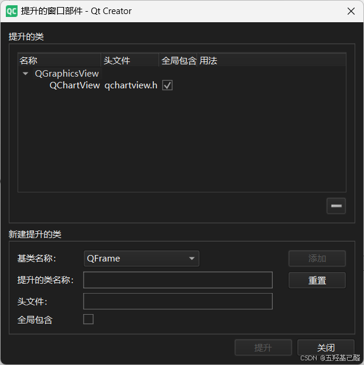

作者介绍界面：

 

## 三.工程构建

新建一个QT窗口应用：

 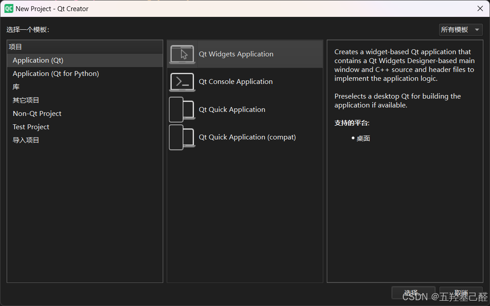

创建完成后如图：

 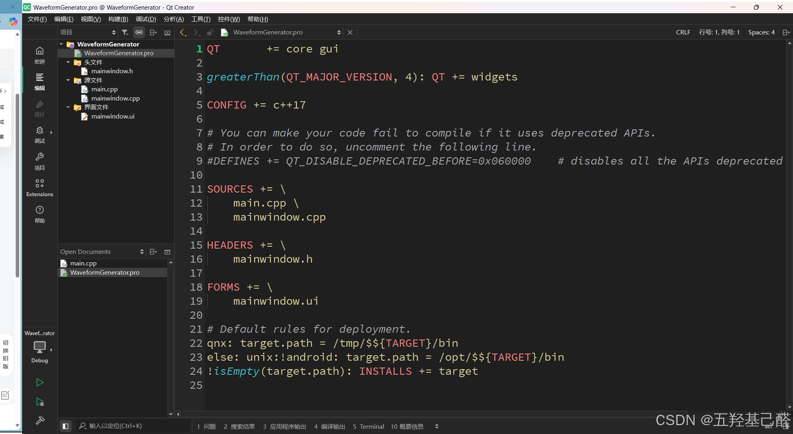

创建完主窗口后这里笔者选择创建一个设计师类窗口来设计作者说明栏对应author.cpp，这步读者也可以选择不添加：

 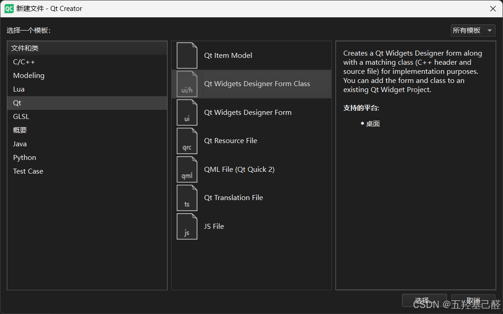

 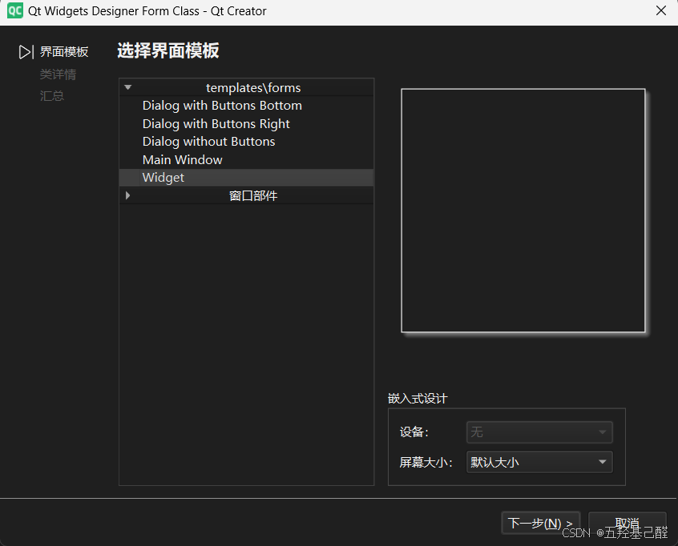

 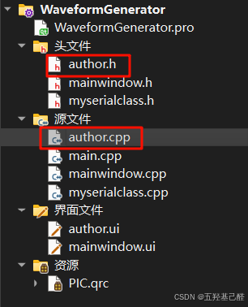

## 四.详细工程代码

本工程主要使用两个库serialport和charts，所以首先要在.pro项目文件中添加这两个库：

```cpp
QT       += serialport
QT       += charts
```

> 注意：在引用这两个库前要确保自己安装成功了这两个库，详细安装步骤可以参考以下视频： [QT快速入门 | Qt6.8.3 下载、安装、使用教程，Qt+vs2022开发环境搭建，添加组件和开始菜单工具介绍！_哔哩哔哩_bilibili](https://www.bilibili.com/video/BV16iL3zHEJc/?spm_id_from=333.337.search-card.all.click&vd_source=60b7e4846ff8eebbaf6efd46ab66b45a) 

 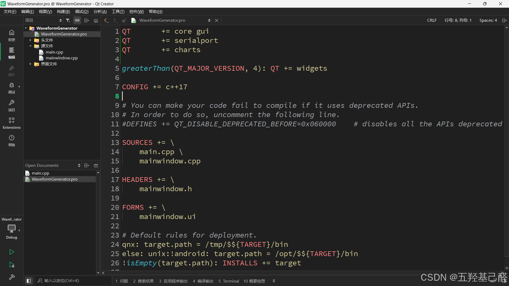

#### QT端GUI代码

##### 串口类

这里设置串口类其实也没太大必要，里面就调用了串口库中的发送函数和接收函数。

###### myserialclass.cpp

```cpp
#include "myserialclass.h"
 
MySerialClass::MySerialClass(QObject *parent)
    : QObject{parent}
{}
 
// 发送数据函数
void MySerialClass::SendData(QSerialPort &serial, const QByteArray &data) {
    serial.write(data);
}
 
// 接收数据槽函数
void MySerialClass::OnReadyRead() {
    if (QSerialPort *serial = qobject_cast<QSerialPort*>(sender())) {
        QByteArray data = serial->readAll();
        qDebug() << "接收到数据：" << data;
        emit newDataReceived(data); // 发送新数据信号
    }
}
```

###### myserialclass.h

```cpp
#ifndef MYSERIALCLASS_H
#define MYSERIALCLASS_H
 
#include <QObject>
#include <QDebug>
#include <QSerialPort>
#include <QSerialPortInfo>
 
 
class MySerialClass : public QObject
{
    Q_OBJECT
public:
    explicit MySerialClass(QObject *parent = nullptr);
 
signals:
    void newDataReceived(const QByteArray &data);//接受新数据信号
public slots:
    void SendData(QSerialPort &serial, const QByteArray &data);
    void OnReadyRead();
 
private:
 
 
};
 
#endif // MYSERIALCLASS_H
```

##### 主窗口

###### mainwindow.cpp

```cpp
#include "mainwindow.h"
#include "ui_mainwindow.h"
 
MainWindow::MainWindow(QWidget *parent)
    : QMainWindow(parent)
    , ui(new Ui::MainWindow)
    , serialPort(nullptr)
    , mySerialObject(nullptr)
    , serialThread(nullptr)
    , chart(nullptr)
    , series(nullptr)
    , axisX(nullptr)
    , axisY(nullptr)
    , xRange(100.0)     // 默认显示100个点
    , xValue(0.0)
    , maxDataPoints(1000) // 最大存储1000个点
{
    ui->setupUi(this);
 
    initSerialPort(); // 初始化串口
    initDispData();//初始化显示控件
    initPlotChart();  // 初始化图表
}
 
MainWindow::~MainWindow()
{
    on_pushButton_CloseSerial_clicked(); // 确保关闭串口
    delete ui;
 
    // 清理图表资源
    if (chart) delete chart;
}
 
//初始化串口
void MainWindow::initSerialPort()
{
    // 获取可用串口
    QList<QSerialPortInfo> portList = QSerialPortInfo::availablePorts();
    if (portList.isEmpty()) {
        qWarning() << "未找到可用串口!";
        return;
    }
 
    // 选择第一个可用串口
    QSerialPortInfo portInfo = portList.first();
    qDebug() << "使用串口: " << portInfo.portName();
 
    // 创建串口对象
    serialPort = new QSerialPort(this);
    serialPort->setPortName(portInfo.portName());
    serialPort->setBaudRate(QSerialPort::Baud115200);
    serialPort->setDataBits(QSerialPort::Data8);
    serialPort->setParity(QSerialPort::NoParity);
    serialPort->setStopBits(QSerialPort::OneStop);
}
 
// 初始化文本显示控件
void MainWindow::initDispData(void)
{
    ui->plainTextEdit_dispData->setReadOnly(true);  // 设置为只读
    ui->plainTextEdit_dispData->setMaximumBlockCount(1000); // 限制最大行数
    ui->plainTextEdit_dispData->setWordWrapMode(QTextOption::NoWrap); // 禁用自动换行
}
 
// 初始化图表
void MainWindow::initPlotChart()
{
    // 创建图表
    chart = new QChart();
    chart->setTitle("Wave Curves");
    chart->legend()->hide(); // 隐藏图例
    chart->setMargins(QMargins(5, 5, 5, 5)); // 减少边距
 
    // 创建数据系列 - 使用抗锯齿和优化设置
    series = new QLineSeries();
    series->setName("Data");
    series->setUseOpenGL(true); // 启用OpenGL加速
    chart->addSeries(series);
 
    // 创建坐标轴 - 初始范围设为0-100
    axisX = new QValueAxis;
    axisX->setRange(0, xRange);
    axisX->setLabelFormat("%.0f");
    axisX->setTitleText("Sample Point");
    axisX->setTickCount(6); // 减少刻度数量
 
    axisY = new QValueAxis;
    axisY->setRange(0, 100); // 初始范围0-100
    axisY->setTitleText("Value");
    axisY->setTickCount(6);
 
    // 将坐标轴添加到图表
    chart->addAxis(axisX, Qt::AlignBottom);
    chart->addAxis(axisY, Qt::AlignLeft);
 
    // 将系列附加到坐标轴
    series->attachAxis(axisX);
    series->attachAxis(axisY);
 
    // 设置图表视图
    ui->graphicsView_Plot->setChart(chart);
    ui->graphicsView_Plot->setRenderHint(QPainter::Antialiasing, true);
    ui->graphicsView_Plot->setRenderHint(QPainter::SmoothPixmapTransform, true);
 
    // 设置视口更新策略
    ui->graphicsView_Plot->setViewportUpdateMode(QGraphicsView::FullViewportUpdate);
}
 
 
//打开串口按钮槽函数
void MainWindow::on_pushButton_OpenSerial_clicked()
{
    if (!serialPort) {
        qWarning() << "串口未初始化!";
        return;
    }
 
    // 打开串口
    if (!serialPort->open(QIODevice::ReadWrite)) {
        // 添加详细的错误信息
        QString errorMsg = "打开串口失败! 原因: ";
        switch (serialPort->error()) {
        case QSerialPort::PermissionError:
            errorMsg += "没有权限访问串口";
            break;
        case QSerialPort::DeviceNotFoundError:
            errorMsg += "设备未找到";
            break;
        case QSerialPort::OpenError:
            errorMsg += "设备已被其他程序占用";
            break;
        case QSerialPort::NotOpenError:
            errorMsg += "设备未打开";
            break;
        default:
            errorMsg += serialPort->errorString();
        }
        qWarning() << errorMsg;
 
        // 输出可用串口列表
        qDebug() << "可用串口列表:";
        foreach (const QSerialPortInfo &info, QSerialPortInfo::availablePorts()) {
            qDebug() << "端口:" << info.portName()
                << "描述:" << info.description()
                << "制造商:" << info.manufacturer();
        }
        return;
    }
 
    // 创建线程和串口处理对象
    serialThread = new QThread(this);
    mySerialObject = new MySerialClass();
 
    // 移动到线程
    mySerialObject->moveToThread(serialThread);
 
    // 连接数据接收信号槽
    connect(serialPort, &QSerialPort::readyRead,
            mySerialObject, &MySerialClass::OnReadyRead);
 
 
    // 连接数据接收信号到显示槽函数
    connect(mySerialObject, &MySerialClass::newDataReceived,
            this, &MainWindow::onSerialDataReceived);
 
    // 启动线程
    serialThread->start();
    qDebug() << "串口已打开!";
}
 
//关闭串口按钮槽函数
void MainWindow::on_pushButton_CloseSerial_clicked()
{
    if (serialPort && serialPort->isOpen()) {
        serialPort->close();
    }
 
    if (serialThread) {
        serialThread->quit();
        serialThread->wait();
        delete serialThread;
        serialThread = nullptr;
    }
 
    if (mySerialObject) {
        delete mySerialObject;
        mySerialObject = nullptr;
    }
 
    qDebug() << "串口已关闭!";
 
    // 关闭串口时重置图表
    if (series) {
        series->clear();
        xValue = 0;
        axisX->setRange(0, xRange);
    }
}
 
 
//自动Auto:缩放功能+选择波形确定
void MainWindow::on_pushButton_Auto_clicked()
{
    if(WaveType == "SINE")
    {
        mySerialObject->SendData(*serialPort,QByteArray(1,1));
    }
    else if(WaveType == "TRIANGLE")
    {
        mySerialObject->SendData(*serialPort,QByteArray(1,2));
    }
    else if(WaveType == "SQUARE")
    {
        mySerialObject->SendData(*serialPort,QByteArray(1,3));
    }
 
    mySerialObject->SendData(*serialPort,QByteArray(1,WaveFrequence.toInt()));
 
    if (series && series->count() > 0) {
        double minY = std::numeric_limits<double>::max();
        double maxY = std::numeric_limits<double>::lowest();
 
        // 查找最小和最大值
        const auto points = series->points();
        for (const QPointF &point : points) {
            if (point.y() < minY) minY = point.y();
            if (point.y() > maxY) maxY = point.y();
        }
 
        // 添加10%的余量
        double margin = (maxY - minY) * 0.1;
        if (margin == 0) margin = 1; // 防止除以零
 
        axisY->setRange(minY - margin, maxY + margin);
    }
}
 
//选择波形槽函数
void MainWindow::on_comboBox_WaveType_currentTextChanged(const QString &arg1)
{
    WaveType = ui->comboBox_WaveType->currentText();
}
 
// 数据显示槽函数
void MainWindow::onSerialDataReceived(const QByteArray &data)
{
    // 将数据转换为字符串（按ASCII显示）
    QString text = QString::fromLatin1(data);
    ui->plainTextEdit_dispData->appendPlainText(text);
    QTextCursor cursor = ui->plainTextEdit_dispData->textCursor();
    cursor.movePosition(QTextCursor::End);
    ui->plainTextEdit_dispData->setTextCursor(cursor);
 
    // 解析数据并添加到图表
    // 假设数据格式为 "123\n" 或 "123,"
    static QString dataBuffer; // 用于累积不完整的数据
    dataBuffer += text;
 
    // 分割数据
    QStringList numberStrings;
    int lastIndex = 0;
 
    // 更健壮的数据分割方法
    for (int i = 0; i < dataBuffer.length(); i++) {
        QChar c = dataBuffer.at(i);
        if (!c.isDigit() && c != '-' && c != '.') {
            if (i > lastIndex) {
                numberStrings.append(dataBuffer.mid(lastIndex, i - lastIndex));
            }
            lastIndex = i + 1;
        }
    }
 
    // 处理剩余数据
    if (lastIndex < dataBuffer.length()) {
        dataBuffer = dataBuffer.mid(lastIndex);
    } else {
        dataBuffer.clear();
    }
 
    // 转换并添加数据点
    foreach (const QString &numStr, numberStrings) {
        bool ok;
        double value = numStr.toDouble(&ok);
 
        if (ok) {
            // 添加数据点到序列
            if (series) {
                // 自动调整Y轴范围
                if (value > axisY->max()) {
                    axisY->setMax(value * 1.1); // 增加10%余量
                }
                if (value < axisY->min()) {
                    axisY->setMin(value * 1.1);
                }
 
                series->append(xValue, value);
 
                // 如果点数超过最大值，移除最旧的点
                if (series->count() > maxDataPoints) {
                    series->removePoints(0, series->count() - maxDataPoints);
                }
 
                // 更新X轴显示范围
                if (xValue > xRange) {
                    axisX->setRange(xValue - xRange, xValue);
                }
 
                xValue += 1.0;
            }
        }
    }
}
 
//输入频率
void MainWindow::on_textEdit_Frequence_textChanged()
{
    WaveFrequence = ui->textEdit_Frequence->toPlainText();
}
 
 
//显示作者界面(可选)
void MainWindow::on_pushButton_clicked()
{
    authorui->show();
}
```

###### mainwindow.h

```cpp
#ifndef MAINWINDOW_H
#define MAINWINDOW_H
 
#include <QMainWindow>
 
#include <QThread>
#include <QSerialPort>
#include <QSerialPortInfo>
#include <QtCharts>
#include <QChartView>
#include <QLineSeries>
#include <QValueAxis>
#include "myserialclass.h"
#include <author.h>
 
QT_BEGIN_NAMESPACE
namespace Ui {
class MainWindow;
}
QT_END_NAMESPACE
 
QT_BEGIN_NAMESPACE
class QChartView;
class QChart;
QT_END_NAMESPACE
 
 
class MainWindow : public QMainWindow
{
    Q_OBJECT
 
public:
    MainWindow(QWidget *parent = nullptr);
    ~MainWindow();
    void initSerialPort();//初始化串口
    void initDispData();//初始化数据显示列表
    void initPlotChart();  // 初始化图表
private slots:
    void on_pushButton_OpenSerial_clicked();//打开串口
    void on_pushButton_CloseSerial_clicked();//关闭串口
    void onSerialDataReceived(const QByteArray &data);//接收数据槽函数
    void on_pushButton_Auto_clicked();//Auto键槽函数
    void on_comboBox_WaveType_currentTextChanged(const QString &arg1);//下拉框槽函数
    void on_pushButton_clicked();//作者
    void on_textEdit_Frequence_textChanged();//频率文本框槽函数
 
private:
    Ui::MainWindow *ui;
    Author* authorui = new Author;//作者窗口对象
 
    //串口收发数据线程相关成员
    QSerialPort *serialPort;       // 改为指针成员
    MySerialClass *mySerialObject; // 串口处理对象
    QThread *serialThread;         // 串口线程
    QString WaveType;//存储波形类型
    QString WaveFrequence;//储存波形频率
 
    // 图表相关成员
    QChart *chart;
    QLineSeries *series;
    QValueAxis *axisX;
    QValueAxis *axisY;
    double xRange;      // X轴显示范围
    double xValue;      // 当前X轴位置
    int maxDataPoints;  // 最大数据点数
};
#endif // MAINWINDOW_H
```

##### 作者介绍

###### author.cpp

```cpp
#include "author.h"
#include "ui_author.h"
 
Author::Author(QWidget *parent)
    : QWidget(parent)
    , ui(new Ui::Author)
{
    ui->setupUi(this);
}
 
Author::~Author()
{
    delete ui;
}
 
//关闭按钮
void Author::on_pushButton_clicked()
{
    this->close();
}
```

#### ESP32端

```cpp
#include "driver/dac.h"
 
// 波形类型枚举
enum WaveformType {
  SINE_WAVE,
  SQUARE_WAVE,
  TRIANGLE_WAVE
};
 
// 波形参数配置
#define SAMPLE_POINTS 256   // 预计算样本点数
#define DEFAULT_FREQ  1.0   // 默认频率(Hz)
#define DEFAULT_AMP   127   // 默认振幅(0-127)
 
const int dacPin = 25;      // DAC1 对应 GPIO25
uint8_t waveform[SAMPLE_POINTS]; // 波形样本数组
 
// 全局变量
WaveformType currentWaveform = SINE_WAVE;//当前曲线类型
float currentFrequency = DEFAULT_FREQ;
int amplitude = DEFAULT_AMP;
unsigned long lastSampleTime = 0;
unsigned long sampleInterval = 0;
unsigned int sampleIndex = 0;
 
 
void setup() {
  // put your setup code here, to run once:
  // 初始化DAC
  dac_output_enable(DAC_CHANNEL_1);//初始化ADC通道
  
  // 默认生成正弦波
  setWaveform(SINE_WAVE);
  setFrequency(DEFAULT_FREQ);
 
  Serial.begin(115200);
  Serial.print("Hello!");
 
}
 
void loop() {
  // put your main code here, to run repeatedly:
  // 持续输出正弦波
  outputWave();//输出波形
  RecData();//接收串口数据
}
 
//串口数码接收函数
void RecData(void)
{
  int incomingByte = 0;
  if (Serial.available() > 0) 
  {
    // read the incoming byte:
    incomingByte = Serial.read();
    // say what you got:
    if(incomingByte == 0x01)
      setWaveform(SINE_WAVE);
    else if(incomingByte == 0x02)
      setWaveform(TRIANGLE_WAVE);
    else if(incomingByte == 0x03)
      setWaveform(SQUARE_WAVE);
    else
    {
      setFrequency((float)incomingByte);
    }
    Serial.println(incomingByte);
  }
}
 
// 生成正弦波样本
void generateSineWave() {
  for (int i = 0; i < SAMPLE_POINTS; i++) {
    float angle = 2 * PI * i / SAMPLE_POINTS;
    float value = sin(angle) * amplitude + 128; // 偏移到0-255范围
    waveform[i] = (uint8_t)constrain(value, 0, 255);
  }
}
 
// 生成方波样本
void generateSquareWave() {
  int halfPoint = SAMPLE_POINTS / 2;
  for (int i = 0; i < SAMPLE_POINTS; i++) {
    waveform[i] = (i < halfPoint) ? (128 + amplitude) : (128 - amplitude);
  }
}
 
// 生成三角波样本
void generateTriangleWave() {
  int halfPoint = SAMPLE_POINTS / 2;  // 128
  for (int i = 0; i < SAMPLE_POINTS; i++) {
    float value;
    if (i < halfPoint) {
      // 上升段：从最小值到最大值
      value = 128 - amplitude + (2.0f * amplitude * i) / halfPoint;
    } else {
      // 下降段：从最大值到最小值
      value = 128 + amplitude - (2.0f * amplitude * (i - halfPoint)) / halfPoint;
    }
    // 确保值在0-255范围内
    waveform[i] = (uint8_t)constrain(value, 0, 255);
  }
  
  // 可选：添加平滑处理
  for (int i = 1; i < SAMPLE_POINTS - 1; i++) {
    waveform[i] = (waveform[i-1] + 2*waveform[i] + waveform[i+1]) / 4;
  }
}
 
// 设置波形类型
void setWaveform(WaveformType type) {
  currentWaveform = type;
  
  switch(type) {
    case SINE_WAVE:
      generateSineWave();
      break;
    case SQUARE_WAVE:
      generateSquareWave();
      break;
    case TRIANGLE_WAVE:
      generateTriangleWave();
      break;
  }
  
  // 重置样本索引
  sampleIndex = 0;
}
 
// 设置输出频率
void setFrequency(float freq) {
  currentFrequency = freq;
  // 计算样本间隔(微秒)
  sampleInterval = (unsigned long)(1000000.0 / (currentFrequency * SAMPLE_POINTS));
}
 
// 设置振幅
void setAmplitude(int amp) {
  amplitude = constrain(amp, 0, 127);
  // 重新生成当前波形
  setWaveform(currentWaveform);
}
 
//输出波形函数
//确定一个输出最短间隔：每个间隔使用dac输出当前波类型数组
void outputWave(void)
{
  unsigned long currentTime = micros();
  
  if (currentTime - lastSampleTime >= sampleInterval) {
    lastSampleTime = currentTime;
    
    // 输出当前样本
    dac_output_voltage(DAC_CHANNEL_1, waveform[sampleIndex]);
    //打印数据
    printf("%d\n",waveform[sampleIndex]);
 
    delay(100);
    // 移动到下一个样本
    sampleIndex = (sampleIndex + 1) % SAMPLE_POINTS;
  }
}
```

## 五.总结

本项目由于时间紧迫，只做了较为简单的功能，各位读者若有兴趣可在此项目上进行二次开发，感谢阅读。