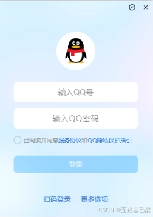
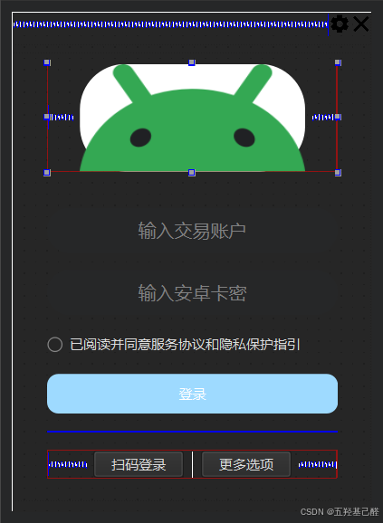
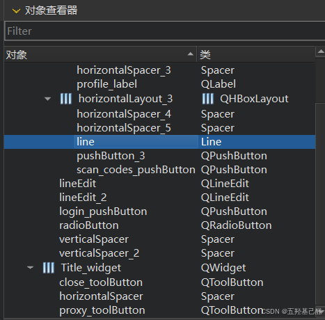
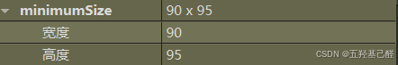
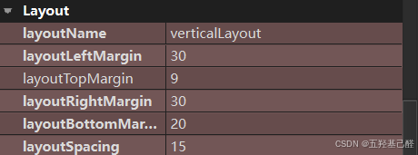
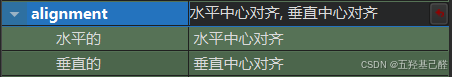
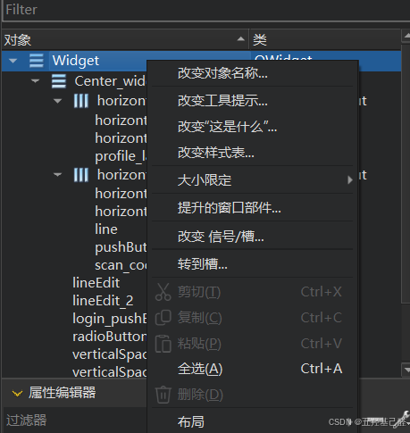
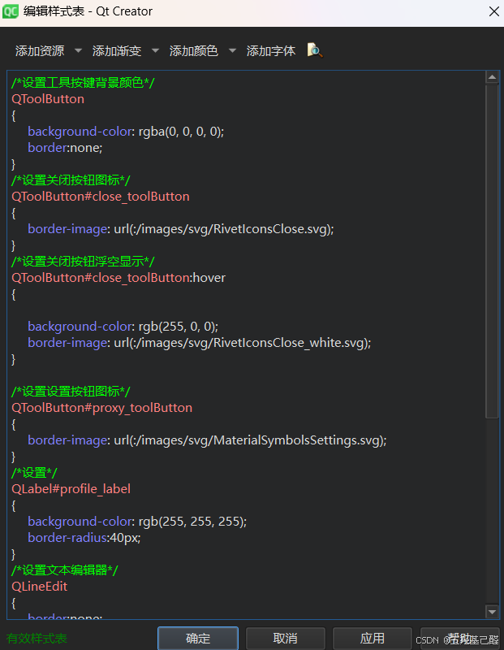
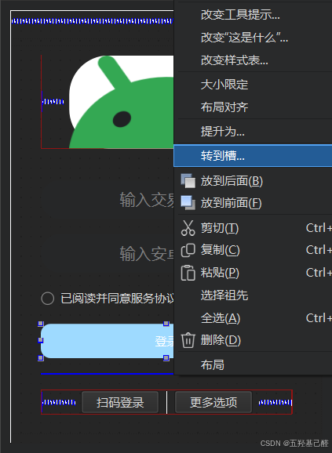

# 【项目开发】QT简单练习之QQ登录界面模仿

> 原创 已于 2024-11-03 20:07:45 修改 · 粉丝可见 · 1.2k 阅读 · 16 · 12 · 本内容遵循CC 4.0 BY-SA版权协议 版权声明：本文为博主原创文章，遵循 CC 4.0 BY 版权协议，转载请附上原文出处链接和本声明。 GEO检测 · 编辑
> 文章链接：https://menoking.blog.csdn.net/article/details/142371347

**目录**

[TOC]


## 一.背景说明

为了进一步加深对QT开发的理解，在学习完基础操作之后要进行一个简单的练习。

## 二.开发流程

像往常创建一个窗口项目，这里对于练习来说Cmake和qmake都无所谓，可以任选其一，但是选择基类时要选择QWidget。

> 这里对这三种类型都进行说明：
> 
> 1. **QMainWindow** ：
> 
>    - QMainWindow 是一个为典型应用程序窗口提供主框架的类。
> 
>    - 它通常包含菜单栏、工具栏、状态栏和中心部件（如 QTextEdit 或 QWebView）。
> 
>    - 它还管理窗口的大小、最大化、最小化和关闭等标准窗口功能。
> 
>    - 适用于主应用程序窗口。
> 
> 2. **QWidget** ：
> 
>    - QWidget 是所有用户界面类的基类。
> 
>    - 它是一个轻量级的窗口或控件的基类，没有菜单栏、工具栏或状态栏。
> 
>    - QWidget 可以作为顶层窗口，也可以嵌入到其他窗口或控件中。
> 
>    - 适用于自定义窗口或对话框。
> 
> 3. **QDialog** ：
> 
>    - QDialog 是一个提供对话框窗口的基类。
> 
>    - 它通常用于模态对话框，可以包含按钮、输入字段和其他控件。
> 
>    - QDialog 可以有返回值，通常用于输入数据或显示信息。
> 
>    - 适用于对话框窗口。
> 
> 

双击widget.ui文件，进入设计师界面，调整窗口大小，使其达到类似于我们要设计的目标界面大小：

 

向其中拖入控件进行设计。

> 常用控件如下：
> 
> **Vertical Layout:** 垂直布局
> 
> **Horizontal Layout:** 水平布局
> 
> **Horizontal Spacer:** 水平间隔
> 
> **Vertical Spacer:** 垂直间隔
> 
> **Push Button:** 按钮
> 
> **Tool Button:** 工具按钮
> 
> **Radio Button:** 单选按钮
> 
> **Line Edit:** 行编辑框
> 
> **Label:** 标签

笔者这里换了一些不同的图标。

同时将整体布局划分为上面的两个设置图标和下面整块的登录中心界面两个区域，分别拖VerticalLayout和Horizontal Layout分开设计。

 

首先在对象查看器中对控件对象进行修改名称，修改成简单易懂适合的

 

这里修改控件的大小

 

在属性栏Layout栏中修改控件的间距。

 

这里可以修改编辑框内容文本的位置

 

右键Widget主窗口对象，选择样式栏可以对样式进行定制化设置

 

 

参考如下：

```cobol
/*设置工具按键背景颜色*/
QToolButton
{
	background-color: rgba(0, 0, 0, 0);
	border:none;
}
/*设置关闭按钮图标*/
QToolButton#close_toolButton
{
	border-image: url(:/images/svg/RivetIconsClose.svg);
}
/*设置关闭按钮浮空显示*/
QToolButton#close_toolButton:hover
{
	
	background-color: rgb(255, 0, 0);
	border-image: url(:/images/svg/RivetIconsClose_white.svg);
}
 
/*设置设置按钮图标*/
QToolButton#proxy_toolButton
{
	border-image: url(:/images/svg/MaterialSymbolsSettings.svg);
}
/*设置*/
QLabel#profile_label
{
	background-color: rgb(255, 255, 255);
	border-radius:40px;
}
/*设置文本编辑器*/
QLineEdit
{
	border:none;
	border-radius:20px;
}
/*设置按钮*/
QPushButton
{
	background-color: rgba(0, 0, 0);
}
/*设置登录框*/
QPushButton#login_pushButton
{
	color: rgb(255, 255, 255);
	background-color: rgb(158, 218, 255);
	border:none;
	border-radius:10px;
}
```

选中特定对象，右键转到槽可以自动生成对应槽函数键入代码

 

widget.cpp内部：

```cpp
#include "widget.h"
#include "./ui_widget.h"
//构造函数
Widget::Widget(QWidget *parent)
    : QWidget(parent)
    , ui(new Ui::Widget)
{
    ui->setupUi(this);
 
    //调用setWindowFlag方法，传入FramelessWindowHint参数，用于取消边框和标题栏
    setWindowFlag(Qt::FramelessWindowHint);
    //调用事件过滤器
    this->installEventFilter(new DragWidgetFilter(this));
}
//析构函数
Widget::~Widget()
{
    delete ui;
}
//当检测到勾选同意协议之后，登录按钮变色
void Widget::on_radioButton_clicked()
{
    if(ui->radioButton->isChecked())
    {
        ui->login_pushButton->setStyleSheet("background-color:rgb(0,141,235)");
        ui->login_pushButton->setEnabled(true);
    }
    else
    {
        ui->login_pushButton->setStyleSheet("background-color:rgb(158,218,255)");
        ui->login_pushButton->setEnabled(false);
    }
}
 
//点击登录按钮后输出
void Widget::on_login_pushButton_clicked()
{
    qDebug()<<"登录";
}
 
//点击关闭按钮后关闭窗口
void Widget::on_close_toolButton_clicked()
{
    this->close();
}
```

widget.h内容：

```cpp
#ifndef WIDGET_H
#define WIDGET_H
 
#include <QWidget>
#include <QEvent>
#include <QMouseEvent>
 
QT_BEGIN_NAMESPACE
namespace Ui {
class Widget;
}
QT_END_NAMESPACE
 
class Widget : public QWidget
{
    Q_OBJECT
 
public:
    Widget(QWidget *parent = nullptr);
    ~Widget();
 
private slots:
    void on_radioButton_clicked();
 
    void on_login_pushButton_clicked();
 
    void on_close_toolButton_clicked();
 
private:
    Ui::Widget *ui;
};
 
//主要完成事件过滤，当鼠标拖动时窗口跟随移动
class DragWidgetFilter : public QObject
{
public:
    DragWidgetFilter(QObject* parent = nullptr)
        : QObject(parent), isDragging(false) {}//构造函数
 
    //这里override是高速编译器重写基类中的重名方法
    bool eventFilter(QObject* object, QEvent* event) override
    {
        //dynamic_cast<>()是动态类型转换操作符
        //这里将object对象转换为QWidget*类型并赋值给w
        auto w = dynamic_cast<QWidget*>(object);
        if (!w)
        {
            return false;
        }
 
        //匹配传入的event下的type()方法传出的值
        switch (event->type())
        {
        //鼠标点击了
        case QEvent::MouseButtonPress:
        {
            auto ev = dynamic_cast<QMouseEvent*>(event);
            if (!ev || ev->button() != Qt::LeftButton)
            {
                return false;
            }
            isDragging = true;
            startPos = ev->globalPosition().toPoint();
            windowPos = w->frameGeometry().topLeft();
        } break;
        //鼠标移动了
        case QEvent::MouseMove: {
            auto ev = dynamic_cast<QMouseEvent*>(event);
            if (!ev || !(ev->buttons() & Qt::LeftButton) || !isDragging)
            {
                return false;
            }
            const QPoint currentPos = ev->globalPosition().toPoint();
            const QPoint diff = currentPos - startPos;
            const QPoint newWindowPos = windowPos + diff;
            // Optionally check if new position is within screen boundaries
            // before calling move.
            w->move(newWindowPos);
        } break;
        //鼠标松开
        case QEvent::MouseButtonRelease:
        {
            auto ev = dynamic_cast<QMouseEvent*>(event);
            if (ev && ev->button() == Qt::LeftButton && isDragging)
            {
                isDragging = false;
            }
        } break;
 
        default:
            break;
        }
        //当匹配不到上面任何一个类型时，则调用基类的eventFilter函数
        return QObject::eventFilter(object, event);
    }
 
private:
    bool isDragging;
    QPoint startPos;
    QPoint windowPos;
};
 
#endif // WIDGET_H
```

---

未完待续。。。