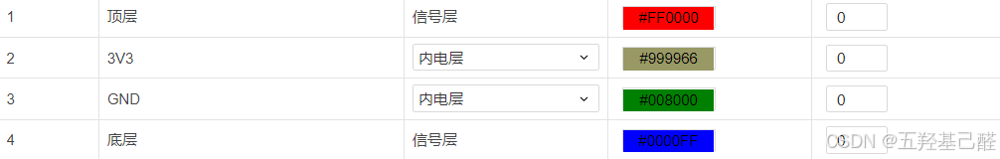
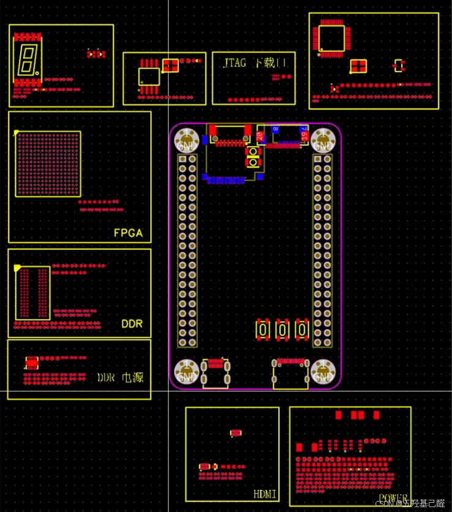
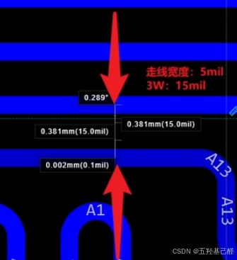
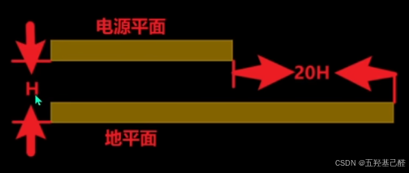
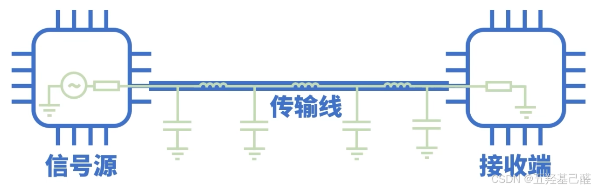
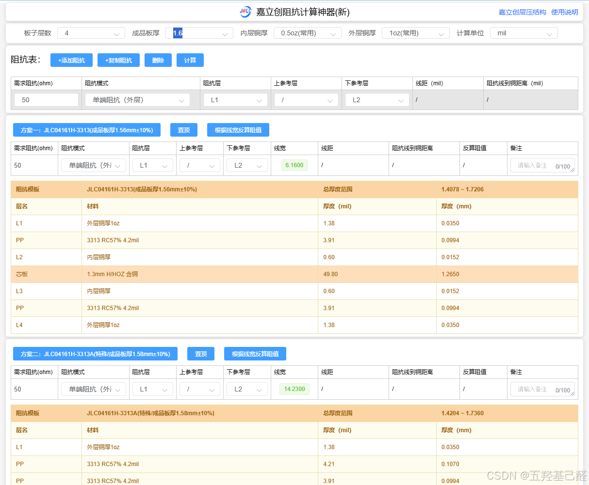
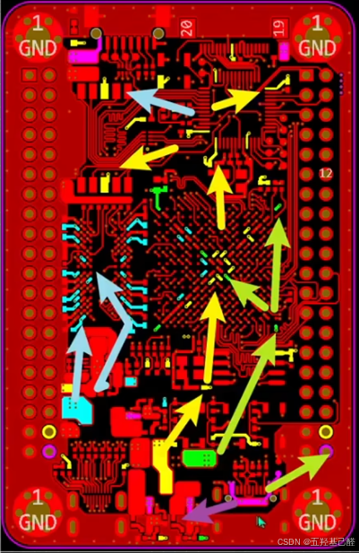
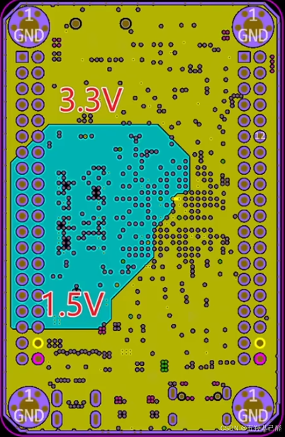
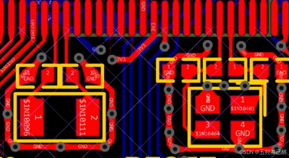
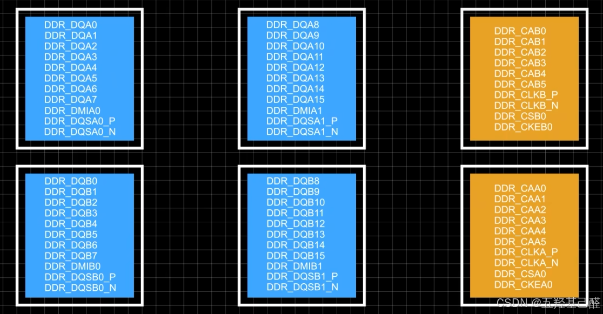

# 【高速PCB设计】高速PCB设计入门之基础知识总结

> 原创 已于 2026-01-17 00:02:36 修改 · 公开 · 1.2k 阅读 · 28 · 25 · 本内容遵循CC 4.0 BY-SA版权协议 版权声明：本文为博主原创文章，遵循 CC 4.0 BY 版权协议，转载请附上原文出处链接和本声明。 GEO检测 · 编辑
> 文章链接：https://menoking.blog.csdn.net/article/details/145659362

## 一.定义

> **高速PCB设计** ：指能够支持高速数字信号、高速模拟信号传输的电路板设计。高速PCB设计在材料选择、布局设计、布线设计等方面都有特殊要求，以确保信号在传输过程中的完整性和稳定性。在高速系统中，高频噪声会产生辐射进而产生干扰、反射以及串扰等问题。与平常设计的低速板不同的是，为了避免这些高频信号产生扰动，我们需要按照一定规则来设计高速PCB。（当信号在电路板上的传输时间超过信号上升时间的1/3时（例如信号0.3ns跳变，导线长度超过约2cm*），就必须按高速PCB设计。）

优势：

- 电源滤波，均匀分配电源，降低系统噪声

- 匹配信号线，减少反射

- 降低走线间串扰

- 减小地弹效应

- 阻抗匹配

## 二.基础知识

### 1.分层

对于四、六及更高层的多层板来说，我们需要为电源和地专门分配内电层，主要是为信号层提供一个稳定的参考平面，减少电源噪声，降低电磁干扰。

 

> 这里注意：
> 
> - **信号层** ：也是正片层，pcb 信号层是同顶层、底层布线相同的铜导电层，只不过是夹在顶层和底层之间的布线层。
> 
> - **内电层** ：也叫平面层或负片层，是内部电源和地层（并通过通孔与各层贯通的层），内电层使用“线条”图元进行分割。负片效果：凡是画线条的地方印刷板的敷铜被清除，没有画线条的地方敷铜反而被保留。放置在这些层面上的走线或其他对象是无铜的区域，也即这个工作层是负片的。嘉立创EDA的内电层绘制时是负片方式绘制，但在输出制造文件Gerber时是正片输出，请留意。
> 
> 

### 2.布局

布局一定要严格分模块分区域布局，要同时兼顾功能模块以及供电区域划分。

- 按功能划分：供电电源，DDR，USB接口，Flash等。

- 按供电区域划分：5V，3.3V，1.5V，GND等。

 

### 3.3W规则

信号线的中心间距不少于3倍线宽时，则可保证70%的电场不互相干扰，称为3W规则。一般信号线间距足够大时，可以减少信号线之间的串扰。

当满足2W间距时，可保证50%的电场不互相干扰。如果要达到98%的电场不互相干扰，则需使用10W间距。

 

### 4.20H原则

将电源层相对于地层内缩，使电场只在接地层的范围内传导。其中，一个H（电源和地之间的介质厚度）为单位，内缩20H可将70%的电场限制在接地层边沿内。若内缩100H则可将
98%的电场限制在内。

内缩原因是电源层和地层之间的电场是变化的，在板子的边缘会向外辐射电磁干扰，将电源层内缩，可以让电场只在接地层的范围内传导，有效提高了EMC（电磁兼容）。一般，在PCB设计时把电源层比地层内缩1mm或者必须≥20mi1,优先40mi1,基本就可必满足20H的原则。

 

### 5.阻抗匹配

#### 原理

在设计低速板时我们一般不会考虑信号线的阻抗对信号速率的影响，但在高速PCBLayout中必须考虑阻抗对信号速率的影响。

在一个标准通信模型中，信号源、传输线以及接收端内部都会产生一定的寄生电阻、电容以及电感，它们对信号传输产生的阻碍作用即为阻抗。当信号在这个系统中传输时，如果相邻的部分阻抗不一致就会造成信号在接触点的反射，进而影响信号质量。

为了信号传输的质量，我们在设计电路时必须保证信号源、传输线以及接收端的阻抗要保持基本一致，即阻抗匹配。

 

#### 策略

一般情况下，器件的阻抗由厂家给出，在数据手册中会有标注，而我们只需要对照信号源与接收端标定的阻抗来设计传输线的阻抗即可。

在 [嘉立创阻抗计算](https://tools.jlc.com/jlcTools/index.html#/impedanceCalculatenew?spm=PCB.Homepage.functionbar.1003) 中可以很方便的计算我们所需要的走线宽度。同时要记住阻抗与走线长度无关，但与其它因素，如宽度、铜厚及层数等因素都有关系。

**注：这里计算出的结果会因制版厂的不同而有差别，这里只给出嘉立创的示例！** 

 

### 6.电源层分割

首先要先分析清楚电源的具体流向，调整布局尽量让电源分块分布，然后根据区块合理划分电源。

> 注意：
> 
> 在 **嘉立创** 中，内电层需要用折线来分割，不能使用导线，且分割完成之后需要手动重建一次内电层或快捷键Shift+B重建所有铺铜。且，分割内电层绘制的线条需是一个 **完整的闭合回路** 。

 

 

### 7.晶振区域处理

- 晶振电路走线应尽可能短，非必要不打过孔连接；

- 在晶振走线周围通过GND过孔进行包围（包地）；

- 晶振区域同层不铺铜皮，可以使用禁止铺铜区域进行隔离，其他层可以铺铜，但晶振区域所有层都最好净空，不允许有其余走线经过。

 

### 8.DDR部分处理

- 信号分组：一般分为数据线和地址线两种，每种按一字节的单位划分组，如每组包含八个数据线，代表8位，即一字节。

  - 同组同层：同一组数据线线要走在同一层，地址线做不到同层没有太大影响

- 阻抗匹配：一般来说，在DDR走线中，规定单端阻抗50Ω；差分信号阻抗为100Ω（通常需要确保走线的差分阻抗保持在90Ω到110Ω之间）。

- 同组等长：在满足以上条件走通信号线后再考虑等长，可以先保持最长的走线不动，再依次调整其它短线做蛇形走线等长处理。

- 3W规则

- 差分线包地

 

## 四.参考文献

[90分钟，入门6层板设计_哔哩哔哩_bilibili](https://www.bilibili.com/video/BV1QvrYYpETc/?spm_id_from=333.788.videopod.sections&vd_source=60b7e4846ff8eebbaf6efd46ab66b45a) 

[PCB布线-高速 PCB 设计指南 – 吴川斌的博客](https://www.mr-wu.cn/high-speed-pcb-design-routing/) 

[新手入门高速PCB？先搞清楚什么是阻抗匹配。_哔哩哔哩_bilibili](https://www.bilibili.com/video/BV1rP411n7xE?spm_id_from=333.788.videopod.sections&vd_source=60b7e4846ff8eebbaf6efd46ab66b45a) 

[高速PCB并不神秘！一起画一块带有DDR4的开发板_哔哩哔哩_bilibili](https://www.bilibili.com/video/BV13C6HYsECR?spm_id_from=333.788.videopod.sections&vd_source=60b7e4846ff8eebbaf6efd46ab66b45a) 