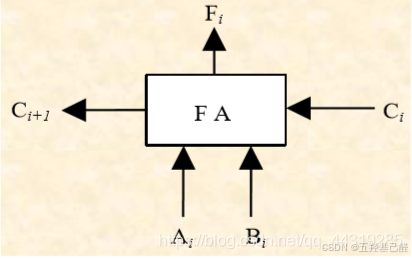
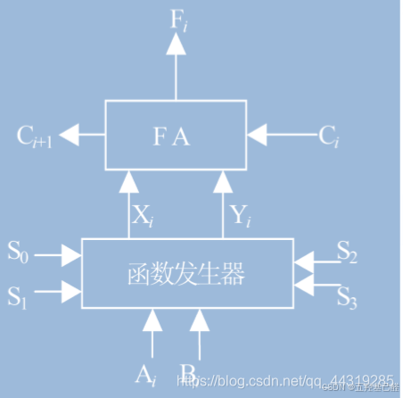
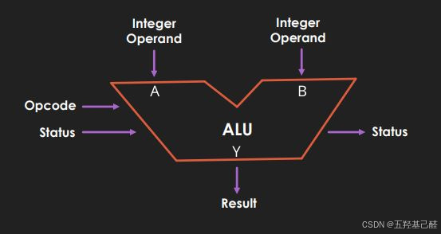

# 基于ARM的嵌入式原理与应用：ALU的功能与特点

> 原创 已于 2024-10-08 18:15:24 修改 · 粉丝可见 · 1.2k 阅读 · 6 · 6 · 本内容遵循CC 4.0 BY-SA版权协议 版权声明：本文为博主原创文章，遵循 CC 4.0 BY 版权协议，转载请附上原文出处链接和本声明。 GEO检测 · 编辑
> 文章链接：https://menoking.blog.csdn.net/article/details/142753350

**目录**

[TOC]

## 一.定义

我们知道，一个CPU由控制单元CU（Control Unit），算数/逻辑运算单元ALU（Arithmetic Logic Unit）和存储单元MU（Memory Unit）三大部分组成。而我们的ALU在CPU里则主要进行数据的算数运算和逻辑运算。它是计算机中负责运算的“大脑”，能够处理加法、减法、乘法、除法等基本算术运算，以及与、或、非、异或等逻辑运算。ALU还能执行一些辅助运算，如移位和求补操作。

> 
> 
> - 命名：算术逻辑单元（Arithmetic&Logic Unit），简称ALU
> 
> - 组成：ALU有2个单元，算术单元（Arithmetic Unit）和逻辑单元（Logic Unit），算术单元负责计算机里的所有数字操作
> 
> - 作用：计算机中负责运算的组件，处理数字/逻辑的最基本单元
> 
> 

## 二.功能

- **算术运算** ：ALU能够执行基本的算术运算，包括加法、减法、乘法和除法。在许多ALU设计中，还可以处理更复杂的运算，如求模、增量（加一）和减量（减一）等。

- **逻辑运算** ：ALU执行逻辑运算，如与（AND）、或（OR）、非（NOT）、异或（XOR）等。这些运算通常用于条件判断和位操作。

- **移位操作** ：ALU可以进行位序列的左移（SHL）和右移（SHR），以及算术移位。

- **比较操作** ：ALU能够比较两个数值的大小，并设置相应的标志（如进位标志、零标志、符号标志等）以指示比较结果。

## 三.结构

构成ALU最基本的构件是一位全加器（两个数相加，接受受低位进位，输出结果和向高位的进位）

 

一位全加器+函数发生器可以构成一位全功能全加器，不仅可以进行算数运算还可以进行逻辑运算

 

由一位全功能全加器经过复合、级联、优化设计得到实际中的ALU

 

## 四.特点

1. **并行处理能力** ：ALU能够同时对多个位进行操作，这使得它能够快速处理数据。

2. **高速度** ：由于ALU是CPU执行运算的核心部分，因此它通常设计得非常快速，以适应高速的数据处理需求。

3. **固定操作周期** ：ALU执行运算通常在一个或几个时钟周期内完成，保证了运算的稳定性和可预测性。

4. **有限的操作集** ：虽然ALU能执行多种类型的运算，但它的操作集是固定的，这意味着它只能执行那些在硬件中预先定义的操作。

5. **数据宽度** ：ALU的数据宽度通常与CPU的字长相同，例如32位、64位等，这决定了ALU一次可以处理的数据量。

6. **标志寄存器** ：ALU的操作结果常常会影响标志寄存器中的特定位，这些标志可以用于后续的决策过程，如跳转指令的条件判断。

7. **可编程性** ：ALU的操作可以通过指令来控制，这使得它可以灵活地执行各种不同的运算任务。

## 五.实例说明

> 假设 R2 = 5, R3 = 3
> 
> 指令: ADD R1, R2, R3
> 
> 步骤:
> 1. CU 获取指令 ADD R1, R2, R3
> 2. CU 解码指令，识别操作和寄存器
> 3. CU 从寄存器文件获取 R2 和 R3 的值（5 和 3）
> 4. ALU 执行加法运算: 5 + 3 = 8
> 5. ALU 将结果 8 发送给 CU
> 6. CU 将结果 8 写入 R1
> 7. ALU 设置标志位（如果没有溢出，则进位标志为0，结果不为零，所以零标志为0）
> 8. CU 更新 PSW 中的标志位
> 9. CU 准备执行下一条指令

